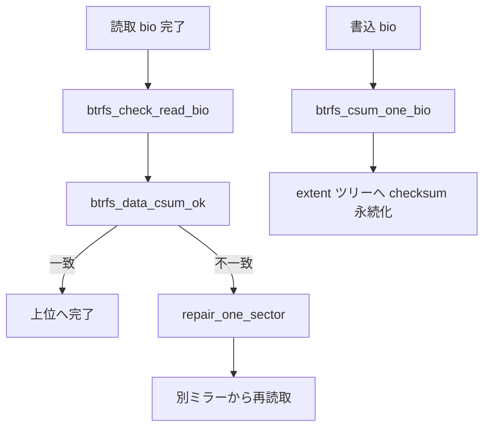

# 第16章 btrfs の checksum と read repair

> **本章で読むソース**
>
> - [`include/uapi/linux/btrfs_tree.h` L481-L484](https://github.com/gregkh/linux/blob/v6.18.38/include/uapi/linux/btrfs_tree.h#L481-L484)
> - [`fs/btrfs/file-item.c` L801-L833](https://github.com/gregkh/linux/blob/v6.18.38/fs/btrfs/file-item.c#L801-L833)
> - [`fs/btrfs/bio.c` L548-L550](https://github.com/gregkh/linux/blob/v6.18.38/fs/btrfs/bio.c#L548-L550)
> - [`fs/btrfs/bio.c` L213-L261](https://github.com/gregkh/linux/blob/v6.18.38/fs/btrfs/bio.c#L213-L261)
> - [`fs/btrfs/bio.c` L168-L204](https://github.com/gregkh/linux/blob/v6.18.38/fs/btrfs/bio.c#L168-L204)
> - [`fs/btrfs/inode.c` L3409-L3447](https://github.com/gregkh/linux/blob/v6.18.38/fs/btrfs/inode.c#L3409-L3447)
> - [`fs/btrfs/ctree.c` L1528-L1538](https://github.com/gregkh/linux/blob/v6.18.38/fs/btrfs/ctree.c#L1528-L1538)

## この章の狙い

btrfs のデータとメタデータ **checksum**、読取時の検証、不一致時の **read repair** 起動を追う。
RAID ミラー選択や scrub の全体走査は第17章で扱う。

## 前提

- [btrfs の CoW と extent 管理](13-btrfs-cow-extent.md)
- [btrfs の transaction、tree-log、recovery](14-btrfs-transaction-tree-log-recovery.md)

## メタデータブロックの checksum

ツリーブロックヘッダ先頭は super block と同型の4フィールドを持ち、先頭が `csum` である。

[`include/uapi/linux/btrfs_tree.h` L481-L484](https://github.com/gregkh/linux/blob/v6.18.38/include/uapi/linux/btrfs_tree.h#L481-L484)

```c
struct btrfs_header {
	/* These first four must match the super block */
	__u8 csum[BTRFS_CSUM_SIZE];
	/* FS specific uuid */
```

メタデータ読取は `btrfs_read_extent_buffer` が checksum を検証する。

[`fs/btrfs/ctree.c` L1528-L1538](https://github.com/gregkh/linux/blob/v6.18.38/fs/btrfs/ctree.c#L1528-L1538)

```c
		ret2 = btrfs_read_extent_buffer(tmp, &check);
		if (ret2) {
			ret = ret2;
			goto out;
		}

		if (ret == 0) {
			ASSERT(!tmp_locked);
			*eb_ret = tmp;
			tmp = NULL;
		}
		goto out;
```

## 書き込み時のデータ checksum

`btrfs_csum_one_bio` は書き込み bio のセクター単位 checksum を計算し、ordered extent に紐づける。
非同期パスでは workqueue で計算を遅延できる。

[`fs/btrfs/file-item.c` L801-L833](https://github.com/gregkh/linux/blob/v6.18.38/fs/btrfs/file-item.c#L801-L833)

```c
int btrfs_csum_one_bio(struct btrfs_bio *bbio, bool async)
{
	struct btrfs_ordered_extent *ordered = bbio->ordered;
	struct btrfs_inode *inode = bbio->inode;
	struct btrfs_fs_info *fs_info = inode->root->fs_info;
	struct bio *bio = &bbio->bio;
	struct btrfs_ordered_sum *sums;
	unsigned nofs_flag;

	nofs_flag = memalloc_nofs_save();
	sums = kvzalloc(btrfs_ordered_sum_size(fs_info, bio->bi_iter.bi_size),
		       GFP_KERNEL);
	memalloc_nofs_restore(nofs_flag);

	if (!sums)
		return -ENOMEM;

	sums->logical = bio->bi_iter.bi_sector << SECTOR_SHIFT;
	sums->len = bio->bi_iter.bi_size;
	INIT_LIST_HEAD(&sums->list);
	bbio->sums = sums;
	btrfs_add_ordered_sum(ordered, sums);

	if (!async) {
		csum_one_bio(bbio, &bbio->bio.bi_iter);
		return 0;
	}
	init_completion(&bbio->csum_done);
	bbio->async_csum = true;
	bbio->csum_saved_iter = bbio->bio.bi_iter;
	INIT_WORK(&bbio->csum_work, csum_one_bio_work);
	schedule_work(&bbio->csum_work);
	return 0;
```

bio 層からの呼び出しは設定に応じて同期または非同期を選ぶ。

[`fs/btrfs/bio.c` L548-L550](https://github.com/gregkh/linux/blob/v6.18.38/fs/btrfs/bio.c#L548-L550)

```c
	return btrfs_csum_one_bio(bbio, true);
#else
	return btrfs_csum_one_bio(bbio, false);
```

## repair_one_sector と mirror 再読取

checksum 不一致時、`repair_one_sector` は別ミラーへ repair bio を投げ、`btrfs_end_repair_bio` が成功データを壊れたミラーへ書き戻す。

[`fs/btrfs/bio.c` L213-L261](https://github.com/gregkh/linux/blob/v6.18.38/fs/btrfs/bio.c#L213-L261)

```c
static struct btrfs_failed_bio *repair_one_sector(struct btrfs_bio *failed_bbio,
						  u32 bio_offset,
						  phys_addr_t paddr,
						  struct btrfs_failed_bio *fbio)
{
	struct btrfs_inode *inode = failed_bbio->inode;
	struct btrfs_fs_info *fs_info = inode->root->fs_info;
	struct folio *folio = page_folio(phys_to_page(paddr));
	const u32 sectorsize = fs_info->sectorsize;
	const u32 foff = offset_in_folio(folio, paddr);
	const u64 logical = (failed_bbio->saved_iter.bi_sector << SECTOR_SHIFT);
	struct btrfs_bio *repair_bbio;
	struct bio *repair_bio;
	int num_copies;
	int mirror;

	ASSERT(foff + sectorsize <= folio_size(folio));
	btrfs_debug(fs_info, "repair read error: read error at %llu",
		    failed_bbio->file_offset + bio_offset);

	num_copies = btrfs_num_copies(fs_info, logical, sectorsize);
	if (num_copies == 1) {
		btrfs_debug(fs_info, "no copy to repair from");
		failed_bbio->bio.bi_status = BLK_STS_IOERR;
		return fbio;
	}

	if (!fbio) {
		fbio = mempool_alloc(&btrfs_failed_bio_pool, GFP_NOFS);
		fbio->bbio = failed_bbio;
		fbio->num_copies = num_copies;
		atomic_set(&fbio->repair_count, 1);
	}

	atomic_inc(&fbio->repair_count);

	repair_bio = bio_alloc_bioset(NULL, 1, REQ_OP_READ, GFP_NOFS,
				      &btrfs_repair_bioset);
	repair_bio->bi_iter.bi_sector = failed_bbio->saved_iter.bi_sector;
	bio_add_folio_nofail(repair_bio, folio, sectorsize, foff);

	repair_bbio = btrfs_bio(repair_bio);
	btrfs_bio_init(repair_bbio, failed_bbio->inode, failed_bbio->file_offset + bio_offset,
		       NULL, fbio);

	mirror = next_repair_mirror(fbio, failed_bbio->mirror_num);
	btrfs_debug(fs_info, "submitting repair read to mirror %d", mirror);
	btrfs_submit_bbio(repair_bbio, mirror);
	return fbio;
}
```

[`fs/btrfs/bio.c` L168-L204](https://github.com/gregkh/linux/blob/v6.18.38/fs/btrfs/bio.c#L168-L204)

```c
static void btrfs_end_repair_bio(struct btrfs_bio *repair_bbio,
				 struct btrfs_device *dev)
{
	struct btrfs_failed_bio *fbio = repair_bbio->private;
	struct btrfs_inode *inode = repair_bbio->inode;
	struct btrfs_fs_info *fs_info = inode->root->fs_info;
	struct bio_vec *bv = bio_first_bvec_all(&repair_bbio->bio);
	int mirror = repair_bbio->mirror_num;

	if (repair_bbio->bio.bi_status ||
	    !btrfs_data_csum_ok(repair_bbio, dev, 0, bvec_phys(bv))) {
		bio_reset(&repair_bbio->bio, NULL, REQ_OP_READ);
		repair_bbio->bio.bi_iter = repair_bbio->saved_iter;

		mirror = next_repair_mirror(fbio, mirror);
		if (mirror == fbio->bbio->mirror_num) {
			btrfs_debug(fs_info, "no mirror left");
			fbio->bbio->bio.bi_status = BLK_STS_IOERR;
			goto done;
		}

		btrfs_submit_bbio(repair_bbio, mirror);
		return;
	}

	do {
		mirror = prev_repair_mirror(fbio, mirror);
		btrfs_repair_io_failure(fs_info, btrfs_ino(inode),
				  repair_bbio->file_offset, fs_info->sectorsize,
				  repair_bbio->saved_iter.bi_sector << SECTOR_SHIFT,
				  bvec_phys(bv), mirror);
	} while (mirror != fbio->bbio->mirror_num);

done:
	btrfs_repair_done(fbio);
	bio_put(&repair_bbio->bio);
}
```

## 読取時の検証

`btrfs_check_read_bio` は各セクターで `btrfs_data_csum_ok` を呼び、失敗時に repair を起動する。

[`fs/btrfs/bio.c` L264-L301](https://github.com/gregkh/linux/blob/v6.18.38/fs/btrfs/bio.c#L264-L301)

```c
static void btrfs_check_read_bio(struct btrfs_bio *bbio, struct btrfs_device *dev)
{
	struct btrfs_inode *inode = bbio->inode;
	struct btrfs_fs_info *fs_info = inode->root->fs_info;
	u32 sectorsize = fs_info->sectorsize;
	struct bvec_iter *iter = &bbio->saved_iter;
	blk_status_t status = bbio->bio.bi_status;
	struct btrfs_failed_bio *fbio = NULL;
	phys_addr_t paddr;
	u32 offset = 0;

	/* Read-repair requires the inode field to be set by the submitter. */
	ASSERT(inode);

	/*
	 * Hand off repair bios to the repair code as there is no upper level
	 * submitter for them.
	 */
	if (bbio->bio.bi_pool == &btrfs_repair_bioset) {
		btrfs_end_repair_bio(bbio, dev);
		return;
	}

	/* Clear the I/O error. A failed repair will reset it. */
	bbio->bio.bi_status = BLK_STS_OK;

	btrfs_bio_for_each_block(paddr, &bbio->bio, iter, fs_info->sectorsize) {
		if (status || !btrfs_data_csum_ok(bbio, dev, offset, paddr))
			fbio = repair_one_sector(bbio, offset, paddr, fbio);
		offset += sectorsize;
	}
	if (bbio->csum != bbio->csum_inline)
		kfree(bbio->csum);

	if (fbio)
		btrfs_repair_done(fbio);
	else
		btrfs_bio_end_io(bbio, bbio->bio.bi_status);
}
```

## btrfs_data_csum_ok

期待 checksum と実測値を比較し、不一致なら該当セクターをゼロ埋めして `false` を返す。
checksum 自体が無い範囲は `true` で通過する。

[`fs/btrfs/inode.c` L3409-L3447](https://github.com/gregkh/linux/blob/v6.18.38/fs/btrfs/inode.c#L3409-L3447)

```c
bool btrfs_data_csum_ok(struct btrfs_bio *bbio, struct btrfs_device *dev,
			u32 bio_offset, phys_addr_t paddr)
{
	struct btrfs_inode *inode = bbio->inode;
	struct btrfs_fs_info *fs_info = inode->root->fs_info;
	const u32 blocksize = fs_info->sectorsize;
	struct folio *folio;
	u64 file_offset = bbio->file_offset + bio_offset;
	u64 end = file_offset + blocksize - 1;
	u8 *csum_expected;
	u8 csum[BTRFS_CSUM_SIZE];

	if (!bbio->csum)
		return true;

	if (btrfs_is_data_reloc_root(inode->root) &&
	    btrfs_test_range_bit(&inode->io_tree, file_offset, end, EXTENT_NODATASUM,
				 NULL)) {
		/* Skip the range without csum for data reloc inode */
		btrfs_clear_extent_bit(&inode->io_tree, file_offset, end,
				       EXTENT_NODATASUM, NULL);
		return true;
	}

	csum_expected = bbio->csum + (bio_offset >> fs_info->sectorsize_bits) *
				fs_info->csum_size;
	if (btrfs_check_block_csum(fs_info, paddr, csum, csum_expected))
		goto zeroit;
	return true;

zeroit:
	btrfs_print_data_csum_error(inode, file_offset, csum, csum_expected,
				    bbio->mirror_num);
	if (dev)
		btrfs_dev_stat_inc_and_print(dev, BTRFS_DEV_STAT_CORRUPTION_ERRS);
	folio = page_folio(phys_to_page(paddr));
	ASSERT(offset_in_folio(folio, paddr) + blocksize <= folio_size(folio));
	folio_zero_range(folio, offset_in_folio(folio, paddr), blocksize);
	return false;
}
```

## 処理の流れ



## 高速化と最適化の工夫

非同期 checksum 計算は書き込みクリティカルセクションを短くする。
読取検証はセクター単位で repair を起動し、bio 全体の再試行ではなく壊れたブロックだけを対象にする。
checksum 無し範囲は検証をスキップし、データ移行 inode など特殊経路のオーバーヘッドを避ける。

## まとめ

btrfs は書き込み時に checksum を計算し、読取時に検証する。
不一致は read repair へ渡され、ミラーがあれば別コピーから復旧を試みる。

## 関連する章

- [btrfs の RAID、scrub、mirror retry](17-btrfs-raid-scrub-mirror-retry.md)
- [btrfs の chunk mapping と extent/device tree](12-btrfs-chunk-mapping-extent-tree.md)
