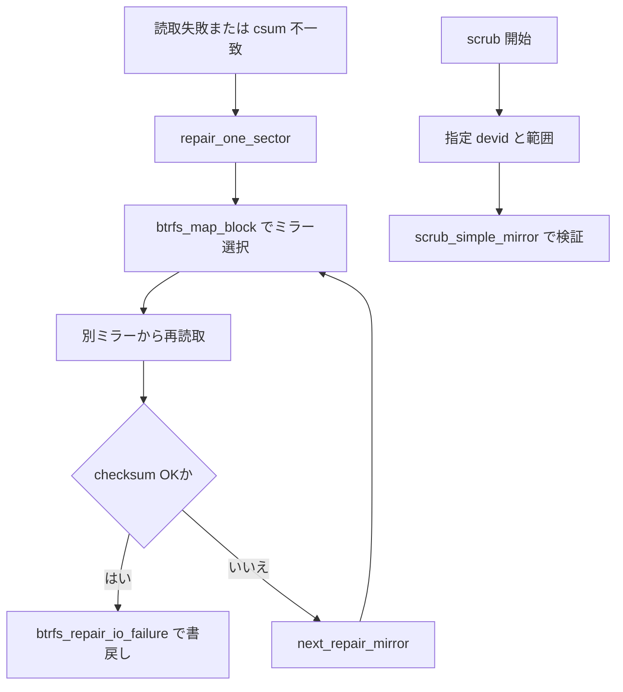

# 第17章 btrfs の RAID、scrub、mirror retry

> **本章で読むソース**
>
> - [`fs/btrfs/volumes.c` L6733-L6770](https://github.com/gregkh/linux/blob/v6.18.38/fs/btrfs/volumes.c#L6733-L6770)
> - [`fs/btrfs/volumes.h` L714-L716](https://github.com/gregkh/linux/blob/v6.18.38/fs/btrfs/volumes.h#L714-L716)
> - [`fs/btrfs/bio.c` L146-L204](https://github.com/gregkh/linux/blob/v6.18.38/fs/btrfs/bio.c#L146-L204)
> - [`fs/btrfs/bio.c` L213-L261](https://github.com/gregkh/linux/blob/v6.18.38/fs/btrfs/bio.c#L213-L261)
> - [`fs/btrfs/scrub.c` L3038-L3071](https://github.com/gregkh/linux/blob/v6.18.38/fs/btrfs/scrub.c#L3038-L3071)
> - [`fs/btrfs/scrub.c` L2254-L2295](https://github.com/gregkh/linux/blob/v6.18.38/fs/btrfs/scrub.c#L2254-L2295)

## この章の狙い

RAID プロファイル下で `btrfs_map_block` がミラーを選び、読取失敗や checksum 不一致時に別コピーへ切り替える経路を追う。
**scrub** は指定デバイスと範囲を走査して整合性を検証し、第16章の通常 read repair と役割を分ける。

## 前提

- [btrfs の checksum と read repair](16-btrfs-checksum-read-repair.md)
- [btrfs の chunk mapping と extent/device tree](12-btrfs-chunk-mapping-extent-tree.md)

## btrfs_map_block

論理アドレスから chunk map を引き、RAID プロファイルに応じたコピー数と stripe を決める。
`max_len` は RAID ストライプ境界に合わせ、過剰な bio 分割を避ける。

[`fs/btrfs/volumes.h` L714-L716](https://github.com/gregkh/linux/blob/v6.18.38/fs/btrfs/volumes.h#L714-L716)

```c
int btrfs_map_block(struct btrfs_fs_info *fs_info, enum btrfs_map_op op,
		    u64 logical, u64 *length,
		    struct btrfs_io_context **bioc_ret,
```

[`fs/btrfs/volumes.c` L6733-L6770](https://github.com/gregkh/linux/blob/v6.18.38/fs/btrfs/volumes.c#L6733-L6770)

```c
int btrfs_map_block(struct btrfs_fs_info *fs_info, enum btrfs_map_op op,
		    u64 logical, u64 *length,
		    struct btrfs_io_context **bioc_ret,
		    struct btrfs_io_stripe *smap, int *mirror_num_ret)
{
	struct btrfs_chunk_map *map;
	struct btrfs_io_geometry io_geom = { 0 };
	u64 map_offset;
	int ret = 0;
	int num_copies;
	struct btrfs_io_context *bioc = NULL;
	struct btrfs_dev_replace *dev_replace = &fs_info->dev_replace;
	bool dev_replace_is_ongoing = false;
	u16 num_alloc_stripes;
	u64 max_len;

	ASSERT(bioc_ret);

	io_geom.mirror_num = (mirror_num_ret ? *mirror_num_ret : 0);
	io_geom.num_stripes = 1;
	io_geom.stripe_index = 0;
	io_geom.op = op;

	map = btrfs_get_chunk_map(fs_info, logical, *length);
	if (IS_ERR(map))
		return PTR_ERR(map);

	num_copies = btrfs_chunk_map_num_copies(map);
	if (io_geom.mirror_num > num_copies) {
		ret = -EINVAL;
		goto out;
	}

	map_offset = logical - map->start;
	io_geom.raid56_full_stripe_start = (u64)-1;
	max_len = btrfs_max_io_len(map, map_offset, &io_geom);
	*length = min_t(u64, map->chunk_len - map_offset, max_len);
	io_geom.use_rst = btrfs_need_stripe_tree_update(fs_info, map->type);
```

RAID1 では `num_copies` が2以上となり、読取は複数ミラーから選べる。

## RAID プロファイルフラグ

chunk タイプは block group フラグに RAID 情報を載せる。

[`include/uapi/linux/btrfs_tree.h` L1153-L1158](https://github.com/gregkh/linux/blob/v6.18.38/include/uapi/linux/btrfs_tree.h#L1153-L1158)

```c
#define BTRFS_BLOCK_GROUP_DATA		(1ULL << 0)
#define BTRFS_BLOCK_GROUP_SYSTEM	(1ULL << 1)
#define BTRFS_BLOCK_GROUP_METADATA	(1ULL << 2)
#define BTRFS_BLOCK_GROUP_RAID0		(1ULL << 3)
#define BTRFS_BLOCK_GROUP_RAID1		(1ULL << 4)
#define BTRFS_BLOCK_GROUP_DUP		(1ULL << 5)
```

## mirror retry

`btrfs_end_repair_bio` は repair 読取の checksum を検証し、失敗なら `next_repair_mirror` で次ミラーへ送る。
成功時は `btrfs_repair_io_failure` で壊れたミラーへ正しいデータを書き戻す。

[`fs/btrfs/bio.c` L146-L204](https://github.com/gregkh/linux/blob/v6.18.38/fs/btrfs/bio.c#L146-L204)

```c
static int next_repair_mirror(const struct btrfs_failed_bio *fbio, int cur_mirror)
{
	if (cur_mirror == fbio->num_copies)
		return cur_mirror + 1 - fbio->num_copies;
	return cur_mirror + 1;
}

static int prev_repair_mirror(const struct btrfs_failed_bio *fbio, int cur_mirror)
{
	if (cur_mirror == 1)
		return fbio->num_copies;
	return cur_mirror - 1;
}

static void btrfs_repair_done(struct btrfs_failed_bio *fbio)
{
	if (atomic_dec_and_test(&fbio->repair_count)) {
		btrfs_bio_end_io(fbio->bbio, fbio->bbio->bio.bi_status);
		mempool_free(fbio, &btrfs_failed_bio_pool);
	}
}

static void btrfs_end_repair_bio(struct btrfs_bio *repair_bbio,
				 struct btrfs_device *dev)
{
	struct btrfs_failed_bio *fbio = repair_bbio->private;
	struct btrfs_inode *inode = repair_bbio->inode;
	struct btrfs_fs_info *fs_info = inode->root->fs_info;
	struct bio_vec *bv = bio_first_bvec_all(&repair_bbio->bio);
	int mirror = repair_bbio->mirror_num;

	if (repair_bbio->bio.bi_status ||
	    !btrfs_data_csum_ok(repair_bbio, dev, 0, bvec_phys(bv))) {
		bio_reset(&repair_bbio->bio, NULL, REQ_OP_READ);
		repair_bbio->bio.bi_iter = repair_bbio->saved_iter;

		mirror = next_repair_mirror(fbio, mirror);
		if (mirror == fbio->bbio->mirror_num) {
			btrfs_debug(fs_info, "no mirror left");
			fbio->bbio->bio.bi_status = BLK_STS_IOERR;
			goto done;
		}

		btrfs_submit_bbio(repair_bbio, mirror);
		return;
	}

	do {
		mirror = prev_repair_mirror(fbio, mirror);
		btrfs_repair_io_failure(fs_info, btrfs_ino(inode),
				  repair_bbio->file_offset, fs_info->sectorsize,
				  repair_bbio->saved_iter.bi_sector << SECTOR_SHIFT,
				  bvec_phys(bv), mirror);
	} while (mirror != fbio->bbio->mirror_num);

done:
	btrfs_repair_done(fbio);
	bio_put(&repair_bbio->bio);
}
```

`repair_one_sector` は壊れたセクターごとに repair bio を起動する。

[`fs/btrfs/bio.c` L213-L261](https://github.com/gregkh/linux/blob/v6.18.38/fs/btrfs/bio.c#L213-L261)

```c
static struct btrfs_failed_bio *repair_one_sector(struct btrfs_bio *failed_bbio,
						  u32 bio_offset,
						  phys_addr_t paddr,
						  struct btrfs_failed_bio *fbio)
{
	struct btrfs_inode *inode = failed_bbio->inode;
	struct btrfs_fs_info *fs_info = inode->root->fs_info;
	struct folio *folio = page_folio(phys_to_page(paddr));
	const u32 sectorsize = fs_info->sectorsize;
	const u32 foff = offset_in_folio(folio, paddr);
	const u64 logical = (failed_bbio->saved_iter.bi_sector << SECTOR_SHIFT);
	struct btrfs_bio *repair_bbio;
	struct bio *repair_bio;
	int num_copies;
	int mirror;

	ASSERT(foff + sectorsize <= folio_size(folio));
	btrfs_debug(fs_info, "repair read error: read error at %llu",
		    failed_bbio->file_offset + bio_offset);

	num_copies = btrfs_num_copies(fs_info, logical, sectorsize);
	if (num_copies == 1) {
		btrfs_debug(fs_info, "no copy to repair from");
		failed_bbio->bio.bi_status = BLK_STS_IOERR;
		return fbio;
	}

	if (!fbio) {
		fbio = mempool_alloc(&btrfs_failed_bio_pool, GFP_NOFS);
		fbio->bbio = failed_bbio;
		fbio->num_copies = num_copies;
		atomic_set(&fbio->repair_count, 1);
	}

	atomic_inc(&fbio->repair_count);

	repair_bio = bio_alloc_bioset(NULL, 1, REQ_OP_READ, GFP_NOFS,
				      &btrfs_repair_bioset);
	repair_bio->bi_iter.bi_sector = failed_bbio->saved_iter.bi_sector;
	bio_add_folio_nofail(repair_bio, folio, sectorsize, foff);

	repair_bbio = btrfs_bio(repair_bio);
	btrfs_bio_init(repair_bbio, failed_bbio->inode, failed_bbio->file_offset + bio_offset,
		       NULL, fbio);

	mirror = next_repair_mirror(fbio, failed_bbio->mirror_num);
	btrfs_debug(fs_info, "submitting repair read to mirror %d", mirror);
	btrfs_submit_bbio(repair_bbio, mirror);
	return fbio;
}
```

## scrub

`btrfs_scrub_dev` は指定 devid と `[start,end)` 範囲の chunk を列挙し、`scrub_simple_mirror` がそのデバイス上のミラーを検証する。
通常 read path の on-demand repair と異なり、選択範囲を計画的に走査する。

[`fs/btrfs/scrub.c` L3038-L3071](https://github.com/gregkh/linux/blob/v6.18.38/fs/btrfs/scrub.c#L3038-L3071)

```c
int btrfs_scrub_dev(struct btrfs_fs_info *fs_info, u64 devid, u64 start,
		    u64 end, struct btrfs_scrub_progress *progress,
		    bool readonly, bool is_dev_replace)
{
	struct btrfs_dev_lookup_args args = { .devid = devid };
	struct scrub_ctx *sctx;
	int ret;
	struct btrfs_device *dev;
	unsigned int nofs_flag;
	bool need_commit = false;

	/* Set the basic fallback @last_physical before we got a sctx. */
	if (progress)
		progress->last_physical = start;

	if (btrfs_fs_closing(fs_info))
		return -EAGAIN;

	/* At mount time we have ensured nodesize is in the range of [4K, 64K]. */
	ASSERT(fs_info->nodesize <= BTRFS_STRIPE_LEN);

	/*
	 * SCRUB_MAX_SECTORS_PER_BLOCK is calculated using the largest possible
	 * value (max nodesize / min sectorsize), thus nodesize should always
	 * be fine.
	 */
	ASSERT(fs_info->nodesize <=
	       SCRUB_MAX_SECTORS_PER_BLOCK << fs_info->sectorsize_bits);

	/* Allocate outside of device_list_mutex */
	sctx = scrub_setup_ctx(fs_info, is_dev_replace);
	if (IS_ERR(sctx))
		return PTR_ERR(sctx);
	sctx->stat.last_physical = start;
```

[`fs/btrfs/scrub.c` L2254-L2295](https://github.com/gregkh/linux/blob/v6.18.38/fs/btrfs/scrub.c#L2254-L2295)

```c
static int scrub_simple_mirror(struct scrub_ctx *sctx,
			       struct btrfs_block_group *bg,
			       u64 logical_start, u64 logical_length,
			       struct btrfs_device *device,
			       u64 physical, int mirror_num)
{
	struct btrfs_fs_info *fs_info = sctx->fs_info;
	const u64 logical_end = logical_start + logical_length;
	u64 cur_logical = logical_start;
	int ret = 0;

	/* The range must be inside the bg */
	ASSERT(logical_start >= bg->start && logical_end <= bg->start + bg->length);

	/* Go through each extent items inside the logical range */
	while (cur_logical < logical_end) {
		u64 found_logical = U64_MAX;
		u64 cur_physical = physical + cur_logical - logical_start;

		/* Canceled? */
		if (atomic_read(&fs_info->scrub_cancel_req) ||
		    atomic_read(&sctx->cancel_req)) {
			ret = -ECANCELED;
			break;
		}
		/* Paused? */
		if (atomic_read(&fs_info->scrub_pause_req)) {
			/* Push queued extents */
			scrub_blocked_if_needed(fs_info);
		}
		// ... (中略) ...
		ret = queue_scrub_stripe(sctx, bg, device, mirror_num,
					 cur_logical, logical_end - cur_logical,
					 cur_physical, &found_logical);
```

[`fs/btrfs/scrub.c` L1036-L1038](https://github.com/gregkh/linux/blob/v6.18.38/fs/btrfs/scrub.c#L1036-L1038)

```c
		ret = btrfs_map_block(fs_info, BTRFS_MAP_GET_READ_MIRRORS,
				      stripe->logical, &mapped_len, &bioc,
				      NULL, NULL);
```

## 処理の流れ



## 高速化と最適化の工夫

`btrfs_map_block` の `max_len` 調整は RAID ストライプ境界で bio を切り、余分な map 呼び出しを減らす。
repair は壊れたセクター単位で起動し、正常セクターの再読取を避ける。
mempool の `btrfs_failed_bio_pool` はメモリ圧迫下でも repair 構造体を確保し、read repair を前進させる。

## まとめ

RAID プロファイルは `btrfs_map_block` がミラー数と stripe を決め、読取エラー時は mirror retry で冗長コピーを試す。
scrub は同じ map 機構を使い、指定デバイスと範囲を計画的に検証する。

## 関連する章

- [btrfs の checksum と read repair](16-btrfs-checksum-read-repair.md)
- [ブロック層と io_uring](../../block/README.md)
