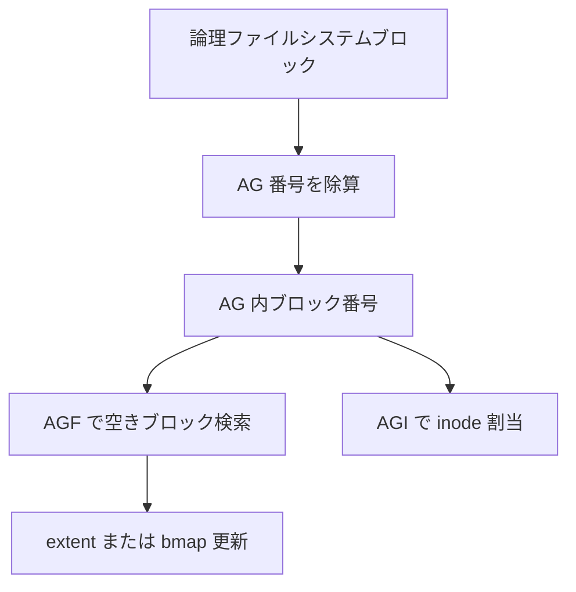

# 第18章 XFS のアロケーショングループ

> **本章で読むソース**
>
> - [`fs/xfs/libxfs/xfs_format.h` L95-L111](https://github.com/gregkh/linux/blob/v6.18.38/fs/xfs/libxfs/xfs_format.h#L95-L111)
> - [`fs/xfs/libxfs/xfs_format.h` L130-L133](https://github.com/gregkh/linux/blob/v6.18.38/fs/xfs/libxfs/xfs_format.h#L130-L133)
> - [`fs/xfs/libxfs/xfs_fs.h` L280-L282](https://github.com/gregkh/linux/blob/v6.18.38/fs/xfs/libxfs/xfs_fs.h#L280-L282)
> - [`fs/xfs/libxfs/xfs_format.h` L303-L305](https://github.com/gregkh/linux/blob/v6.18.38/fs/xfs/libxfs/xfs_format.h#L303-L305)
> - [`fs/xfs/libxfs/xfs_ialloc.c` L2489-L2492](https://github.com/gregkh/linux/blob/v6.18.38/fs/xfs/libxfs/xfs_ialloc.c#L2489-L2492)
> - [`fs/xfs/libxfs/xfs_format.h` L517-L542](https://github.com/gregkh/linux/blob/v6.18.38/fs/xfs/libxfs/xfs_format.h#L517-L542)
> - [`fs/xfs/libxfs/xfs_ag.h` L34-L45](https://github.com/gregkh/linux/blob/v6.18.38/fs/xfs/libxfs/xfs_ag.h#L34-L45)
> - [`fs/xfs/libxfs/xfs_format.h` L117-L121](https://github.com/gregkh/linux/blob/v6.18.38/fs/xfs/libxfs/xfs_format.h#L117-L121)

## この章の狙い

XFS がボリュームを **アロケーショングループ**（AG）へ分割する on-disk 幾何を `xfs_sb` から読む。
ext4 の block group に近い並列化単位であり、空きブロックと inode 管理が AG 単位で行われる前提を押さえる。

## 前提

- [ディスクレイアウトの読み方](../part00-overview/02-on-disk-layout-reading.md)
- 本分冊では XFS を概観に留め、細部はログと AG の入口までとする。

## xfs_sb における AG 幾何

on-disk super block `xfs_sb` は AG あたりのブロック数 `sb_agblocks` と AG 数 `sb_agcount` を持つ。
ファイルシステムブロックサイズ `sb_blocksize` と合わせて、論理アドレス分解の基準になる。

[`fs/xfs/libxfs/xfs_format.h` L95-L111](https://github.com/gregkh/linux/blob/v6.18.38/fs/xfs/libxfs/xfs_format.h#L95-L111)

```c
typedef struct xfs_sb {
	uint32_t	sb_magicnum;	/* magic number == XFS_SB_MAGIC */
	uint32_t	sb_blocksize;	/* logical block size, bytes */
	xfs_rfsblock_t	sb_dblocks;	/* number of data blocks */
	xfs_rfsblock_t	sb_rblocks;	/* number of realtime blocks */
	xfs_rtbxlen_t	sb_rextents;	/* number of realtime extents */
	uuid_t		sb_uuid;	/* user-visible file system unique id */
	xfs_fsblock_t	sb_logstart;	/* starting block of log if internal */
	xfs_ino_t	sb_rootino;	/* root inode number */
	xfs_ino_t	sb_rbmino;	/* bitmap inode for realtime extents */
	xfs_ino_t	sb_rsumino;	/* summary inode for rt bitmap */
	xfs_agblock_t	sb_rextsize;	/* realtime extent size, blocks */
	xfs_agblock_t	sb_agblocks;	/* size of an allocation group */
	xfs_agnumber_t	sb_agcount;	/* number of allocation groups */
	xfs_extlen_t	sb_rbmblocks;	/* number of rt bitmap blocks */
	xfs_extlen_t	sb_logblocks;	/* number of log blocks */
	uint16_t	sb_versionnum;	/* header version == XFS_SB_VERSION */
```

`sb_logstart` と `sb_logblocks` は内蔵ログの位置を示す。
外部ログ構成ではマウントパラメータ側が優先される。

## AG 内ブロック番号への分解

マクロ `XFS_MAX_DBLOCKS` は AG 数と AG サイズからデータブロック総数を求める。
inode や空きブロックの参照は AG 番号と AG 内オフセットに分けて行う。

[`fs/xfs/libxfs/xfs_fs.h` L280-L282](https://github.com/gregkh/linux/blob/v6.18.38/fs/xfs/libxfs/xfs_fs.h#L280-L282)

```c
#define XFS_MAX_DBLOCKS(s) ((xfs_rfsblock_t)(s)->sb_agcount * (s)->sb_agblocks)
#define XFS_MIN_DBLOCKS(s) ((xfs_rfsblock_t)((s)->sb_agcount - 1) *	\
			 (s)->sb_agblocks + XFS_MIN_AG_BLOCKS)
```

## AG ヘッダと空き inode 統計

super block にはボリューム全体の inode 統計も載る。
`sb_icount`、`sb_ifree`、`sb_fdblocks` は連続フィールドとしてトランザクション更新に使われる。

[`fs/xfs/libxfs/xfs_format.h` L130-L133](https://github.com/gregkh/linux/blob/v6.18.38/fs/xfs/libxfs/xfs_format.h#L130-L133)

```c
	uint64_t	sb_icount;	/* allocated inodes */
	uint64_t	sb_ifree;	/* free inodes */
	uint64_t	sb_fdblocks;	/* free data blocks */
	uint64_t	sb_frextents;	/* free realtime extents */
```

各 AG には AGF（AG free space）と AGI（AG inode）ヘッダがあり、割当はまず AG 内の空き情報を参照する。

## AGF ヘッダの on-disk 形式

AGF は AG 内の空きブロック管理のルートを持つ。
`agf_bno_root` と `agf_cnt_root` は空きブロック検索用 B-tree の根、`agf_freeblks` は AG 内の空きブロック総数である。

[`fs/xfs/libxfs/xfs_format.h` L517-L542](https://github.com/gregkh/linux/blob/v6.18.38/fs/xfs/libxfs/xfs_format.h#L517-L542)

```c
typedef struct xfs_agf {
	/*
	 * Common allocation group header information
	 */
	__be32		agf_magicnum;	/* magic number == XFS_AGF_MAGIC */
	__be32		agf_versionnum;	/* header version == XFS_AGF_VERSION */
	__be32		agf_seqno;	/* sequence # starting from 0 */
	__be32		agf_length;	/* size in blocks of a.g. */
	/*
	 * Freespace and rmap information
	 */
	__be32		agf_bno_root;	/* bnobt root block */
	__be32		agf_cnt_root;	/* cntbt root block */
	__be32		agf_rmap_root;	/* rmapbt root block */

	__be32		agf_bno_level;	/* bnobt btree levels */
	__be32		agf_cnt_level;	/* cntbt btree levels */
	__be32		agf_rmap_level;	/* rmapbt btree levels */

	__be32		agf_flfirst;	/* first freelist block's index */
	__be32		agf_fllast;	/* last freelist block's index */
	__be32		agf_flcount;	/* count of blocks in freelist */
	__be32		agf_freeblks;	/* total free blocks */

	__be32		agf_longest;	/* longest free space */
	__be32		agf_btreeblks;	/* # of blocks held in AGF btrees */
```

`agf_longest` は AG 内で連続して確保できる最大ブロック数の目安であり、大きな extent 割当の可否判断に使われる。

## メモリ上の xfs_perag キャッシュ

マウント中は AGF と AGI の要約が `xfs_perag` に複製され、割当時のディスク読取を減らす。
`pagf_freeblks` と `pagi_freecount` はそれぞれ空きブロック数と空き inode 数の incore コピーである。

[`fs/xfs/libxfs/xfs_ag.h` L34-L45](https://github.com/gregkh/linux/blob/v6.18.38/fs/xfs/libxfs/xfs_ag.h#L34-L45)

```c
struct xfs_perag {
	struct xfs_group pag_group;
	unsigned long	pag_opstate;
	uint8_t		pagf_bno_level;	/* # of levels in bno btree */
	uint8_t		pagf_cnt_level;	/* # of levels in cnt btree */
	uint8_t		pagf_rmap_level;/* # of levels in rmap btree */
	uint32_t	pagf_flcount;	/* count of blocks in freelist */
	xfs_extlen_t	pagf_freeblks;	/* total free blocks */
	xfs_extlen_t	pagf_longest;	/* longest free space */
	uint32_t	pagf_btreeblks;	/* # of blocks held in AGF btrees */
	xfs_agino_t	pagi_freecount;	/* number of free inodes */
	xfs_agino_t	pagi_count;	/* number of allocated inodes */
```

AG 選択アルゴリズムは `pagf_freeblks` が多い AG を優先し、ボリューム全体のロック競合を避ける。

本章では super block レベルの分割と AGF の入口までを示し、bnobt や rmapbt の詳細はソース `xfs_alloc_btree.c` に委ねる。

## AG 境界の検証

inode 割当やブロック参照では AG 内オフセットが `sb_agblocks` 未満であることを検査する。

[`fs/xfs/libxfs/xfs_ialloc.c` L2489-L2492](https://github.com/gregkh/linux/blob/v6.18.38/fs/xfs/libxfs/xfs_ialloc.c#L2489-L2492)

```c
		if (agbno >= xfs_ag_block_count(mp, pag_agno(pag))) {
			xfs_alert(mp,
		"%s: agbno (0x%llx) >= mp->m_sb.sb_agblocks (0x%lx)",
				__func__, (unsigned long long)agbno,
```

## v5 スーパーブロック判定

機能フラグは `xfs_sb_is_v5` で世代を判定する。

[`fs/xfs/libxfs/xfs_format.h` L303-L305](https://github.com/gregkh/linux/blob/v6.18.38/fs/xfs/libxfs/xfs_format.h#L303-L305)

```c
static inline bool xfs_sb_is_v5(const struct xfs_sb *sbp)
{
	return XFS_SB_VERSION_NUM(sbp) == XFS_SB_VERSION_5;
```

## 処理の流れ



XFS の並列化は AG 単位のロックと空き空間キャッシュに支えられる。

## 高速化と最適化の工夫

AG 分割により割当競合をボリューム全体から局所化できる。
複数 AG へストライプ化された割当はディスク上で並列 I/O を起こしやすい。
`sb_agblklog` など log2 フィールドは除算をビットシフトへ置き換え、ホットパスの計算コストを抑える。

## まとめ

XFS は `sb_agcount` と `sb_agblocks` でボリュームを等分に近い AG へ分割する。
ファイルブロックと inode は AG 番号と AG 内オフセットの組で表され、空き管理も AG 単位である。

## 関連する章

- 次章：[XFS ログの概観](19-xfs-log-overview.md)
- [ext4 の super block と block group](../part01-ext4/03-ext4-super-block-group.md)
