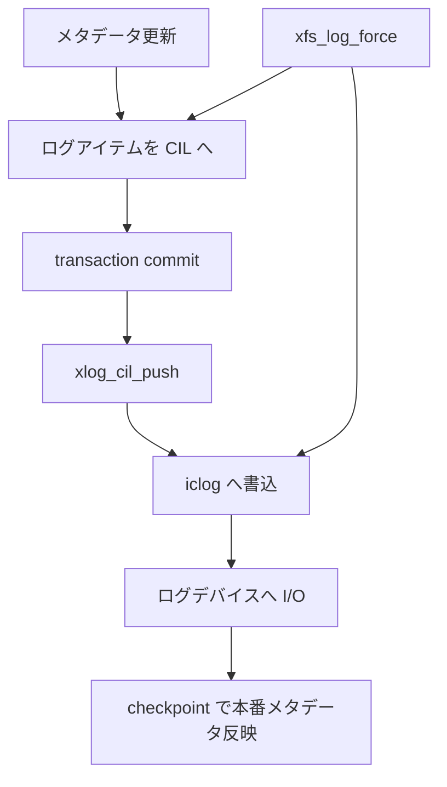

# 第19章 XFS ログの概観

> **本章で読むソース**
>
> - [`fs/xfs/xfs_log.h` L146-L161](https://github.com/gregkh/linux/blob/v6.18.38/fs/xfs/xfs_log.h#L146-L161)
> - [`fs/xfs/xfs_log.c` L2888-L2928](https://github.com/gregkh/linux/blob/v6.18.38/fs/xfs/xfs_log.c#L2888-L2928)
> - [`fs/xfs/xfs_log.c` L2895-L2898](https://github.com/gregkh/linux/blob/v6.18.38/fs/xfs/xfs_log.c#L2895-L2898)
> - [`fs/xfs/xfs_log.c` L2907-L2918](https://github.com/gregkh/linux/blob/v6.18.38/fs/xfs/xfs_log.c#L2907-L2918)
> - [`fs/xfs/libxfs/xfs_format.h` L102-L110](https://github.com/gregkh/linux/blob/v6.18.38/fs/xfs/libxfs/xfs_format.h#L102-L110)
> - [`fs/xfs/xfs_log_cil.c` L1796-L1805](https://github.com/gregkh/linux/blob/v6.18.38/fs/xfs/xfs_log_cil.c#L1796-L1805)

## この章の狙い

XFS のログがメタデータ更新をどう集約し、`xfs_log_force` でディスクへ反映されるかを概観する。
jbd2 と同様にログ先行書き込みだが、CIL（Committed Item List）によるバッチ化が特徴である。

## 前提

- 前章：[XFS のアロケーショングループ](18-xfs-allocation-groups.md)
- [jbd2 のジャーナリング](../part01-ext4/07-jbd2-journaling.md)

## xfs_log_force の宣言

`xfs_log_force` はマウント単位 `xfs_mount` とフラグを受け取り、ログをフラッシュする。
`XFS_LOG_SYNC` は呼び出し側が完了を待つ同期フラグである。

[`fs/xfs/xfs_log.h` L146-L161](https://github.com/gregkh/linux/blob/v6.18.38/fs/xfs/xfs_log.h#L146-L161)

```c
 * Flags to xfs_log_force()
 *
 *	XFS_LOG_SYNC:	Synchronous force in-core log to disk
 */
#define XFS_LOG_SYNC		0x1

/* Log manager interfaces */
struct xfs_mount;
struct xlog_in_core;
struct xlog_ticket;
struct xfs_log_item;
struct xfs_item_ops;
struct xfs_trans;
struct xlog;

int	  xfs_log_force(struct xfs_mount *mp, uint flags);
```

## ログフラッシュの本体

`xfs_log_force` はまず `xlog_cil_force` で CIL を進め、その後アクティブな iclog を調べる。
DIRTY または空の ACTIVE ログは前の iclog へ移り、そこへ付着してスリープする経路がある。

[`fs/xfs/xfs_log.c` L2888-L2928](https://github.com/gregkh/linux/blob/v6.18.38/fs/xfs/xfs_log.c#L2888-L2928)

```c
xfs_log_force(
	struct xfs_mount	*mp,
	uint			flags)
{
	struct xlog		*log = mp->m_log;
	struct xlog_in_core	*iclog;

	XFS_STATS_INC(mp, xs_log_force);
	trace_xfs_log_force(mp, 0, _RET_IP_);

	xlog_cil_force(log);

	spin_lock(&log->l_icloglock);
	if (xlog_is_shutdown(log))
		goto out_error;

	iclog = log->l_iclog;
	trace_xlog_iclog_force(iclog, _RET_IP_);

	if (iclog->ic_state == XLOG_STATE_DIRTY ||
	    (iclog->ic_state == XLOG_STATE_ACTIVE &&
	     atomic_read(&iclog->ic_refcnt) == 0 && iclog->ic_offset == 0)) {
		/*
		 * If the head is dirty or (active and empty), then we need to
		 * look at the previous iclog.
		 *
		 * If the previous iclog is active or dirty we are done.  There
		 * is nothing to sync out. Otherwise, we attach ourselves to the
		 * previous iclog and go to sleep.
		 */
		iclog = iclog->ic_prev;
	} else if (iclog->ic_state == XLOG_STATE_ACTIVE) {
		if (atomic_read(&iclog->ic_refcnt) == 0) {
			/* We have exclusive access to this iclog. */
			bool	completed;

			if (xlog_force_and_check_iclog(iclog, &completed))
				goto out_error;

			if (completed)
				goto out_unlock;
```

iclog はリング状に繋がり、ログライタが順次ディスクへ書き出す。

## CIL への集約

CIL は変更されたメタデータアイテムを transaction 完了前に集約する層である。
`xlog_cil_force` は CIL 内の変更をログへ押し出す入口の一つである。

[`fs/xfs/xfs_log.c` L2895-L2898](https://github.com/gregkh/linux/blob/v6.18.38/fs/xfs/xfs_log.c#L2895-L2898)

```c
	XFS_STATS_INC(mp, xs_log_force);
	trace_xfs_log_force(mp, 0, _RET_IP_);

	xlog_cil_force(log);
```

別経路でも `xfs_log_force` が CIL push の契機になる。

[`fs/xfs/xfs_log_cil.c` L1796-L1805](https://github.com/gregkh/linux/blob/v6.18.38/fs/xfs/xfs_log_cil.c#L1796-L1805)

```c
	trace_xfs_log_force(log->l_mp, seq, _RET_IP_);
	xlog_cil_push_now(log, seq, true);

	/*
	 * If the CIL is empty, make sure that any previous checkpoint that may
	 * still be in an active iclog is pushed to stable storage.
	 */
	if (test_bit(XLOG_CIL_EMPTY, &log->l_cilp->xc_flags))
		xfs_log_force(log->l_mp, 0);
}
```

## CIL の強制 push

`xlog_cil_force_seq` は指定シーケンスまでの CIL エントリを `xlog_cil_push_now` でディスクへ進める。
`xfs_log_force` 内の `xlog_cil_force` から間接的に呼ばれる。

[`fs/xfs/xfs_log_cil.c` L1818-L1838](https://github.com/gregkh/linux/blob/v6.18.38/fs/xfs/xfs_log_cil.c#L1818-L1838)

```c
xlog_cil_force_seq(
	struct xlog	*log,
	xfs_csn_t	sequence)
{
	struct xfs_cil		*cil = log->l_cilp;
	struct xfs_cil_ctx	*ctx;
	xfs_lsn_t		commit_lsn = NULLCOMMITLSN;

	ASSERT(sequence <= cil->xc_current_sequence);

	if (!sequence)
		sequence = cil->xc_current_sequence;
	trace_xfs_log_force(log->l_mp, sequence, _RET_IP_);

	/*
	 * check to see if we need to force out the current context.
	 * xlog_cil_push() handles racing pushes for the same sequence,
	 * so no need to deal with it here.
	 */
restart:
	xlog_cil_push_now(log, sequence, false);
```

## super block 上のログ位置

内蔵ログは super block の `sb_logstart` と `sb_logblocks` で範囲が決まる。

[`fs/xfs/libxfs/xfs_format.h` L102-L110](https://github.com/gregkh/linux/blob/v6.18.38/fs/xfs/libxfs/xfs_format.h#L102-L110)

```c
	xfs_fsblock_t	sb_logstart;	/* starting block of log if internal */
	xfs_ino_t	sb_rootino;	/* root inode number */
	xfs_ino_t	sb_rbmino;	/* bitmap inode for realtime extents */
	xfs_ino_t	sb_rsumino;	/* summary inode for rt bitmap */
	xfs_agblock_t	sb_rextsize;	/* realtime extent size, blocks */
	xfs_agblock_t	sb_agblocks;	/* size of an allocation group */
	xfs_agnumber_t	sb_agcount;	/* number of allocation groups */
	xfs_extlen_t	sb_rbmblocks;	/* number of rt bitmap blocks */
	xfs_extlen_t	sb_logblocks;	/* number of log blocks */
```

## 処理の流れ



## 高速化と最適化の工夫

CIL は細かいログレコードをまとめ、ディスクへの書き込み回数を減らす。
iclog リングは複数バッファを回転させ、ログライタと生成側の待ちを緩和する。
`xfs_log_force` の非同期フラグはホットパスで待機を避け、fsync 時だけ `XFS_LOG_SYNC` で同期する。

## まとめ

XFS ログは CIL と iclog の2段でメタデータ変更をバッファし、ディスクへ順次フラッシュする。
`xfs_log_force` は整合が必要な時点でログを進める公開 API である。

## 関連する章

- [XFS のアロケーショングループ](18-xfs-allocation-groups.md)
- [jbd2 のジャーナリング](../part01-ext4/07-jbd2-journaling.md)
- [fsync、sync](../../vfs/part05-writeback/18-fsync-sync.md)
