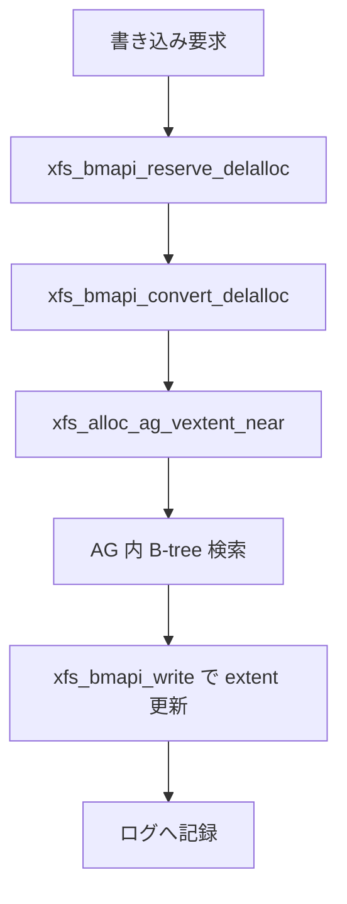

# 第20章 XFS の inode fork、bmap、allocation B-tree

> **本章で読むソース**
>
> - [`fs/xfs/libxfs/xfs_bmap.c` L4134-L4180](https://github.com/gregkh/linux/blob/v6.18.38/fs/xfs/libxfs/xfs_bmap.c#L4134-L4180)
> - [`fs/xfs/libxfs/xfs_bmap.c` L4354-L4472](https://github.com/gregkh/linux/blob/v6.18.38/fs/xfs/libxfs/xfs_bmap.c#L4354-L4472)
> - [`fs/xfs/libxfs/xfs_bmap.c` L4486-L4510](https://github.com/gregkh/linux/blob/v6.18.38/fs/xfs/libxfs/xfs_bmap.c#L4486-L4510)
> - [`fs/xfs/libxfs/xfs_btree.h` L118-L147](https://github.com/gregkh/linux/blob/v6.18.38/fs/xfs/libxfs/xfs_btree.h#L118-L147)
> - [`fs/xfs/libxfs/xfs_btree.c` L562-L596](https://github.com/gregkh/linux/blob/v6.18.38/fs/xfs/libxfs/xfs_btree.c#L562-L596)
> - [`fs/xfs/xfs_iomap.c` L1456-L1484](https://github.com/gregkh/linux/blob/v6.18.38/fs/xfs/xfs_iomap.c#L1456-L1484)

## この章の狙い

XFS がファイルオフセットを物理ブロックへ写像する **bmap**、空きブロック検索の **allocation B-tree**、inode の **fork** 構造を概観する。
第18章のアロケーショングループと第19章のログの続きとして、データ配置の本体を読む。

## 前提

- [XFS のアロケーショングループ](18-xfs-allocation-groups.md)
- [XFS ログの概観](19-xfs-log-overview.md)

## inode fork と whichfork

XFS inode はデータ fork と属性 fork を持ち、`xfs_bmapi_write` は `whichfork` で対象を選ぶ。
メタデータ extent とデータ extent は同じ bmap 機構だがフラグで区別する。

[`fs/xfs/libxfs/xfs_bmap.c` L4134-L4180](https://github.com/gregkh/linux/blob/v6.18.38/fs/xfs/libxfs/xfs_bmap.c#L4134-L4180)

```c
int
xfs_bmapi_write(
	struct xfs_trans	*tp,		/* transaction pointer */
	struct xfs_inode	*ip,		/* incore inode */
	xfs_fileoff_t		bno,		/* starting file offs. mapped */
	xfs_filblks_t		len,		/* length to map in file */
	uint32_t		flags,		/* XFS_BMAPI_... */
	xfs_extlen_t		total,		/* total blocks needed */
	struct xfs_bmbt_irec	*mval,		/* output: map values */
	int			*nmap)		/* i/o: mval size/count */
{
	struct xfs_bmalloca	bma = {
		.tp		= tp,
		.ip		= ip,
		.total		= total,
	};
	struct xfs_mount	*mp = ip->i_mount;
	int			whichfork = xfs_bmapi_whichfork(flags);
	struct xfs_ifork	*ifp = xfs_ifork_ptr(ip, whichfork);
	xfs_fileoff_t		end;		/* end of mapped file region */
	bool			eof = false;	/* after the end of extents */
	int			error;		/* error return */
	int			n;		/* current extent index */
	xfs_fileoff_t		obno;		/* old block number (offset) */

#ifdef DEBUG
	xfs_fileoff_t		orig_bno;	/* original block number value */
	int			orig_flags;	/* original flags arg value */
	xfs_filblks_t		orig_len;	/* original value of len arg */
	struct xfs_bmbt_irec	*orig_mval;	/* original value of mval */
	int			orig_nmap;	/* original value of *nmap */

	orig_bno = bno;
	orig_len = len;
	orig_flags = flags;
	orig_mval = mval;
	orig_nmap = *nmap;
#endif

	ASSERT(*nmap >= 1);
	ASSERT(*nmap <= XFS_BMAP_MAX_NMAP);
	ASSERT(tp != NULL);
	ASSERT(len > 0);
	ASSERT(ifp->if_format != XFS_DINODE_FMT_LOCAL);
	xfs_assert_ilocked(ip, XFS_ILOCK_EXCL);
	ASSERT(!(flags & XFS_BMAPI_REMAP));
```

`xfs_iread_extents` で on-disk extent リストをメモリへ読み込んでから写像を更新する。

[`fs/xfs/libxfs/xfs_bmap.c` L4202-L4209](https://github.com/gregkh/linux/blob/v6.18.38/fs/xfs/libxfs/xfs_bmap.c#L4202-L4209)

```c
	XFS_STATS_INC(mp, xs_blk_mapw);

	error = xfs_iread_extents(tp, ip, whichfork);
	if (error)
		goto error0;

	if (!xfs_iext_lookup_extent(ip, ifp, bno, &bma.icur, &bma.got))
		eof = true;
```

## delalloc の変換

`xfs_bmapi_convert_delalloc` は `xfs_bmapi_convert_one_delalloc` をループし、delalloc extent を `xfs_bmapi_allocate` 経由で物理ブロックへ落とす。
成功後は `xfs_bmap_btree_to_extents` で fork 上の extent リストを更新する。

[`fs/xfs/libxfs/xfs_bmap.c` L4486-L4510](https://github.com/gregkh/linux/blob/v6.18.38/fs/xfs/libxfs/xfs_bmap.c#L4486-L4510)

```c
int
xfs_bmapi_convert_delalloc(
	struct xfs_inode	*ip,
	int			whichfork,
	loff_t			offset,
	struct iomap		*iomap,
	unsigned int		*seq)
{
	int			error;

	/*
	 * Attempt to allocate whatever delalloc extent currently backs offset
	 * and put the result into iomap.  Allocate in a loop because it may
	 * take several attempts to allocate real blocks for a contiguous
	 * delalloc extent if free space is sufficiently fragmented.
	 */
	do {
		error = xfs_bmapi_convert_one_delalloc(ip, whichfork, offset,
					iomap, seq);
```

[`fs/xfs/libxfs/xfs_bmap.c` L4354-L4472](https://github.com/gregkh/linux/blob/v6.18.38/fs/xfs/libxfs/xfs_bmap.c#L4354-L4472)

```c
static int
xfs_bmapi_convert_one_delalloc(
	struct xfs_inode	*ip,
	int			whichfork,
	xfs_off_t		offset,
	struct iomap		*iomap,
	unsigned int		*seq)
{
	struct xfs_ifork	*ifp = xfs_ifork_ptr(ip, whichfork);
	struct xfs_mount	*mp = ip->i_mount;
	xfs_fileoff_t		offset_fsb = XFS_B_TO_FSBT(mp, offset);
	struct xfs_bmalloca	bma = { NULL };
	uint16_t		flags = 0;
	struct xfs_trans	*tp;
	int			error;

	if (whichfork == XFS_COW_FORK)
		flags |= IOMAP_F_SHARED;

	/*
	 * Space for the extent and indirect blocks was reserved when the
	 * delalloc extent was created so there's no need to do so here.
	 */
	error = xfs_trans_alloc(mp, &M_RES(mp)->tr_write, 0, 0,
				XFS_TRANS_RESERVE, &tp);
	if (error)
		return error;

	xfs_ilock(ip, XFS_ILOCK_EXCL);
	xfs_trans_ijoin(tp, ip, 0);

	error = xfs_iext_count_extend(tp, ip, whichfork,
			XFS_IEXT_ADD_NOSPLIT_CNT);
	if (error)
		goto out_trans_cancel;

	if (!xfs_iext_lookup_extent(ip, ifp, offset_fsb, &bma.icur, &bma.got) ||
	    bma.got.br_startoff > offset_fsb) {
		// ... (中略) ...
		error = -EAGAIN;
		goto out_trans_cancel;
	}

	if (!isnullstartblock(bma.got.br_startblock)) {
		xfs_bmbt_to_iomap(ip, iomap, &bma.got, 0, flags,
				xfs_iomap_inode_sequence(ip, flags));
		if (seq)
			*seq = READ_ONCE(ifp->if_seq);
		goto out_trans_cancel;
	}

	bma.tp = tp;
	bma.ip = ip;
	bma.wasdel = true;
	bma.minleft = xfs_bmapi_minleft(tp, ip, whichfork);

	bma.offset = bma.got.br_startoff;
	bma.length = bma.got.br_blockcount;

	bma.flags = XFS_BMAPI_PREALLOC;
	if (whichfork == XFS_COW_FORK)
		bma.flags |= XFS_BMAPI_COWFORK;

	if (!xfs_iext_peek_prev_extent(ifp, &bma.icur, &bma.prev))
		bma.prev.br_startoff = NULLFILEOFF;

	error = xfs_bmapi_allocate(&bma);
	if (error)
		goto out_finish;

	ASSERT(!isnullstartblock(bma.got.br_startblock));
	xfs_bmbt_to_iomap(ip, iomap, &bma.got, 0, flags,
				xfs_iomap_inode_sequence(ip, flags));
	if (seq)
		*seq = READ_ONCE(ifp->if_seq);

	error = xfs_bmap_btree_to_extents(tp, ip, bma.cur, &bma.logflags,
			whichfork);
	if (error)
		goto out_finish;

	xfs_bmapi_finish(&bma, whichfork, 0);
	error = xfs_trans_commit(tp);
	xfs_iunlock(ip, XFS_ILOCK_EXCL);
	return error;
```

## allocation B-tree

`xfs_bmapi_allocate` は AG 内 allocation B-tree を `xfs_alloc_ag_vextent_near` 等で走査し、物理ブロックを選ぶ。

[`fs/xfs/libxfs/xfs_alloc.c` L1674-L1718](https://github.com/gregkh/linux/blob/v6.18.38/fs/xfs/libxfs/xfs_alloc.c#L1674-L1718)

```c
xfs_alloc_ag_vextent_near(
	struct xfs_alloc_arg	*args,
	uint32_t		alloc_flags)
{
	struct xfs_alloc_cur	acur = {};
	int			error;		/* error code */
	int			i;		/* result code, temporary */
	xfs_agblock_t		bno;
	xfs_extlen_t		len;

	/* handle uninitialized agbno range so caller doesn't have to */
	if (!args->min_agbno && !args->max_agbno)
		args->max_agbno = args->mp->m_sb.sb_agblocks - 1;
	ASSERT(args->min_agbno <= args->max_agbno);

	/* clamp agbno to the range if it's outside */
	if (args->agbno < args->min_agbno)
		args->agbno = args->min_agbno;
	if (args->agbno > args->max_agbno)
		args->agbno = args->max_agbno;

	/* Retry once quickly if we find busy extents before blocking. */
	alloc_flags |= XFS_ALLOC_FLAG_TRYFLUSH;
restart:
	len = 0;

	/*
	 * Set up cursors and see if there are any free extents as big as
	 * maxlen. If not, pick the last entry in the tree unless the tree is
	 * empty.
	 */
	error = xfs_alloc_cur_setup(args, &acur);
	if (error == -ENOSPC) {
		error = xfs_alloc_ag_vextent_small(args, acur.cnt, &bno,
				&len, &i);
		if (error)
			goto out;
		if (i == 0 || len == 0) {
			trace_xfs_alloc_near_noentry(args);
			goto out;
		}
		ASSERT(i == 1);
	} else if (error) {
		goto out;
	}
```

## xfs_btree 共通層

bmap と alloc は共通の B-tree 操作テーブルを使う。
`xfs_btree` はブロック番号とキー比較関数を型ごとに差し替える。

[`fs/xfs/libxfs/xfs_btree.h` L118-L147](https://github.com/gregkh/linux/blob/v6.18.38/fs/xfs/libxfs/xfs_btree.h#L118-L147)

```c
struct xfs_btree_ops {
	const char		*name;

	/* Type of btree - AG-rooted or inode-rooted */
	enum xfs_btree_type	type;

	/* XFS_BTGEO_* flags that determine the geometry of the btree */
	unsigned int		geom_flags;

	/* size of the key, pointer, and record structures */
	size_t			key_len;
	size_t			ptr_len;
	size_t			rec_len;

	/* LRU refcount to set on each btree buffer created */
	unsigned int		lru_refs;

	/* offset of btree stats array */
	unsigned int		statoff;

	/* sick mask for health reporting (not for bmap btrees) */
	unsigned int		sick_mask;

	/* cursor operations */
	struct xfs_btree_cur *(*dup_cursor)(struct xfs_btree_cur *);
	void	(*update_cursor)(struct xfs_btree_cur *src,
				 struct xfs_btree_cur *dst);

	/* update btree root pointer */
	void	(*set_root)(struct xfs_btree_cur *cur,
```

[`fs/xfs/libxfs/xfs_btree.c` L562-L596](https://github.com/gregkh/linux/blob/v6.18.38/fs/xfs/libxfs/xfs_btree.c#L562-L596)

```c
xfs_btree_dup_cursor(
	struct xfs_btree_cur	*cur,		/* input cursor */
	struct xfs_btree_cur	**ncur)		/* output cursor */
{
	struct xfs_mount	*mp = cur->bc_mp;
	struct xfs_trans	*tp = cur->bc_tp;
	struct xfs_buf		*bp;
	struct xfs_btree_cur	*new;
	int			error;
	int			i;

	/*
	 * Don't allow staging cursors to be duplicated because they're supposed
	 * to be kept private to a single thread.
	 */
	if (unlikely(cur->bc_flags & XFS_BTREE_STAGING)) {
		ASSERT(0);
		return -EFSCORRUPTED;
	}

	/*
	 * Allocate a new cursor like the old one.
	 */
	new = cur->bc_ops->dup_cursor(cur);

	/*
	 * Copy the record currently in the cursor.
	 */
	new->bc_rec = cur->bc_rec;

	/*
	 * For each level current, re-get the buffer and copy the ptr value.
	 */
	for (i = 0; i < new->bc_nlevels; i++) {
		new->bc_levels[i].ptr = cur->bc_levels[i].ptr;
```

## delalloc 予約

`xfs_bmapi_reserve_delalloc` は未書き込み範囲を delalloc extent として予約し、実ブロック割当は後段の `xfs_bmapi_convert_delalloc` が担う。

[`fs/xfs/xfs_iomap.c` L1456-L1484](https://github.com/gregkh/linux/blob/v6.18.38/fs/xfs/xfs_iomap.c#L1456-L1484)

```c
static int
xfs_bmapi_reserve_delalloc(
	struct xfs_inode	*ip,
	int			whichfork,
	xfs_fileoff_t		off,
	xfs_filblks_t		len,
	xfs_filblks_t		prealloc,
	struct xfs_bmbt_irec	*got,
	struct xfs_iext_cursor	*icur,
	int			eof)
{
	struct xfs_mount	*mp = ip->i_mount;
	struct xfs_ifork	*ifp = xfs_ifork_ptr(ip, whichfork);
	xfs_extlen_t		alen;
	xfs_extlen_t		indlen;
	uint64_t		fdblocks;
	int			error;
	xfs_fileoff_t		aoff;
	bool			use_cowextszhint =
					whichfork == XFS_COW_FORK && !prealloc;

retry:
	/*
	 * Cap the alloc length. Keep track of prealloc so we know whether to
	 * tag the inode before we return.
	 */
	aoff = off;
	alen = XFS_FILBLKS_MIN(len + prealloc, XFS_MAX_BMBT_EXTLEN);
	if (!eof)
```

## 処理の流れ



## 高速化と最適化の工夫

`xfs_alloc_ag_vextent_near` は goal 近傍検索で断片化を抑え、シーケンシャル I/O を維持しやすくする。
`XFS_ALLOC_FLAG_TRYFLUSH` は busy extent を一度だけ再試行し、不要なスリープを避ける。
共通 `xfs_btree` 層は bmap と alloc でコードを共有し、ツリー操作のメンテナンスコストを下げる。

## まとめ

XFS は inode fork 上の bmap がファイルオフセットを AG 内ブロックへ写像し、allocation B-tree が空き領域を管理する。
delalloc 予約と変換により、書き込みバーストをまとめて物理ブロックへ落とす。

## 関連する章

- [XFS のアロケーショングループ](18-xfs-allocation-groups.md)
- [XFS ログの概観](19-xfs-log-overview.md)
- [ext4 の extent ツリー](../part01-ext4/06-ext4-extent-tree.md)
