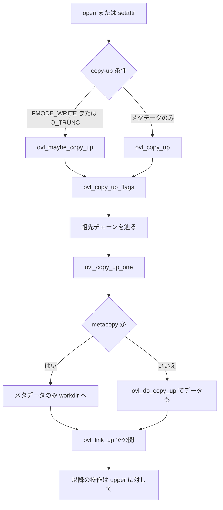

# 第15章 overlayfs の upper/lower とコピーアップ

> **本章で読むソース**
>
> - [`fs/overlayfs/copy_up.c` L1214-L1264](https://github.com/gregkh/linux/blob/v6.18.38/fs/overlayfs/copy_up.c#L1214-L1264)
> - [`fs/overlayfs/copy_up.c` L1295-L1298](https://github.com/gregkh/linux/blob/v6.18.38/fs/overlayfs/copy_up.c#L1295-L1298)
> - [`fs/overlayfs/copy_up.c` L23-L23](https://github.com/gregkh/linux/blob/v6.18.38/fs/overlayfs/copy_up.c#L23-L23)
> - [`fs/overlayfs/dir.c` L674-L675](https://github.com/gregkh/linux/blob/v6.18.38/fs/overlayfs/dir.c#L674-L675)
> - [`fs/overlayfs/inode.c` L40-L42](https://github.com/gregkh/linux/blob/v6.18.38/fs/overlayfs/inode.c#L40-L42)
> - [`fs/overlayfs/overlayfs.h` L905-L905](https://github.com/gregkh/linux/blob/v6.18.38/fs/overlayfs/overlayfs.h#L905-L905)

## この章の狙い

overlayfs が **lower** と **upper** の2層をどう重ね、書き込み時に **コピーアップ** で upper へ実体を複製するかを追う。
スタッキングファイルシステムが VFS オブジェクトを合成する典型例として読む。

## 前提

- [VFS 層の位置づけ](../../vfs/part00-overview/01-vfs-layer-overview.md)
- [マウント namespace](../../vfs/part02-mount-inode/08-mount-namespace.md)

## upper と lower の役割

overlayfs は読取を lower から行い、変更が必要になったエントリだけ upper へコピーする。
upper に存在しない dentry は lower を透過参照し、存在すれば upper が優先される。

書き込み open は `FMODE_WRITE` または `O_TRUNC` で copy-up を要求する。
setattr はメタデータのみ、データ付き書き込みは `ovl_copy_up_with_data` が `O_WRONLY` を渡す。
metacopy 有効時は通常ファイルのメタデータだけを upper へ載せ、データは後から `ovl_copy_up_meta_inode_data` で複製する。

## copy-up を要求するフラグ

[`fs/overlayfs/overlayfs.h` L424-L429](https://github.com/gregkh/linux/blob/v6.18.38/fs/overlayfs/overlayfs.h#L424-L429)

```c
static inline bool ovl_open_flags_need_copy_up(int flags)
{
	if (!flags)
		return false;

	return ((OPEN_FMODE(flags) & FMODE_WRITE) || (flags & O_TRUNC));
```

`ovl_open` は `ovl_maybe_copy_up` 経由で上記条件を満たすときだけ copy-up する。

[`fs/overlayfs/file.c` L198-L213](https://github.com/gregkh/linux/blob/v6.18.38/fs/overlayfs/file.c#L198-L213)

```c
static int ovl_open(struct inode *inode, struct file *file)
{
	struct dentry *dentry = file_dentry(file);
	struct file *realfile;
	struct path realpath;
	struct ovl_file *of;
	int err;

	/* lazy lookup and verify lowerdata */
	err = ovl_verify_lowerdata(dentry);
	if (err)
		return err;

	err = ovl_maybe_copy_up(dentry, file->f_flags);
	if (err)
		return err;
```

## ovl_copy_up_flags のアルゴリズム

`ovl_copy_up` は `ovl_copy_up_flags` の薄いラッパーである。
未コピーの祖先を辿り、最上位から `ovl_copy_up_one` で1段ずつ upper へ載せる。

[`fs/overlayfs/copy_up.c` L1214-L1264](https://github.com/gregkh/linux/blob/v6.18.38/fs/overlayfs/copy_up.c#L1214-L1264)

```c
static int ovl_copy_up_flags(struct dentry *dentry, int flags)
{
	int err = 0;
	const struct cred *old_cred;
	bool disconnected = (dentry->d_flags & DCACHE_DISCONNECTED);

	/*
	 * With NFS export, copy up can get called for a disconnected non-dir.
	 * In this case, we will copy up lower inode to index dir without
	 * linking it to upper dir.
	 */
	if (WARN_ON(disconnected && d_is_dir(dentry)))
		return -EIO;

	/*
	 * We may not need lowerdata if we are only doing metacopy up, but it is
	 * not very important to optimize this case, so do lazy lowerdata lookup
	 * before any copy up, so we can do it before taking ovl_inode_lock().
	 */
	err = ovl_verify_lowerdata(dentry);
	if (err)
		return err;

	old_cred = ovl_override_creds(dentry->d_sb);
	while (!err) {
		struct dentry *next;
		struct dentry *parent = NULL;

		if (ovl_already_copied_up(dentry, flags))
			break;

		next = dget(dentry);
		/* find the topmost dentry not yet copied up */
		for (; !disconnected;) {
			parent = dget_parent(next);

			if (ovl_dentry_upper(parent))
				break;

			dput(next);
			next = parent;
		}

		err = ovl_copy_up_one(parent, next, flags);

		dput(parent);
		dput(next);
	}
	ovl_revert_creds(old_cred);

	return err;
```

`ovl_already_copied_up` で済みの dentry はスキップし、不要な複製を避ける。

データ付きコピーは `ovl_copy_up_with_data` が `O_WRONLY` フラグで呼ぶ。

[`fs/overlayfs/copy_up.c` L1290-L1297](https://github.com/gregkh/linux/blob/v6.18.38/fs/overlayfs/copy_up.c#L1290-L1297)

```c
int ovl_copy_up_with_data(struct dentry *dentry)
{
	return ovl_copy_up_flags(dentry, O_WRONLY);
}

int ovl_copy_up(struct dentry *dentry)
{
	return ovl_copy_up_flags(dentry, 0);
```

## metacopy と data copy-up の分岐

metacopy 有効かつ書き込み open でない通常ファイルは、メタデータだけを upper workdir へ載せる。
`O_TRUNC` や書き込み open では metacopy を使わずフル copy-up へ落ちる。

[`fs/overlayfs/copy_up.c` L1033-L1060](https://github.com/gregkh/linux/blob/v6.18.38/fs/overlayfs/copy_up.c#L1033-L1060)

```c
static bool ovl_need_meta_copy_up(struct dentry *dentry, umode_t mode,
				  int flags)
{
	struct ovl_fs *ofs = OVL_FS(dentry->d_sb);

	if (!ofs->config.metacopy)
		return false;

	if (!S_ISREG(mode))
		return false;

	if (flags && ((OPEN_FMODE(flags) & FMODE_WRITE) || (flags & O_TRUNC)))
		return false;

	/* Fall back to full copy if no fsverity on source data and we require verity */
	if (ofs->config.verity_mode == OVL_VERITY_REQUIRE) {
		struct path lowerdata;

		ovl_path_lowerdata(dentry, &lowerdata);

		if (WARN_ON_ONCE(lowerdata.dentry == NULL) ||
		    ovl_ensure_verity_loaded(&lowerdata) ||
		    !fsverity_active(d_inode(lowerdata.dentry))) {
			return false;
		}
	}

	return true;
```

## ディレクトリ操作からの呼び出し

rename や rmdir など、親ディレクトリの upper 実体が必要な操作の前にコピーアップが走る。

[`fs/overlayfs/dir.c` L674-L675](https://github.com/gregkh/linux/blob/v6.18.38/fs/overlayfs/dir.c#L674-L675)

```c
	err = ovl_copy_up(dentry->d_parent);
	if (err)
```

## inode 属性変更

chmod や truncate でも同様に upper へ載せる。

[`fs/overlayfs/inode.c` L40-L42](https://github.com/gregkh/linux/blob/v6.18.38/fs/overlayfs/inode.c#L40-L42)

```c
		err = ovl_copy_up(dentry);
	else
		err = ovl_copy_up_with_data(dentry);
```

## チャンクサイズ

大きいファイルのコピーアップはチャンク単位で行う定数がある。

[`fs/overlayfs/copy_up.c` L23-L23](https://github.com/gregkh/linux/blob/v6.18.38/fs/overlayfs/copy_up.c#L23-L23)

```c
#define OVL_COPY_UP_CHUNK_SIZE (1 << 20)
```

1MiB チャンクはメモリ使用量と I/O 効率のバランスを取る。

## ovl_copy_up_one による1段の複製

`ovl_copy_up_flags` は祖先チェーンを辿ったあと、各段で `ovl_copy_up_one` を呼ぶ。
lower の属性を読み、workdir 上に upper 実体を作る。

[`fs/overlayfs/copy_up.c` L1136-L1172](https://github.com/gregkh/linux/blob/v6.18.38/fs/overlayfs/copy_up.c#L1136-L1172)

```c
static int ovl_copy_up_one(struct dentry *parent, struct dentry *dentry,
			   int flags)
{
	int err;
	DEFINE_DELAYED_CALL(done);
	struct path parentpath;
	struct ovl_copy_up_ctx ctx = {
		.parent = parent,
		.dentry = dentry,
		.workdir = ovl_workdir(dentry),
	};

	if (WARN_ON(!ctx.workdir))
		return -EROFS;

	ovl_path_lower(dentry, &ctx.lowerpath);
	err = vfs_getattr(&ctx.lowerpath, &ctx.stat,
			  STATX_BASIC_STATS, AT_STATX_SYNC_AS_STAT);
	if (err)
		return err;

	if (!kuid_has_mapping(current_user_ns(), ctx.stat.uid) ||
	    !kgid_has_mapping(current_user_ns(), ctx.stat.gid))
		return -EOVERFLOW;

	/*
	 * With "fsync=strict", we fsync after final metadata copyup, for
	 * both regular files and directories to get atomic copyup semantics
	 * on filesystems that do not use strict metadata ordering (e.g. ubifs).
	 *
	 * By default, we want to avoid fsync on all meta copyup, because
	 * that will hurt performance of workloads such as chown -R, so we
	 * only fsync on data copyup as legacy behavior.
	 */
	ctx.metadata_fsync = ovl_should_sync_metadata(OVL_FS(dentry->d_sb)) &&
			     (S_ISREG(ctx.stat.mode) || S_ISDIR(ctx.stat.mode));
	ctx.metacopy = ovl_need_meta_copy_up(dentry, ctx.stat.mode, flags);
```

workdir 上に一時 upper を作り、`ovl_do_copy_up` で属性とデータを複製したあと `ovl_link_up` で親 upper ディレクトリへ公開する。
metacopy 時はデータ複製を `ovl_copy_up_meta_inode_data` へ遅延できる。

## 処理の流れ



## 高速化と最適化の工夫

遅延コピーアップにより、読取専用ワークロードでは lower のみを触り upper 容量を消費しない。
`ovl_already_copied_up` は同一 dentry への重複コピーを防ぐ。
チャンクコピーは一度のメモリ確保を抑え、パイプライン化しやすい単位にする。

## まとめ

overlayfs は lower を読取元、upper を書き込み先として合成し、変更時にコピーアップで実体を upper へ移す。
`ovl_copy_up` がその同期点であり、コンテナの書き込み可能層の中核である。

## 関連する章

- [tmpfs と shmem](16-tmpfs-shmem.md)
- [VFS 層の位置づけ](../../vfs/part00-overview/01-vfs-layer-overview.md)
