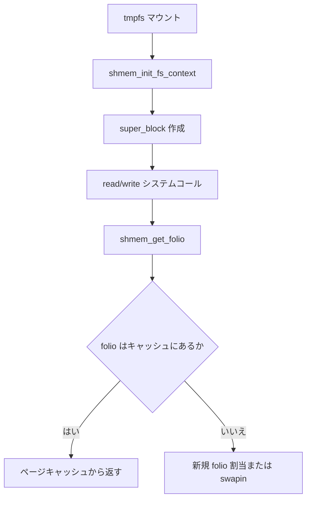

# 第16章 tmpfs と shmem

> **本章で読むソース**
>
> - [`mm/shmem.c` L5368-L5377](https://github.com/gregkh/linux/blob/v6.18.38/mm/shmem.c#L5368-L5377)
> - [`mm/shmem.c` L5449-L5456](https://github.com/gregkh/linux/blob/v6.18.38/mm/shmem.c#L5449-L5456)
> - [`mm/shmem.c` L2666-L2672](https://github.com/gregkh/linux/blob/v6.18.38/mm/shmem.c#L2666-L2672)
> - [`mm/shmem.c` L2455-L2465](https://github.com/gregkh/linux/blob/v6.18.38/mm/shmem.c#L2455-L2465)
> - [`mm/shmem.c` L5355-L5366](https://github.com/gregkh/linux/blob/v6.18.38/mm/shmem.c#L5355-L5366)
> - [`mm/shmem.c` L275-L275](https://github.com/gregkh/linux/blob/v6.18.38/mm/shmem.c#L275-L275)

## この章の狙い

tmpfs が `shmem` 実装を介して RAM 上のページキャッシュとしてファイルを提供する仕組みを追う。
ブロックデバイスを持たないファイルシステムの代表例であり、mm サブシステムとの境界を明示する。

## 前提

- [folio とページ単位](../../mm/part00-foundation/02-folio-page-unit.md)
- [address_space と XArray](../../vfs/part04-page-cache/13-address-space-xarray.md)

## tmpfs の file_system_type

tmpfs は `shmem_fs_type` として登録され、名前は `"tmpfs"` である。
`init_fs_context` でマウントパラメータを解析し、`kill_litter_super` で super_block を破棄する。

[`mm/shmem.c` L5368-L5377](https://github.com/gregkh/linux/blob/v6.18.38/mm/shmem.c#L5368-L5377)

```c
static struct file_system_type shmem_fs_type = {
	.owner		= THIS_MODULE,
	.name		= "tmpfs",
	.init_fs_context = shmem_init_fs_context,
#ifdef CONFIG_TMPFS
	.parameters	= shmem_fs_parameters,
#endif
	.kill_sb	= kill_litter_super,
	.fs_flags	= FS_USERNS_MOUNT | FS_ALLOW_IDMAP | FS_MGTIME,
};
```

`FS_USERNS_MOUNT` によりユーザー namespace 内マウントが可能である。

## 初期化と kern_mount

起動時に `register_filesystem` のあと `kern_mount` で内部マウント `shm_mnt` を作る。
POSIX 共有メモリや memfd も同じ shmem 実装を共有する。

[`mm/shmem.c` L5449-L5456](https://github.com/gregkh/linux/blob/v6.18.38/mm/shmem.c#L5449-L5456)

```c
	error = register_filesystem(&shmem_fs_type);
	if (error) {
		pr_err("Could not register tmpfs\n");
		goto out2;
	}

	shm_mnt = kern_mount(&shmem_fs_type);
	if (IS_ERR(shm_mnt)) {
```

## shmem_get_folio によるページ取得

ファイルページはディスクではなく shmem の address_space から folio を取得する。
swap に追い出されたページは swapin 経由で戻る。

[`mm/shmem.c` L2666-L2672](https://github.com/gregkh/linux/blob/v6.18.38/mm/shmem.c#L2666-L2672)

```c
int shmem_get_folio(struct inode *inode, pgoff_t index, loff_t write_end,
		    struct folio **foliop, enum sgp_type sgp)
{
	return shmem_get_folio_gfp(inode, index, write_end, foliop, sgp,
			mapping_gfp_mask(inode->i_mapping), NULL, NULL);
}
EXPORT_SYMBOL_GPL(shmem_get_folio);
```

`sgp_type` は割当モード（読取、書込、巨大ページ等）を指定する。

## shmem_get_folio_gfp によるページ確保

`shmem_get_folio_gfp` はページキャッシュ検索、swapin、新規 folio 割当を統合する。
キャッシュ未命中時は `filemap_get_entry` から swap または新規割当へ進む。

[`mm/shmem.c` L2463-L2503](https://github.com/gregkh/linux/blob/v6.18.38/mm/shmem.c#L2463-L2503)

```c
static int shmem_get_folio_gfp(struct inode *inode, pgoff_t index,
		loff_t write_end, struct folio **foliop, enum sgp_type sgp,
		gfp_t gfp, struct vm_fault *vmf, vm_fault_t *fault_type)
{
	struct vm_area_struct *vma = vmf ? vmf->vma : NULL;
	struct mm_struct *fault_mm;
	struct folio *folio;
	int error;
	bool alloced;
	unsigned long orders = 0;

	if (WARN_ON_ONCE(!shmem_mapping(inode->i_mapping)))
		return -EINVAL;

	if (index > (MAX_LFS_FILESIZE >> PAGE_SHIFT))
		return -EFBIG;
repeat:
	if (sgp <= SGP_CACHE &&
	    ((loff_t)index << PAGE_SHIFT) >= i_size_read(inode))
		return -EINVAL;

	alloced = false;
	fault_mm = vma ? vma->vm_mm : NULL;

	folio = filemap_get_entry(inode->i_mapping, index);
	if (folio && vma && userfaultfd_minor(vma)) {
		if (!xa_is_value(folio))
			folio_put(folio);
		*fault_type = handle_userfault(vmf, VM_UFFD_MINOR);
		return 0;
	}

	if (xa_is_value(folio)) {
		error = shmem_swapin_folio(inode, index, &folio,
					   sgp, gfp, vma, fault_type);
		if (error == -EEXIST)
			goto repeat;

		*foliop = folio;
		return error;
	}
```

## shmem_alloc_and_add_folio による新規割当

キャッシュ未命中かつ swap でもない場合、`shmem_get_folio_gfp` は `shmem_alloc_and_add_folio` で folio を確保する。
THP 対応時は order を下げながら `shmem_alloc_folio` を試み、通常ページは order 0 で割り当てる。

[`mm/shmem.c` L1904-L1947](https://github.com/gregkh/linux/blob/v6.18.38/mm/shmem.c#L1904-L1947)

```c
static struct folio *shmem_alloc_and_add_folio(struct vm_fault *vmf,
		gfp_t gfp, struct inode *inode, pgoff_t index,
		struct mm_struct *fault_mm, unsigned long orders)
{
	struct address_space *mapping = inode->i_mapping;
	struct shmem_inode_info *info = SHMEM_I(inode);
	unsigned long suitable_orders = 0;
	struct folio *folio = NULL;
	pgoff_t aligned_index;
	long pages;
	int error, order;

	if (!IS_ENABLED(CONFIG_TRANSPARENT_HUGEPAGE))
		orders = 0;

	if (orders > 0) {
		suitable_orders = shmem_suitable_orders(inode, vmf,
							mapping, index, orders);

		order = highest_order(suitable_orders);
		while (suitable_orders) {
			pages = 1UL << order;
			aligned_index = round_down(index, pages);
			folio = shmem_alloc_folio(gfp, order, info, aligned_index);
			if (folio) {
				index = aligned_index;
				goto allocated;
			}

			if (pages == HPAGE_PMD_NR)
				count_vm_event(THP_FILE_FALLBACK);
			count_mthp_stat(order, MTHP_STAT_SHMEM_FALLBACK);
			order = next_order(&suitable_orders, order);
		}
	} else {
		pages = 1;
		folio = shmem_alloc_folio(gfp, 0, info, index);
	}
	if (!folio)
		return ERR_PTR(-ENOMEM);

allocated:
	__folio_set_locked(folio);
	__folio_set_swapbacked(folio);
```

## fs_context 初期化

マウント時は `shmem_init_fs_context` が `fs_context` を初期化する。

[`mm/shmem.c` L5344-L5366](https://github.com/gregkh/linux/blob/v6.18.38/mm/shmem.c#L5344-L5366)

```c
int shmem_init_fs_context(struct fs_context *fc)
{
	struct shmem_options *ctx;

	ctx = kzalloc(sizeof(struct shmem_options), GFP_KERNEL);
	if (!ctx)
		return -ENOMEM;

	ctx->mode = 0777 | S_ISVTX;
	ctx->uid = current_fsuid();
	ctx->gid = current_fsgid();

#if IS_ENABLED(CONFIG_UNICODE)
	ctx->encoding = NULL;
#endif

	fc->fs_private = ctx;
	fc->ops = &shmem_fs_context_ops;
#ifdef CONFIG_TMPFS
	fc->sb_flags |= SB_I_VERSION;
#endif
	return 0;
}
```

## mm 分冊との境界

shmem の folio 回収、swap、memcg 課金は [メモリ管理](../../mm/README.md) 側の reclaim と swap 章が詳しい。
本分冊では tmpfs マウントと `shmem_get_folio` 入口までを扱う。

## 処理の流れ



## 高速化と最適化の工夫

RAM 上のファイルはブロック I/O がなく、ページキャッシュ命中がそのまま読取完了になる。
swap 対応により物理メモリ圧力下でも tmpfs を他キャッシュと同様に追い出せる。
`mapping_gfp_mask` により NUMA 局所性とメモリ圧力ポリシーをマウント単位で調整できる。

## まとめ

tmpfs は shmem 実装のファイルシステム名であり、実体はページキャッシュと swap 上の folio である。
ブロックデバイス型ファイルシステムとは I/O 経路が根本的に異なる。

## 関連する章

- [procfs、sysfs と kernfs](17-procfs-sysfs-kernfs.md)
- [folio とページ単位](../../mm/part00-foundation/02-folio-page-unit.md)
- [overlayfs の upper/lower とコピーアップ](15-overlayfs-copy-up.md)
