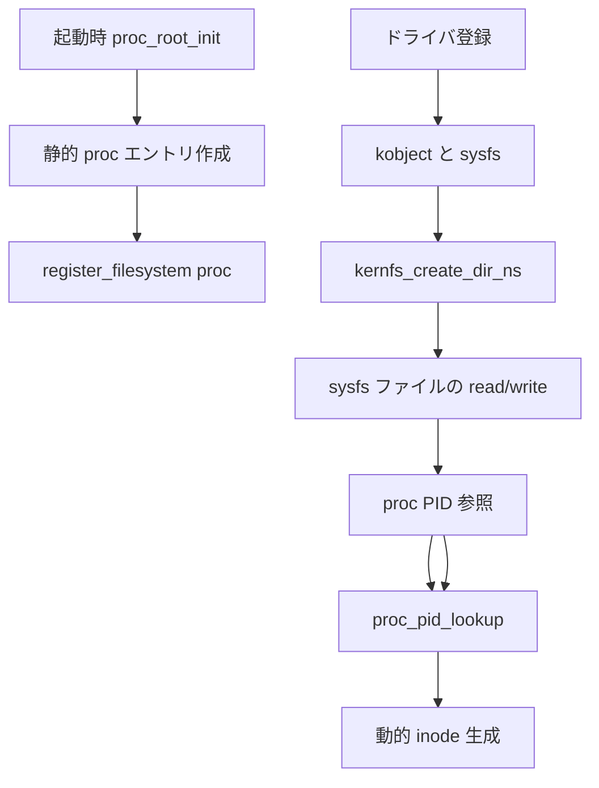

# 第17章 procfs、sysfs と kernfs

> **本章で読むソース**
>
> - [`fs/proc/root.c` L365-L397](https://github.com/gregkh/linux/blob/v6.18.38/fs/proc/root.c#L365-L397)
> - [`fs/proc/root.c` L371-L389](https://github.com/gregkh/linux/blob/v6.18.38/fs/proc/root.c#L371-L389)
> - [`fs/kernfs/dir.c` L1074-L1099](https://github.com/gregkh/linux/blob/v6.18.38/fs/kernfs/dir.c#L1074-L1099)
> - [`fs/sysfs/dir.c` L36-L40](https://github.com/gregkh/linux/blob/v6.18.38/fs/sysfs/dir.c#L36-L40)
> - [`fs/kernfs/dir.c` L1063-L1072](https://github.com/gregkh/linux/blob/v6.18.38/fs/kernfs/dir.c#L1063-L1072)
> - [`fs/proc/root.c` L409-L414](https://github.com/gregkh/linux/blob/v6.18.38/fs/proc/root.c#L409-L414)

## この章の狙い

procfs と sysfs が仮想ファイルとしてカーネル内部状態を公開する仕組みを読み、sysfs の下支えである **kernfs** との関係を整理する。
foundation 分冊の kobject 一般論とは境界を分け、ファイルシステムとしての登録とディレクトリ作成に焦点を当てる。

## 前提

- [file_system_type とファイルシステム登録](../part00-overview/01-file-system-type-registration.md)
- kobject とドライバモデルは計画分冊 [デバイスモデルとドライバ基盤](../../README.md) の対象とする。

## procfs の起動時初期化

`proc_root_init` は起動時に proc の dentry 木を組み立て、最後に `register_filesystem` する。
`self`、`thread-self`、`mounts` などの固定エントリと、`proc_net_init` 等のサブツリー初期化を含む。

[`fs/proc/root.c` L371-L397](https://github.com/gregkh/linux/blob/v6.18.38/fs/proc/root.c#L371-L397)

```c
void __init proc_root_init(void)
{
	proc_init_kmemcache();
	set_proc_pid_nlink();
	proc_self_init();
	proc_thread_self_init();
	proc_symlink("mounts", NULL, "self/mounts");

	proc_net_init();
	proc_mkdir("fs", NULL);
	proc_mkdir("driver", NULL);
	proc_create_mount_point("fs/nfsd"); /* somewhere for the nfsd filesystem to be mounted */
#if defined(CONFIG_SUN_OPENPROMFS) || defined(CONFIG_SUN_OPENPROMFS_MODULE)
	/* just give it a mountpoint */
	proc_create_mount_point("openprom");
#endif
	proc_tty_init();
	proc_mkdir("bus", NULL);
	proc_sys_init();

	/*
	 * Last things last. It is not like userspace processes eager
	 * to open /proc files exist at this point but register last
	 * anyway.
	 */
	register_filesystem(&proc_fs_type);
}
```

procfs はプロセス ID ごとの動的ディレクトリを `proc_pid_lookup` で生成する。

[`fs/proc/root.c` L409-L414](https://github.com/gregkh/linux/blob/v6.18.38/fs/proc/root.c#L409-L414)

```c
static struct dentry *proc_root_lookup(struct inode * dir, struct dentry * dentry, unsigned int flags)
{
	if (!proc_pid_lookup(dentry, flags))
		return NULL;

	return proc_lookup(dir, dentry, flags);
```

## proc の file_system_type

proc も `init_fs_context` ベースの現行マウント API を使う。

[`fs/proc/root.c` L365-L369](https://github.com/gregkh/linux/blob/v6.18.38/fs/proc/root.c#L365-L369)

```c
	.init_fs_context	= proc_init_fs_context,
	.parameters		= proc_fs_parameters,
	.kill_sb		= proc_kill_sb,
	.fs_flags		= FS_USERNS_MOUNT | FS_DISALLOW_NOTIFY_PERM,
};
```

## kernfs によるディレクトリノード

sysfs は kernfs 上に `kernfs_node` 木を構築する。
`kernfs_create_dir_ns` は親ノード配下にディレクトリを追加する。

[`fs/kernfs/dir.c` L1074-L1099](https://github.com/gregkh/linux/blob/v6.18.38/fs/kernfs/dir.c#L1074-L1099)

```c
struct kernfs_node *kernfs_create_dir_ns(struct kernfs_node *parent,
					 const char *name, umode_t mode,
					 kuid_t uid, kgid_t gid,
					 void *priv, const void *ns)
{
	struct kernfs_node *kn;
	int rc;

	/* allocate */
	kn = kernfs_new_node(parent, name, mode | S_IFDIR,
			     uid, gid, KERNFS_DIR);
	if (!kn)
		return ERR_PTR(-ENOMEM);

	kn->dir.root = parent->dir.root;
	kn->ns = ns;
	kn->priv = priv;

	/* link in */
	rc = kernfs_add_one(kn);
	if (!rc)
		return kn;

	kernfs_put(kn);
	return ERR_PTR(rc);
}
```

`priv` にドライバ側オブジェクトを載せ、show/store コールバックから参照する。

## sysfs からの呼び出し

sysfs のディレクトリ作成は kernfs API への薄いラッパーである。

[`fs/sysfs/dir.c` L36-L40](https://github.com/gregkh/linux/blob/v6.18.38/fs/sysfs/dir.c#L36-L40)

```c
 * sysfs_create_dir_ns - create a directory for an object with a namespace tag
 * @kobj: object we're creating directory for
 * @ns: the namespace tag to use
 */
int sysfs_create_dir_ns(struct kobject *kobj, const void *ns)
```

kobject ライフサイクルと sysfs ディレクトリの対応はドライバモデル側の責務である。

## kernfs_fop_open による open 経路

sysfs ファイルを open すると `kernfs_fop_open` が `kernfs_open_file` を割り当て、ノードの `kernfs_ops` を参照する。
`ops->seq_show` があるときは `seq_open` で `kernfs_seq_ops` を接続し、read は `kernfs_fop_read_iter` から `seq_read_iter` へ委譲する。

[`fs/kernfs/file.c` L610-L643](https://github.com/gregkh/linux/blob/v6.18.38/fs/kernfs/file.c#L610-L643)

```c
static int kernfs_fop_open(struct inode *inode, struct file *file)
{
	struct kernfs_node *kn = inode->i_private;
	struct kernfs_root *root = kernfs_root(kn);
	const struct kernfs_ops *ops;
	struct kernfs_open_file *of;
	bool has_read, has_write, has_mmap;
	int error = -EACCES;

	if (!kernfs_get_active(kn))
		return -ENODEV;

	ops = kernfs_ops(kn);

	has_read = ops->seq_show || ops->read || ops->mmap;
	has_write = ops->write || ops->mmap;
	has_mmap = ops->mmap;

	/* see the flag definition for details */
	if (root->flags & KERNFS_ROOT_EXTRA_OPEN_PERM_CHECK) {
		if ((file->f_mode & FMODE_WRITE) &&
		    (!(inode->i_mode & S_IWUGO) || !has_write))
			goto err_out;

		if ((file->f_mode & FMODE_READ) &&
		    (!(inode->i_mode & S_IRUGO) || !has_read))
			goto err_out;
	}

	/* allocate a kernfs_open_file for the file */
	error = -ENOMEM;
	of = kzalloc(sizeof(struct kernfs_open_file), GFP_KERNEL);
	if (!of)
		goto err_out;
```

[`fs/kernfs/file.c` L698-L711](https://github.com/gregkh/linux/blob/v6.18.38/fs/kernfs/file.c#L698-L711)

```c
	/*
	 * Always instantiate seq_file even if read access doesn't use
	 * seq_file or is not requested.  This unifies private data access
	 * and readable regular files are the vast majority anyway.
	 */
	if (ops->seq_show)
		error = seq_open(file, &kernfs_seq_ops);
	else
		error = seq_open(file, NULL);
	if (error)
		goto err_free;

	of->seq_file = file->private_data;
	of->seq_file->private = of;
```

## seq_show と read_iter

`kernfs_seq_show` は `kernfs_open_file` からノードの `ops->seq_show` を呼ぶ。
`kernfs_fop_read_iter` は `KERNFS_HAS_SEQ_SHOW` が立つファイルを `seq_read_iter` へ渡す。

[`fs/kernfs/file.c` L217-L224](https://github.com/gregkh/linux/blob/v6.18.38/fs/kernfs/file.c#L217-L224)

```c
static int kernfs_seq_show(struct seq_file *sf, void *v)
{
	struct kernfs_open_file *of = sf->private;

	of->event = atomic_read(&of_on(of)->event);

	return of->kn->attr.ops->seq_show(sf, v);
}
```

[`fs/kernfs/file.c` L294-L298](https://github.com/gregkh/linux/blob/v6.18.38/fs/kernfs/file.c#L294-L298)

```c
static ssize_t kernfs_fop_read_iter(struct kiocb *iocb, struct iov_iter *iter)
{
	if (kernfs_of(iocb->ki_filp)->kn->flags & KERNFS_HAS_SEQ_SHOW)
		return seq_read_iter(iocb, iter);
	return kernfs_file_read_iter(iocb, iter);
```

## proc と sysfs の違い

| 観点 | procfs | sysfs |
|---|---|---|
| 主な内容 | プロセス、IRQ、tty など可変レポート | デバイスとカーネルオブジェクトの属性 |
| 木の実装 | proc 固有の lookup と seq_file | kernfs |
| 典型操作 | read でスナップショット取得 | attribute ファイルの read/write |

どちらも backing device を持たず、read/write がカーネル内データ構造を直接シリアライズする。

## 処理の流れ



## 高速化と最適化の工夫

proc の多くのファイルは seq_file で読取時だけ文字列を生成し、常駐バッファを持たない。
kernfs はノード木を共有し、同一属性への重複 dentry 生成を抑える。
namespace タグ付きディレクトリは `kernfs_create_dir_ns` で分離し、コンテナごとの sysfs ビューを安価に提供する。

## まとめ

procfs はプロセス中心の仮想ファイルツリー、sysfs は kernfs 上のカーネルオブジェクトビューである。
sysfs の seq_file 経路は `kernfs_fop_open` から `kernfs_seq_show` まで一連で接続される。

## 関連する章

- [file_system_type とファイルシステム登録](../part00-overview/01-file-system-type-registration.md)
- [tmpfs と shmem](16-tmpfs-shmem.md)
- [全体像と横断基盤](../../foundation/README.md)
