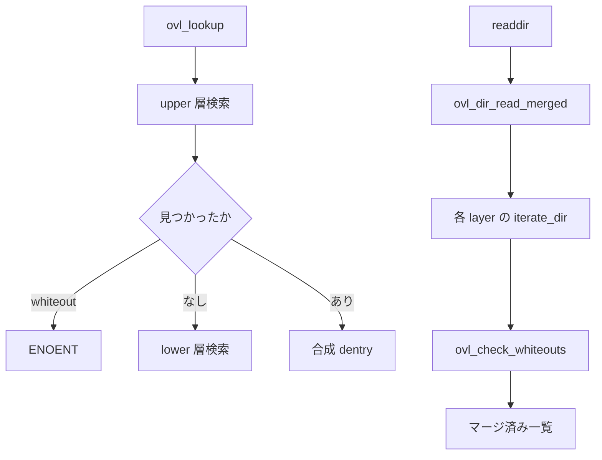

# 第22章 overlayfs の lookup、whiteout、merged readdir

> **本章で読むソース**
>
> - [`fs/overlayfs/namei.c` L1080-L1123](https://github.com/gregkh/linux/blob/v6.18.38/fs/overlayfs/namei.c#L1080-L1123)
> - [`fs/overlayfs/namei.c` L278-L326](https://github.com/gregkh/linux/blob/v6.18.38/fs/overlayfs/namei.c#L278-L326)
> - [`fs/overlayfs/dir.c` L81-L104](https://github.com/gregkh/linux/blob/v6.18.38/fs/overlayfs/dir.c#L81-L104)
> - [`fs/overlayfs/readdir.c` L349-L375](https://github.com/gregkh/linux/blob/v6.18.38/fs/overlayfs/readdir.c#L349-L375)
> - [`fs/overlayfs/readdir.c` L426-L469](https://github.com/gregkh/linux/blob/v6.18.38/fs/overlayfs/readdir.c#L426-L469)
> - [`fs/overlayfs/dir.c` L131-L163](https://github.com/gregkh/linux/blob/v6.18.38/fs/overlayfs/dir.c#L131-L163)
> - [`fs/overlayfs/dir.c` L790-L834](https://github.com/gregkh/linux/blob/v6.18.38/fs/overlayfs/dir.c#L790-L834)

## この章の狙い

overlayfs が upper/lower 各層を **lookup** で合成し、**whiteout** で削除を表現し、**merged readdir** でディレクトリ一覧を統合する経路を追う。
第21章のコピーアップと対になる、読取側の合成機構である。

## 前提

- [overlayfs の upper/lower とコピーアップ](21-overlayfs-copy-up.md)
- [VFS 層の位置づけ](../../vfs/part00-overview/01-vfs-layer-overview.md)

## ovl_lookup

`ovl_lookup` は upper 層を先に引き、必要なら lower 層へ降りる。
`ovl_lookup_data` に redirect や opaque フラグを載せ、層横断の名前解決状態を保持する。

[`fs/overlayfs/namei.c` L1080-L1123](https://github.com/gregkh/linux/blob/v6.18.38/fs/overlayfs/namei.c#L1080-L1123)

```c
struct dentry *ovl_lookup(struct inode *dir, struct dentry *dentry,
			  unsigned int flags)
{
	struct ovl_entry *oe = NULL;
	const struct cred *old_cred;
	struct ovl_fs *ofs = OVL_FS(dentry->d_sb);
	struct ovl_entry *poe = OVL_E(dentry->d_parent);
	struct ovl_entry *roe = OVL_E(dentry->d_sb->s_root);
	struct ovl_path *stack = NULL, *origin_path = NULL;
	struct dentry *upperdir, *upperdentry = NULL;
	struct dentry *origin = NULL;
	struct dentry *index = NULL;
	unsigned int ctr = 0;
	struct inode *inode = NULL;
	bool upperopaque = false;
	bool check_redirect = (ovl_redirect_follow(ofs) || ofs->numdatalayer);
	struct dentry *this;
	unsigned int i;
	int err;
	bool uppermetacopy = false;
	int metacopy_size = 0;
	struct ovl_lookup_data d = {
		.sb = dentry->d_sb,
		.dentry = dentry,
		.name = dentry->d_name,
		.is_dir = false,
		.opaque = false,
		.stop = false,
		.last = check_redirect ? false : !ovl_numlower(poe),
		.redirect = NULL,
		.upperredirect = NULL,
		.metacopy = 0,
	};

	if (dentry->d_name.len > ofs->namelen)
		return ERR_PTR(-ENAMETOOLONG);

	old_cred = ovl_override_creds(dentry->d_sb);
	upperdir = ovl_dentry_upper(dentry->d_parent);
	if (upperdir) {
		d.layer = &ofs->layers[0];
		err = ovl_lookup_layer(upperdir, &d, &upperdentry, true);
		if (err)
			goto out;
```

単一層 lookup は `ovl_lookup_single` が実ファイルシステムへ委譲する。
whiteout dentry を見つけると `d->stop` を立て lower 走査を止め、opaque ディレクトリでは `d->opaque` を立てる。

[`fs/overlayfs/namei.c` L278-L326](https://github.com/gregkh/linux/blob/v6.18.38/fs/overlayfs/namei.c#L278-L326)

```c
	if (ovl_path_is_whiteout(ofs, &path)) {
		d->stop = d->opaque = true;
		goto put_and_out;
	}
	/*
	 * This dentry should be a regular file if previous layer lookup
	 * found a metacopy dentry.
	 */
	if (last_element && d->metacopy && !d_is_reg(this)) {
		d->stop = true;
		goto put_and_out;
	}

	if (!d_can_lookup(this)) {
		if (d->is_dir || !last_element) {
			d->stop = true;
			goto put_and_out;
		}
		err = ovl_check_metacopy_xattr(ofs, &path, NULL);
		if (err < 0)
			goto out_err;

		d->metacopy = err;
		d->stop = !d->metacopy;
		if (!d->metacopy || d->last)
			goto out;
	} else {
		if (ovl_lookup_trap_inode(d->sb, this)) {
			/* Caught in a trap of overlapping layers */
			warn = "overlapping layers";
			err = -ELOOP;
			goto out_warn;
		}

		if (last_element)
			d->is_dir = true;
		if (d->last)
			goto out;

		/* overlay.opaque=x means xwhiteouts directory */
		val = ovl_get_opaquedir_val(ofs, &path);
		if (last_element && !is_upper && val == 'x') {
			d->xwhiteouts = true;
			ovl_layer_set_xwhiteouts(ofs, d->layer);
		} else if (val == 'y') {
			d->stop = true;
			if (last_element)
				d->opaque = true;
			goto out;
		}
	}
```

[`fs/overlayfs/namei.c` L227-L260](https://github.com/gregkh/linux/blob/v6.18.38/fs/overlayfs/namei.c#L227-L260)

```c
static int ovl_lookup_single(struct dentry *base, struct ovl_lookup_data *d,
			     const char *name, unsigned int namelen,
			     size_t prelen, const char *post,
			     struct dentry **ret, bool drop_negative)
{
	struct ovl_fs *ofs = OVL_FS(d->sb);
	struct dentry *this = NULL;
	const char *warn;
	struct path path;
	int err;
	bool last_element = !post[0];
	bool is_upper = d->layer->idx == 0;
	char val;

	/*
	 * We allow filesystems that are case-folding capable as long as the
	 * layers are consistently enabled in the stack, enabled for every dir
	 * or disabled in all dirs. If someone has modified case folding on a
	 * directory on underlying layer, the warranty of the ovl stack is
	 * voided.
	 */
	if (ofs->casefold != ovl_dentry_casefolded(base)) {
		warn = "parent wrong casefold";
		err = -ESTALE;
		goto out_warn;
	}

	this = ovl_lookup_positive_unlocked(d, name, base, namelen, drop_negative);
	if (IS_ERR(this)) {
		err = PTR_ERR(this);
		this = NULL;
		if (err == -ENOENT || err == -ENAMETOOLONG)
			goto out;
		goto out_err;
	}
```

## whiteout

overlay namespace で lower を隠す whiteout は upper 層の特殊 dentry である。
`ovl_whiteout` は削除時に workdir へ共有一時 whiteout を作る内部ヘルパであり、lookup で見つかる whiteout 一般とは別物である。

[`fs/overlayfs/dir.c` L81-L104](https://github.com/gregkh/linux/blob/v6.18.38/fs/overlayfs/dir.c#L81-L104)

```c
static struct dentry *ovl_whiteout(struct ovl_fs *ofs)
{
	int err;
	struct dentry *whiteout;
	struct dentry *workdir = ofs->workdir;
	struct inode *wdir = workdir->d_inode;

	guard(mutex)(&ofs->whiteout_lock);

	if (!ofs->whiteout) {
		inode_lock_nested(wdir, I_MUTEX_PARENT);
		whiteout = ovl_lookup_temp(ofs, workdir);
		if (!IS_ERR(whiteout)) {
			err = ovl_do_whiteout(ofs, wdir, whiteout);
			if (err) {
				dput(whiteout);
				whiteout = ERR_PTR(err);
			}
		}
		inode_unlock(wdir);
		if (IS_ERR(whiteout))
			return whiteout;
		ofs->whiteout = whiteout;
	}
```

削除時は `ovl_remove_and_whiteout` が upper の既存 dentry を消し、`ovl_cleanup_and_whiteout` で workdir の共有 whiteout を upper へ rename して公開する。

[`fs/overlayfs/dir.c` L131-L163](https://github.com/gregkh/linux/blob/v6.18.38/fs/overlayfs/dir.c#L131-L163)

```c
int ovl_cleanup_and_whiteout(struct ovl_fs *ofs, struct dentry *dir,
			     struct dentry *dentry)
{
	struct dentry *whiteout;
	int err;
	int flags = 0;

	whiteout = ovl_whiteout(ofs);
	err = PTR_ERR(whiteout);
	if (IS_ERR(whiteout))
		return err;

	if (d_is_dir(dentry))
		flags = RENAME_EXCHANGE;

	err = ovl_lock_rename_workdir(ofs->workdir, whiteout, dir, dentry);
	if (!err) {
		err = ovl_do_rename(ofs, ofs->workdir, whiteout, dir, dentry, flags);
		unlock_rename(ofs->workdir, dir);
	}
	if (err)
		goto kill_whiteout;
	if (flags)
		ovl_cleanup(ofs, ofs->workdir, dentry);

out:
	dput(whiteout);
	return err;

kill_whiteout:
	ovl_cleanup(ofs, ofs->workdir, whiteout);
	goto out;
}
```

[`fs/overlayfs/dir.c` L790-L834](https://github.com/gregkh/linux/blob/v6.18.38/fs/overlayfs/dir.c#L790-L834)

```c
static int ovl_remove_and_whiteout(struct dentry *dentry,
				   struct list_head *list)
{
	struct ovl_fs *ofs = OVL_FS(dentry->d_sb);
	struct dentry *workdir = ovl_workdir(dentry);
	struct dentry *upperdir = ovl_dentry_upper(dentry->d_parent);
	struct dentry *upper;
	struct dentry *opaquedir = NULL;
	int err;

	if (WARN_ON(!workdir))
		return -EROFS;

	if (!list_empty(list)) {
		opaquedir = ovl_clear_empty(dentry, list);
		err = PTR_ERR(opaquedir);
		if (IS_ERR(opaquedir))
			goto out;
	}

	upper = ovl_lookup_upper_unlocked(ofs, dentry->d_name.name, upperdir,
					  dentry->d_name.len);
	err = PTR_ERR(upper);
	if (IS_ERR(upper))
		goto out_dput;

	err = -ESTALE;
	if ((opaquedir && upper != opaquedir) ||
	    (!opaquedir && ovl_dentry_upper(dentry) &&
	     !ovl_matches_upper(dentry, upper))) {
		goto out_dput_upper;
	}

	err = ovl_cleanup_and_whiteout(ofs, upperdir, upper);
	if (!err)
		ovl_dir_modified(dentry->d_parent, true);

	d_drop(dentry);
out_dput_upper:
	dput(upper);
out_dput:
	dput(opaquedir);
out:
	return err;
}
```

## merged readdir

`ovl_dir_read_merged` は各 layer の `iterate_dir` 結果をマージする。
最下層はリスト中央へ挿入し、offset の安定性を保つ。

[`fs/overlayfs/readdir.c` L426-L469](https://github.com/gregkh/linux/blob/v6.18.38/fs/overlayfs/readdir.c#L426-L469)

```c
static int ovl_dir_read_merged(struct dentry *dentry, struct list_head *list,
	struct rb_root *root)
{
	int err;
	struct path realpath;
	struct ovl_readdir_data rdd = {
		.ctx.actor = ovl_fill_merge,
		.ctx.count = INT_MAX,
		.dentry = dentry,
		.list = list,
		.root = root,
		.is_lowest = false,
		.map = NULL,
	};
	int idx, next;
	const struct ovl_layer *layer;
	struct ovl_fs *ofs = OVL_FS(dentry->d_sb);

	for (idx = 0; idx != -1; idx = next) {
		next = ovl_path_next(idx, dentry, &realpath, &layer);

		if (ofs->casefold)
			rdd.map = sb_encoding(realpath.dentry->d_sb);

		rdd.is_upper = ovl_dentry_upper(dentry) == realpath.dentry;
		rdd.in_xwhiteouts_dir = layer->has_xwhiteouts &&
					ovl_dentry_has_xwhiteouts(dentry);

		if (next != -1) {
			err = ovl_dir_read(&realpath, &rdd);
			if (err)
				break;
		} else {
			/*
			 * Insert lowest layer entries before upper ones, this
			 * allows offsets to be reasonably constant
			 */
			list_add(&rdd.middle, rdd.list);
			rdd.is_lowest = true;
			err = ovl_dir_read(&realpath, &rdd);
			list_del(&rdd.middle);
		}
	}
	return err;
}
```

`ovl_dir_read` は実ディレクトリを open して `iterate_dir` する。

[`fs/overlayfs/readdir.c` L377-L395](https://github.com/gregkh/linux/blob/v6.18.38/fs/overlayfs/readdir.c#L377-L395)

```c
static inline int ovl_dir_read(const struct path *realpath,
			       struct ovl_readdir_data *rdd)
{
	struct file *realfile;
	int err;

	realfile = ovl_path_open(realpath, O_RDONLY | O_LARGEFILE);
	if (IS_ERR(realfile))
		return PTR_ERR(realfile);

	rdd->first_maybe_whiteout = NULL;
	rdd->ctx.pos = 0;
	do {
		rdd->count = 0;
		rdd->err = 0;
		err = iterate_dir(realfile, &rdd->ctx);
		if (err >= 0)
			err = rdd->err;
```

whiteout 判定は readdir 後に `ovl_check_whiteouts` で行う。

[`fs/overlayfs/readdir.c` L349-L375](https://github.com/gregkh/linux/blob/v6.18.38/fs/overlayfs/readdir.c#L349-L375)

```c
static int ovl_check_whiteouts(const struct path *path, struct ovl_readdir_data *rdd)
{
	int err = 0;
	struct dentry *dentry, *dir = path->dentry;
	const struct cred *old_cred;

	old_cred = ovl_override_creds(rdd->dentry->d_sb);

	while (rdd->first_maybe_whiteout) {
		struct ovl_cache_entry *p =
			rdd->first_maybe_whiteout;
		rdd->first_maybe_whiteout = p->next_maybe_whiteout;
		dentry = lookup_one_positive_killable(mnt_idmap(path->mnt),
						      &QSTR_LEN(p->name, p->len),
						      dir);
		if (!IS_ERR(dentry)) {
			p->is_whiteout = ovl_is_whiteout(dentry);
			dput(dentry);
		} else if (PTR_ERR(dentry) == -EINTR) {
			err = -EINTR;
			break;
		}
	}
	ovl_revert_creds(old_cred);

	return err;
}
```

## 処理の流れ



## 高速化と最適化の工夫

readdir 結果は `ovl_dir_cache` にキャッシュし、inode バージョンが変わるまで再利用する。
最下層エントリをリスト中央へ挿入することで、層追加後も readdir offset を大きくずらさない。
共有 whiteout inode は workdir に1つだけ作り、削除マークの dentry 作成コストを下げる。

## まとめ

overlayfs の lookup は層を順に辿り whiteout で lower を隠す。
merged readdir は各層の一覧を統合し、whiteout 判定を遅延実行する。

## 関連する章

- [overlayfs の upper/lower とコピーアップ](21-overlayfs-copy-up.md)
- [マウント namespace](../../vfs/part02-mount-inode/08-mount-namespace.md)
