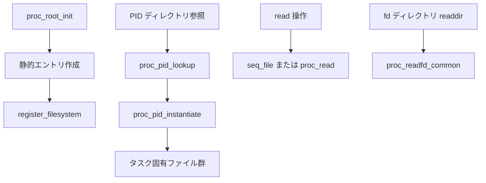

# 第24章 procfs

> **本章で読むソース**
>
> - [`fs/proc/root.c` L365-L397](https://github.com/gregkh/linux/blob/v6.18.38/fs/proc/root.c#L365-L397)
> - [`fs/proc/root.c` L409-L414](https://github.com/gregkh/linux/blob/v6.18.38/fs/proc/root.c#L409-L414)
> - [`fs/proc/base.c` L3511-L3543](https://github.com/gregkh/linux/blob/v6.18.38/fs/proc/base.c#L3511-L3543)
> - [`fs/proc/inode.c` L629-L680](https://github.com/gregkh/linux/blob/v6.18.38/fs/proc/inode.c#L629-L680)
> - [`fs/proc/fd.c` L23-L52](https://github.com/gregkh/linux/blob/v6.18.38/fs/proc/fd.c#L23-L52)
> - [`fs/proc/fd.c` L248-L284](https://github.com/gregkh/linux/blob/v6.18.38/fs/proc/fd.c#L248-L284)

## この章の狙い

**procfs** がプロセスとカーネル状態を仮想ファイルとして公開する仕組みを読む。
動的に生成される PID ディレクトリと、起動時に固定されるエントリの違いを押さえる。

## 前提

- [個別 FS の登録とマウント入口](../part00-overview/01-fs-registration-mount-entry.md)
- kobject とドライバモデルは計画分冊 [デバイスモデルとドライバ基盤](../../README.md) の対象とする。

## proc_root_init

起動時に proc の dentry 木を組み立て、最後に `register_filesystem` する。
`self`、`thread-self`、`mounts` などの固定エントリを先に作成する。

[`fs/proc/root.c` L371-L397](https://github.com/gregkh/linux/blob/v6.18.38/fs/proc/root.c#L371-L397)

```c
void __init proc_root_init(void)
{
	proc_init_kmemcache();
	set_proc_pid_nlink();
	proc_self_init();
	proc_thread_self_init();
	proc_symlink("mounts", NULL, "self/mounts");

	proc_net_init();
	proc_mkdir("fs", NULL);
	proc_mkdir("driver", NULL);
	proc_create_mount_point("fs/nfsd"); /* somewhere for the nfsd filesystem to be mounted */
#if defined(CONFIG_SUN_OPENPROMFS) || defined(CONFIG_SUN_OPENPROMFS_MODULE)
	/* just give it a mountpoint */
	proc_create_mount_point("openprom");
#endif
	proc_tty_init();
	proc_mkdir("bus", NULL);
	proc_sys_init();

	/*
	 * Last things last. It is not like userspace processes eager
	 * to open /proc files exist at this point but register last
	 * anyway.
	 */
	register_filesystem(&proc_fs_type);
}
```

## ルート lookup

`proc_root_lookup` は数値名を PID ディレクトリとして `proc_pid_lookup` へ委譲する。
それ以外は静的エントリの `proc_lookup` を使う。

[`fs/proc/root.c` L409-L414](https://github.com/gregkh/linux/blob/v6.18.38/fs/proc/root.c#L409-L414)

```c
static struct dentry *proc_root_lookup(struct inode * dir, struct dentry * dentry, unsigned int flags)
{
	if (!proc_pid_lookup(dentry, flags))
		return NULL;

	return proc_lookup(dir, dentry, flags);
```

## PID ディレクトリの生成

`proc_pid_lookup` は dentry 名を PID として検証し、存在するタスクなら `proc_pid_instantiate` する。

[`fs/proc/base.c` L3511-L3543](https://github.com/gregkh/linux/blob/v6.18.38/fs/proc/base.c#L3511-L3543)

```c
struct dentry *proc_pid_lookup(struct dentry *dentry, unsigned int flags)
{
	struct task_struct *task;
	unsigned tgid;
	struct proc_fs_info *fs_info;
	struct pid_namespace *ns;
	struct dentry *result = ERR_PTR(-ENOENT);

	tgid = name_to_int(&dentry->d_name);
	if (tgid == ~0U)
		goto out;

	fs_info = proc_sb_info(dentry->d_sb);
	ns = fs_info->pid_ns;
	rcu_read_lock();
	task = find_task_by_pid_ns(tgid, ns);
	if (task)
		get_task_struct(task);
	rcu_read_unlock();
	if (!task)
		goto out;

	/* Limit procfs to only ptraceable tasks */
	if (fs_info->hide_pid == HIDEPID_NOT_PTRACEABLE) {
		if (!has_pid_permissions(fs_info, task, HIDEPID_NO_ACCESS))
			goto out_put_task;
	}

	result = proc_pid_instantiate(dentry, task, NULL);
out_put_task:
	put_task_struct(task);
out:
	return result;
}
```

## proc  inode の操作テーブル

proc inode は `proc_get_inode` で確保され、`proc_iops` と `proc_fops` を載せる。
PID エントリは `pid_dentry_operations` でリリース時に `put_task_struct` する。

[`fs/proc/inode.c` L629-L680](https://github.com/gregkh/linux/blob/v6.18.38/fs/proc/inode.c#L629-L680)

```c
struct inode *proc_get_inode(struct super_block *sb, struct proc_dir_entry *de)
{
	struct inode *inode = new_inode(sb);

	if (!inode) {
		pde_put(de);
		return NULL;
	}

	inode->i_private = de->data;
	inode->i_ino = de->low_ino;
	simple_inode_init_ts(inode);
	PROC_I(inode)->pde = de;
	if (is_empty_pde(de)) {
		make_empty_dir_inode(inode);
		return inode;
	}

	if (de->mode) {
		inode->i_mode = de->mode;
		inode->i_uid = de->uid;
		inode->i_gid = de->gid;
	}
	if (de->size)
		inode->i_size = de->size;
	if (de->nlink)
		set_nlink(inode, de->nlink);

	if (S_ISREG(inode->i_mode)) {
		inode->i_op = de->proc_iops;
		if (pde_has_proc_read_iter(de))
			inode->i_fop = &proc_iter_file_ops;
		else
			inode->i_fop = &proc_reg_file_ops;
#ifdef CONFIG_COMPAT
		if (pde_has_proc_compat_ioctl(de)) {
			if (pde_has_proc_read_iter(de))
				inode->i_fop = &proc_iter_file_ops_compat;
			else
				inode->i_fop = &proc_reg_file_ops_compat;
		}
#endif
	} else if (S_ISDIR(inode->i_mode)) {
		inode->i_op = de->proc_iops;
		inode->i_fop = de->proc_dir_ops;
	} else if (S_ISLNK(inode->i_mode)) {
		inode->i_op = de->proc_iops;
		inode->i_fop = NULL;
	} else {
		BUG();
	}
	return inode;
}
```

## fdinfo の seq_show

`fs/proc/fd.c` の `seq_show` は `/proc/<pid>/fdinfo/<fd>` 用であり、開いているファイルの pos、flags、mnt_id を返す。
fd 番号の一覧列挙は別の readdir 経路が担う。

[`fs/proc/fd.c` L23-L52](https://github.com/gregkh/linux/blob/v6.18.38/fs/proc/fd.c#L23-L52)

```c
static int seq_show(struct seq_file *m, void *v)
{
	struct files_struct *files = NULL;
	int f_flags = 0, ret = -ENOENT;
	struct file *file = NULL;
	struct task_struct *task;

	task = get_proc_task(m->private);
	if (!task)
		return -ENOENT;

	task_lock(task);
	files = task->files;
	if (files) {
		unsigned int fd = proc_fd(m->private);

		spin_lock(&files->file_lock);
		file = files_lookup_fd_locked(files, fd);
		if (file) {
			f_flags = file->f_flags;
			if (close_on_exec(fd, files))
				f_flags |= O_CLOEXEC;

			get_file(file);
			ret = 0;
		}
		spin_unlock(&files->file_lock);
	}
	task_unlock(task);
	put_task_struct(task);
```

## fd ディレクトリの列挙

`/proc/<pid>/fd` の readdir は `proc_fd_iterate` が `proc_readfd_common` を呼び、開いている fd 番号を `dir_emit` する。
fdinfo（上節）とは別経路である。

[`fs/proc/fd.c` L248-L284](https://github.com/gregkh/linux/blob/v6.18.38/fs/proc/fd.c#L248-L284)

```c
static int proc_readfd_common(struct file *file, struct dir_context *ctx,
			      instantiate_t instantiate)
{
	struct task_struct *p = get_proc_task(file_inode(file));
	unsigned int fd;

	if (!p)
		return -ENOENT;

	if (!dir_emit_dots(file, ctx))
		goto out;

	for (fd = ctx->pos - 2;; fd++) {
		struct file *f;
		struct fd_data data;
		char name[10 + 1];
		unsigned int len;

		f = fget_task_next(p, &fd);
		ctx->pos = fd + 2LL;
		if (!f)
			break;
		data.mode = f->f_mode;
		fput(f);
		data.fd = fd;

		len = snprintf(name, sizeof(name), "%u", fd);
		if (!proc_fill_cache(file, ctx,
				     name, len, instantiate, p,
				     &data))
			break;
		cond_resched();
	}
out:
	put_task_struct(p);
	return 0;
}
```

## 処理の流れ



## 高速化と最適化の工夫

proc の多くのファイルは read 時だけ `seq_file` で文字列を生成し、常駐バッファを持たない。
PID lookup は `rcu_read_lock` 下で `find_task_by_pid_ns` を呼び、タスクリスト走査のロック保持を短くする。
`proc_get_inode` は `proc_dir_entry` を inode に載せ、同一テンプレートのエントリ生成を共通化する。

## まとめ

procfs は起動時静的ツリーと PID 動的ツリーの二層でカーネル状態を公開する。
lookup は数値名をタスクへ結び、各ファイルは seq_file 等でスナップショットを返す。
fd 一覧は `proc_readfd_common`、fdinfo は個別 fd のメタデータを seq_show で整形する。

## 関連する章

- [kernfs と sysfs 属性](25-kernfs-sysfs-attributes.md)
- [tmpfs と shmem](23-tmpfs-shmem.md)
