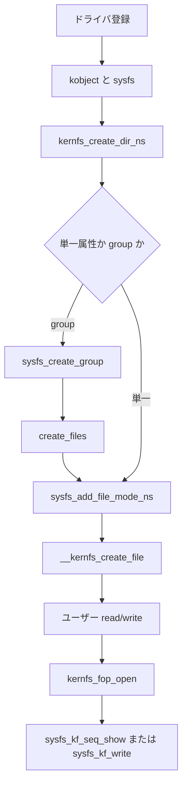

# 第25章 kernfs と sysfs 属性

> **本章で読むソース**
>
> - [`fs/kernfs/dir.c` L1074-L1099](https://github.com/gregkh/linux/blob/v6.18.38/fs/kernfs/dir.c#L1074-L1099)
> - [`fs/kernfs/file.c` L1043-L1065](https://github.com/gregkh/linux/blob/v6.18.38/fs/kernfs/file.c#L1043-L1065)
> - [`fs/sysfs/dir.c` L40-L65](https://github.com/gregkh/linux/blob/v6.18.38/fs/sysfs/dir.c#L40-L65)
> - [`fs/kernfs/file.c` L610-L643](https://github.com/gregkh/linux/blob/v6.18.38/fs/kernfs/file.c#L610-L643)
> - [`fs/kernfs/file.c` L698-L711](https://github.com/gregkh/linux/blob/v6.18.38/fs/kernfs/file.c#L698-L711)
> - [`fs/sysfs/file.c` L273-L318](https://github.com/gregkh/linux/blob/v6.18.38/fs/sysfs/file.c#L273-L318)
> - [`fs/sysfs/file.c` L46-L80](https://github.com/gregkh/linux/blob/v6.18.38/fs/sysfs/file.c#L46-L80)
> - [`fs/sysfs/file.c` L133-L143](https://github.com/gregkh/linux/blob/v6.18.38/fs/sysfs/file.c#L133-L143)
> - [`fs/sysfs/group.c` L53-L79](https://github.com/gregkh/linux/blob/v6.18.38/fs/sysfs/group.c#L53-L79)
> - [`fs/sysfs/group.c` L206-L210](https://github.com/gregkh/linux/blob/v6.18.38/fs/sysfs/group.c#L206-L210)

## この章の狙い

sysfs の下支えである **kernfs** がディレクトリ木と属性ファイルをどう管理し、read/write が `kernfs_ops` へ委譲されるかを読む。
procfs（第24章）と対比し、カーネルオブジェクト属性の公開経路を押さえる。

## 前提

- [procfs](24-procfs.md)
- [個別 FS の登録とマウント入口](../part00-overview/01-fs-registration-mount-entry.md)

## kernfs ディレクトリ作成

`kernfs_create_dir_ns` は親ノード配下にディレクトリ `kernfs_node` を追加する。
`priv` にドライバ側オブジェクトを載せ、namespace タグでビューを分離できる。

[`fs/kernfs/dir.c` L1074-L1099](https://github.com/gregkh/linux/blob/v6.18.38/fs/kernfs/dir.c#L1074-L1099)

```c
struct kernfs_node *kernfs_create_dir_ns(struct kernfs_node *parent,
					 const char *name, umode_t mode,
					 kuid_t uid, kgid_t gid,
					 void *priv, const void *ns)
{
	struct kernfs_node *kn;
	int rc;

	/* allocate */
	kn = kernfs_new_node(parent, name, mode | S_IFDIR,
			     uid, gid, KERNFS_DIR);
	if (!kn)
		return ERR_PTR(-ENOMEM);

	kn->dir.root = parent->dir.root;
	kn->ns = ns;
	kn->priv = priv;

	/* link in */
	rc = kernfs_add_one(kn);
	if (!rc)
		return kn;

	kernfs_put(kn);
	return ERR_PTR(rc);
}
```

属性ファイルは `__kernfs_create_file` で追加する。

[`fs/kernfs/file.c` L1043-L1065](https://github.com/gregkh/linux/blob/v6.18.38/fs/kernfs/file.c#L1043-L1065)

```c
struct kernfs_node *__kernfs_create_file(struct kernfs_node *parent,
					 const char *name,
					 umode_t mode, kuid_t uid, kgid_t gid,
					 loff_t size,
					 const struct kernfs_ops *ops,
					 void *priv, const void *ns,
					 struct lock_class_key *key)
{
	struct kernfs_node *kn;
	unsigned flags;
	int rc;

	flags = KERNFS_FILE;

	kn = kernfs_new_node(parent, name, (mode & S_IALLUGO) | S_IFREG,
			     uid, gid, flags);
	if (!kn)
		return ERR_PTR(-ENOMEM);

	kn->attr.ops = ops;
	kn->attr.size = size;
	kn->ns = ns;
	kn->priv = priv;
```

## sysfs からのラッパー

sysfs のディレクトリ作成は kobject を受け取り、kernfs API へ委譲する。
kobject ライフサイクルと sysfs 木の対応はドライバモデル側の責務である。

[`fs/sysfs/dir.c` L40-L65](https://github.com/gregkh/linux/blob/v6.18.38/fs/sysfs/dir.c#L40-L65)

```c
int sysfs_create_dir_ns(struct kobject *kobj, const void *ns)
{
	struct kernfs_node *parent, *kn;
	kuid_t uid;
	kgid_t gid;

	if (WARN_ON(!kobj))
		return -EINVAL;

	if (kobj->parent)
		parent = kobj->parent->sd;
	else
		parent = sysfs_root_kn;

	if (!parent)
		return -ENOENT;

	kobject_get_ownership(kobj, &uid, &gid);

	kn = kernfs_create_dir_ns(parent, kobject_name(kobj), 0755, uid, gid,
				  kobj, ns);
	if (IS_ERR(kn)) {
		if (PTR_ERR(kn) == -EEXIST)
			sysfs_warn_dup(parent, kobject_name(kobj));
		return PTR_ERR(kn);
	}
```

## sysfs 属性の登録

`sysfs_add_file_mode_ns` は kobject の `sysfs_ops` から `kernfs_ops` を選び、`__kernfs_create_file` で属性ノードを作る。

[`fs/sysfs/file.c` L273-L318](https://github.com/gregkh/linux/blob/v6.18.38/fs/sysfs/file.c#L273-L318)

```c
int sysfs_add_file_mode_ns(struct kernfs_node *parent,
		const struct attribute *attr, umode_t mode, kuid_t uid,
		kgid_t gid, const void *ns)
{
	struct kobject *kobj = parent->priv;
	const struct sysfs_ops *sysfs_ops = kobj->ktype->sysfs_ops;
	struct lock_class_key *key = NULL;
	const struct kernfs_ops *ops = NULL;
	struct kernfs_node *kn;

	/* every kobject with an attribute needs a ktype assigned */
	if (WARN(!sysfs_ops, KERN_ERR
			"missing sysfs attribute operations for kobject: %s\n",
			kobject_name(kobj)))
		return -EINVAL;

	if (mode & SYSFS_PREALLOC) {
		if (sysfs_ops->show && sysfs_ops->store)
			ops = &sysfs_prealloc_kfops_rw;
		else if (sysfs_ops->show)
			ops = &sysfs_prealloc_kfops_ro;
		else if (sysfs_ops->store)
			ops = &sysfs_prealloc_kfops_wo;
	} else {
		if (sysfs_ops->show && sysfs_ops->store)
			ops = &sysfs_file_kfops_rw;
		else if (sysfs_ops->show)
			ops = &sysfs_file_kfops_ro;
		else if (sysfs_ops->store)
			ops = &sysfs_file_kfops_wo;
	}

	if (!ops)
		ops = &sysfs_file_kfops_empty;

	kn = __kernfs_create_file(parent, attr->name, mode & 0777, uid, gid,
				  PAGE_SIZE, ops, (void *)attr, ns, key);
	if (IS_ERR(kn)) {
		if (PTR_ERR(kn) == -EEXIST)
			sysfs_warn_dup(parent, attr->name);
		return PTR_ERR(kn);
	}
```

## attribute group の作成

複数属性は `attribute_group` としてまとめ、`sysfs_create_group` が `internal_create_group` 経由で `create_files` を呼ぶ。
`create_files` は `grp->attrs` を走査し、各属性へ `sysfs_add_file_mode_ns` を適用する。

[`fs/sysfs/group.c` L206-L210](https://github.com/gregkh/linux/blob/v6.18.38/fs/sysfs/group.c#L206-L210)

```c
int sysfs_create_group(struct kobject *kobj,
		       const struct attribute_group *grp)
{
	return internal_create_group(kobj, 0, grp);
}
```

[`fs/sysfs/group.c` L53-L79](https://github.com/gregkh/linux/blob/v6.18.38/fs/sysfs/group.c#L53-L79)

```c
	if (grp->attrs) {
		for (i = 0, attr = grp->attrs; *attr && !error; i++, attr++) {
			umode_t mode = (*attr)->mode;

			/*
			 * In update mode, we're changing the permissions or
			 * visibility.  Do this by first removing then
			 * re-adding (if required) the file.
			 */
			if (update)
				kernfs_remove_by_name(parent, (*attr)->name);
			if (grp->is_visible) {
				mode = grp->is_visible(kobj, *attr, i);
				mode &= ~SYSFS_GROUP_INVISIBLE;
				if (!mode)
					continue;
			}

			WARN(mode & ~(SYSFS_PREALLOC | 0664),
			     "Attribute %s: Invalid permissions 0%o\n",
			     (*attr)->name, mode);

			mode &= SYSFS_PREALLOC | 0664;
			error = sysfs_add_file_mode_ns(parent, *attr, mode, uid,
						       gid, NULL);
			if (unlikely(error))
				break;
		}
```

## sysfs 属性の read と write

read は `sysfs_kf_seq_show` が `sysfs_ops->show` を呼び、write は `sysfs_kf_write` が `sysfs_ops->store` へバッファを渡す。

[`fs/sysfs/file.c` L46-L80](https://github.com/gregkh/linux/blob/v6.18.38/fs/sysfs/file.c#L46-L80)

```c
static int sysfs_kf_seq_show(struct seq_file *sf, void *v)
{
	struct kernfs_open_file *of = sf->private;
	struct kobject *kobj = sysfs_file_kobj(of->kn);
	const struct sysfs_ops *ops = sysfs_file_ops(of->kn);
	ssize_t count;
	char *buf;

	if (WARN_ON_ONCE(!ops->show))
		return -EINVAL;

	/* acquire buffer and ensure that it's >= PAGE_SIZE and clear */
	count = seq_get_buf(sf, &buf);
	if (count < PAGE_SIZE) {
		seq_commit(sf, -1);
		return 0;
	}
	memset(buf, 0, PAGE_SIZE);

	count = ops->show(kobj, of->kn->priv, buf);
	if (count < 0)
		return count;

	/*
	 * The code works fine with PAGE_SIZE return but it's likely to
	 * indicate truncated result or overflow in normal use cases.
	 */
	if (count >= (ssize_t)PAGE_SIZE) {
		printk("fill_read_buffer: %pS returned bad count\n",
				ops->show);
		/* Try to struggle along */
		count = PAGE_SIZE - 1;
	}
	seq_commit(sf, count);
	return 0;
}
```

[`fs/sysfs/file.c` L133-L143](https://github.com/gregkh/linux/blob/v6.18.38/fs/sysfs/file.c#L133-L143)

```c
static ssize_t sysfs_kf_write(struct kernfs_open_file *of, char *buf,
			      size_t count, loff_t pos)
{
	const struct sysfs_ops *ops = sysfs_file_ops(of->kn);
	struct kobject *kobj = sysfs_file_kobj(of->kn);

	if (!count)
		return 0;

	return ops->store(kobj, of->kn->priv, buf, count);
}
```

## kernfs_fop_open

sysfs ファイルを open すると `kernfs_open_file` を割り当て、ノードの `kernfs_ops` を参照する。
`ops->seq_show` があるときは `seq_open` で `kernfs_seq_ops` を接続する。

[`fs/kernfs/file.c` L610-L643](https://github.com/gregkh/linux/blob/v6.18.38/fs/kernfs/file.c#L610-L643)

```c
static int kernfs_fop_open(struct inode *inode, struct file *file)
{
	struct kernfs_node *kn = inode->i_private;
	struct kernfs_root *root = kernfs_root(kn);
	const struct kernfs_ops *ops;
	struct kernfs_open_file *of;
	bool has_read, has_write, has_mmap;
	int error = -EACCES;

	if (!kernfs_get_active(kn))
		return -ENODEV;

	ops = kernfs_ops(kn);

	has_read = ops->seq_show || ops->read || ops->mmap;
	has_write = ops->write || ops->mmap;
	has_mmap = ops->mmap;

	/* see the flag definition for details */
	if (root->flags & KERNFS_ROOT_EXTRA_OPEN_PERM_CHECK) {
		if ((file->f_mode & FMODE_WRITE) &&
		    (!(inode->i_mode & S_IWUGO) || !has_write))
			goto err_out;

		if ((file->f_mode & FMODE_READ) &&
		    (!(inode->i_mode & S_IRUGO) || !has_read))
			goto err_out;
	}

	/* allocate a kernfs_open_file for the file */
	error = -ENOMEM;
	of = kzalloc(sizeof(struct kernfs_open_file), GFP_KERNEL);
	if (!of)
		goto err_out;
```

[`fs/kernfs/file.c` L698-L711](https://github.com/gregkh/linux/blob/v6.18.38/fs/kernfs/file.c#L698-L711)

```c
	/*
	 * Always instantiate seq_file even if read access doesn't use
	 * seq_file or is not requested.  This unifies private data access
	 * and readable regular files are the vast majority anyway.
	 */
	if (ops->seq_show)
		error = seq_open(file, &kernfs_seq_ops);
	else
		error = seq_open(file, NULL);
	if (error)
		goto err_free;

	of->seq_file = file->private_data;
	of->seq_file->private = of;
```

## seq_show と read_iter

`kernfs_seq_show` はノード固有の `ops->seq_show` を呼ぶ。
`kernfs_fop_read_iter` は `KERNFS_HAS_SEQ_SHOW` が立つファイルを `seq_read_iter` へ渡す。

[`fs/kernfs/file.c` L217-L224](https://github.com/gregkh/linux/blob/v6.18.38/fs/kernfs/file.c#L217-L224)

```c
static int kernfs_seq_show(struct seq_file *sf, void *v)
{
	struct kernfs_open_file *of = sf->private;

	of->event = atomic_read(&of_on(of)->event);

	return of->kn->attr.ops->seq_show(sf, v);
}
```

[`fs/kernfs/file.c` L294-L298](https://github.com/gregkh/linux/blob/v6.18.38/fs/kernfs/file.c#L294-L298)

```c
static ssize_t kernfs_fop_read_iter(struct kiocb *iocb, struct iov_iter *iter)
{
	if (kernfs_of(iocb->ki_filp)->kn->flags & KERNFS_HAS_SEQ_SHOW)
		return seq_read_iter(iocb, iter);
	return kernfs_file_read_iter(iocb, iter);
```

## 処理の流れ



## 高速化と最適化の工夫

kernfs はノード木を共有し、同一属性への重複 dentry 生成を抑える。
`seq_file` を常に確保する設計は、read 経路の分岐を減らし、`kernfs_open_file` 経由の private データアクセスを統一する。
namespace タグ付きディレクトリはコンテナごとの sysfs ビューを、追加のファイルシステムマウントなしで提供する。

## まとめ

sysfs は kernfs 上の `kernfs_node` 木でカーネルオブジェクト属性を公開する。
属性登録は単一属性なら `sysfs_add_file_mode_ns`、複数属性なら `sysfs_create_group` が `create_files` 経由で同関数を繰り返し呼ぶ。
read/write は `sysfs_kf_seq_show` と `sysfs_kf_write` がドライバの show/store へ委譲する。

## 関連する章

- [procfs](24-procfs.md)
- [全体像と横断基盤](../../foundation/README.md)
