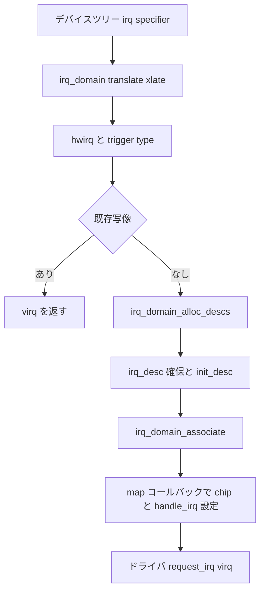

# 第1章 irq_desc と irq_domain

> **本章で読むソース**
>
> - [`include/linux/irqdesc.h` L32-L66](https://github.com/gregkh/linux/blob/v6.18.38/include/linux/irqdesc.h#L32-L66)
> - [`include/linux/irqdesc.h` L67-L120](https://github.com/gregkh/linux/blob/v6.18.38/include/linux/irqdesc.h#L67-L120)
> - [`include/linux/irqdomain.h` L51-L78](https://github.com/gregkh/linux/blob/v6.18.38/include/linux/irqdomain.h#L51-L78)
> - [`include/linux/irqdomain.h` L110-L146](https://github.com/gregkh/linux/blob/v6.18.38/include/linux/irqdomain.h#L110-L146)
> - [`kernel/irq/irqdesc.c` L115-L140](https://github.com/gregkh/linux/blob/v6.18.38/kernel/irq/irqdesc.c#L115-L140)
> - [`kernel/irq/irqdesc.c` L167-L198](https://github.com/gregkh/linux/blob/v6.18.38/kernel/irq/irqdesc.c#L167-L198)
> - [`kernel/irq/irqdomain.c` L769-L795](https://github.com/gregkh/linux/blob/v6.18.38/kernel/irq/irqdomain.c#L769-L795)
> - [`kernel/irq/irqdomain.c` L808-L836](https://github.com/gregkh/linux/blob/v6.18.38/kernel/irq/irqdomain.c#L808-L836)

## この章の狙い

**genirq** の中心データ構造である **irq_desc** と、ハードウェア IRQ 番号を Linux の仮想 IRQ 番号へ写す **irq_domain** の役割を押さえる。
ドライバが `request_irq()` する前に、カーネル内部でどの番号空間がどう結ばれるかを読める状態にする。

## 前提

- [全体像と横断基盤](../../foundation/README.md) でカーネル起動とデバイスツリーの概観を読んでいること。
- [同期と RCU](../../locking/README.md) 第1章で per-CPU 変数とロックの語彙を押さえていること。

## irq_desc：1本の割り込み線の管理単位

Linux カーネルは、各割り込み番号に対応する **irq_desc** を保持する。
`struct irq_desc` のコメントは、統計、ハンドラ、ネストした disable、スレッド化ハンドラ用の待ち行列までを1つの記述子に集約していることを示す。

[`include/linux/irqdesc.h` L32-L66](https://github.com/gregkh/linux/blob/v6.18.38/include/linux/irqdesc.h#L32-L66)

```c
/**
 * struct irq_desc - interrupt descriptor
 * @irq_common_data:	per irq and chip data passed down to chip functions
 * @kstat_irqs:		irq stats per cpu
 * @handle_irq:		highlevel irq-events handler
 * @action:		the irq action chain
 * @status_use_accessors: status information
 * @core_internal_state__do_not_mess_with_it: core internal status information
 * @depth:		disable-depth, for nested irq_disable() calls
 * @wake_depth:		enable depth, for multiple irq_set_irq_wake() callers
 * @tot_count:		stats field for non-percpu irqs
 * @irq_count:		stats field to detect stalled irqs
 * @last_unhandled:	aging timer for unhandled count
 * @irqs_unhandled:	stats field for spurious unhandled interrupts
 * @threads_handled:	stats field for deferred spurious detection of threaded handlers
 * @threads_handled_last: comparator field for deferred spurious detection of threaded handlers
 * @lock:		locking for SMP
 * @affinity_hint:	hint to user space for preferred irq affinity
 * @affinity_notify:	context for notification of affinity changes
 * @pending_mask:	pending rebalanced interrupts
 * @threads_oneshot:	bitfield to handle shared oneshot threads
 * @threads_active:	number of irqaction threads currently running
 * @wait_for_threads:	wait queue for sync_irq to wait for threaded handlers
 * @nr_actions:		number of installed actions on this descriptor
 * @no_suspend_depth:	number of irqactions on a irq descriptor with
 *			IRQF_NO_SUSPEND set
 * @force_resume_depth:	number of irqactions on a irq descriptor with
 *			IRQF_FORCE_RESUME set
 * @rcu:		rcu head for delayed free
 * @kobj:		kobject used to represent this struct in sysfs
 * @request_mutex:	mutex to protect request/free before locking desc->lock
 * @dir:		/proc/irq/ procfs entry
 * @debugfs_file:	dentry for the debugfs file
 * @name:		flow handler name for /proc/interrupts output
 */
```

実体のフィールドは、`irq_data`（チップへの橋渡し）、`handle_irq`（フローハンドラ）、`action`（ドライバが登録したハンドラの連鎖）、`lock`（SMP 向けの raw spinlock）を中心に構成される。

[`include/linux/irqdesc.h` L67-L120](https://github.com/gregkh/linux/blob/v6.18.38/include/linux/irqdesc.h#L67-L120)

```c
struct irq_desc {
	struct irq_common_data	irq_common_data;
	struct irq_data		irq_data;
	struct irqstat __percpu	*kstat_irqs;
	irq_flow_handler_t	handle_irq;
	struct irqaction	*action;	/* IRQ action list */
	unsigned int		status_use_accessors;
	unsigned int		core_internal_state__do_not_mess_with_it;
	unsigned int		depth;		/* nested irq disables */
	unsigned int		wake_depth;	/* nested wake enables */
	unsigned int		tot_count;
	unsigned int		irq_count;	/* For detecting broken IRQs */
	unsigned long		last_unhandled;	/* Aging timer for unhandled count */
	unsigned int		irqs_unhandled;
	atomic_t		threads_handled;
	int			threads_handled_last;
	raw_spinlock_t		lock;
	struct cpumask		*percpu_enabled;
	const struct cpumask	*percpu_affinity;
#ifdef CONFIG_SMP
	const struct cpumask	*affinity_hint;
	struct irq_affinity_notify *affinity_notify;
#ifdef CONFIG_GENERIC_PENDING_IRQ
	cpumask_var_t		pending_mask;
#endif
#endif
	unsigned long		threads_oneshot;
	atomic_t		threads_active;
	wait_queue_head_t       wait_for_threads;
#ifdef CONFIG_PM_SLEEP
	unsigned int		nr_actions;
	unsigned int		no_suspend_depth;
	unsigned int		cond_suspend_depth;
	unsigned int		force_resume_depth;
#endif
#ifdef CONFIG_PROC_FS
	struct proc_dir_entry	*dir;
#endif
#ifdef CONFIG_GENERIC_IRQ_DEBUGFS
	struct dentry		*debugfs_file;
	const char		*dev_name;
#endif
#ifdef CONFIG_SPARSE_IRQ
	struct rcu_head		rcu;
	struct kobject		kobj;
#endif
	struct mutex		request_mutex;
	int			parent_irq;
	struct module		*owner;
	const char		*name;
#ifdef CONFIG_HARDIRQS_SW_RESEND
	struct hlist_node	resend_node;
#endif
} ____cacheline_internodealigned_in_smp;
```

`depth` は `disable_irq()` のネスト深さ、`threads_oneshot` は ONESHOT 共有割り込みでスレッドがまだ処理中の action を示すビットマスクである。
`request_mutex` は `request_irq()` と `free_irq()` を直列化し、`desc->lock` とは役割が分かれている。

## 記述子の初期化と sparse IRQ

新しい irq 番号に記述子を割り当てると、`desc_set_defaults()` が chip、フローハンドラ、統計を初期状態へ戻す。
初期 chip は `no_irq_chip`、フローハンドラは `handle_bad_irq`、割り込みは disabled かつ masked としてマークされる。

[`kernel/irq/irqdesc.c` L115-L140](https://github.com/gregkh/linux/blob/v6.18.38/kernel/irq/irqdesc.c#L115-L140)

```c
static void desc_set_defaults(unsigned int irq, struct irq_desc *desc, int node,
			      const struct cpumask *affinity, struct module *owner)
{
	int cpu;

	desc->irq_common_data.handler_data = NULL;
	desc->irq_common_data.msi_desc = NULL;

	desc->irq_data.common = &desc->irq_common_data;
	desc->irq_data.irq = irq;
	desc->irq_data.chip = &no_irq_chip;
	desc->irq_data.chip_data = NULL;
	irq_settings_clr_and_set(desc, ~0, _IRQ_DEFAULT_INIT_FLAGS);
	irqd_set(&desc->irq_data, IRQD_IRQ_DISABLED);
	irqd_set(&desc->irq_data, IRQD_IRQ_MASKED);
	desc->handle_irq = handle_bad_irq;
	desc->depth = 1;
	desc->irq_count = 0;
	desc->irqs_unhandled = 0;
	desc->tot_count = 0;
	desc->name = NULL;
	desc->owner = owner;
	for_each_possible_cpu(cpu)
		*per_cpu_ptr(desc->kstat_irqs, cpu) = (struct irqstat) { };
	desc_smp_init(desc, node, affinity);
}
```

`CONFIG_SPARSE_IRQ` 有効時、irq 番号から記述子への引き当ては **Maple Tree** `sparse_irqs` が担う。
固定長配列ではなく範囲割り当てできるため、未使用番号のメモリを省ける。

[`kernel/irq/irqdesc.c` L167-L198](https://github.com/gregkh/linux/blob/v6.18.38/kernel/irq/irqdesc.c#L167-L198)

```c
static DEFINE_MUTEX(sparse_irq_lock);
static struct maple_tree sparse_irqs = MTREE_INIT_EXT(sparse_irqs,
					MT_FLAGS_ALLOC_RANGE |
					MT_FLAGS_LOCK_EXTERN |
					MT_FLAGS_USE_RCU,
					sparse_irq_lock);

static int irq_find_free_area(unsigned int from, unsigned int cnt)
{
	MA_STATE(mas, &sparse_irqs, 0, 0);

	if (mas_empty_area(&mas, from, MAX_SPARSE_IRQS, cnt))
		return -ENOSPC;
	return mas.index;
}

static unsigned int irq_find_at_or_after(unsigned int offset)
{
	unsigned long index = offset;
	struct irq_desc *desc;

	guard(rcu)();
	desc = mt_find(&sparse_irqs, &index, nr_irqs);

	return desc ? irq_desc_get_irq(desc) : nr_irqs;
}

static void irq_insert_desc(unsigned int irq, struct irq_desc *desc)
{
	MA_STATE(mas, &sparse_irqs, irq, irq);
	WARN_ON(mas_store_gfp(&mas, desc, GFP_KERNEL) != 0);
}
```

**最適化の工夫**：sparse IRQ は使われていない irq 番号に `irq_desc` を確保しない。
MSI やデバイスツリー由来の動的割り当てが増えた現代のカーネルでは、番号空間の疎性をそのままデータ構造に反映し、起動後のメモリ占有を抑える。

## irq_domain：hwirq から virq への写像

SoC 内部の割り込みコントローラは、Linux グローバル番号とは別の **hwirq**（hardware irq number）空間を持つ。
**irq_domain** はこの hwirq を Linux の **virq**（virtual irq）へ写す。

`irq_domain_ops` は map、unmap、xlate、translate など、写像の生成とデコードをドライバが実装するコールバック群である。

[`include/linux/irqdomain.h` L51-L78](https://github.com/gregkh/linux/blob/v6.18.38/include/linux/irqdomain.h#L51-L78)

```c
/**
 * struct irq_domain_ops - Methods for irq_domain objects
 * @match:	Match an interrupt controller device node to a domain, returns
 *		1 on a match
 * @select:	Match an interrupt controller fw specification. It is more generic
 *		than @match as it receives a complete struct irq_fwspec. Therefore,
 *		@select is preferred if provided. Returns 1 on a match.
 * @map:	Create or update a mapping between a virtual irq number and a hw
 *		irq number. This is called only once for a given mapping.
 * @unmap:	Dispose of such a mapping
 * @xlate:	Given a device tree node and interrupt specifier, decode
 *		the hardware irq number and linux irq type value.
 * @alloc:	Allocate @nr_irqs interrupts starting from @virq.
 * @free:	Free @nr_irqs interrupts starting from @virq.
 * @activate:	Activate one interrupt in HW (@irqd). If @reserve is set, only
 *		reserve the vector. If unset, assign the vector (called from
 *		request_irq()).
 * @deactivate:	Disarm one interrupt (@irqd).
 * @translate:	Given @fwspec, decode the hardware irq number (@out_hwirq) and
 *		linux irq type value (@out_type). This is a generalised @xlate
 *		(over struct irq_fwspec) and is preferred if provided.
 * @debug_show:	For domains to show specific data for an interrupt in debugfs.
 *
 * Functions below are provided by the driver and called whenever a new mapping
 * is created or an old mapping is disposed. The driver can then proceed to
 * whatever internal data structures management is required. It also needs
 * to setup the irq_desc when returning from map().
 */
```

`struct irq_domain` 本体は、ドメイン名、ops、逆引きテーブル（`revmap` や `revmap_tree`）、階層の親ドメイン `parent` を保持する。

[`include/linux/irqdomain.h` L110-L146](https://github.com/gregkh/linux/blob/v6.18.38/include/linux/irqdomain.h#L110-L146)

```c
/**
 * struct irq_domain - Hardware interrupt number translation object
 * @link:	Element in global irq_domain list.
 * @name:	Name of interrupt domain
 * @ops:	Pointer to irq_domain methods
 * @host_data:	Private data pointer for use by owner.  Not touched by irq_domain
 *		core code.
 * @flags:	Per irq_domain flags
 * @mapcount:	The number of mapped interrupts
 * @mutex:	Domain lock, hierarchical domains use root domain's lock
 * @root:	Pointer to root domain, or containing structure if non-hierarchical
 *
 * Optional elements:
 * @fwnode:	Pointer to firmware node associated with the irq_domain. Pretty easy
 *		to swap it for the of_node via the irq_domain_get_of_node accessor
 * @bus_token:	@fwnode's device_node might be used for several irq domains. But
 *		in connection with @bus_token, the pair shall be unique in a
 *		system.
 * @gc:		Pointer to a list of generic chips. There is a helper function for
 *		setting up one or more generic chips for interrupt controllers
 *		drivers using the generic chip library which uses this pointer.
 * @dev:	Pointer to the device which instantiated the irqdomain
 *		With per device irq domains this is not necessarily the same
 *		as @pm_dev.
 * @pm_dev:	Pointer to a device that can be utilized for power management
 *		purposes related to the irq domain.
 * @parent:	Pointer to parent irq_domain to support hierarchy irq_domains
 * @msi_parent_ops: Pointer to MSI parent domain methods for per device domain init
 * @exit:	Function called when the domain is destroyed
 *
 * Revmap data, used internally by the irq domain code:
 * @hwirq_max:		Top limit for the HW irq number. Especially to avoid
 *			conflicts/failures with reserved HW irqs. Can be ~0.
 * @revmap_size:	Size of the linear map table @revmap
 * @revmap_tree:	Radix map tree for hwirqs that don't fit in the linear map
 * @revmap:		Linear table of irq_data pointers
 */
```

## irq_create_mapping の流れ

デバイスツリーや ACPI から割り込みを解決すると、最終的に `irq_create_mapping_affinity()` が呼ばれる。
既存写像があればそれを返し、なければ virq を確保して domain と hwirq を結び付ける。

[`kernel/irq/irqdomain.c` L769-L795](https://github.com/gregkh/linux/blob/v6.18.38/kernel/irq/irqdomain.c#L769-L795)

```c
static unsigned int irq_create_mapping_affinity_locked(struct irq_domain *domain,
						       irq_hw_number_t hwirq,
						       const struct irq_affinity_desc *affinity)
{
	struct device_node *of_node = irq_domain_get_of_node(domain);
	int virq;

	pr_debug("irq_create_mapping(0x%p, 0x%lx)\n", domain, hwirq);

	/* Allocate a virtual interrupt number */
	virq = irq_domain_alloc_descs(-1, 1, hwirq, of_node_to_nid(of_node),
				      affinity);
	if (virq <= 0) {
		pr_debug("-> virq allocation failed\n");
		return 0;
	}

	if (irq_domain_associate_locked(domain, virq, hwirq)) {
		irq_free_desc(virq);
		return 0;
	}

	pr_debug("irq %lu on domain %s mapped to virtual irq %u\n",
		hwirq, of_node_full_name(of_node), virq);

	return virq;
}
```

公開 API は domain が NULL のときデフォルトドメインへフォールバックし、ルートドメインの mutex で直列化する。

[`kernel/irq/irqdomain.c` L808-L836](https://github.com/gregkh/linux/blob/v6.18.38/kernel/irq/irqdomain.c#L808-L836)

```c
unsigned int irq_create_mapping_affinity(struct irq_domain *domain,
					 irq_hw_number_t hwirq,
					 const struct irq_affinity_desc *affinity)
{
	int virq;

	/* Look for default domain if necessary */
	if (domain == NULL)
		domain = irq_default_domain;
	if (domain == NULL) {
		WARN(1, "%s(, %lx) called with NULL domain\n", __func__, hwirq);
		return 0;
	}

	mutex_lock(&domain->root->mutex);

	/* Check if mapping already exists */
	virq = irq_find_mapping(domain, hwirq);
	if (virq) {
		pr_debug("existing mapping on virq %d\n", virq);
		goto out;
	}

	virq = irq_create_mapping_affinity_locked(domain, hwirq, affinity);
out:
	mutex_unlock(&domain->root->mutex);

	return virq;
}
```

1 hwirq につき写像は1つだけ許される。
ドライバが受け取る irq 番号は、常にこの virq である。

## 処理の流れ：hwirq から irq_desc まで



## まとめ

- **irq_desc** は1本の割り込み線について、chip、フローハンドラ、action 連鎖、統計、スレッド化状態を束ねる。
- **sparse IRQ** は Maple Tree で irq 番号を疎に管理し、動的割り当てのメモリ効率を上げる。
- **irq_domain** は SoC 固有の hwirq を Linux の virq へ写し、階層ドメインで GIC や MSI 親子関係を表現する。
- 写像確立後、ドライバは virq に対して `request_irq()` する。

## 関連する章

- [第2章 フローハンドラと irq_chip](02-flow-handler-chip.md)
- [第3章 request_irq からハンドラ実行まで](03-request-irq-handler.md)
- [同期と RCU 第1章 per-CPU 変数](../../locking/part00-foundation/02-percpu.md)
