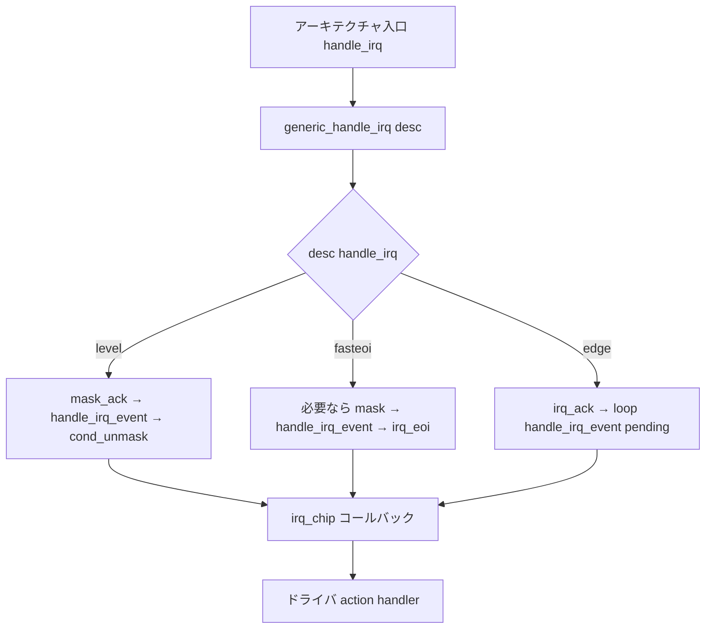

# 第2章 フローハンドラと irq_chip

> **本章で読むソース**
>
> - [`include/linux/irq.h` L444-L471](https://github.com/gregkh/linux/blob/v6.18.38/include/linux/irq.h#L444-L471)
> - [`include/linux/irq.h` L492-L522](https://github.com/gregkh/linux/blob/v6.18.38/include/linux/irq.h#L492-L522)
> - [`kernel/irq/chip.c` L677-L697](https://github.com/gregkh/linux/blob/v6.18.38/kernel/irq/chip.c#L677-L697)
> - [`kernel/irq/chip.c` L728-L765](https://github.com/gregkh/linux/blob/v6.18.38/kernel/irq/chip.c#L728-L765)
> - [`kernel/irq/chip.c` L810-L857](https://github.com/gregkh/linux/blob/v6.18.38/kernel/irq/chip.c#L810-L857)
> - [`kernel/irq/handle.c` L249-L262](https://github.com/gregkh/linux/blob/v6.18.38/kernel/irq/handle.c#L249-L262)

## この章の狙い

割り込みが CPU に入ったあと、**irq_chip**（ハードウェア操作）と **フローハンドラ**（エッジ、レベル、FastEOI などの流れ制御）がどう分担するかを読む。
`handle_level_irq()`、`handle_fasteoi_irq()`、`handle_edge_irq()` の分岐が、マスク、ack、EOI の順序にどう効くかを追える状態にする。

## 前提

- [第1章 irq_desc と irq_domain](01-irq-desc-domain.md) で `irq_desc` と `irq_data.chip` の関係を読んでいること。

## irq_chip：ハードウェア向けコールバック

**irq_chip** は割り込みコントローラに対する enable、disable、mask、ack、EOI などの低レベル操作を表す。
`/proc/interrupts` に表示される chip 名は `name` フィールドから取られる。

[`include/linux/irq.h` L444-L471](https://github.com/gregkh/linux/blob/v6.18.38/include/linux/irq.h#L444-L471)

```c
 * struct irq_chip - hardware interrupt chip descriptor
 *
 * @name:		name for /proc/interrupts
 * @irq_startup:	start up the interrupt (defaults to ->enable if NULL)
 * @irq_shutdown:	shut down the interrupt (defaults to ->disable if NULL)
 * @irq_enable:		enable the interrupt (defaults to chip->unmask if NULL)
 * @irq_disable:	disable the interrupt
 * @irq_ack:		start of a new interrupt
 * @irq_mask:		mask an interrupt source
 * @irq_mask_ack:	ack and mask an interrupt source
 * @irq_unmask:		unmask an interrupt source
 * @irq_eoi:		end of interrupt
 * @irq_set_affinity:	Set the CPU affinity on SMP machines. If the force
 *			argument is true, it tells the driver to
 *			unconditionally apply the affinity setting. Sanity
 *			checks against the supplied affinity mask are not
 *			required. This is used for CPU hotplug where the
 *			target CPU is not yet set in the cpu_online_mask.
 * @irq_retrigger:	resend an IRQ to the CPU
 * @irq_set_type:	set the flow type (IRQ_TYPE_LEVEL/etc.) of an IRQ
 * @irq_set_wake:	enable/disable power-management wake-on of an IRQ
 * @irq_bus_lock:	function to lock access to slow bus (i2c) chips
 * @irq_bus_sync_unlock:function to sync and unlock slow bus (i2c) chips
 * @irq_cpu_online:	configure an interrupt source for a secondary CPU
 * @irq_cpu_offline:	un-configure an interrupt source for a secondary CPU
 * @irq_suspend:	function called from core code on suspend once per
 *			chip, when one or more interrupts are installed
 * @irq_resume:		function called from core code on resume once per chip,
```

実体は関数ポインタの集合であり、未実装の操作は genirq 側のデフォルト実装へ委譲される。

[`include/linux/irq.h` L492-L522](https://github.com/gregkh/linux/blob/v6.18.38/include/linux/irq.h#L492-L522)

```c
struct irq_chip {
	const char	*name;
	unsigned int	(*irq_startup)(struct irq_data *data);
	void		(*irq_shutdown)(struct irq_data *data);
	void		(*irq_enable)(struct irq_data *data);
	void		(*irq_disable)(struct irq_data *data);

	void		(*irq_ack)(struct irq_data *data);
	void		(*irq_mask)(struct irq_data *data);
	void		(*irq_mask_ack)(struct irq_data *data);
	void		(*irq_unmask)(struct irq_data *data);
	void		(*irq_eoi)(struct irq_data *data);

	int		(*irq_set_affinity)(struct irq_data *data, const struct cpumask *dest, bool force);
	int		(*irq_retrigger)(struct irq_data *data);
	int		(*irq_set_type)(struct irq_data *data, unsigned int flow_type);
	int		(*irq_set_wake)(struct irq_data *data, unsigned int on);

	void		(*irq_bus_lock)(struct irq_data *data);
	void		(*irq_bus_sync_unlock)(struct irq_data *data);

#ifdef CONFIG_DEPRECATED_IRQ_CPU_ONOFFLINE
	void		(*irq_cpu_online)(struct irq_data *data);
	void		(*irq_cpu_offline)(struct irq_data *data);
#endif
	void		(*irq_suspend)(struct irq_data *data);
	void		(*irq_resume)(struct irq_data *data);
	void		(*irq_pm_shutdown)(struct irq_data *data);

	void		(*irq_calc_mask)(struct irq_data *data);

```

`irq_domain` の map コールバックや `irq_set_chip_and_handler()` が、各 virq に chip とフローハンドラを結び付ける。

## フローハンドラと handle_irq_event

フローハンドラは `irq_desc->handle_irq` に格納される。
共通の終盤処理として `handle_irq_event()` が呼ばれ、一時的に `desc->lock` を解放してドライバハンドラを実行する。

[`kernel/irq/handle.c` L249-L262](https://github.com/gregkh/linux/blob/v6.18.38/kernel/irq/handle.c#L249-L262)

```c
irqreturn_t handle_irq_event(struct irq_desc *desc)
{
	irqreturn_t ret;

	desc->istate &= ~IRQS_PENDING;
	irqd_set(&desc->irq_data, IRQD_IRQ_INPROGRESS);
	raw_spin_unlock(&desc->lock);

	ret = handle_irq_event_percpu(desc);

	raw_spin_lock(&desc->lock);
	irqd_clear(&desc->irq_data, IRQD_IRQ_INPROGRESS);
	return ret;
}
```

`IRQD_IRQ_INPROGRESS` は hardirq 処理中であることを示し、スレッド化ハンドラとの `threads_oneshot` 更新を直列化する。
lock を外してハンドラを呼ぶのは、共有割り込みで長い処理が続く場合にデッドロックを避けるためである。

## handle_level_irq：レベルトリガ

レベル割り込みは、ハードウェア線がアクティブな間ずっと立ち続ける。
`handle_level_irq()` は入口で `mask_ack_irq()` し、ハンドラ実行後に `cond_unmask_irq()` で必要なら再び unmask する。

[`kernel/irq/chip.c` L677-L697](https://github.com/gregkh/linux/blob/v6.18.38/kernel/irq/chip.c#L677-L697)

```c
 * handle_level_irq - Level type irq handler
 * @desc:	the interrupt description structure for this irq
 *
 * Level type interrupts are active as long as the hardware line has the
 * active level. This may require to mask the interrupt and unmask it after
 * the associated handler has acknowledged the device, so the interrupt
 * line is back to inactive.
 */
void handle_level_irq(struct irq_desc *desc)
{
	guard(raw_spinlock)(&desc->lock);
	mask_ack_irq(desc);

	if (!irq_can_handle(desc))
		return;

	kstat_incr_irqs_this_cpu(desc);
	handle_irq_event(desc);

	cond_unmask_irq(desc);
}
```

ドライバがデバイス側の要因をクリアするまで線がアクティブのままなので、マスクしてからハンドラを走らせる設計が必要になる。

## handle_fasteoi_irq：ハードウェアが流れを担うコントローラ

APIC や GICv3 のような「透過的」コントローラ向けに **FastEOI** フローがある。
chip へのコールバックは主に `irq_eoi()` だけであり、マスクと ack の詳細はハードウェア側が処理する。

[`kernel/irq/chip.c` L728-L765](https://github.com/gregkh/linux/blob/v6.18.38/kernel/irq/chip.c#L728-L765)

```c
 * handle_fasteoi_irq - irq handler for transparent controllers
 * @desc:	the interrupt description structure for this irq
 *
 * Only a single callback will be issued to the chip: an ->eoi() call when
 * the interrupt has been serviced. This enables support for modern forms
 * of interrupt handlers, which handle the flow details in hardware,
 * transparently.
 */
void handle_fasteoi_irq(struct irq_desc *desc)
{
	struct irq_chip *chip = desc->irq_data.chip;

	guard(raw_spinlock)(&desc->lock);

	/*
	 * When an affinity change races with IRQ handling, the next interrupt
	 * can arrive on the new CPU before the original CPU has completed
	 * handling the previous one - it may need to be resent.
	 */
	if (!irq_can_handle_pm(desc)) {
		if (irqd_needs_resend_when_in_progress(&desc->irq_data))
			desc->istate |= IRQS_PENDING;
		cond_eoi_irq(chip, &desc->irq_data);
		return;
	}

	if (!irq_can_handle_actions(desc)) {
		mask_irq(desc);
		cond_eoi_irq(chip, &desc->irq_data);
		return;
	}

	kstat_incr_irqs_this_cpu(desc);
	if (desc->istate & IRQS_ONESHOT)
		mask_irq(desc);

	handle_irq_event(desc);

```

`IRQF_ONESHOT` ではハンドラ実行前にマスクし、スレッド側が `irq_finalize_oneshot()` で unmask する（第3章）。
アフィニティ変更と処理中割り込みの競合では `IRQS_PENDING` を立て、再送が必要な場合がある。

## handle_edge_irq：エッジトリガと pending ループ

エッジ割り込みは立ち下がりまたは立ち上がりでラッチされる。
`handle_edge_irq()` は ack 後、`IRQS_PENDING` が残る間ループしてハンドラを再実行する。

[`kernel/irq/chip.c` L810-L857](https://github.com/gregkh/linux/blob/v6.18.38/kernel/irq/chip.c#L810-L857)

```c
 * handle_edge_irq - edge type IRQ handler
 * @desc:	the interrupt description structure for this irq
 *
 * Interrupt occurs on the falling and/or rising edge of a hardware
 * signal. The occurrence is latched into the irq controller hardware and
 * must be acked in order to be reenabled. After the ack another interrupt
 * can happen on the same source even before the first one is handled by
 * the associated event handler. If this happens it might be necessary to
 * disable (mask) the interrupt depending on the controller hardware. This
 * requires to reenable the interrupt inside of the loop which handles the
 * interrupts which have arrived while the handler was running. If all
 * pending interrupts are handled, the loop is left.
 */
void handle_edge_irq(struct irq_desc *desc)
{
	guard(raw_spinlock)(&desc->lock);

	if (!irq_can_handle(desc)) {
		desc->istate |= IRQS_PENDING;
		mask_ack_irq(desc);
		return;
	}

	kstat_incr_irqs_this_cpu(desc);

	/* Start handling the irq */
	desc->irq_data.chip->irq_ack(&desc->irq_data);

	do {
		if (unlikely(!desc->action)) {
			mask_irq(desc);
			return;
		}

		/*
		 * When another irq arrived while we were handling
		 * one, we could have masked the irq.
		 * Reenable it, if it was not disabled in meantime.
		 */
		if (unlikely(desc->istate & IRQS_PENDING)) {
			if (!irqd_irq_disabled(&desc->irq_data) &&
			    irqd_irq_masked(&desc->irq_data))
				unmask_irq(desc);
		}

		handle_irq_event(desc);

	} while ((desc->istate & IRQS_PENDING) && !irqd_irq_disabled(&desc->irq_data));
```

**最適化の工夫**：FastEOI フローはソフトウェア側の mask と ack 呼び出しを最小化し、割り込み入口の命令数を減らす。
現代の x86 APIC や ARM GIC はハードウェアがエッジとレベルの区別を吸収するため、ドライバは `handle_fasteoi_irq` を選ぶことが多い。

## 処理の流れ：CPU 入口から chip 操作まで



## まとめ

- **irq_chip** は mask、ack、EOI などハードウェア操作を担い、**フローハンドラ** はそれらの呼び出し順序を決める。
- レベル割り込みは処理中の再入を防ぐため入口でマスクし、エッジ割り込みは pending ループで取りこぼしを減らす。
- FastEOI はハードウェアに流れ制御を任せ、ソフトウェアの chip 操作を EOI に集約する。
- いずれも最終的に `handle_irq_event()` 経由でドライバハンドラへ到達する。

## 関連する章

- [第1章 irq_desc と irq_domain](01-irq-desc-domain.md)
- [第3章 request_irq からハンドラ実行まで](03-request-irq-handler.md)
- [x86-64 アーキテクチャ分冊（計画）](../../README.md) の割り込みエントリ（将来執筆）
