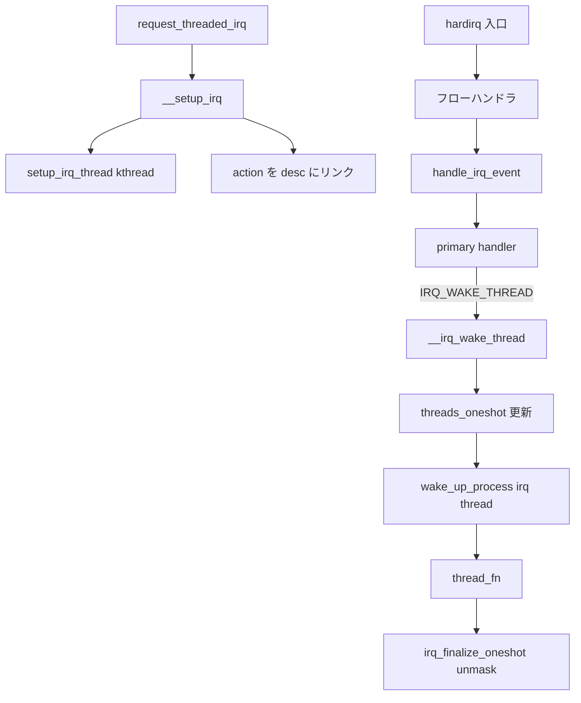

# 第3章 request_irq からハンドラ実行まで

> **本章で読むソース**
>
> - [`kernel/irq/manage.c` L2037-L2075](https://github.com/gregkh/linux/blob/v6.18.38/kernel/irq/manage.c#L2037-L2075)
> - [`kernel/irq/manage.c` L2076-L2136](https://github.com/gregkh/linux/blob/v6.18.38/kernel/irq/manage.c#L2076-L2136)
> - [`kernel/irq/manage.c` L1446-L1507](https://github.com/gregkh/linux/blob/v6.18.38/kernel/irq/manage.c#L1446-L1507)
> - [`kernel/irq/handle.c` L61-L137](https://github.com/gregkh/linux/blob/v6.18.38/kernel/irq/handle.c#L61-L137)
> - [`kernel/irq/handle.c` L177-L234](https://github.com/gregkh/linux/blob/v6.18.38/kernel/irq/handle.c#L177-L234)
> - [`kernel/irq/manage.c` L1139-L1147](https://github.com/gregkh/linux/blob/v6.18.38/kernel/irq/manage.c#L1139-L1147)
> - [`kernel/irq/manage.c` L1242-L1280](https://github.com/gregkh/linux/blob/v6.18.38/kernel/irq/manage.c#L1242-L1280)

## この章の狙い

ドライバが `request_threaded_irq()` でハンドラを登録してから、hardirq コンテキストと irq スレッドで処理が分岐するまでを追う。
`IRQ_WAKE_THREAD`、`__irq_wake_thread()`、ONESHOT 共有割り込みのマスク管理が、第2章のフローハンドラとどう接続するかを読める状態にする。

## 前提

- [第2章 フローハンドラと irq_chip](02-flow-handler-chip.md) で `handle_irq_event()` と FastEOI の ONESHOT マスクを読んでいること。
- [プロセスとスケジューラ 第2章 fork](../../sched/part00-process/02-fork-copy-process.md) で `kthread_create` の文脈を知っていると理解が早い。

## request_threaded_irq の契約

`request_threaded_irq()` は irq 番号、primary handler、thread function、flags、名前、cookie を受け取る。
primary handler は hardirq コンテキストで走り、デバイス由来の割り込みなら IRQ をマスクして `IRQ_WAKE_THREAD` を返し、thread function を起こす設計が想定されている。

[`kernel/irq/manage.c` L2037-L2075](https://github.com/gregkh/linux/blob/v6.18.38/kernel/irq/manage.c#L2037-L2075)

```c
 * request_threaded_irq - allocate an interrupt line
 * @irq:	Interrupt line to allocate
 * @handler:	Function to be called when the IRQ occurs.
 *		Primary handler for threaded interrupts.
 *		If handler is NULL and thread_fn != NULL
 *		the default primary handler is installed.
 * @thread_fn:	Function called from the irq handler thread
 *		If NULL, no irq thread is created
 * @irqflags:	Interrupt type flags
 * @devname:	An ascii name for the claiming device
 * @dev_id:	A cookie passed back to the handler function
 *
 * This call allocates interrupt resources and enables the interrupt line
 * and IRQ handling. From the point this call is made your handler function
 * may be invoked. Since your handler function must clear any interrupt the
 * board raises, you must take care both to initialise your hardware and to
 * set up the interrupt handler in the right order.
 *
 * If you want to set up a threaded irq handler for your device then you
 * need to supply @handler and @thread_fn. @handler is still called in hard
 * interrupt context and has to check whether the interrupt originates from
 * the device. If yes it needs to disable the interrupt on the device and
 * return IRQ_WAKE_THREAD which will wake up the handler thread and run
 * @thread_fn. This split handler design is necessary to support shared
 * interrupts.
 *
 * @dev_id must be globally unique. Normally the address of the device data
 * structure is used as the cookie. Since the handler receives this value
 * it makes sense to use it.
 *
 * If your interrupt is shared you must pass a non NULL dev_id as this is
 * required when freeing the interrupt.
 *
 * Flags:
 *
 *	IRQF_SHARED		Interrupt is shared
 *	IRQF_TRIGGER_*		Specify active edge(s) or level
 *	IRQF_ONESHOT		Run thread_fn with interrupt line masked
 */
```

入口では共有割り込みと `dev_id`、flags の組み合わせを検証し、`irqaction` を確保して `__setup_irq()` へ渡す。

[`kernel/irq/manage.c` L2076-L2136](https://github.com/gregkh/linux/blob/v6.18.38/kernel/irq/manage.c#L2076-L2136)

```c
int request_threaded_irq(unsigned int irq, irq_handler_t handler,
			 irq_handler_t thread_fn, unsigned long irqflags,
			 const char *devname, void *dev_id)
{
	struct irqaction *action;
	struct irq_desc *desc;
	int retval;

	if (irq == IRQ_NOTCONNECTED)
		return -ENOTCONN;

	/*
	 * Sanity-check: shared interrupts must pass in a real dev-ID,
	 * otherwise we'll have trouble later trying to figure out
	 * which interrupt is which (messes up the interrupt freeing
	 * logic etc).
	 *
	 * Also shared interrupts do not go well with disabling auto enable.
	 * The sharing interrupt might request it while it's still disabled
	 * and then wait for interrupts forever.
	 *
	 * Also IRQF_COND_SUSPEND only makes sense for shared interrupts and
	 * it cannot be set along with IRQF_NO_SUSPEND.
	 */
	if (((irqflags & IRQF_SHARED) && !dev_id) ||
	    ((irqflags & IRQF_SHARED) && (irqflags & IRQF_NO_AUTOEN)) ||
	    (!(irqflags & IRQF_SHARED) && (irqflags & IRQF_COND_SUSPEND)) ||
	    ((irqflags & IRQF_NO_SUSPEND) && (irqflags & IRQF_COND_SUSPEND)))
		return -EINVAL;

	desc = irq_to_desc(irq);
	if (!desc)
		return -EINVAL;

	if (!irq_settings_can_request(desc) ||
	    WARN_ON(irq_settings_is_per_cpu_devid(desc)))
		return -EINVAL;

	if (!handler) {
		if (!thread_fn)
			return -EINVAL;
		handler = irq_default_primary_handler;
	}

	action = kzalloc(sizeof(struct irqaction), GFP_KERNEL);
	if (!action)
		return -ENOMEM;

	action->handler = handler;
	action->thread_fn = thread_fn;
	action->flags = irqflags;
	action->name = devname;
	action->dev_id = dev_id;

	retval = irq_chip_pm_get(&desc->irq_data);
	if (retval < 0) {
		kfree(action);
		return retval;
	}

	retval = __setup_irq(irq, desc, action);
```

## __setup_irq：action 連鎖と irq スレッド生成

`__setup_irq()` は chip が有効な desc に対し、thread function があれば `setup_irq_thread()` で `irq/%d-%s` という kthread を作る。
`IRQCHIP_ONESHOT_SAFE` な chip では `IRQF_ONESHOT` フラグを自動的に外す。

[`kernel/irq/manage.c` L1446-L1507](https://github.com/gregkh/linux/blob/v6.18.38/kernel/irq/manage.c#L1446-L1507)

```c
__setup_irq(unsigned int irq, struct irq_desc *desc, struct irqaction *new)
{
	struct irqaction *old, **old_ptr;
	unsigned long flags, thread_mask = 0;
	int ret, nested, shared = 0;

	if (!desc)
		return -EINVAL;

	if (desc->irq_data.chip == &no_irq_chip)
		return -ENOSYS;
	if (!try_module_get(desc->owner))
		return -ENODEV;

	new->irq = irq;

	/*
	 * If the trigger type is not specified by the caller,
	 * then use the default for this interrupt.
	 */
	if (!(new->flags & IRQF_TRIGGER_MASK))
		new->flags |= irqd_get_trigger_type(&desc->irq_data);

	/*
	 * Check whether the interrupt nests into another interrupt
	 * thread.
	 */
	nested = irq_settings_is_nested_thread(desc);
	if (nested) {
		if (!new->thread_fn) {
			ret = -EINVAL;
			goto out_mput;
		}
		/*
		 * Replace the primary handler which was provided from
		 * the driver for non nested interrupt handling by the
		 * dummy function which warns when called.
		 */
		new->handler = irq_nested_primary_handler;
	} else {
		if (irq_settings_can_thread(desc)) {
			ret = irq_setup_forced_threading(new);
			if (ret)
				goto out_mput;
		}
	}

	/*
	 * Create a handler thread when a thread function is supplied
	 * and the interrupt does not nest into another interrupt
	 * thread.
	 */
	if (new->thread_fn && !nested) {
		ret = setup_irq_thread(new, irq, false);
		if (ret)
			goto out_mput;
		if (new->secondary) {
			ret = setup_irq_thread(new->secondary, irq, true);
			if (ret)
				goto out_thread;
		}
	}
```

共有割り込みでは `IRQF_SHARED` と trigger type、ONESHOT 設定が既存 action と一致する必要がある（以降の `raw_spin_lock_irqsave` ブロック）。

## hardirq 側：ハンドラ連鎖と IRQ_WAKE_THREAD

割り込み発火時、`__handle_irq_event_percpu()` が `desc->action` 連鎖を走査する。
返り値が `IRQ_WAKE_THREAD` なら `__irq_wake_thread()` が irq スレッドを起こす。

[`kernel/irq/handle.c` L177-L234](https://github.com/gregkh/linux/blob/v6.18.38/kernel/irq/handle.c#L177-L234)

```c
irqreturn_t __handle_irq_event_percpu(struct irq_desc *desc)
{
	irqreturn_t retval = IRQ_NONE;
	unsigned int irq = desc->irq_data.irq;
	struct irqaction *action;

	record_irq_time(desc);

	for_each_action_of_desc(desc, action) {
		irqreturn_t res;

		/*
		 * If this IRQ would be threaded under force_irqthreads, mark it so.
		 */
		if (irq_settings_can_thread(desc) &&
		    !(action->flags & (IRQF_NO_THREAD | IRQF_PERCPU | IRQF_ONESHOT)))
			lockdep_hardirq_threaded();

		trace_irq_handler_entry(irq, action);

		if (static_branch_unlikely(&irqhandler_duration_check_enabled)) {
			u64 ts_start = local_clock();

			res = action->handler(irq, action->dev_id);
			irqhandler_duration_check(ts_start, irq, action);
		} else {
			res = action->handler(irq, action->dev_id);
		}

		trace_irq_handler_exit(irq, action, res);

		if (WARN_ONCE(!irqs_disabled(),"irq %u handler %pS enabled interrupts\n",
			      irq, action->handler))
			local_irq_disable();

		switch (res) {
		case IRQ_WAKE_THREAD:
			/*
			 * Catch drivers which return WAKE_THREAD but
			 * did not set up a thread function
			 */
			if (unlikely(!action->thread_fn)) {
				warn_no_thread(irq, action);
				break;
			}

			__irq_wake_thread(desc, action);
			break;

		default:
			break;
		}

		retval |= res;
	}

	return retval;
}
```

`__irq_wake_thread()` は `IRQTF_RUNTHREAD` を立て、`threads_oneshot` に action のビットを OR し、`threads_active` を増やしてから `wake_up_process()` する。

[`kernel/irq/handle.c` L61-L137](https://github.com/gregkh/linux/blob/v6.18.38/kernel/irq/handle.c#L61-L137)

```c
void __irq_wake_thread(struct irq_desc *desc, struct irqaction *action)
{
	/*
	 * In case the thread crashed and was killed we just pretend that
	 * we handled the interrupt. The hardirq handler has disabled the
	 * device interrupt, so no irq storm is lurking.
	 */
	if (action->thread->flags & PF_EXITING)
		return;

	/*
	 * Wake up the handler thread for this action. If the
	 * RUNTHREAD bit is already set, nothing to do.
	 */
	if (test_and_set_bit(IRQTF_RUNTHREAD, &action->thread_flags))
		return;

	/*
	 * It's safe to OR the mask lockless here. We have only two
	 * places which write to threads_oneshot: This code and the
	 * irq thread.
	 *
	 * This code is the hard irq context and can never run on two
	 * cpus in parallel. If it ever does we have more serious
	 * problems than this bitmask.
	 *
	 * The irq threads of this irq which clear their "running" bit
	 * in threads_oneshot are serialized via desc->lock against
	 * each other and they are serialized against this code by
	 * IRQS_INPROGRESS.
	 *
	 * Hard irq handler:
	 *
	 *	spin_lock(desc->lock);
	 *	desc->state |= IRQS_INPROGRESS;
	 *	spin_unlock(desc->lock);
	 *	set_bit(IRQTF_RUNTHREAD, &action->thread_flags);
	 *	desc->threads_oneshot |= mask;
	 *	spin_lock(desc->lock);
	 *	desc->state &= ~IRQS_INPROGRESS;
	 *	spin_unlock(desc->lock);
	 *
	 * irq thread:
	 *
	 * again:
	 *	spin_lock(desc->lock);
	 *	if (desc->state & IRQS_INPROGRESS) {
	 *		spin_unlock(desc->lock);
	 *		while(desc->state & IRQS_INPROGRESS)
	 *			cpu_relax();
	 *		goto again;
	 *	}
	 *	if (!test_bit(IRQTF_RUNTHREAD, &action->thread_flags))
	 *		desc->threads_oneshot &= ~mask;
	 *	spin_unlock(desc->lock);
	 *
	 * So either the thread waits for us to clear IRQS_INPROGRESS
	 * or we are waiting in the flow handler for desc->lock to be
	 * released before we reach this point. The thread also checks
	 * IRQTF_RUNTHREAD under desc->lock. If set it leaves
	 * threads_oneshot untouched and runs the thread another time.
	 */
	desc->threads_oneshot |= action->thread_mask;

	/*
	 * We increment the threads_active counter in case we wake up
	 * the irq thread. The irq thread decrements the counter when
	 * it returns from the handler or in the exit path and wakes
	 * up waiters which are stuck in synchronize_irq() when the
	 * active count becomes zero. synchronize_irq() is serialized
	 * against this code (hard irq handler) via IRQS_INPROGRESS
	 * like the finalize_oneshot() code. See comment above.
	 */
	atomic_inc(&desc->threads_active);

	wake_up_process(action->thread);
}
```

**最適化の工夫**：primary handler を hardirq に残し、重い処理だけ irq スレッドへ逃がす分割は、割り込みレイテンシとスリープ可能な処理の両立を取る。
hardirq ではデバイス IRQ のマスクと識別だけを行い、I/O 待ちはスレッド側に閉じ込める。

## irq スレッド側の処理ループ

irq スレッドは FIFO スケジューリングクラスで動き、`irq_wait_for_interrupt()` で割り込みを待つ。
起きると `irq_thread_fn()` が `thread_fn` を呼び、ONESHOT なら `irq_finalize_oneshot()` で unmask する。

[`kernel/irq/manage.c` L1139-L1147](https://github.com/gregkh/linux/blob/v6.18.38/kernel/irq/manage.c#L1139-L1147)

```c
static irqreturn_t irq_thread_fn(struct irq_desc *desc,	struct irqaction *action)
{
	irqreturn_t ret = action->thread_fn(action->irq, action->dev_id);

	if (ret == IRQ_HANDLED)
		atomic_inc(&desc->threads_handled);

	irq_finalize_oneshot(desc, action);
	return ret;
```

スレッド本体は `force_irqthreads` ブートオプション時に `irq_forced_thread_fn()` を選び、ループ内で handler を繰り返し呼ぶ。

[`kernel/irq/manage.c` L1242-L1280](https://github.com/gregkh/linux/blob/v6.18.38/kernel/irq/manage.c#L1242-L1280)

```c
static int irq_thread(void *data)
{
	struct callback_head on_exit_work;
	struct irqaction *action = data;
	struct irq_desc *desc = irq_to_desc(action->irq);
	irqreturn_t (*handler_fn)(struct irq_desc *desc,
			struct irqaction *action);

	irq_thread_set_ready(desc, action);

	sched_set_fifo(current);

	if (force_irqthreads() && test_bit(IRQTF_FORCED_THREAD,
					   &action->thread_flags))
		handler_fn = irq_forced_thread_fn;
	else
		handler_fn = irq_thread_fn;

	init_task_work(&on_exit_work, irq_thread_dtor);
	task_work_add(current, &on_exit_work, TWA_NONE);

	while (!irq_wait_for_interrupt(desc, action)) {
		irqreturn_t action_ret;

		action_ret = handler_fn(desc, action);
		if (action_ret == IRQ_WAKE_THREAD)
			irq_wake_secondary(desc, action);

		wake_threads_waitq(desc);
	}

	/*
	 * This is the regular exit path. __free_irq() is stopping the
	 * thread via kthread_stop() after calling
	 * synchronize_hardirq(). So neither IRQTF_RUNTHREAD nor the
	 * oneshot mask bit can be set.
	 */
	task_work_cancel_func(current, irq_thread_dtor);
	return 0;
```

`synchronize_irq()` は `threads_active` がゼロになるまで待ち、ドライバが `free_irq()` する前にハンドラ完了を保証する。

## 処理の流れ：request_irq から thread_fn まで



## まとめ

- `request_threaded_irq()` は `irqaction` を確保し、`__setup_irq()` で chip 資源、共有検証、irq スレッド生成を行う。
- hardirq 側の primary handler は短く保ち、`IRQ_WAKE_THREAD` で thread function へ処理を委譲する。
- ONESHOT 共有割り込みでは `threads_oneshot` とフローハンドラのマスクが協調し、スレッド完了まで線を再開しない。
- irq スレッドは FIFO で動き、終了時は `synchronize_irq()` と `kthread_stop()` で安全に外す。

## 関連する章

- [第2章 フローハンドラと irq_chip](02-flow-handler-chip.md)
- [第4章 softirq と tasklet](../part01-deferred/04-softirq-tasklet.md)
- [プロセスとスケジューラ 第5部 RT クラス](../../sched/README.md)
