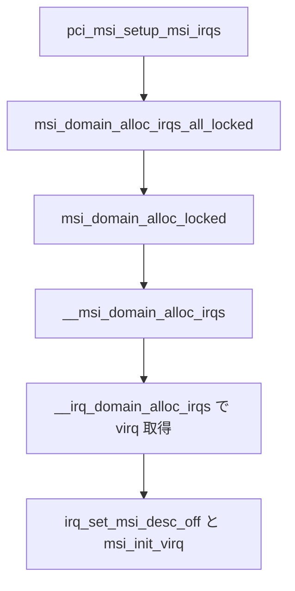

# 第4章 MSI ドメイン

> **本章で読むソース**
>
> - [`include/linux/msi.h` L478-L509](https://github.com/gregkh/linux/blob/v6.18.38/include/linux/msi.h#L478-L509)
> - [`include/linux/msi.h` L678-L681](https://github.com/gregkh/linux/blob/v6.18.38/include/linux/msi.h#L678-L681)
> - [`kernel/irq/msi.c` L775-L784](https://github.com/gregkh/linux/blob/v6.18.38/kernel/irq/msi.c#L775-L784)
> - [`kernel/irq/msi.c` L865-L897](https://github.com/gregkh/linux/blob/v6.18.38/kernel/irq/msi.c#L865-L897)
> - [`kernel/irq/msi.c` L916-L939](https://github.com/gregkh/linux/blob/v6.18.38/kernel/irq/msi.c#L916-L939)
> - [`kernel/irq/msi.c` L1029-L1105](https://github.com/gregkh/linux/blob/v6.18.38/kernel/irq/msi.c#L1029-L1105)
> - [`drivers/pci/msi/irqdomain.c` L11-L20](https://github.com/gregkh/linux/blob/v6.18.38/drivers/pci/msi/irqdomain.c#L11-L20)
> - [`drivers/pci/msi/irqdomain.c` L297-L307](https://github.com/gregkh/linux/blob/v6.18.38/drivers/pci/msi/irqdomain.c#L297-L307)
> - [`kernel/irq/msi.c` L1292-L1356](https://github.com/gregkh/linux/blob/v6.18.38/kernel/irq/msi.c#L1292-L1356)
> - [`kernel/irq/msi.c` L1369-L1402](https://github.com/gregkh/linux/blob/v6.18.38/kernel/irq/msi.c#L1369-L1402)
> - [`kernel/irq/msi.c` L1419-L1449](https://github.com/gregkh/linux/blob/v6.18.38/kernel/irq/msi.c#L1419-L1449)

## この章の狙い

**MSI**（Message Signaled Interrupt）向けの **irq_domain** 階層と **`msi_domain_info`** の役割を読む。
`msi_domain_alloc_irqs` から仮想 IRQ が割り当てられ、`msi_desc` と irq_chip が結ばれるまでの genirq 側の経路を押さえる。
PCI MSI/MSI-X のレジスタ操作や APIC への書き込みは drivers/PCI 分冊と x86 分冊の担当であり、本章は **kernel/irq/msi.c** の共通層に留める。

## 前提

- [第1章 irq_desc と irq_domain](01-irq-desc-domain.md) で `irq_domain_create_hierarchy` の語彙を読んでいること。
- [第2章 フローハンドラと irq_chip](02-flow-handler-chip.md) で irq_chip と flow handler の関係を押さえていること。

## msi_domain_info と階層ドメイン

**msi_domain_info** は MSI 専用 irq_domain の host_data として載る。
`flags` で PCI 向けの早期 activate やデフォルト ops の補完を指定し、`chip` と `handler` で割り込み線ごとの irq_chip と flow handler を束ねる。

[`include/linux/msi.h` L478-L509](https://github.com/gregkh/linux/blob/v6.18.38/include/linux/msi.h#L478-L509)

```c
/**
 * struct msi_domain_info - MSI interrupt domain data
 * @flags:		Flags to decribe features and capabilities
 * @bus_token:		The domain bus token
 * @hwsize:		The hardware table size or the software index limit.
 *			If 0 then the size is considered unlimited and
 *			gets initialized to the maximum software index limit
 *			by the domain creation code.
 * @ops:		The callback data structure
 * @dev:		Device which creates the domain
 * @chip:		Optional: associated interrupt chip
 * @chip_data:		Optional: associated interrupt chip data
 * @handler:		Optional: associated interrupt flow handler
 * @handler_data:	Optional: associated interrupt flow handler data
 * @handler_name:	Optional: associated interrupt flow handler name
 * @alloc_data:		Optional: associated interrupt allocation data
 * @data:		Optional: domain specific data
 */
struct msi_domain_info {
	u32				flags;
	enum irq_domain_bus_token	bus_token;
	unsigned int			hwsize;
	struct msi_domain_ops		*ops;
	struct device			*dev;
	struct irq_chip			*chip;
	void				*chip_data;
	irq_flow_handler_t		handler;
	void				*handler_data;
	const char			*handler_name;
	msi_alloc_info_t		*alloc_data;
	void				*data;
};
```

階層は **MSI parent** ドメイン（`IRQ_DOMAIN_FLAG_MSI_PARENT`）と **MSI device** ドメイン（`IRQ_DOMAIN_FLAG_MSI_DEVICE`）に分かれる。
`msi_create_parent_irq_domain` が親側、`msi_create_device_irq_domain` がデバイスごとの子ドメインを作る。
親子間では `msi_parent_init_dev_msi_info` が子ドメインの capability を親の制約に合わせて調整する。

[`kernel/irq/msi.c` L916-L939](https://github.com/gregkh/linux/blob/v6.18.38/kernel/irq/msi.c#L916-L939)

```c
struct irq_domain *msi_create_parent_irq_domain(struct irq_domain_info *info,
						const struct msi_parent_ops *msi_parent_ops)
{
	struct irq_domain *d;

	info->hwirq_max		= max(info->hwirq_max, info->size);
	info->size		= info->hwirq_max;
	info->domain_flags	|= IRQ_DOMAIN_FLAG_MSI_PARENT;
	info->bus_token		= msi_parent_ops->bus_select_token;

	d = irq_domain_instantiate(info);
	if (IS_ERR(d))
		return NULL;

	d->msi_parent_ops = msi_parent_ops;
	return d;
}
EXPORT_SYMBOL_GPL(msi_create_parent_irq_domain);
```

## ドメイン作成と irq_domain_ops

`__msi_create_irq_domain` は dom_ops の穴をデフォルト実装で埋め、親ドメインの下に `IRQ_DOMAIN_FLAG_MSI` 付きの階層を追加する。
`msi_domain_ops` は alloc/free/activate/deactivate/translate を MSI 向けに実装する。

[`kernel/irq/msi.c` L775-L784](https://github.com/gregkh/linux/blob/v6.18.38/kernel/irq/msi.c#L775-L784)

```c
static const struct irq_domain_ops msi_domain_ops = {
	.alloc		= msi_domain_alloc,
	.free		= msi_domain_free,
	.activate	= msi_domain_activate,
	.deactivate	= msi_domain_deactivate,
	.translate	= msi_domain_translate,
#ifdef CONFIG_GENERIC_IRQ_DEBUGFS
	.debug_show     = msi_domain_debug_show,
#endif
};
```

[`kernel/irq/msi.c` L865-L897](https://github.com/gregkh/linux/blob/v6.18.38/kernel/irq/msi.c#L865-L897)

```c
static struct irq_domain *__msi_create_irq_domain(struct fwnode_handle *fwnode,
						  struct msi_domain_info *info,
						  unsigned int flags,
						  struct irq_domain *parent)
{
	struct irq_domain *domain;

	if (info->hwsize > MSI_XA_DOMAIN_SIZE)
		return NULL;

	/*
	 * Hardware size 0 is valid for backwards compatibility and for
	 * domains which are not backed by a hardware table. Grant the
	 * maximum index space.
	 */
	if (!info->hwsize)
		info->hwsize = MSI_XA_DOMAIN_SIZE;

	msi_domain_update_dom_ops(info);
	if (info->flags & MSI_FLAG_USE_DEF_CHIP_OPS)
		msi_domain_update_chip_ops(info);

	domain = irq_domain_create_hierarchy(parent, flags | IRQ_DOMAIN_FLAG_MSI, 0,
					     fwnode, &msi_domain_ops, info);

	if (domain) {
		irq_domain_update_bus_token(domain, info->bus_token);
		domain->dev = info->dev;
		if (info->flags & MSI_FLAG_PARENT_PM_DEV)
			domain->pm_dev = parent->pm_dev;
	}

	return domain;
}
```

`msi_create_device_irq_domain` はテンプレートから per-device ドメインを複製し、irq_chip 名を `PREFIX + CHIPNAME + DEVNAME` 形式で組み立てる。
fwnode を割り当て、親の `init_dev_msi_info` で capability を調整したあと `__msi_create_irq_domain(..., IRQ_DOMAIN_FLAG_MSI_DEVICE, parent)` を呼ぶ。
成功時は `dev->msi.data->__domains[domid].domain` に保存し、`msi_domain_prepare_irqs` 失敗時は domain を remove して rollback する。

[`kernel/irq/msi.c` L1029-L1105](https://github.com/gregkh/linux/blob/v6.18.38/kernel/irq/msi.c#L1029-L1105)

```c
bool msi_create_device_irq_domain(struct device *dev, unsigned int domid,
				  const struct msi_domain_template *template,
				  unsigned int hwsize, void *domain_data,
				  void *chip_data)
{
	struct irq_domain *domain, *parent = dev->msi.domain;
	const struct msi_parent_ops *pops;
	struct fwnode_handle *fwnode;

	if (!irq_domain_is_msi_parent(parent))
		return false;

	if (domid >= MSI_MAX_DEVICE_IRQDOMAINS)
		return false;

	struct msi_domain_template *bundle __free(kfree) =
		kmemdup(template, sizeof(*bundle), GFP_KERNEL);
	if (!bundle)
		return false;

	// ... (中略) ...

	pops = parent->msi_parent_ops;
	snprintf(bundle->name, sizeof(bundle->name), "%s%s-%s",
		 pops->prefix ? : "", bundle->chip.name, dev_name(dev));
	bundle->chip.name = bundle->name;

	// ... (中略) ...

	if (msi_setup_device_data(dev))
		return false;

	guard(msi_descs_lock)(dev);
	if (WARN_ON_ONCE(msi_get_device_domain(dev, domid)))
		return false;

	if (!pops->init_dev_msi_info(dev, parent, parent, &bundle->info))
		return false;

	domain = __msi_create_irq_domain(fwnode, &bundle->info, IRQ_DOMAIN_FLAG_MSI_DEVICE, parent);
	if (!domain)
		return false;

	dev->msi.data->__domains[domid].domain = domain;

	if (msi_domain_prepare_irqs(domain, dev, hwsize, &bundle->alloc_info)) {
		dev->msi.data->__domains[domid].domain = NULL;
		irq_domain_remove(domain);
		return false;
	}

	/* @bundle and @fwnode_alloced are now in use. Prevent cleanup */
	retain_and_null_ptr(bundle);
	retain_and_null_ptr(fwnode_alloced);
	return true;
}
```

## PCI からの alloc 入口

PCI 階層 domain では `pci_msi_setup_msi_irqs` が device の MSI domain を引き、`msi_domain_alloc_irqs_all_locked` へ進む。
device domain 自体は `pci_create_device_domain` が `msi_create_device_irq_domain` を呼んで作る。

[`drivers/pci/msi/irqdomain.c` L11-L20](https://github.com/gregkh/linux/blob/v6.18.38/drivers/pci/msi/irqdomain.c#L11-L20)

```c
int pci_msi_setup_msi_irqs(struct pci_dev *dev, int nvec, int type)
{
	struct irq_domain *domain;

	domain = dev_get_msi_domain(&dev->dev);
	if (domain && irq_domain_is_hierarchy(domain))
		return msi_domain_alloc_irqs_all_locked(&dev->dev, MSI_DEFAULT_DOMAIN, nvec);

	return pci_msi_legacy_setup_msi_irqs(dev, nvec, type);
}
```

[`drivers/pci/msi/irqdomain.c` L297-L307](https://github.com/gregkh/linux/blob/v6.18.38/drivers/pci/msi/irqdomain.c#L297-L307)

```c
static bool pci_create_device_domain(struct pci_dev *pdev, const struct msi_domain_template *tmpl,
				     unsigned int hwsize)
{
	struct irq_domain *domain = dev_get_msi_domain(&pdev->dev);

	if (!domain || !irq_domain_is_msi_parent(domain))
		return true;

	return msi_create_device_irq_domain(&pdev->dev, MSI_DEFAULT_DOMAIN, tmpl,
					    hwsize, NULL, NULL);
}
```

`msi_domain_alloc_irqs_all_locked` は index 0 から nirqs 全体を range locked API に委譲し、内部で `msi_domain_alloc_locked` を呼ぶ。

ユーザー向けの薄いラッパー `msi_domain_alloc_irqs` は index 0 から nirqs-1 までを range API に委譲する。

[`include/linux/msi.h` L678-L681](https://github.com/gregkh/linux/blob/v6.18.38/include/linux/msi.h#L678-L681)

```c
static inline int msi_domain_alloc_irqs(struct device *dev, unsigned int domid, int nirqs)
{
	return msi_domain_alloc_irqs_range(dev, domid, 0, nirqs - 1);
}
```

`msi_domain_alloc_irqs_range_locked` は `msi_ctrl` に domid と index 範囲を詰め、`msi_domain_alloc_locked` へ渡す。
失敗時は同じ ctrl で確保済み IRQ を解放する。

[`kernel/irq/msi.c` L1419-L1449](https://github.com/gregkh/linux/blob/v6.18.38/kernel/irq/msi.c#L1419-L1449)

```c
int msi_domain_alloc_irqs_range_locked(struct device *dev, unsigned int domid,
				       unsigned int first, unsigned int last)
{
	struct msi_ctrl ctrl = {
		.domid	= domid,
		.first	= first,
		.last	= last,
		.nirqs	= last + 1 - first,
	};

	return msi_domain_alloc_locked(dev, &ctrl);
}

/**
 * msi_domain_alloc_irqs_range - Allocate interrupts from a MSI interrupt domain
 * @dev:	Pointer to device struct of the device for which the interrupts
 *		are allocated
 * @domid:	Id of the interrupt domain to operate on
 * @first:	First index to allocate (inclusive)
 * @last:	Last index to allocate (inclusive)
 *
 * Return: %0 on success or an error code.
 */
int msi_domain_alloc_irqs_range(struct device *dev, unsigned int domid,
				unsigned int first, unsigned int last)
{

	guard(msi_descs_lock)(dev);
	return msi_domain_alloc_irqs_range_locked(dev, domid, first, last);
}
EXPORT_SYMBOL_GPL(msi_domain_alloc_irqs_range);
```

`__msi_domain_alloc_locked` は optional な `domain_alloc_irqs` があればそちらへ、なければ `__msi_domain_alloc_irqs` へ進む。
後者は xarray 上の `msi_desc` を走査し、未関連付けの descriptor ごとに `__irq_domain_alloc_irqs` で virq を取り、`irq_set_msi_desc_off` と `msi_init_virq` で irq_desc へ結び付ける。

[`kernel/irq/msi.c` L1369-L1402](https://github.com/gregkh/linux/blob/v6.18.38/kernel/irq/msi.c#L1369-L1402)

```c
static int __msi_domain_alloc_locked(struct device *dev, struct msi_ctrl *ctrl)
{
	struct msi_domain_info *info;
	struct msi_domain_ops *ops;
	struct irq_domain *domain;
	int ret;

	if (!msi_ctrl_valid(dev, ctrl))
		return -EINVAL;

	domain = msi_get_device_domain(dev, ctrl->domid);
	if (!domain)
		return -ENODEV;

	info = domain->host_data;

	ret = msi_domain_alloc_simple_msi_descs(dev, info, ctrl);
	if (ret)
		return ret;

	ops = info->ops;
	if (ops->domain_alloc_irqs)
		return ops->domain_alloc_irqs(domain, dev, ctrl->nirqs);

	return __msi_domain_alloc_irqs(dev, domain, ctrl);
}

static int msi_domain_alloc_locked(struct device *dev, struct msi_ctrl *ctrl)
{
	int ret = __msi_domain_alloc_locked(dev, ctrl);

	if (ret)
		msi_domain_free_locked(dev, ctrl);
	return ret;
}
```

[`kernel/irq/msi.c` L1292-L1356](https://github.com/gregkh/linux/blob/v6.18.38/kernel/irq/msi.c#L1292-L1356)

```c
static int __msi_domain_alloc_irqs(struct device *dev, struct irq_domain *domain,
				   struct msi_ctrl *ctrl)
{
	struct xarray *xa = &dev->msi.data->__domains[ctrl->domid].store;
	struct msi_domain_info *info = domain->host_data;
	struct msi_domain_ops *ops = info->ops;
	unsigned int vflags = 0, allocated = 0;
	msi_alloc_info_t arg = { };
	struct msi_desc *desc;
	unsigned long idx;
	int i, ret, virq;

	ret = populate_alloc_info(domain, dev, ctrl->nirqs, &arg);
	if (ret)
		return ret;

	// ... (中略) ...

	xa_for_each_range(xa, idx, desc, ctrl->first, ctrl->last) {
		if (!msi_desc_match(desc, MSI_DESC_NOTASSOCIATED))
			continue;

		// ... (中略) ...

		if (ops->prepare_desc)
			ops->prepare_desc(domain, &arg, desc);

		ops->set_desc(&arg, desc);

		virq = __irq_domain_alloc_irqs(domain, -1, desc->nvec_used,
					       dev_to_node(dev), &arg, false,
					       desc->affinity);
		if (virq < 0)
			return msi_handle_pci_fail(domain, desc, allocated);

		for (i = 0; i < desc->nvec_used; i++) {
			irq_set_msi_desc_off(virq, i, desc);
			irq_debugfs_copy_devname(virq + i, dev);
			ret = msi_init_virq(domain, virq + i, vflags);
			if (ret)
				return ret;
		}
		// ... (中略) ...
		allocated++;
	}
	return 0;
}
```

## 処理の流れ



PCI コアは MSI capability を解析したあと `pci_create_device_domain` で device MSI ドメインを作り、上記 alloc 経路で Linux の virq 番号へ写す。
メッセージアドレス/data のプログラムは `write_msi_msg` コールバックと irq_chip 側が担い、genirq は virq と `msi_desc` の対応を維持する。

## 高速化と最適化の工夫

MSI はピン割り込みの共有線を排し、デバイスごとに独立したメッセージで通知できる。
genirq 側では **per-device irq_domain** と xarray 上の `msi_desc` 管理により、MSI-X の多数ベクトルを index 範囲指定で一括 alloc でき、失敗時の部分 rollback を `msi_domain_alloc_locked` が担う。
`MSI_FLAG_ACTIVATE_EARLY` は PCI が MSI を有効化する前に virq を activate し、カードがランダムなメッセージをラッチする競合を避ける。

## CONFIG 依存

`CONFIG_GENERIC_MSI_IRQ` が無効のとき、本章の API はコンパイルされず、MSI はアーキテクチャ固有実装に委ねられる。
`CONFIG_PCI_MSI` は PCI 側の `pci_msi_get_device_domain` 等を有効にするが、ドメイン階層の骨格は genirq の MSI 層が共通である。

## まとめ

- **msi_domain_info** が MSI irq_domain の chip、handler、ops を束ねる。
- **msi_create_device_irq_domain** が親 MSI ドメインの下に per-device 子ドメインを作る。
- **msi_domain_alloc_irqs** は range API 経由で `msi_desc` から virq を割り当て、irq_desc へ結び付ける。
- PCI レジスタと APIC プログラムは本章の外側にある。

## 関連する章

- [第1章 irq_desc と irq_domain](01-irq-desc-domain.md)
- [第2章 フローハンドラと irq_chip](02-flow-handler-chip.md)
- [第3章 request_irq からハンドラ実行まで](03-request-irq-handler.md)
