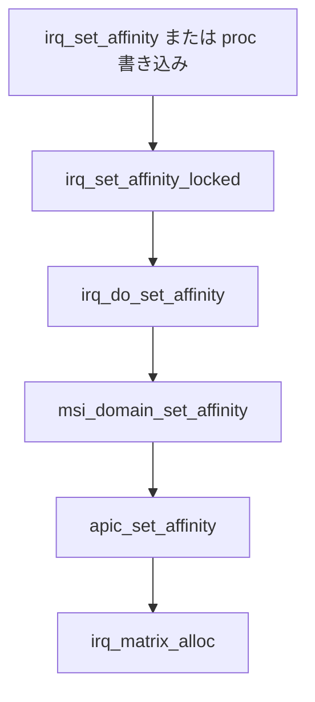

# 第5章 IRQ affinity と vector matrix

> **本章で読むソース**
>
> - [`include/linux/interrupt.h` L279-L309](https://github.com/gregkh/linux/blob/v6.18.38/include/linux/interrupt.h#L279-L309)
> - [`kernel/irq/manage.c` L220-L291](https://github.com/gregkh/linux/blob/v6.18.38/kernel/irq/manage.c#L220-L291)
> - [`kernel/irq/manage.c` L365-L391](https://github.com/gregkh/linux/blob/v6.18.38/kernel/irq/manage.c#L365-L391)
> - [`kernel/irq/manage.c` L451-L474](https://github.com/gregkh/linux/blob/v6.18.38/kernel/irq/manage.c#L451-L474)
> - [`kernel/irq/affinity.c` L18-L101](https://github.com/gregkh/linux/blob/v6.18.38/kernel/irq/affinity.c#L18-L101)
> - [`kernel/irq/msi.c` L654-L678](https://github.com/gregkh/linux/blob/v6.18.38/kernel/irq/msi.c#L654-L678)
> - [`kernel/irq/matrix.c` L22-L35](https://github.com/gregkh/linux/blob/v6.18.38/kernel/irq/matrix.c#L22-L35)
> - [`kernel/irq/matrix.c` L376-L414](https://github.com/gregkh/linux/blob/v6.18.38/kernel/irq/matrix.c#L376-L414)
> - [`arch/x86/kernel/apic/vector.c` L239-L273](https://github.com/gregkh/linux/blob/v6.18.38/arch/x86/kernel/apic/vector.c#L239-L273)
> - [`arch/x86/kernel/apic/vector.c` L879-L895](https://github.com/gregkh/linux/blob/v6.18.38/arch/x86/kernel/apic/vector.c#L879-L895)

## この章の狙い

**IRQ affinity** は、割り込みをどの CPU で受けるかを cpumask で指定する機構である。
genirq の `irq_set_affinity` から irq_chip の `irq_set_affinity` までの経路と、マルチキュー MSI で使う **managed affinity**（`irq_create_affinity_masks` による spreading）を読む。
x86 では **irq_matrix** が CPU ごとの APIC ベクタ空間を管理し、[第4章 MSI ドメイン](04-msi-domain.md) で割り当てた virq が vector domain 経由で実ベクタへ落ちる。

## 前提

- [第2章 フローハンドラと irq_chip](02-flow-handler-chip.md) で irq_chip と `irq_data` を読んでいること。
- [第4章 MSI ドメイン](04-msi-domain.md) で `msi_domain_alloc_irqs` と `desc->affinity` の受け渡しを押さえていること。

## irq_affinity 記述子

マルチキューデバイスは、ベクトル数と CPU への分散方針を **irq_affinity** で渡す。
`pre_vectors` と `post_vectors` は spreading 対象外の先頭と末尾のベクトル数を示し、`calc_sets` で set 数と各 set のサイズを決める。

[`include/linux/interrupt.h` L279-L309](https://github.com/gregkh/linux/blob/v6.18.38/include/linux/interrupt.h#L279-L309)

```c
/**
 * struct irq_affinity - Description for automatic irq affinity assignments
 * @pre_vectors:	Don't apply affinity to @pre_vectors at beginning of
 *			the MSI(-X) vector space
 * @post_vectors:	Don't apply affinity to @post_vectors at end of
 *			the MSI(-X) vector space
 * @nr_sets:		The number of interrupt sets for which affinity
 *			spreading is required
 * @set_size:		Array holding the size of each interrupt set
 * @calc_sets:		Callback for calculating the number and size
 *			of interrupt sets
 * @priv:		Private data for usage by @calc_sets, usually a
 *			pointer to driver/device specific data.
 */
struct irq_affinity {
	unsigned int	pre_vectors;
	unsigned int	post_vectors;
	unsigned int	nr_sets;
	unsigned int	set_size[IRQ_AFFINITY_MAX_SETS];
	void		(*calc_sets)(struct irq_affinity *, unsigned int nvecs);
	void		*priv;
};

/**
 * struct irq_affinity_desc - Interrupt affinity descriptor
 * @mask:	cpumask to hold the affinity assignment
 * @is_managed: 1 if the interrupt is managed internally
 */
struct irq_affinity_desc {
	struct cpumask	mask;
	unsigned int	is_managed : 1;
};
```

`is_managed` が立った IRQ は、ユーザー空間から affinity を変更できず、カーネルが vector matrix 上で CPU を選ぶ（後述）。

## irq_create_affinity_masks による spreading

**irq_create_affinity_masks** は、要求ベクトル数 `nvecs` と `irq_affinity` から、各ベクトル用の `irq_affinity_desc` 配列を作る。
spreading 対象のベクトルには `group_cpus_evenly` で CPU を均等割り当てし、`is_managed` を立てる。

[`kernel/irq/affinity.c` L18-L101](https://github.com/gregkh/linux/blob/v6.18.38/kernel/irq/affinity.c#L18-L101)

```c
/**
 * irq_create_affinity_masks - Create affinity masks for multiqueue spreading
 * @nvecs:	The total number of vectors
 * @affd:	Description of the affinity requirements
 *
 * Returns the irq_affinity_desc pointer or NULL if allocation failed.
 */
struct irq_affinity_desc *
irq_create_affinity_masks(unsigned int nvecs, struct irq_affinity *affd)
{
	unsigned int affvecs, curvec, usedvecs, i;
	struct irq_affinity_desc *masks = NULL;

	// ... (中略) ...

	if (!affd->calc_sets)
		affd->calc_sets = default_calc_sets;

	affd->calc_sets(affd, affvecs);

	// ... (中略) ...

	masks = kcalloc(nvecs, sizeof(*masks), GFP_KERNEL);
	if (!masks)
		return NULL;

	for (curvec = 0; curvec < affd->pre_vectors; curvec++)
		cpumask_copy(&masks[curvec].mask, irq_default_affinity);

	for (i = 0, usedvecs = 0; i < affd->nr_sets; i++) {
		unsigned int nr_masks, this_vecs = affd->set_size[i];
		struct cpumask *result = group_cpus_evenly(this_vecs, &nr_masks);

		if (!result) {
			kfree(masks);
			return NULL;
		}

		for (int j = 0; j < nr_masks; j++)
			cpumask_copy(&masks[curvec + j].mask, &result[j]);
		kfree(result);

		curvec += nr_masks;
		usedvecs += nr_masks;
	}

	// ... (中略) ...

	for (i = affd->pre_vectors; i < nvecs - affd->post_vectors; i++)
		masks[i].is_managed = 1;

	return masks;
}
```

PCI MSI セットアップは、この masks を `__msi_capability_init` へ渡し、[第4章](04-msi-domain.md) の `__msi_domain_alloc_irqs` が `desc->affinity` として irq_domain alloc に載せる。

## irq_set_affinity から irq_do_set_affinity へ

ユーザー空間の `/proc/irq/` 書き込みや `irq_set_affinity()` は、`desc->lock` を取ったうえで **irq_set_affinity_locked** を呼ぶ。
ここで irq_chip が `irq_set_affinity` を実装していなければ `-EINVAL` となる。

[`kernel/irq/manage.c` L451-L474](https://github.com/gregkh/linux/blob/v6.18.38/kernel/irq/manage.c#L451-L474)

```c
static int __irq_set_affinity(unsigned int irq, const struct cpumask *mask,
			      bool force)
{
	struct irq_desc *desc = irq_to_desc(irq);

	if (!desc)
		return -EINVAL;

	guard(raw_spinlock_irqsave)(&desc->lock);
	return irq_set_affinity_locked(irq_desc_get_irq_data(desc), mask, force);
}

/**
 * irq_set_affinity - Set the irq affinity of a given irq
 * @irq:	Interrupt to set affinity
 * @cpumask:	cpumask
 *
 * Fails if cpumask does not contain an online CPU
 */
int irq_set_affinity(unsigned int irq, const struct cpumask *cpumask)
{
	return __irq_set_affinity(irq, cpumask, false);
}
EXPORT_SYMBOL_GPL(irq_set_affinity);
```

**irq_set_affinity_locked** は、`CONFIG_GENERIC_PENDING_IRQ` 有効時に **irq_can_move_pcntxt** が irq_chip の `IRQCHIP_MOVE_DEFERRED` フラグだけを見る。
フラグが無く affinity 変更が pending でなければ **irq_try_set_affinity** を即時実行し、`IRQCHIP_MOVE_DEFERRED` が付いているか既に pending のときは `pending_mask` へ cpumask をコピーして遅延する。

[`kernel/irq/manage.c` L365-L391](https://github.com/gregkh/linux/blob/v6.18.38/kernel/irq/manage.c#L365-L391)

```c
int irq_set_affinity_locked(struct irq_data *data, const struct cpumask *mask,
			    bool force)
{
	struct irq_chip *chip = irq_data_get_irq_chip(data);
	struct irq_desc *desc = irq_data_to_desc(data);
	int ret = 0;

	if (!chip || !chip->irq_set_affinity)
		return -EINVAL;

	if (irq_set_affinity_deactivated(data, mask))
		return 0;

	if (irq_can_move_pcntxt(data) && !irqd_is_setaffinity_pending(data)) {
		ret = irq_try_set_affinity(data, mask, force);
	} else {
		irqd_set_move_pending(data);
		irq_copy_pending(desc, mask);
	}

	if (desc->affinity_notify)
		irq_affinity_schedule_notify_work(desc);

	irqd_set(data, IRQD_AFFINITY_SET);

	return ret;
}
```

実際のマスク適用は **irq_do_set_affinity** が担う。
managed IRQ で housekeeping CPU が有効なときは、隔離 CPU をマスクから除いた `prog_mask` を irq_chip へ渡す。
online CPU との積集合を取ったうえで chip コールバックを呼び、成功時は `desc->irq_common_data.affinity` を更新し、スレッド化ハンドラへ `IRQTF_AFFINITY` を通知する。

[`kernel/irq/manage.c` L220-L291](https://github.com/gregkh/linux/blob/v6.18.38/kernel/irq/manage.c#L220-L291)

```c
int irq_do_set_affinity(struct irq_data *data, const struct cpumask *mask,
			bool force)
{
	struct cpumask *tmp_mask = this_cpu_ptr(&__tmp_mask);
	struct irq_desc *desc = irq_data_to_desc(data);
	struct irq_chip *chip = irq_data_get_irq_chip(data);
	const struct cpumask  *prog_mask;
	int ret;

	if (!chip || !chip->irq_set_affinity)
		return -EINVAL;

	if (irqd_affinity_is_managed(data) &&
	    housekeeping_enabled(HK_TYPE_MANAGED_IRQ)) {
		const struct cpumask *hk_mask;

		hk_mask = housekeeping_cpumask(HK_TYPE_MANAGED_IRQ);

		cpumask_and(tmp_mask, mask, hk_mask);
		if (!cpumask_intersects(tmp_mask, cpu_online_mask))
			prog_mask = mask;
		else
			prog_mask = tmp_mask;
	} else {
		prog_mask = mask;
	}

	cpumask_and(tmp_mask, prog_mask, cpu_online_mask);
	if (!force && !cpumask_empty(tmp_mask))
		ret = chip->irq_set_affinity(data, tmp_mask, force);
	else if (force)
		ret = chip->irq_set_affinity(data, mask, force);
	else
		ret = -EINVAL;

	switch (ret) {
	case IRQ_SET_MASK_OK:
	case IRQ_SET_MASK_OK_DONE:
		cpumask_copy(desc->irq_common_data.affinity, mask);
		fallthrough;
	case IRQ_SET_MASK_OK_NOCOPY:
		irq_validate_effective_affinity(data);
		irq_set_thread_affinity(desc);
		ret = 0;
	}

	return ret;
}
```

ベクタ割り当てがビジーで `-EBUSY` のとき、**irq_set_affinity_pending** が `pending_mask` へ希望 CPU を退避し、ユーザー空間へエラーを返さない（`CONFIG_GENERIC_PENDING_IRQ`）。

## MSI ドメインから親 chip への委譲

MSI device ドメインの irq_chip は、affinity 変更を親ドメイン（x86 では vector domain）へ委譲する。
親が MSI メッセージの再プログラムを要する場合、`msi_domain_set_affinity` が `irq_chip_write_msi_msg` まで行う。

[`kernel/irq/msi.c` L654-L678](https://github.com/gregkh/linux/blob/v6.18.38/kernel/irq/msi.c#L654-L678)

```c
int msi_domain_set_affinity(struct irq_data *irq_data,
			    const struct cpumask *mask, bool force)
{
	struct irq_data *parent = irq_data->parent_data;
	struct msi_msg msg[2] = { [1] = { }, };
	int ret;

	ret = parent->chip->irq_set_affinity(parent, mask, force);
	if (ret >= 0 && ret != IRQ_SET_MASK_OK_DONE) {
		BUG_ON(irq_chip_compose_msi_msg(irq_data, msg));
		msi_check_level(irq_data->domain, msg);
		irq_chip_write_msi_msg(irq_data, msg);
	}

	return ret;
}
```

## irq_matrix と x86 vector 割り当て

**irq_matrix** は、CPU ごとのビットマップで APIC ベクタ番号を追跡する。
`global_available` はオンライン CPU の空きベクタ合計、`managed_map` は managed IRQ 用の予約領域を示す。

[`kernel/irq/matrix.c` L22-L35](https://github.com/gregkh/linux/blob/v6.18.38/kernel/irq/matrix.c#L22-L35)

```c
struct irq_matrix {
	unsigned int		matrix_bits;
	unsigned int		alloc_start;
	unsigned int		alloc_end;
	unsigned int		alloc_size;
	unsigned int		global_available;
	unsigned int		global_reserved;
	unsigned int		systembits_inalloc;
	unsigned int		total_allocated;
	unsigned int		online_maps;
	struct cpumap __percpu	*maps;
	unsigned long		*system_map;
	unsigned long		scratch_map[];
};
```

**irq_matrix_alloc** は、候補 CPU のうち `available` が最大の CPU を選び、`matrix_alloc_area` で managed 領域と既存割り当てを避けた空きビットを確保する。

[`kernel/irq/matrix.c` L376-L414](https://github.com/gregkh/linux/blob/v6.18.38/kernel/irq/matrix.c#L376-L414)

```c
int irq_matrix_alloc(struct irq_matrix *m, const struct cpumask *msk,
		     bool reserved, unsigned int *mapped_cpu)
{
	unsigned int cpu, bit;
	struct cpumap *cm;

	if (cpumask_empty(msk))
		return -EINVAL;

	cpu = matrix_find_best_cpu(m, msk);
	if (cpu == UINT_MAX)
		return -ENOSPC;

	cm = per_cpu_ptr(m->maps, cpu);
	bit = matrix_alloc_area(m, cm, 1, false);
	if (bit >= m->alloc_end)
		return -ENOSPC;
	cm->allocated++;
	cm->available--;
	m->total_allocated++;
	m->global_available--;
	if (reserved)
		m->global_reserved--;
	*mapped_cpu = cpu;
	trace_irq_matrix_alloc(bit, cpu, m, cm);
	return bit;

}
```

x86 の **apic_set_affinity** は、managed かどうかで `assign_managed_vector` と `assign_vector_locked` を分岐する。
後者は移動中でなければ `irq_matrix_alloc` で新ベクタを取り、`chip_data_update` で APIC 配信先 CPU を更新する。

[`arch/x86/kernel/apic/vector.c` L239-L273](https://github.com/gregkh/linux/blob/v6.18.38/arch/x86/kernel/apic/vector.c#L239-L273)

```c
static int
assign_vector_locked(struct irq_data *irqd, const struct cpumask *dest)
{
	struct apic_chip_data *apicd = apic_chip_data(irqd);
	bool resvd = apicd->has_reserved;
	unsigned int cpu = apicd->cpu;
	int vector = apicd->vector;

	lockdep_assert_held(&vector_lock);

	/*
	 * If the current target CPU is online and in the new requested
	 * affinity mask, there is no point in moving the interrupt from
	 * one CPU to another.
	 */
	if (vector && cpu_online(cpu) && cpumask_test_cpu(cpu, dest))
		return 0;

	/*
	 * Careful here. @apicd might either have move_in_progress set or
	 * be enqueued for cleanup. Assigning a new vector would either
	 * leave a stale vector on some CPU around or in case of a pending
	 * cleanup corrupt the hlist.
	 */
	if (apicd->move_in_progress || !hlist_unhashed(&apicd->clist))
		return -EBUSY;

	vector = irq_matrix_alloc(vector_matrix, dest, resvd, &cpu);
	trace_vector_alloc(irqd->irq, vector, resvd, vector);
	if (vector < 0)
		return vector;
	chip_data_update(irqd, vector, cpu);

	return 0;
}
```

[`arch/x86/kernel/apic/vector.c` L879-L895](https://github.com/gregkh/linux/blob/v6.18.38/arch/x86/kernel/apic/vector.c#L879-L895)

```c
static int apic_set_affinity(struct irq_data *irqd,
			     const struct cpumask *dest, bool force)
{
	int err;

	if (WARN_ON_ONCE(!irqd_is_activated(irqd)))
		return -EIO;

	raw_spin_lock(&vector_lock);
	cpumask_and(vector_searchmask, dest, cpu_online_mask);
	if (irqd_affinity_is_managed(irqd))
		err = assign_managed_vector(irqd, vector_searchmask);
	else
		err = assign_vector_locked(irqd, vector_searchmask);
	raw_spin_unlock(&vector_lock);
	return err ? err : IRQ_SET_MASK_OK;
}
```

ベクタ移動は旧 CPU 側のクリーンアップ IPI と `move_in_progress` フラグで非同期に完了する。
affinity 変更が `-EBUSY` になる典型原因は、この移動中状態である。

## 処理の流れ



MSI 多ベクトル alloc 時は、PCI 層が `irq_create_affinity_masks` で spreading した masks を [第4章](04-msi-domain.md) の alloc 経路へ渡し、activate 時に vector matrix 上の managed 領域から CPU が選ばれる。

## 高速化と最適化の工夫

マルチキュー NIC 等では、IRQ を CPU に均等分散しないと1コアの softirq と NAPI が飽和する。
**irq_create_affinity_masks** の `group_cpus_evenly` と **irq_matrix** の `matrix_find_best_cpu` / `matrix_find_best_cpu_managed` は、空きベクタと managed 負荷のバランスを取りながら割り当て先 CPU を選ぶ。
`assign_vector_locked` の早期 return（現 CPU が新マスク内なら移動しない）は、不要なベクタ再割り当てと IPI クリーンアップを避ける。

## まとめ

- **irq_set_affinity** は `irq_set_affinity_locked` 経由で irq_chip の `irq_set_affinity` を呼ぶ。
- **irq_do_set_affinity** は managed IRQ の housekeeping 制約と online マスクを適用してから chip へ渡す。
- **irq_create_affinity_masks** は MSI 多ベクトルの CPU spreading と `is_managed` 付与を担う。
- x86 では **irq_matrix** が per-CPU ベクタ空間を管理し、**apic_set_affinity** が alloc と配信先更新を行う。

## 関連する章

- [第4章 MSI ドメイン](04-msi-domain.md)
- [第3章 request_irq からハンドラ実行まで](03-request-irq-handler.md)
- [第6章 IRQ timing 予測](../part01-deferred/06-irq-timing-prediction.md)
