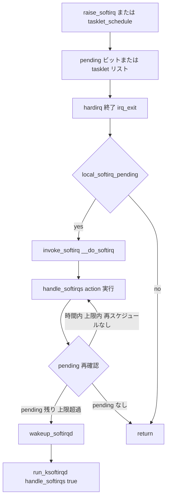

# 第4章 softirq と tasklet

> **本章で読むソース**
>
> - [`kernel/softirq.c` L579-L652](https://github.com/gregkh/linux/blob/v6.18.38/kernel/softirq.c#L579-L652)
> - [`kernel/softirq.c` L654-L657](https://github.com/gregkh/linux/blob/v6.18.38/kernel/softirq.c#L654-L657)
> - [`kernel/softirq.c` L713-L723](https://github.com/gregkh/linux/blob/v6.18.38/kernel/softirq.c#L713-L723)
> - [`kernel/softirq.c` L777-L791](https://github.com/gregkh/linux/blob/v6.18.38/kernel/softirq.c#L777-L791)
> - [`kernel/softirq.c` L809-L823](https://github.com/gregkh/linux/blob/v6.18.38/kernel/softirq.c#L809-L823)
> - [`kernel/softirq.c` L903-L948](https://github.com/gregkh/linux/blob/v6.18.38/kernel/softirq.c#L903-L948)
> - [`kernel/softirq.c` L1055-L1068](https://github.com/gregkh/linux/blob/v6.18.38/kernel/softirq.c#L1055-L1068)
> - [`kernel/softirq.c` L2400-L2410](https://github.com/gregkh/linux/blob/v6.18.38/kernel/time/timer.c#L2400-L2410)

## この章の狙い

hardirq から直接は重い処理を避け、**softirq** と **tasklet** で遅延実行する経路を読む。
`raise_softirq()` から `__do_softirq()`、割り込み出口の `invoke_softirq()` までを追い、ネットワークやタイマーがどう bottom half に載るかを把握する。

## 前提

- [第3章 request_irq からハンドラ実行まで](../part00-genirq/03-request-irq-handler.md) で hardirq コンテキストの制約を読んでいること。

## softirq の実行モデル

softirq は per-CPU の pending ビットマスク `local_softirq_pending()` で管理される。
`handle_softirqs()` は pending をクリアしてから IRQ を一時的に有効化し、`softirq_vec` に登録された action を順に呼ぶ。

[`kernel/softirq.c` L579-L652](https://github.com/gregkh/linux/blob/v6.18.38/kernel/softirq.c#L579-L652)

```c
static void handle_softirqs(bool ksirqd)
{
	unsigned long end = jiffies + MAX_SOFTIRQ_TIME;
	unsigned long old_flags = current->flags;
	int max_restart = MAX_SOFTIRQ_RESTART;
	struct softirq_action *h;
	bool in_hardirq;
	__u32 pending;
	int softirq_bit;

	/*
	 * Mask out PF_MEMALLOC as the current task context is borrowed for the
	 * softirq. A softirq handled, such as network RX, might set PF_MEMALLOC
	 * again if the socket is related to swapping.
	 */
	current->flags &= ~PF_MEMALLOC;

	pending = local_softirq_pending();

	softirq_handle_begin();
	in_hardirq = lockdep_softirq_start();
	account_softirq_enter(current);

restart:
	/* Reset the pending bitmask before enabling irqs */
	set_softirq_pending(0);

	local_irq_enable();

	h = softirq_vec;

	while ((softirq_bit = ffs(pending))) {
		unsigned int vec_nr;
		int prev_count;

		h += softirq_bit - 1;

		vec_nr = h - softirq_vec;
		prev_count = preempt_count();

		kstat_incr_softirqs_this_cpu(vec_nr);

		trace_softirq_entry(vec_nr);
		h->action();
		trace_softirq_exit(vec_nr);
		if (unlikely(prev_count != preempt_count())) {
			pr_err("huh, entered softirq %u %s %p with preempt_count %08x, exited with %08x?\n",
			       vec_nr, softirq_to_name[vec_nr], h->action,
			       prev_count, preempt_count());
			preempt_count_set(prev_count);
		}
		h++;
		pending >>= softirq_bit;
	}

	if (!IS_ENABLED(CONFIG_PREEMPT_RT) && ksirqd)
		rcu_softirq_qs();

	local_irq_disable();

	pending = local_softirq_pending();
	if (pending) {
		if (time_before(jiffies, end) && !need_resched() &&
		    --max_restart)
			goto restart;

		wakeup_softirqd();
	}

	account_softirq_exit(current);
	lockdep_softirq_end(in_hardirq);
	softirq_handle_end();
	current_restore_flags(old_flags, PF_MEMALLOC);
}
```

`MAX_SOFTIRQ_TIME` と `MAX_SOFTIRQ_RESTART` で softirq 処理時間に上限があり、超過すると `wakeup_softirqd()` で `ksoftirqd` に残りを委譲する。
処理後に pending を再確認し、時間内かつ `need_resched()` がなく再起動上限内なら `restart` へ戻る。
hardirq 内で softirq を走らせすぎないための安全弁である。

## raise_softirq と割り込み出口

`raise_softirq()` は IRQ を保存して `raise_softirq_irqoff()` を呼び、pending ビットを立てる。

[`kernel/softirq.c` L777-L791](https://github.com/gregkh/linux/blob/v6.18.38/kernel/softirq.c#L777-L791)

```c
void raise_softirq(unsigned int nr)
{
	unsigned long flags;

	local_irq_save(flags);
	raise_softirq_irqoff(nr);
	local_irq_restore(flags);
}

void __raise_softirq_irqoff(unsigned int nr)
{
	lockdep_assert_irqs_disabled();
	trace_softirq_raise(nr);
	or_softirq_pending(1UL << nr);
}
```

割り込みハンドラが終わると `irq_exit_rcu()` 経由で pending があれば `invoke_softirq()` が `__do_softirq()` を呼ぶ。

[`kernel/softirq.c` L713-L723](https://github.com/gregkh/linux/blob/v6.18.38/kernel/softirq.c#L713-L723)

```c
static inline void __irq_exit_rcu(void)
{
#ifndef __ARCH_IRQ_EXIT_IRQS_DISABLED
	local_irq_disable();
#else
	lockdep_assert_irqs_disabled();
#endif
	account_hardirq_exit(current);
	preempt_count_sub(HARDIRQ_OFFSET);
	if (!in_interrupt() && local_softirq_pending())
		invoke_softirq();
```

`__do_softirq()` 自体は `handle_softirqs(false)` への薄いラッパーである。

[`kernel/softirq.c` L654-L657](https://github.com/gregkh/linux/blob/v6.18.38/kernel/softirq.c#L654-L657)

```c
asmlinkage __visible void __softirq_entry __do_softirq(void)
{
	handle_softirqs(false);
}
```

## run_ksoftirqd：ksoftirqd スレッド側

`ksoftirqd` は per-CPU スレッドで、`run_ksoftirqd()` が pending を見て `handle_softirqs(true)` を呼ぶ。
`ksirqd=true` なので inline stack 上で softirq を処理し、終了後に `cond_resched()` する。

[`kernel/softirq.c` L1055-L1068](https://github.com/gregkh/linux/blob/v6.18.38/kernel/softirq.c#L1055-L1068)

```c
static void run_ksoftirqd(unsigned int cpu)
{
	ksoftirqd_run_begin();
	if (local_softirq_pending()) {
		/*
		 * We can safely run softirq on inline stack, as we are not deep
		 * in the task stack here.
		 */
		handle_softirqs(true);
		ksoftirqd_run_end();
		cond_resched();
		return;
	}
	ksoftirqd_run_end();
}
```

**最適化の工夫**：softirq は hardirq 直後に同じ CPU で走るためキャッシュ局所性が高い。
一方、処理が長引くと割り込みレイテンシが悪化するので、時間と再起動回数の上限で ksoftirqd へ逃がす。

## tasklet：softirq 上の薄いラッパー

tasklet は per-CPU リスト `tasklet_vec` に積まれ、`TASKLET_SOFTIRQ` または `HI_SOFTIRQ` を raise する。
`__tasklet_schedule_common()` は IRQ 保存下でリストに連結し、softirq を起こす。

[`kernel/softirq.c` L809-L823](https://github.com/gregkh/linux/blob/v6.18.38/kernel/softirq.c#L809-L823)

```c
static void __tasklet_schedule_common(struct tasklet_struct *t,
				      struct tasklet_head __percpu *headp,
				      unsigned int softirq_nr)
{
	struct tasklet_head *head;
	unsigned long flags;

	local_irq_save(flags);
	head = this_cpu_ptr(headp);
	t->next = NULL;
	*head->tail = t;
	head->tail = &(t->next);
	raise_softirq_irqoff(softirq_nr);
	local_irq_restore(flags);
}
```

実行時は `tasklet_action_common()` がリストを取り出し、ロック取得に成功した tasklet だけ callback を呼ぶ。
再入中に schedule された tasklet はリスト末尾へ戻し、再度 softirq を raise する。

[`kernel/softirq.c` L903-L948](https://github.com/gregkh/linux/blob/v6.18.38/kernel/softirq.c#L903-L948)

```c
static void tasklet_action_common(struct tasklet_head *tl_head,
				  unsigned int softirq_nr)
{
	struct tasklet_struct *list;

	local_irq_disable();
	list = tl_head->head;
	tl_head->head = NULL;
	tl_head->tail = &tl_head->head;
	local_irq_enable();

	tasklet_lock_callback();
	while (list) {
		struct tasklet_struct *t = list;

		list = list->next;

		if (tasklet_trylock(t)) {
			if (!atomic_read(&t->count)) {
				if (tasklet_clear_sched(t)) {
					if (t->use_callback) {
						trace_tasklet_entry(t, t->callback);
						t->callback(t);
						trace_tasklet_exit(t, t->callback);
					} else {
						trace_tasklet_entry(t, t->func);
						t->func(t->data);
						trace_tasklet_exit(t, t->func);
					}
				}
				tasklet_unlock(t);
				tasklet_callback_sync_wait_running();
				continue;
			}
			tasklet_unlock(t);
		}

		local_irq_disable();
		t->next = NULL;
		*tl_head->tail = t;
		tl_head->tail = &t->next;
		__raise_softirq_irqoff(softirq_nr);
		local_irq_enable();
	}
	tasklet_unlock_callback();
}
```

## TIMER_SOFTIRQ との接続

従来の `timer_list` は満了時に `TIMER_SOFTIRQ` を raise し、`run_timer_softirq()` がタイマーホイールを処理する（第7章）。

[`kernel/time/timer.c` L2400-L2410](https://github.com/gregkh/linux/blob/v6.18.38/kernel/time/timer.c#L2400-L2410)

```c
static __latent_entropy void run_timer_softirq(void)
{
	run_timer_base(BASE_LOCAL);
	if (IS_ENABLED(CONFIG_NO_HZ_COMMON)) {
		run_timer_base(BASE_GLOBAL);
		run_timer_base(BASE_DEF);

		if (is_timers_nohz_active())
			tmigr_handle_remote();
	}
}
```

## 処理の流れ：raise から handler 実行まで



## まとめ

- softirq は hardirq 直後に同 CPU で走る bottom half で、pending ビットと `softirq_vec` で種類ごとに dispatch する。
- 処理時間に上限があり、超過分は ksoftirqd が引き受ける。
- tasklet は softirq 上の per-CPU リストで、同一 tasklet の並行実行をロックで防ぐ。
- タイマーホイールやネットワーク RX は代表例として softirq に載る。

## 関連する章

- [第3章 request_irq からハンドラ実行まで](../part00-genirq/03-request-irq-handler.md)
- [第5章 workqueue の構造](../part01-deferred/05-workqueue-structure.md)
- [第7章 タイマーホイール](../part02-timer/07-timer-wheel.md)
