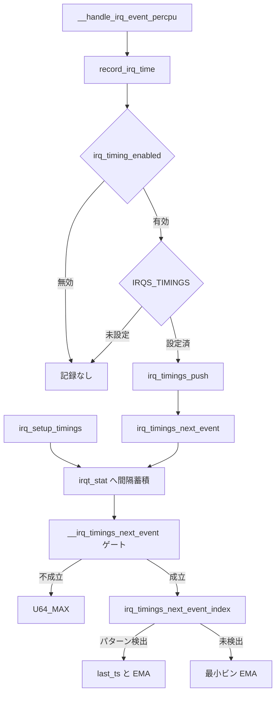

# 第6章 IRQ timing 予測

> **本章で読むソース**
>
> - [`kernel/irq/internals.h` L291-L305](https://github.com/gregkh/linux/blob/v6.18.38/kernel/irq/internals.h#L291-L305)
> - [`kernel/irq/internals.h` L356-L392](https://github.com/gregkh/linux/blob/v6.18.38/kernel/irq/internals.h#L356-L392)
> - [`kernel/irq/handle.c` L177-L183](https://github.com/gregkh/linux/blob/v6.18.38/kernel/irq/handle.c#L177-L183)
> - [`kernel/irq/manage.c` L1765-L1767](https://github.com/gregkh/linux/blob/v6.18.38/kernel/irq/manage.c#L1765-L1767)
> - [`kernel/irq/timings.c` L300-L315](https://github.com/gregkh/linux/blob/v6.18.38/kernel/irq/timings.c#L300-L315)
> - [`kernel/irq/timings.c` L446-L508](https://github.com/gregkh/linux/blob/v6.18.38/kernel/irq/timings.c#L446-L508)
> - [`kernel/irq/timings.c` L317-L380](https://github.com/gregkh/linux/blob/v6.18.38/kernel/irq/timings.c#L317-L380)
> - [`kernel/irq/timings.c` L382-L432](https://github.com/gregkh/linux/blob/v6.18.38/kernel/irq/timings.c#L382-L432)
> - [`kernel/irq/timings.c` L537-L593](https://github.com/gregkh/linux/blob/v6.18.38/kernel/irq/timings.c#L537-L593)

## この章の狙い

**irq_timings** は、各 CPU で発生した割り込みの時刻と IRQ 番号をリングバッファに記録し、周期性から次回割り込み時刻を推定する機構である。
hardirq 入口の **record_irq_time** から統計モデル **irqt_stat**、予測 API **irq_timings_next_event** までの経路を読む。
cpuidle が idle 滞在時間を決める際の入力として設計されているが、詳細な governor 連携は電源管理分冊の範囲とする。

## 前提

- [第3章 request_irq からハンドラ実行まで](../part00-genirq/03-request-irq-handler.md) で `__handle_irq_event_percpu` を読んでいること。
- [第5章 IRQ affinity と vector matrix](../part00-genirq/05-irq-affinity-vector-matrix.md) で per-CPU データの語彙を押さえていること。

## per-CPU リングバッファと static key

`CONFIG_IRQ_TIMINGS` が有効なとき、各 CPU は **irq_timings** 構造体を持つ。
`values[]` には `<timestamp, irq>` を 1 つの u64 に詰め込んだエントリが時系列で溜まる。

[`kernel/irq/internals.h` L291-L305](https://github.com/gregkh/linux/blob/v6.18.38/kernel/irq/internals.h#L291-L305)

```c
#define IRQ_TIMINGS_SHIFT	5
#define IRQ_TIMINGS_SIZE	(1 << IRQ_TIMINGS_SHIFT)
#define IRQ_TIMINGS_MASK	(IRQ_TIMINGS_SIZE - 1)

/**
 * struct irq_timings - irq timings storing structure
 * @values: a circular buffer of u64 encoded <timestamp,irq> values
 * @count: the number of elements in the array
 */
struct irq_timings {
	u64	values[IRQ_TIMINGS_SIZE];
	int	count;
};
```

記録が実際にリングへ載るには、二段のゲートが揃う必要がある。
第一に **irq_timing_enabled** static key が `irq_timings_enable()` で有効化されていること。
第二に、対象 **irq_desc** に **IRQS_TIMINGS** が立っていること（`irq_setup_timings` 成功時）。
`record_irq_time` は両方を満たしたときだけ `irq_timings_push` を呼ぶ。

`v6.18.38` では `irq_timings_enable()` の in-tree 呼び出し元もなく、`DEFINE_STATIC_KEY_FALSE` の既定では static key は常に無効である。
selftest も `irq_timings_next_event_index` や `__irq_timings_store` を直接叩くだけで、static key を enable しない。
したがってコードは組み込み済みだが、通常構成ではリングへ記録されない休眠機構である。

[`kernel/irq/internals.h` L356-L392](https://github.com/gregkh/linux/blob/v6.18.38/kernel/irq/internals.h#L356-L392)

```c
static inline u64 irq_timing_encode(u64 timestamp, int irq)
{
	return (timestamp << 16) | irq;
}

static inline int irq_timing_decode(u64 value, u64 *timestamp)
{
	*timestamp = value >> 16;
	return value & U16_MAX;
}

static __always_inline void irq_timings_push(u64 ts, int irq)
{
	struct irq_timings *timings = this_cpu_ptr(&irq_timings);

	timings->values[timings->count & IRQ_TIMINGS_MASK] =
		irq_timing_encode(ts, irq);

	timings->count++;
}

static __always_inline void record_irq_time(struct irq_desc *desc)
{
	if (!static_branch_likely(&irq_timing_enabled))
		return;

	if (desc->istate & IRQS_TIMINGS)
		irq_timings_push(local_clock(), irq_desc_get_irq(desc));
}
```

`__handle_irq_event_percpu` の先頭で **record_irq_time** が呼ばれ、ハンドラ実行前にタイムスタンプだけを残す。

[`kernel/irq/handle.c` L177-L183](https://github.com/gregkh/linux/blob/v6.18.38/kernel/irq/handle.c#L177-L183)

```c
irqreturn_t __handle_irq_event_percpu(struct irq_desc *desc)
{
	irqreturn_t retval = IRQ_NONE;
	unsigned int irq = desc->irq_data.irq;
	struct irqaction *action;

	record_irq_time(desc);
```

## request_irq 時の統計領域確保

`request_threaded_irq` が成功すると **irq_setup_timings** が走る。
`__IRQF_TIMER` 付きハンドラは計測対象外とし、それ以外は IRQ 番号ごとに per-CPU **irqt_stat** を idr で確保する。

[`kernel/irq/manage.c` L1765-L1767](https://github.com/gregkh/linux/blob/v6.18.38/kernel/irq/manage.c#L1765-L1767)

```c
	mutex_unlock(&desc->request_mutex);

	irq_setup_timings(desc, new);
```

`irq_setup_timings` は `irq_timings_alloc(irq)` で統計構造体を作り、成功時に `desc->istate |= IRQS_TIMINGS` を立てる（internals.h）。

## 間隔の EMA と log インデックス

バッファ消費時、各 IRQ の連続発生間隔は **ilog2** でビン化され、ビンごとに **指数移動平均**（EMA）が更新される。
1 秒以上空いた間隔は系列をリセットし、予測不能とみなす。

[`kernel/irq/timings.c` L300-L315](https://github.com/gregkh/linux/blob/v6.18.38/kernel/irq/timings.c#L300-L315)

```c
static u64 irq_timings_ema_new(u64 value, u64 ema_old)
{
	s64 diff;

	if (unlikely(!ema_old))
		return value;

	diff = (value - ema_old) * EMA_ALPHA_VAL;
	return ema_old + (diff >> EMA_ALPHA_SHIFT);
}
```

[`kernel/irq/timings.c` L446-L508](https://github.com/gregkh/linux/blob/v6.18.38/kernel/irq/timings.c#L446-L508)

```c
static __always_inline void __irq_timings_store(int irq, struct irqt_stat *irqs,
						u64 interval)
{
	int index;

	index = irq_timings_interval_index(interval);

	if (index > PREDICTION_BUFFER_SIZE - 1) {
		irqs->count = 0;
		return;
	}

	irqs->circ_timings[irqs->count & IRQ_TIMINGS_MASK] = index;

	irqs->ema_time[index] = irq_timings_ema_new(interval,
						    irqs->ema_time[index]);

	irqs->count++;
}

static inline void irq_timings_store(int irq, struct irqt_stat *irqs, u64 ts)
{
	u64 old_ts = irqs->last_ts;
	u64 interval;

	irqs->last_ts = ts;

	interval = ts - old_ts;

	if (interval >= NSEC_PER_SEC) {
		irqs->count = 0;
		return;
	}

	__irq_timings_store(irq, irqs, interval);
}
```

## 周期性検出と次イベント推定

### irq_timings_next_event_index

**irq_timings_next_event_index** は、直近 `period_max * 3` 個のビン列に対し、長さ `period`（3〜5）の suffix が 3 回繰り返すかを `memcmp` で探す。
パターンが見つかれば次のビン index を返し、見つからなければ `-1` を返す。
この関数単体では EMA へのフォールバックは行わない。

[`kernel/irq/timings.c` L317-L380](https://github.com/gregkh/linux/blob/v6.18.38/kernel/irq/timings.c#L317-L380)

```c
static int irq_timings_next_event_index(int *buffer, size_t len, int period_max)
{
	int period;

	buffer = &buffer[len - (period_max * 3)];

	len = period_max * 3;

	for (period = period_max; period >= PREDICTION_PERIOD_MIN; period--) {

		int idx = period;
		size_t size = period;

		while (!memcmp(buffer, &buffer[idx], size * sizeof(int))) {

			idx += size;

			if (idx == len)
				return buffer[len % period];

			if (len - idx < period)
				size = len - idx;
		}
	}

	return -1;
}
```

### __irq_timings_next_event の成立ゲート

周期探索の前に **__irq_timings_next_event** が次の成立条件を順に判定する。

1. `now - last_ts` が 1 秒以上なら `count` と `last_ts` をリセットし `U64_MAX` を返す。
2. `period_max` を `min(5, count/3)`（`count > 15` のときは 5）に切り詰める。
3. `period_max <= 3`（`PREDICTION_PERIOD_MIN`）なら `U64_MAX` を返す。

条件 3 が通るには `count/3 >= 4` が必要であり、少なくとも **12 個の間隔**が蓄積されていることになる。
このゲートを通過したあとだけ `irq_timings_next_event_index` が呼ばれ、`-1` のとき最小ビン index の EMA へフォールバックする。

[`kernel/irq/timings.c` L382-L432](https://github.com/gregkh/linux/blob/v6.18.38/kernel/irq/timings.c#L382-L432)

```c
static u64 __irq_timings_next_event(struct irqt_stat *irqs, int irq, u64 now)
{
	int index, i, period_max, count, start, min = INT_MAX;

	if ((now - irqs->last_ts) >= NSEC_PER_SEC) {
		irqs->count = irqs->last_ts = 0;
		return U64_MAX;
	}

	/*
	 * As we want to find three times the repetition, we need a
	 * number of intervals greater or equal to three times the
	 * maximum period, otherwise we truncate the max period.
	 */
	period_max = irqs->count > (3 * PREDICTION_PERIOD_MAX) ?
		PREDICTION_PERIOD_MAX : irqs->count / 3;

	/*
	 * If we don't have enough irq timings for this prediction,
	 * just bail out.
	 */
	if (period_max <= PREDICTION_PERIOD_MIN)
		return U64_MAX;

	/*
	 * 'count' will depends if the circular buffer wrapped or not
	 */
	count = irqs->count < IRQ_TIMINGS_SIZE ?
		irqs->count : IRQ_TIMINGS_SIZE;

	start = irqs->count < IRQ_TIMINGS_SIZE ?
		0 : (irqs->count & IRQ_TIMINGS_MASK);

	/*
	 * Copy the content of the circular buffer into another buffer
	 * in order to linearize the buffer instead of dealing with
	 * wrapping indexes and shifted array which will be prone to
	 * error and extremely difficult to debug.
	 */
	for (i = 0; i < count; i++) {
		int index = (start + i) & IRQ_TIMINGS_MASK;

		irqs->timings[i] = irqs->circ_timings[index];
		min = min_t(int, irqs->timings[i], min);
	}

	index = irq_timings_next_event_index(irqs->timings, count, period_max);
	if (index < 0)
		return irqs->last_ts + irqs->ema_time[min];

	return irqs->last_ts + irqs->ema_time[index];
}
```

### irq_timings_next_event

**irq_timings_next_event** は local IRQ 無効下で per-CPU リングを走査し、各 IRQ の統計へ `irq_timings_store` で間隔を流し込んだあと、**__irq_timings_next_event** を IRQ ごとに呼んで全予測時刻の最小値を返す。
呼び出し後 `irqts->count` はマクロ `for_each_irqts` により消費される。

[`kernel/irq/timings.c` L537-L593](https://github.com/gregkh/linux/blob/v6.18.38/kernel/irq/timings.c#L537-L593)

```c
u64 irq_timings_next_event(u64 now)
{
	struct irq_timings *irqts = this_cpu_ptr(&irq_timings);
	struct irqt_stat *irqs;
	struct irqt_stat __percpu *s;
	u64 ts, next_evt = U64_MAX;
	int i, irq = 0;

	lockdep_assert_irqs_disabled();

	if (!irqts->count)
		return next_evt;

	for_each_irqts(i, irqts) {
		irq = irq_timing_decode(irqts->values[i], &ts);
		s = idr_find(&irqt_stats, irq);
		if (s)
			irq_timings_store(irq, this_cpu_ptr(s), ts);
	}

	idr_for_each_entry(&irqt_stats, s, i) {

		irqs = this_cpu_ptr(s);

		ts = __irq_timings_next_event(irqs, i, now);
		if (ts <= now)
			return now;

		if (ts < next_evt)
			next_evt = ts;
	}

	return next_evt;
}
```

`v6.18.38` 時点では `irq_timings_next_event` の in-tree 呼び出し元もなく、`irq_timings_enable()` も誰からも呼ばれない。
通常構成では static key が無効のままなので、リング記録も予測 API も実運用では動かない休眠機構である。
cpuidle がこの API で sleep 上限を切る想定は設計上の出口に留まり、詳細な governor 連携は電源管理分冊へ委ねる。

> **7.x 系での変化**
> `v7.1.3` タグには `kernel/irq/timings.c` が存在せず、`CONFIG_IRQ_TIMINGS` 向けの記録と予測実装は削除されている。

## 処理の流れ



idle 入口が `irq_timings_next_event` を呼ぶ想定では、busy 周期に溜まったリング内容を一度モデルへ流し込み、**__irq_timings_next_event** のゲートを通過した IRQ だけが予測値に寄与する。

## 高速化と最適化の工夫

記録は **static_branch** と `__always_inline` の **record_irq_time** に閉じ込め、無効時は jump label のパッチ済み分岐だけで戻り、timestamp 取得やリング更新などの記録処理を hot path から除く。
リングバッファは専用の循環配列型を使わず、インデックス演算を `count & MASK` に限定して割り込みハンドラの命令数を抑える。
予測側は suffix 長を最大 5 に制限し、周期探索を 1 マイクロ秒未満に収める設計である（timings.c 先頭コメント）。

## まとめ

- **record_irq_time** は `irq_timing_enabled` と **IRQS_TIMINGS** の二段ゲートを通過したときだけリングへ push する。
- `v6.18.38` では `irq_timings_enable()` 呼び出しがなく、通常構成では記録も予測も動かない休眠機構である。
- **__irq_timings_next_event** は 1 秒超の空白、および `period_max <= 3` で `U64_MAX` を返し、少なくとも 12 間隔が必要である。
- ゲート通過後に周期パターンが無いときだけ最小ビン EMA へフォールバックする。
- **irq_timings_next_event** は全 IRQ の予測時刻最小値を返す API で、cpuidle 連携は電源管理分冊の対象とする。

## 関連する章

- [第3章 request_irq からハンドラ実行まで](../part00-genirq/03-request-irq-handler.md)
- [第7章 softirq と tasklet](07-softirq-tasklet.md)
- [第18章 NO_HZ](../part03-tick/18-no-hz.md)
