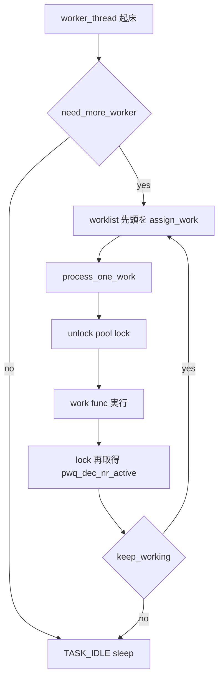

# 第6章 workqueue の実行と並行性管理

> **本章で読むソース**
>
> - [`kernel/workqueue.c` L1732-L1764](https://github.com/gregkh/linux/blob/v6.18.38/kernel/workqueue.c#L1732-L1764)
> - [`kernel/workqueue.c` L3193-L3263](https://github.com/gregkh/linux/blob/v6.18.38/kernel/workqueue.c#L3193-L3263)
> - [`kernel/workqueue.c` L3292-L3299](https://github.com/gregkh/linux/blob/v6.18.38/kernel/workqueue.c#L3292-L3299)
> - [`kernel/workqueue.c` L3403-L3474](https://github.com/gregkh/linux/blob/v6.18.38/kernel/workqueue.c#L3403-L3474)
> - [`kernel/workqueue.c` L3477-L3504](https://github.com/gregkh/linux/blob/v6.18.38/kernel/workqueue.c#L3477-L3504)
> - [`kernel/workqueue.c` L3016-L3063](https://github.com/gregkh/linux/blob/v6.18.38/kernel/workqueue.c#L3016-L3063)
> - [`kernel/workqueue.c` L3083-L3104](https://github.com/gregkh/linux/blob/v6.18.38/kernel/workqueue.c#L3083-L3104)
> - [`kernel/workqueue.c` L3527-L3595](https://github.com/gregkh/linux/blob/v6.18.38/kernel/workqueue.c#L3527-L3595)
> - [`kernel/workqueue.c` L2353-L2382](https://github.com/gregkh/linux/blob/v6.18.38/kernel/workqueue.c#L2353-L2382)

## この章の狙い

workqueue が work を **worker_thread** で実行し、`max_active` を守りながら inactive work を再開する流れを追う。
`process_one_work()` が lock を一時解放して callback を呼ぶ理由と、mayday rescuer の役割を読める状態にする。

## 前提

- [第5章 workqueue の構造](05-workqueue-structure.md) で pwq と worker_pool の関係を読んでいること。

## nr_active の取得：pwq_tryinc_nr_active

work を active に載せる前に、pwq の `nr_active` または unbound 用の per-node カウンタを increment する。
上限に達していれば `false` を返し、work は inactive キューへ入る。

[`kernel/workqueue.c` L1732-L1764](https://github.com/gregkh/linux/blob/v6.18.38/kernel/workqueue.c#L1732-L1764)

```c
static bool pwq_tryinc_nr_active(struct pool_workqueue *pwq, bool fill)
{
	struct workqueue_struct *wq = pwq->wq;
	struct worker_pool *pool = pwq->pool;
	struct wq_node_nr_active *nna = wq_node_nr_active(wq, pool->node);
	bool obtained = false;

	lockdep_assert_held(&pool->lock);

	if (!nna) {
		/* BH or per-cpu workqueue, pwq->nr_active is sufficient */
		obtained = pwq->nr_active < READ_ONCE(wq->max_active);
		goto out;
	}

	if (unlikely(pwq->plugged))
		return false;

	/*
	 * Unbound workqueue uses per-node shared nr_active $nna. If @pwq is
	 * already waiting on $nna, pwq_dec_nr_active() will maintain the
	 * concurrency level. Don't jump the line.
	 *
	 * We need to ignore the pending test after max_active has increased as
	 * pwq_dec_nr_active() can only maintain the concurrency level but not
	 * increase it. This is indicated by @fill.
	 */
	if (!list_empty(&pwq->pending_node) && likely(!fill))
		goto out;

	obtained = tryinc_node_nr_active(nna);
	if (obtained)
		goto out;
```

取得に失敗した pwq は `pending_pwqs` に載り、他 work 完了時の `pwq_dec_nr_active()` から round-robin で再開される。

## process_one_work：callback 実行の中心

worker が worklist から work を取り出すと `process_one_work()` が呼ばれる。
pool lock 下で dequeue したあと、**IRQ を有効化した状態**で `work->func` を実行する。

[`kernel/workqueue.c` L3193-L3263](https://github.com/gregkh/linux/blob/v6.18.38/kernel/workqueue.c#L3193-L3263)

```c
static void process_one_work(struct worker *worker, struct work_struct *work)
__releases(&pool->lock)
__acquires(&pool->lock)
{
	struct pool_workqueue *pwq = get_work_pwq(work);
	struct worker_pool *pool = worker->pool;
	unsigned long work_data;
	int lockdep_start_depth, rcu_start_depth;
	bool bh_draining = pool->flags & POOL_BH_DRAINING;
#ifdef CONFIG_LOCKDEP
	/*
	 * It is permissible to free the struct work_struct from
	 * inside the function that is called from it, this we need to
	 * take into account for lockdep too.  To avoid bogus "held
	 * lock freed" warnings as well as problems when looking into
	 * work->lockdep_map, make a copy and use that here.
	 */
	struct lockdep_map lockdep_map;

	lockdep_copy_map(&lockdep_map, &work->lockdep_map);
#endif
	/* ensure we're on the correct CPU */
	WARN_ON_ONCE(!(pool->flags & POOL_DISASSOCIATED) &&
		     raw_smp_processor_id() != pool->cpu);

	/* claim and dequeue */
	debug_work_deactivate(work);
	hash_add(pool->busy_hash, &worker->hentry, (unsigned long)work);
	worker->current_work = work;
	worker->current_func = work->func;
	worker->current_pwq = pwq;
	if (worker->task)
		worker->current_at = worker->task->se.sum_exec_runtime;
	work_data = *work_data_bits(work);
	worker->current_color = get_work_color(work_data);

	/*
	 * Record wq name for cmdline and debug reporting, may get
	 * overridden through set_worker_desc().
	 */
	strscpy(worker->desc, pwq->wq->name, WORKER_DESC_LEN);

	list_del_init(&work->entry);

	/*
	 * CPU intensive works don't participate in concurrency management.
	 * They're the scheduler's responsibility.  This takes @worker out
	 * of concurrency management and the next code block will chain
	 * execution of the pending work items.
	 */
	if (unlikely(pwq->wq->flags & WQ_CPU_INTENSIVE))
		worker_set_flags(worker, WORKER_CPU_INTENSIVE);

	/*
	 * Kick @pool if necessary. It's always noop for per-cpu worker pools
	 * since nr_running would always be >= 1 at this point. This is used to
	 * chain execution of the pending work items for WORKER_NOT_RUNNING
	 * workers such as the UNBOUND and CPU_INTENSIVE ones.
	 */
	kick_pool(pool);

	/*
	 * Record the last pool and clear PENDING which should be the last
	 * update to @work.  Also, do this inside @pool->lock so that
	 * PENDING and queued state changes happen together while IRQ is
	 * disabled.
	 */
	set_work_pool_and_clear_pending(work, pool->id, pool_offq_flags(pool));

	pwq->stats[PWQ_STAT_STARTED]++;
	raw_spin_unlock_irq(&pool->lock);
```

callback 本体は trace の後に呼ばれる。

[`kernel/workqueue.c` L3292-L3299](https://github.com/gregkh/linux/blob/v6.18.38/kernel/workqueue.c#L3292-L3299)

```c
	lockdep_invariant_state(true);
	trace_workqueue_execute_start(work);
	worker->current_func(work);
	/*
	 * While we must be careful to not use "work" after this, the trace
	 * point will only record its address.
	 */
	trace_workqueue_execute_end(work, worker->current_func);
```

**最適化の工夫**：callback 中は pool lock を保持しないため、長い I/O 待ちが他 work の dequeue をブロックしない。
`max_active` は同時実行 worker 数だけを制限し、プール全体のスループットを維持する。

## worker_thread のメインループ

`worker_thread()` は pool lock 下で worklist を監視し、必要なら追加 worker を `manage_workers()` で作る。
work があれば `process_scheduled_works()` 経由で `process_one_work()` を連続実行する。

[`kernel/workqueue.c` L3403-L3474](https://github.com/gregkh/linux/blob/v6.18.38/kernel/workqueue.c#L3403-L3474)

```c
static int worker_thread(void *__worker)
{
	struct worker *worker = __worker;
	struct worker_pool *pool = worker->pool;

	/* tell the scheduler that this is a workqueue worker */
	set_pf_worker(true);
woke_up:
	raw_spin_lock_irq(&pool->lock);

	/* am I supposed to die? */
	if (unlikely(worker->flags & WORKER_DIE)) {
		raw_spin_unlock_irq(&pool->lock);
		set_pf_worker(false);
		/*
		 * The worker is dead and PF_WQ_WORKER is cleared, worker->pool
		 * shouldn't be accessed, reset it to NULL in case otherwise.
		 */
		worker->pool = NULL;
		ida_free(&pool->worker_ida, worker->id);
		return 0;
	}

	worker_leave_idle(worker);
recheck:
	/* no more worker necessary? */
	if (!need_more_worker(pool))
		goto sleep;

	/* do we need to manage? */
	if (unlikely(!may_start_working(pool)) && manage_workers(worker))
		goto recheck;

	/*
	 * ->scheduled list can only be filled while a worker is
	 * preparing to process a work or actually processing it.
	 * Make sure nobody diddled with it while I was sleeping.
	 */
	WARN_ON_ONCE(!list_empty(&worker->scheduled));

	/*
	 * Finish PREP stage.  We're guaranteed to have at least one idle
	 * worker or that someone else has already assumed the manager
	 * role.  This is where @worker starts participating in concurrency
	 * management if applicable and concurrency management is restored
	 * after being rebound.  See rebind_workers() for details.
	 */
	worker_clr_flags(worker, WORKER_PREP | WORKER_REBOUND);

	do {
		struct work_struct *work =
			list_first_entry(&pool->worklist,
					 struct work_struct, entry);

		if (assign_work(work, worker, NULL))
			process_scheduled_works(worker);
	} while (keep_working(pool));

	worker_set_flags(worker, WORKER_PREP);
sleep:
	/*
	 * pool->lock is held and there's no work to process and no need to
	 * manage, sleep.  Workers are woken up only while holding
	 * pool->lock or from local cpu, so setting the current state
	 * before releasing pool->lock is enough to prevent losing any
	 * event.
	 */
	worker_enter_idle(worker);
	__set_current_state(TASK_IDLE);
	raw_spin_unlock_irq(&pool->lock);
	schedule();
	goto woke_up;
```

## __queue_work：pool への enqueue

`queue_work()` は IRQ 無効状態で `__queue_work()` を呼び、CPU バウンドなら `cpu_pwq`、unbound なら `wq_select_unbound_cpu()` で pwq を決める。
pool lock 取得後、`pwq_tryinc_nr_active()` の成否で worklist と inactive_works のどちらへ載せるかを分岐する。

[`kernel/workqueue.c` L2353-L2382](https://github.com/gregkh/linux/blob/v6.18.38/kernel/workqueue.c#L2353-L2382)

```c
	/* pwq determined, queue */
	trace_workqueue_queue_work(req_cpu, pwq, work);

	if (WARN_ON(!list_empty(&work->entry)))
		goto out;

	pwq->nr_in_flight[pwq->work_color]++;
	work_flags = work_color_to_flags(pwq->work_color);

	/*
	 * Limit the number of concurrently active work items to max_active.
	 * @work must also queue behind existing inactive work items to maintain
	 * ordering when max_active changes. See wq_adjust_max_active().
	 */
	if (list_empty(&pwq->inactive_works) && pwq_tryinc_nr_active(pwq, false)) {
		if (list_empty(&pool->worklist))
			pool->watchdog_ts = jiffies;

		trace_workqueue_activate_work(work);
		insert_work(pwq, work, &pool->worklist, work_flags);
		kick_pool(pool);
	} else {
		work_flags |= WORK_STRUCT_INACTIVE;
		insert_work(pwq, work, &pwq->inactive_works, work_flags);
	}

out:
	raw_spin_unlock(&pool->lock);
	rcu_read_unlock();
}
```

実行中 work の再入防止のため、別 pool で callback 実行中ならその pwq へ載せ直す分岐が lock 取得前にある。

## mayday と rescuer

worker 作成が `MAYDAY_INITIAL_TIMEOUT` 以内に進まないと `maybe_create_worker()` が mayday タイマーを初回発火させる。
以後 `pool_mayday_timeout()` が `MAYDAY_INTERVAL` ごとに再設定し、worklist を走査して `send_mayday()` で rescuer を起こす。

[`kernel/workqueue.c` L3083-L3104](https://github.com/gregkh/linux/blob/v6.18.38/kernel/workqueue.c#L3083-L3104)

```c
static void maybe_create_worker(struct worker_pool *pool)
__releases(&pool->lock)
__acquires(&pool->lock)
{
restart:
	raw_spin_unlock_irq(&pool->lock);

	/* if we don't make progress in MAYDAY_INITIAL_TIMEOUT, call for help */
	mod_timer(&pool->mayday_timer, jiffies + MAYDAY_INITIAL_TIMEOUT);

	while (true) {
		if (create_worker(pool) || !need_to_create_worker(pool))
			break;

		schedule_timeout_interruptible(CREATE_COOLDOWN);

		if (!need_to_create_worker(pool))
			break;
	}

	timer_delete_sync(&pool->mayday_timer);
	raw_spin_lock_irq(&pool->lock);
```

[`kernel/workqueue.c` L3016-L3063](https://github.com/gregkh/linux/blob/v6.18.38/kernel/workqueue.c#L3016-L3063)

```c
static void send_mayday(struct work_struct *work)
{
	struct pool_workqueue *pwq = get_work_pwq(work);
	struct workqueue_struct *wq = pwq->wq;

	lockdep_assert_held(&wq_mayday_lock);

	if (!wq->rescuer)
		return;

	/* mayday mayday mayday */
	if (list_empty(&pwq->mayday_node)) {
		/*
		 * If @pwq is for an unbound wq, its base ref may be put at
		 * any time due to an attribute change.  Pin @pwq until the
		 * rescuer is done with it.
		 */
		get_pwq(pwq);
		list_add_tail(&pwq->mayday_node, &wq->maydays);
		wake_up_process(wq->rescuer->task);
		pwq->stats[PWQ_STAT_MAYDAY]++;
	}
}

static void pool_mayday_timeout(struct timer_list *t)
{
	struct worker_pool *pool = timer_container_of(pool, t, mayday_timer);
	struct work_struct *work;

	raw_spin_lock_irq(&pool->lock);
	raw_spin_lock(&wq_mayday_lock);		/* for wq->maydays */

	if (need_to_create_worker(pool)) {
		/*
		 * We've been trying to create a new worker but
		 * haven't been successful.  We might be hitting an
		 * allocation deadlock.  Send distress signals to
		 * rescuers.
		 */
		list_for_each_entry(work, &pool->worklist, entry)
			send_mayday(work);
	}

	raw_spin_unlock(&wq_mayday_lock);
	raw_spin_unlock_irq(&pool->lock);

	mod_timer(&pool->mayday_timer, jiffies + MAYDAY_INTERVAL);
}
```

`assign_rescuer_work()` は mayday 対象 pwq の worklist から rescuer に work を割り当てる。

[`kernel/workqueue.c` L3477-L3504](https://github.com/gregkh/linux/blob/v6.18.38/kernel/workqueue.c#L3477-L3504)

```c
static bool assign_rescuer_work(struct pool_workqueue *pwq, struct worker *rescuer)
{
	struct worker_pool *pool = pwq->pool;
	struct work_struct *cursor = &pwq->mayday_cursor;
	struct work_struct *work, *n;

	/* need rescue? */
	if (!pwq->nr_active || !need_to_create_worker(pool))
		return false;

	/* search from the start or cursor if available */
	if (list_empty(&cursor->entry))
		work = list_first_entry(&pool->worklist, struct work_struct, entry);
	else
		work = list_next_entry(cursor, entry);

	/* find the next work item to rescue */
	list_for_each_entry_safe_from(work, n, &pool->worklist, entry) {
		if (get_work_pwq(work) == pwq && assign_work(work, rescuer, &n)) {
			pwq->stats[PWQ_STAT_RESCUED]++;
			/* put the cursor for next search */
			list_move_tail(&cursor->entry, &n->entry);
			return true;
		}
	}

	return false;
}
```

`rescuer_thread()` は `wq->maydays` から pwq を取り出し、`assign_rescuer_work()` と `process_scheduled_works()` を繰り返す。

[`kernel/workqueue.c` L3527-L3595](https://github.com/gregkh/linux/blob/v6.18.38/kernel/workqueue.c#L3527-L3595)

```c
static int rescuer_thread(void *__rescuer)
{
	struct worker *rescuer = __rescuer;
	struct workqueue_struct *wq = rescuer->rescue_wq;
	bool should_stop;

	set_user_nice(current, RESCUER_NICE_LEVEL);

	/*
	 * Mark rescuer as worker too.  As WORKER_PREP is never cleared, it
	 * doesn't participate in concurrency management.
	 */
	set_pf_worker(true);
repeat:
	set_current_state(TASK_IDLE);

	/*
	 * By the time the rescuer is requested to stop, the workqueue
	 * shouldn't have any work pending, but @wq->maydays may still have
	 * pwq(s) queued.  This can happen by non-rescuer workers consuming
	 * all the work items before the rescuer got to them.  Go through
	 * @wq->maydays processing before acting on should_stop so that the
	 * list is always empty on exit.
	 */
	should_stop = kthread_should_stop();

	/* see whether any pwq is asking for help */
	raw_spin_lock_irq(&wq_mayday_lock);

	while (!list_empty(&wq->maydays)) {
		struct pool_workqueue *pwq = list_first_entry(&wq->maydays,
					struct pool_workqueue, mayday_node);
		struct worker_pool *pool = pwq->pool;
		unsigned int count = 0;

		__set_current_state(TASK_RUNNING);
		list_del_init(&pwq->mayday_node);

		raw_spin_unlock_irq(&wq_mayday_lock);

		worker_attach_to_pool(rescuer, pool);

		raw_spin_lock_irq(&pool->lock);

		WARN_ON_ONCE(!list_empty(&rescuer->scheduled));

		while (assign_rescuer_work(pwq, rescuer)) {
			process_scheduled_works(rescuer);

			/*
			 * If the per-turn work item limit is reached and other
			 * PWQs are in mayday, requeue mayday for this PWQ and
			 * let the rescuer handle the other PWQs first.
			 */
			if (++count > RESCUER_BATCH && !list_empty(&pwq->wq->maydays) &&
			    pwq->nr_active && need_to_create_worker(pool)) {
				raw_spin_lock(&wq_mayday_lock);
				/*
				 * Queue iff we aren't racing destruction
				 * and somebody else hasn't queued it already.
				 */
				if (wq->rescuer && list_empty(&pwq->mayday_node)) {
					get_pwq(pwq);
					list_add_tail(&pwq->mayday_node, &wq->maydays);
				}
				raw_spin_unlock(&wq_mayday_lock);
				break;
			}
		}
```

rescuer は `WQ_MEM_RECLAIM` などメモリ回収が必要な workqueue で、worker 作成がブロックされた場合の最後の手段になる。

> **7.x 系での変化**
> v7.1.3 では [`kernel/workqueue.c` L3507-L3531](https://github.com/gregkh/linux/blob/v7.1.3/kernel/workqueue.c#L3507-L3531) が idle worker がいても memory pressure 継続時に rescuer が救済を続ける条件を明示している。
> `send_mayday()` の引数も work から pwq へ変わり、mayday 再キューは [`L3631`](https://github.com/gregkh/linux/blob/v7.1.3/kernel/workqueue.c#L3631) 付近で `send_mayday(pwq)` へ統一されている。

## 処理の流れ：work 実行まで



## まとめ

- `pwq_tryinc_nr_active()` が `max_active` を enforce し、超過 work を inactive へ退避する。
- `process_one_work()` は lock 外で callback を実行し、長い処理がプールを占有しないようにする。
- `worker_thread()` が worklist を消化し、不足時は worker 動的生成と mayday rescuer で回復する。
- unbound workqueue は per-node カウンタで NUMA 局所性を保つ。

## 関連する章

- [第5章 workqueue の構造](05-workqueue-structure.md)
- [第4章 softirq と tasklet](04-softirq-tasklet.md)
- [プロセスとスケジューラ 第3部 EEVDF](../../sched/README.md)
