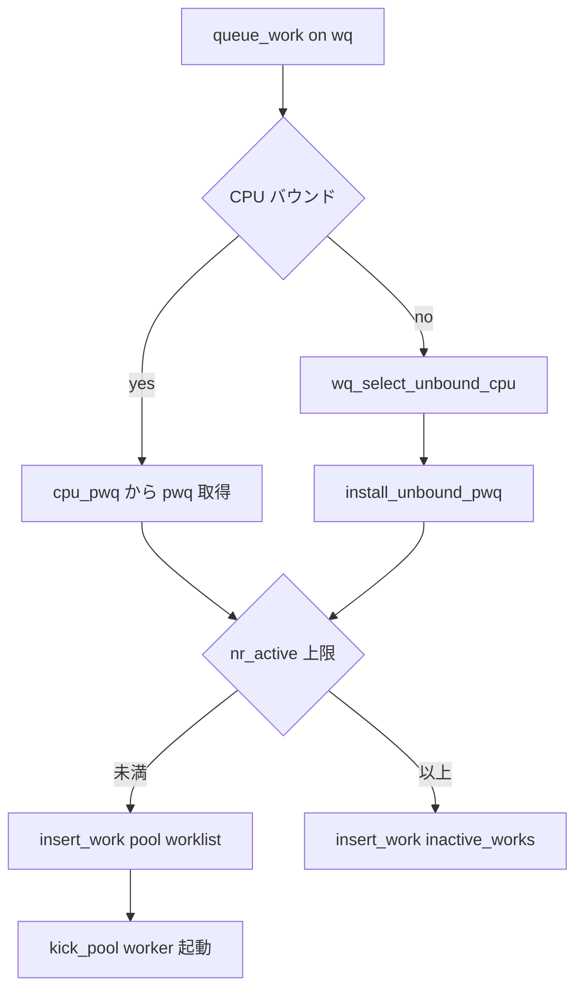

# 第8章 workqueue の構造

> **本章で読むソース**
>
> - [`kernel/workqueue.c` L186-L209](https://github.com/gregkh/linux/blob/v6.18.38/kernel/workqueue.c#L186-L209)
> - [`kernel/workqueue.c` L260-L303](https://github.com/gregkh/linux/blob/v6.18.38/kernel/workqueue.c#L260-L303)
> - [`kernel/workqueue.c` L329-L349](https://github.com/gregkh/linux/blob/v6.18.38/kernel/workqueue.c#L329-L349)
> - [`kernel/workqueue.c` L340-L349](https://github.com/gregkh/linux/blob/v6.18.38/kernel/workqueue.c#L340-L349)
> - [`kernel/workqueue.c` L2211-L2223](https://github.com/gregkh/linux/blob/v6.18.38/kernel/workqueue.c#L2211-L2223)
> - [`kernel/workqueue.c` L5203-L5231](https://github.com/gregkh/linux/blob/v6.18.38/kernel/workqueue.c#L5203-L5231)
> - [`kernel/workqueue.c` L5235-L5250](https://github.com/gregkh/linux/blob/v6.18.38/kernel/workqueue.c#L5235-L5250)

## この章の狙い

process コンテキストで走る遅延処理の基盤である **workqueue** のデータ構造を読む。
**worker_pool**、**pool_workqueue**（pwq）、**workqueue_struct** の3層が、どの CPU のどの worker に work を渡すかを決める。

## 前提

- [第7章 softirq と tasklet](07-softirq-tasklet.md) で bottom half と process コンテキストの違いを押さえていること。

## worker_pool：実際に work を実行するプール

各 **worker_pool** は1つの raw spinlock、worklist、idle worker リスト、実行中 worker 数 `nr_running` を持つ。
CPU バウンドプールは `cpu` フィールドが固定 CPU を指し、アンバウンドプールは node 単位で共有される。

[`kernel/workqueue.c` L186-L209](https://github.com/gregkh/linux/blob/v6.18.38/kernel/workqueue.c#L186-L209)

```c
struct worker_pool {
	raw_spinlock_t		lock;		/* the pool lock */
	int			cpu;		/* I: the associated cpu */
	int			node;		/* I: the associated node ID */
	int			id;		/* I: pool ID */
	unsigned int		flags;		/* L: flags */

	unsigned long		watchdog_ts;	/* L: watchdog timestamp */
	bool			cpu_stall;	/* WD: stalled cpu bound pool */

	/*
	 * The counter is incremented in a process context on the associated CPU
	 * w/ preemption disabled, and decremented or reset in the same context
	 * but w/ pool->lock held. The readers grab pool->lock and are
	 * guaranteed to see if the counter reached zero.
	 */
	int			nr_running;

	struct list_head	worklist;	/* L: list of pending works */

	int			nr_workers;	/* L: total number of workers */
	int			nr_idle;	/* L: currently idle workers */

	struct list_head	idle_list;	/* L: list of idle workers */
```

プール内の **worker** スレッド（`kworker/uN:M` など）が worklist から work を取り出して実行する。

## pool_workqueue：workqueue と pool の結合点

**pool_workqueue**（pwq）は、特定の `workqueue_struct` が特定の `worker_pool` に属する work をどう載せるかを表す。
`nr_active` と `max_active` の関係で、同時実行数を制限し、超過分は `inactive_works` へ退避する。

[`kernel/workqueue.c` L260-L303](https://github.com/gregkh/linux/blob/v6.18.38/kernel/workqueue.c#L260-L303)

```c
struct pool_workqueue {
	struct worker_pool	*pool;		/* I: the associated pool */
	struct workqueue_struct *wq;		/* I: the owning workqueue */
	int			work_color;	/* L: current color */
	int			flush_color;	/* L: flushing color */
	int			refcnt;		/* L: reference count */
	int			nr_in_flight[WORK_NR_COLORS];
						/* L: nr of in_flight works */
	bool			plugged;	/* L: execution suspended */

	/*
	 * nr_active management and WORK_STRUCT_INACTIVE:
	 *
	 * When pwq->nr_active >= max_active, new work item is queued to
	 * pwq->inactive_works instead of pool->worklist and marked with
	 * WORK_STRUCT_INACTIVE.
	 *
	 * All work items marked with WORK_STRUCT_INACTIVE do not participate in
	 * nr_active and all work items in pwq->inactive_works are marked with
	 * WORK_STRUCT_INACTIVE. But not all WORK_STRUCT_INACTIVE work items are
	 * in pwq->inactive_works. Some of them are ready to run in
	 * pool->worklist or worker->scheduled. Those work itmes are only struct
	 * wq_barrier which is used for flush_work() and should not participate
	 * in nr_active. For non-barrier work item, it is marked with
	 * WORK_STRUCT_INACTIVE iff it is in pwq->inactive_works.
	 */
	int			nr_active;	/* L: nr of active works */
	struct list_head	inactive_works;	/* L: inactive works */
	struct list_head	pending_node;	/* LN: node on wq_node_nr_active->pending_pwqs */
	struct list_head	pwqs_node;	/* WR: node on wq->pwqs */
	struct list_head	mayday_node;	/* MD: node on wq->maydays */
	struct work_struct	mayday_cursor;	/* L: cursor on pool->worklist */

	u64			stats[PWQ_NR_STATS];

	/*
	 * Release of unbound pwq is punted to a kthread_worker. See put_pwq()
	 * and pwq_release_workfn() for details. pool_workqueue itself is also
	 * RCU protected so that the first pwq can be determined without
	 * grabbing wq->mutex.
	 */
	struct kthread_work	release_work;
	struct rcu_head		rcu;
} __aligned(1 << WORK_STRUCT_PWQ_SHIFT);
```

`work_struct->data` の高位ビットが pwq を指すため、pwq は `WORK_STRUCT_PWQ_SHIFT` でアラインされる。

## workqueue_struct とアンバウンドの per-node 制限

外部から見える **workqueue_struct** は pwq のリストを持ち、発行された work を適切な pwq へ中継する。
アンバウンド workqueue では `max_active` がシステム全体ではなく **NUMA node ごと**に適用される。

[`kernel/workqueue.c` L329-L349](https://github.com/gregkh/linux/blob/v6.18.38/kernel/workqueue.c#L329-L349)

```c
struct wq_node_nr_active {
	int			max;		/* per-node max_active */
	atomic_t		nr;		/* per-node nr_active */
	raw_spinlock_t		lock;		/* nests inside pool locks */
	struct list_head	pending_pwqs;	/* LN: pwqs with inactive works */
};

/*
 * The externally visible workqueue.  It relays the issued work items to
 * the appropriate worker_pool through its pool_workqueues.
 */
struct workqueue_struct {
	struct list_head	pwqs;		/* WR: all pwqs of this wq */
	struct list_head	list;		/* PR: list of all workqueues */

	struct mutex		mutex;		/* protects this wq */
	int			work_color;	/* WQ: current work color */
	int			flush_color;	/* WQ: current flush color */
	atomic_t		nr_pwqs_to_flush; /* flush in progress */
	struct wq_flusher	*first_flusher;	/* WQ: first flusher */
	struct list_head	flusher_queue;	/* WQ: flush waiters */
```

**最適化の工夫**：単一のグローバル `nr_active` だと複数ソケット間でカウンタ更新が集中する。
per-node カウンタと pending キューで、NUMA 局所性を保ちつつ `max_active` を enforce する。

## work の投入：insert_work

`queue_work()` 系は最終的に `insert_work()` で pwq の worklist または inactive_works に連結する。
`set_work_pwq()` が work に pwq とフラグを刻み、`get_pwq()` で参照カウントを増やす。

[`kernel/workqueue.c` L2211-L2223](https://github.com/gregkh/linux/blob/v6.18.38/kernel/workqueue.c#L2211-L2223)

```c
static void insert_work(struct pool_workqueue *pwq, struct work_struct *work,
			struct list_head *head, unsigned int extra_flags)
{
	debug_work_activate(work);

	/* record the work call stack in order to print it in KASAN reports */
	kasan_record_aux_stack(work);

	/* we own @work, set data and link */
	set_work_pwq(work, pwq, extra_flags);
	list_add_tail(&work->entry, head);
	get_pwq(pwq);
}
```

## pwq の初期化

workqueue 作成時、`init_pwq()` が pwq を pool と wq に結び付け、inactive_works を初期化する。

[`kernel/workqueue.c` L5203-L5231](https://github.com/gregkh/linux/blob/v6.18.38/kernel/workqueue.c#L5203-L5231)

```c
static void init_pwq(struct pool_workqueue *pwq, struct workqueue_struct *wq,
		     struct worker_pool *pool)
{
	BUG_ON((unsigned long)pwq & ~WORK_STRUCT_PWQ_MASK);

	memset(pwq, 0, sizeof(*pwq));

	pwq->pool = pool;
	pwq->wq = wq;
	pwq->flush_color = -1;
	pwq->refcnt = 1;
	INIT_LIST_HEAD(&pwq->inactive_works);
	INIT_LIST_HEAD(&pwq->pending_node);
	INIT_LIST_HEAD(&pwq->pwqs_node);
	INIT_LIST_HEAD(&pwq->mayday_node);
	kthread_init_work(&pwq->release_work, pwq_release_workfn);

	/*
	 * Set the dummy cursor work with valid function and get_work_pwq().
	 *
	 * The cursor work should only be in the pwq->pool->worklist, and
	 * should not be treated as a processable work item.
	 *
	 * WORK_STRUCT_PENDING and WORK_STRUCT_INACTIVE just make it less
	 * surprise for kernel debugging tools and reviewers.
	 */
	INIT_WORK(&pwq->mayday_cursor, mayday_cursor_func);
	atomic_long_set(&pwq->mayday_cursor.data, (unsigned long)pwq |
			WORK_STRUCT_PENDING | WORK_STRUCT_PWQ | WORK_STRUCT_INACTIVE);
```

CPU バウンド workqueue は各 CPU に1 pwq、アンバウンドは node と affinity 設定に応じて pwq が増える。

## link_pwq：pwq を workqueue へ接続

`init_pwq()` のあと、`link_pwq()` が pwq を `wq->pwqs` リストへ RCU 安全に連結する。
`work_color` を workqueue 側の値に合わせ、同一 pwq への二重 link を防ぐ。

[`kernel/workqueue.c` L5235-L5250](https://github.com/gregkh/linux/blob/v6.18.38/kernel/workqueue.c#L5235-L5250)

```c
static void link_pwq(struct pool_workqueue *pwq)
{
	struct workqueue_struct *wq = pwq->wq;

	lockdep_assert_held(&wq->mutex);

	/* may be called multiple times, ignore if already linked */
	if (!list_empty(&pwq->pwqs_node))
		return;

	/* set the matching work_color */
	pwq->work_color = wq->work_color;

	/* link in @pwq */
	list_add_tail_rcu(&pwq->pwqs_node, &wq->pwqs);
}
```

ordered workqueue では pwq が古い順に並び、`unplug_oldest_pwq()` が次の pwq を順次有効化する（第7章）。

## 処理の流れ：queue_work から pool 選択まで



## まとめ

- **worker_pool** が kworker スレッドと worklist を保持し、実際の実行を担う。
- **pool_workqueue** が workqueue と pool の対応、`max_active` による inactive 退避を管理する。
- アンバウンド workqueue は per-node `nr_active` でソケット横断のロック競合を抑える。
- `insert_work()` が work に pwq を刻み、プールの worklist へ連結する。

## 関連する章

- [第7章 softirq と tasklet](07-softirq-tasklet.md)
- [第9章 workqueue の実行と並行性管理](09-workqueue-execution.md)
- [同期と RCU 第2章 per-CPU 変数](../../locking/part00-foundation/02-percpu.md)
