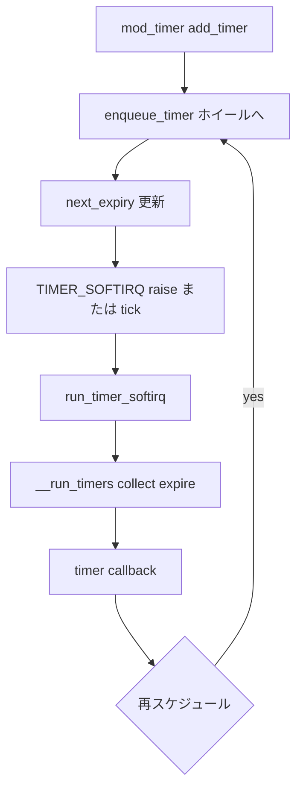

# 第8章 タイマーホイール

> **本章で読むソース**
>
> - [`kernel/time/timer.c` L206-L265](https://github.com/gregkh/linux/blob/v6.18.38/kernel/time/timer.c#L206-L265)
> - [`kernel/time/timer.c` L2343-L2374](https://github.com/gregkh/linux/blob/v6.18.38/kernel/time/timer.c#L2343-L2374)
> - [`kernel/time/timer.c` L2377-L2395](https://github.com/gregkh/linux/blob/v6.18.38/kernel/time/timer.c#L2377-L2395)
> - [`kernel/time/timer.c` L2400-L2410](https://github.com/gregkh/linux/blob/v6.18.38/kernel/time/timer.c#L2400-L2410)
> - [`kernel/time/timer.c` L541-L576](https://github.com/gregkh/linux/blob/v6.18.38/kernel/time/timer.c#L541-L576)
> - [`kernel/time/timer.c` L639-L646](https://github.com/gregkh/linux/blob/v6.18.38/kernel/time/timer.c#L639-L646)
> - [`kernel/time/timer.c` L1766-L1804](https://github.com/gregkh/linux/blob/v6.18.38/kernel/time/timer.c#L1766-L1804)

## この章の狙い

jiffies ベースの **`timer_list`** が **タイマーホイール** に載り、`TIMER_SOFTIRQ` で満了処理される流れを読む。
`timer_base` の `vectors` と `pending_map` が、大量のタイマーを O(1) に近いコストで enqueue する仕組みを押さえる。

## 前提

- [第5章 softirq と tasklet](../part01-deferred/05-softirq-tasklet.md) で `TIMER_SOFTIRQ` と `run_timer_softirq()` を読んでいること。

## timer_base とホイール構造

各 CPU は複数の **timer_base**（LOCAL、GLOBAL、DEF など）を持つ。
`vectors` はホイールのバケット配列、`pending_map` はバケットにタイマーが存在するかを示すビットマップである。

[`kernel/time/timer.c` L206-L265](https://github.com/gregkh/linux/blob/v6.18.38/kernel/time/timer.c#L206-L265)

```c
 * struct timer_base - Per CPU timer base (number of base depends on config)
 * @lock:		Lock protecting the timer_base
 * @running_timer:	When expiring timers, the lock is dropped. To make
 *			sure not to race against deleting/modifying a
 *			currently running timer, the pointer is set to the
 *			timer, which expires at the moment. If no timer is
 *			running, the pointer is NULL.
 * @expiry_lock:	PREEMPT_RT only: Lock is taken in softirq around
 *			timer expiry callback execution and when trying to
 *			delete a running timer and it wasn't successful in
 *			the first glance. It prevents priority inversion
 *			when callback was preempted on a remote CPU and a
 *			caller tries to delete the running timer. It also
 *			prevents a life lock, when the task which tries to
 *			delete a timer preempted the softirq thread which
 *			is running the timer callback function.
 * @timer_waiters:	PREEMPT_RT only: Tells, if there is a waiter
 *			waiting for the end of the timer callback function
 *			execution.
 * @clk:		clock of the timer base; is updated before enqueue
 *			of a timer; during expiry, it is 1 offset ahead of
 *			jiffies to avoid endless requeuing to current
 *			jiffies
 * @next_expiry:	expiry value of the first timer; it is updated when
 *			finding the next timer and during enqueue; the
 *			value is not valid, when next_expiry_recalc is set
 * @cpu:		Number of CPU the timer base belongs to
 * @next_expiry_recalc: States, whether a recalculation of next_expiry is
 *			required. Value is set true, when a timer was
 *			deleted.
 * @is_idle:		Is set, when timer_base is idle. It is triggered by NOHZ
 *			code. This state is only used in standard
 *			base. Deferrable timers, which are enqueued remotely
 *			never wake up an idle CPU. So no matter of supporting it
 *			for this base.
 * @timers_pending:	Is set, when a timer is pending in the base. It is only
 *			reliable when next_expiry_recalc is not set.
 * @pending_map:	bitmap of the timer wheel; each bit reflects a
 *			bucket of the wheel. When a bit is set, at least a
 *			single timer is enqueued in the related bucket.
 * @vectors:		Array of lists; Each array member reflects a bucket
 *			of the timer wheel. The list contains all timers
 *			which are enqueued into a specific bucket.
 */
struct timer_base {
	raw_spinlock_t		lock;
	struct timer_list	*running_timer;
#ifdef CONFIG_PREEMPT_RT
	spinlock_t		expiry_lock;
	atomic_t		timer_waiters;
#endif
	unsigned long		clk;
	unsigned long		next_expiry;
	unsigned int		cpu;
	bool			next_expiry_recalc;
	bool			is_idle;
	bool			timers_pending;
	DECLARE_BITMAP(pending_map, WHEEL_SIZE);
	struct hlist_head	vectors[WHEEL_SIZE];
} ____cacheline_aligned;
```

`clk` は enqueue 前に更新され、満了処理中は jiffies より1進んだ値を使う。
これにより「現在 jiffies へ再 enqueue し続ける」無限ループを防ぐ。

## calc_wheel_index：レベルとバケットの決定

`expires` と `base->clk` の差 `delta` が小さいほど浅いレベル（LVL 0 付近）のバケットへ載る。
`delta` が `WHEEL_TIMEOUT_CUTOFF` を超えると最深レベルへ丸め、ホイール容量を超える timeout を扱う。

[`kernel/time/timer.c` L541-L576](https://github.com/gregkh/linux/blob/v6.18.38/kernel/time/timer.c#L541-L576)

```c
static int calc_wheel_index(unsigned long expires, unsigned long clk,
			    unsigned long *bucket_expiry)
{
	unsigned long delta = expires - clk;
	unsigned int idx;

	if (delta < LVL_START(1)) {
		idx = calc_index(expires, 0, bucket_expiry);
	} else if (delta < LVL_START(2)) {
		idx = calc_index(expires, 1, bucket_expiry);
	} else if (delta < LVL_START(3)) {
		idx = calc_index(expires, 2, bucket_expiry);
	} else if (delta < LVL_START(4)) {
		idx = calc_index(expires, 3, bucket_expiry);
	} else if (delta < LVL_START(5)) {
		idx = calc_index(expires, 4, bucket_expiry);
	} else if (delta < LVL_START(6)) {
		idx = calc_index(expires, 5, bucket_expiry);
	} else if (delta < LVL_START(7)) {
		idx = calc_index(expires, 6, bucket_expiry);
	} else if (LVL_DEPTH > 8 && delta < LVL_START(8)) {
		idx = calc_index(expires, 7, bucket_expiry);
	} else if ((long) delta < 0) {
		idx = clk & LVL_MASK;
		*bucket_expiry = clk;
	} else {
		/*
		 * Force expire obscene large timeouts to expire at the
		 * capacity limit of the wheel.
		 */
		if (delta >= WHEEL_TIMEOUT_CUTOFF)
			expires = clk + WHEEL_TIMEOUT_MAX;

		idx = calc_index(expires, LVL_DEPTH - 1, bucket_expiry);
	}
	return idx;
}
```

## internal_add_timer：enqueue の入口

`mod_timer()` 系は `internal_add_timer()` でインデックスを求め、`enqueue_timer()` へ渡す。
`bucket_expiry` は `next_expiry` 更新の材料になる。

[`kernel/time/timer.c` L639-L646](https://github.com/gregkh/linux/blob/v6.18.38/kernel/time/timer.c#L639-L646)

```c
static void internal_add_timer(struct timer_base *base, struct timer_list *timer)
{
	unsigned long bucket_expiry;
	unsigned int idx;

	idx = calc_wheel_index(timer->expires, base->clk, &bucket_expiry);
	enqueue_timer(base, timer, idx, bucket_expiry);
}
```

## expire_timers：callback 実行

`collect_expired_timers()` が集めたバケットリストに対し、`expire_timers()` が先頭から timer を detach して callback を呼ぶ。
`TIMER_IRQSAFE` 以外は lock 解放中に IRQ を有効化し、削除側との競合を `running_timer` と `timer_sync_wait_running()` で調停する。

[`kernel/time/timer.c` L1766-L1804](https://github.com/gregkh/linux/blob/v6.18.38/kernel/time/timer.c#L1766-L1804)

```c
static void expire_timers(struct timer_base *base, struct hlist_head *head)
{
	/*
	 * This value is required only for tracing. base->clk was
	 * incremented directly before expire_timers was called. But expiry
	 * is related to the old base->clk value.
	 */
	unsigned long baseclk = base->clk - 1;

	while (!hlist_empty(head)) {
		struct timer_list *timer;
		void (*fn)(struct timer_list *);

		timer = hlist_entry(head->first, struct timer_list, entry);

		base->running_timer = timer;
		detach_timer(timer, true);

		fn = timer->function;

		if (WARN_ON_ONCE(!fn)) {
			/* Should never happen. Emphasis on should! */
			base->running_timer = NULL;
			continue;
		}

		if (timer->flags & TIMER_IRQSAFE) {
			raw_spin_unlock(&base->lock);
			call_timer_fn(timer, fn, baseclk);
			raw_spin_lock(&base->lock);
			base->running_timer = NULL;
		} else {
			raw_spin_unlock_irq(&base->lock);
			call_timer_fn(timer, fn, baseclk);
			raw_spin_lock_irq(&base->lock);
			base->running_timer = NULL;
			timer_sync_wait_running(base);
		}
	}
}
```

## __run_timers：満了タイマーの収集と実行

`__run_timers()` は `jiffies` が `base->clk` に追いつく間、`collect_expired_timers()` で満了バケットを集め、`expire_timers()` で callback を呼ぶ。

[`kernel/time/timer.c` L2343-L2374](https://github.com/gregkh/linux/blob/v6.18.38/kernel/time/timer.c#L2343-L2374)

```c
static inline void __run_timers(struct timer_base *base)
{
	struct hlist_head heads[LVL_DEPTH];
	int levels;

	lockdep_assert_held(&base->lock);

	if (base->running_timer)
		return;

	while (time_after_eq(jiffies, base->clk) &&
	       time_after_eq(jiffies, base->next_expiry)) {
		levels = collect_expired_timers(base, heads);
		/*
		 * The two possible reasons for not finding any expired
		 * timer at this clk are that all matching timers have been
		 * dequeued or no timer has been queued since
		 * base::next_expiry was set to base::clk +
		 * TIMER_NEXT_MAX_DELTA.
		 */
		WARN_ON_ONCE(!levels && !base->next_expiry_recalc
			     && base->timers_pending);
		/*
		 * While executing timers, base->clk is set 1 offset ahead of
		 * jiffies to avoid endless requeuing to current jiffies.
		 */
		base->clk++;
		timer_recalc_next_expiry(base);

		while (levels--)
			expire_timers(base, heads + levels);
	}
```

`running_timer` が非 NULL のときは再入を避けるため早期 return する。

## softirq からの起動

`__run_timer_base()` は `next_expiry` を確認して lock を取り、`__run_timers()` を呼ぶ。
`run_timer_softirq()` は LOCAL と NO_HZ 用の GLOBAL、DEF ベースを順に処理する。

[`kernel/time/timer.c` L2377-L2395](https://github.com/gregkh/linux/blob/v6.18.38/kernel/time/timer.c#L2377-L2395)

```c
static void __run_timer_base(struct timer_base *base)
{
	/* Can race against a remote CPU updating next_expiry under the lock */
	if (time_before(jiffies, READ_ONCE(base->next_expiry)))
		return;

	timer_base_lock_expiry(base);
	raw_spin_lock_irq(&base->lock);
	__run_timers(base);
	raw_spin_unlock_irq(&base->lock);
	timer_base_unlock_expiry(base);
}

static void run_timer_base(int index)
{
	struct timer_base *base = this_cpu_ptr(&timer_bases[index]);

	__run_timer_base(base);
}
```

[`kernel/time/timer.c` L2400-L2410](https://github.com/gregkh/linux/blob/v6.18.38/kernel/time/timer.c#L2400-L2410)

```c
static __latent_entropy void run_timer_softirq(void)
{
	run_timer_base(BASE_LOCAL);
	if (IS_ENABLED(CONFIG_NO_HZ_COMMON)) {
		run_timer_base(BASE_GLOBAL);
		run_timer_base(BASE_DEF);

		if (is_timers_nohz_active())
			tmigr_handle_remote();
	}
}
```

**最適化の工夫**：多段ホイールは満了が近いタイマーを浅いレベルに、遠いタイマーを深いレベルに置く。
tick や softirq は `next_expiry` だけを見て早期 return でき、idle CPU ではタイマー処理自体をスキップできる（第16章）。

## 処理の流れ：mod_timer から callback まで



## まとめ

- **timer_base** のホイールは `vectors` と `pending_map` で jiffies 満了を管理する。
- `__run_timers()` は `clk` を進めながら満了バケットを収集し callback を実行する。
- NO_HZ 時は GLOBAL と DEF ベースの処理とリモート移譲が加わる。
- 高精度要求は hrtimer へ委譲される（第9章）。

## 関連する章

- [第5章 softirq と tasklet](../part01-deferred/05-softirq-tasklet.md)
- [第9章 hrtimer](../part02-timer/09-hrtimer.md)
- [第16章 NO_HZ](../part03-tick/16-no-hz.md)
