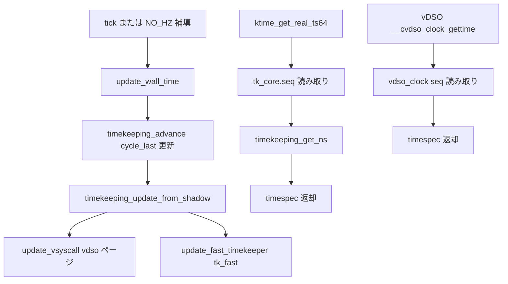

# 第10章 timekeeping

> **本章で読むソース**
>
> - [`kernel/time/timekeeping.c` L95-L107](https://github.com/gregkh/linux/blob/v6.18.38/kernel/time/timekeeping.c#L95-L107)
> - [`kernel/time/timekeeping.c` L402-L418](https://github.com/gregkh/linux/blob/v6.18.38/kernel/time/timekeeping.c#L402-L418)
> - [`kernel/time/timekeeping.c` L793-L811](https://github.com/gregkh/linux/blob/v6.18.38/kernel/time/timekeeping.c#L793-L811)
> - [`kernel/time/timekeeping.c` L814-L831](https://github.com/gregkh/linux/blob/v6.18.38/kernel/time/timekeeping.c#L814-L831)
> - [`kernel/time/timekeeping.c` L2375-L2384](https://github.com/gregkh/linux/blob/v6.18.38/kernel/time/timekeeping.c#L2375-L2384)
> - [`kernel/time/timekeeping.c` L2307-L2365](https://github.com/gregkh/linux/blob/v6.18.38/kernel/time/timekeeping.c#L2307-L2365)
> - [`kernel/time/timekeeping.c` L708-L740](https://github.com/gregkh/linux/blob/v6.18.38/kernel/time/timekeeping.c#L708-L740)

## この章の狙い

**timekeeper** が clocksource 読み取り値から wall time と monotonic time を維持し、カーネル API と vDSO へ提供する流れを読む。
seqcount による読み取り側の無ロックパスと、`update_wall_time()` による tick 更新を追う。

## 前提

- [第9章 clocksource と clockevents](09-clocksource-clockevents.md) で clocksource 選択と `timekeeping_notify()` を読んでいること。

## timekeeper と tk_read_base

`struct timekeeper` は monotonic 用の `tkr_mono`、raw 用の `tkr_raw` などを保持する。
高速読み取り用の `tk_fast` は `tk_read_base` を2スロット持ち、更新側が flip する。

[`kernel/time/timekeeping.c` L95-L107](https://github.com/gregkh/linux/blob/v6.18.38/kernel/time/timekeeping.c#L95-L107)

```c
/**
 * struct tk_fast - NMI safe timekeeper
 * @seq:	Sequence counter for protecting updates. The lowest bit
 *		is the index for the tk_read_base array
 * @base:	tk_read_base array. Access is indexed by the lowest bit of
 *		@seq.
 *
 * See @update_fast_timekeeper() below.
 */
struct tk_fast {
	seqcount_latch_t	seq;
	struct tk_read_base	base[2];
};
```

## ナノ秒への変換：timekeeping_get_ns

読み取り時は clocksource から cycle を読み、最後の `update_wall_time()` 以降の delta をナノ秒化して base に加算する。

[`kernel/time/timekeeping.c` L402-L418](https://github.com/gregkh/linux/blob/v6.18.38/kernel/time/timekeeping.c#L402-L418)

```c
static __always_inline u64 timekeeping_get_ns(const struct tk_read_base *tkr)
{
	return timekeeping_cycles_to_ns(tkr, tk_clock_read(tkr));
}

/**
 * update_fast_timekeeper - Update the fast and NMI safe monotonic timekeeper.
 * @tkr: Timekeeping readout base from which we take the update
 * @tkf: Pointer to NMI safe timekeeper
 *
 * We want to use this from any context including NMI and tracing /
 * instrumenting the timekeeping code itself.
 *
 * Employ the latch technique; see @write_seqcount_latch.
 *
 * So if a NMI hits the update of base[0] then it will use base[1]
 * which is still consistent. In the worst case this can result is a
```

`mask` は wrap するカウンタの桁数を表し、delta 計算で underflow を防ぐ。

## ktime_get_real_ts64：wall time の読み取り

REALTIME は `xtime_sec` と monotonic 側 delta の組み合わせである。
`tk_core.seq` の seqcount で更新と読み取りを直列化する。

[`kernel/time/timekeeping.c` L793-L811](https://github.com/gregkh/linux/blob/v6.18.38/kernel/time/timekeeping.c#L793-L811)

```c
void ktime_get_real_ts64(struct timespec64 *ts)
{
	struct timekeeper *tk = &tk_core.timekeeper;
	unsigned int seq;
	u64 nsecs;

	WARN_ON(timekeeping_suspended);

	do {
		seq = read_seqcount_begin(&tk_core.seq);

		ts->tv_sec = tk->xtime_sec;
		nsecs = timekeeping_get_ns(&tk->tkr_mono);

	} while (read_seqcount_retry(&tk_core.seq, seq));

	ts->tv_nsec = 0;
	timespec64_add_ns(ts, nsecs);
}
```

`CLOCK_MONOTONIC` 向けの `ktime_get()` も同様の seqcount ループである。

[`kernel/time/timekeeping.c` L814-L831](https://github.com/gregkh/linux/blob/v6.18.38/kernel/time/timekeeping.c#L814-L831)

```c
ktime_t ktime_get(void)
{
	struct timekeeper *tk = &tk_core.timekeeper;
	unsigned int seq;
	ktime_t base;
	u64 nsecs;

	WARN_ON(timekeeping_suspended);

	do {
		seq = read_seqcount_begin(&tk_core.seq);
		base = tk->tkr_mono.base;
		nsecs = timekeeping_get_ns(&tk->tkr_mono);

	} while (read_seqcount_retry(&tk_core.seq, seq));

	return ktime_add_ns(base, nsecs);
}
```

**最適化の工夫**：`ktime_get_mono_fast_ns()` 等は `tk_fast` の seqcount と cycle 読み取りだけで NMI 安全な fast path を提供する（同ファイル内）。
vDSO はこの fast path と同型のデータをユーザー空間へ公開する（第14章）。

## update_wall_time：tick からの更新

周期 tick または NO_HZ の補填処理から `update_wall_time()` が呼ばれ、clocksource に基づき wall time を進める。

[`kernel/time/timekeeping.c` L2375-L2384](https://github.com/gregkh/linux/blob/v6.18.38/kernel/time/timekeeping.c#L2375-L2384)

```c
 * update_wall_time - Uses the current clocksource to increment the wall time
 *
 * It also updates the enabled auxiliary clock timekeepers
 */
void update_wall_time(void)
{
	if (timekeeping_advance(TK_ADV_TICK))
		clock_was_set_delayed();
	tk_aux_advance();
}
```

`timekeeping_advance()` 内で NTP 調整、suspend 中の扱い、auxiliary clock 更新が行われる。

## __timekeeping_advance：cycle 差分の取り込み

`update_wall_time()` は `timekeeping_advance(TK_ADV_TICK)` を呼び、shadow timekeeper 上で clocksource の cycle 差分を取り込む。
NO_HZ では複数 tick 分を `logarithmic_accumulation()` でまとめて進め、NTP 調整後に shadow から本番 timekeeper へ反映する。

[`kernel/time/timekeeping.c` L2307-L2365](https://github.com/gregkh/linux/blob/v6.18.38/kernel/time/timekeeping.c#L2307-L2365)

```c
static bool __timekeeping_advance(struct tk_data *tkd, enum timekeeping_adv_mode mode)
{
	struct timekeeper *tk = &tkd->shadow_timekeeper;
	struct timekeeper *real_tk = &tkd->timekeeper;
	unsigned int clock_set = 0;
	int shift = 0, maxshift;
	u64 offset, orig_offset;

	/* Make sure we're fully resumed: */
	if (unlikely(timekeeping_suspended))
		return false;

	offset = clocksource_delta(tk_clock_read(&tk->tkr_mono),
				   tk->tkr_mono.cycle_last, tk->tkr_mono.mask,
				   tk->tkr_mono.clock->max_raw_delta);
	orig_offset = offset;
	/* Check if there's really nothing to do */
	if (offset < real_tk->cycle_interval && mode == TK_ADV_TICK)
		return false;

	/*
	 * With NO_HZ we may have to accumulate many cycle_intervals
	 * (think "ticks") worth of time at once. To do this efficiently,
	 * we calculate the largest doubling multiple of cycle_intervals
	 * that is smaller than the offset.  We then accumulate that
	 * chunk in one go, and then try to consume the next smaller
	 * doubled multiple.
	 */
	shift = ilog2(offset) - ilog2(tk->cycle_interval);
	shift = max(0, shift);
	/* Bound shift to one less than what overflows tick_length */
	maxshift = (64 - (ilog2(ntp_tick_length(tk->id)) + 1)) - 1;
	shift = min(shift, maxshift);
	while (offset >= tk->cycle_interval) {
		offset = logarithmic_accumulation(tk, offset, shift, &clock_set);
		if (offset < tk->cycle_interval<<shift)
			shift--;
	}

	/* Adjust the multiplier to correct NTP error */
	timekeeping_adjust(tk, offset);

	/*
	 * Finally, make sure that after the rounding
	 * xtime_nsec isn't larger than NSEC_PER_SEC
	 */
	clock_set |= accumulate_nsecs_to_secs(tk);

	/*
	 * To avoid inconsistencies caused adjtimex TK_ADV_FREQ calls
	 * making small negative adjustments to the base xtime_nsec
	 * value, only update the coarse clocks if we accumulated time
	 */
	if (orig_offset != offset)
		tk_update_coarse_nsecs(tk);

	timekeeping_update_from_shadow(tkd, clock_set);

	return !!clock_set;
}
```

## timekeeping_update_from_shadow：vDSO と tk_fast 更新

shadow から本番 timekeeper へコピーする前に seqcount で読者をブロックし、vDSO ページと `tk_fast` を同一更新境界で揃える。

[`kernel/time/timekeeping.c` L708-L740](https://github.com/gregkh/linux/blob/v6.18.38/kernel/time/timekeeping.c#L708-L740)

```c
static void timekeeping_update_from_shadow(struct tk_data *tkd, unsigned int action)
{
	struct timekeeper *tk = &tkd->shadow_timekeeper;

	lockdep_assert_held(&tkd->lock);

	/*
	 * Block out readers before running the updates below because that
	 * updates VDSO and other time related infrastructure. Not blocking
	 * the readers might let a reader see time going backwards when
	 * reading from the VDSO after the VDSO update and then reading in
	 * the kernel from the timekeeper before that got updated.
	 */
	write_seqcount_begin(&tkd->seq);

	if (action & TK_CLEAR_NTP) {
		tk->ntp_error = 0;
		ntp_clear(tk->id);
	}

	tk_update_leap_state(tk);
	tk_update_ktime_data(tk);
	tk->tkr_mono.base_real = tk->tkr_mono.base + tk->offs_real;

	if (tk->id == TIMEKEEPER_CORE) {
		update_vsyscall(tk);
		update_pvclock_gtod(tk, action & TK_CLOCK_WAS_SET);

		update_fast_timekeeper(&tk->tkr_mono, &tk_fast_mono);
		update_fast_timekeeper(&tk->tkr_raw,  &tk_fast_raw);
	} else if (tk_is_aux(tk)) {
		vdso_time_update_aux(tk);
	}
```

## 処理の流れ：tick から gettimeofday まで



## まとめ

- **timekeeper** が clocksource 読み取りと base 時刻を組み合わせ、monotonic と REALTIME を提供する。
- 読み取り API は seqcount で更新と競合しないようリトライする。
- `update_wall_time()` が tick 境界で wall time を進め、`update_vsyscall()` と `update_fast_timekeeper()` で vDSO ページと `tk_fast` を別々に更新する。
- clocksource 切り替え時は `timekeeping_notify()` が cycle 連続性を保つ。

## 関連する章

- [第9章 clocksource と clockevents](09-clocksource-clockevents.md)
- [第11章 tick デバイスと周期 tick](../part03-tick/11-tick-device.md)
- [第14章 ユーザー空間への時刻提供](../part04-ipc-time/14-userspace-time-vdso.md)
