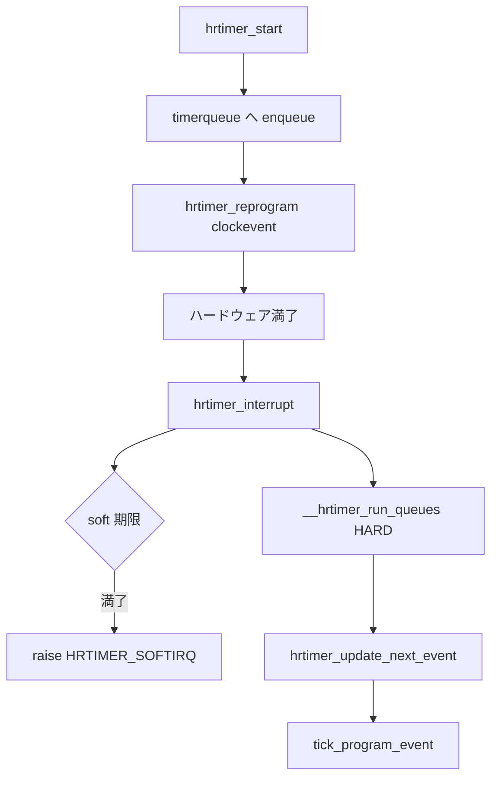

# 第11章 hrtimer

> **本章で読むソース**
>
> - [`kernel/time/hrtimer.c` L1814-L1850](https://github.com/gregkh/linux/blob/v6.18.38/kernel/time/hrtimer.c#L1814-L1850)
> - [`kernel/time/hrtimer.c` L1853-L1869](https://github.com/gregkh/linux/blob/v6.18.38/kernel/time/hrtimer.c#L1853-L1869)
> - [`kernel/time/hrtimer.c` L1878-L1924](https://github.com/gregkh/linux/blob/v6.18.38/kernel/time/hrtimer.c#L1878-L1924)
> - [`kernel/time/hrtimer.c` L1071-L1083](https://github.com/gregkh/linux/blob/v6.18.38/kernel/time/hrtimer.c#L1071-L1083)
> - [`kernel/time/hrtimer.c` L1204-L1264](https://github.com/gregkh/linux/blob/v6.18.38/kernel/time/hrtimer.c#L1204-L1264)
> - [`kernel/time/hrtimer.c` L589-L617](https://github.com/gregkh/linux/blob/v6.18.38/kernel/time/hrtimer.c#L589-L617)

## この章の狙い

ナノ秒精度の **hrtimer** が per-CPU の **timerqueue** で管理され、クロックイベントデバイスと連動して満了する流れを読む。
`hrtimer_interrupt()` が hard 側と soft 側のキューをどう処理し、次のイベント時刻を `tick_program_event()` へ渡すかを追う。

## 前提

- [第10章 タイマーホイール](10-timer-wheel.md) で jiffies ベースの `timer_list` を読んでいること。
- [第12章 clocksource と clockevents](12-clocksource-clockevents.md) で `clock_event_device` の役割を先読みしてもよい。

## enqueue_hrtimer：timerqueue への挿入

`__hrtimer_start_range_ns()` は既存タイマーを remove したあと、`enqueue_hrtimer()` で BST（timerqueue）へ O(log n) 挿入する。
挿入結果が leftmost なら clockevent の再 program 対象になる。

[`kernel/time/hrtimer.c` L1071-L1083](https://github.com/gregkh/linux/blob/v6.18.38/kernel/time/hrtimer.c#L1071-L1083)

```c
static bool enqueue_hrtimer(struct hrtimer *timer, struct hrtimer_clock_base *base,
			    enum hrtimer_mode mode, bool was_armed)
{
	debug_activate(timer, mode, was_armed);
	WARN_ON_ONCE(!base->cpu_base->online);

	base->cpu_base->active_bases |= 1 << base->index;

	/* Pairs with the lockless read in hrtimer_is_queued() */
	WRITE_ONCE(timer->state, HRTIMER_STATE_ENQUEUED);

	return timerqueue_add(&base->active, &timer->node);
}
```

## __hrtimer_start_range_ns：start の本体

相対モードでは `__hrtimer_cb_get_time()` を加算し、`switch_hrtimer_base()` で CPU 間移動を処理する。
同一 CPU で leftmost だった場合は remove 時の reprogram を省略し、enqueue 後にまとめて program する（`force_local`）。

[`kernel/time/hrtimer.c` L1204-L1264](https://github.com/gregkh/linux/blob/v6.18.38/kernel/time/hrtimer.c#L1204-L1264)

```c
static int __hrtimer_start_range_ns(struct hrtimer *timer, ktime_t tim,
				    u64 delta_ns, const enum hrtimer_mode mode,
				    struct hrtimer_clock_base *base)
{
	struct hrtimer_cpu_base *this_cpu_base = this_cpu_ptr(&hrtimer_bases);
	struct hrtimer_clock_base *new_base;
	bool force_local, first, was_armed;

	/*
	 * If the timer is on the local cpu base and is the first expiring
	 * timer then this might end up reprogramming the hardware twice
	 * (on removal and on enqueue). To avoid that prevent the reprogram
	 * on removal, keep the timer local to the current CPU and enforce
	 * reprogramming after it is queued no matter whether it is the new
	 * first expiring timer again or not.
	 */
	force_local = base->cpu_base == this_cpu_base;
	force_local &= base->cpu_base->next_timer == timer;

	/*
	 * Don't force local queuing if this enqueue happens on a unplugged
	 * CPU after hrtimer_cpu_dying() has been invoked.
	 */
	force_local &= this_cpu_base->online;

	/*
	 * Remove an active timer from the queue. In case it is not queued
	 * on the current CPU, make sure that remove_hrtimer() updates the
	 * remote data correctly.
	 *
	 * If it's on the current CPU and the first expiring timer, then
	 * skip reprogramming, keep the timer local and enforce
	 * reprogramming later if it was the first expiring timer.  This
	 * avoids programming the underlying clock event twice (once at
	 * removal and once after enqueue).
	 */
	was_armed = remove_hrtimer(timer, base, true, force_local);

	if (mode & HRTIMER_MODE_REL)
		tim = ktime_add_safe(tim, __hrtimer_cb_get_time(base->clockid));

	tim = hrtimer_update_lowres(timer, tim, mode);

	hrtimer_set_expires_range_ns(timer, tim, delta_ns);

	/* Switch the timer base, if necessary: */
	if (!force_local) {
		new_base = switch_hrtimer_base(timer, base,
					       mode & HRTIMER_MODE_PINNED);
	} else {
		new_base = base;
	}

	first = enqueue_hrtimer(timer, new_base, mode, was_armed);

	/*
	 * If the hrtimer interrupt is running, then it will reevaluate the
	 * clock bases and reprogram the clock event device.
	 */
	if (new_base->cpu_base->in_hrtirq)
		return false;
```

## __hrtimer_run_queues：BST からの満了処理

各 CPU の `hrtimer_cpu_base` は複数の **hrtimer_clock_base**（MONOTONIC、REALTIME 等）を持つ。
`__hrtimer_run_queues()` は active な base ごとに timerqueue の先頭から、`softexpires` を過ぎた hrtimer を `__run_hrtimer()` する。

[`kernel/time/hrtimer.c` L1814-L1850](https://github.com/gregkh/linux/blob/v6.18.38/kernel/time/hrtimer.c#L1814-L1850)

```c
static void __hrtimer_run_queues(struct hrtimer_cpu_base *cpu_base, ktime_t now,
				 unsigned long flags, unsigned int active_mask)
{
	struct hrtimer_clock_base *base;
	unsigned int active = cpu_base->active_bases & active_mask;

	for_each_active_base(base, cpu_base, active) {
		struct timerqueue_node *node;
		ktime_t basenow;

		basenow = ktime_add(now, base->offset);

		while ((node = timerqueue_getnext(&base->active))) {
			struct hrtimer *timer;

			timer = container_of(node, struct hrtimer, node);

			/*
			 * The immediate goal for using the softexpires is
			 * minimizing wakeups, not running timers at the
			 * earliest interrupt after their soft expiration.
			 * This allows us to avoid using a Priority Search
			 * Tree, which can answer a stabbing query for
			 * overlapping intervals and instead use the simple
			 * BST we already have.
			 * We don't add extra wakeups by delaying timers that
			 * are right-of a not yet expired timer, because that
			 * timer will have to trigger a wakeup anyway.
			 */
			if (basenow < hrtimer_get_softexpires_tv64(timer))
				break;

			__run_hrtimer(cpu_base, base, timer, &basenow, flags);
			if (active_mask == HRTIMER_ACTIVE_SOFT)
				hrtimer_sync_wait_running(cpu_base, flags);
		}
	}
```

**softexpires** は wake-up 回数を減らすための猶予であり、最早満了を厳密に求める PST より単純な BST で済ませる設計判断である。

## HRTIMER_SOFTIRQ：hardirq から分離された soft 側

`HRTIMER_ACTIVE_SOFT` マスク付きで走る `hrtimer_run_softirq()` は、`hrtimer_interrupt()` から raise された **softirq コンテキスト**で callback を実行する。
process コンテキストではなく、一般に **スリープ不可**（mutex 取得や blocking I/O 不可）である点に注意する。

[`kernel/time/hrtimer.c` L1853-L1869](https://github.com/gregkh/linux/blob/v6.18.38/kernel/time/hrtimer.c#L1853-L1869)

```c
static __latent_entropy void hrtimer_run_softirq(void)
{
	struct hrtimer_cpu_base *cpu_base = this_cpu_ptr(&hrtimer_bases);
	unsigned long flags;
	ktime_t now;

	hrtimer_cpu_base_lock_expiry(cpu_base);
	raw_spin_lock_irqsave(&cpu_base->lock, flags);

	now = hrtimer_update_base(cpu_base);
	__hrtimer_run_queues(cpu_base, now, flags, HRTIMER_ACTIVE_SOFT);

	cpu_base->softirq_activated = 0;
	hrtimer_update_softirq_timer(cpu_base, true);

	raw_spin_unlock_irqrestore(&cpu_base->lock, flags);
	hrtimer_cpu_base_unlock_expiry(cpu_base);
```

## hrtimer_interrupt：クロックイベントとの接続

`CONFIG_HIGH_RES_TIMERS` 有効時、クロックイベントの handler から `hrtimer_interrupt()` が呼ばれる。
hard キューを処理したあと `hrtimer_update_next_event()` で次の満了時刻を求め、`tick_program_event()` でハードウェアタイマーを再プログラムする。

[`kernel/time/hrtimer.c` L1878-L1924](https://github.com/gregkh/linux/blob/v6.18.38/kernel/time/hrtimer.c#L1878-L1924)

```c
void hrtimer_interrupt(struct clock_event_device *dev)
{
	struct hrtimer_cpu_base *cpu_base = this_cpu_ptr(&hrtimer_bases);
	ktime_t expires_next, now, entry_time, delta;
	unsigned long flags;
	int retries = 0;

	BUG_ON(!cpu_base->hres_active);
	cpu_base->nr_events++;
	dev->next_event = KTIME_MAX;

	raw_spin_lock_irqsave(&cpu_base->lock, flags);
	entry_time = now = hrtimer_update_base(cpu_base);
retry:
	cpu_base->in_hrtirq = 1;
	/*
	 * We set expires_next to KTIME_MAX here with cpu_base->lock
	 * held to prevent that a timer is enqueued in our queue via
	 * the migration code. This does not affect enqueueing of
	 * timers which run their callback and need to be requeued on
	 * this CPU.
	 */
	cpu_base->expires_next = KTIME_MAX;

	if (!ktime_before(now, cpu_base->softirq_expires_next)) {
		cpu_base->softirq_expires_next = KTIME_MAX;
		cpu_base->softirq_activated = 1;
		raise_timer_softirq(HRTIMER_SOFTIRQ);
	}

	__hrtimer_run_queues(cpu_base, now, flags, HRTIMER_ACTIVE_HARD);

	/* Reevaluate the clock bases for the [soft] next expiry */
	expires_next = hrtimer_update_next_event(cpu_base);
	/*
	 * Store the new expiry value so the migration code can verify
	 * against it.
	 */
	cpu_base->expires_next = expires_next;
	cpu_base->in_hrtirq = 0;
	raw_spin_unlock_irqrestore(&cpu_base->lock, flags);

	/* Reprogramming necessary ? */
	if (!tick_program_event(expires_next, 0)) {
		cpu_base->hang_detected = 0;
		return;
	}
```

callback が長引いて次イベントを取りこぼした場合は retry ループがあり、3回失敗すると意図的に delta だけ先へずらしてループを断つ（以降のコード）。

## hrtimer_update_next_event：次の満了時刻

hard キューと soft キューの最早満了を比較し、soft が先なら `cpu_base->next_timer` を soft 側へ切り替える。
`softirq_activated` が立っている間は soft base を読み飛ばし、すでに raise した softirq に任せる。

[`kernel/time/hrtimer.c` L589-L617](https://github.com/gregkh/linux/blob/v6.18.38/kernel/time/hrtimer.c#L589-L617)

```c
static ktime_t hrtimer_update_next_event(struct hrtimer_cpu_base *cpu_base)
{
	ktime_t expires_next, soft = KTIME_MAX;

	/*
	 * If the soft interrupt has already been activated, ignore the
	 * soft bases. They will be handled in the already raised soft
	 * interrupt.
	 */
	if (!cpu_base->softirq_activated) {
		soft = __hrtimer_get_next_event(cpu_base, HRTIMER_ACTIVE_SOFT);
		/*
		 * Update the soft expiry time. clock_settime() might have
		 * affected it.
		 */
		cpu_base->softirq_expires_next = soft;
	}

	expires_next = __hrtimer_get_next_event(cpu_base, HRTIMER_ACTIVE_HARD);
	/*
	 * If a softirq timer is expiring first, update cpu_base->next_timer
	 * and program the hardware with the soft expiry time.
	 */
	if (expires_next > soft) {
		cpu_base->next_timer = cpu_base->softirq_next_timer;
		expires_next = soft;
	}

	return expires_next;
}
```

**最適化の工夫**：hrtimer は tick 粒度（jiffies）に縛られず、次の満了時刻だけを clockevent にプログラムする。
NO_HZ やスケジューラの `schedule_hrtimeout()` が、不要な周期 tick を止めた状態でもタイマー精度を保てる。

## 処理の流れ：hrtimer_start から interrupt まで



## まとめ

- hrtimer は per-CPU の timerqueue（BST）でナノ秒精度の満了を管理する。
- softexpires により wake-up 回数を抑えつつ、実装を BST に留める。
- `hrtimer_interrupt()` が hard キューを処理し、次イベントを clockevent へ反映する。
- soft 側 callback は `HRTIMER_SOFTIRQ`（softirq コンテキスト、スリープ不可）で実行される。

> **7.x 系での変化**
> v7.1.3 では hrtimer の queued 状態管理と timerqueue が [`timerqueue_linked_*`](https://github.com/gregkh/linux/blob/v7.1.3/kernel/time/hrtimer.c#L1115-L1118) へ移行し、enqueue/remove/start/reprogram と CPU 間 migration が再編されている。
> 通常の `hrtimer_reprogram()` は [`L893-L895`](https://github.com/gregkh/linux/blob/v7.1.3/kernel/time/hrtimer.c#L893-L895) で `cpu_base->deferred_rearm` 中は clockevent 再 program を省略する。
> [`CONFIG_HRTIMER_REARM_DEFERRED`](https://github.com/gregkh/linux/blob/v7.1.3/kernel/time/Kconfig#L58-L61) が有効な場合、`hrtimer_interrupt()` は [`L2098`](https://github.com/gregkh/linux/blob/v7.1.3/kernel/time/hrtimer.c#L2098) で `deferred_rearm` を立て、満了処理後 [`L2138`](https://github.com/gregkh/linux/blob/v7.1.3/kernel/time/hrtimer.c#L2138) の `hrtimer_interrupt_rearm()` が `TIF_HRTIMER_REARM` をセットする（[`L2063-L2070`](https://github.com/gregkh/linux/blob/v7.1.3/kernel/time/hrtimer.c#L2063-L2070)）。
> 同 config が無効な場合の `hrtimer_interrupt_rearm()` は [`L2072-L2075`](https://github.com/gregkh/linux/blob/v7.1.3/kernel/time/hrtimer.c#L2072-L2075) で `hrtimer_rearm()` を直ちに呼び、即時に再 program する。
> 実際の program は [`__hrtimer_rearm_deferred()`](https://github.com/gregkh/linux/blob/v7.1.3/kernel/time/hrtimer.c#L2043-L2059) から `hrtimer_rearm()`（[`L2026-L2039`](https://github.com/gregkh/linux/blob/v7.1.3/kernel/time/hrtimer.c#L2026-L2039)）経由で行われ、[`hrtimer_rearm_event()`](https://github.com/gregkh/linux/blob/v7.1.3/kernel/time/hrtimer.c#L704-L707) は deferred 引数を trace へ渡したうえで `tick_program_event()` を呼ぶ。

## 関連する章

- [第10章 タイマーホイール](10-timer-wheel.md)
- [第12章 clocksource と clockevents](12-clocksource-clockevents.md)
- [第16章 tick デバイスと周期 tick](../part03-tick/16-tick-device.md)
