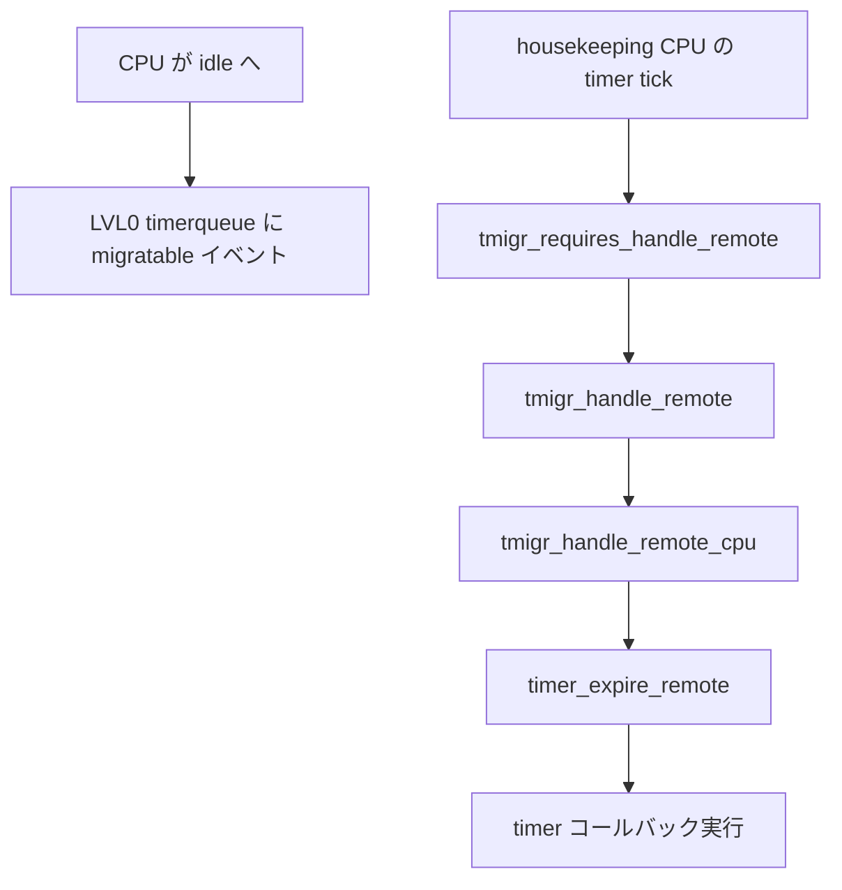

# 第11章 timer migration

> **本章で読むソース**
>
> - [`kernel/time/timer_migration.c` L20-L63](https://github.com/gregkh/linux/blob/v6.18.38/kernel/time/timer_migration.c#L20-L63)
> - [`kernel/time/timer_migration.c` L698-L712](https://github.com/gregkh/linux/blob/v6.18.38/kernel/time/timer_migration.c#L698-L712)
> - [`kernel/time/timer_migration.c` L887-L907](https://github.com/gregkh/linux/blob/v6.18.38/kernel/time/timer_migration.c#L887-L907)
> - [`kernel/time/timer_migration.c` L909-L1010](https://github.com/gregkh/linux/blob/v6.18.38/kernel/time/timer_migration.c#L909-L1010)
> - [`kernel/time/timer.c` L2127-L2137](https://github.com/gregkh/linux/blob/v6.18.38/kernel/time/timer.c#L2127-L2137)
> - [`kernel/time/timer_migration.c` L1166-L1193](https://github.com/gregkh/linux/blob/v6.18.38/kernel/time/timer_migration.c#L1166-L1193)
> - [`kernel/time/timer_migration.c` L1331-L1348](https://github.com/gregkh/linux/blob/v6.18.38/kernel/time/timer_migration.c#L1331-L1348)
> - [`kernel/time/timer_migration.c` L1808-L1819](https://github.com/gregkh/linux/blob/v6.18.38/kernel/time/timer_migration.c#L1808-L1819)

## この章の狙い

**timer migration** は idle CPU を起こさず、housekeeping 側 CPU がリモートの migratable タイマーを処理する階層機構である。
`tmigr_group` の timerqueue と migrator 役割の委譲を読み、[第8章 タイマーホイール](../part02-timer/08-timer-wheel.md) の per-CPU `timer_base` と NO_HZ idle 経路との接続を押さえる。

## 前提

- [第8章 タイマーホイール](../part02-timer/08-timer-wheel.md) で `timer_base` と `run_timer_softirq()` を読んでいること。
- [第15章 NO_HZ](../part03-tick/15-no-hz.md) で idle CPU が local clockevent を止める流れを先読みしてもよい。

## 階層グループと migrator

ファイル先頭のコメントが設計全体を述べる。
LVL0 グループは CPU、上位レベルは CPU グループのグループであり、ノード境界を意識して lock contention を抑える。
各グループは満了時刻順の timerqueue を持ち、**migrator** が1つだけリモートタイマーの引き取りを担当する。

[`kernel/time/timer_migration.c` L20-L63](https://github.com/gregkh/linux/blob/v6.18.38/kernel/time/timer_migration.c#L20-L63)

```c
/*
 * The timer migration mechanism is built on a hierarchy of groups. The
 * lowest level group contains CPUs, the next level groups of CPU groups
 * and so forth. The CPU groups are kept per node so for the normal case
 * lock contention won't happen across nodes. Depending on the number of
 * CPUs per node even the next level might be kept as groups of CPU groups
 * per node and only the levels above cross the node topology.
 *
 * Example topology for a two node system with 24 CPUs each.
 *
 * LVL 2                           [GRP2:0]
 *                              GRP1:0 = GRP1:M
 *
 * LVL 1            [GRP1:0]                      [GRP1:1]
 *               GRP0:0 - GRP0:2               GRP0:3 - GRP0:5
 *
 * LVL 0  [GRP0:0]  [GRP0:1]  [GRP0:2]  [GRP0:3]  [GRP0:4]  [GRP0:5]
 * CPUS     0-7       8-15      16-23     24-31     32-39     40-47
 *
 * The groups hold a timer queue of events sorted by expiry time. These
 * queues are updated when CPUs go in idle. When they come out of idle
 * ignore flag of events is set.
 *
 * Each group has a designated migrator CPU/group as long as a CPU/group is
 * active in the group. This designated role is necessary to avoid that all
 * active CPUs in a group try to migrate expired timers from other CPUs,
 * which would result in massive lock bouncing.
 *
 * When a CPU is awake, it checks in it's own timer tick the group
 * hierarchy up to the point where it is assigned the migrator role or if
 * no CPU is active, it also checks the groups where no migrator is set
 * (TMIGR_NONE).
 *
 * If it finds expired timers in one of the group queues it pulls them over
 * from the idle CPU and runs the timer function. After that it updates the
 * group and the parent groups if required.
 *
 * CPUs which go idle arm their CPU local timer hardware for the next local
 * (pinned) timer event. If the next migratable timer expires after the
 * next local timer or the CPU has no migratable timer pending then the
 * CPU does not queue an event in the LVL0 group. If the next migratable
 * timer expires before the next local timer then the CPU queues that timer
 * in the LVL0 group. In both cases the CPU marks itself idle in the LVL0
 * group.
```

idle へ入る CPU は pinned タイマーだけ local hardware で arm し、migratable タイマーがそれより早ければ LVL0 キューへイベントを載せる。
active CPU は自分が migrator の階層だけを走査し、満了イベントを idle CPU から引き取ってコールバックを実行する。

## CPU の active と deactivate

`tmigr_cpu_activate` は CPU online 時にグループへ再参加させ、migrator 委譲を親へ伝播する入口である。

[`kernel/time/timer_migration.c` L698-L712](https://github.com/gregkh/linux/blob/v6.18.38/kernel/time/timer_migration.c#L698-L712)

```c
void tmigr_cpu_activate(void)
{
	struct tmigr_cpu *tmc = this_cpu_ptr(&tmigr_cpu);

	if (tmigr_is_not_available(tmc))
		return;

	if (WARN_ON_ONCE(!tmc->idle))
		return;

	raw_spin_lock(&tmc->lock);
	tmc->idle = false;
	__tmigr_cpu_activate(tmc);
	raw_spin_unlock(&tmc->lock);
}
```

逆に idle 遷移では `__tmigr_cpu_deactivate` がグループの timerqueue を更新し、次の migratable 満了を親へ伝える。
最後の active CPU が idle になると migrator 役を上へ委譲し、システム全体の最早イベントで local hardware を arm し直す。

[`kernel/time/timer_migration.c` L1331-L1348](https://github.com/gregkh/linux/blob/v6.18.38/kernel/time/timer_migration.c#L1331-L1348)

```c
static u64 __tmigr_cpu_deactivate(struct tmigr_cpu *tmc, u64 nextexp)
{
	struct tmigr_walk data = { .nextexp = nextexp,
				   .firstexp = KTIME_MAX,
				   .evt = &tmc->cpuevt,
				   .childmask = tmc->groupmask };

	/*
	 * If nextexp is KTIME_MAX, the CPU event will be ignored because the
	 * local timer expires before the global timer, no global timer is set
	 * or CPU goes offline.
	 */
	if (nextexp != KTIME_MAX)
		tmc->cpuevt.ignore = false;

	walk_groups(&tmigr_inactive_up, &data, tmc);
	return data.firstexp;
}
```

## tmigr_handle_remote_cpu と timer_expire_remote

`tmigr_handle_remote_up` が満了 CPU を特定すると `tmigr_handle_remote_cpu` が呼ばれる。
remote/offline/ignore フラグと `cpuevt.nextevt` を再確認し、問題なければ `tmc->remote = true` を立てて `timer_expire_remote(cpu)` を実行する。
この関数は idle 先 CPU の **BASE_GLOBAL** `timer_base` 上で `__run_timer_base` を走らせ、満了 callback を housekeeping CPU 上で実行する。

[`kernel/time/timer_migration.c` L909-L1010](https://github.com/gregkh/linux/blob/v6.18.38/kernel/time/timer_migration.c#L909-L1010)

```c
static void tmigr_handle_remote_cpu(unsigned int cpu, u64 now,
				    unsigned long jif)
{
	struct timer_events tevt;
	struct tmigr_walk data;
	struct tmigr_cpu *tmc;

	tmc = per_cpu_ptr(&tmigr_cpu, cpu);

	raw_spin_lock_irq(&tmc->lock);

	/*
	 * If the remote CPU is offline then the timers have been migrated to
	 * another CPU.
	 *
	 * If tmigr_cpu::remote is set, at the moment another CPU already
	 * expires the timers of the remote CPU.
	 *
	 * If tmigr_event::ignore is set, then the CPU returns from idle and
	 * takes care of its timers.
	 *
	 * If the next event expires in the future, then the event has been
	 * updated and there are no timers to expire right now. The CPU which
	 * updated the event takes care when hierarchy is completely
	 * idle. Otherwise the migrator does it as the event is enqueued.
	 */
	if (!tmc->online || tmc->remote || tmc->cpuevt.ignore ||
	    now < tmc->cpuevt.nextevt.expires) {
		raw_spin_unlock_irq(&tmc->lock);
		return;
	}

	trace_tmigr_handle_remote_cpu(tmc);

	tmc->remote = true;
	WRITE_ONCE(tmc->wakeup, KTIME_MAX);

	/* Drop the lock to allow the remote CPU to exit idle */
	raw_spin_unlock_irq(&tmc->lock);

	// ... (中略) ...

	timer_expire_remote(cpu);

	// ... (中略) ...

	local_irq_disable();
	timer_lock_remote_bases(cpu);
	raw_spin_lock(&tmc->lock);

	if (!tmc->online || !tmc->idle) {
		timer_unlock_remote_bases(cpu);
		goto unlock;
	}

	/* next	event of CPU */
	fetch_next_timer_interrupt_remote(jif, now, &tevt, cpu);
	timer_unlock_remote_bases(cpu);

	data.nextexp = tevt.global;
	data.firstexp = KTIME_MAX;
	data.evt = &tmc->cpuevt;
	data.remote = true;

	walk_groups(&tmigr_new_timer_up, &data, tmc);

unlock:
	tmc->remote = false;
	raw_spin_unlock_irq(&tmc->lock);
}
```

[`kernel/time/timer.c` L2127-L2137](https://github.com/gregkh/linux/blob/v6.18.38/kernel/time/timer.c#L2127-L2137)

```c
void timer_expire_remote(unsigned int cpu)
{
	struct timer_base *base = per_cpu_ptr(&timer_bases[BASE_GLOBAL], cpu);

	__run_timer_base(base);
}
```

ロック順序は `timer_base->lock` を先に取り、その後 tmigr 関連 lock を取る（ファイル先頭の Locking rules 参照）。
`remote` フラグは同一 idle CPU への二重引き取りを防ぎ、CPU が idle から戻った場合は `!tmc->idle` 分岐で hierarchy 更新を打ち切る。

## tmigr_handle_remote による階層 walk

`TIMER_SOFTIRQ` から呼ばれる `tmigr_handle_remote` は、自 CPU が migrator である階層を `__walk_groups` で走査する。
満了 CPU が見つかれば上記 `tmigr_handle_remote_cpu` へ進む。

[`kernel/time/timer_migration.c` L1068-L1108](https://github.com/gregkh/linux/blob/v6.18.38/kernel/time/timer_migration.c#L1068-L1108)

```c
void tmigr_handle_remote(void)
{
	struct tmigr_cpu *tmc = this_cpu_ptr(&tmigr_cpu);
	struct tmigr_walk data;

	if (tmigr_is_not_available(tmc))
		return;

	data.childmask = tmc->groupmask;
	data.firstexp = KTIME_MAX;

	/*
	 * NOTE: This is a doubled check because the migrator test will be done
	 * in tmigr_handle_remote_up() anyway. Keep this check to speed up the
	 * return when nothing has to be done.
	 */
	if (!tmigr_check_migrator(tmc->tmgroup, tmc->groupmask)) {
		/*
		 * If this CPU was an idle migrator, make sure to clear its wakeup
		 * value so it won't chase timers that have already expired elsewhere.
		 * This avoids endless requeue from tmigr_new_timer().
		 */
		if (READ_ONCE(tmc->wakeup) == KTIME_MAX)
			return;
	}

	data.now = get_jiffies_update(&data.basej);

	// ... (中略) ...

	__walk_groups(&tmigr_handle_remote_up, &data, tmc);

	raw_spin_lock_irq(&tmc->lock);
	WRITE_ONCE(tmc->wakeup, data.firstexp);
	raw_spin_unlock_irq(&tmc->lock);
}
```

tick 処理の前段では `tmigr_requires_handle_remote` が、active CPU がリモート満了を処理すべきかを lockless に判定する。
idle CPU は `tmc->wakeup` と現在 jiffies を比較し、リモート処理が必要なら softirq 側へ進む。

[`kernel/time/timer_migration.c` L1166-L1193](https://github.com/gregkh/linux/blob/v6.18.38/kernel/time/timer_migration.c#L1166-L1193)

```c
bool tmigr_requires_handle_remote(void)
{
	struct tmigr_cpu *tmc = this_cpu_ptr(&tmigr_cpu);
	struct tmigr_walk data;
	unsigned long jif;
	bool ret = false;

	if (tmigr_is_not_available(tmc))
		return ret;

	data.now = get_jiffies_update(&jif);
	data.childmask = tmc->groupmask;
	data.firstexp = KTIME_MAX;
	data.tmc_active = !tmc->idle;
	data.check = false;

	/*
	 * If the CPU is active, walk the hierarchy to check whether a remote
	 * expiry is required.
	 *
	 * Check is done lockless as interrupts are disabled and @tmc->idle is
	 * set only by the local CPU.
	 */
	if (!tmc->idle) {
		__walk_groups(&tmigr_requires_handle_remote_up, &data, tmc);

		return data.check;
	}
```

新しい migratable タイマーが enqueue されると `tmigr_new_timer` がグループの `next_expiry` を更新し、親へ伝播する。

[`kernel/time/timer_migration.c` L887-L907](https://github.com/gregkh/linux/blob/v6.18.38/kernel/time/timer_migration.c#L887-L907)

```c
static u64 tmigr_new_timer(struct tmigr_cpu *tmc, u64 nextexp)
{
	struct tmigr_walk data = { .nextexp = nextexp,
				   .firstexp = KTIME_MAX,
				   .evt = &tmc->cpuevt };

	lockdep_assert_held(&tmc->lock);

	if (tmc->remote)
		return KTIME_MAX;

	trace_tmigr_cpu_new_timer(tmc);

	tmc->cpuevt.ignore = false;
	data.remote = false;

	walk_groups(&tmigr_new_timer_up, &data, tmc);

	/* If there is a new first global event, make sure it is handled */
	return data.firstexp;
}
```

## 処理の流れ



[第8章](../part02-timer/08-timer-wheel.md) の `run_timer_softirq()` は local `timer_base` を処理したあと `tmigr_handle_remote()` を呼び、idle 先の migratable タイマーを同一 softirq コンテキストで完結させる。

## 高速化と最適化の工夫

NO_HZ idle では CPU を無駄に wake しないことが目的である。
migrator を各グループに1つに限定することで、複数 active CPU が同じ remote キューを奪い合う lock bouncing を避ける。
idle CPU は pinned タイマーだけ hardware で arm し、migratable 分は上位 CPU の tick/softirq に委ねるため、深い idle でもタイマー満了を見逃さない。

> **7.x 系での変化**
> v7.1.3 では [`tmigr_available_cpumask`](https://github.com/gregkh/linux/blob/v7.1.3/kernel/time/timer_migration.c#L428-L434) と `tmigr_available_mutex` で CPU の参加可否を管理し、[`tmigr_is_isolated`](https://github.com/gregkh/linux/blob/v7.1.3/kernel/time/timer_migration.c#L447-L463) が domain-isolated CPU を階層から除外する。
> [`tmigr_clear_cpu_available`](https://github.com/gregkh/linux/blob/v7.1.3/kernel/time/timer_migration.c#L1472-L1500) と [`tmigr_isolated_exclude_cpumask`](https://github.com/gregkh/linux/blob/v7.1.3/kernel/time/timer_migration.c#L1550-L1559) は、domain-isolated CPU を階層から完全に除外する。
> 一方 nohz_full CPU は階層に残り、tick 停止時に timer migration 上は idle 扱いとなるため、timekeeping CPU が global timer を処理できる。
> 6.18.38 にはこの available/isolated 層がなく、全 online CPU が階層に載る。

## CONFIG 依存

`CONFIG_SMP` が有効な複数 CPU 構成で `tmigr_init` が cpuhp 経由で階層を構築する。
単一 CPU では初期化が即 return し、`tmigr_is_not_available` 経由で本章の API は no-op となる。

[`kernel/time/timer_migration.c` L1808-L1819](https://github.com/gregkh/linux/blob/v6.18.38/kernel/time/timer_migration.c#L1808-L1819)

```c
static int __init tmigr_init(void)
{
	unsigned int cpulvl, nodelvl, cpus_per_node, i;
	unsigned int nnodes = num_possible_nodes();
	unsigned int ncpus = num_possible_cpus();
	int ret = -ENOMEM;

	BUILD_BUG_ON_NOT_POWER_OF_2(TMIGR_CHILDREN_PER_GROUP);

	/* Nothing to do if running on UP */
	if (ncpus == 1)
		return 0;
```

## まとめ

- **tmigr_group** 階層が migratable タイマーの満了時刻を集約する。
- **migrator** が1グループ1担当者となり、remote タイマー引き取りの lock 競合を抑える。
- **tmigr_handle_remote** が idle CPU を起こさずに timer コールバックを実行する。
- タイマーホイール章の softirq 経路と直結する NO_HZ 向け最適化である。

## 関連する章

- [第8章 タイマーホイール](../part02-timer/08-timer-wheel.md)
- [第15章 NO_HZ](../part03-tick/15-no-hz.md)
- [第9章 hrtimer](../part02-timer/09-hrtimer.md)
