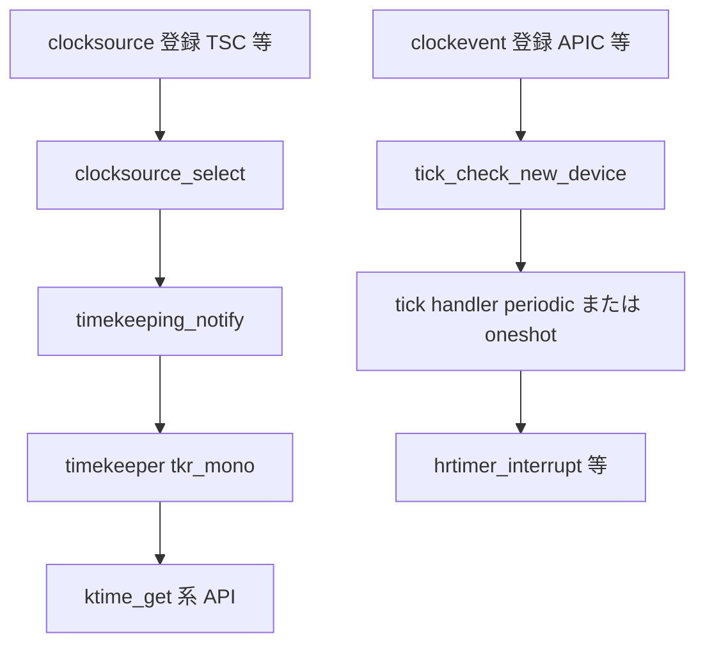

# 第12章 clocksource と clockevents

> **本章で読むソース**
>
> - [`kernel/time/clocksource.c` L36-L56](https://github.com/gregkh/linux/blob/v6.18.38/kernel/time/clocksource.c#L36-L56)
> - [`kernel/time/clocksource.c` L58-L86](https://github.com/gregkh/linux/blob/v6.18.38/kernel/time/clocksource.c#L58-L86)
> - [`kernel/time/clocksource.c` L1024-L1072](https://github.com/gregkh/linux/blob/v6.18.38/kernel/time/clocksource.c#L1024-L1072)
> - [`kernel/time/clockevents.c` L448-L476](https://github.com/gregkh/linux/blob/v6.18.38/kernel/time/clockevents.c#L448-L476)
> - [`kernel/time/clockevents.c` L479-L501](https://github.com/gregkh/linux/blob/v6.18.38/kernel/time/clockevents.c#L479-L501)
> - [`kernel/time/clocksource.c` L1236-L1267](https://github.com/gregkh/linux/blob/v6.18.38/kernel/time/clocksource.c#L1236-L1267)

## この章の狙い

時刻の**読み取り**を担う **clocksource** と、次の割り込み時刻を**書き込む** **clockevent** の役割分担を読む。
clocksource は hardware cycle を ns へ、clockevent は expiry の ns を device cycle へ変換する（向きが逆）。
`clocks_calc_mult_shift()` による scaled math と、デバイス登録から tick 層への引き渡しを追う。

## 前提

- [第11章 hrtimer](11-hrtimer.md) で `hrtimer_interrupt()` が clockevent に依存することを読んでいること。

## clocks_calc_mult_shift：scaled math の共通基盤

clocksource も clockevent も **mult** と **shift** で scaled math するが、from と to の向きが逆である。
clocksource では from がカウンタ周波数、to が `NSEC_PER_SEC`。
clockevent では from が `NSEC_PER_SEC`、to がカウンタ周波数である。
`clocks_calc_mult_shift()` は変換レンジ `maxsec` 内で 64bit オーバーフローしない組を選ぶ。

[`kernel/time/clocksource.c` L36-L56](https://github.com/gregkh/linux/blob/v6.18.38/kernel/time/clocksource.c#L36-L56)

```c
 * clocks_calc_mult_shift - calculate mult/shift factors for scaled math of clocks
 * @mult:	pointer to mult variable
 * @shift:	pointer to shift variable
 * @from:	frequency to convert from
 * @to:		frequency to convert to
 * @maxsec:	guaranteed runtime conversion range in seconds
 *
 * The function evaluates the shift/mult pair for the scaled math
 * operations of clocksources and clockevents.
 *
 * @to and @from are frequency values in HZ. For clock sources @to is
 * NSEC_PER_SEC == 1GHz and @from is the counter frequency. For clock
 * event @to is the counter frequency and @from is NSEC_PER_SEC.
 *
 * The @maxsec conversion range argument controls the time frame in
 * seconds which must be covered by the runtime conversion with the
 * calculated mult and shift factors. This guarantees that no 64bit
 * overflow happens when the input value of the conversion is
 * multiplied with the calculated mult factor. Larger ranges may
 * reduce the conversion accuracy by choosing smaller mult and shift
 * factors.
```

実装は shift を下げながら mult を試し、精度とレンジのバランスを取る。

[`kernel/time/clocksource.c` L58-L86](https://github.com/gregkh/linux/blob/v6.18.38/kernel/time/clocksource.c#L58-L86)

```c
void
clocks_calc_mult_shift(u32 *mult, u32 *shift, u32 from, u32 to, u32 maxsec)
{
	u64 tmp;
	u32 sft, sftacc= 32;

	/*
	 * Calculate the shift factor which is limiting the conversion
	 * range:
	 */
	tmp = ((u64)maxsec * from) >> 32;
	while (tmp) {
		tmp >>=1;
		sftacc--;
	}

	/*
	 * Find the conversion shift/mult pair which has the best
	 * accuracy and fits the maxsec conversion range:
	 */
	for (sft = 32; sft > 0; sft--) {
		tmp = (u64) to << sft;
		tmp += from / 2;
		do_div(tmp, from);
		if ((tmp >> sftacc) == 0)
			break;
	}
	*mult = tmp;
	*shift = sft;
```

## clocksource の選択

登録された clocksource リストから rating と oneshot 互換性を見て最良を選び、`timekeeping_notify()` で timekeeper を切り替える。

[`kernel/time/clocksource.c` L1024-L1072](https://github.com/gregkh/linux/blob/v6.18.38/kernel/time/clocksource.c#L1024-L1072)

```c
static void __clocksource_select(bool skipcur)
{
	bool oneshot = tick_oneshot_mode_active();
	struct clocksource *best, *cs;

	/* Find the best suitable clocksource */
	best = clocksource_find_best(oneshot, skipcur);
	if (!best)
		return;

	if (!strlen(override_name))
		goto found;

	/* Check for the override clocksource. */
	list_for_each_entry(cs, &clocksource_list, list) {
		if (skipcur && cs == curr_clocksource)
			continue;
		if (strcmp(cs->name, override_name) != 0)
			continue;
		/*
		 * Check to make sure we don't switch to a non-highres
		 * capable clocksource if the tick code is in oneshot
		 * mode (highres or nohz)
		 */
		if (!(cs->flags & CLOCK_SOURCE_VALID_FOR_HRES) && oneshot) {
			/* Override clocksource cannot be used. */
			if (cs->flags & CLOCK_SOURCE_UNSTABLE) {
				pr_warn("Override clocksource %s is unstable and not HRT compatible - cannot switch while in HRT/NOHZ mode\n",
					cs->name);
				override_name[0] = 0;
			} else {
				/*
				 * The override cannot be currently verified.
				 * Deferring to let the watchdog check.
				 */
				pr_info("Override clocksource %s is not currently HRT compatible - deferring\n",
					cs->name);
			}
		} else
			/* Override clocksource can be used. */
			best = cs;
		break;
	}

found:
	if (curr_clocksource != best && !timekeeping_notify(best)) {
		pr_info("Switched to clocksource %s\n", best->name);
		curr_clocksource = best;
	}
```

watchdog は TSC 等の skew を検出し、不安定なソースをマークする。

## __clocksource_register_scale：登録と選択

ドライバは `clocksource_register_hz()` 等を経由して `__clocksource_register_scale()` を呼ぶ。
mult と shift の初期化、リストへの enqueue、watchdog 登録のあと `clocksource_select()` で現行ソースを決める。

[`kernel/time/clocksource.c` L1236-L1267](https://github.com/gregkh/linux/blob/v6.18.38/kernel/time/clocksource.c#L1236-L1267)

```c
int __clocksource_register_scale(struct clocksource *cs, u32 scale, u32 freq)
{
	unsigned long flags;

	clocksource_arch_init(cs);

	if (WARN_ON_ONCE((unsigned int)cs->id >= CSID_MAX))
		cs->id = CSID_GENERIC;
	if (cs->vdso_clock_mode < 0 ||
	    cs->vdso_clock_mode >= VDSO_CLOCKMODE_MAX) {
		pr_warn("clocksource %s registered with invalid VDSO mode %d. Disabling VDSO support.\n",
			cs->name, cs->vdso_clock_mode);
		cs->vdso_clock_mode = VDSO_CLOCKMODE_NONE;
	}

	/* Initialize mult/shift and max_idle_ns */
	__clocksource_update_freq_scale(cs, scale, freq);

	/* Add clocksource to the clocksource list */
	mutex_lock(&clocksource_mutex);

	clocksource_watchdog_lock(&flags);
	clocksource_enqueue(cs);
	clocksource_enqueue_watchdog(cs);
	clocksource_watchdog_unlock(&flags);

	clocksource_select();
	clocksource_select_watchdog(false);
	__clocksource_suspend_select(cs);
	mutex_unlock(&clocksource_mutex);
	return 0;
}
```

`vdso_clock_mode` が無効なソースは vDSO 更新から外され、ユーザー空間 fast path が TSC 読み取りできなくなる（第23章）。

## clockevent の登録

**clock_event_device** は `cpumask` で担当 CPU を示す（per-CPU 専用、broadcast、shared がありうる）。
`clockevents_register_device()` はデバイスをリストへ載せ、`tick_check_new_device()` 経由で tick 層が handler を割り当てる。

[`kernel/time/clockevents.c` L448-L476](https://github.com/gregkh/linux/blob/v6.18.38/kernel/time/clockevents.c#L448-L476)

```c
 * clockevents_register_device - register a clock event device
 * @dev:	device to register
 */
void clockevents_register_device(struct clock_event_device *dev)
{
	unsigned long flags;

	/* Initialize state to DETACHED */
	clockevent_set_state(dev, CLOCK_EVT_STATE_DETACHED);

	if (!dev->cpumask) {
		WARN_ON(num_possible_cpus() > 1);
		dev->cpumask = cpumask_of(smp_processor_id());
	}

	if (dev->cpumask == cpu_all_mask) {
		WARN(1, "%s cpumask == cpu_all_mask, using cpu_possible_mask instead\n",
		     dev->name);
		dev->cpumask = cpu_possible_mask;
	}

	raw_spin_lock_irqsave(&clockevents_lock, flags);

	list_add(&dev->list, &clockevent_devices);
	tick_check_new_device(dev);
	clockevents_notify_released();

	raw_spin_unlock_irqrestore(&clockevents_lock, flags);
}
```

oneshot 対応デバイスでは `clockevents_config()` が mult と shift を設定し、min/max delta を ns へ変換する。

[`kernel/time/clockevents.c` L479-L501](https://github.com/gregkh/linux/blob/v6.18.38/kernel/time/clockevents.c#L479-L501)

```c
static void clockevents_config(struct clock_event_device *dev, u32 freq)
{
	u64 sec;

	if (!(dev->features & CLOCK_EVT_FEAT_ONESHOT))
		return;

	/*
	 * Calculate the maximum number of seconds we can sleep. Limit
	 * to 10 minutes for hardware which can program more than
	 * 32bit ticks so we still get reasonable conversion values.
	 */
	sec = dev->max_delta_ticks;
	do_div(sec, freq);
	if (!sec)
		sec = 1;
	else if (sec > 600 && dev->max_delta_ticks > UINT_MAX)
		sec = 600;

	clockevents_calc_mult_shift(dev, freq, sec);
	dev->min_delta_ns = cev_delta2ns(dev->min_delta_ticks, dev, false);
	dev->max_delta_ns = cev_delta2ns(dev->max_delta_ticks, dev, true);
}
```

**最適化の工夫**：読み取り（clocksource）と書き込み（clockevent）を分離することで、x86 では TSC で高速に時刻を読み、APIC timer で必要な瞬間だけ割り込む構成が取れる。

> **7.x 系での変化**
> v7.1.3 では clocksource watchdog が per-CPU の [`watchdog_cpu_data`](https://github.com/gregkh/linux/blob/v7.1.3/kernel/time/clocksource.c#L257-L260) と `call_single_data_t` で remote CPU へ skew 確認を送る（[`L390-L409`](https://github.com/gregkh/linux/blob/v7.1.3/kernel/time/clocksource.c#L390-L409)）。
> NUMA 距離に応じた timeout は [`L376-L387`](https://github.com/gregkh/linux/blob/v7.1.3/kernel/time/clocksource.c#L376-L387) で計算される。
> `CONFIG_GENERIC_CLOCKEVENTS_COUPLED` 有効時、[`clockevent_set_next_coupled()`](https://github.com/gregkh/linux/blob/v7.1.3/kernel/time/clockevents.c#L307-L321) が [`ktime_expiry_to_cycles()`](https://github.com/gregkh/linux/blob/v7.1.3/kernel/time/timekeeping.c#L877-L880) で last timekeeper update の base ns/cycles から満了 ns への delta を cycle へ変換し、通常経路の `ktime_get()` と driver `set_next_event()` 内の clocksource read を合わせて2回省く（`CLOCK_SOURCE_HAS_COUPLED_CLOCK_EVENT` / `CLOCK_EVT_FEAT_CLOCKSOURCE_COUPLED`）。

## 処理の流れ：ハードウェアから timekeeper まで



## まとめ

- **clocksource** は自由に進むカウンタから時刻を読み、mult と shift でナノ秒へ変換する。
- **clockevent** は次のイベント時刻を program し、hrtimer や tick のトリガになる。
- 両者は `clocks_calc_mult_shift()` を共有するが、clocksource は cycle→ns、clockevent は ns→cycle と from/to の向きが逆である。
- clocksource 選択は HRT と NO_HZ モードとの互換性を考慮する。

## 関連する章

- [第11章 hrtimer](11-hrtimer.md)
- [第14章 timekeeping](14-timekeeping.md)
- [第16章 tick デバイスと周期 tick](../part03-tick/16-tick-device.md)
