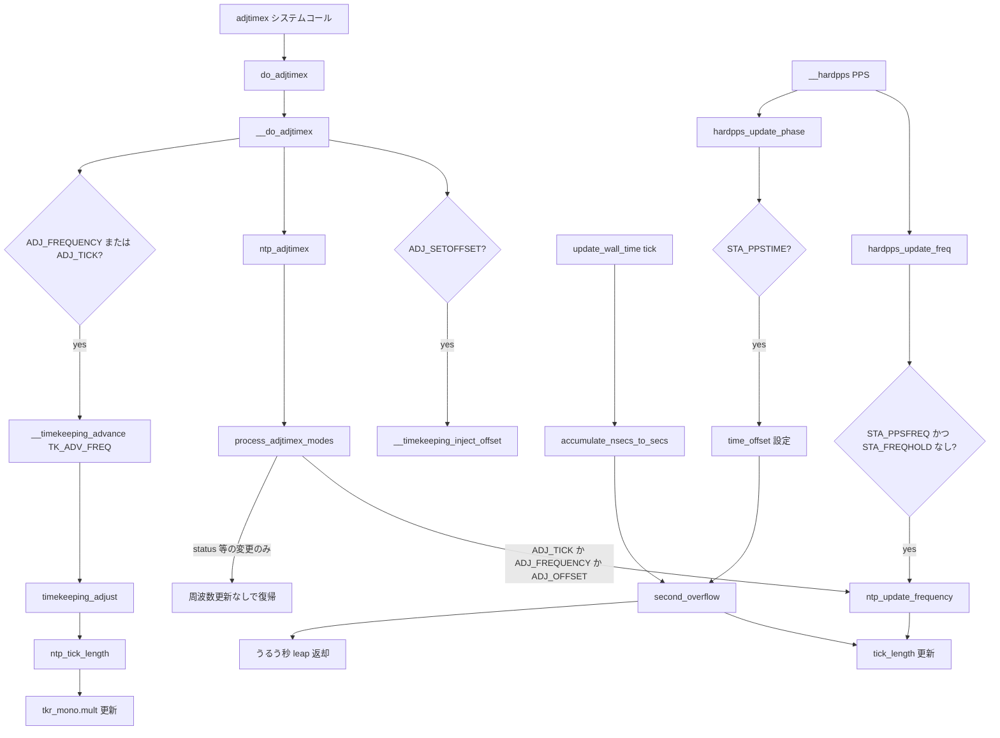

# 第13章 NTP 補正と adjtimex

> **本章で読むソース**
>
> - [`kernel/time/time.c` L268-L282](https://github.com/gregkh/linux/blob/v6.18.38/kernel/time/time.c#L268-L282)
> - [`kernel/time/timekeeping.c` L2680-L2733](https://github.com/gregkh/linux/blob/v6.18.38/kernel/time/timekeeping.c#L2680-L2733)
> - [`kernel/time/timekeeping.c` L2740-L2760](https://github.com/gregkh/linux/blob/v6.18.38/kernel/time/timekeeping.c#L2740-L2760)
> - [`kernel/time/ntp.c` L59-L88](https://github.com/gregkh/linux/blob/v6.18.38/kernel/time/ntp.c#L59-L88)
> - [`kernel/time/ntp.c` L251-L268](https://github.com/gregkh/linux/blob/v6.18.38/kernel/time/ntp.c#L251-L268)
> - [`kernel/time/ntp.c` L362-L365](https://github.com/gregkh/linux/blob/v6.18.38/kernel/time/ntp.c#L362-L365)
> - [`kernel/time/ntp.c` L398-L491](https://github.com/gregkh/linux/blob/v6.18.38/kernel/time/ntp.c#L398-L491)
> - [`kernel/time/ntp.c` L720-L764](https://github.com/gregkh/linux/blob/v6.18.38/kernel/time/ntp.c#L720-L764)
> - [`kernel/time/ntp.c` L770-L809](https://github.com/gregkh/linux/blob/v6.18.38/kernel/time/ntp.c#L770-L809)
> - [`kernel/time/timekeeping.c` L2158-L2184](https://github.com/gregkh/linux/blob/v6.18.38/kernel/time/timekeeping.c#L2158-L2184)
> - [`kernel/time/timekeeping.c` L2149-L2151](https://github.com/gregkh/linux/blob/v6.18.38/kernel/time/timekeeping.c#L2149-L2151)
> - [`kernel/time/ntp.c` L1040-L1085](https://github.com/gregkh/linux/blob/v6.18.38/kernel/time/ntp.c#L1040-L1085)

## この章の狙い

ユーザー空間の NTP デーモンや `adjtimex` システムコールが、カーネル内部の **NTP 状態**と **timekeeper** の周波数補正へどう届くかを読む。
`ntp_tick_length` が [第12章 timekeeping](12-timekeeping.md) の `tkr_mono.mult` 調整へ接続する経路を、入口から `second_overflow`、うるう秒、PPS まで追う。

## 前提

- [第12章 timekeeping](12-timekeeping.md) で `update_wall_time()`、`__timekeeping_advance()`、`timekeeping_adjust()` の存在を押さえていること。
- `struct timekeeper` の `tkr_mono.mult` が clocksource cycle をナノ秒へ換算する倍率であること（mult を大きくすると同じ cycle 差分がより多くのナノ秒として加算され、時計は速く進む）。

## adjtimex システムコールから do_adjtimex

64 ビット向け `adjtimex` はユーザー空間の `struct __kernel_timex` をコピーし、`do_adjtimex()` へ渡す薄いラッパーである。

[`kernel/time/time.c` L268-L282](https://github.com/gregkh/linux/blob/v6.18.38/kernel/time/time.c#L268-L282)

```c
#ifdef CONFIG_64BIT
SYSCALL_DEFINE1(adjtimex, struct __kernel_timex __user *, txc_p)
{
	struct __kernel_timex txc;		/* Local copy of parameter */
	int ret;

	/* Copy the user data space into the kernel copy
	 * structure. But bear in mind that the structures
	 * may change
	 */
	if (copy_from_user(&txc, txc_p, sizeof(struct __kernel_timex)))
		return -EFAULT;
	ret = do_adjtimex(&txc);
	return copy_to_user(txc_p, &txc, sizeof(struct __kernel_timex)) ? -EFAULT : ret;
}
```

`posix-timers.c` や compat 経路も最終的に同じ `do_adjtimex()` を呼ぶ。

## do_adjtimex と __do_adjtimex

`do_adjtimex()` は監査ログと `clock_was_set()` 通知を担い、本体は `__do_adjtimex()` が shadow timekeeper 上で処理する。

[`kernel/time/timekeeping.c` L2740-L2760](https://github.com/gregkh/linux/blob/v6.18.38/kernel/time/timekeeping.c#L2740-L2760)

```c
int do_adjtimex(struct __kernel_timex *txc)
{
	struct adjtimex_result result = { };
	int ret;

	ret = __do_adjtimex(&tk_core, txc, &result);
	if (ret < 0)
		return ret;

	if (txc->modes & ADJ_SETOFFSET)
		audit_tk_injoffset(result.delta);

	audit_ntp_log(&result.ad);

	if (result.clock_set)
		clock_was_set(CLOCK_SET_WALL);

	ntp_notify_cmos_timer(result.delta.tv_sec != 0);

	return ret;
}
```

`__do_adjtimex()` は検証後に timekeeper ロックを取り、時刻注入、`ntp_adjtimex()`、必要なら即時の周波数反映を行う。

[`kernel/time/timekeeping.c` L2680-L2733](https://github.com/gregkh/linux/blob/v6.18.38/kernel/time/timekeeping.c#L2680-L2733)

```c
static int __do_adjtimex(struct tk_data *tkd, struct __kernel_timex *txc,
			 struct adjtimex_result *result)
{
	struct timekeeper *tks = &tkd->shadow_timekeeper;
	bool aux_clock = !timekeeper_is_core_tk(tks);
	struct timespec64 ts;
	s32 orig_tai, tai;
	int ret;

	/* Validate the data before disabling interrupts */
	ret = timekeeping_validate_timex(txc, aux_clock);
	if (ret)
		return ret;
	add_device_randomness(txc, sizeof(*txc));

	if (!aux_clock)
		ktime_get_real_ts64(&ts);
	else
		tk_get_aux_ts64(tkd->timekeeper.id, &ts);

	add_device_randomness(&ts, sizeof(ts));

	guard(raw_spinlock_irqsave)(&tkd->lock);

	if (!tks->clock_valid)
		return -ENODEV;

	if (txc->modes & ADJ_SETOFFSET) {
		result->delta.tv_sec  = txc->time.tv_sec;
		result->delta.tv_nsec = txc->time.tv_usec;
		if (!(txc->modes & ADJ_NANO))
			result->delta.tv_nsec *= 1000;
		ret = __timekeeping_inject_offset(tkd, &result->delta);
		if (ret)
			return ret;
		result->clock_set = true;
	}

	orig_tai = tai = tks->tai_offset;
	ret = ntp_adjtimex(tks->id, txc, &ts, &tai, &result->ad);

	if (tai != orig_tai) {
		__timekeeping_set_tai_offset(tks, tai);
		timekeeping_update_from_shadow(tkd, TK_CLOCK_WAS_SET);
		result->clock_set = true;
	} else {
		tk_update_leap_state_all(tkd);
	}

	/* Update the multiplier immediately if frequency was set directly */
	if (txc->modes & (ADJ_FREQUENCY | ADJ_TICK))
		result->clock_set |= __timekeeping_advance(tkd, TK_ADV_FREQ);

	return ret;
}
```

`ADJ_FREQUENCY` や `ADJ_TICK` が立っているときは tick 待ちをせず `__timekeeping_advance(TK_ADV_FREQ)` で mult を即反映する。
位相だけの微調整は主に `second_overflow()` 側の `tick_length` 更新で秒境界へ分散される。

## struct ntp_data と tick_length

NTP 状態は timekeeper ID ごとの `struct ntp_data` に集約される。
`tick_length` は1 NTP interval あたりの加算長（スケール付き）で、`tick_length_base` が周波数補正の基準値である。
`ntp_update_frequency()` は1秒相当の `second_length` を `NTP_INTERVAL_FREQ`（通常は `HZ`）で割った `new_base` を `tick_length_base` へ書き、`NTP_INTERVAL_LENGTH`（`NSEC_PER_SEC / NTP_INTERVAL_FREQ`）単位の tick 長を表す。

[`kernel/time/ntp.c` L59-L88](https://github.com/gregkh/linux/blob/v6.18.38/kernel/time/ntp.c#L59-L88)

```c
struct ntp_data {
	unsigned long		tick_usec;
	u64			tick_length;
	u64			tick_length_base;
	int			time_state;
	int			time_status;
	s64			time_offset;
	long			time_constant;
	long			time_maxerror;
	long			time_esterror;
	s64			time_freq;
	time64_t		time_reftime;
	long			time_adjust;
	s64			ntp_tick_adj;
	time64_t		ntp_next_leap_sec;
#ifdef CONFIG_NTP_PPS
	int			pps_valid;
	long			pps_tf[3];
	long			pps_jitter;
	struct timespec64	pps_fbase;
	int			pps_shift;
	int			pps_intcnt;
	s64			pps_freq;
	long			pps_stabil;
	long			pps_calcnt;
	long			pps_jitcnt;
	long			pps_stbcnt;
	long			pps_errcnt;
#endif
};
```

## ntp_adjtimex とモード処理

`ntp_adjtimex()` は `ADJ_ADJTIME`（`adjtime` 相当）と通常の `adjtimex` モードを分岐し、後者は `process_adjtimex_modes()` で各フィールドを更新する。

[`kernel/time/ntp.c` L770-L809](https://github.com/gregkh/linux/blob/v6.18.38/kernel/time/ntp.c#L770-L809)

```c
int ntp_adjtimex(unsigned int tkid, struct __kernel_timex *txc, const struct timespec64 *ts,
		 s32 *time_tai, struct audit_ntp_data *ad)
{
	struct ntp_data *ntpdata = &tk_ntp_data[tkid];
	int result;

	if (txc->modes & ADJ_ADJTIME) {
		long save_adjust = ntpdata->time_adjust;

		if (!(txc->modes & ADJ_OFFSET_READONLY)) {
			/* adjtime() is independent from ntp_adjtime() */
			ntpdata->time_adjust = txc->offset;
			ntp_update_frequency(ntpdata);

			audit_ntp_set_old(ad, AUDIT_NTP_ADJUST,	save_adjust);
			audit_ntp_set_new(ad, AUDIT_NTP_ADJUST,	ntpdata->time_adjust);
		}
		txc->offset = save_adjust;
	} else {
		/* If there are input parameters, then process them: */
		if (txc->modes) {
			audit_ntp_set_old(ad, AUDIT_NTP_OFFSET,	ntpdata->time_offset);
			audit_ntp_set_old(ad, AUDIT_NTP_FREQ,	ntpdata->time_freq);
			audit_ntp_set_old(ad, AUDIT_NTP_STATUS,	ntpdata->time_status);
			audit_ntp_set_old(ad, AUDIT_NTP_TAI,	*time_tai);
			audit_ntp_set_old(ad, AUDIT_NTP_TICK,	ntpdata->tick_usec);

			process_adjtimex_modes(ntpdata, txc, time_tai);

			audit_ntp_set_new(ad, AUDIT_NTP_OFFSET,	ntpdata->time_offset);
			audit_ntp_set_new(ad, AUDIT_NTP_FREQ,	ntpdata->time_freq);
			audit_ntp_set_new(ad, AUDIT_NTP_STATUS,	ntpdata->time_status);
			audit_ntp_set_new(ad, AUDIT_NTP_TAI,	*time_tai);
			audit_ntp_set_new(ad, AUDIT_NTP_TICK,	ntpdata->tick_usec);
		}

		txc->offset = shift_right(ntpdata->time_offset * NTP_INTERVAL_FREQ, NTP_SCALE_SHIFT);
		if (!(ntpdata->time_status & STA_NANO))
			txc->offset = div_s64(txc->offset, NSEC_PER_USEC);
	}
```

`ADJ_FREQUENCY` は `time_freq`（ppm スケール）を直接書き込む。
`ADJ_OFFSET` は `ntp_update_offset()` を呼ぶが、`STA_PLL` が立っていなければ何もしない。
`STA_PLL` 有効時は位相を `time_offset` へ設定し、更新間隔 `secs` と `STA_FLL` の有無に応じて FLL 成分を加え、PLL 成分と合わせて `time_freq` も更新する（FLL は `secs >= MINSEC` かつ `STA_FLL` または `secs > MAXSEC` のときだけ寄与する）。

[`kernel/time/ntp.c` L720-L764](https://github.com/gregkh/linux/blob/v6.18.38/kernel/time/ntp.c#L720-L764)

```c
static inline void process_adjtimex_modes(struct ntp_data *ntpdata, const struct __kernel_timex *txc,
					  s32 *time_tai)
{
	if (txc->modes & ADJ_STATUS)
		process_adj_status(ntpdata, txc);

	if (txc->modes & ADJ_NANO)
		ntpdata->time_status |= STA_NANO;

	if (txc->modes & ADJ_MICRO)
		ntpdata->time_status &= ~STA_NANO;

	if (txc->modes & ADJ_FREQUENCY) {
		ntpdata->time_freq = txc->freq * PPM_SCALE;
		ntpdata->time_freq = min(ntpdata->time_freq, MAXFREQ_SCALED);
		ntpdata->time_freq = max(ntpdata->time_freq, -MAXFREQ_SCALED);
		/* Update pps_freq */
		pps_set_freq(ntpdata);
	}

	if (txc->modes & ADJ_MAXERROR)
		ntpdata->time_maxerror = clamp(txc->maxerror, 0, NTP_PHASE_LIMIT);

	if (txc->modes & ADJ_ESTERROR)
		ntpdata->time_esterror = clamp(txc->esterror, 0, NTP_PHASE_LIMIT);

	if (txc->modes & ADJ_TIMECONST) {
		ntpdata->time_constant = clamp(txc->constant, 0, MAXTC);
		if (!(ntpdata->time_status & STA_NANO))
			ntpdata->time_constant += 4;
		ntpdata->time_constant = clamp(ntpdata->time_constant, 0, MAXTC);
	}

	if (txc->modes & ADJ_TAI && txc->constant >= 0 && txc->constant <= MAX_TAI_OFFSET)
		*time_tai = txc->constant;

	if (txc->modes & ADJ_OFFSET)
		ntp_update_offset(ntpdata, txc->offset);

	if (txc->modes & ADJ_TICK)
		ntpdata->tick_usec = txc->tick;

	if (txc->modes & (ADJ_TICK|ADJ_FREQUENCY|ADJ_OFFSET))
		ntp_update_frequency(ntpdata);
}
```

`time_freq` が正（クロックが遅いとみなす補正）だと `tick_length_base` が伸び、timekeeper 側では mult が増えて時計が速くなる。

## ntp_update_frequency と ntp_tick_length

周波数変更は `tick_length_base` を再計算し、差分を即座に `tick_length` へ足し込む。
`second_overflow()` を待たずに tick 長を変えるのは、ユーザーが `ADJ_FREQUENCY` を設定した直後から補正を効かせるためである。

[`kernel/time/ntp.c` L251-L268](https://github.com/gregkh/linux/blob/v6.18.38/kernel/time/ntp.c#L251-L268)

```c
static void ntp_update_frequency(struct ntp_data *ntpdata)
{
	u64 second_length, new_base, tick_usec = (u64)ntpdata->tick_usec;

	second_length		 = (u64)(tick_usec * NSEC_PER_USEC * USER_HZ) << NTP_SCALE_SHIFT;

	second_length		+= ntpdata->ntp_tick_adj;
	second_length		+= ntpdata->time_freq;

	new_base		 = div_u64(second_length, NTP_INTERVAL_FREQ);

	/*
	 * Don't wait for the next second_overflow, apply the change to the
	 * tick length immediately:
	 */
	ntpdata->tick_length		+= new_base - ntpdata->tick_length_base;
	ntpdata->tick_length_base	 = new_base;
}
```

timekeeper は `ntp_tick_length()` 経由で現在の `tick_length` を読む。

[`kernel/time/ntp.c` L362-L365](https://github.com/gregkh/linux/blob/v6.18.38/kernel/time/ntp.c#L362-L365)

```c
u64 ntp_tick_length(unsigned int tkid)
{
	return tk_ntp_data[tkid].tick_length;
}
```

## second_overflow とうるう秒

`accumulate_nsecs_to_secs()` が秒を繰り上げるたびに `second_overflow()` が呼ばれる。
うるう秒の状態遷移（`TIME_INS` / `TIME_DEL` 等）と、秒あたりの位相スライス（`time_offset` から `tick_length` へ移す `delta`）をここで処理する。

[`kernel/time/ntp.c` L398-L491](https://github.com/gregkh/linux/blob/v6.18.38/kernel/time/ntp.c#L398-L491)

```c
int second_overflow(unsigned int tkid, time64_t secs)
{
	struct ntp_data *ntpdata = &tk_ntp_data[tkid];
	s64 delta;
	int leap = 0;
	s32 rem;

	/*
	 * Leap second processing. If in leap-insert state at the end of the
	 * day, the system clock is set back one second; if in leap-delete
	 * state, the system clock is set ahead one second.
	 */
	switch (ntpdata->time_state) {
	case TIME_OK:
		if (ntpdata->time_status & STA_INS) {
			ntpdata->time_state = TIME_INS;
			div_s64_rem(secs, SECS_PER_DAY, &rem);
			ntpdata->ntp_next_leap_sec = secs + SECS_PER_DAY - rem;
		} else if (ntpdata->time_status & STA_DEL) {
			ntpdata->time_state = TIME_DEL;
			div_s64_rem(secs + 1, SECS_PER_DAY, &rem);
			ntpdata->ntp_next_leap_sec = secs + SECS_PER_DAY - rem;
		}
		break;
	case TIME_INS:
		if (!(ntpdata->time_status & STA_INS)) {
			ntpdata->ntp_next_leap_sec = TIME64_MAX;
			ntpdata->time_state = TIME_OK;
		} else if (secs == ntpdata->ntp_next_leap_sec) {
			leap = -1;
			ntpdata->time_state = TIME_OOP;
			pr_notice("Clock: inserting leap second 23:59:60 UTC\n");
		}
		break;
	case TIME_DEL:
		if (!(ntpdata->time_status & STA_DEL)) {
			ntpdata->ntp_next_leap_sec = TIME64_MAX;
			ntpdata->time_state = TIME_OK;
		} else if (secs == ntpdata->ntp_next_leap_sec) {
			leap = 1;
			ntpdata->ntp_next_leap_sec = TIME64_MAX;
			ntpdata->time_state = TIME_WAIT;
			pr_notice("Clock: deleting leap second 23:59:59 UTC\n");
		}
		break;
	// ... (中略) ...
	}

	/* Bump the maxerror field */
	ntpdata->time_maxerror += MAXFREQ / NSEC_PER_USEC;
	if (ntpdata->time_maxerror > NTP_PHASE_LIMIT) {
		ntpdata->time_maxerror = NTP_PHASE_LIMIT;
		ntpdata->time_status |= STA_UNSYNC;
	}

	/* Compute the phase adjustment for the next second */
	ntpdata->tick_length	 = ntpdata->tick_length_base;

	delta			 = ntp_offset_chunk(ntpdata, ntpdata->time_offset);
	ntpdata->time_offset	-= delta;
	ntpdata->tick_length	+= delta;

	/* Check PPS signal */
	pps_dec_valid(ntpdata);

	if (!ntpdata->time_adjust)
		goto out;

	if (ntpdata->time_adjust > MAX_TICKADJ) {
		ntpdata->time_adjust -= MAX_TICKADJ;
		ntpdata->tick_length += MAX_TICKADJ_SCALED;
		goto out;
	}

	if (ntpdata->time_adjust < -MAX_TICKADJ) {
		ntpdata->time_adjust += MAX_TICKADJ;
		ntpdata->tick_length -= MAX_TICKADJ_SCALED;
		goto out;
	}

	ntpdata->tick_length += (s64)(ntpdata->time_adjust * NSEC_PER_USEC / NTP_INTERVAL_FREQ)
				<< NTP_SCALE_SHIFT;
	ntpdata->time_adjust = 0;

out:
	return leap;
}
```

返り値 `leap` は timekeeper が `xtime_sec` と TAI オフセットを補正する（第12章の `accumulate_nsecs_to_secs()`）。
挿入うるう秒では `leap = -1` となり wall clock を1秒戻す。

## timekeeper への mult 反映

`timekeeping_adjust()` は `ntp_tick_length()` から mult を導出し、`timekeeping_apply_adjustment()` で `tkr_mono.mult` を更新する。
mult が増えると同じ cycle 差分がより多くのナノ秒として積算される。

[`kernel/time/timekeeping.c` L2158-L2184](https://github.com/gregkh/linux/blob/v6.18.38/kernel/time/timekeeping.c#L2158-L2184)

```c
static void timekeeping_adjust(struct timekeeper *tk, s64 offset)
{
	u64 ntp_tl = ntp_tick_length(tk->id);
	u32 mult;

	/*
	 * Determine the multiplier from the current NTP tick length.
	 * Avoid expensive division when the tick length doesn't change.
	 */
	if (likely(tk->ntp_tick == ntp_tl)) {
		mult = tk->tkr_mono.mult - tk->ntp_err_mult;
	} else {
		tk->ntp_tick = ntp_tl;
		mult = div64_u64((tk->ntp_tick >> tk->ntp_error_shift) -
				 tk->xtime_remainder, tk->cycle_interval);
	}

	/*
	 * If the clock is behind the NTP time, increase the multiplier by 1
	 * to catch up with it. If it's ahead and there was a remainder in the
	 * tick division, the clock will slow down. Otherwise it will stay
	 * ahead until the tick length changes to a non-divisible value.
	 */
	tk->ntp_err_mult = tk->ntp_error > 0 ? 1 : 0;
	mult += tk->ntp_err_mult;

	timekeeping_apply_adjustment(tk, offset, mult - tk->tkr_mono.mult);
```

実際の加算は次のとおりである。

[`kernel/time/timekeeping.c` L2149-L2151](https://github.com/gregkh/linux/blob/v6.18.38/kernel/time/timekeeping.c#L2149-L2151)

```c
	tk->tkr_mono.mult += mult_adj;
	tk->xtime_interval += interval;
	tk->tkr_mono.xtime_nsec -= offset;
```

`mult_adj` が正なら mult が増え、時計は速く進む。
NTP が「遅れている」と判断して `time_freq` を上げると `tick_length` が伸び、結果として mult も増える方向に働く。

## PPS の概観

`CONFIG_NTP_PPS` が有効なとき、外部の秒パルス（PPS）が `__hardpps()` に届く。
周波数と位相は別経路で処理される。

[`kernel/time/ntp.c` L1040-L1085](https://github.com/gregkh/linux/blob/v6.18.38/kernel/time/ntp.c#L1040-L1085)

```c
void __hardpps(const struct timespec64 *phase_ts, const struct timespec64 *raw_ts)
{
	struct ntp_data *ntpdata = &tk_ntp_data[TIMEKEEPER_CORE];
	struct pps_normtime pts_norm, freq_norm;

	pts_norm = pps_normalize_ts(*phase_ts);

	/* Clear the error bits, they will be set again if needed */
	ntpdata->time_status &= ~(STA_PPSJITTER | STA_PPSWANDER | STA_PPSERROR);

	/* indicate signal presence */
	ntpdata->time_status |= STA_PPSSIGNAL;
	ntpdata->pps_valid = PPS_VALID;

	/*
	 * When called for the first time, just start the frequency
	 * interval
	 */
	if (unlikely(ntpdata->pps_fbase.tv_sec == 0)) {
		ntpdata->pps_fbase = *raw_ts;
		return;
	}

	/* Ok, now we have a base for frequency calculation */
	freq_norm = pps_normalize_ts(timespec64_sub(*raw_ts, ntpdata->pps_fbase));

	/*
	 * Check that the signal is in the range
	 * [1s - MAXFREQ us, 1s + MAXFREQ us], otherwise reject it
	 */
	if ((freq_norm.sec == 0) || (freq_norm.nsec > MAXFREQ * freq_norm.sec) ||
	    (freq_norm.nsec < -MAXFREQ * freq_norm.sec)) {
		ntpdata->time_status |= STA_PPSJITTER;
		/* Restart the frequency calibration interval */
		ntpdata->pps_fbase = *raw_ts;
		printk_deferred(KERN_ERR "hardpps: PPSJITTER: bad pulse\n");
		return;
	}

	/* Signal is ok. Check if the current frequency interval is finished */
	if (freq_norm.sec >= (1 << ntpdata->pps_shift)) {
		ntpdata->pps_calcnt++;
		/* Restart the frequency calibration interval */
		ntpdata->pps_fbase = *raw_ts;
		hardpps_update_freq(ntpdata, freq_norm);
	}
```

続けて `hardpps_update_phase()` が位相補正を扱う。
`STA_PPSTIME` が有効なときだけ `time_offset` を上書きし、`time_adjust` を打ち切る。
この位相は即座に `tick_length` へは入らず、次の `second_overflow()` が `time_offset` から `delta` を切り出して `tick_length` へ移す。

周波数側は `hardpps_update_freq()` が MONOTONIC_RAW の周期から `pps_freq` を推定する。
`STA_PPSFREQ` が立ち、かつ `STA_FREQHOLD` が無い場合だけ `time_freq` を上書きして `ntp_update_frequency()` を呼び、即座に `tick_length` を更新する。
それ以外では周波数は従来の `time_freq` のまま残る。

## 処理の流れ



## 高速化と最適化の工夫

`timekeeping_adjust()` は `likely(tk->ntp_tick == ntp_tl)` で前回と同じ `tick_length` なら `div64_u64` を省略し、毎 tick の除算コストを避ける。
`ntp_update_frequency()` は周波数変更を `tick_length` へ即反映するため、秒境界の `second_overflow()` を待たずに mult 更新へ進める。
`__timekeeping_advance()` は `ilog2(ntp_tick_length())` で `logarithmic_accumulation` の shift 上限を抑え、NO_HZ でまとめ取りする cycle 差分が NTP スケールを溢れさせない。

## まとめ

NTP 補正は `ntp_data` の `tick_length` と `time_offset` に集約され、`ntp_tick_length()` を介して timekeeper の mult へ届く。
`adjtimex` は `do_adjtimex` → `ntp_adjtimex` で状態を書き、周波数系モードでは `TK_ADV_FREQ` で即時反映する。
秒境界では `second_overflow()` が位相スライスとうるう秒を処理する。
PPS の周波数は `STA_PPSFREQ` かつ `STA_FREQHOLD` なしのときだけ `ntp_update_frequency()` へ入り、位相は `STA_PPSTIME` で `time_offset` へ入ってから `second_overflow()` 経由で `tick_length` へ反映される。

## 関連する章

- [第12章 timekeeping](12-timekeeping.md)
- [第14章 tick デバイスと周期 tick](../part03-tick/14-tick-device.md)
- [第21章 ユーザー空間への時刻提供](../part05-ipc-time/21-userspace-time-vdso.md)
