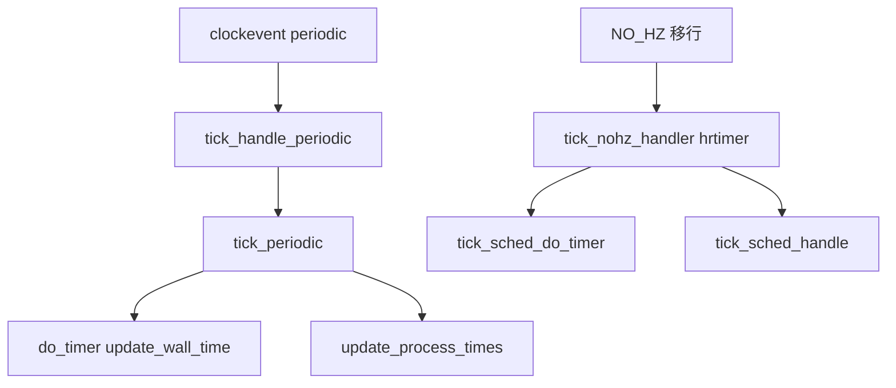

# 第13章 tick デバイスと周期 tick

> **本章で読むソース**
>
> - [`kernel/time/tick-common.c` L86-L103](https://github.com/gregkh/linux/blob/v6.18.38/kernel/time/tick-common.c#L86-L103)
> - [`kernel/time/tick-common.c` L108-L124](https://github.com/gregkh/linux/blob/v6.18.38/kernel/time/tick-common.c#L108-L124)
> - [`kernel/time/tick-sched.c` L253-L277](https://github.com/gregkh/linux/blob/v6.18.38/kernel/time/tick-sched.c#L253-L277)
> - [`kernel/time/tick-sched.c` L284-L299](https://github.com/gregkh/linux/blob/v6.18.38/kernel/time/tick-sched.c#L284-L299)
> - [`kernel/time/tick-sched.c` L206-L232](https://github.com/gregkh/linux/blob/v6.18.38/kernel/time/tick-sched.c#L206-L232)
> - [`kernel/time/tick-sched.c` L1570-L1597](https://github.com/gregkh/linux/blob/v6.18.38/kernel/time/tick-sched.c#L1570-L1597)

## この章の狙い

**tick** が jiffies、プロセス時間、プロファイルを進める役割と、周期 handler から oneshot モードへの移行を読む。
`tick_periodic()` と `tick_sched_handle()` が NO_HZ 前の基本形である。

## 前提

- [第10章 clocksource と clockevents](../part02-timer/10-clocksource-clockevents.md) で clockevent 登録を読んでいること。
- [第12章 timekeeping](../part02-timer/12-timekeeping.md) で `update_wall_time()` を読んでいること。

## tick_periodic：jiffies と wall time

1 CPU（`tick_do_timer_cpu`）が `jiffies_lock` を取り、`do_timer(1)` で jiffies を増やす。
同じ tick で `update_wall_time()` が呼ばれ、全 CPU で `update_process_times()` が走る。

[`kernel/time/tick-common.c` L86-L103](https://github.com/gregkh/linux/blob/v6.18.38/kernel/time/tick-common.c#L86-L103)

```c
static void tick_periodic(int cpu)
{
	if (READ_ONCE(tick_do_timer_cpu) == cpu) {
		raw_spin_lock(&jiffies_lock);
		write_seqcount_begin(&jiffies_seq);

		/* Keep track of the next tick event */
		tick_next_period = ktime_add_ns(tick_next_period, TICK_NSEC);

		do_timer(1);
		write_seqcount_end(&jiffies_seq);
		raw_spin_unlock(&jiffies_lock);
		update_wall_time();
	}

	update_process_times(user_mode(get_irq_regs()));
	profile_tick(CPU_PROFILING);
}
```

`tick_do_timer_cpu` の単一化は、SMP でも jiffies 更新を1か所に集約するためである。

## tick_handle_periodic：clockevent handler

周期モードの clockevent は `tick_handle_periodic()` を handler に持つ。
handler 内で local timer が HIGHRES へ切り替わった場合は早期 return する。

[`kernel/time/tick-common.c` L108-L124](https://github.com/gregkh/linux/blob/v6.18.38/kernel/time/tick-common.c#L108-L124)

```c
void tick_handle_periodic(struct clock_event_device *dev)
{
	int cpu = smp_processor_id();
	ktime_t next = dev->next_event;

	tick_periodic(cpu);

	/*
	 * The cpu might have transitioned to HIGHRES or NOHZ mode via
	 * update_process_times() -> run_local_timers() ->
	 * hrtimer_run_queues().
	 */
	if (IS_ENABLED(CONFIG_TICK_ONESHOT) && dev->event_handler != tick_handle_periodic)
		return;

	if (!clockevent_state_oneshot(dev))
		return;
```

oneshot デバイスではループ内で `next` を `TICK_NSEC` ずつ進めて再 program する（以降の for ループ）。

## tick_sched_handle：NO_HZ 下での tick 仕事

NO_HZ 有効時、停止していた tick が再開すると `tick_sched_handle()` がスケジューラ時間と watchdog を更新する。

[`kernel/time/tick-sched.c` L253-L277](https://github.com/gregkh/linux/blob/v6.18.38/kernel/time/tick-sched.c#L253-L277)

```c
static void tick_sched_handle(struct tick_sched *ts, struct pt_regs *regs)
{
	/*
	 * When we are idle and the tick is stopped, we have to touch
	 * the watchdog as we might not schedule for a really long
	 * time. This happens on completely idle SMP systems while
	 * waiting on the login prompt. We also increment the "start of
	 * idle" jiffy stamp so the idle accounting adjustment we do
	 * when we go busy again does not account too many ticks.
	 */
	if (IS_ENABLED(CONFIG_NO_HZ_COMMON) &&
	    tick_sched_flag_test(ts, TS_FLAG_STOPPED)) {
		touch_softlockup_watchdog_sched();
		if (is_idle_task(current))
			ts->idle_jiffies++;
		/*
		 * In case the current tick fired too early past its expected
		 * expiration, make sure we don't bypass the next clock reprogramming
		 * to the same deadline.
		 */
		ts->next_tick = 0;
	}

	update_process_times(user_mode(regs));
	profile_tick(CPU_PROFILING);
```

## tick_nohz_handler：hrtimer ベースの sched tick

NO_HZ では `tick_sched.sched_timer` という hrtimer が `tick_nohz_handler()` を呼ぶ。
`tick_sched_do_timer()` で jiffies 更新を担い、regs があれば `tick_sched_handle()` へ進む。

[`kernel/time/tick-sched.c` L284-L299](https://github.com/gregkh/linux/blob/v6.18.38/kernel/time/tick-sched.c#L284-L299)

```c
static enum hrtimer_restart tick_nohz_handler(struct hrtimer *timer)
{
	struct tick_sched *ts =	container_of(timer, struct tick_sched, sched_timer);
	struct pt_regs *regs = get_irq_regs();
	ktime_t now = ktime_get();

	tick_sched_do_timer(ts, now);

	/*
	 * Do not call when we are not in IRQ context and have
	 * no valid 'regs' pointer
	 */
	if (regs)
		tick_sched_handle(ts, regs);
	else
		ts->next_tick = 0;
```

## tick_sched_do_timer：jiffies 更新の担当

NO_HZ 下では `tick_do_timer_cpu` が未割当のとき local CPU が担当を引き受ける。
担当 CPU だけが `tick_do_update_jiffies64()` で jiffies を進める。

[`kernel/time/tick-sched.c` L206-L232](https://github.com/gregkh/linux/blob/v6.18.38/kernel/time/tick-sched.c#L206-L232)

```c
static void tick_sched_do_timer(struct tick_sched *ts, ktime_t now)
{
	int tick_cpu, cpu = smp_processor_id();

	/*
	 * Check if the do_timer duty was dropped. We don't care about
	 * concurrency: This happens only when the CPU in charge went
	 * into a long sleep. If two CPUs happen to assign themselves to
	 * this duty, then the jiffies update is still serialized by
	 * 'jiffies_lock'.
	 *
	 * If nohz_full is enabled, this should not happen because the
	 * 'tick_do_timer_cpu' CPU never relinquishes.
	 */
	tick_cpu = READ_ONCE(tick_do_timer_cpu);

	if (IS_ENABLED(CONFIG_NO_HZ_COMMON) && unlikely(tick_cpu == TICK_DO_TIMER_NONE)) {
#ifdef CONFIG_NO_HZ_FULL
		WARN_ON_ONCE(tick_nohz_full_running);
#endif
		WRITE_ONCE(tick_do_timer_cpu, cpu);
		tick_cpu = cpu;
	}

	/* Check if jiffies need an update */
	if (tick_cpu == cpu)
		tick_do_update_jiffies64(now);
```

stall 検出で `MAX_STALLED_JIFFIES` 超過時に強制更新する処理が続く（以降のコード）。

## tick_setup_sched_timer：sched tick 用 hrtimer

NO_HZ 移行時 `tick_nohz_switch_to_nohz()` は `tick_setup_sched_timer()` で per-CPU の `sched_timer` を初期化する。
HIGHRES 有効時は hrtimer として start し、そうでなければ `tick_program_event()` で clockevent を program する。

[`kernel/time/tick-sched.c` L1570-L1597](https://github.com/gregkh/linux/blob/v6.18.38/kernel/time/tick-sched.c#L1570-L1597)

```c
void tick_setup_sched_timer(bool hrtimer)
{
	struct tick_sched *ts = this_cpu_ptr(&tick_cpu_sched);

	/* Emulate tick processing via per-CPU hrtimers: */
	hrtimer_setup(&ts->sched_timer, tick_nohz_handler, CLOCK_MONOTONIC, HRTIMER_MODE_ABS_HARD);

	if (IS_ENABLED(CONFIG_HIGH_RES_TIMERS) && hrtimer)
		tick_sched_flag_set(ts, TS_FLAG_HIGHRES);

	/* Get the next period (per-CPU) */
	hrtimer_set_expires(&ts->sched_timer, tick_init_jiffy_update());

	/* Offset the tick to avert 'jiffies_lock' contention. */
	if (sched_skew_tick) {
		u64 offset = TICK_NSEC >> 1;
		do_div(offset, num_possible_cpus());
		offset *= smp_processor_id();
		hrtimer_add_expires_ns(&ts->sched_timer, offset);
	}

	hrtimer_forward_now(&ts->sched_timer, TICK_NSEC);
	if (IS_ENABLED(CONFIG_HIGH_RES_TIMERS) && hrtimer)
		hrtimer_start_expires(&ts->sched_timer, HRTIMER_MODE_ABS_PINNED_HARD);
	else
		tick_program_event(hrtimer_get_expires(&ts->sched_timer), 1);
	tick_nohz_activate(ts);
}
```

**最適化の工夫**：周期 tick は常に HZ 回割り込むが、oneshot と NO_HZ は次に必要なイベントだけ program する。
idle 中は sched tick 自体を止め、割り込みかタイマー満了時だけ jiffies を進める（第15章）。

## 処理の流れ：周期 tick から oneshot へ



## まとめ

- 周期 tick は1 CPU が jiffies を更新し、全 CPU がプロセス時間を進める。
- clockevent handler から local timers 経由で HIGHRES へ移行しうる。
- NO_HZ では hrtimer ベースの `tick_nohz_handler()` が tick 仕事を担う。
- idle 中の watchdog と jiffies 補正は `tick_sched_handle()` に含まれる。

## 関連する章

- [第12章 timekeeping](../part02-timer/12-timekeeping.md)
- [第15章 NO_HZ](15-no-hz.md)
- [プロセスとスケジューラ 第4部 PSI 等](../../sched/README.md)
