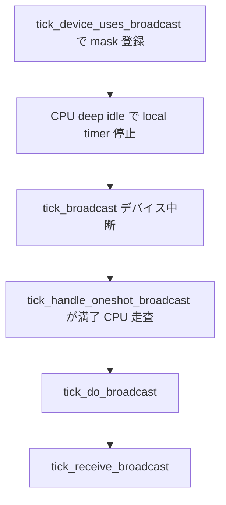

# 第14章 tick broadcast

> **本章で読むソース**
>
> - [`kernel/time/tick-broadcast.c` L27-L33](https://github.com/gregkh/linux/blob/v6.18.38/kernel/time/tick-broadcast.c#L27-L33)
> - [`kernel/time/tick-broadcast.c` L232-L241](https://github.com/gregkh/linux/blob/v6.18.38/kernel/time/tick-broadcast.c#L232-L241)
> - [`kernel/time/tick-broadcast.c` L247-L326](https://github.com/gregkh/linux/blob/v6.18.38/kernel/time/tick-broadcast.c#L247-L326)
> - [`kernel/time/tick-broadcast.c` L328-L341](https://github.com/gregkh/linux/blob/v6.18.38/kernel/time/tick-broadcast.c#L328-L341)
> - [`kernel/time/tick-broadcast.c` L346-L385](https://github.com/gregkh/linux/blob/v6.18.38/kernel/time/tick-broadcast.c#L346-L385)
> - [`kernel/time/tick-broadcast.c` L670-L685](https://github.com/gregkh/linux/blob/v6.18.38/kernel/time/tick-broadcast.c#L670-L685)
> - [`kernel/time/tick-broadcast-hrtimer.c` L18-L104](https://github.com/gregkh/linux/blob/v6.18.38/kernel/time/tick-broadcast-hrtimer.c#L18-L104)
> - [`kernel/time/tick-broadcast.c` L770-L862](https://github.com/gregkh/linux/blob/v6.18.38/kernel/time/tick-broadcast.c#L770-L862)

## この章の狙い

深い idle で **local clockevent** が停止（`CLOCK_EVT_FEAT_C3STOP`）すると、周期 tick や oneshot イベントを **broadcast デバイス**が代わりに配信する。
`tick_broadcast_mask` と `tick_handle_oneshot_broadcast` の流れを読み、[第15章 NO_HZ](15-no-hz.md) の dyntick idle と接続する。

## 前提

- [第13章 tick デバイスと周期 tick](13-tick-device.md) で per-CPU `tick_device` を読んでいること。
- [第10章 clocksource と clockevents](../part02-timer/10-clocksource-clockevents.md) で `clock_event_device` の feature フラグを押さえていること。

## broadcast デバイスとマスク

グローバルな `tick_broadcast_device` が代替 tick 源となり、`tick_broadcast_mask` が broadcast 依存 CPU を記録する。
`tick_broadcast_lock` が mask 更新と broadcast 実行を直列化する。

[`kernel/time/tick-broadcast.c` L27-L33](https://github.com/gregkh/linux/blob/v6.18.38/kernel/time/tick-broadcast.c#L27-L33)

```c
static struct tick_device tick_broadcast_device;
static cpumask_var_t tick_broadcast_mask __cpumask_var_read_mostly;
static cpumask_var_t tick_broadcast_on __cpumask_var_read_mostly;
static cpumask_var_t tmpmask __cpumask_var_read_mostly;
static int tick_broadcast_forced;

static __cacheline_aligned_in_smp DEFINE_RAW_SPINLOCK(tick_broadcast_lock);
```

local デバイスが periodic/oneshot を両方サポートしない placeholder の場合、`tick_device_uses_broadcast` が CPU を mask に載せ、broadcast 側の handler を設定する。
`CLOCK_EVT_FEAT_C3STOP` を持つデバイスは deep idle で止まるため、broadcast 関数を必ず用意する。

[`kernel/time/tick-broadcast.c` L232-L241](https://github.com/gregkh/linux/blob/v6.18.38/kernel/time/tick-broadcast.c#L232-L241)

```c
static void tick_device_setup_broadcast_func(struct clock_event_device *dev)
{
	if (!dev->broadcast)
		dev->broadcast = tick_broadcast;
	if (!dev->broadcast) {
		pr_warn_once("%s depends on broadcast, but no broadcast function available\n",
			     dev->name);
		dev->broadcast = err_broadcast;
	}
}
```

[`kernel/time/tick-broadcast.c` L247-L326](https://github.com/gregkh/linux/blob/v6.18.38/kernel/time/tick-broadcast.c#L247-L326)

```c
int tick_device_uses_broadcast(struct clock_event_device *dev, int cpu)
{
	struct clock_event_device *bc = tick_broadcast_device.evtdev;
	unsigned long flags;
	int ret = 0;

	raw_spin_lock_irqsave(&tick_broadcast_lock, flags);

	/*
	 * Devices might be registered with both periodic and oneshot
	 * mode disabled. This signals, that the device needs to be
	 * operated from the broadcast device and is a placeholder for
	 * the cpu local device.
	 */
	if (!tick_device_is_functional(dev)) {
		dev->event_handler = tick_handle_periodic;
		tick_device_setup_broadcast_func(dev);
		cpumask_set_cpu(cpu, tick_broadcast_mask);
		if (tick_broadcast_device.mode == TICKDEV_MODE_PERIODIC)
			tick_broadcast_start_periodic(bc);
		else
			tick_broadcast_setup_oneshot(bc, false);
		ret = 1;
	} else {
		/*
		 * Clear the broadcast bit for this cpu if the
		 * device is not power state affected.
		 */
		if (!(dev->features & CLOCK_EVT_FEAT_C3STOP))
			cpumask_clear_cpu(cpu, tick_broadcast_mask);
		else
			tick_device_setup_broadcast_func(dev);

		// ... (中略) ...
	}
	raw_spin_unlock_irqrestore(&tick_broadcast_lock, flags);
	return ret;
}
```

## 配信 tick_do_broadcast と受信側

broadcast デバイスが中断を起こすと `tick_do_broadcast` が mask 上の CPU へ IPI 相当の通知を行う。
各 CPU の `tick_receive_broadcast` は local `event_handler` を直接呼び、jiffies 更新や hrtimer 処理へつなげる。

[`kernel/time/tick-broadcast.c` L328-L341](https://github.com/gregkh/linux/blob/v6.18.38/kernel/time/tick-broadcast.c#L328-L341)

```c
int tick_receive_broadcast(void)
{
	struct tick_device *td = this_cpu_ptr(&tick_cpu_device);
	struct clock_event_device *evt = td->evtdev;

	if (!evt)
		return -ENODEV;

	if (!evt->event_handler)
		return -EINVAL;

	evt->event_handler(evt);
	return 0;
}
```

[`kernel/time/tick-broadcast.c` L346-L385](https://github.com/gregkh/linux/blob/v6.18.38/kernel/time/tick-broadcast.c#L346-L385)

```c
static bool tick_do_broadcast(struct cpumask *mask)
{
	int cpu = smp_processor_id();
	struct tick_device *td;
	bool local = false;

	/*
	 * Check, if the current cpu is in the mask
	 */
	if (cpumask_test_cpu(cpu, mask)) {
		struct clock_event_device *bc = tick_broadcast_device.evtdev;

		cpumask_clear_cpu(cpu, mask);
		/*
		 * We only run the local handler, if the broadcast
		 * device is not hrtimer based. Otherwise we run into
		 * a hrtimer recursion.
		 *
		 * local timer_interrupt()
		 *   local_handler()
		 *     expire_hrtimers()
		 *       bc_handler()
		 *         local_handler()
		 *	     expire_hrtimers()
		 */
		local = !(bc->features & CLOCK_EVT_FEAT_HRTIMER);
	}

	if (!cpumask_empty(mask)) {
		/*
		 * It might be necessary to actually check whether the devices
		 * have different broadcast functions. For now, just use the
		 * one of the first device. This works as long as we have this
		 * misfeature only on x86 (lapic)
		 */
		td = &per_cpu(tick_cpu_device, cpumask_first(mask));
		td->evtdev->broadcast(mask);
	}
	return local;
}
```

## hrtimer ベース broadcast デバイス

`CLOCK_EVT_FEAT_HRTIMER` 付き pseudo clockevent は `tick-broadcast-hrtimer.c` が提供する。
グローバル `bctimer` を `bc_set_next` で program し、満了時 `bc_handler` が `tick_handle_oneshot_broadcast` 相当の handler を呼ぶ。

[`kernel/time/tick-broadcast-hrtimer.c` L18-L104](https://github.com/gregkh/linux/blob/v6.18.38/kernel/time/tick-broadcast-hrtimer.c#L18-L104)

```c
static struct hrtimer bctimer;

static int bc_set_next(ktime_t expires, struct clock_event_device *bc)
{
	// ... (中略) ...

	hrtimer_start(&bctimer, expires, HRTIMER_MODE_ABS_PINNED_HARD);
	/*
	 * The core tick broadcast mode expects bc->bound_on to be set
	 * correctly to prevent a CPU which has the broadcast hrtimer
	 * armed from going deep idle.
	 *
	 * As tick_broadcast_lock is held, nothing can change the cpu
	 * base which was just established in hrtimer_start() above. So
	 * the below access is safe even without holding the hrtimer
	 * base lock.
	 */
	bc->bound_on = bctimer.base->cpu_base->cpu;

	return 0;
}

static struct clock_event_device ce_broadcast_hrtimer = {
	.name			= "bc_hrtimer",
	.set_state_shutdown	= bc_shutdown,
	.set_next_ktime		= bc_set_next,
	.features		= CLOCK_EVT_FEAT_ONESHOT |
				  CLOCK_EVT_FEAT_KTIME |
				  CLOCK_EVT_FEAT_HRTIMER,
	// ... (中略) ...
};

static enum hrtimer_restart bc_handler(struct hrtimer *t)
{
	ce_broadcast_hrtimer.event_handler(&ce_broadcast_hrtimer);

	return HRTIMER_NORESTART;
}

void tick_setup_hrtimer_broadcast(void)
{
	hrtimer_setup(&bctimer, bc_handler, CLOCK_MONOTONIC, HRTIMER_MODE_ABS_HARD);
	clockevents_register_device(&ce_broadcast_hrtimer);
}
```

broadcast hrtimer を所有する CPU は deep idle に入れない。
`broadcast_needs_cpu` は `bc->bound_on == cpu` のとき `-EBUSY` を返し、`___tick_broadcast_oneshot_control` の ENTER path が mask 追加を拒否する。

[`kernel/time/tick-broadcast.c` L770-L862](https://github.com/gregkh/linux/blob/v6.18.38/kernel/time/tick-broadcast.c#L770-L862)

```c
static int broadcast_needs_cpu(struct clock_event_device *bc, int cpu)
{
	if (!(bc->features & CLOCK_EVT_FEAT_HRTIMER))
		return 0;
	if (bc->next_event == KTIME_MAX)
		return 0;
	return bc->bound_on == cpu ? -EBUSY : 0;
}

// ... (中略) ...

	if (state == TICK_BROADCAST_ENTER) {
		/*
		 * If the current CPU owns the hrtimer broadcast
		 * mechanism, it cannot go deep idle and we do not add
		 * the CPU to the broadcast mask. We don't have to go
		 * through the EXIT path as the local timer is not
		 * shutdown.
		 */
		ret = broadcast_needs_cpu(bc, cpu);
		if (ret)
			goto out;

		// ... (中略) ...

			} else if (dev->next_event < bc->next_event) {
				tick_broadcast_set_event(bc, cpu, dev->next_event);
				/*
				 * In case of hrtimer broadcasts the
				 * programming might have moved the
				 * timer to this cpu. If yes, remove
				 * us from the broadcast mask and
				 * return busy.
				 */
				ret = broadcast_needs_cpu(bc, cpu);
				if (ret) {
					cpumask_clear_cpu(cpu,
						tick_broadcast_oneshot_mask);
				}
			}
		}
	}
```

## oneshot broadcast ハンドラ

NO_HZ oneshot では `tick_broadcast_oneshot_mask` が deep idle CPU を追跡する。
`tick_handle_oneshot_broadcast` は満了した remote CPU を `tmpmask` に集め、次の最早イベントで broadcast デバイスを再 program する。

[`kernel/time/tick-broadcast.c` L690-L767](https://github.com/gregkh/linux/blob/v6.18.38/kernel/time/tick-broadcast.c#L690-L767)

```c
static void tick_handle_oneshot_broadcast(struct clock_event_device *dev)
{
	struct tick_device *td;
	ktime_t now, next_event;
	int cpu, next_cpu = 0;
	bool bc_local;

	raw_spin_lock(&tick_broadcast_lock);
	dev->next_event = KTIME_MAX;
	next_event = KTIME_MAX;
	cpumask_clear(tmpmask);
	now = ktime_get();
	/* Find all expired events */
	for_each_cpu(cpu, tick_broadcast_oneshot_mask) {
		// ... (中略) ...

		td = &per_cpu(tick_cpu_device, cpu);
		if (td->evtdev->next_event <= now) {
			cpumask_set_cpu(cpu, tmpmask);
			/*
			 * Mark the remote cpu in the pending mask, so
			 * it can avoid reprogramming the cpu local
			 * timer in tick_broadcast_oneshot_control().
			 */
			cpumask_set_cpu(cpu, tick_broadcast_pending_mask);
		} else if (td->evtdev->next_event < next_event) {
			next_event = td->evtdev->next_event;
			next_cpu = cpu;
		}
	}

	// ... (中略) ...

	bc_local = tick_do_broadcast(tmpmask);

	// ... (中略) ...

	if (next_event != KTIME_MAX)
		tick_broadcast_set_event(dev, next_cpu, next_event);

	raw_spin_unlock(&tick_broadcast_lock);

	if (bc_local) {
		td = this_cpu_ptr(&tick_cpu_device);
		td->evtdev->event_handler(td->evtdev);
	}
}
```

idle から割り込みで復帰した CPU は `tick_check_oneshot_broadcast_this_cpu` が local clockevent を oneshot 状態へ戻す。
NO_HZ 章の dyntick 停止中に broadcast 経由でイベントを受け取った CPU が、local タイマーを再開できる。

[`kernel/time/tick-broadcast.c` L670-L685](https://github.com/gregkh/linux/blob/v6.18.38/kernel/time/tick-broadcast.c#L670-L685)

```c
void tick_check_oneshot_broadcast_this_cpu(void)
{
	if (cpumask_test_cpu(smp_processor_id(), tick_broadcast_oneshot_mask)) {
		struct tick_device *td = this_cpu_ptr(&tick_cpu_device);

		/*
		 * We might be in the middle of switching over from
		 * periodic to oneshot. If the CPU has not yet
		 * switched over, leave the device alone.
		 */
		if (td->mode == TICKDEV_MODE_ONESHOT) {
			clockevents_switch_state(td->evtdev,
					      CLOCK_EVT_STATE_ONESHOT);
		}
	}
}
```

## 処理の流れ



## 高速化と最適化の工夫

C3STOP デバイスは deep idle で電源を切れる代わりに local tick を失う。
broadcast デバイス1つで複数 sleeping CPU の oneshot イベントをまとめて監視し、満了 CPU だけを `tmpmask` で wake する。
`tick_broadcast_pending_mask` は remote CPU が local reprogram をスキップするためのフラグであり、無駄な clockevent 書き込みを減らす。
hrtimer ベース broadcast は PIT より細かい ktime 解像度で oneshot を program できる。
`bound_on` 制約により broadcast hrtimer 所有 CPU が deep idle へ落ち、満了を見逃す競合を避ける。
`tick_broadcast_pending_mask` は remote CPU が local reprogram をスキップするためのフラグであり、無駄な clockevent 書き込みを減らす。

## CONFIG 依存

`CONFIG_GENERIC_CLOCKEVENTS_BROADCAST` が無効のとき、oneshot broadcast 関連関数は stub となり、C3STOP デバイスを持つ構成では deep idle 時の tick 代替が制限される。
`CONFIG_NO_HZ_COMMON` と組み合わさった SMP 構成で本章の oneshot broadcast が主に使われる。

## まとめ

- **tick_broadcast_device** が local timer 停止中 CPU への tick 代替源になる。
- **tick_broadcast_mask** が broadcast 依存 CPU を記録する。
- **tick_handle_oneshot_broadcast** が NO_HZ oneshot 下の満了イベントを集約配信する。
- NO_HZ idle と clockevent 章の接続点である。

## 関連する章

- [第13章 tick デバイスと周期 tick](13-tick-device.md)
- [第15章 NO_HZ](15-no-hz.md)
- [第10章 clocksource と clockevents](../part02-timer/10-clocksource-clockevents.md)
