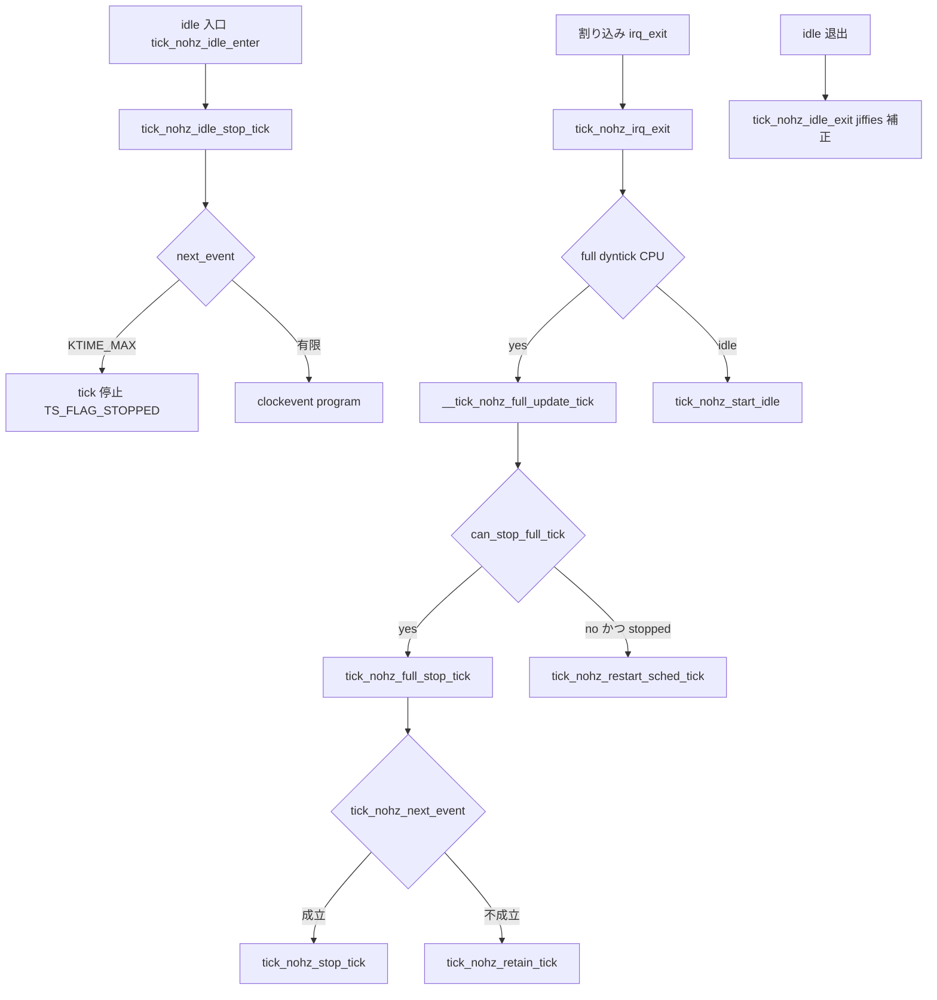

# 第15章 NO_HZ

> **本章で読むソース**
>
> - [`kernel/time/tick-sched.c` L673-L683](https://github.com/gregkh/linux/blob/v6.18.38/kernel/time/tick-sched.c#L673-L683)
> - [`kernel/time/tick-sched.c` L1204-L1237](https://github.com/gregkh/linux/blob/v6.18.38/kernel/time/tick-sched.c#L1204-L1237)
> - [`kernel/time/tick-sched.c` L1287-L1295](https://github.com/gregkh/linux/blob/v6.18.38/kernel/time/tick-sched.c#L1287-L1295)
> - [`kernel/time/tick-sched.c` L1339-L1369](https://github.com/gregkh/linux/blob/v6.18.38/kernel/time/tick-sched.c#L1339-L1369)
> - [`kernel/time/tick-sched.c` L1503-L1516](https://github.com/gregkh/linux/blob/v6.18.38/kernel/time/tick-sched.c#L1503-L1516)
> - [`kernel/time/tick-sched.c` L969-L1070](https://github.com/gregkh/linux/blob/v6.18.38/kernel/time/tick-sched.c#L969-L1070)
> - [`kernel/time/tick-sched.c` L358-L378](https://github.com/gregkh/linux/blob/v6.18.38/kernel/time/tick-sched.c#L358-L378)
> - [`kernel/time/tick-sched.c` L1106-L1128](https://github.com/gregkh/linux/blob/v6.18.38/kernel/time/tick-sched.c#L1106-L1128)
> - [`kernel/time/tick-sched.c` L1078-L1085](https://github.com/gregkh/linux/blob/v6.18.38/kernel/time/tick-sched.c#L1078-L1085)

## この章の狙い

**NO_HZ**（dyntick）が idle 中と full dyntick モードで sched tick を止め、次イベントまで sleep する仕組みを読む。
`tick_nohz_idle_stop_tick()` から clockevent 再 program、割り込み出口での tick 再開までを追う。

## 前提

- [第13章 tick デバイスと周期 tick](13-tick-device.md) で `tick_nohz_handler()` を読んでいること。
- [第9章 hrtimer](../part02-timer/09-hrtimer.md) で clockevent 再 program を読んでいること。

## NO_HZ の有効化

`CONFIG_NO_HZ_COMMON` 有効時、ブートパラメータ `nohz=` で `tick_nohz_enabled` を制御できる。
`tick_nohz_active` は oneshot モードへ移行したことを示す。

[`kernel/time/tick-sched.c` L673-L683](https://github.com/gregkh/linux/blob/v6.18.38/kernel/time/tick-sched.c#L673-L683)

```c
bool tick_nohz_enabled __read_mostly  = true;
unsigned long tick_nohz_active  __read_mostly;
/*
 * Enable / Disable tickless mode
 */
static int __init setup_tick_nohz(char *str)
{
	return (kstrtobool(str, &tick_nohz_enabled) == 0);
}

__setup("nohz=", setup_tick_nohz);
```

## idle 入口：tick_nohz_idle_stop_tick

idle タスクが CPU を手放す直前、`tick_nohz_idle_stop_tick()` が次イベント時刻を計算し、不要なら sched tick を停止する。

[`kernel/time/tick-sched.c` L1204-L1237](https://github.com/gregkh/linux/blob/v6.18.38/kernel/time/tick-sched.c#L1204-L1237)

```c
void tick_nohz_idle_stop_tick(void)
{
	struct tick_sched *ts = this_cpu_ptr(&tick_cpu_sched);
	int cpu = smp_processor_id();
	ktime_t expires;

	/*
	 * If tick_nohz_get_sleep_length() ran tick_nohz_next_event(), the
	 * tick timer expiration time is known already.
	 */
	if (ts->timer_expires_base)
		expires = ts->timer_expires;
	else if (can_stop_idle_tick(cpu, ts))
		expires = tick_nohz_next_event(ts, cpu);
	else
		return;

	ts->idle_calls++;

	if (expires > 0LL) {
		int was_stopped = tick_sched_flag_test(ts, TS_FLAG_STOPPED);

		tick_nohz_stop_tick(ts, cpu);

		ts->idle_sleeps++;
		ts->idle_expires = expires;

		if (!was_stopped && tick_sched_flag_test(ts, TS_FLAG_STOPPED)) {
			ts->idle_jiffies = ts->last_jiffies;
			nohz_balance_enter_idle(cpu);
		}
	} else {
		tick_nohz_retain_tick(ts);
	}
```

`tick_nohz_next_event()` は timer、hrtimer、RCU、scheduler などの依存（tick_dep）を見て最短 wake-up を求める。

## tick_nohz_stop_tick：sched tick 停止と clockevent 再 program

idle 入口で次イベントが有限なら `tick_nohz_stop_tick()` が timer base を idle 化し、`TS_FLAG_STOPPED` を立てる。
jiffies 更新担当 CPU なら `tick_do_timer_cpu` を解放し、満了時刻を hrtimer または clockevent へ program する。

[`kernel/time/tick-sched.c` L969-L1070](https://github.com/gregkh/linux/blob/v6.18.38/kernel/time/tick-sched.c#L969-L1070)

```c
static void tick_nohz_stop_tick(struct tick_sched *ts, int cpu)
{
	struct clock_event_device *dev = __this_cpu_read(tick_cpu_device.evtdev);
	unsigned long basejiff = ts->last_jiffies;
	u64 basemono = ts->timer_expires_base;
	bool timer_idle = tick_sched_flag_test(ts, TS_FLAG_STOPPED);
	int tick_cpu;
	u64 expires;

	/* Make sure we won't be trying to stop it twice in a row. */
	ts->timer_expires_base = 0;

	/*
	 * Now the tick should be stopped definitely - so the timer base needs
	 * to be marked idle as well to not miss a newly queued timer.
	 */
	expires = timer_base_try_to_set_idle(basejiff, basemono, &timer_idle);
	if (expires > ts->timer_expires) {
		/*
		 * This path could only happen when the first timer was removed
		 * between calculating the possible sleep length and now (when
		 * high resolution mode is not active, timer could also be a
		 * hrtimer).
		 *
		 * We have to stick to the original calculated expiry value to
		 * not stop the tick for too long with a shallow C-state (which
		 * was programmed by cpuidle because of an early next expiration
		 * value).
		 */
		expires = ts->timer_expires;
	}

	/* If the timer base is not idle, retain the not yet stopped tick. */
	if (!timer_idle)
		return;

	/*
	 * If this CPU is the one which updates jiffies, then give up
	 * the assignment and let it be taken by the CPU which runs
	 * the tick timer next, which might be this CPU as well. If we
	 * don't drop this here, the jiffies might be stale and
	 * do_timer() never gets invoked. Keep track of the fact that it
	 * was the one which had the do_timer() duty last.
	 */
	tick_cpu = READ_ONCE(tick_do_timer_cpu);
	if (tick_cpu == cpu) {
		WRITE_ONCE(tick_do_timer_cpu, TICK_DO_TIMER_NONE);
		tick_sched_flag_set(ts, TS_FLAG_DO_TIMER_LAST);
	} else if (tick_cpu != TICK_DO_TIMER_NONE) {
		tick_sched_flag_clear(ts, TS_FLAG_DO_TIMER_LAST);
	}

	/* Skip reprogram of event if it's not changed */
	if (tick_sched_flag_test(ts, TS_FLAG_STOPPED) && (expires == ts->next_tick)) {
		/* Sanity check: make sure clockevent is actually programmed */
		if (expires == KTIME_MAX || ts->next_tick == hrtimer_get_expires(&ts->sched_timer))
			return;

		WARN_ONCE(1, "basemono: %llu ts->next_tick: %llu dev->next_event: %llu "
			  "timer->active: %d timer->expires: %llu\n", basemono, ts->next_tick,
			  dev->next_event, hrtimer_active(&ts->sched_timer),
			  hrtimer_get_expires(&ts->sched_timer));
	}

	/*
	 * tick_nohz_stop_tick() can be called several times before
	 * tick_nohz_restart_sched_tick() is called. This happens when
	 * interrupts arrive which do not cause a reschedule. In the first
	 * call we save the current tick time, so we can restart the
	 * scheduler tick in tick_nohz_restart_sched_tick().
	 */
	if (!tick_sched_flag_test(ts, TS_FLAG_STOPPED)) {
		calc_load_nohz_start();
		quiet_vmstat();

		ts->last_tick = hrtimer_get_expires(&ts->sched_timer);
		tick_sched_flag_set(ts, TS_FLAG_STOPPED);
		trace_tick_stop(1, TICK_DEP_MASK_NONE);
	}

	ts->next_tick = expires;

	/*
	 * If the expiration time == KTIME_MAX, then we simply stop
	 * the tick timer.
	 */
	if (unlikely(expires == KTIME_MAX)) {
		if (tick_sched_flag_test(ts, TS_FLAG_HIGHRES))
			hrtimer_cancel(&ts->sched_timer);
		else
			tick_program_event(KTIME_MAX, 1);
		return;
	}

	if (tick_sched_flag_test(ts, TS_FLAG_HIGHRES)) {
		hrtimer_start(&ts->sched_timer, expires,
			      HRTIMER_MODE_ABS_PINNED_HARD);
	} else {
		hrtimer_set_expires(&ts->sched_timer, expires);
		tick_program_event(expires, 1);
	}
}
```

## 割り込み出口：tick_nohz_irq_exit

idle 中に割り込みが入ると、`tick_nohz_irq_exit()` が tick 再開の要否を判定する。
full dyntick CPU では `tick_nohz_full_update_tick()` が走る。

[`kernel/time/tick-sched.c` L1287-L1295](https://github.com/gregkh/linux/blob/v6.18.38/kernel/time/tick-sched.c#L1287-L1295)

```c
void tick_nohz_irq_exit(void)
{
	struct tick_sched *ts = this_cpu_ptr(&tick_cpu_sched);

	if (tick_sched_flag_test(ts, TS_FLAG_INIDLE))
		tick_nohz_start_idle(ts);
	else
		tick_nohz_full_update_tick(ts);
}
```

## 睡眠長の見積もり

cpufreq や idle ドライバは `tick_nohz_get_sleep_length()` で次 wake-up までの長さを取得できる。

[`kernel/time/tick-sched.c` L1339-L1369](https://github.com/gregkh/linux/blob/v6.18.38/kernel/time/tick-sched.c#L1339-L1369)

```c
ktime_t tick_nohz_get_sleep_length(ktime_t *delta_next)
{
	struct clock_event_device *dev = __this_cpu_read(tick_cpu_device.evtdev);
	struct tick_sched *ts = this_cpu_ptr(&tick_cpu_sched);
	int cpu = smp_processor_id();
	/*
	 * The idle entry time is expected to be a sufficient approximation of
	 * the current time at this point.
	 */
	ktime_t now = ts->idle_entrytime;
	ktime_t next_event;

	WARN_ON_ONCE(!tick_sched_flag_test(ts, TS_FLAG_INIDLE));

	*delta_next = ktime_sub(dev->next_event, now);

	if (!can_stop_idle_tick(cpu, ts))
		return *delta_next;

	next_event = tick_nohz_next_event(ts, cpu);
	if (!next_event)
		return *delta_next;

	/*
	 * If the next highres timer to expire is earlier than 'next_event', the
	 * idle governor needs to know that.
	 */
	next_event = min_t(u64, next_event,
			   hrtimer_next_event_without(&ts->sched_timer));

	return ktime_sub(next_event, now);
```

**最適化の工夫**：idle CPU で HZ 回の割り込みを止めると、電力消費と cache pollution が減る。
代わりにタイマーと hrtimer の満了時刻だけ clockevent に program し、必要なときだけ wake-up する。

## oneshot モードへの切り替え

初回に `tick_nohz_switch_to_nohz()` が `tick_switch_to_oneshot()` を呼び、周期 handler から oneshot handler へ移行する。

[`kernel/time/tick-sched.c` L1503-L1516](https://github.com/gregkh/linux/blob/v6.18.38/kernel/time/tick-sched.c#L1503-L1516)

```c
static void tick_nohz_switch_to_nohz(void)
{
	if (!tick_nohz_enabled)
		return;

	if (tick_switch_to_oneshot(tick_nohz_lowres_handler))
		return;

	/*
	 * Recycle the hrtimer in 'ts', so we can share the
	 * highres code.
	 */
	tick_setup_sched_timer(false);
}
```

`NO_HZ_FULL` は Housekeeping CPU 以外で sched tick 自体を最小化するモードである（`tick_nohz_full_cpu`）。

## NO_HZ_FULL：full dyntick CPU の tick 停止

idle 停止（本章前半の `tick_nohz_idle_stop_tick()`）とは別に、full dyntick CPU では実行中タスクでも tick を止めうる。
`can_stop_full_tick()` が global/per-CPU/current task/signal の `tick_dep` を順に確認する。

[`kernel/time/tick-sched.c` L358-L378](https://github.com/gregkh/linux/blob/v6.18.38/kernel/time/tick-sched.c#L358-L378)

```c
static bool can_stop_full_tick(int cpu, struct tick_sched *ts)
{
	lockdep_assert_irqs_disabled();

	if (unlikely(!cpu_online(cpu)))
		return false;

	if (check_tick_dependency(&tick_dep_mask))
		return false;

	if (check_tick_dependency(&ts->tick_dep_mask))
		return false;

	if (check_tick_dependency(&current->tick_dep_mask))
		return false;

	if (check_tick_dependency(&current->signal->tick_dep_mask))
		return false;

	return true;
}
```

割り込み出口の `tick_nohz_full_update_tick()` は `can_stop_full_tick()` を評価し、停止可能なら `tick_nohz_full_stop_tick()` へ進む。
`tick_nohz_full_stop_tick()` は `tick_nohz_next_event()` が次イベントを返せば `tick_nohz_stop_tick()` へ、返せなければ `tick_nohz_retain_tick()` で tick を維持する。

[`kernel/time/tick-sched.c` L1078-L1085](https://github.com/gregkh/linux/blob/v6.18.38/kernel/time/tick-sched.c#L1078-L1085)

```c
static void tick_nohz_full_stop_tick(struct tick_sched *ts, int cpu)
{
	if (tick_nohz_next_event(ts, cpu))
		tick_nohz_stop_tick(ts, cpu);
	else
		tick_nohz_retain_tick(ts);
}
```

停止不可で既に tick 停止中なら `tick_nohz_restart_sched_tick()` で再開する（次の引用）。

[`kernel/time/tick-sched.c` L1106-L1128](https://github.com/gregkh/linux/blob/v6.18.38/kernel/time/tick-sched.c#L1106-L1128)

```c
static void __tick_nohz_full_update_tick(struct tick_sched *ts,
					 ktime_t now)
{
#ifdef CONFIG_NO_HZ_FULL
	int cpu = smp_processor_id();

	if (can_stop_full_tick(cpu, ts))
		tick_nohz_full_stop_tick(ts, cpu);
	else if (tick_sched_flag_test(ts, TS_FLAG_STOPPED))
		tick_nohz_restart_sched_tick(ts, now);
#endif
}

static void tick_nohz_full_update_tick(struct tick_sched *ts)
{
	if (!tick_nohz_full_cpu(smp_processor_id()))
		return;

	if (!tick_sched_flag_test(ts, TS_FLAG_NOHZ))
		return;

	__tick_nohz_full_update_tick(ts, ktime_get());
}
```



## まとめ

- NO_HZ は sched tick を止め、次の timer または hrtimer 満了まで CPU を sleep させる。
- idle 入口の `tick_nohz_idle_stop_tick()` と full dyntick の `__tick_nohz_full_update_tick()` は tick 停止条件が異なる。
- idle 入口と割り込み出口で tick 状態を更新し、jiffies と watchdog を補う。
- `tick_dep` ビットで RCU、scheduler、timer などが tick 停止を禁止できる。
- oneshot clockevent への移行が NO_HZ の前提である。

## 関連する章

- [第13章 tick デバイスと周期 tick](13-tick-device.md)
- [第8章 タイマーホイール](../part02-timer/08-timer-wheel.md)
- [同期と RCU 第4部 Tree RCU](../../locking/part04-rcu/12-tree-rcu-gp.md)
