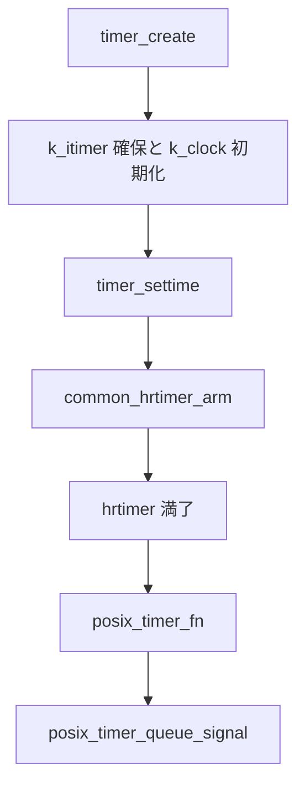

# 第17章 POSIX タイマー

> **本章で読むソース**
>
> - [`kernel/time/posix-timers.c` L465-L571](https://github.com/gregkh/linux/blob/v6.18.38/kernel/time/posix-timers.c#L465-L571)
> - [`kernel/time/posix-timers.c` L919-L950](https://github.com/gregkh/linux/blob/v6.18.38/kernel/time/posix-timers.c#L919-L950)
> - [`kernel/time/posix-timers.c` L367-L381](https://github.com/gregkh/linux/blob/v6.18.38/kernel/time/posix-timers.c#L367-L381)
> - [`kernel/time/posix-timers.c` L1431-L1448](https://github.com/gregkh/linux/blob/v6.18.38/kernel/time/posix-timers.c#L1431-L1448)
> - [`kernel/time/posix-timers.c` L805-L832](https://github.com/gregkh/linux/blob/v6.18.38/kernel/time/posix-timers.c#L805-L832)
> - [`kernel/time/posix-timers.c` L882-L917](https://github.com/gregkh/linux/blob/v6.18.38/kernel/time/posix-timers.c#L882-L917)
> - [`kernel/time/posix-timers.c` L954-L974](https://github.com/gregkh/linux/blob/v6.18.38/kernel/time/posix-timers.c#L954-L974)

## この章の狙い

`timer_create` から `k_itimer` が作られ、`k_clock` 経由で **hrtimer** に載る POSIX タイマー API のカーネル実装を読む。
満了時は `posix_timer_fn` が `posix_timer_queue_signal` を呼び、シグナル配送本体は [プロセスとスケジューラ](../../sched/README.md) 分冊の将来章の担当である。

## 前提

- [第9章 hrtimer](../part02-timer/09-hrtimer.md) で `hrtimer_start` と `HRTIMER_MODE_ABS` を読んでいること。
- [第12章 timekeeping](../part02-timer/12-timekeeping.md) で `CLOCK_REALTIME` と `CLOCK_MONOTONIC` の違いを押さえていること。

## timer_create と k_itimer

`do_timer_create` は clockid から `k_clock` を引き、`alloc_posix_timer` で `k_itimer` を確保する。
`sigevent` があれば通知先 pid と signo を設定し、hash 表へ timer id を割り当てたあと `kc->timer_create` で clock 種別ごとの初期化を行う。

[`kernel/time/posix-timers.c` L465-L571](https://github.com/gregkh/linux/blob/v6.18.38/kernel/time/posix-timers.c#L465-L571)

```c
static int do_timer_create(clockid_t which_clock, struct sigevent *event,
			   timer_t __user *created_timer_id)
{
	const struct k_clock *kc = clockid_to_kclock(which_clock);
	timer_t req_id = TIMER_ANY_ID;
	struct k_itimer *new_timer;
	int error, new_timer_id;

	// ... (中略) ...

	new_timer->it_clock = which_clock;
	new_timer->kclock = kc;
	new_timer->it_overrun = -1LL;

	if (event) {
		scoped_guard (rcu)
			new_timer->it_pid = get_pid(good_sigevent(event));
		if (!new_timer->it_pid) {
			error = -EINVAL;
			goto out;
		}
		new_timer->it_sigev_notify     = event->sigev_notify;
		new_timer->sigq.info.si_signo = event->sigev_signo;
		new_timer->sigq.info.si_value = event->sigev_value;
	} else {
		new_timer->it_sigev_notify     = SIGEV_SIGNAL;
		new_timer->sigq.info.si_signo = SIGALRM;
		new_timer->sigq.info.si_value.sival_int = new_timer->it_id;
		new_timer->it_pid = get_pid(task_tgid(current));
	}

	// ... (中略) ...

	if (copy_to_user(created_timer_id, &new_timer_id, sizeof (new_timer_id))) {
		error = -EFAULT;
		goto out;
	}
	/*
	 * After successful copy out, the timer ID is visible to user space
	 * now but not yet valid because new_timer::signal low order bit is 1.
	 *
	 * Complete the initialization with the clock specific create
	 * callback.
	 */
	error = kc->timer_create(new_timer);
	if (error)
		goto out;

	scoped_guard (spinlock_irq, &new_timer->it_lock) {
		guard(spinlock)(&current->sighand->siglock);
		WRITE_ONCE(new_timer->it_signal, current->signal);
		hlist_add_head_rcu(&new_timer->list, &current->signal->posix_timers);
	}
	return 0;
out:
	posix_timer_unhash_and_free(new_timer);
	return error;
}
```

`common_timer_create` は realtime/monotonic 系向けに `hrtimer_setup` で `posix_timer_fn` をコールバックに登録する。

[`kernel/time/posix-timers.c` L458-L462](https://github.com/gregkh/linux/blob/v6.18.38/kernel/time/posix-timers.c#L458-L462)

```c
static int common_timer_create(struct k_itimer *new_timer)
{
	hrtimer_setup(&new_timer->it.real.timer, posix_timer_fn, new_timer->it_clock, 0);
	return 0;
}
```

初期化完了後、`signal->posix_timers` リストへ RCU 付きでリンクされ、ユーザー空間へ timer id が返る。

[`kernel/time/posix-timers.c` L553-L562](https://github.com/gregkh/linux/blob/v6.18.38/kernel/time/posix-timers.c#L553-L562)

```c
	scoped_guard (spinlock_irq, &new_timer->it_lock) {
		guard(spinlock)(&current->sighand->siglock);
		/*
		 * new_timer::it_signal contains the signal pointer with
		 * bit 0 set, which makes it invalid for syscall operations.
		 * Store the unmodified signal pointer to make it valid.
		 */
		WRITE_ONCE(new_timer->it_signal, current->signal);
		hlist_add_head_rcu(&new_timer->list, &current->signal->posix_timers);
	}
```

## timer_settime と hrtimer arm

`common_timer_set` は既存 hrtimer を cancel し、新しい `it_value`/`it_interval` を `posix_timer_set_common` で反映する。
`k_clock->timer_arm` 経由で `common_hrtimer_arm` が呼ばれ、hrtimer が program される。

[`kernel/time/posix-timers.c` L882-L917](https://github.com/gregkh/linux/blob/v6.18.38/kernel/time/posix-timers.c#L882-L917)

```c
/* Set a POSIX.1b interval timer. */
int common_timer_set(struct k_itimer *timr, int flags,
		     struct itimerspec64 *new_setting,
		     struct itimerspec64 *old_setting)
{
	const struct k_clock *kc = timr->kclock;
	bool sigev_none;
	ktime_t expires;

	if (old_setting)
		common_timer_get(timr, old_setting);

	/*
	 * Careful here. On SMP systems the timer expiry function could be
	 * active and spinning on timr->it_lock.
	 */
	if (kc->timer_try_to_cancel(timr) < 0)
		return TIMER_RETRY;

	timr->it_status = POSIX_TIMER_DISARMED;
	posix_timer_set_common(timr, new_setting);

	/* Keep timer disarmed when it_value is zero */
	if (!new_setting->it_value.tv_sec && !new_setting->it_value.tv_nsec)
		return 0;

	expires = timespec64_to_ktime(new_setting->it_value);
	if (flags & TIMER_ABSTIME)
		expires = timens_ktime_to_host(timr->it_clock, expires);
	sigev_none = timr->it_sigev_notify == SIGEV_NONE;

	kc->timer_arm(timr, expires, flags & TIMER_ABSTIME, sigev_none);
	if (!sigev_none)
		timr->it_status = POSIX_TIMER_ARMED;
	return 0;
}
```

`common_hrtimer_arm` は relative `CLOCK_REALTIME` を monotonic ベースへ切り替える POSIX 互換の挙動を内包する。

[`kernel/time/posix-timers.c` L805-L832](https://github.com/gregkh/linux/blob/v6.18.38/kernel/time/posix-timers.c#L805-L832)

```c
static void common_hrtimer_arm(struct k_itimer *timr, ktime_t expires,
			       bool absolute, bool sigev_none)
{
	struct hrtimer *timer = &timr->it.real.timer;
	enum hrtimer_mode mode;

	mode = absolute ? HRTIMER_MODE_ABS : HRTIMER_MODE_REL;
	/*
	 * Posix magic: Relative CLOCK_REALTIME timers are not affected by
	 * clock modifications, so they become CLOCK_MONOTONIC based under the
	 * hood. See hrtimer_setup(). Update timr->kclock, so the generic
	 * functions which use timr->kclock->clock_get_*() work.
	 *
	 * Note: it_clock stays unmodified, because the next timer_set() might
	 * use ABSTIME, so it needs to switch back.
	 */
	if (timr->it_clock == CLOCK_REALTIME)
		timr->kclock = absolute ? &clock_realtime : &clock_monotonic;

	hrtimer_setup(&timr->it.real.timer, posix_timer_fn, timr->it_clock, mode);

	if (!absolute)
		expires = ktime_add_safe(expires, hrtimer_cb_get_time(timer));
	hrtimer_set_expires(timer, expires);

	if (!sigev_none)
		hrtimer_start_expires(timer, HRTIMER_MODE_ABS);
}
```

`timer_settime` の `TIMER_RETRY` 再試行は `do_timer_settime` の loop が担う。
expiry コールバックが `it_lock` を保持中なら lock を解放し `timer_wait_running` で完了を待ってから再試行する。

[`kernel/time/posix-timers.c` L919-L950](https://github.com/gregkh/linux/blob/v6.18.38/kernel/time/posix-timers.c#L919-L950)

```c
static int do_timer_settime(timer_t timer_id, int tmr_flags, struct itimerspec64 *new_spec64,
			    struct itimerspec64 *old_spec64)
{
	if (!timespec64_valid(&new_spec64->it_interval) ||
	    !timespec64_valid(&new_spec64->it_value))
		return -EINVAL;

	if (old_spec64)
		memset(old_spec64, 0, sizeof(*old_spec64));

	for (; ; old_spec64 = NULL) {
		struct k_itimer *timr;

		scoped_timer_get_or_fail(timer_id) {
			timr = scoped_timer;

			if (old_spec64)
				old_spec64->it_interval = ktime_to_timespec64(timr->it_interval);

			/* Prevent signal delivery and rearming. */
			timr->it_signal_seq++;

			int ret = timr->kclock->timer_set(timr, tmr_flags, new_spec64, old_spec64);
			if (ret != TIMER_RETRY)
				return ret;

			/* Protect the timer from being freed when leaving the lock scope */
			rcu_read_lock();
		}
		timer_wait_running(timr);
		rcu_read_unlock();
	}
}
```

syscall wrapper `timer_settime` は userspace 引数の変換だけを行い、上記 loop へ委譲する。

## 満了とシグナルキューイング

`posix_timer_fn` のコメントは、通常構成では **HRTIMER interrupt**（hardirq）から呼ばれ、`CONFIG_PREEMPT_RT` では soft interrupt になると述べる。
`common_hrtimer_arm` は `HRTIMER_MODE_ABS` 等を指定するが `HRTIMER_MODE_SOFT` は使わない。

[`kernel/time/posix-timers.c` L367-L381](https://github.com/gregkh/linux/blob/v6.18.38/kernel/time/posix-timers.c#L367-L381)

```c
/*
 * This function gets called when a POSIX.1b interval timer expires from
 * the HRTIMER interrupt (soft interrupt on RT kernels).
 *
 * Handles CLOCK_REALTIME, CLOCK_MONOTONIC, CLOCK_BOOTTIME and CLOCK_TAI
 * based timers.
 */
static enum hrtimer_restart posix_timer_fn(struct hrtimer *timer)
{
	struct k_itimer *timr = container_of(timer, struct k_itimer, it.real.timer);

	guard(spinlock_irqsave)(&timr->it_lock);
	posix_timer_queue_signal(timr);
	return HRTIMER_NORESTART;
}
```

[`kernel/time/posix-timers.c` L356-L365](https://github.com/gregkh/linux/blob/v6.18.38/kernel/time/posix-timers.c#L356-L365)

```c
void posix_timer_queue_signal(struct k_itimer *timr)
{
	lockdep_assert_held(&timr->it_lock);

	if (!posixtimer_valid(timr))
		return;

	timr->it_status = timr->it_interval ? POSIX_TIMER_REQUEUE_PENDING : POSIX_TIMER_DISARMED;
	posixtimer_send_sigqueue(timr);
}
```

実際のシグナル配送とユーザー handler 実行は signal サブシステム側であり、本章は hrtimer から sigqueue までを境界とする。

## 処理の流れ



## 高速化と最適化の工夫

POSIX タイマーは clock 種別ごとに `k_clock` vtable で分岐する。
`clock_realtime`、`clock_monotonic` ほか TAI/boottime も `common_timer_create` と `common_hrtimer_arm` を共有する hrtimer path である。

[`kernel/time/posix-timers.c` L1431-L1448](https://github.com/gregkh/linux/blob/v6.18.38/kernel/time/posix-timers.c#L1431-L1448)

```c
static const struct k_clock clock_realtime = {
	.clock_getres		= posix_get_hrtimer_res,
	.clock_get_timespec	= posix_get_realtime_timespec,
	.clock_get_ktime	= posix_get_realtime_ktime,
	.clock_set		= posix_clock_realtime_set,
	.clock_adj		= posix_clock_realtime_adj,
	.nsleep			= common_nsleep,
	.timer_create		= common_timer_create,
	.timer_set		= common_timer_set,
	.timer_get		= common_timer_get,
	.timer_del		= common_timer_del,
	.timer_rearm		= common_hrtimer_rearm,
	.timer_forward		= common_hrtimer_forward,
	.timer_remaining	= common_hrtimer_remaining,
	.timer_try_to_cancel	= common_hrtimer_try_to_cancel,
	.timer_wait_running	= common_timer_wait_running,
	.timer_arm		= common_hrtimer_arm,
};
```

`timer_settime` の `TIMER_RETRY` ループは expiry コールバックとの `it_lock` 競合を解消し、SMP で cancel と fire が重なっても安全に再 arm できる。
`SIGEV_NONE` タイマーは hrtimer を program せず統計用途だけを担い、不要な clockevent 更新を避ける。

## CONFIG 依存

`CONFIG_POSIX_TIMERS` が無効のとき、本章のシステムコールと `k_itimer` 実装はビルドされない。
`CONFIG_PREEMPT_RT` では `timer_wait_running` が hrtimer callback との優先度逆転を避けるための待機に展開される。

## まとめ

- **k_itimer** が POSIX API と hrtimer の橋渡しになる。
- **k_clock** が clock 種別ごとの create/arm/cancel を提供する。
- 満了は **posix_timer_fn** から sigqueue へ至り、シグナル配送は sched 分冊側の担当である。

## 関連する章

- [第9章 hrtimer](../part02-timer/09-hrtimer.md)
- [第18章 POSIX CPU タイマー](../part04-posix/18-posix-cpu-timers.md)
- [第19章 alarmtimer と itimer](../part04-posix/19-alarm-itimers.md)
