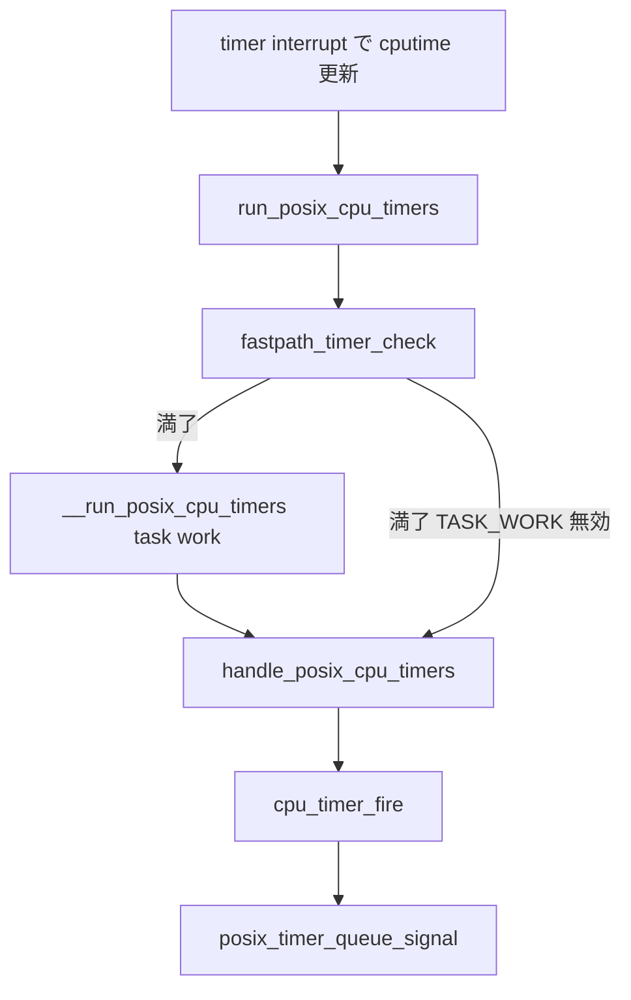

# 第18章 POSIX CPU タイマー

> **本章で読むソース**
>
> - [`kernel/time/posix-cpu-timers.c` L386-L414](https://github.com/gregkh/linux/blob/v6.18.38/kernel/time/posix-cpu-timers.c#L386-L414)
> - [`kernel/time/posix-cpu-timers.c` L416-L425](https://github.com/gregkh/linux/blob/v6.18.38/kernel/time/posix-cpu-timers.c#L416-L425)
> - [`kernel/time/posix-cpu-timers.c` L427-L439](https://github.com/gregkh/linux/blob/v6.18.38/kernel/time/posix-cpu-timers.c#L427-L439)
> - [`kernel/time/posix-cpu-timers.c` L451-L462](https://github.com/gregkh/linux/blob/v6.18.38/kernel/time/posix-cpu-timers.c#L451-L462)
> - [`kernel/time/posix-cpu-timers.c` L565-L588](https://github.com/gregkh/linux/blob/v6.18.38/kernel/time/posix-cpu-timers.c#L565-L588)
> - [`kernel/time/posix-cpu-timers.c` L668-L677](https://github.com/gregkh/linux/blob/v6.18.38/kernel/time/posix-cpu-timers.c#L668-L677)
> - [`kernel/time/posix-cpu-timers.c` L718-L735](https://github.com/gregkh/linux/blob/v6.18.38/kernel/time/posix-cpu-timers.c#L718-L735)
> - [`kernel/time/posix-cpu-timers.c` L593-L612](https://github.com/gregkh/linux/blob/v6.18.38/kernel/time/posix-cpu-timers.c#L593-L612)
> - [`kernel/time/posix-cpu-timers.c` L1083-L1127](https://github.com/gregkh/linux/blob/v6.18.38/kernel/time/posix-cpu-timers.c#L1083-L1127)
> - [`kernel/time/posix-cpu-timers.c` L1216-L1224](https://github.com/gregkh/linux/blob/v6.18.38/kernel/time/posix-cpu-timers.c#L1216-L1224)
> - [`kernel/time/posix-cpu-timers.c` L1295-L1394](https://github.com/gregkh/linux/blob/v6.18.38/kernel/time/posix-cpu-timers.c#L1295-L1394)
> - [`kernel/time/posix-cpu-timers.c` L1402-L1432](https://github.com/gregkh/linux/blob/v6.18.38/kernel/time/posix-cpu-timers.c#L1402-L1432)
> - [`kernel/time/posix-cpu-timers.c` L24-L31](https://github.com/gregkh/linux/blob/v6.18.38/kernel/time/posix-cpu-timers.c#L24-L31)

## この章の狙い

`CLOCK_PROCESS_CPUTIME_ID` や `CLOCK_THREAD_CPUTIME_ID` 向け **POSIX CPU タイマー**を読む。
wall clock ではなく **cputime** サンプルに基づき `timerqueue` で満了を判定し、timer interrupt からシグナル配送へつなげる。

## 前提

- [第17章 POSIX タイマー](17-posix-timers.md) で `k_itimer` と `k_clock` を読んでいること。
- [プロセスとスケジューラ 第1章 task_struct](../../sched/part00-process/01-task-struct.md) で `task_cputime` の存在を押さえていること。

## 作成と timer_base

`posix_cpu_timer_create` は clockid から pid を解決し、`clock_posix_cpu` を `kclock` に設定する。
per-thread と per-process で `posix_cputimer_base` の置き場所が変わる。

[`kernel/time/posix-cpu-timers.c` L386-L414](https://github.com/gregkh/linux/blob/v6.18.38/kernel/time/posix-cpu-timers.c#L386-L414)

```c
static int posix_cpu_timer_create(struct k_itimer *new_timer)
{
	static struct lock_class_key posix_cpu_timers_key;
	struct pid *pid;

	rcu_read_lock();
	pid = pid_for_clock(new_timer->it_clock, false);
	if (!pid) {
		rcu_read_unlock();
		return -EINVAL;
	}

	// ... (中略) ...

	if (IS_ENABLED(CONFIG_POSIX_CPU_TIMERS_TASK_WORK))
		lockdep_set_class(&new_timer->it_lock, &posix_cpu_timers_key);

	new_timer->kclock = &clock_posix_cpu;
	timerqueue_init(&new_timer->it.cpu.node);
	new_timer->it.cpu.pid = get_pid(pid);
	rcu_read_unlock();
	return 0;
}
```

[`kernel/time/posix-cpu-timers.c` L416-L425](https://github.com/gregkh/linux/blob/v6.18.38/kernel/time/posix-cpu-timers.c#L416-L425)

```c
static struct posix_cputimer_base *timer_base(struct k_itimer *timer,
					      struct task_struct *tsk)
{
	int clkidx = CPUCLOCK_WHICH(timer->it_clock);

	if (CPUCLOCK_PERTHREAD(timer->it_clock))
		return tsk->posix_cputimers.bases + clkidx;
	else
		return tsk->signal->posix_cputimers.bases + clkidx;
}
```

## arm/disarm と tick 依存

`arm_timer` は cputime ベースの満了時刻を timerqueue へ enqueue し、最早満了なら `base->nextevt` を更新する。
process ワイドタイマーは `tick_dep_set_signal`、thread タイマーは `tick_dep_set_task` で sched tick 依存を張る。

[`kernel/time/posix-cpu-timers.c` L565-L588](https://github.com/gregkh/linux/blob/v6.18.38/kernel/time/posix-cpu-timers.c#L565-L588)

```c
static void arm_timer(struct k_itimer *timer, struct task_struct *p)
{
	struct posix_cputimer_base *base = timer_base(timer, p);
	struct cpu_timer *ctmr = &timer->it.cpu;
	u64 newexp = cpu_timer_getexpires(ctmr);

	timer->it_status = POSIX_TIMER_ARMED;
	if (!cpu_timer_enqueue(&base->tqhead, ctmr))
		return;

	// ... (中略) ...

	if (newexp < base->nextevt)
		base->nextevt = newexp;

	if (CPUCLOCK_PERTHREAD(timer->it_clock))
		tick_dep_set_task(p, TICK_DEP_BIT_POSIX_TIMER);
	else
		tick_dep_set_signal(p, TICK_DEP_BIT_POSIX_TIMER);
}
```

`disarm_timer` は dequeue 後、dequeue したタイマーが `base->nextevt` の所有者なら `trigger_base_recalc_expires` を呼ぶ。
`nextevt` を 0 に戻すことで次 tick で最早満了を再計算させ、process ワイド cputime カウンタと tick 依存を外せる条件を作る。

[`kernel/time/posix-cpu-timers.c` L427-L439](https://github.com/gregkh/linux/blob/v6.18.38/kernel/time/posix-cpu-timers.c#L427-L439)

```c
static void trigger_base_recalc_expires(struct k_itimer *timer,
					struct task_struct *tsk)
{
	struct posix_cputimer_base *base = timer_base(timer, tsk);

	base->nextevt = 0;
}
```

[`kernel/time/posix-cpu-timers.c` L451-L462](https://github.com/gregkh/linux/blob/v6.18.38/kernel/time/posix-cpu-timers.c#L451-L462)

```c
static void disarm_timer(struct k_itimer *timer, struct task_struct *p)
{
	struct cpu_timer *ctmr = &timer->it.cpu;
	struct posix_cputimer_base *base;

	if (!cpu_timer_dequeue(ctmr))
		return;

	base = timer_base(timer, p);
	if (cpu_timer_getexpires(ctmr) == base->nextevt)
		trigger_base_recalc_expires(timer, p);
}
```

## timer_settime 相当（posix_cpu_timer_set）

`posix_cpu_timer_set` は firing 中なら `TIMER_RETRY` を返し、lock を解放して syscall 側の再試行へ委ねる。
新しい満了時刻が未来なら `arm_timer`、過去または disarm なら `trigger_base_recalc_expires` で base を再評価させる。

[`kernel/time/posix-cpu-timers.c` L668-L677](https://github.com/gregkh/linux/blob/v6.18.38/kernel/time/posix-cpu-timers.c#L668-L677)

```c
	if (unlikely(timer->it.cpu.firing)) {
		/*
		 * Prevent signal delivery. The timer cannot be dequeued
		 * because it is on the firing list which is not protected
		 * by sighand->lock. The delivery path is waiting for
		 * the timer lock. So go back, unlock and retry.
		 */
		timer->it.cpu.firing = false;
		ret = TIMER_RETRY;
	} else {
```

[`kernel/time/posix-cpu-timers.c` L718-L735](https://github.com/gregkh/linux/blob/v6.18.38/kernel/time/posix-cpu-timers.c#L718-L735)

```c
	if (likely(!sigev_none)) {
		if (new_expires && now < new_expires)
			arm_timer(timer, p);
		else
			trigger_base_recalc_expires(timer, p);
	}

	unlock_task_sighand(p, &flags);

	posix_timer_set_common(timer, new);

	if (!sigev_none && new_expires && now >= new_expires)
		cpu_timer_fire(timer);
```

## timer interrupt からの満了経路

timer interrupt handler は cputime カウンタを更新したあと `run_posix_cpu_timers` を呼ぶ。
`fastpath_timer_check` が thread/process の expiry cache と cputime サンプルを比較し、満了がなければ即 return する。

[`kernel/time/posix-cpu-timers.c` L1402-L1432](https://github.com/gregkh/linux/blob/v6.18.38/kernel/time/posix-cpu-timers.c#L1402-L1432)

```c
void run_posix_cpu_timers(void)
{
	struct task_struct *tsk = current;

	lockdep_assert_irqs_disabled();

	if (tsk->exit_state)
		return;

	if (posix_cpu_timers_work_scheduled(tsk))
		return;

	if (!fastpath_timer_check(tsk))
		return;

	__run_posix_cpu_timers(tsk);
}
```

[`kernel/time/posix-cpu-timers.c` L1083-L1127](https://github.com/gregkh/linux/blob/v6.18.38/kernel/time/posix-cpu-timers.c#L1083-L1127)

```c
static inline bool fastpath_timer_check(struct task_struct *tsk)
{
	struct posix_cputimers *pct = &tsk->posix_cputimers;
	struct signal_struct *sig;

	if (!expiry_cache_is_inactive(pct)) {
		u64 samples[CPUCLOCK_MAX];

		task_sample_cputime(tsk, samples);
		if (task_cputimers_expired(samples, pct))
			return true;
	}

	sig = tsk->signal;
	pct = &sig->posix_cputimers;
	if (READ_ONCE(pct->timers_active) && !READ_ONCE(pct->expiry_active)) {
		u64 samples[CPUCLOCK_MAX];

		proc_sample_cputime_atomic(&sig->cputimer.cputime_atomic,
					   samples);

		if (task_cputimers_expired(samples, pct))
			return true;
	}

	if (dl_task(tsk) && tsk->dl.dl_overrun)
		return true;

	return false;
}
```

`CONFIG_POSIX_CPU_TIMERS_TASK_WORK` 有効時、`__run_posix_cpu_timers` は task work を schedule して irq から `handle_posix_cpu_timers` 本体を defer する。

[`kernel/time/posix-cpu-timers.c` L1216-L1224](https://github.com/gregkh/linux/blob/v6.18.38/kernel/time/posix-cpu-timers.c#L1216-L1224)

```c
static inline void __run_posix_cpu_timers(struct task_struct *tsk)
{
	if (WARN_ON_ONCE(tsk->posix_cputimers_work.scheduled))
		return;

	tsk->posix_cputimers_work.scheduled = true;
	task_work_add(tsk, &tsk->posix_cputimers_work.work, TWA_RESUME);
}
```

`handle_posix_cpu_timers` は `sighand` ロック下で `check_thread_timers` と `check_process_timers` を走査し、満了候補を `firing` リストへ移す。
`sighand` を解放したあと各タイマーの `it_lock` を取り、`cpu_timer_fire` を呼ぶ。

[`kernel/time/posix-cpu-timers.c` L1295-L1394](https://github.com/gregkh/linux/blob/v6.18.38/kernel/time/posix-cpu-timers.c#L1295-L1394)

```c
static void handle_posix_cpu_timers(struct task_struct *tsk)
{
	struct k_itimer *timer, *next;
	unsigned long flags, start;
	LIST_HEAD(firing);

	if (!lock_task_sighand(tsk, &flags))
		return;

	do {
		start = READ_ONCE(jiffies);
		barrier();

		check_thread_timers(tsk, &firing);

		check_process_timers(tsk, &firing);

	} while (!posix_cpu_timers_enable_work(tsk, start));

	unlock_task_sighand(tsk, &flags);

	list_for_each_entry_safe(timer, next, &firing, it.cpu.elist) {
		bool cpu_firing;

		spin_lock(&timer->it_lock);
		list_del_init(&timer->it.cpu.elist);
		cpu_firing = timer->it.cpu.firing;
		timer->it.cpu.firing = false;
		if (likely(cpu_firing))
			cpu_timer_fire(timer);
		rcu_assign_pointer(timer->it.cpu.handling, NULL);
		spin_unlock(&timer->it_lock);
	}
}
```

## cpu_timer_fire

`cpu_timer_fire` は nanosleep 用途と通常 POSIX タイマーで分岐する。
通常タイマーは `posix_timer_queue_signal` へ、nanosleep 用途は `wake_up_process` へ向ける。

[`kernel/time/posix-cpu-timers.c` L593-L612](https://github.com/gregkh/linux/blob/v6.18.38/kernel/time/posix-cpu-timers.c#L593-L612)

```c
static void cpu_timer_fire(struct k_itimer *timer)
{
	struct cpu_timer *ctmr = &timer->it.cpu;

	timer->it_status = POSIX_TIMER_DISARMED;

	if (unlikely(ctmr->nanosleep)) {
		wake_up_process(timer->it_process);
		cpu_timer_setexpires(ctmr, 0);
	} else {
		posix_timer_queue_signal(timer);
		if (!timer->it_interval)
			cpu_timer_setexpires(ctmr, 0);
	}
}
```

## 処理の流れ



## 高速化と最適化の工夫

CPU タイマーの満了判定は sched tick と cputime サンプルに載るため、wall clock hrtimer ほど細かい分解能は持たない。
ただし実際の粒度は accounting 設定や `CONFIG_POSIX_CPU_TIMERS_TASK_WORK` 等に依存する。

`base->nextevt` キャッシュと `fastpath_timer_check` により、満了がなければ irq handler は早期 return する。
`trigger_base_recalc_expires` で `nextevt` を 0 に戻し、次 tick の再計算で process ワイド cputime 集計と tick 依存を外せる。

`CONFIG_POSIX_CPU_TIMERS_TASK_WORK` 有効時は expiry 本体を task work へ defer し、irq コンテキストでの `sighand` ロック保持を短くする。
`run_posix_cpu_timers` は work が schedule 済みなら再入を避ける。

[`kernel/time/posix-cpu-timers.c` L24-L31](https://github.com/gregkh/linux/blob/v6.18.38/kernel/time/posix-cpu-timers.c#L24-L31)

```c
void posix_cputimers_group_init(struct posix_cputimers *pct, u64 cpu_limit)
{
	posix_cputimers_init(pct);
	if (cpu_limit != RLIM_INFINITY) {
		pct->bases[CPUCLOCK_PROF].nextevt = cpu_limit * NSEC_PER_SEC;
		pct->timers_active = true;
	}
}
```

## CONFIG 依存

`CONFIG_POSIX_TIMERS` と `CONFIG_POSIX_CPU_TIMERS` が前提である。
`CONFIG_POSIX_CPU_TIMERS_TASK_WORK` が無効のとき、`__run_posix_cpu_timers` は irq 内で直接 `handle_posix_cpu_timers` を呼び、`timer_wait_running` は `cpu_relax` に近い動作になる。

## まとめ

- **posix_cputimer_base** が CPU 時間ベースの timerqueue を保持する。
- **run_posix_cpu_timers** が timer interrupt から fastpath と expiry 本体へ入る。
- **arm_timer** が tick 依存を張り、**cpu_timer_fire** が sigqueue へ接続する。

## 関連する章

- [第17章 POSIX タイマー](17-posix-timers.md)
- [第19章 alarmtimer と itimer](19-alarm-itimers.md)
- [第14章 tick デバイスと周期 tick](../part03-tick/14-tick-device.md)
