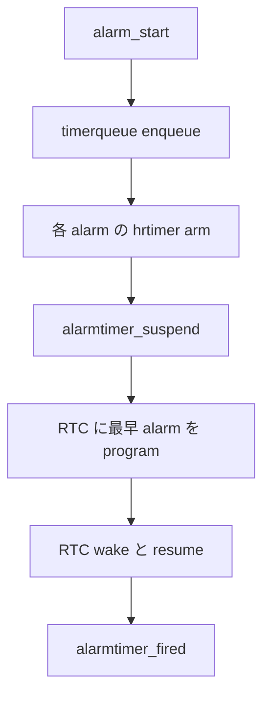

# 第21章 alarmtimer と itimer

> **本章で読むソース**
>
> - [`kernel/time/alarmtimer.c` L36-L50](https://github.com/gregkh/linux/blob/v6.18.38/kernel/time/alarmtimer.c#L36-L50)
> - [`kernel/time/alarmtimer.c` L149-L156](https://github.com/gregkh/linux/blob/v6.18.38/kernel/time/alarmtimer.c#L149-L156)
> - [`kernel/time/alarmtimer.c` L186-L199](https://github.com/gregkh/linux/blob/v6.18.38/kernel/time/alarmtimer.c#L186-L199)
> - [`kernel/time/alarmtimer.c` L218-L285](https://github.com/gregkh/linux/blob/v6.18.38/kernel/time/alarmtimer.c#L218-L285)
> - [`kernel/time/alarmtimer.c` L326-L351](https://github.com/gregkh/linux/blob/v6.18.38/kernel/time/alarmtimer.c#L326-L351)
> - [`kernel/time/itimer.c` L29-L45](https://github.com/gregkh/linux/blob/v6.18.38/kernel/time/itimer.c#L29-L45)
> - [`kernel/time/itimer.c` L153-L168](https://github.com/gregkh/linux/blob/v6.18.38/kernel/time/itimer.c#L153-L168)
> - [`kernel/time/itimer.c` L175-L185](https://github.com/gregkh/linux/blob/v6.18.38/kernel/time/itimer.c#L175-L185)

## この章の狙い

**alarmtimer**（suspend 中も wake 可能な alarm）と従来 **itimer**（`setitimer`/`getitimer`）を読み、ユーザー空間タイマー API の残りの経路を押さえる。
いずれも hrtimer または cputime とシグナル配送に接続するが、シグナル本体は sched 分冊の担当である。

## 前提

- [第19章 POSIX タイマー](19-posix-timers.md) で hrtimer ベース POSIX API を読んでいること。
- [第20章 POSIX CPU タイマー](20-posix-cpu-timers.md) で cputime ベース itimer の土台を押さえていること。

## alarmtimer の alarm_base

alarmtimer は clockid 種別ごとに **alarm_base** を持ち、内部 timerqueue で `struct alarm` を管理する。
各 base は ktime 読み取り関数を持ち、POSIX `clock_nanosleep` や Android 由来の wake alarm API から使われる。

[`kernel/time/alarmtimer.c` L36-L50](https://github.com/gregkh/linux/blob/v6.18.38/kernel/time/alarmtimer.c#L36-L50)

```c
/**
 * struct alarm_base - Alarm timer bases
 * @lock:		Lock for synchronized access to the base
 * @timerqueue:		Timerqueue head managing the list of events
 * @get_ktime:		Function to read the time correlating to the base
 * @get_timespec:	Function to read the namespace time correlating to the base
 * @base_clockid:	clockid for the base
 */
static struct alarm_base {
	spinlock_t		lock;
	struct timerqueue_head	timerqueue;
	ktime_t			(*get_ktime)(void);
	void			(*get_timespec)(struct timespec64 *tp);
	clockid_t		base_clockid;
} alarm_bases[ALARM_NUMTYPE];
```

各 `struct alarm` は個別の hrtimer を持つ。
`alarm_start` は timerqueue へ enqueue したうえで、その alarm 専用 hrtimer を arm する。

[`kernel/time/alarmtimer.c` L326-L351](https://github.com/gregkh/linux/blob/v6.18.38/kernel/time/alarmtimer.c#L326-L351)

```c
void alarm_init(struct alarm *alarm, enum alarmtimer_type type,
		void (*function)(struct alarm *, ktime_t))
{
	hrtimer_setup(&alarm->timer, alarmtimer_fired, alarm_bases[type].base_clockid,
		      HRTIMER_MODE_ABS);
	__alarm_init(alarm, type, function);
}

void alarm_start(struct alarm *alarm, ktime_t start)
{
	struct alarm_base *base = &alarm_bases[alarm->type];

	scoped_guard(spinlock_irqsave, &base->lock) {
		alarm->node.expires = start;
		alarmtimer_enqueue(base, alarm);
		hrtimer_start(&alarm->timer, alarm->node.expires, HRTIMER_MODE_ABS);
	}

	trace_alarmtimer_start(alarm, base->get_ktime());
}
```

enqueue/dequeue は base ロック下で timerqueue を更新する。

[`kernel/time/alarmtimer.c` L149-L156](https://github.com/gregkh/linux/blob/v6.18.38/kernel/time/alarmtimer.c#L149-L156)

```c
static void alarmtimer_enqueue(struct alarm_base *base, struct alarm *alarm)
{
	if (alarm->state & ALARMTIMER_STATE_ENQUEUED)
		timerqueue_del(&base->timerqueue, &alarm->node);

	timerqueue_add(&base->timerqueue, &alarm->node);
	alarm->state |= ALARMTIMER_STATE_ENQUEUED;
}
```

満了時 `alarmtimer_fired` が hrtimer コールバックから呼ばれ、登録済み `alarm->function` を実行する。

[`kernel/time/alarmtimer.c` L186-L199](https://github.com/gregkh/linux/blob/v6.18.38/kernel/time/alarmtimer.c#L186-L199)

```c
static enum hrtimer_restart alarmtimer_fired(struct hrtimer *timer)
{
	struct alarm *alarm = container_of(timer, struct alarm, timer);
	struct alarm_base *base = &alarm_bases[alarm->type];

	scoped_guard(spinlock_irqsave, &base->lock)
		alarmtimer_dequeue(base, alarm);

	if (alarm->function)
		alarm->function(alarm, base->get_ktime());

	trace_alarmtimer_fired(alarm, base->get_ktime());
	return HRTIMER_NORESTART;
}
```

`CONFIG_RTC_CLASS` 有効時、`alarmtimer_suspend` は各 base の timerqueue から最早 alarm を選び、RTC wake を program する。
resume 後は通常の hrtimer path が満了処理を続ける。

[`kernel/time/alarmtimer.c` L218-L285](https://github.com/gregkh/linux/blob/v6.18.38/kernel/time/alarmtimer.c#L218-L285)

```c
static int alarmtimer_suspend(struct device *dev)
{
	ktime_t min, now, expires;
	struct rtc_device *rtc;
	struct rtc_time tm;
	int i, ret, type;

	// ... (中略) ...

	rtc = alarmtimer_get_rtcdev();
	if (!rtc)
		return 0;

	for (i = 0; i < ALARM_NUMTYPE; i++) {
		struct alarm_base *base = &alarm_bases[i];
		struct timerqueue_node *next;
		ktime_t delta;

		scoped_guard(spinlock_irqsave, &base->lock)
			next = timerqueue_getnext(&base->timerqueue);
		if (!next)
			continue;
		delta = ktime_sub(next->expires, base->get_ktime());
		if (!min || (delta < min)) {
			expires = next->expires;
			min = delta;
			type = i;
		}
	}
	if (min == 0)
		return 0;

	if (ktime_to_ns(min) < 2 * NSEC_PER_SEC) {
		pm_wakeup_event(dev, 2 * MSEC_PER_SEC);
		return -EBUSY;
	}

	trace_alarmtimer_suspend(expires, type);

	rtc_timer_cancel(rtc, &rtctimer);
	rtc_read_time(rtc, &tm);
	now = rtc_tm_to_ktime(tm);

	min = rtc_bound_alarmtime(rtc, min);

	now = ktime_add(now, min);

	ret = rtc_timer_start(rtc, &rtctimer, now, 0);
	if (ret < 0)
		pm_wakeup_event(dev, MSEC_PER_SEC);
	return ret;
}
```

## 従来 itimer（ITIMER_REAL ほか）

`itimer.c` は `setitimer`/`getitimer` システムコールを実装する。
`ITIMER_REAL` は `signal_struct::real_timer` 上の hrtimer で、`it_real_fn` が `SIGALRM` を送る。

[`kernel/time/itimer.c` L175-L185](https://github.com/gregkh/linux/blob/v6.18.38/kernel/time/itimer.c#L175-L185)

```c
enum hrtimer_restart it_real_fn(struct hrtimer *timer)
{
	struct signal_struct *sig =
		container_of(timer, struct signal_struct, real_timer);
	struct pid *leader_pid = sig->pids[PIDTYPE_TGID];

	trace_itimer_expire(ITIMER_REAL, leader_pid, 0);
	kill_pid_info(SIGALRM, SEND_SIG_PRIV, leader_pid);

	return HRTIMER_NORESTART;
}
```

periodic `ITIMER_REAL` はシグナル配送 path で再 arm する。
コメントは、callback 内 self rearm だと短 interval の high-resolution timer による DoS と timer noise が起きるため、配送 path へ移したと述べる。

[`kernel/time/itimer.c` L153-L168](https://github.com/gregkh/linux/blob/v6.18.38/kernel/time/itimer.c#L153-L168)

```c
/*
 * Invoked from dequeue_signal() when SIG_ALRM is delivered.
 *
 * Restart the ITIMER_REAL timer if it is armed as periodic timer.  Doing
 * this in the signal delivery path instead of self rearming prevents a DoS
 * with small increments in the high reolution timer case and reduces timer
 * noise in general.
 */
void posixtimer_rearm_itimer(struct task_struct *tsk)
{
	struct hrtimer *tmr = &tsk->signal->real_timer;

	if (!hrtimer_is_queued(tmr) && tsk->signal->it_real_incr != 0) {
		hrtimer_forward_now(tmr, tsk->signal->it_real_incr);
		hrtimer_restart(tmr);
	}
}
```

`ITIMER_VIRTUAL` と `ITIMER_PROF` は `cpu_itimer` 構造体で cputime ベース管理され、第20章の POSIX CPU タイマーと同型の tick 依存 path を共有する。
残り時間読み取りは hrtimer または cputime サンプルから計算する。

[`kernel/time/itimer.c` L29-L45](https://github.com/gregkh/linux/blob/v6.18.38/kernel/time/itimer.c#L29-L45)

```c
static struct timespec64 itimer_get_remtime(struct hrtimer *timer)
{
	ktime_t rem = __hrtimer_get_remaining(timer, true);

	/*
	 * Racy but safe: if the itimer expires after the above
	 * hrtimer_get_remtime() call but before this condition
	 * then we return 0 - which is correct.
	 */
	if (hrtimer_active(timer)) {
		if (rem <= 0)
			rem = NSEC_PER_USEC;
	} else
		rem = 0;

	return ktime_to_timespec64(rem);
}
```

## 処理の流れ



## 高速化と最適化の工夫

各 `struct alarm` は専用 hrtimer を持ち、`alarm_base` の timerqueue は複数 alarm の満了時刻を整理する。
suspend path では timerqueue から最早 alarm を選び RTC wake へ委譲し、runtime hrtimer だけでは wake できない deep idle を補完する。

itimer の periodic rearm を signal 配送 path へ移したのは、満了 callback 内連鎖より短 interval の high-resolution timer DoS と timer noise を避けるためである。

## CONFIG 依存

alarmtimer の RTC wake は `CONFIG_RTC_CLASS` が必要である。
`CONFIG_POSIX_TIMERS` 無効構成では alarmtimer の POSIX 連携部分が compile されない。
itimer は signal サブシステムと一体のため、カーネルが signal をサポートする構成で常に有効である。

## まとめ

- **alarmtimer** は alarm ごとの hrtimer と base timerqueue で suspend 対応 alarm を提供する。
- **alarmtimer_suspend** が最早 alarm を RTC へ program し、resume 後 hrtimer が満了処理を続ける。
- **itimer** は `ITIMER_REAL` を hrtimer、virtual/prof を cputime へ接続する。

## 関連する章

- [第19章 POSIX タイマー](19-posix-timers.md)
- [第20章 POSIX CPU タイマー](20-posix-cpu-timers.md)
- [第23章 ユーザー空間への時刻提供](../part05-ipc-time/23-userspace-time-vdso.md)
