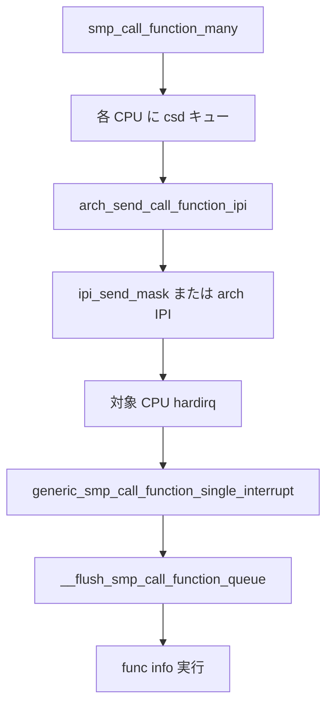

# 第20章 IPI と smp_call_function

> **本章で読むソース**
>
> - [`kernel/irq/ipi.c` L217-L255](https://github.com/gregkh/linux/blob/v6.18.38/kernel/irq/ipi.c#L217-L255)
> - [`kernel/irq/ipi.c` L306-L323](https://github.com/gregkh/linux/blob/v6.18.38/kernel/irq/ipi.c#L306-L323)
> - [`kernel/smp.c` L456-L463](https://github.com/gregkh/linux/blob/v6.18.38/kernel/smp.c#L456-L463)
> - [`kernel/smp.c` L780-L879](https://github.com/gregkh/linux/blob/v6.18.38/kernel/smp.c#L780-L879)
> - [`kernel/smp.c` L905-L923](https://github.com/gregkh/linux/blob/v6.18.38/kernel/smp.c#L905-L923)
> - [`kernel/smp.c` L532-L577](https://github.com/gregkh/linux/blob/v6.18.38/kernel/smp.c#L532-L577)

## この章の狙い

SMP 上で他 CPU へ処理を届ける **IPI**（Inter-Processor Interrupt）と、`smp_call_function()` 系 API の関係を読む。
genirq の IPI ドメインが `ipi_send_mask()` でハードウェア IPI を発行し、受信側が call function キューを flush する流れを追う。

## 前提

- [第1章 irq_desc と irq_domain](../part00-genirq/01-irq-desc-domain.md) で irq_domain を読んでいること。
- [同期と RCU 第1章 アトミック操作](../../locking/part00-foundation/01-atomic-barrier.md) でメモリ順序の語彙を押さえていること。

## __ipi_send_single：genirq 経由の IPI 発行

Linux SMP IPI は専用 **irq_domain** に virq として登録される。
`__ipi_send_single()` は irq_chip の `ipi_send_single` または `ipi_send_mask` を呼ぶ。

[`kernel/irq/ipi.c` L217-L255](https://github.com/gregkh/linux/blob/v6.18.38/kernel/irq/ipi.c#L217-L255)

```c
 * __ipi_send_single - send an IPI to a target Linux SMP CPU
 * @desc:	pointer to irq_desc of the IRQ
 * @cpu:	destination CPU, must in the destination mask passed to
 *		irq_reserve_ipi()
 *
 * This function is for architecture or core code to speed up IPI sending. Not
 * usable from driver code.
 *
 * Return: %0 on success or negative error number on failure.
 */
int __ipi_send_single(struct irq_desc *desc, unsigned int cpu)
{
	struct irq_data *data = irq_desc_get_irq_data(desc);
	struct irq_chip *chip = irq_data_get_irq_chip(data);

#ifdef DEBUG
	/*
	 * Minimise the overhead by omitting the checks for Linux SMP IPIs.
	 * Since the callers should be arch or core code which is generally
	 * trusted, only check for errors when debugging.
	 */
	if (WARN_ON_ONCE(ipi_send_verify(chip, data, NULL, cpu)))
		return -EINVAL;
#endif
	if (!chip->ipi_send_single) {
		chip->ipi_send_mask(data, cpumask_of(cpu));
		return 0;
	}

	/* FIXME: Store this information in irqdata flags */
	if (irq_domain_is_ipi_per_cpu(data->domain) &&
	    cpu != data->common->ipi_offset) {
		/* use the correct data for that cpu */
		unsigned irq = data->irq + cpu - data->common->ipi_offset;

		data = irq_get_irq_data(irq);
	}
	chip->ipi_send_single(data, cpu);
	return 0;
```

公開 API `ipi_send_single()` は verify 後に `__ipi_send_single()` へ委譲する。

[`kernel/irq/ipi.c` L306-L323](https://github.com/gregkh/linux/blob/v6.18.38/kernel/irq/ipi.c#L306-L323)

```c
 * ipi_send_single - Send an IPI to a single CPU
 * @virq:	Linux IRQ number from irq_reserve_ipi()
 * @cpu:	destination CPU, must in the destination mask passed to
 *		irq_reserve_ipi()
 *
 * Return: %0 on success or negative error number on failure.
 */
int ipi_send_single(unsigned int virq, unsigned int cpu)
{
	struct irq_desc *desc = irq_to_desc(virq);
	struct irq_data *data = desc ? irq_desc_get_irq_data(desc) : NULL;
	struct irq_chip *chip = data ? irq_data_get_irq_chip(data) : NULL;

	if (WARN_ON_ONCE(ipi_send_verify(chip, data, NULL, cpu)))
		return -EINVAL;

	return __ipi_send_single(desc, cpu);
}
```

## generic_smp_call_function_single_interrupt

IPI ハンドラの一種として、他 CPU から届いた `call_single_data_t` キューを処理する。

[`kernel/smp.c` L456-L463](https://github.com/gregkh/linux/blob/v6.18.38/kernel/smp.c#L456-L463)

```c
 * generic_smp_call_function_single_interrupt - Execute SMP IPI callbacks
 *
 * Invoked by arch to handle an IPI for call function single.
 * Must be called with interrupts disabled.
 */
void generic_smp_call_function_single_interrupt(void)
{
	__flush_smp_call_function_queue(true);
```

## __flush_smp_call_function_queue：SYNC と ASYNC の実行順

IPI 受信側は per-CPU の `call_single_queue` から llist を取り出し、**SYNC** callback を先に実行してから **ASYNC** を処理する。
`CSD_TYPE_SYNC` は unlock 前に func を呼び、呼び出し元の `csd_lock()` 待ちを解放する。

[`kernel/smp.c` L532-L577](https://github.com/gregkh/linux/blob/v6.18.38/kernel/smp.c#L532-L577)

```c
	prev = NULL;
	llist_for_each_entry_safe(csd, csd_next, entry, node.llist) {
		/* Do we wait until *after* callback? */
		if (CSD_TYPE(csd) == CSD_TYPE_SYNC) {
			smp_call_func_t func = csd->func;
			void *info = csd->info;

			if (prev) {
				prev->next = &csd_next->node.llist;
			} else {
				entry = &csd_next->node.llist;
			}

			csd_lock_record(csd);
			csd_do_func(func, info, csd);
			csd_unlock(csd);
			csd_lock_record(NULL);
		} else {
			prev = &csd->node.llist;
		}
	}

	if (!entry)
		return;

	/*
	 * Second; run all !SYNC callbacks.
	 */
	prev = NULL;
	llist_for_each_entry_safe(csd, csd_next, entry, node.llist) {
		int type = CSD_TYPE(csd);

		if (type != CSD_TYPE_TTWU) {
			if (prev) {
				prev->next = &csd_next->node.llist;
			} else {
				entry = &csd_next->node.llist;
			}

			if (type == CSD_TYPE_ASYNC) {
				smp_call_func_t func = csd->func;
				void *info = csd->info;

				csd_lock_record(csd);
				csd_unlock(csd);
				csd_do_func(func, info, csd);
```

## smp_call_function_many_cond：キューイングと IPI

`smp_call_function_many()` は cpumask 上の各 CPU に `call_single_data_t` を載せ、リモート CPU へ IPI を送る。
呼び出し元 CPU 自身が mask に含まれる場合は `SCF_RUN_LOCAL` でローカル flush も行う。

[`kernel/smp.c` L780-L879](https://github.com/gregkh/linux/blob/v6.18.38/kernel/smp.c#L780-L879)

```c
static void smp_call_function_many_cond(const struct cpumask *mask,
					smp_call_func_t func, void *info,
					unsigned int scf_flags,
					smp_cond_func_t cond_func)
{
	int cpu, last_cpu, this_cpu = smp_processor_id();
	struct call_function_data *cfd;
	bool wait = scf_flags & SCF_WAIT;
	int nr_cpus = 0;
	bool run_remote = false;

	lockdep_assert_preemption_disabled();

	/*
	 * Can deadlock when called with interrupts disabled.
	 * We allow cpu's that are not yet online though, as no one else can
	 * send smp call function interrupt to this cpu and as such deadlocks
	 * can't happen.
	 */
	if (cpu_online(this_cpu) && !oops_in_progress &&
	    !early_boot_irqs_disabled)
		lockdep_assert_irqs_enabled();

	/*
	 * When @wait we can deadlock when we interrupt between llist_add() and
	 * arch_send_call_function_ipi*(); when !@wait we can deadlock due to
	 * csd_lock() on because the interrupt context uses the same csd
	 * storage.
	 */
	WARN_ON_ONCE(!in_task());

	/* Check if we need remote execution, i.e., any CPU excluding this one. */
	if (cpumask_any_and_but(mask, cpu_online_mask, this_cpu) < nr_cpu_ids) {
		cfd = this_cpu_ptr(&cfd_data);
		cpumask_and(cfd->cpumask, mask, cpu_online_mask);
		__cpumask_clear_cpu(this_cpu, cfd->cpumask);

		cpumask_clear(cfd->cpumask_ipi);
		for_each_cpu(cpu, cfd->cpumask) {
			call_single_data_t *csd = per_cpu_ptr(cfd->csd, cpu);

			if (cond_func && !cond_func(cpu, info)) {
				__cpumask_clear_cpu(cpu, cfd->cpumask);
				continue;
			}

			/* Work is enqueued on a remote CPU. */
			run_remote = true;

			csd_lock(csd);
			if (wait)
				csd->node.u_flags |= CSD_TYPE_SYNC;
			csd->func = func;
			csd->info = info;
#ifdef CONFIG_CSD_LOCK_WAIT_DEBUG
			csd->node.src = smp_processor_id();
			csd->node.dst = cpu;
#endif
			trace_csd_queue_cpu(cpu, _RET_IP_, func, csd);

			/*
			 * Kick the remote CPU if this is the first work
			 * item enqueued.
			 */
			if (llist_add(&csd->node.llist, &per_cpu(call_single_queue, cpu))) {
				__cpumask_set_cpu(cpu, cfd->cpumask_ipi);
				nr_cpus++;
				last_cpu = cpu;
			}
		}

		/*
		 * Choose the most efficient way to send an IPI. Note that the
		 * number of CPUs might be zero due to concurrent changes to the
		 * provided mask.
		 */
		if (nr_cpus == 1)
			send_call_function_single_ipi(last_cpu);
		else if (likely(nr_cpus > 1))
			send_call_function_ipi_mask(cfd->cpumask_ipi);
	}

	/* Check if we need local execution. */
	if ((scf_flags & SCF_RUN_LOCAL) && cpumask_test_cpu(this_cpu, mask) &&
	    (!cond_func || cond_func(this_cpu, info))) {
		unsigned long flags;

		local_irq_save(flags);
		csd_do_func(func, info, NULL);
		local_irq_restore(flags);
	}

	if (run_remote && wait) {
		for_each_cpu(cpu, cfd->cpumask) {
			call_single_data_t *csd;

			csd = per_cpu_ptr(cfd->csd, cpu);
			csd_lock_wait(csd);
		}
	}
}
```

**最適化の工夫**：IPI は割り込みを強制するためコストが高い。
`smp_call_function_many()` は1回の IPI で複数 CPU のキューを flush し、バリアや TLB shootdown をまとめて処理する。

## smp_call_function：全 CPU 向け

`smp_call_function()` は online mask 全体へ broadcast する糖衣 API である。

[`kernel/smp.c` L905-L923](https://github.com/gregkh/linux/blob/v6.18.38/kernel/smp.c#L905-L923)

```c
 * smp_call_function(): Run a function on all other CPUs.
 * @func: The function to run. This must be fast and non-blocking.
 * @info: An arbitrary pointer to pass to the function.
 * @wait: If true, wait (atomically) until function has completed
 *        on other CPUs.
 *
 * Returns 0.
 *
 * If @wait is true, then returns once @func has returned; otherwise
 * it returns just before the target cpu calls @func.
 *
 * You must not call this function with disabled interrupts or from a
 * hardware interrupt handler or from a bottom half handler.
 */
void smp_call_function(smp_call_func_t func, void *info, int wait)
{
	preempt_disable();
	smp_call_function_many(cpu_online_mask, func, info, wait);
	preempt_enable();
```

RCU の grace period 処理や stop_machine など、カーネル横断の同期がこの経路を使う。

## 処理の流れ：smp_call_function から IPI 処理まで



## まとめ

- genirq IPI ドメインが virq と irq_chip 経由でハードウェア IPI を抽象化する。
- `smp_call_function()` 系は per-CPU キューと IPI で他 CPU 上の関数実行を届ける。
- 呼び出しは task コンテキストと IRQ 有効状態を前提とし、デッドロック条件が文書化されている。
- TLB flush や RCU はこの IPI 経路に載る典型例である。

## 関連する章

- [第1章 irq_desc と irq_domain](../part00-genirq/01-irq-desc-domain.md)
- [同期と RCU 第4部](../../locking/part04-rcu/12-rcu-basics.md)
- [x86-64 アーキテクチャ分冊（計画）](../../README.md)
