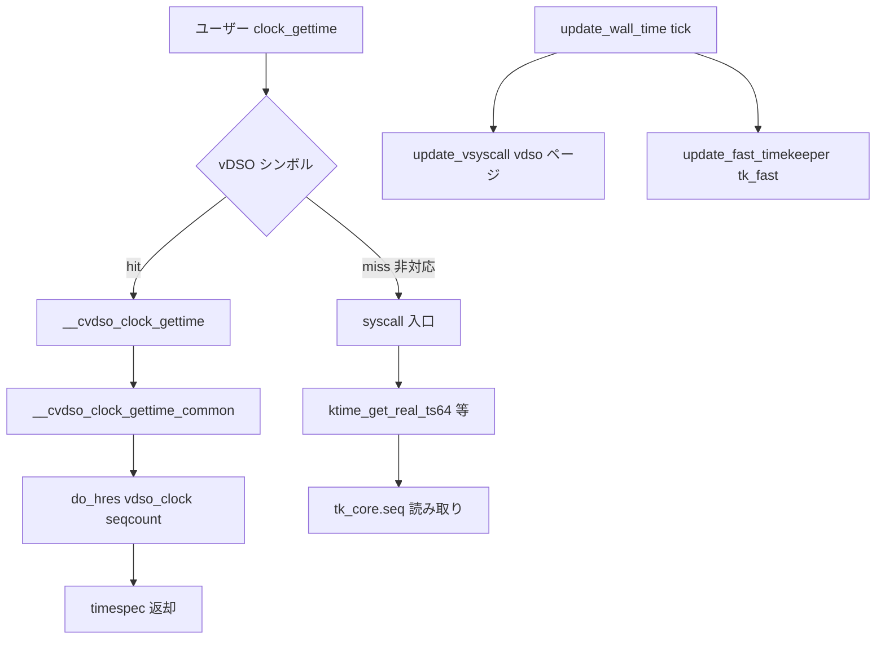

# 第20章 ユーザー空間への時刻提供

> **本章で読むソース**
>
> - [`lib/vdso/gettimeofday.c` L287-L333](https://github.com/gregkh/linux/blob/v6.18.38/lib/vdso/gettimeofday.c#L287-L333)
> - [`arch/x86/entry/vdso/vclock_gettime.c` L36-L42](https://github.com/gregkh/linux/blob/v6.18.38/arch/x86/entry/vdso/vclock_gettime.c#L36-L42)
> - [`kernel/time/timekeeping.c` L793-L811](https://github.com/gregkh/linux/blob/v6.18.38/kernel/time/timekeeping.c#L793-L811)
> - [`kernel/time/timekeeping.c` L490-L494](https://github.com/gregkh/linux/blob/v6.18.38/kernel/time/timekeeping.c#L490-L494)
> - [`lib/vdso/gettimeofday.c` L150-L187](https://github.com/gregkh/linux/blob/v6.18.38/lib/vdso/gettimeofday.c#L150-L187)
> - [`kernel/time/vsyscall.c` L77-L127](https://github.com/gregkh/linux/blob/v6.18.38/kernel/time/vsyscall.c#L77-L127)

## この章の狙い

`clock_gettime()` と `gettimeofday()` が **vDSO** 経由でユーザー空間から時刻を読む経路を追う。
[全体像と横断基盤 第9章 vDSO](../../foundation/part02-syscall/08-vdso.md) で触れた入口から、timekeeper が公開するデータページとの接続を読む。

## 前提

- [第12章 timekeeping](../part02-timer/12-timekeeping.md) で `ktime_get_real_ts64()` と `tk_fast` を読んでいること。
- [全体像と横断基盤 第8章 entry 64 システムコール入口](../../foundation/part02-syscall/07-entry-64-syscall-entry-exit.md) で syscall 入口を読んでいること。

## __cvdso_clock_gettime_common：vDSO 内の分岐

vDSO の `__cvdso_clock_gettime_common()` は clockid をビットマスクに変換し、高分解能（`VDSO_HRES`）、 coarse、RAW、AUX ごとに読み取り関数を選ぶ。
vDSO で扱えない clockid は `false` を返し、呼び出し元が syscall fallback へ進む。

[`lib/vdso/gettimeofday.c` L287-L333](https://github.com/gregkh/linux/blob/v6.18.38/lib/vdso/gettimeofday.c#L287-L333)

```c
static __always_inline bool
__cvdso_clock_gettime_common(const struct vdso_time_data *vd, clockid_t clock,
			     struct __kernel_timespec *ts)
{
	const struct vdso_clock *vc = vd->clock_data;
	u32 msk;

	if (!vdso_clockid_valid(clock))
		return false;

	/*
	 * Convert the clockid to a bitmask and use it to check which
	 * clocks are handled in the VDSO directly.
	 */
	msk = 1U << clock;
	if (likely(msk & VDSO_HRES))
		vc = &vc[CS_HRES_COARSE];
	else if (msk & VDSO_COARSE)
		return do_coarse(vd, &vc[CS_HRES_COARSE], clock, ts);
	else if (msk & VDSO_RAW)
		vc = &vc[CS_RAW];
	else if (msk & VDSO_AUX)
		return do_aux(vd, clock, ts);
	else
		return false;

	return do_hres(vd, vc, clock, ts);
}

static __maybe_unused int
__cvdso_clock_gettime_data(const struct vdso_time_data *vd, clockid_t clock,
			   struct __kernel_timespec *ts)
{
	bool ok;

	ok = __cvdso_clock_gettime_common(vd, clock, ts);

	if (unlikely(!ok))
		return clock_gettime_fallback(clock, ts);
	return 0;
}

static __maybe_unused int
__cvdso_clock_gettime(clockid_t clock, struct __kernel_timespec *ts)
{
	return __cvdso_clock_gettime_data(__arch_get_vdso_u_time_data(), clock, ts);
}
```

`do_hres()` は seqcount 付き `vdso_clock` データと TSC 等の cycle 読み取りでナノ秒を組み立てる（同ファイル内）。
カーネル側の `update_vsyscall()` が vDSO データページを更新する。

## do_hres：vDSO 内の高精度読み取り

`VDSO_HRES` 対象 clockid は `do_hres()` が `vdso_get_timestamp()` で sec と ns を組み立てる。
seq が奇数の間は `cpu_relax()` で更新完了を待ち、TIME_NS なら別経路へ分岐する。

[`lib/vdso/gettimeofday.c` L150-L187](https://github.com/gregkh/linux/blob/v6.18.38/lib/vdso/gettimeofday.c#L150-L187)

```c
bool do_hres(const struct vdso_time_data *vd, const struct vdso_clock *vc,
	     clockid_t clk, struct __kernel_timespec *ts)
{
	u64 sec, ns;
	u32 seq;

	/* Allows to compile the high resolution parts out */
	if (!__arch_vdso_hres_capable())
		return false;

	do {
		/*
		 * Open coded function vdso_read_begin() to handle
		 * VDSO_CLOCKMODE_TIMENS. Time namespace enabled tasks have a
		 * special VVAR page installed which has vc->seq set to 1 and
		 * vc->clock_mode set to VDSO_CLOCKMODE_TIMENS. For non time
		 * namespace affected tasks this does not affect performance
		 * because if vc->seq is odd, i.e. a concurrent update is in
		 * progress the extra check for vc->clock_mode is just a few
		 * extra instructions while spin waiting for vc->seq to become
		 * even again.
		 */
		while (unlikely((seq = READ_ONCE(vc->seq)) & 1)) {
			if (IS_ENABLED(CONFIG_TIME_NS) &&
			    vc->clock_mode == VDSO_CLOCKMODE_TIMENS)
				return do_hres_timens(vd, vc, clk, ts);
			cpu_relax();
		}
		smp_rmb();

		if (!vdso_get_timestamp(vd, vc, clk, &sec, &ns))
			return false;
	} while (unlikely(vdso_read_retry(vc, seq)));

	vdso_set_timespec(ts, sec, ns);

	return true;
}
```

## update_vsyscall：カーネルから vDSO ページ更新

tick 更新のたび `timekeeping_update_from_shadow()` から `update_vsyscall()` が呼ばれ、`vdso_time_data` の basetime と clock_mode を書き換える。
`vdso_write_begin()` と `vdso_write_end()` で seqcount を更新し、ユーザー空間 reader と競合しないようにする。

[`kernel/time/vsyscall.c` L77-L127](https://github.com/gregkh/linux/blob/v6.18.38/kernel/time/vsyscall.c#L77-L127)

```c
void update_vsyscall(struct timekeeper *tk)
{
	struct vdso_time_data *vdata = vdso_k_time_data;
	struct vdso_clock *vc = vdata->clock_data;
	struct vdso_timestamp *vdso_ts;
	s32 clock_mode;
	u64 nsec;

	/* copy vsyscall data */
	vdso_write_begin(vdata);

	clock_mode = tk->tkr_mono.clock->vdso_clock_mode;
	vc[CS_HRES_COARSE].clock_mode	= clock_mode;
	vc[CS_RAW].clock_mode		= clock_mode;

	/* CLOCK_REALTIME also required for time() */
	vdso_ts		= &vc[CS_HRES_COARSE].basetime[CLOCK_REALTIME];
	vdso_ts->sec	= tk->xtime_sec;
	vdso_ts->nsec	= tk->tkr_mono.xtime_nsec;

	/* CLOCK_REALTIME_COARSE */
	vdso_ts		= &vc[CS_HRES_COARSE].basetime[CLOCK_REALTIME_COARSE];
	vdso_ts->sec	= tk->xtime_sec;
	vdso_ts->nsec	= tk->coarse_nsec;

	/* CLOCK_MONOTONIC_COARSE */
	vdso_ts		= &vc[CS_HRES_COARSE].basetime[CLOCK_MONOTONIC_COARSE];
	vdso_ts->sec	= tk->xtime_sec + tk->wall_to_monotonic.tv_sec;
	nsec		= tk->coarse_nsec;
	nsec		= nsec + tk->wall_to_monotonic.tv_nsec;
	vdso_ts->sec	+= __iter_div_u64_rem(nsec, NSEC_PER_SEC, &vdso_ts->nsec);

	/*
	 * Read without the seqlock held by clock_getres().
	 */
	WRITE_ONCE(vdata->hrtimer_res, hrtimer_resolution);

	/*
	 * If the current clocksource is not VDSO capable, then spare the
	 * update of the high resolution parts.
	 */
	if (clock_mode != VDSO_CLOCKMODE_NONE)
		update_vdso_time_data(vdata, tk);

	__arch_update_vdso_clock(&vc[CS_HRES_COARSE]);
	__arch_update_vdso_clock(&vc[CS_RAW]);

	vdso_write_end(vdata);

	__arch_sync_vdso_time_data(vdata);
}
```

## x86 vDSO シンボル

x86 の vDSO は `__vdso_clock_gettime` を export し、内部で共通実装 `__cvdso_clock_gettime()` を呼ぶ。

[`arch/x86/entry/vdso/vclock_gettime.c` L36-L42](https://github.com/gregkh/linux/blob/v6.18.38/arch/x86/entry/vdso/vclock_gettime.c#L36-L42)

```c
int __vdso_clock_gettime(clockid_t clock, struct __kernel_timespec *ts)
{
	return __cvdso_clock_gettime(clock, ts);
}

int clock_gettime(clockid_t, struct __kernel_timespec *)
	__attribute__((weak, alias("__vdso_clock_gettime")));
```

glibc 等は PLT ではなく vDSO の `clock_gettime` シンボルを bind し、syscall を回避する。

## カーネル syscall 経路：ktime_get_real_ts64

vDSO が使えない clock や fallback 時は、システムコール handler が `ktime_get_real_ts64()` 等を呼ぶ。
こちらも seqcount と `timekeeping_get_ns()` で timekeeper から読む。

[`kernel/time/timekeeping.c` L793-L811](https://github.com/gregkh/linux/blob/v6.18.38/kernel/time/timekeeping.c#L793-L811)

```c
void ktime_get_real_ts64(struct timespec64 *ts)
{
	struct timekeeper *tk = &tk_core.timekeeper;
	unsigned int seq;
	u64 nsecs;

	WARN_ON(timekeeping_suspended);

	do {
		seq = read_seqcount_begin(&tk_core.seq);

		ts->tv_sec = tk->xtime_sec;
		nsecs = timekeeping_get_ns(&tk->tkr_mono);

	} while (read_seqcount_retry(&tk_core.seq, seq));

	ts->tv_nsec = 0;
	timespec64_add_ns(ts, nsecs);
}
```

カーネル内 fast path の `ktime_get_mono_fast_ns()` は NMI 安全な latch seqcount を使う。

[`kernel/time/timekeeping.c` L490-L494](https://github.com/gregkh/linux/blob/v6.18.38/kernel/time/timekeeping.c#L490-L494)

```c
u64 notrace ktime_get_mono_fast_ns(void)
{
	return __ktime_get_fast_ns(&tk_fast_mono);
}
EXPORT_SYMBOL_GPL(ktime_get_mono_fast_ns);
```

**最適化の工夫**：vDSO はユーザー空間で cycle 読み取りと scaled math だけ完結させ、kernel 境界 crossing を避ける。
データページ更新は `update_vsyscall()` が担い、読み取り側は vDSO データページ上の seqcount retry で一貫性を保つ（`tk_core.seq` とは別経路）。

## 処理の流れ：clock_gettime から時刻読み取りまで



## まとめ

- vDSO の `__cvdso_clock_gettime()` が HRES と coarse 等を分岐し、可能なら syscall なしで時刻を返す。
- x86 は `__vdso_clock_gettime` を weak alias で公開する。
- fallback とカーネル API は `tk_core.seq` 経由で timekeeper を読む。
- vDSO ページは `update_vsyscall()`、`tk_fast` は `update_fast_timekeeper()` がそれぞれ更新する（同一関数ではない）。

## 関連する章

- [第12章 timekeeping](../part02-timer/12-timekeeping.md)
- [全体像と横断基盤 第9章 vDSO](../../foundation/part02-syscall/08-vdso.md)
- [第10章 clocksource と clockevents](../part02-timer/10-clocksource-clockevents.md)
