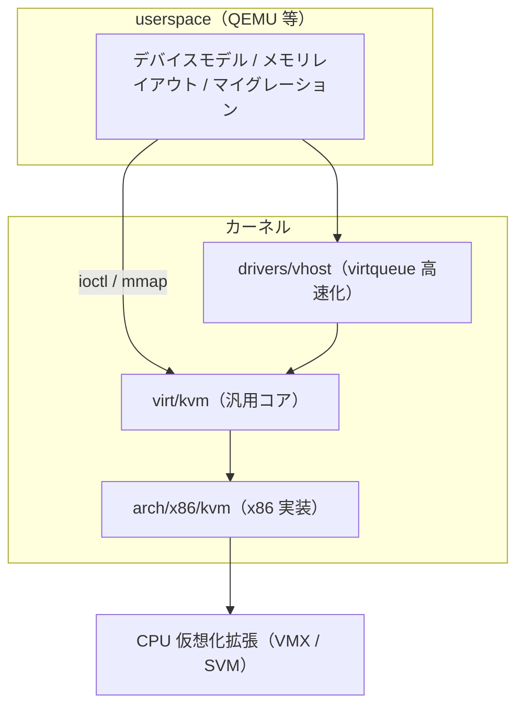
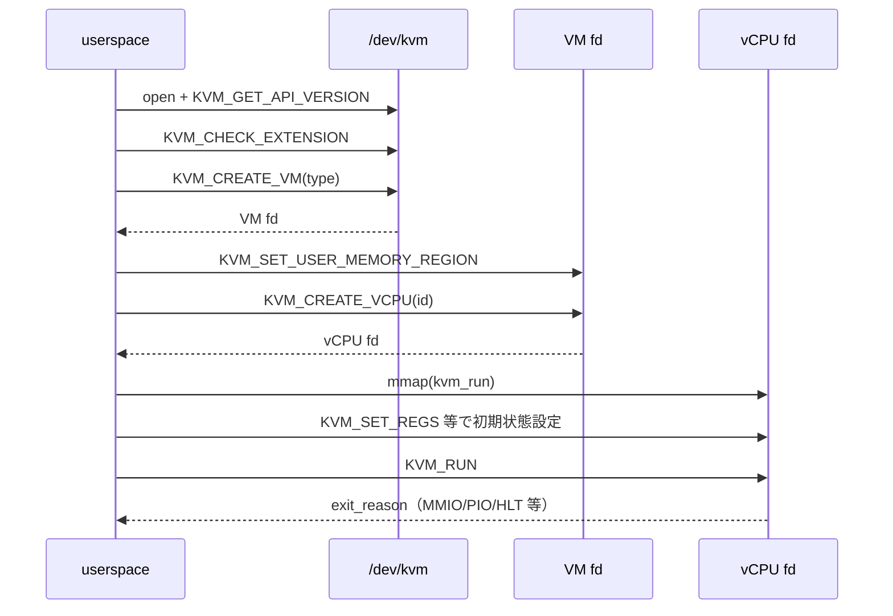

# 第1章 KVM の全体像と userspace 境界

> **本章で読むソース**
>
> - [`include/uapi/linux/kvm.h` L691-L692](https://github.com/gregkh/linux/blob/v6.18.38/include/uapi/linux/kvm.h#L691-L692)
> - [`include/uapi/linux/kvm.h` L704](https://github.com/gregkh/linux/blob/v6.18.38/include/uapi/linux/kvm.h#L704)
> - [`include/uapi/linux/kvm.h` L1220](https://github.com/gregkh/linux/blob/v6.18.38/include/uapi/linux/kvm.h#L1220)
> - [`include/uapi/linux/kvm.h` L1312](https://github.com/gregkh/linux/blob/v6.18.38/include/uapi/linux/kvm.h#L1312)
> - [`include/uapi/linux/kvm.h` L215-L225](https://github.com/gregkh/linux/blob/v6.18.38/include/uapi/linux/kvm.h#L215-L225)
> - [`virt/kvm/kvm_main.c` L5523-L5556](https://github.com/gregkh/linux/blob/v6.18.38/virt/kvm/kvm_main.c#L5523-L5556)
> - [`virt/kvm/kvm_main.c` L4448-L4478](https://github.com/gregkh/linux/blob/v6.18.38/virt/kvm/kvm_main.c#L4448-L4478)
> - [`virt/kvm/kvm_main.c` L6527-L6535](https://github.com/gregkh/linux/blob/v6.18.38/virt/kvm/kvm_main.c#L6527-L6535)

## この章の狙い

KVM が Linux カーネル内でどの層に位置し、userspace の VMM（典型的には QEMU）とどの ioctl 契約で接続するかを地図として押さえる。
`/dev/kvm`、VM ファイルディスクリプタ、vCPU ファイルディスクリプタの三層と、`KVM_CREATE_VM`、`KVM_CREATE_VCPU`、`KVM_RUN` の入口を読み、以降の章が追う `virt/kvm/` と `arch/x86/kvm/` の分担を示す。

## 前提

- [全体像と横断基盤](../../foundation/README.md) のシステムコール入口と `struct file` の基本
- ハードウェア仮想化（Intel VT-x / AMD SVM）の概念（本分冊第5部と第6部で実装を読む）

## KVM の位置づけ

KVM はカーネル内のハイパーバイザ層である。
ゲスト vCPU の実行そのもの（VM-entry / VM-exit）とゲストメモリの管理、割り込み注入の骨格を担い、デバイスモデルやディスクイメージの解釈は userspace に委ねる。



本分冊は上図のうちカーネル側のコア機構に焦点を当てる。
ゲスト OS の内部や QEMU の個別デバイス実装は対象外とする（[本分冊 README](../README.md) の委譲境界を参照）。

## 三層のファイルディスクリプタ

KVM の userspace API は入れ子のファイルディスクリプタで表現される。

| 層 | 取得方法 | 主な ioctl | カーネル側の役割 |
|---|---|---|---|
| `/dev/kvm` | `open("/dev/kvm")` | `KVM_CREATE_VM`、`KVM_CHECK_EXTENSION` | モジュール全体の能力照会と VM 生成の入口 |
| VM fd | `KVM_CREATE_VM` の戻り値 | `KVM_CREATE_VCPU`、`KVM_SET_USER_MEMORY_REGION` | メモリスロット、irq ルーティング、vCPU 生成 |
| vCPU fd | `KVM_CREATE_VCPU` の戻り値 | `KVM_RUN`、`KVM_SET_REGS` | vCPU 実行ループとレジスタ操作 |

uapi ヘッダはこの三層に対応する ioctl を定義する。

[`include/uapi/linux/kvm.h` L691-L692](https://github.com/gregkh/linux/blob/v6.18.38/include/uapi/linux/kvm.h#L691-L692)

```c
#define KVM_GET_API_VERSION       _IO(KVMIO,   0x00)
#define KVM_CREATE_VM             _IO(KVMIO,   0x01) /* returns a VM fd */
```

[`include/uapi/linux/kvm.h` L704](https://github.com/gregkh/linux/blob/v6.18.38/include/uapi/linux/kvm.h#L704)

```c
#define KVM_GET_VCPU_MMAP_SIZE    _IO(KVMIO,   0x04) /* in bytes */
```

[`include/uapi/linux/kvm.h` L1220](https://github.com/gregkh/linux/blob/v6.18.38/include/uapi/linux/kvm.h#L1220)

```c
#define KVM_CREATE_VCPU           _IO(KVMIO,   0x41)
```

[`include/uapi/linux/kvm.h` L1312](https://github.com/gregkh/linux/blob/v6.18.38/include/uapi/linux/kvm.h#L1312)

```c
#define KVM_RUN                   _IO(KVMIO,   0x80)
```

`KVM_CREATE_VM` の引数 `type` はマシン種別（x86 では `KVM_X86_DEFAULT_VM` 等）を渡す。
`KVM_CREATE_VCPU` の引数は vCPU スロット ID で、戻り値が vCPU fd となる。

## `/dev/kvm` の ioctl 実装

汎用コアは `virt/kvm/kvm_main.c` の `kvm_dev_ioctl` が `/dev/kvm` を処理する。

[`virt/kvm/kvm_main.c` L5523-L5556](https://github.com/gregkh/linux/blob/v6.18.38/virt/kvm/kvm_main.c#L5523-L5556)

```c
static long kvm_dev_ioctl(struct file *filp,
			  unsigned int ioctl, unsigned long arg)
{
	int r = -EINVAL;

	switch (ioctl) {
	case KVM_GET_API_VERSION:
		if (arg)
			goto out;
		r = KVM_API_VERSION;
		break;
	case KVM_CREATE_VM:
		r = kvm_dev_ioctl_create_vm(arg);
		break;
	case KVM_CHECK_EXTENSION:
		r = kvm_vm_ioctl_check_extension_generic(NULL, arg);
		break;
	case KVM_GET_VCPU_MMAP_SIZE:
		if (arg)
			goto out;
		r = PAGE_SIZE;     /* struct kvm_run */
#ifdef CONFIG_X86
		r += PAGE_SIZE;    /* pio data page */
#endif
#ifdef CONFIG_KVM_MMIO
		r += PAGE_SIZE;    /* coalesced mmio ring page */
#endif
		break;
	default:
		return kvm_arch_dev_ioctl(filp, ioctl, arg);
	}
out:
	return r;
}
```

`KVM_CHECK_EXTENSION` は VM 未作成時にも呼べるため、第3章で読む `kvm_vm_ioctl_check_extension_generic` を `kvm == NULL` で再利用している。
未対応の ioctl は `kvm_arch_dev_ioctl` にフォールバックし、アーキテクチャ固有の能力照会を x86 側へ委ねる。

## `KVM_RUN` と `struct kvm_run`

vCPU fd の中心は `KVM_RUN` である。
userspace は vCPU fd を `mmap` して得た `struct kvm_run` を共有し、exit 理由と入出力データをやり取りする。

[`include/uapi/linux/kvm.h` L215-L225](https://github.com/gregkh/linux/blob/v6.18.38/include/uapi/linux/kvm.h#L215-L225)

```c
struct kvm_run {
	/* in */
	__u8 request_interrupt_window;
	__u8 HINT_UNSAFE_IN_KVM(immediate_exit);
	__u8 padding1[6];

	/* out */
	__u32 exit_reason;
	__u8 ready_for_interrupt_injection;
	__u8 if_flag;
	__u16 flags;
```

`kvm_main.c` の `KVM_RUN` ハンドラはスレッド切り替えを検知したうえで `kvm_arch_vcpu_ioctl_run` を呼ぶ。
アーキテクチャ依存の実行ループ本体は `arch/x86/kvm/x86.c` にあり、第5章で詳述する。

[`virt/kvm/kvm_main.c` L4448-L4478](https://github.com/gregkh/linux/blob/v6.18.38/virt/kvm/kvm_main.c#L4448-L4478)

```c
	case KVM_RUN: {
		struct pid *oldpid;
		r = -EINVAL;
		if (arg)
			goto out;

		/*
		 * Note, vcpu->pid is primarily protected by vcpu->mutex. The
		 * dedicated r/w lock allows other tasks, e.g. other vCPUs, to
		 * read vcpu->pid while this vCPU is in KVM_RUN, e.g. to yield
		 * directly to this vCPU
		 */
		oldpid = vcpu->pid;
		if (unlikely(oldpid != task_pid(current))) {
			/* The thread running this VCPU changed. */
			struct pid *newpid;

			r = kvm_arch_vcpu_run_pid_change(vcpu);
			if (r)
				break;

			newpid = get_task_pid(current, PIDTYPE_PID);
			write_lock(&vcpu->pid_lock);
			vcpu->pid = newpid;
			write_unlock(&vcpu->pid_lock);

			put_pid(oldpid);
		}
		vcpu->wants_to_run = !READ_ONCE(vcpu->run->immediate_exit__unsafe);
		r = kvm_arch_vcpu_ioctl_run(vcpu);
		vcpu->wants_to_run = false;
```

## QEMU とカーネルの責任分担

| 領域 | userspace（QEMU 等） | カーネル（KVM） |
|---|---|---|
| vCPU 実行 | `KVM_RUN` をループで呼び、exit を処理 | VM-entry / VM-exit、ゲストレジスタ、EPT/NPT |
| ゲスト RAM | `mmap` した backing store のアドレスを `KVM_SET_USER_MEMORY_REGION` で登録 | memslot、GPA→HVA、dirty log |
| 割り込み | irqchip モデル、PIC/IOAPIC の状態操作 ioctl | LAPIC、割り込み注入、irqfd との接続 |
| I/O | MMIO/PIO のエミュレーション | `kvm_io_bus`、ioeventfd、exit 理由の報告 |
| デバイス | VirtIO、ディスク、NIC 等の完全なモデル | vhost による virtqueue 処理（第8部） |

QEMU は「いつゲストを走らせ、exit 時に何をエミュレートするか」を決めるオーケストレータである。
カーネルはハードウェア仮想化の安全な実行環境と、複数 VM 間の隔離を提供する。

## 本分冊の地図

| 部 | 主なソース | 扱う機構 |
|---|---|---|
| 第0部（本章と第2章） | `kvm_host.h`、`kvm_main.c` 骨格 | データ構造とアーキテクチャ ops |
| 第1部 | `kvm_main.c` | VM/vCPU ライフサイクル、`KVM_RUN` |
| 第2部 | `kvm_main.c`、`guest_memfd.c` | memslot、mmu_notifier、dirty log |
| 第3部 | `arch/x86/kvm/mmu/` | EPT/NPT、SPTE、TDP |
| 第4部 | `x86.c`、`emulate.c` | レジスタ、MSR、命令エミュレーション |
| 第5部と第6部 | `vmx/`、`svm/` | VMX/SVM の VM-entry/exit |
| 第7部 | `irqchip.c`、`eventfd.c` | 割り込み注入、MMIO、ioeventfd |
| 第8部 | `drivers/vhost/` | virtqueue、vhost-net |

`virt/kvm/kvm_main.c`（約 6.6k 行）が汎用コアの中心であり、`arch/x86/kvm/` がハードウェア依存の大半を占める。
vendor モジュール（`kvm_intel` / `kvm_amd`）がロードされると x86 実装が有効化され、汎用 `kvm` モジュールが `/dev/kvm` を登録する。

## `/dev/kvm` 登録の順序

インフラの初期化が完了してからでなければ userspace に露出してはならない。
`kvm_init` は `misc_register` を最後に呼ぶ。

[`virt/kvm/kvm_main.c` L6527-L6535](https://github.com/gregkh/linux/blob/v6.18.38/virt/kvm/kvm_main.c#L6527-L6535)

```c
	/*
	 * Registration _must_ be the very last thing done, as this exposes
	 * /dev/kvm to userspace, i.e. all infrastructure must be setup!
	 */
	r = misc_register(&kvm_dev);
	if (r) {
		pr_err("kvm: misc device register failed\n");
		goto err_register;
	}
```

Intel 側の `vt_init` も同様に、VMX/TDX の準備のあとで `kvm_init` を呼ぶコメントを持つ。
ハードウェア仮想化の有効化と vCPU キャッシュ確保が済むまで `/dev/kvm` を開けないようにしている。

## 処理の流れ：VM 起動までの ioctl 経路



## 高速化と最適化の工夫

`KVM_GET_VCPU_MMAP_SIZE` は vCPU ごとに複数ページを返し、`struct kvm_run`、PIO バッファ、coalesced MMIO リングを **1 回の mmap** で userspace にマップできるようにしている。
ioctl ごとに小さな構造体を `copy_to_user` するより、ホットパスである `KVM_RUN` の往復コストを抑える設計である。

また `immediate_exit` と `wants_to_run` の組み合わせにより、他 vCPU やシグナルハンドラから実行中の vCPU を打ち切る経路を用意している。
`vcpu->pid` を `pid_lock` で保護し、`KVM_RUN` 中でも他タスクが直接 yield 先を特定できるようにしている点は、スケジューラ連携の最適化である（詳細は [プロセスとスケジューラ](../../sched/README.md) との接点として第5章で再訪する）。

## まとめ

KVM は `/dev/kvm`、VM fd、vCPU fd の三層 ioctl で userspace と契約する。
`KVM_CREATE_VM` と `KVM_CREATE_VCPU` で入れ子の fd を作り、`KVM_RUN` がゲスト実行の入口となる。
デバイスエミュレーションは userspace、仮想化の実行と隔離はカーネルが担う。
`misc_register` はインフラ初期化の最後に行われ、未完成の状態で `/dev/kvm` が開かれない。

## 関連する章

- [`struct kvm` / `kvm_vcpu` とアーキテクチャ ops](02-kvm-vcpu-arch-ops.md)
- [VM の生成・破棄と ioctl 面](../part01-kvm-core/03-vm-lifecycle-ioctl.md)
- [`KVM_RUN` と vCPU 実行ループ](../part01-kvm-core/05-kvm-run-execution-loop.md)（執筆予定）
