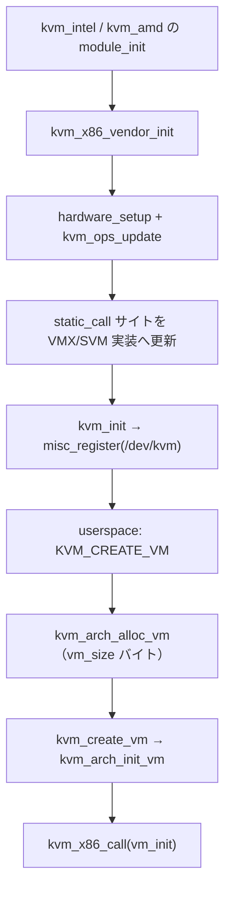

# 第2章 `struct kvm` / `kvm_vcpu` とアーキテクチャ ops

> **本章で読むソース**
>
> - [`include/linux/kvm_host.h` L770-L794](https://github.com/gregkh/linux/blob/v6.18.38/include/linux/kvm_host.h#L770-L794)
> - [`include/linux/kvm_host.h` L327-L351](https://github.com/gregkh/linux/blob/v6.18.38/include/linux/kvm_host.h#L327-L351)
> - [`arch/x86/include/asm/kvm_host.h` L1721-L1743](https://github.com/gregkh/linux/blob/v6.18.38/arch/x86/include/asm/kvm_host.h#L1721-L1743)
> - [`arch/x86/include/asm/kvm_host.h` L1805-L1809](https://github.com/gregkh/linux/blob/v6.18.38/arch/x86/include/asm/kvm_host.h#L1805-L1809)
> - [`arch/x86/include/asm/kvm_host.h` L2001-L2017](https://github.com/gregkh/linux/blob/v6.18.38/arch/x86/include/asm/kvm_host.h#L2001-L2017)
> - [`arch/x86/kvm/x86.c` L143](https://github.com/gregkh/linux/blob/v6.18.38/arch/x86/kvm/x86.c#L143)
> - [`arch/x86/kvm/x86.c` L10017-L10033](https://github.com/gregkh/linux/blob/v6.18.38/arch/x86/kvm/x86.c#L10017-L10033)
> - [`arch/x86/kvm/x86.c` L10067-L10070](https://github.com/gregkh/linux/blob/v6.18.38/arch/x86/kvm/x86.c#L10067-L10070)
> - [`virt/kvm/kvm_main.c` L441-L464](https://github.com/gregkh/linux/blob/v6.18.38/virt/kvm/kvm_main.c#L441-L464)
> - [`virt/kvm/kvm_main.c` L6481-L6487](https://github.com/gregkh/linux/blob/v6.18.38/virt/kvm/kvm_main.c#L6481-L6487)
> - [`arch/x86/include/asm/kvm-x86-ops.h` L6-L15](https://github.com/gregkh/linux/blob/v6.18.38/arch/x86/include/asm/kvm-x86-ops.h#L6-L15)

## この章の狙い

`virt/kvm/kvm_main.c` が担う汎用層と、`arch/x86/kvm/` が差し込むハードウェア依存層の境界をデータ構造から読む。
`struct kvm` と `struct kvm_vcpu` の共通部分、`kvm_x86_ops` と `kvm_arch_*` フック、および `static_call` による間接呼び出しの最適化を押さえる。

## 前提

- [第1章 KVM の全体像と userspace 境界](01-kvm-overview-userspace-boundary.md)
- [全体像と横断基盤](../../foundation/README.md) のモジュールと `static_call` の概観

## `struct kvm`：VM 全体の共通状態

`include/linux/kvm_host.h` の `struct kvm` はアーキテクチャ非依存の VM 状態を集約する。
末尾の `struct kvm_arch arch`（`asm/kvm_host.h` で定義）が x86 固有フィールドを保持する。

[`include/linux/kvm_host.h` L770-L794](https://github.com/gregkh/linux/blob/v6.18.38/include/linux/kvm_host.h#L770-L794)

```c
struct kvm {
#ifdef KVM_HAVE_MMU_RWLOCK
	rwlock_t mmu_lock;
#else
	spinlock_t mmu_lock;
#endif /* KVM_HAVE_MMU_RWLOCK */

	struct mutex slots_lock;

	/*
	 * Protects the arch-specific fields of struct kvm_memory_slots in
	 * use by the VM. To be used under the slots_lock (above) or in a
	 * kvm->srcu critical section where acquiring the slots_lock would
	 * lead to deadlock with the synchronize_srcu in
	 * kvm_swap_active_memslots().
	 */
	struct mutex slots_arch_lock;
	struct mm_struct *mm; /* userspace tied to this vm */
	unsigned long nr_memslot_pages;
	/* The two memslot sets - active and inactive (per address space) */
	struct kvm_memslots __memslots[KVM_MAX_NR_ADDRESS_SPACES][2];
	/* The current active memslot set for each address space */
	struct kvm_memslots __rcu *memslots[KVM_MAX_NR_ADDRESS_SPACES];
	struct xarray vcpu_array;
	/*
```

注目すべきフィールドは次のとおりである。

`mm` は VM を作成した userspace プロセスのアドレス空間への参照であり、memslot の HVA 解決に使われる。
`__memslots[i][2]` は active/inactive の二組 memslot を保持し、更新時にポインタを切り替える（第2部で詳述）。
`vcpu_array` は vCPU への XArray インデックスであり、`KVM_CREATE_VCPU` で埋まる。
`users_count`（直後のフィールド群に含まれる）は VM の参照カウントであり、第3章で読む破棄経路の核となる。

## `struct kvm_vcpu`：vCPU ごとの共通状態

vCPU は汎用フィールドと `struct kvm_vcpu_arch arch` の二層で表現される。

[`include/linux/kvm_host.h` L327-L351](https://github.com/gregkh/linux/blob/v6.18.38/include/linux/kvm_host.h#L327-L351)

```c
struct kvm_vcpu {
	struct kvm *kvm;
#ifdef CONFIG_PREEMPT_NOTIFIERS
	struct preempt_notifier preempt_notifier;
#endif
	int cpu;
	int vcpu_id; /* id given by userspace at creation */
	int vcpu_idx; /* index into kvm->vcpu_array */
	int ____srcu_idx; /* Don't use this directly.  You've been warned. */
#ifdef CONFIG_PROVE_RCU
	int srcu_depth;
#endif
	int mode;
	u64 requests;
	unsigned long guest_debug;

	struct mutex mutex;
	struct kvm_run *run;

#ifndef __KVM_HAVE_ARCH_WQP
	struct rcuwait wait;
#endif
	struct pid *pid;
	rwlock_t pid_lock;
	int sigset_active;
```

`vcpu_id` は userspace が `KVM_CREATE_VCPU` に渡すスロット番号、`vcpu_idx` はカーネル内部の連番インデックスである。
`mutex` は vCPU ioctl の直列化に使われ、`run` は mmap された `struct kvm_run` へのポインタである。
`requests` は TLB flush や再実行要求など、他 CPU から vCPU に送るビットマスク要求のキューである（第4章）。

x86 では `struct kvm_vcpu` の実サイズは vendor モジュール登録時に決まる。
`kvm_init` が `kmem_cache_create_usercopy` でキャッシュを作る際、userspace へコピーしてよい範囲は `arch` の先頭から `stats_id` の終端までに限定される（`dirty_ring` 以降や vendor 拡張構造体の末尾は含まれない）。
これは SLAB hardened usercopy が、許可オフセット外の `copy_to_user` / `copy_from_user` を拒否する仕組みである。

[`virt/kvm/kvm_main.c` L6481-L6487](https://github.com/gregkh/linux/blob/v6.18.38/virt/kvm/kvm_main.c#L6481-L6487)

```c
	kvm_vcpu_cache =
		kmem_cache_create_usercopy("kvm_vcpu", vcpu_size, vcpu_align,
					   SLAB_ACCOUNT,
					   offsetof(struct kvm_vcpu, arch),
					   offsetofend(struct kvm_vcpu, stats_id)
					   - offsetof(struct kvm_vcpu, arch),
					   NULL);
```

## 汎用層の vCPU 初期化

`kvm_main.c` の `kvm_vcpu_init` はアーキテクチャ呼び出しの前に共通フィールドを初期化する。

[`virt/kvm/kvm_main.c` L441-L464](https://github.com/gregkh/linux/blob/v6.18.38/virt/kvm/kvm_main.c#L441-L464)

```c
static void kvm_vcpu_init(struct kvm_vcpu *vcpu, struct kvm *kvm, unsigned id)
{
	mutex_init(&vcpu->mutex);
	vcpu->cpu = -1;
	vcpu->kvm = kvm;
	vcpu->vcpu_id = id;
	vcpu->pid = NULL;
	rwlock_init(&vcpu->pid_lock);
#ifndef __KVM_HAVE_ARCH_WQP
	rcuwait_init(&vcpu->wait);
#endif
	kvm_async_pf_vcpu_init(vcpu);

	kvm_vcpu_set_in_spin_loop(vcpu, false);
	kvm_vcpu_set_dy_eligible(vcpu, false);
	vcpu->preempted = false;
	vcpu->ready = false;
	preempt_notifier_init(&vcpu->preempt_notifier, &kvm_preempt_ops);
	vcpu->last_used_slot = NULL;

	/* Fill the stats id string for the vcpu */
	snprintf(vcpu->stats_id, sizeof(vcpu->stats_id), "kvm-%d/vcpu-%d",
		 task_pid_nr(current), id);
}
```

このあと `kvm_arch_vcpu_create` が呼ばれ、VMX または SVM 固有の `vcpu_vmx` / `vcpu_svm` 部分が初期化される。

## `kvm_x86_ops`：ハードウェア依存の関数テーブル

x86 KVM は巨大な関数ポインタ構造体 `kvm_x86_ops` に実行経路を集約する。
VM ライフサイクル、レジスタアクセス、TLB flush、そして `vcpu_run` / `handle_exit` がここに並ぶ。

[`arch/x86/include/asm/kvm_host.h` L1721-L1743](https://github.com/gregkh/linux/blob/v6.18.38/arch/x86/include/asm/kvm_host.h#L1721-L1743)

```c
struct kvm_x86_ops {
	const char *name;

	int (*check_processor_compatibility)(void);

	int (*enable_virtualization_cpu)(void);
	void (*disable_virtualization_cpu)(void);
	cpu_emergency_virt_cb *emergency_disable_virtualization_cpu;

	void (*hardware_unsetup)(void);
	bool (*has_emulated_msr)(struct kvm *kvm, u32 index);
	void (*vcpu_after_set_cpuid)(struct kvm_vcpu *vcpu);

	unsigned int vm_size;
	int (*vm_init)(struct kvm *kvm);
	void (*vm_destroy)(struct kvm *kvm);
	void (*vm_pre_destroy)(struct kvm *kvm);

	/* Create, but do not attach this VCPU */
	int (*vcpu_precreate)(struct kvm *kvm);
	int (*vcpu_create)(struct kvm_vcpu *vcpu);
	void (*vcpu_free)(struct kvm_vcpu *vcpu);
	void (*vcpu_reset)(struct kvm_vcpu *vcpu, bool init_event);
```

実行ループに直結するメンバは次のとおりである。

[`arch/x86/include/asm/kvm_host.h` L1805-L1809](https://github.com/gregkh/linux/blob/v6.18.38/arch/x86/include/asm/kvm_host.h#L1805-L1809)

```c
	int (*vcpu_pre_run)(struct kvm_vcpu *vcpu);
	enum exit_fastpath_completion (*vcpu_run)(struct kvm_vcpu *vcpu,
						  u64 run_flags);
	int (*handle_exit)(struct kvm_vcpu *vcpu,
		enum exit_fastpath_completion exit_fastpath);
```

Intel では `vmx/main.c` の `vt_x86_ops`、AMD では `svm/svm.c` の `svm_x86_ops` がこのテーブルを埋める。
ロード時に `kvm_x86_vendor_init` が一つの vendor 実装だけを登録し、二重ロードを拒否する。

[`arch/x86/kvm/x86.c` L10067-L10070](https://github.com/gregkh/linux/blob/v6.18.38/arch/x86/kvm/x86.c#L10067-L10070)

```c
	if (kvm_x86_ops.enable_virtualization_cpu) {
		pr_err("already loaded vendor module '%s'\n", kvm_x86_ops.name);
		return -EEXIST;
	}
```

## `kvm_arch_*` と `kvm_x86_call` の分離

汎用コアは `kvm_arch_*` という名前の薄いラッパ経由でアーキテクチャ層を呼ぶ。
x86 では多くが `kvm_x86_call(...)` マクロに展開され、最終的に `static_call` サイトへ跳ぶ。

[`arch/x86/include/asm/kvm_host.h` L2001-L2017](https://github.com/gregkh/linux/blob/v6.18.38/arch/x86/include/asm/kvm_host.h#L2001-L2017)

```c
#define kvm_x86_call(func) static_call(kvm_x86_##func)
#define kvm_pmu_call(func) static_call(kvm_x86_pmu_##func)

#define KVM_X86_OP(func) \
	DECLARE_STATIC_CALL(kvm_x86_##func, *(((struct kvm_x86_ops *)0)->func));
#define KVM_X86_OP_OPTIONAL KVM_X86_OP
#define KVM_X86_OP_OPTIONAL_RET0 KVM_X86_OP
#include <asm/kvm-x86-ops.h>

int kvm_x86_vendor_init(struct kvm_x86_init_ops *ops);
void kvm_x86_vendor_exit(void);

#define __KVM_HAVE_ARCH_VM_ALLOC
static inline struct kvm *kvm_arch_alloc_vm(void)
{
	return kvzalloc(kvm_x86_ops.vm_size, GFP_KERNEL_ACCOUNT);
}
```

`kvm_arch_alloc_vm` は `kvm_x86_ops.vm_size` バイトを確保する。
VMX では `sizeof(struct kvm_vmx)` がこの値であり、汎用 `struct kvm` より大きいアーキテクチャ拡張領域を含む。

`kvm_arch_init_vm`（`x86.c`）は共通初期化のあと `kvm_x86_call(vm_init)(kvm)` を呼び、vendor 固有の VM セットアップへ進む。

## `static_call` の更新：`kvm_ops_update`

vendor モジュールのロード時、`kvm_ops_update` が `kvm_x86_ops` をコピーし、各 `static_call` サイトを実関数へ張り替える。

[`arch/x86/kvm/x86.c` L10017-L10033](https://github.com/gregkh/linux/blob/v6.18.38/arch/x86/kvm/x86.c#L10017-L10033)

```c
static inline void kvm_ops_update(struct kvm_x86_init_ops *ops)
{
	memcpy(&kvm_x86_ops, ops->runtime_ops, sizeof(kvm_x86_ops));

#define __KVM_X86_OP(func) \
	static_call_update(kvm_x86_##func, kvm_x86_ops.func);
#define KVM_X86_OP(func) \
	WARN_ON(!kvm_x86_ops.func); __KVM_X86_OP(func)
#define KVM_X86_OP_OPTIONAL __KVM_X86_OP
#define KVM_X86_OP_OPTIONAL_RET0(func) \
	static_call_update(kvm_x86_##func, (void *)kvm_x86_ops.func ? : \
					   (void *)__static_call_return0);
#include <asm/kvm-x86-ops.h>
#undef __KVM_X86_OP

	kvm_pmu_ops_update(ops->pmu_ops);
}
```

`asm/kvm-x86-ops.h` は `KVM_X86_OP(vcpu_run)` のように列挙されたシンボルごとに `static_call_update` を生成する源である。
`KVM_X86_OP_OPTIONAL` は ops テーブルで NULL 定義を許すだけであり、`kvm_ops_update` では `WARN_ON` なしで `static_call_update` する（`__KVM_X86_OP` 経由）。
呼び出し側は `static_call_cond(kvm_x86_vm_pre_destroy)` のように存在確認してから呼ぶ。
`KVM_X86_OP_OPTIONAL_RET0` は NULL のときだけ `__static_call_return0` へ張り替え、無条件の `kvm_x86_call(...)` でも安全に呼べる。

[`arch/x86/include/asm/kvm-x86-ops.h` L6-L15](https://github.com/gregkh/linux/blob/v6.18.38/arch/x86/include/asm/kvm-x86-ops.h#L6-L15)

```c
/*
 * KVM_X86_OP() and KVM_X86_OP_OPTIONAL() are used to help generate
 * both DECLARE/DEFINE_STATIC_CALL() invocations and
 * "static_call_update()" calls.
 *
 * KVM_X86_OP_OPTIONAL() can be used for those functions that can have
 * a NULL definition.  KVM_X86_OP_OPTIONAL_RET0() can be used likewise
 * to make a definition optional, but in this case the default will
 * be __static_call_return0.
 */
```

ランタイムのグローバル実体は次のとおりである。

[`arch/x86/kvm/x86.c` L143](https://github.com/gregkh/linux/blob/v6.18.38/arch/x86/kvm/x86.c#L143)

```c
struct kvm_x86_ops kvm_x86_ops __read_mostly;
```

## `kvm_main.c` の構造（汎用コアの分担）

`kvm_main.c` はおおよそ次の責務に分かれる。

| 領域 | 代表シンボル | 内容 |
|---|---|---|
| モジュール初期化 | `kvm_init`、`misc_register` | `/dev/kvm`、vCPU キャッシュ、仮想化有効化 |
| VM ライフサイクル | `kvm_create_vm`、`kvm_destroy_vm` | memslot、mmu_notifier、参照カウント |
| ioctl ディスパッチ | `kvm_dev_ioctl`、`kvm_vm_ioctl`、`kvm_vcpu_ioctl` | uapi 契約の実装 |
| vCPU 実行の入口 | `KVM_RUN` → `kvm_arch_vcpu_ioctl_run` | 汎用の pid 管理とシグナル |
| メモリ | memslot、dirty log、guest_memfd | 第2部の主題 |
| I/O と eventfd | `kvm_io_bus`、`eventfd.c` 連携 | 第7部の主題 |

アーキテクチャ層に委ねる処理は `kvm_arch_*` または weak シンボルでフックされる。
例として `kvm_arch_init_vm`、`kvm_arch_vcpu_create`、`kvm_arch_vcpu_ioctl_run` は x86 実装が上書きする。

## 処理の流れ：vendor ロードから VM 生成まで



## 高速化と最適化の工夫

KVM x86 はホットパスごとに関数ポインタを間接呼び出しするのではなく、`static_call` で呼び出しサイトを固定する。
`kvm_ops_update` はモジュールロード時に一度だけパッチし、以降の `kvm_x86_call(vcpu_run)` 等は直接分岐に近いコストになる。

これは仮想化オーバーヘッド削減のための典型的なカーネル内手法である。
ops テーブル自体は `__read_mostly` に置かれ、キャッシュラインの共有を抑える。

また `kvm_arch_alloc_vm` が `kvm_x86_ops.vm_size` を参照するため、VMX と SVM で異なる拡張 `struct kvm` を無駄なく確保できる。
汎用 `kzalloc(sizeof(struct kvm))` では足りないフィールドを、vendor 登録後のサイズで一括確保する。

## まとめ

`struct kvm` と `struct kvm_vcpu` は汎用コアのデータモデルであり、`kvm_arch` / `kvm_vcpu_arch` が x86 拡張を載せる。
実行経路の差し替え点は `kvm_x86_ops` に集約され、`kvm_x86_call` と `static_call` で間接呼び出しコストを抑える。
`kvm_main.c` は ioctl とライフサイクルの枠組みを提供し、ハードウェア依存処理は `arch/x86/kvm/` へ委譲する。

## 関連する章

- [VM の生成・破棄と ioctl 面](../part01-kvm-core/03-vm-lifecycle-ioctl.md)
- [VMX 有効化と VMCS の構築](../part05-vmx/14-vmx-enable-vmcs.md)（執筆予定）
- [VMCB と `svm_vcpu_run`](../part06-svm/17-vmcb-svm-run.md)（執筆予定）
