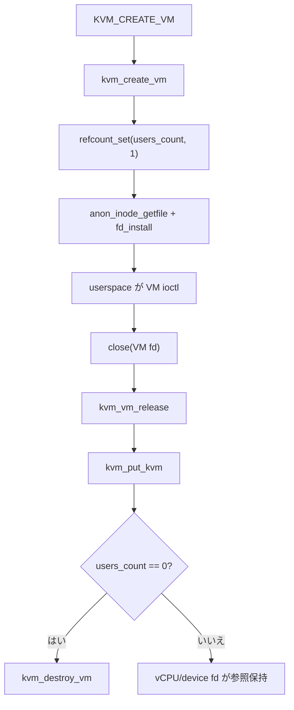

# 第3章 VM の生成・破棄と ioctl 面

> **本章で読むソース**
>
> - [`virt/kvm/kvm_main.c` L1114-L1132](https://github.com/gregkh/linux/blob/v6.18.38/virt/kvm/kvm_main.c#L1114-L1132)
> - [`virt/kvm/kvm_main.c` L1165-L1223](https://github.com/gregkh/linux/blob/v6.18.38/virt/kvm/kvm_main.c#L1165-L1223)
> - [`virt/kvm/kvm_main.c` L1272-L1293](https://github.com/gregkh/linux/blob/v6.18.38/virt/kvm/kvm_main.c#L1272-L1293)
> - [`virt/kvm/kvm_main.c` L1350-L1377](https://github.com/gregkh/linux/blob/v6.18.38/virt/kvm/kvm_main.c#L1350-L1377)
> - [`virt/kvm/kvm_main.c` L5480-L5514](https://github.com/gregkh/linux/blob/v6.18.38/virt/kvm/kvm_main.c#L5480-L5514)
> - [`fs/anon_inodes.c` L166-L173](https://github.com/gregkh/linux/blob/v6.18.38/fs/anon_inodes.c#L166-L173)
> - [`virt/kvm/kvm_main.c` L5155-L5160](https://github.com/gregkh/linux/blob/v6.18.38/virt/kvm/kvm_main.c#L5155-L5160)
> - [`arch/x86/kvm/x86.c` L13200-L13226](https://github.com/gregkh/linux/blob/v6.18.38/arch/x86/kvm/x86.c#L13200-L13226)

## この章の狙い

`KVM_CREATE_VM` から VM ファイルディスクリプタが返るまでと、最後の参照が落ちて `kvm_destroy_vm` が走るまでをソースで追う。
`kvm_create_vm` の初期化順序、`kvm_vm_ioctl` のガード、`users_count` 参照カウント、anon inode による fd ライフサイクルの結び付けを読む。

## 前提

- [第1章 KVM の全体像と userspace 境界](../part00-foundation/01-kvm-overview-userspace-boundary.md)
- [第2章 `struct kvm` / `kvm_vcpu` とアーキテクチャ ops](../part00-foundation/02-kvm-vcpu-arch-ops.md)

## `kvm_create_vm`：生成の骨格

`kvm_dev_ioctl_create_vm` は内部で `kvm_create_vm` を呼ぶ。
生成処理はアーキテクチャ確保からロック類の初期化、memslot ツリー、仮想化有効化までを順に進める。

[`virt/kvm/kvm_main.c` L1114-L1132](https://github.com/gregkh/linux/blob/v6.18.38/virt/kvm/kvm_main.c#L1114-L1132)

```c
static struct kvm *kvm_create_vm(unsigned long type, const char *fdname)
{
	struct kvm *kvm = kvm_arch_alloc_vm();
	struct kvm_memslots *slots;
	int r, i, j;

	if (!kvm)
		return ERR_PTR(-ENOMEM);

	KVM_MMU_LOCK_INIT(kvm);
	mmgrab(current->mm);
	kvm->mm = current->mm;
	kvm_eventfd_init(kvm);
	mutex_init(&kvm->lock);
	mutex_init(&kvm->irq_lock);
	mutex_init(&kvm->slots_lock);
	mutex_init(&kvm->slots_arch_lock);
	spin_lock_init(&kvm->mn_invalidate_lock);
	rcuwait_init(&kvm->mn_memslots_update_rcuwait);
```

`mmgrab(current->mm)` により VM は作成プロセスのアドレス空間に束縛される。
以降の `kvm_vm_ioctl` は `kvm->mm != current->mm` を検査し、他プロセスからの ioctl を拒否する（後述）。

参照カウントの初期化と memslot 二重バッファ、I/O バス、仮想化有効化は次のブロックに続く。

[`virt/kvm/kvm_main.c` L1165-L1223](https://github.com/gregkh/linux/blob/v6.18.38/virt/kvm/kvm_main.c#L1165-L1223)

```c
	refcount_set(&kvm->users_count, 1);

	for (i = 0; i < kvm_arch_nr_memslot_as_ids(kvm); i++) {
		for (j = 0; j < 2; j++) {
			slots = &kvm->__memslots[i][j];

			atomic_long_set(&slots->last_used_slot, (unsigned long)NULL);
			slots->hva_tree = RB_ROOT_CACHED;
			slots->gfn_tree = RB_ROOT;
			hash_init(slots->id_hash);
			slots->node_idx = j;

			/* Generations must be different for each address space. */
			slots->generation = i;
		}

		rcu_assign_pointer(kvm->memslots[i], &kvm->__memslots[i][0]);
	}

	r = -ENOMEM;
	for (i = 0; i < KVM_NR_BUSES; i++) {
		rcu_assign_pointer(kvm->buses[i],
			kzalloc(sizeof(struct kvm_io_bus), GFP_KERNEL_ACCOUNT));
		if (!kvm->buses[i])
			goto out_err_no_arch_destroy_vm;
	}

	r = kvm_arch_init_vm(kvm, type);
	if (r)
		goto out_err_no_arch_destroy_vm;

	r = kvm_enable_virtualization();
	if (r)
		goto out_err_no_disable;

#ifdef CONFIG_HAVE_KVM_IRQCHIP
	INIT_HLIST_HEAD(&kvm->irq_ack_notifier_list);
#endif

	r = kvm_init_mmu_notifier(kvm);
	if (r)
		goto out_err_no_mmu_notifier;

	r = kvm_coalesced_mmio_init(kvm);
	if (r < 0)
		goto out_no_coalesced_mmio;

	r = kvm_create_vm_debugfs(kvm, fdname);
	if (r)
		goto out_err_no_debugfs;

	mutex_lock(&kvm_lock);
	list_add(&kvm->vm_list, &vm_list);
	mutex_unlock(&kvm_lock);

	preempt_notifier_inc();
	kvm_init_pm_notifier(kvm);

	return kvm;
```

失敗時はラベル付き `goto` で部分初期化を巻き戻す。
`users_count` は 1 で始まり、成功後に fd へ結び付けられると VM fd の `release` が最終的な `kvm_put_kvm` を担う。

## x86 側の `kvm_arch_init_vm`

汎用初期化のあと x86 はページトラッキングと MMU、vendor の `vm_init` を呼ぶ。

[`arch/x86/kvm/x86.c` L13200-L13226](https://github.com/gregkh/linux/blob/v6.18.38/arch/x86/kvm/x86.c#L13200-L13226)

```c
int kvm_arch_init_vm(struct kvm *kvm, unsigned long type)
{
	int ret;
	unsigned long flags;

	if (!kvm_is_vm_type_supported(type))
		return -EINVAL;

	kvm->arch.vm_type = type;
	kvm->arch.has_private_mem =
		(type == KVM_X86_SW_PROTECTED_VM);
	/* Decided by the vendor code for other VM types.  */
	kvm->arch.pre_fault_allowed =
		type == KVM_X86_DEFAULT_VM || type == KVM_X86_SW_PROTECTED_VM;
	kvm->arch.disabled_quirks = kvm_caps.inapplicable_quirks & kvm_caps.supported_quirks;

	ret = kvm_page_track_init(kvm);
	if (ret)
		goto out;

	ret = kvm_mmu_init_vm(kvm);
	if (ret)
		goto out_cleanup_page_track;

	ret = kvm_x86_call(vm_init)(kvm);
	if (ret)
		goto out_uninit_mmu;
```

`type` 不一致はここで `-EINVAL` となる。
VMX/SVM 固有のセットアップは `kvm_x86_call(vm_init)` に閉じ込められている。

## anon inode と VM fd のインストール

`kvm_create_vm` が成功すると、`kvm_dev_ioctl_create_vm` は anon inode ファイルを作り fd を返す。

[`virt/kvm/kvm_main.c` L5480-L5514](https://github.com/gregkh/linux/blob/v6.18.38/virt/kvm/kvm_main.c#L5480-L5514)

```c
static int kvm_dev_ioctl_create_vm(unsigned long type)
{
	char fdname[ITOA_MAX_LEN + 1];
	int r, fd;
	struct kvm *kvm;
	struct file *file;

	fd = get_unused_fd_flags(O_CLOEXEC);
	if (fd < 0)
		return fd;

	snprintf(fdname, sizeof(fdname), "%d", fd);

	kvm = kvm_create_vm(type, fdname);
	if (IS_ERR(kvm)) {
		r = PTR_ERR(kvm);
		goto put_fd;
	}

	file = anon_inode_getfile("kvm-vm", &kvm_vm_fops, kvm, O_RDWR);
	if (IS_ERR(file)) {
		r = PTR_ERR(file);
		goto put_kvm;
	}

	/*
	 * Don't call kvm_put_kvm anymore at this point; file->f_op is
	 * already set, with ->release() being kvm_vm_release().  In error
	 * cases it will be called by the final fput(file) and will take
	 * care of doing kvm_put_kvm(kvm).
	 */
	kvm_uevent_notify_change(KVM_EVENT_CREATE_VM, kvm);

	fd_install(fd, file);
	return fd;
```

`anon_inode_getfile` は `anon_inodefs` 上の共有 inode（と `alloc_file_pseudo` が作る pseudo dentry）へ file を結び付ける。
通常の名前付きファイルシステム上に個別の永続パスは作らないが、inode と dentry は持つ。
`private_data` に `struct kvm *` を載せ、`kvm_vm_fops` で ioctl と release を VM へ結び付ける。

[`fs/anon_inodes.c` L166-L173](https://github.com/gregkh/linux/blob/v6.18.38/fs/anon_inodes.c#L166-L173)

```c
	file = alloc_file_pseudo(inode, anon_inode_mnt, name,
				 flags & (O_ACCMODE | O_NONBLOCK), fops);
	if (IS_ERR(file))
		goto err_iput;

	file->f_mapping = inode->i_mapping;

	file->private_data = priv;
```

`kvm_vm_fops.release` は `kvm_vm_release` で、fd クローズ時に `kvm_put_kvm` へ至る。

エラー経路ではコメントのとおり `fput` が `kvm_put_kvm` を呼ぶため、成功後に手動で `kvm_put_kvm` してはならない。

## `kvm_vm_ioctl`：VM fd の入口

VM fd に対する ioctl はまず呼び出し元プロセスと VM の生存を確認する。

[`virt/kvm/kvm_main.c` L5155-L5160](https://github.com/gregkh/linux/blob/v6.18.38/virt/kvm/kvm_main.c#L5155-L5160)

```c
	if (kvm->mm != current->mm || kvm->vm_dead)
		return -EIO;
	switch (ioctl) {
	case KVM_CREATE_VCPU:
		r = kvm_vm_ioctl_create_vcpu(kvm, arg);
		break;
```

`mm` 不一致の `-EIO` は、fork 後に親と子が同じ VM fd を共有して ioctl する事故を防ぐ。
`vm_dead` は破棄途中の VM への操作を拒否する。

同関数は `KVM_SET_USER_MEMORY_REGION`、`KVM_GET_DIRTY_LOG`、`KVM_IRQFD` 等の大きな switch を持つ。
本章ではライフサイクルに直結する `KVM_CREATE_VCPU` の存在だけ示し、各機能は該当部で読む。

## 参照カウントと破棄

`kvm_get_kvm` / `kvm_put_kvm` は `users_count` を増減し、ゼロで `kvm_destroy_vm` を呼ぶ。

[`virt/kvm/kvm_main.c` L1350-L1377](https://github.com/gregkh/linux/blob/v6.18.38/virt/kvm/kvm_main.c#L1350-L1377)

```c
void kvm_put_kvm(struct kvm *kvm)
{
	if (refcount_dec_and_test(&kvm->users_count))
		kvm_destroy_vm(kvm);
}
EXPORT_SYMBOL_GPL(kvm_put_kvm);

/*
 * Used to put a reference that was taken on behalf of an object associated
 * with a user-visible file descriptor, e.g. a vcpu or device, if installation
 * of the new file descriptor fails and the reference cannot be transferred to
 * its final owner.  In such cases, the caller is still actively using @kvm and
 * will fail miserably if the refcount unexpectedly hits zero.
 */
void kvm_put_kvm_no_destroy(struct kvm *kvm)
{
	WARN_ON(refcount_dec_and_test(&kvm->users_count));
}
EXPORT_SYMBOL_FOR_KVM_INTERNAL(kvm_put_kvm_no_destroy);

static int kvm_vm_release(struct inode *inode, struct file *filp)
{
	struct kvm *kvm = filp->private_data;

	kvm_irqfd_release(kvm);

	kvm_put_kvm(kvm);
	return 0;
```

vCPU fd や device fd は生成時に `kvm_get_kvm` で参照を持ち、VM fd が閉じられても vCPU が残っていれば VM 構造体は生き続ける。
逆に vCPU fd だけ閉じても VM fd が開いていれば VM は破棄されない。

## `kvm_destroy_vm`：破棄順序

最後の `kvm_put_kvm` が `kvm_destroy_vm` を呼ぶと、irq ルーティングと I/O バスが解放され、アーキテクチャ層の `kvm_arch_destroy_vm` へ進む。

[`virt/kvm/kvm_main.c` L1272-L1293](https://github.com/gregkh/linux/blob/v6.18.38/virt/kvm/kvm_main.c#L1272-L1293)

```c
static void kvm_destroy_vm(struct kvm *kvm)
{
	int i;
	struct mm_struct *mm = kvm->mm;

	kvm_destroy_pm_notifier(kvm);
	kvm_uevent_notify_change(KVM_EVENT_DESTROY_VM, kvm);
	kvm_destroy_vm_debugfs(kvm);
	mutex_lock(&kvm_lock);
	list_del(&kvm->vm_list);
	mutex_unlock(&kvm_lock);
	kvm_arch_pre_destroy_vm(kvm);

	kvm_free_irq_routing(kvm);
	for (i = 0; i < KVM_NR_BUSES; i++) {
		struct kvm_io_bus *bus = kvm_get_bus_for_destruction(kvm, i);

		if (bus)
			kvm_io_bus_destroy(bus);
		kvm->buses[i] = NULL;
	}
	kvm_coalesced_mmio_free(kvm);
```

続く処理で mmu_notifier の解除、`kvm_arch_destroy_vm`、memslot 解放、`kvm_disable_virtualization`、`mmdrop(mm)` が行われる。
`mmdrop` により作成時の `mmgrab` と対が取れる。

## 処理の流れ：VM fd のライフサイクル



## 高速化と最適化の工夫

memslot は `__memslots[i][0]` と `[i][1]` の **二組** を用意し、更新時に active ポインタを切り替える（generations 付き）。
vCPU が古い memslot をキャッシュしていても、世代番号で stale ヒットを検出できる（`kvm_host.h` の `KVM_MEMSLOT_GEN_UPDATE_IN_PROGRESS` コメント参照）。

参照カウントは VM fd だけでなく vCPU fd からも `kvm_get_kvm` される。
`kvm_put_kvm_no_destroy` は fd インストール失敗時に誤って VM 全体を破棄しないための安全弁であり、ホットパスではなく正しさのための API である。

`kvm_enable_virtualization` は `kvm_usage_count` で全 VM 横断のハードウェア仮想化有効化を共有する。
VM ごとに CPU 仮想化をオンオフせず、最初の VM 作成で一度だけコストの高いセットアップを済ませる。

## まとめ

`kvm_create_vm` は汎用初期化のあと `kvm_arch_init_vm` と仮想化有効化を行い、`users_count = 1` で返る。
`anon_inode_getfile` が VM fd と `struct kvm` を結び、`kvm_vm_release` 経由で `kvm_put_kvm` が破棄を起動する。
`kvm_vm_ioctl` は `mm` 一致を要求し、プロセス境界を守る。
二重 memslot と共有の仮想化有効化は、更新と起動コストのバランスを取る実装である。

## 関連する章

- [vCPU の生成・破棄とリクエスト機構](04-vcpu-lifecycle-requests.md)（執筆予定）
- [メモリスロット、`guest_memfd`、ホストバッキング](../part02-guest-memory/06-memory-slots-guest-memfd.md)（執筆予定）
- [メモリ管理：mmap とプロセスアドレス空間](../../mm/part03-virtual/12-mmap-munmap.md)
