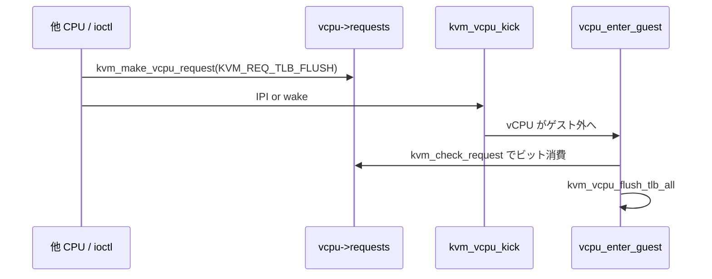

# 第4章 vCPU の生成・破棄とリクエスト機構

> **本章で読むソース**
>
> - [`virt/kvm/kvm_main.c` L4159-L4210](https://github.com/gregkh/linux/blob/v6.18.38/virt/kvm/kvm_main.c#L4159-L4210)
> - [`virt/kvm/kvm_main.c` L4232-L4257](https://github.com/gregkh/linux/blob/v6.18.38/virt/kvm/kvm_main.c#L4232-L4257)
> - [`virt/kvm/kvm_main.c` L441-L464](https://github.com/gregkh/linux/blob/v6.18.38/virt/kvm/kvm_main.c#L441-L464)
> - [`virt/kvm/kvm_main.c` L466-L480](https://github.com/gregkh/linux/blob/v6.18.38/virt/kvm/kvm_main.c#L466-L480)
> - [`virt/kvm/kvm_main.c` L4117-L4123](https://github.com/gregkh/linux/blob/v6.18.38/virt/kvm/kvm_main.c#L4117-L4123)
> - [`virt/kvm/kvm_main.c` L216-L242](https://github.com/gregkh/linux/blob/v6.18.38/virt/kvm/kvm_main.c#L216-L242)
> - [`include/linux/kvm_host.h` L158-L169](https://github.com/gregkh/linux/blob/v6.18.38/include/linux/kvm_host.h#L158-L169)
> - [`include/linux/kvm_host.h` L2239-L2298](https://github.com/gregkh/linux/blob/v6.18.38/include/linux/kvm_host.h#L2239-L2298)
> - [`arch/x86/include/asm/kvm_host.h` L86-L98](https://github.com/gregkh/linux/blob/v6.18.38/arch/x86/include/asm/kvm_host.h#L86-L98)
> - [`virt/kvm/kvm_main.c` L3817-L3862](https://github.com/gregkh/linux/blob/v6.18.38/virt/kvm/kvm_main.c#L3817-L3862)

## この章の狙い

`KVM_CREATE_VCPU` が vCPU ファイルディスクリプタと `struct kvm_vcpu` をどう作り、破棄時に何を解放するかを読む。
併せて `vcpu->requests` ビットマスクによる非同期要求（`KVM_REQ_*`）と、`kvm_vcpu_kick` によるゲスト実行の打ち切り経路を押さえる。

## 前提

- [VM の生成・破棄と ioctl 面](03-vm-lifecycle-ioctl.md)
- [第2章 `struct kvm` / `kvm_vcpu` とアーキテクチャ ops](../part00-foundation/02-kvm-vcpu-arch-ops.md)

## `kvm_vm_ioctl_create_vcpu` の流れ

VM fd に対する `KVM_CREATE_VCPU` は `kvm_vm_ioctl_create_vcpu` が処理する。
ID の上限検査、`kvm_arch_vcpu_precreate`、キャッシュからの vCPU 確保、`kvm_run` 用ページ割り当てまでを順に行う。

[`virt/kvm/kvm_main.c` L4159-L4210](https://github.com/gregkh/linux/blob/v6.18.38/virt/kvm/kvm_main.c#L4159-L4210)

```c
static int kvm_vm_ioctl_create_vcpu(struct kvm *kvm, unsigned long id)
{
	int r;
	struct kvm_vcpu *vcpu;
	struct page *page;

	/*
	 * KVM tracks vCPU IDs as 'int', be kind to userspace and reject
	 * too-large values instead of silently truncating.
	 *
	 * Ensure KVM_MAX_VCPU_IDS isn't pushed above INT_MAX without first
	 * changing the storage type (at the very least, IDs should be tracked
	 * as unsigned ints).
	 */
	BUILD_BUG_ON(KVM_MAX_VCPU_IDS > INT_MAX);
	if (id >= KVM_MAX_VCPU_IDS)
		return -EINVAL;

	mutex_lock(&kvm->lock);
	if (kvm->created_vcpus >= kvm->max_vcpus) {
		mutex_unlock(&kvm->lock);
		return -EINVAL;
	}

	r = kvm_arch_vcpu_precreate(kvm, id);
	if (r) {
		mutex_unlock(&kvm->lock);
		return r;
	}

	kvm->created_vcpus++;
	mutex_unlock(&kvm->lock);

	vcpu = kmem_cache_zalloc(kvm_vcpu_cache, GFP_KERNEL_ACCOUNT);
	if (!vcpu) {
		r = -ENOMEM;
		goto vcpu_decrement;
	}

	BUILD_BUG_ON(sizeof(struct kvm_run) > PAGE_SIZE);
	page = alloc_page(GFP_KERNEL_ACCOUNT | __GFP_ZERO);
	if (!page) {
		r = -ENOMEM;
		goto vcpu_free;
	}
	vcpu->run = page_address(page);

	kvm_vcpu_init(vcpu, kvm, id);

	r = kvm_arch_vcpu_create(vcpu);
	if (r)
		goto vcpu_free_run_page;
```

`created_vcpus` はロック下で先に増やし、失敗時は `vcpu_decrement` ラベルで戻す。
`kvm_arch_vcpu_create` が VMX/SVM 固有の vCPU 状態を初期化する。

userspace に見せる直前の可視化と fd インストールは次のブロックである。

[`virt/kvm/kvm_main.c` L4232-L4257](https://github.com/gregkh/linux/blob/v6.18.38/virt/kvm/kvm_main.c#L4232-L4257)

```c
	/*
	 * Now it's all set up, let userspace reach it.  Grab the vCPU's mutex
	 * so that userspace can't invoke vCPU ioctl()s until the vCPU is fully
	 * visible (per online_vcpus), e.g. so that KVM doesn't get tricked
	 * into a NULL-pointer dereference because KVM thinks the _current_
	 * vCPU doesn't exist.  As a bonus, taking vcpu->mutex ensures lockdep
	 * knows it's taken *inside* kvm->lock.
	 */
	mutex_lock(&vcpu->mutex);
	kvm_get_kvm(kvm);
	r = create_vcpu_fd(vcpu);
	if (r < 0)
		goto kvm_put_xa_erase;

	/*
	 * Pairs with smp_rmb() in kvm_get_vcpu.  Store the vcpu
	 * pointer before kvm->online_vcpu's incremented value.
	 */
	smp_wmb();
	atomic_inc(&kvm->online_vcpus);
	mutex_unlock(&vcpu->mutex);

	mutex_unlock(&kvm->lock);
	kvm_arch_vcpu_postcreate(vcpu);
	kvm_create_vcpu_debugfs(vcpu);
	return r;
```

`smp_wmb` と `online_vcpus` の順序は、他 CPU が `kvm_get_vcpu` で未初期化 vCPU を見ないためのメモリバリアである。
`kvm_get_kvm` により VM の参照カウントが増え、vCPU fd が閉じられるまで VM 構造体が生き続ける。

## vCPU fd と破棄

vCPU fd は anon inode で作られる。

[`virt/kvm/kvm_main.c` L4117-L4123](https://github.com/gregkh/linux/blob/v6.18.38/virt/kvm/kvm_main.c#L4117-L4123)

```c
static int create_vcpu_fd(struct kvm_vcpu *vcpu)
{
	char name[8 + 1 + ITOA_MAX_LEN + 1];

	snprintf(name, sizeof(name), "kvm-vcpu:%d", vcpu->vcpu_id);
	return anon_inode_getfd(name, &kvm_vcpu_fops, vcpu, O_RDWR | O_CLOEXEC);
}
```

`kvm_vcpu_init` は汎用フィールドを初期化する（第2章参照）。

[`virt/kvm/kvm_main.c` L441-L464](https://github.com/gregkh/linux/blob/v6.18.38/virt/kvm/kvm_main.c#L441-L464)

```c
static void kvm_vcpu_init(struct kvm_vcpu *vcpu, struct kvm *kvm, unsigned id)
{
	mutex_init(&vcpu->mutex);
	vcpu->cpu = -1;
	vcpu->kvm = kvm;
	vcpu->vcpu_id = id;
	vcpu->pid = NULL;
	rwlock_init(&vcpu->pid_lock);
#ifndef __KVM_HAVE_ARCH_WQP
	rcuwait_init(&vcpu->wait);
#endif
	kvm_async_pf_vcpu_init(vcpu);

	kvm_vcpu_set_in_spin_loop(vcpu, false);
	kvm_vcpu_set_dy_eligible(vcpu, false);
	vcpu->preempted = false;
	vcpu->ready = false;
	preempt_notifier_init(&vcpu->preempt_notifier, &kvm_preempt_ops);
	vcpu->last_used_slot = NULL;

	/* Fill the stats id string for the vcpu */
	snprintf(vcpu->stats_id, sizeof(vcpu->stats_id), "kvm-%d/vcpu-%d",
		 task_pid_nr(current), id);
}
```

破棄は `kvm_vcpu_destroy` がアーキテクチャ層から順に片付ける。

[`virt/kvm/kvm_main.c` L466-L480](https://github.com/gregkh/linux/blob/v6.18.38/virt/kvm/kvm_main.c#L466-L480)

```c
static void kvm_vcpu_destroy(struct kvm_vcpu *vcpu)
{
	kvm_arch_vcpu_destroy(vcpu);
	kvm_dirty_ring_free(&vcpu->dirty_ring);

	/*
	 * No need for rcu_read_lock as VCPU_RUN is the only place that changes
	 * the vcpu->pid pointer, and at destruction time all file descriptors
	 * are already gone.
	 */
	put_pid(vcpu->pid);

	free_page((unsigned long)vcpu->run);
	kmem_cache_free(kvm_vcpu_cache, vcpu);
}
```

vCPU fd の `release` は `kvm_put_kvm(vcpu->kvm)` を呼び、VM 参照を1つ落とす（第3章）。

## `vcpu->requests` と `KVM_REQ_*` ビット

各 vCPU は `u64 requests` にビットフラグ形式の要求を溜める。
下位8ビットが要求番号、上位ビットが動作修飾子（待機、wake 抑制、no-action）を表す。

[`include/linux/kvm_host.h` L158-L169](https://github.com/gregkh/linux/blob/v6.18.38/include/linux/kvm_host.h#L158-L169)

```c
#define KVM_REQUEST_MASK           GENMASK(7,0)
#define KVM_REQUEST_NO_WAKEUP      BIT(8)
#define KVM_REQUEST_WAIT           BIT(9)
#define KVM_REQUEST_NO_ACTION      BIT(10)
/*
 * Architecture-independent vcpu->requests bit members
 * Bits 3-7 are reserved for more arch-independent bits.
 */
#define KVM_REQ_TLB_FLUSH		(0 | KVM_REQUEST_WAIT | KVM_REQUEST_NO_WAKEUP)
#define KVM_REQ_VM_DEAD			(1 | KVM_REQUEST_WAIT | KVM_REQUEST_NO_WAKEUP)
#define KVM_REQ_UNBLOCK			2
#define KVM_REQ_DIRTY_RING_SOFT_FULL	3
```

x86 固有の要求は `KVM_ARCH_REQ` マクロでビット8以降に割り当てられる。

[`arch/x86/include/asm/kvm_host.h` L86-L98](https://github.com/gregkh/linux/blob/v6.18.38/arch/x86/include/asm/kvm_host.h#L86-L98)

```c
/* x86-specific vcpu->requests bit members */
#define KVM_REQ_MIGRATE_TIMER		KVM_ARCH_REQ(0)
#define KVM_REQ_REPORT_TPR_ACCESS	KVM_ARCH_REQ(1)
#define KVM_REQ_TRIPLE_FAULT		KVM_ARCH_REQ(2)
#define KVM_REQ_MMU_SYNC		KVM_ARCH_REQ(3)
#define KVM_REQ_CLOCK_UPDATE		KVM_ARCH_REQ(4)
#define KVM_REQ_LOAD_MMU_PGD		KVM_ARCH_REQ(5)
#define KVM_REQ_EVENT			KVM_ARCH_REQ(6)
#define KVM_REQ_APF_HALT		KVM_ARCH_REQ(7)
#define KVM_REQ_STEAL_UPDATE		KVM_ARCH_REQ(8)
#define KVM_REQ_NMI			KVM_ARCH_REQ(9)
#define KVM_REQ_PMU			KVM_ARCH_REQ(10)
#define KVM_REQ_PMI			KVM_ARCH_REQ(11)
```

`KVM_REQUEST_WAIT` が付いた要求は、`kvm_make_request_and_kick` 経由で `__kvm_vcpu_kick(vcpu, true)` が同期 IPI により対象 vCPU が `IN_GUEST_MODE` を抜けるのを待つ指定である。
これはゲスト外退場の完了を待つものであり、request ビットの消費や対応処理の完了までは保証しない。
ビット消費と TLB flush 等の実処理は、その後 `vcpu_enter_guest` が `kvm_check_request` した時点で行われる。
`KVM_REQUEST_NO_ACTION` が付いた要求はビットを立てず kick だけ行う用途である（`KVM_REQ_OUTSIDE_GUEST_MODE`）。

## `kvm_make_request` と `kvm_check_request`

要求の投稿と消費はインライン関数で実装される。

[`include/linux/kvm_host.h` L2239-L2298](https://github.com/gregkh/linux/blob/v6.18.38/include/linux/kvm_host.h#L2239-L2298)

```c
static inline void __kvm_make_request(int req, struct kvm_vcpu *vcpu)
{
	/*
	 * Ensure the rest of the request is published to kvm_check_request's
	 * caller.  Paired with the smp_mb__after_atomic in kvm_check_request.
	 */
	smp_wmb();
	set_bit(req & KVM_REQUEST_MASK, (void *)&vcpu->requests);
}

static __always_inline void kvm_make_request(int req, struct kvm_vcpu *vcpu)
{
	/*
	 * Request that don't require vCPU action should never be logged in
	 * vcpu->requests.  The vCPU won't clear the request, so it will stay
	 * logged indefinitely and prevent the vCPU from entering the guest.
	 */
	BUILD_BUG_ON(!__builtin_constant_p(req) ||
		     (req & KVM_REQUEST_NO_ACTION));

	__kvm_make_request(req, vcpu);
}

#ifndef CONFIG_S390
static inline void kvm_make_request_and_kick(int req, struct kvm_vcpu *vcpu)
{
	kvm_make_request(req, vcpu);
	__kvm_vcpu_kick(vcpu, req & KVM_REQUEST_WAIT);
}
#endif

static inline bool kvm_request_pending(struct kvm_vcpu *vcpu)
{
	return READ_ONCE(vcpu->requests);
}

static inline bool kvm_test_request(int req, struct kvm_vcpu *vcpu)
{
	return test_bit(req & KVM_REQUEST_MASK, (void *)&vcpu->requests);
}

static inline void kvm_clear_request(int req, struct kvm_vcpu *vcpu)
{
	clear_bit(req & KVM_REQUEST_MASK, (void *)&vcpu->requests);
}

static inline bool kvm_check_request(int req, struct kvm_vcpu *vcpu)
{
	if (kvm_test_request(req, vcpu)) {
		kvm_clear_request(req, vcpu);

		/*
		 * Ensure the rest of the request is visible to kvm_check_request's
		 * caller.  Paired with the smp_wmb in kvm_make_request.
		 */
		smp_mb__after_atomic();
		return true;
	} else {
		return false;
	}
```

`kvm_make_request` はコンパイル時定数であることを要求し、`KVM_REQUEST_NO_ACTION` 付き要求の誤登録を防ぐ。
`kvm_check_request` は第5章の `vcpu_enter_guest` がゲスト突入前に呼び、TLB flush やイベント注入などを処理する。

VM 全体から複数 vCPU へ要求を送る経路は `kvm_make_vcpu_request` である。

[`virt/kvm/kvm_main.c` L216-L242](https://github.com/gregkh/linux/blob/v6.18.38/virt/kvm/kvm_main.c#L216-L242)

```c
static void kvm_make_vcpu_request(struct kvm_vcpu *vcpu, unsigned int req,
				  struct cpumask *tmp, int current_cpu)
{
	int cpu;

	if (likely(!(req & KVM_REQUEST_NO_ACTION)))
		__kvm_make_request(req, vcpu);

	if (!(req & KVM_REQUEST_NO_WAKEUP) && kvm_vcpu_wake_up(vcpu))
		return;

	/*
	 * Note, the vCPU could get migrated to a different pCPU at any point
	 * after kvm_request_needs_ipi(), which could result in sending an IPI
	 * to the previous pCPU.  But, that's OK because the purpose of the IPI
	 * is to ensure the vCPU returns to OUTSIDE_GUEST_MODE, which is
	 * satisfied if the vCPU migrates. Entering READING_SHADOW_PAGE_TABLES
	 * after this point is also OK, as the requirement is only that KVM wait
	 * for vCPUs that were reading SPTEs _before_ any changes were
	 * finalized. See kvm_vcpu_kick() for more details on handling requests.
	 */
	if (kvm_request_needs_ipi(vcpu, req)) {
		cpu = READ_ONCE(vcpu->cpu);
		if (cpu != -1 && cpu != current_cpu)
			__cpumask_set_cpu(cpu, tmp);
	}
}
```

ブロック中の vCPU には `kvm_vcpu_wake_up`、ゲスト実行中の vCPU には後段の `kvm_kick_many_cpus` で IPI が送られる。

## `kvm_vcpu_kick`

ゲストモードの vCPU をホスト側に戻す kick は `__kvm_vcpu_kick` が担う。

[`virt/kvm/kvm_main.c` L3817-L3862](https://github.com/gregkh/linux/blob/v6.18.38/virt/kvm/kvm_main.c#L3817-L3862)

```c
void __kvm_vcpu_kick(struct kvm_vcpu *vcpu, bool wait)
{
	int me, cpu;

	if (kvm_vcpu_wake_up(vcpu))
		return;

	me = get_cpu();
	/*
	 * The only state change done outside the vcpu mutex is IN_GUEST_MODE
	 * to EXITING_GUEST_MODE.  Therefore the moderately expensive "should
	 * kick" check does not need atomic operations if kvm_vcpu_kick is used
	 * within the vCPU thread itself.
	 */
	if (vcpu == __this_cpu_read(kvm_running_vcpu)) {
		if (vcpu->mode == IN_GUEST_MODE)
			WRITE_ONCE(vcpu->mode, EXITING_GUEST_MODE);
		goto out;
	}

	/*
	 * Note, the vCPU could get migrated to a different pCPU at any point
	 * after kvm_arch_vcpu_should_kick(), which could result in sending an
	 * IPI to the previous pCPU.  But, that's ok because the purpose of the
	 * IPI is to force the vCPU to leave IN_GUEST_MODE, and migrating the
	 * vCPU also requires it to leave IN_GUEST_MODE.
	 */
	if (kvm_arch_vcpu_should_kick(vcpu)) {
		cpu = READ_ONCE(vcpu->cpu);
		if (cpu != me && (unsigned int)cpu < nr_cpu_ids && cpu_online(cpu)) {
			/*
			 * Use a reschedule IPI to kick the vCPU if the caller
			 * doesn't need to wait for a response, as KVM allows
			 * kicking vCPUs while IRQs are disabled, but using the
			 * SMP function call framework with IRQs disabled can
			 * deadlock due to taking cross-CPU locks.
			 */
			if (wait)
				smp_call_function_single(cpu, ack_kick, NULL, wait);
			else
				smp_send_reschedule(cpu);
		}
	}
out:
	put_cpu();
}
```

自 vCPU スレッドからの kick は `EXITING_GUEST_MODE` へモードを書き換えるだけで済む。
他 CPU 上の vCPU には `smp_send_reschedule` か `smp_call_function_single` を使い分ける。

## 処理の流れ：TLB flush 要求から kick まで



## 高速化と最適化の工夫

`kvm_vcpu_kick` は待機不要時に `smp_send_reschedule` を使い、IRQ 無効状態でもデッドロックしにくい経路を選ぶ。
`KVM_REQUEST_WAIT` 付き要求だけ `smp_call_function_single` で `IN_GUEST_MODE` 脱出を同期する（request 処理完了の同期ではない）。

`kvm_make_request` と `kvm_check_request` の `smp_wmb` / `smp_mb__after_atomic` ペアは、ビット操作以外のデータ（例えば memslot 更新）が要求処理時に確実に見えるようにする。
ビットだけ立てても関連データが見えなければ意味がないため、軽量だが必要なメモリバリアである。

`kvm_vm_ioctl_create_vcpu` の `smp_wmb` は hot path ではないが、vCPU 配列の並行読み取りをロックレスに近づけるための典型パターンである。

## まとめ

`KVM_CREATE_VCPU` は kmem_cache、1ページの `kvm_run`、アーキテクチャ初期化を経て anon inode fd を返す。
破棄は `kvm_arch_vcpu_destroy` から汎用リソース解放へ進む。
`vcpu->requests` に `KVM_REQ_*` を溜め、`vcpu_enter_guest` が `kvm_check_request` で消費する。
他 CPU からの変更は `kvm_make_vcpu_request` と `kvm_vcpu_kick` で実行中 vCPU をゲスト外に戻す。

## 関連する章

- [`KVM_RUN` と vCPU 実行ループ](05-kvm-run-execution-loop.md)
- [メモリスロット、`guest_memfd`、ホストバッキング](../part02-guest-memory/06-memory-slots-guest-memfd.md)
