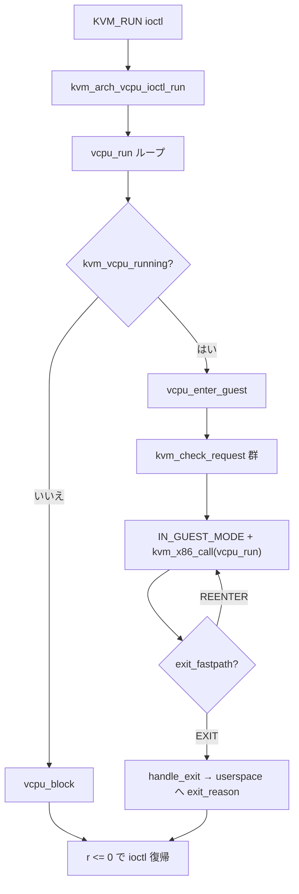

# 第5章 `KVM_RUN` と vCPU 実行ループ

> **本章で読むソース**
>
> - [`virt/kvm/kvm_main.c` L4448-L4478](https://github.com/gregkh/linux/blob/v6.18.38/virt/kvm/kvm_main.c#L4448-L4478)
> - [`arch/x86/kvm/x86.c` L11932-L11946](https://github.com/gregkh/linux/blob/v6.18.38/arch/x86/kvm/x86.c#L11932-L11946)
> - [`arch/x86/kvm/x86.c` L12034-L12049](https://github.com/gregkh/linux/blob/v6.18.38/arch/x86/kvm/x86.c#L12034-L12049)
> - [`arch/x86/kvm/x86.c` L11675-L11723](https://github.com/gregkh/linux/blob/v6.18.38/arch/x86/kvm/x86.c#L11675-L11723)
> - [`arch/x86/kvm/x86.c` L11119-L11162](https://github.com/gregkh/linux/blob/v6.18.38/arch/x86/kvm/x86.c#L11119-L11162)
> - [`arch/x86/kvm/x86.c` L11311-L11414](https://github.com/gregkh/linux/blob/v6.18.38/arch/x86/kvm/x86.c#L11311-L11414)
> - [`arch/x86/kvm/x86.c` L11457-L11507](https://github.com/gregkh/linux/blob/v6.18.38/arch/x86/kvm/x86.c#L11457-L11507)
> - [`include/linux/kvm_host.h` L409-L418](https://github.com/gregkh/linux/blob/v6.18.38/include/linux/kvm_host.h#L409-L418)

## この章の狙い

userspace の `KVM_RUN` ioctl がカーネル内でどうゲスト実行ループに入り、VM-exit まで戻るかを追う。
`kvm_arch_vcpu_ioctl_run`、`vcpu_run`、`vcpu_enter_guest` の三層と、request 処理、シグナル、ゲスト時間計測の入退場を読む。

## 前提

- [vCPU の生成・破棄とリクエスト機構](04-vcpu-lifecycle-requests.md)
- [第1章 KVM の全体像と userspace 境界](../part00-foundation/01-kvm-overview-userspace-boundary.md)

## 汎用層：`KVM_RUN` ioctl

`kvm_main.c` はスレッド切り替えと `wants_to_run` を整えたうえでアーキテクチャ層へ委譲する。

[`virt/kvm/kvm_main.c` L4448-L4478](https://github.com/gregkh/linux/blob/v6.18.38/virt/kvm/kvm_main.c#L4448-L4478)

```c
	case KVM_RUN: {
		struct pid *oldpid;
		r = -EINVAL;
		if (arg)
			goto out;

		/*
		 * Note, vcpu->pid is primarily protected by vcpu->mutex. The
		 * dedicated r/w lock allows other tasks, e.g. other vCPUs, to
		 * read vcpu->pid while this vCPU is in KVM_RUN, e.g. to yield
		 * directly to this vCPU
		 */
		oldpid = vcpu->pid;
		if (unlikely(oldpid != task_pid(current))) {
			/* The thread running this VCPU changed. */
			struct pid *newpid;

			r = kvm_arch_vcpu_run_pid_change(vcpu);
			if (r)
				break;

			newpid = get_task_pid(current, PIDTYPE_PID);
			write_lock(&vcpu->pid_lock);
			vcpu->pid = newpid;
			write_unlock(&vcpu->pid_lock);

			put_pid(oldpid);
		}
		vcpu->wants_to_run = !READ_ONCE(vcpu->run->immediate_exit__unsafe);
		r = kvm_arch_vcpu_ioctl_run(vcpu);
		vcpu->wants_to_run = false;
```

`immediate_exit` が立っていれば `wants_to_run` が偽になり、ioctl はすぐ戻る経路に入る。

## `kvm_arch_vcpu_ioctl_run`：x86 の入口

x86 実装は FPU ロード、シグナルマスク、`vcpu_run` 呼び出し、レジスタ保存までをまとめる。

[`arch/x86/kvm/x86.c` L11932-L11946](https://github.com/gregkh/linux/blob/v6.18.38/arch/x86/kvm/x86.c#L11932-L11946)

```c
int kvm_arch_vcpu_ioctl_run(struct kvm_vcpu *vcpu)
{
	struct kvm_queued_exception *ex = &vcpu->arch.exception;
	struct kvm_run *kvm_run = vcpu->run;
	u64 sync_valid_fields;
	int r;

	r = kvm_mmu_post_init_vm(vcpu->kvm);
	if (r)
		return r;

	vcpu_load(vcpu);
	kvm_sigset_activate(vcpu);
	kvm_run->flags = 0;
	kvm_load_guest_fpu(vcpu);
```

ioctl 終了時の後片付けは次のとおりである。

[`arch/x86/kvm/x86.c` L12034-L12049](https://github.com/gregkh/linux/blob/v6.18.38/arch/x86/kvm/x86.c#L12034-L12049)

```c
	r = kvm_x86_vcpu_pre_run(vcpu);
	if (r <= 0)
		goto out;

	r = vcpu_run(vcpu);

out:
	kvm_put_guest_fpu(vcpu);
	if (kvm_run->kvm_valid_regs && likely(!vcpu->arch.guest_state_protected))
		store_regs(vcpu);
	post_kvm_run_save(vcpu);
	kvm_vcpu_srcu_read_unlock(vcpu);

	kvm_sigset_deactivate(vcpu);
	vcpu_put(vcpu);
	return r;
```

`kvm_sigset_activate` / `deactivate` で vCPU 専用シグナルマスクを適用し、ゲスト実行中のシグナル配送を制御する。
`vcpu_load` / `vcpu_put` はホスト CPU への vCPU 載せ替えと仮想化コンテキストの切り替えである（VMX/SVM 側は第5部と第6部）。

## `vcpu_run`：実行ループ

`vcpu_run` は `kvm->srcu` 読み取り側クリティカルセクション内で回る無限ループである。

[`arch/x86/kvm/x86.c` L11675-L11723](https://github.com/gregkh/linux/blob/v6.18.38/arch/x86/kvm/x86.c#L11675-L11723)

```c
static int vcpu_run(struct kvm_vcpu *vcpu)
{
	int r;

	vcpu->run->exit_reason = KVM_EXIT_UNKNOWN;

	for (;;) {
		/*
		 * If another guest vCPU requests a PV TLB flush in the middle
		 * of instruction emulation, the rest of the emulation could
		 * use a stale page translation. Assume that any code after
		 * this point can start executing an instruction.
		 */
		vcpu->arch.at_instruction_boundary = false;
		if (kvm_vcpu_running(vcpu)) {
			r = vcpu_enter_guest(vcpu);
		} else {
			r = vcpu_block(vcpu);
		}

		if (r <= 0)
			break;

		kvm_clear_request(KVM_REQ_UNBLOCK, vcpu);
		if (kvm_xen_has_pending_events(vcpu))
			kvm_xen_inject_pending_events(vcpu);

		if (kvm_cpu_has_pending_timer(vcpu))
			kvm_inject_pending_timer_irqs(vcpu);

		if (dm_request_for_irq_injection(vcpu) &&
			kvm_vcpu_ready_for_interrupt_injection(vcpu)) {
			r = 0;
			vcpu->run->exit_reason = KVM_EXIT_IRQ_WINDOW_OPEN;
			++vcpu->stat.request_irq_exits;
			break;
		}

		if (__xfer_to_guest_mode_work_pending()) {
			kvm_vcpu_srcu_read_unlock(vcpu);
			r = kvm_xfer_to_guest_mode_handle_work(vcpu);
			kvm_vcpu_srcu_read_lock(vcpu);
			if (r)
				return r;
		}
	}

	return r;
}
```

`kvm_vcpu_running` が偽のときは `vcpu_block` でスリープし、HLT 等で止まった vCPU を待つ。
`__xfer_to_guest_mode_work_pending` は preempt やシグナル等のホスト側作業をゲスト突入前に処理する。

## `vcpu_enter_guest`：request 処理とゲスト突入

ゲストに入る前に `vcpu->requests` を消化する。
TLB flush は「all」が「current」を包含するため、順序がコメントで明示されている。

[`arch/x86/kvm/x86.c` L11119-L11162](https://github.com/gregkh/linux/blob/v6.18.38/arch/x86/kvm/x86.c#L11119-L11162)

```c
	if (kvm_request_pending(vcpu)) {
		if (kvm_check_request(KVM_REQ_VM_DEAD, vcpu)) {
			r = -EIO;
			goto out;
		}

		if (kvm_dirty_ring_check_request(vcpu)) {
			r = 0;
			goto out;
		}

		if (kvm_check_request(KVM_REQ_GET_NESTED_STATE_PAGES, vcpu)) {
			if (unlikely(!kvm_x86_ops.nested_ops->get_nested_state_pages(vcpu))) {
				r = 0;
				goto out;
			}
		}
		if (kvm_check_request(KVM_REQ_MMU_FREE_OBSOLETE_ROOTS, vcpu))
			kvm_mmu_free_obsolete_roots(vcpu);
		if (kvm_check_request(KVM_REQ_MIGRATE_TIMER, vcpu))
			__kvm_migrate_timers(vcpu);
		if (kvm_check_request(KVM_REQ_MASTERCLOCK_UPDATE, vcpu))
			kvm_update_masterclock(vcpu->kvm);
		if (kvm_check_request(KVM_REQ_GLOBAL_CLOCK_UPDATE, vcpu))
			kvm_gen_kvmclock_update(vcpu);
		if (kvm_check_request(KVM_REQ_CLOCK_UPDATE, vcpu)) {
			r = kvm_guest_time_update(vcpu);
			if (unlikely(r))
				goto out;
		}
		if (kvm_check_request(KVM_REQ_MMU_SYNC, vcpu))
			kvm_mmu_sync_roots(vcpu);
		if (kvm_check_request(KVM_REQ_LOAD_MMU_PGD, vcpu))
			kvm_mmu_load_pgd(vcpu);

		/*
		 * Note, the order matters here, as flushing "all" TLB entries
		 * also flushes the "current" TLB entries, i.e. servicing the
		 * flush "all" will clear any request to flush "current".
		 */
		if (kvm_check_request(KVM_REQ_TLB_FLUSH, vcpu))
			kvm_vcpu_flush_tlb_all(vcpu);

		kvm_service_local_tlb_flush_requests(vcpu);
```

request 処理のあと、IRQ を抑止して `IN_GUEST_MODE` に入り、`kvm_x86_call(vcpu_run)` でハードウェア仮想化の VM-entry を行う。

[`arch/x86/kvm/x86.c` L11311-L11414](https://github.com/gregkh/linux/blob/v6.18.38/arch/x86/kvm/x86.c#L11311-L11414)

```c
	preempt_disable();

	kvm_x86_call(prepare_switch_to_guest)(vcpu);

	/*
	 * Disable IRQs before setting IN_GUEST_MODE.  Posted interrupt
	 * IPI are then delayed after guest entry, which ensures that they
	 * result in virtual interrupt delivery.
	 */
	local_irq_disable();

	/* Store vcpu->apicv_active before vcpu->mode.  */
	smp_store_release(&vcpu->mode, IN_GUEST_MODE);

	kvm_vcpu_srcu_read_unlock(vcpu);

	/*
	 * 1) We should set ->mode before checking ->requests.  Please see
	 * the comment in kvm_vcpu_exiting_guest_mode().
	 *
	 * 2) For APICv, we should set ->mode before checking PID.ON. This
	 * pairs with the memory barrier implicit in pi_test_and_set_on
	 * (see vmx_deliver_posted_interrupt).
	 *
	 * 3) This also orders the write to mode from any reads to the page
	 * tables done while the VCPU is running.  Please see the comment
	 * in kvm_flush_remote_tlbs.
	 */
	smp_mb__after_srcu_read_unlock();

	/*
	 * Process pending posted interrupts to handle the case where the
	 * notification IRQ arrived in the host, or was never sent (because the
	 * target vCPU wasn't running).  Do this regardless of the vCPU's APICv
	 * status, KVM doesn't update assigned devices when APICv is inhibited,
	 * i.e. they can post interrupts even if APICv is temporarily disabled.
	 */
	if (kvm_lapic_enabled(vcpu))
		kvm_x86_call(sync_pir_to_irr)(vcpu);

	if (kvm_vcpu_exit_request(vcpu)) {
		vcpu->mode = OUTSIDE_GUEST_MODE;
		smp_wmb();
		local_irq_enable();
		preempt_enable();
		kvm_vcpu_srcu_read_lock(vcpu);
		r = 1;
		goto cancel_injection;
	}

	run_flags = 0;
	if (req_immediate_exit) {
		run_flags |= KVM_RUN_FORCE_IMMEDIATE_EXIT;
		kvm_make_request(KVM_REQ_EVENT, vcpu);
	}

	fpregs_assert_state_consistent();
	if (test_thread_flag(TIF_NEED_FPU_LOAD))
		switch_fpu_return();

	if (vcpu->arch.guest_fpu.xfd_err)
		wrmsrq(MSR_IA32_XFD_ERR, vcpu->arch.guest_fpu.xfd_err);

	if (unlikely(vcpu->arch.switch_db_regs &&
		     !(vcpu->arch.switch_db_regs & KVM_DEBUGREG_AUTO_SWITCH))) {
		set_debugreg(DR7_FIXED_1, 7);
		set_debugreg(vcpu->arch.eff_db[0], 0);
		set_debugreg(vcpu->arch.eff_db[1], 1);
		set_debugreg(vcpu->arch.eff_db[2], 2);
		set_debugreg(vcpu->arch.eff_db[3], 3);
		/* When KVM_DEBUGREG_WONT_EXIT, dr6 is accessible in guest. */
		if (unlikely(vcpu->arch.switch_db_regs & KVM_DEBUGREG_WONT_EXIT))
			run_flags |= KVM_RUN_LOAD_GUEST_DR6;
	} else if (unlikely(hw_breakpoint_active())) {
		set_debugreg(DR7_FIXED_1, 7);
	}

	/*
	 * Refresh the host DEBUGCTL snapshot after disabling IRQs, as DEBUGCTL
	 * can be modified in IRQ context, e.g. via SMP function calls.  Inform
	 * vendor code if any host-owned bits were changed, e.g. so that the
	 * value loaded into hardware while running the guest can be updated.
	 */
	debug_ctl = get_debugctlmsr();
	if ((debug_ctl ^ vcpu->arch.host_debugctl) & kvm_x86_ops.HOST_OWNED_DEBUGCTL &&
	    !vcpu->arch.guest_state_protected)
		run_flags |= KVM_RUN_LOAD_DEBUGCTL;
	vcpu->arch.host_debugctl = debug_ctl;

	guest_timing_enter_irqoff();

	for (;;) {
		/*
		 * Assert that vCPU vs. VM APICv state is consistent.  An APICv
		 * update must kick and wait for all vCPUs before toggling the
		 * per-VM state, and responding vCPUs must wait for the update
		 * to complete before servicing KVM_REQ_APICV_UPDATE.
		 */
		WARN_ON_ONCE((kvm_vcpu_apicv_activated(vcpu) != kvm_vcpu_apicv_active(vcpu)) &&
			     (kvm_get_apic_mode(vcpu) != LAPIC_MODE_DISABLED));

		exit_fastpath = kvm_x86_call(vcpu_run)(vcpu, run_flags);
		if (likely(exit_fastpath != EXIT_FASTPATH_REENTER_GUEST))
			break;
```

`guest_timing_enter_irqoff` でゲスト CPU 時間の計測を開始する。

[`include/linux/kvm_host.h` L409-L418](https://github.com/gregkh/linux/blob/v6.18.38/include/linux/kvm_host.h#L409-L418)

```c
static __always_inline void guest_timing_enter_irqoff(void)
{
	/*
	 * This is running in ioctl context so its safe to assume that it's the
	 * stime pending cputime to flush.
	 */
	instrumentation_begin();
	vtime_account_guest_enter();
	instrumentation_end();
}
```

`EXIT_FASTPATH_REENTER_GUEST` のときは VM-exit を userspace に返さず、内側ループで再 VM-entry する（軽量 exit の fast path）。

## ゲスト退場：VM-exit 後処理

VM-exit 後は `OUTSIDE_GUEST_MODE` に戻し、ゲスト時間計測を終える。

[`arch/x86/kvm/x86.c` L11457-L11507](https://github.com/gregkh/linux/blob/v6.18.38/arch/x86/kvm/x86.c#L11457-L11507)

```c
	vcpu->mode = OUTSIDE_GUEST_MODE;
	smp_wmb();

	/*
	 * Sync xfd before calling handle_exit_irqoff() which may
	 * rely on the fact that guest_fpu::xfd is up-to-date (e.g.
	 * in #NM irqoff handler).
	 */
	if (vcpu->arch.xfd_no_write_intercept)
		fpu_sync_guest_vmexit_xfd_state();

	kvm_x86_call(handle_exit_irqoff)(vcpu);

	if (vcpu->arch.guest_fpu.xfd_err)
		wrmsrq(MSR_IA32_XFD_ERR, 0);

	/*
	 * Mark this CPU as needing a branch predictor flush before running
	 * userspace. Must be done before enabling preemption to ensure it gets
	 * set for the CPU that actually ran the guest, and not the CPU that it
	 * may migrate to.
	 */
	if (cpu_feature_enabled(X86_FEATURE_IBPB_EXIT_TO_USER))
		this_cpu_write(x86_ibpb_exit_to_user, true);

	/*
	 * Consume any pending interrupts, including the possible source of
	 * VM-Exit on SVM and any ticks that occur between VM-Exit and now.
	 * An instruction is required after local_irq_enable() to fully unblock
	 * interrupts on processors that implement an interrupt shadow, the
	 * stat.exits increment will do nicely.
	 */
	kvm_before_interrupt(vcpu, KVM_HANDLING_IRQ);
	local_irq_enable();
	++vcpu->stat.exits;
	local_irq_disable();
	kvm_after_interrupt(vcpu);

	/*
	 * Wait until after servicing IRQs to account guest time so that any
	 * ticks that occurred while running the guest are properly accounted
	 * to the guest.  Waiting until IRQs are enabled degrades the accuracy
	 * of accounting via context tracking, but the loss of accuracy is
	 * acceptable for all known use cases.
	 */
	guest_timing_exit_irqoff();

	local_irq_enable();
	preempt_enable();

	kvm_vcpu_srcu_read_lock(vcpu);
```

`handle_exit_irqoff` のあと vendor 非依存の `handle_exit` が走り、MMIO や PIO など exit 理由に応じて `kvm_run->exit_reason` が設定される。

## 処理の流れ：`KVM_RUN` から VM-exit まで



## 高速化と最適化の工夫

`vcpu_enter_guest` 内の `for (;;)` ループは `EXIT_FASTPATH_REENTER_GUEST` で VM-exit をホストに返さず連続 VM-entry する。
一部の軽量 exit（例えば特定の HLT fast path）で ioctl 往復を省略し、スケジューラ介入を減らす。

`IN_GUEST_MODE` 設定前の IRQ 無効化と `smp_store_release` は、posted interrupt の配送タイミングを制御するための順序付けである。
性能と正しさの両方に効く典型パターンである。

`guest_timing_exit_irqoff` を IRQ 処理後に呼ぶことで、ゲスト実行中の tick をゲスト時間に計上する。
context tracking の精度はわずかに落ちるが、ホスト側の割り込み処理と整合する。

## まとめ

`KVM_RUN` は `kvm_arch_vcpu_ioctl_run` を経て `vcpu_run` のループに入る。
`vcpu_enter_guest` が request を処理したうえで `kvm_x86_call(vcpu_run)` によりゲストへ入り、VM-exit 後に `handle_exit` 系で userspace へ戻る。
シグナルマスク、preempt 作業、`guest_timing_*` がホストとゲストの境界を形作る。

## 関連する章

- [シャドウページテーブルと TDP（EPT/NPT）のモデル](../part03-x86-mmu/09-shadow-tdp-model.md)（執筆予定）
- [`vmx_vcpu_run` と VM-exit 処理](../part05-vmx/15-vmx-run-exit.md)（執筆予定）
