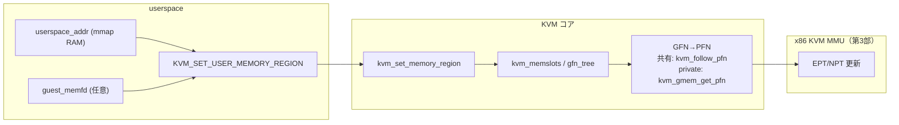

# 第6章 メモリスロット、`guest_memfd`、ホストバッキング

> **本章で読むソース**
>
> - [`virt/kvm/kvm_main.c` L2001-L2052](https://github.com/gregkh/linux/blob/v6.18.38/virt/kvm/kvm_main.c#L2001-L2052)
> - [`virt/kvm/kvm_main.c` L2103-L2124](https://github.com/gregkh/linux/blob/v6.18.38/virt/kvm/kvm_main.c#L2103-L2124)
> - [`include/linux/kvm_host.h` L1080-L1091](https://github.com/gregkh/linux/blob/v6.18.38/include/linux/kvm_host.h#L1080-L1091)
> - [`virt/kvm/kvm_main.c` L2635-L2672](https://github.com/gregkh/linux/blob/v6.18.38/virt/kvm/kvm_main.c#L2635-L2672)
> - [`virt/kvm/kvm_main.c` L2720-L2752](https://github.com/gregkh/linux/blob/v6.18.38/virt/kvm/kvm_main.c#L2720-L2752)
> - [`virt/kvm/guest_memfd.c` L548-L560](https://github.com/gregkh/linux/blob/v6.18.38/virt/kvm/guest_memfd.c#L548-L560)
> - [`virt/kvm/guest_memfd.c` L562-L613](https://github.com/gregkh/linux/blob/v6.18.38/virt/kvm/guest_memfd.c#L562-L613)
> - [`virt/kvm/kvm_main.c` L2992-L3008](https://github.com/gregkh/linux/blob/v6.18.38/virt/kvm/kvm_main.c#L2992-L3008)
> - [`virt/kvm/kvm_main.c` L3037-L3054](https://github.com/gregkh/linux/blob/v6.18.38/virt/kvm/kvm_main.c#L3037-L3054)
> - [`include/linux/kvm_host.h` L2541-L2544](https://github.com/gregkh/linux/blob/v6.18.38/include/linux/kvm_host.h#L2541-L2544)
> - [`arch/x86/kvm/mmu/mmu.c` L4566-L4586](https://github.com/gregkh/linux/blob/v6.18.38/arch/x86/kvm/mmu/mmu.c#L4566-L4586)
> - [`arch/x86/kvm/mmu/mmu.c` L4589-L4599](https://github.com/gregkh/linux/blob/v6.18.38/arch/x86/kvm/mmu/mmu.c#L4589-L4599)

## この章の狙い

userspace が `KVM_SET_USER_MEMORY_REGION` で登録するゲスト物理メモリ（GPA）とホストバッキング（HVA）の対応を読む。
`kvm_set_memory_region` の検証と memslot 更新、`kvm_memslots` の RCU 参照、GPA から HVA/PFN への変換、および `guest_memfd` と memory attributes によるホストバッキングの使い分けの概観を押さえる。

## 前提

- [VM の生成・破棄と ioctl 面](../part01-kvm-core/03-vm-lifecycle-ioctl.md)
- [メモリ管理：mmap とプロセスアドレス空間](../../mm/part03-virtual/12-mmap-munmap.md)

## `kvm_set_memory_region`：ioctl から memslot へ

VM fd の `KVM_SET_USER_MEMORY_REGION` は最終的に `kvm_set_memory_region` に至る。
`slots_lock` 保持下でフラグとアドレスを検証し、作成、変更、削除のいずれかを `kvm_set_memslot` に委ねる。

[`virt/kvm/kvm_main.c` L2001-L2052](https://github.com/gregkh/linux/blob/v6.18.38/virt/kvm/kvm_main.c#L2001-L2052)

```c
static int kvm_set_memory_region(struct kvm *kvm,
				 const struct kvm_userspace_memory_region2 *mem)
{
	struct kvm_memory_slot *old, *new;
	struct kvm_memslots *slots;
	enum kvm_mr_change change;
	unsigned long npages;
	gfn_t base_gfn;
	int as_id, id;
	int r;

	lockdep_assert_held(&kvm->slots_lock);

	r = check_memory_region_flags(kvm, mem);
	if (r)
		return r;

	as_id = mem->slot >> 16;
	id = (u16)mem->slot;

	/* General sanity checks */
	if ((mem->memory_size & (PAGE_SIZE - 1)) ||
	    (mem->memory_size != (unsigned long)mem->memory_size))
		return -EINVAL;
	if (mem->guest_phys_addr & (PAGE_SIZE - 1))
		return -EINVAL;
	/* We can read the guest memory with __xxx_user() later on. */
	if ((mem->userspace_addr & (PAGE_SIZE - 1)) ||
	    (mem->userspace_addr != untagged_addr(mem->userspace_addr)) ||
	     !access_ok((void __user *)(unsigned long)mem->userspace_addr,
			mem->memory_size))
		return -EINVAL;
	if (mem->flags & KVM_MEM_GUEST_MEMFD &&
	    (mem->guest_memfd_offset & (PAGE_SIZE - 1) ||
	     mem->guest_memfd_offset + mem->memory_size < mem->guest_memfd_offset))
		return -EINVAL;
	if (as_id >= kvm_arch_nr_memslot_as_ids(kvm) || id >= KVM_MEM_SLOTS_NUM)
		return -EINVAL;
	if (mem->guest_phys_addr + mem->memory_size < mem->guest_phys_addr)
		return -EINVAL;

	/*
	 * The size of userspace-defined memory regions is restricted in order
	 * to play nice with dirty bitmap operations, which are indexed with an
	 * "unsigned int".  KVM's internal memory regions don't support dirty
	 * logging, and so are exempt.
	 */
	if (id < KVM_USER_MEM_SLOTS &&
	    (mem->memory_size >> PAGE_SHIFT) > KVM_MEM_MAX_NR_PAGES)
		return -EINVAL;

	slots = __kvm_memslots(kvm, as_id);
```

`userspace_addr` は QEMU が `mmap` した RAM 領域のホスト仮想アドレスである。
`guest_phys_addr` はゲストが見る物理アドレス（GPA）の開始位置である。

新規スロット確保と `guest_memfd` バインドは次のブロックである。

[`virt/kvm/kvm_main.c` L2103-L2124](https://github.com/gregkh/linux/blob/v6.18.38/virt/kvm/kvm_main.c#L2103-L2124)

```c
	/* Allocate a slot that will persist in the memslot. */
	new = kzalloc(sizeof(*new), GFP_KERNEL_ACCOUNT);
	if (!new)
		return -ENOMEM;

	new->as_id = as_id;
	new->id = id;
	new->base_gfn = base_gfn;
	new->npages = npages;
	new->flags = mem->flags;
	new->userspace_addr = mem->userspace_addr;
	if (mem->flags & KVM_MEM_GUEST_MEMFD) {
		r = kvm_gmem_bind(kvm, new, mem->guest_memfd, mem->guest_memfd_offset);
		if (r)
			goto out;
	}

	r = kvm_set_memslot(kvm, old, new, change);
	if (r)
		goto out_unbind;

	return 0;
```

`KVM_MEM_GUEST_MEMFD` が立つスロットは `kvm_gmem_bind` で `guest_memfd` を結び付ける。
private GPA は `guest_memfd` ページ、共有 GPA は `userspace_addr` の mmap RAM をバッキングとし、memory attributes に応じて二経路を使い分ける（後述）。

## `kvm_memslots` と RCU

実行時に vCPU が参照する memslot 集合は `kvm->memslots[as_id]` 経由で取得する。
`srcu_dereference` により更新中も読み取り側が安全に古い世代を参照できる。

[`include/linux/kvm_host.h` L1080-L1091](https://github.com/gregkh/linux/blob/v6.18.38/include/linux/kvm_host.h#L1080-L1091)

```c
static inline struct kvm_memslots *__kvm_memslots(struct kvm *kvm, int as_id)
{
	as_id = array_index_nospec(as_id, KVM_MAX_NR_ADDRESS_SPACES);
	return srcu_dereference_check(kvm->memslots[as_id], &kvm->srcu,
			lockdep_is_held(&kvm->slots_lock) ||
			!refcount_read(&kvm->users_count));
}

static inline struct kvm_memslots *kvm_memslots(struct kvm *kvm)
{
	return __kvm_memslots(kvm, 0);
}
```

各アドレス空間は active/inactive の二組スロットを持ち（第3章）、`kvm_set_memslot` が非アクティブ側を編集してからポインタを切り替える。
`gfn_tree` は GFN からスロットを引く赤黒木である（`kvm_insert_gfn_node`）。

## GFN から memslot へ：`gfn_to_memslot`

GPA のページ番号（GFN）から `kvm_memory_slot` を引く入口は次のとおりである。

[`virt/kvm/kvm_main.c` L2635-L2672](https://github.com/gregkh/linux/blob/v6.18.38/virt/kvm/kvm_main.c#L2635-L2672)

```c
struct kvm_memory_slot *gfn_to_memslot(struct kvm *kvm, gfn_t gfn)
{
	return __gfn_to_memslot(kvm_memslots(kvm), gfn);
}
EXPORT_SYMBOL_FOR_KVM_INTERNAL(gfn_to_memslot);

struct kvm_memory_slot *kvm_vcpu_gfn_to_memslot(struct kvm_vcpu *vcpu, gfn_t gfn)
{
	struct kvm_memslots *slots = kvm_vcpu_memslots(vcpu);
	u64 gen = slots->generation;
	struct kvm_memory_slot *slot;

	/*
	 * This also protects against using a memslot from a different address space,
	 * since different address spaces have different generation numbers.
	 */
	if (unlikely(gen != vcpu->last_used_slot_gen)) {
		vcpu->last_used_slot = NULL;
		vcpu->last_used_slot_gen = gen;
	}

	slot = try_get_memslot(vcpu->last_used_slot, gfn);
	if (slot)
		return slot;

	/*
	 * Fall back to searching all memslots. We purposely use
	 * search_memslots() instead of __gfn_to_memslot() to avoid
	 * thrashing the VM-wide last_used_slot in kvm_memslots.
	 */
	slot = search_memslots(slots, gfn, false);
	if (slot) {
		vcpu->last_used_slot = slot;
		return slot;
	}

	return NULL;
}
```

vCPU ごとに `last_used_slot` キャッシュを持ち、連続アクセスの木探索を避ける。

## GFN から HVA へ：`gfn_to_hva`

memslot が分かれば HVA はスロット内オフセットで計算する。

[`virt/kvm/kvm_main.c` L2720-L2752](https://github.com/gregkh/linux/blob/v6.18.38/virt/kvm/kvm_main.c#L2720-L2752)

```c
static unsigned long __gfn_to_hva_many(const struct kvm_memory_slot *slot, gfn_t gfn,
				       gfn_t *nr_pages, bool write)
{
	if (!slot || slot->flags & KVM_MEMSLOT_INVALID)
		return KVM_HVA_ERR_BAD;

	if (memslot_is_readonly(slot) && write)
		return KVM_HVA_ERR_RO_BAD;

	if (nr_pages)
		*nr_pages = slot->npages - (gfn - slot->base_gfn);

	return __gfn_to_hva_memslot(slot, gfn);
}

static unsigned long gfn_to_hva_many(struct kvm_memory_slot *slot, gfn_t gfn,
				     gfn_t *nr_pages)
{
	return __gfn_to_hva_many(slot, gfn, nr_pages, true);
}

unsigned long gfn_to_hva_memslot(struct kvm_memory_slot *slot,
					gfn_t gfn)
{
	return gfn_to_hva_many(slot, gfn, NULL);
}
EXPORT_SYMBOL_FOR_KVM_INTERNAL(gfn_to_hva_memslot);

unsigned long gfn_to_hva(struct kvm *kvm, gfn_t gfn)
{
	return gfn_to_hva_many(gfn_to_memslot(kvm, gfn), gfn, NULL);
}
EXPORT_SYMBOL_FOR_KVM_INTERNAL(gfn_to_hva);
```

`KVM_HVA_ERR_*` はエラーPFN 経路と連携し、ページフォールトや MMU 更新でホストに触れる前に失敗を伝える。

## GFN から PFN へ：共有と private の分岐

EPT/NPT 更新やゲスト page fault 処理では GFN からホスト物理ページ番号（PFN）が要る。
経路は GPA の memory attributes と memslot 種別で分かれる。

共有（`KVM_MEMORY_ATTRIBUTE_PRIVATE` でない）GPA は `kvm_follow_pfn` が入口である。
`__gfn_to_hva_many` で HVA を求め、`hva_to_pfn` が fast GUP、`hva_to_pfn_slow` による slow GUP、または remapped VMA 経由で PFN を得る。

[`virt/kvm/kvm_main.c` L3037-L3054](https://github.com/gregkh/linux/blob/v6.18.38/virt/kvm/kvm_main.c#L3037-L3054)

```c
static kvm_pfn_t kvm_follow_pfn(struct kvm_follow_pfn *kfp)
{
	kfp->hva = __gfn_to_hva_many(kfp->slot, kfp->gfn, NULL,
				     kfp->flags & FOLL_WRITE);

	if (kfp->hva == KVM_HVA_ERR_RO_BAD)
		return KVM_PFN_ERR_RO_FAULT;

	if (kvm_is_error_hva(kfp->hva))
		return KVM_PFN_NOSLOT;

	if (memslot_is_readonly(kfp->slot) && kfp->map_writable) {
		*kfp->map_writable = false;
		kfp->map_writable = NULL;
	}

	return hva_to_pfn(kfp);
}
```

[`virt/kvm/kvm_main.c` L2992-L3008](https://github.com/gregkh/linux/blob/v6.18.38/virt/kvm/kvm_main.c#L2992-L3008)

```c
kvm_pfn_t hva_to_pfn(struct kvm_follow_pfn *kfp)
{
	struct vm_area_struct *vma;
	kvm_pfn_t pfn;
	int npages, r;

	might_sleep();

	if (WARN_ON_ONCE(!kfp->refcounted_page))
		return KVM_PFN_ERR_FAULT;

	if (hva_to_pfn_fast(kfp, &pfn))
		return pfn;

	npages = hva_to_pfn_slow(kfp, &pfn);
	if (npages == 1)
		return pfn;
```

`kvm_mem_is_private` は `kvm_get_memory_attributes` が `KVM_MEMORY_ATTRIBUTE_PRIVATE` を返す GFN を private とみなす。

[`include/linux/kvm_host.h` L2541-L2544](https://github.com/gregkh/linux/blob/v6.18.38/include/linux/kvm_host.h#L2541-L2544)

```c
static inline bool kvm_mem_is_private(struct kvm *kvm, gfn_t gfn)
{
	return kvm_get_memory_attributes(kvm, gfn) & KVM_MEMORY_ATTRIBUTE_PRIVATE;
}
```

private GPA や `KVM_MEMSLOT_GMEM_ONLY` のスロットは x86 KVM MMU の page fault 処理から `kvm_mmu_faultin_pfn_gmem` に入る。
ここで `kvm_gmem_get_pfn` が `guest_memfd` ファイルから folio/PFN を引く。

[`arch/x86/kvm/mmu/mmu.c` L4589-L4599](https://github.com/gregkh/linux/blob/v6.18.38/arch/x86/kvm/mmu/mmu.c#L4589-L4599)

```c
static int __kvm_mmu_faultin_pfn(struct kvm_vcpu *vcpu,
				 struct kvm_page_fault *fault)
{
	unsigned int foll = fault->write ? FOLL_WRITE : 0;

	if (fault->is_private || kvm_memslot_is_gmem_only(fault->slot))
		return kvm_mmu_faultin_pfn_gmem(vcpu, fault);

	foll |= FOLL_NOWAIT;
	fault->pfn = __kvm_faultin_pfn(fault->slot, fault->gfn, foll,
				       &fault->map_writable, &fault->refcounted_page);
```

[`arch/x86/kvm/mmu/mmu.c` L4566-L4586](https://github.com/gregkh/linux/blob/v6.18.38/arch/x86/kvm/mmu/mmu.c#L4566-L4586)

```c
static int kvm_mmu_faultin_pfn_gmem(struct kvm_vcpu *vcpu,
				    struct kvm_page_fault *fault)
{
	int max_order, r;

	if (!kvm_slot_has_gmem(fault->slot)) {
		kvm_mmu_prepare_memory_fault_exit(vcpu, fault);
		return -EFAULT;
	}

	r = kvm_gmem_get_pfn(vcpu->kvm, fault->slot, fault->gfn, &fault->pfn,
			     &fault->refcounted_page, &max_order);
	if (r) {
		kvm_mmu_prepare_memory_fault_exit(vcpu, fault);
		return r;
	}

	fault->map_writable = !(fault->slot->flags & KVM_MEM_READONLY);
	fault->max_level = kvm_max_level_for_order(max_order);

	return RET_PF_CONTINUE;
}
```

`guest_memfd` 付き memslot でも共有 GPA は引き続き `userspace_addr` 経由の `kvm_follow_pfn` を使う。

## `guest_memfd` の概観

`guest_memfd` は KVM 専用の匿名ファイルで、private GPA のホストバッキングを担う。
VM ioctl `KVM_CREATE_GUEST_MEMFD`（`kvm_gmem_create`）で fd を作り、memslot 登録時に `kvm_gmem_bind` で結び付ける。

作成入口は次のとおりである。

[`virt/kvm/guest_memfd.c` L548-L560](https://github.com/gregkh/linux/blob/v6.18.38/virt/kvm/guest_memfd.c#L548-L560)

```c
int kvm_gmem_create(struct kvm *kvm, struct kvm_create_guest_memfd *args)
{
	loff_t size = args->size;
	u64 flags = args->flags;

	if (flags & ~kvm_gmem_get_supported_flags(kvm))
		return -EINVAL;

	if (size <= 0 || !PAGE_ALIGNED(size))
		return -EINVAL;

	return __kvm_gmem_create(kvm, size, flags);
}
```

memslot へのバインドはファイル種別と VM 所属を検証する。

[`virt/kvm/guest_memfd.c` L562-L613](https://github.com/gregkh/linux/blob/v6.18.38/virt/kvm/guest_memfd.c#L562-L613)

```c
int kvm_gmem_bind(struct kvm *kvm, struct kvm_memory_slot *slot,
		  unsigned int fd, loff_t offset)
{
	loff_t size = slot->npages << PAGE_SHIFT;
	unsigned long start, end;
	struct kvm_gmem *gmem;
	struct inode *inode;
	struct file *file;
	int r = -EINVAL;

	BUILD_BUG_ON(sizeof(gfn_t) != sizeof(slot->gmem.pgoff));

	file = fget(fd);
	if (!file)
		return -EBADF;

	if (file->f_op != &kvm_gmem_fops)
		goto err;

	gmem = file->private_data;
	if (gmem->kvm != kvm)
		goto err;

	inode = file_inode(file);

	if (offset < 0 || !PAGE_ALIGNED(offset) ||
	    offset + size > i_size_read(inode))
		goto err;

	filemap_invalidate_lock(inode->i_mapping);

	start = offset >> PAGE_SHIFT;
	end = start + slot->npages;

	if (!xa_empty(&gmem->bindings) &&
	    xa_find(&gmem->bindings, &start, end - 1, XA_PRESENT)) {
		filemap_invalidate_unlock(inode->i_mapping);
		goto err;
	}

	/*
	 * memslots of flag KVM_MEM_GUEST_MEMFD are immutable to change, so
	 * kvm_gmem_bind() must occur on a new memslot.  Because the memslot
	 * is not visible yet, kvm_gmem_get_pfn() is guaranteed to see the file.
	 */
	WRITE_ONCE(slot->gmem.file, file);
	slot->gmem.pgoff = start;
	if (kvm_gmem_supports_mmap(inode))
		slot->flags |= KVM_MEMSLOT_GMEM_ONLY;

	xa_store_range(&gmem->bindings, start, end - 1, slot, GFP_KERNEL);
	filemap_invalidate_unlock(inode->i_mapping);
```

`KVM_MEM_GUEST_MEMFD` スロットは作成後に HVA やサイズを変えられない（第3章の `kvm_set_memory_region` 検証参照）。
本分冊ではファイルページのフォルト経路や secret メモリの詳細には踏み込まない。

## 処理の流れ：RAM 登録から GPA アクセスまで



## 高速化と最適化の工夫

`kvm_vcpu_gfn_to_memslot` の per-vCPU `last_used_slot` は、同一 memslot への連続 GFN アクセスで赤黒木探索を省略する。
VM 全体の `last_used_slot` を更新しないよう `search_memslots` を使う点も、多 vCPU でのキャッシュライン競合を避ける設計である。

memslot 更新の二重バッファと `srcu` は、vCPU が古いスロットを参照し続けても安全に切り替えるための機構である。
更新側は inactive を編集し、ポインタ差し替えと generation 更新で読み取り側に新世代を見せる（第3章と第7章の dirty log と接続）。

`guest_memfd` 付き memslot は private GPA に `guest_memfd`、共有 GPA に `userspace_addr` を割り当て、memory attributes で経路を切り替える。

## まとめ

`kvm_set_memory_region` が GPA 範囲とホストバッキングを検証し、memslot を作成または更新する。
実行時は `kvm_memslots` から GFN を引き、共有 GPA は `kvm_follow_pfn` で PFN を、private GPA は `kvm_gmem_get_pfn` で PFN を得る。
`guest_memfd` は private GPA のバッキングであり、`kvm_gmem_bind` で memslot に結び付く。
EPT/NPT への反映は第3部で読む。

## 関連する章

- [`mmu_notifier` とリモート TLB flush](07-mmu-notifier-remote-tlb.md)
- [シャドウページテーブルと TDP（EPT/NPT）のモデル](../part03-x86-mmu/09-shadow-tdp-model.md)
