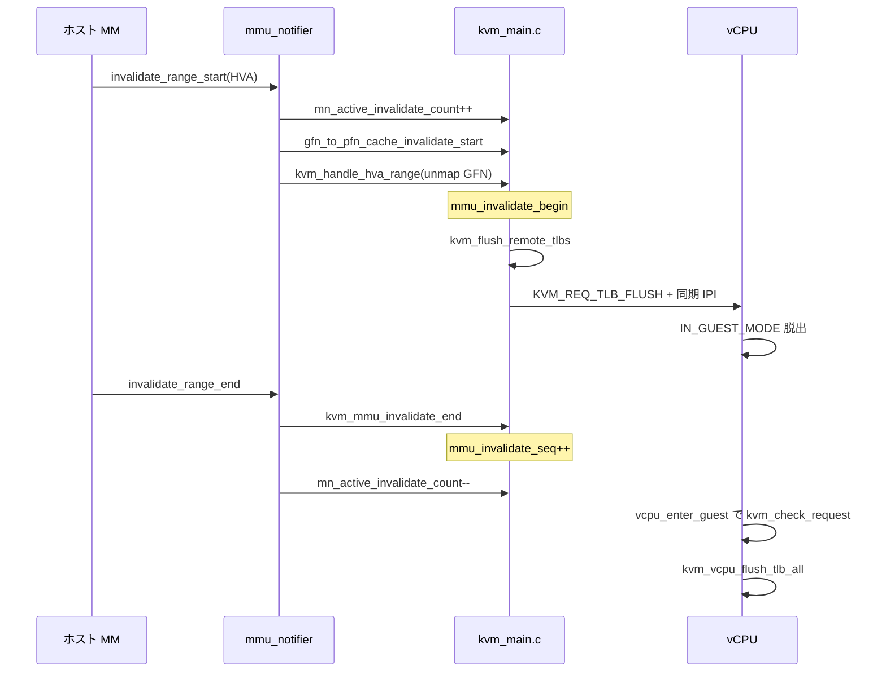

# 第7章 `mmu_notifier` とリモート TLB flush

> **本章で読むソース**
>
> - [`virt/kvm/kvm_main.c` L888-L901](https://github.com/gregkh/linux/blob/v6.18.38/virt/kvm/kvm_main.c#L888-L901)
> - [`virt/kvm/kvm_main.c` L726-L774](https://github.com/gregkh/linux/blob/v6.18.38/virt/kvm/kvm_main.c#L726-L774)
> - [`virt/kvm/kvm_main.c` L776-L800](https://github.com/gregkh/linux/blob/v6.18.38/virt/kvm/kvm_main.c#L776-L800)
> - [`virt/kvm/kvm_main.c` L802-L831](https://github.com/gregkh/linux/blob/v6.18.38/virt/kvm/kvm_main.c#L802-L831)
> - [`virt/kvm/kvm_main.c` L293-L311](https://github.com/gregkh/linux/blob/v6.18.38/virt/kvm/kvm_main.c#L293-L311)
> - [`virt/kvm/kvm_main.c` L270-L290](https://github.com/gregkh/linux/blob/v6.18.38/virt/kvm/kvm_main.c#L270-L290)
> - [`virt/kvm/kvm_main.c` L1632-L1647](https://github.com/gregkh/linux/blob/v6.18.38/virt/kvm/kvm_main.c#L1632-L1647)
> - [`include/linux/kvm_host.h` L2104-L2124](https://github.com/gregkh/linux/blob/v6.18.38/include/linux/kvm_host.h#L2104-L2124)

## この章の狙い

VM 作成プロセスの HVA が `munmap` や `mremap` で変わったとき、KVM がゲスト向け SPTE/EPT を古いままにしない仕組みを読む。
`mmu_notifier` の登録、`invalidate_range_start` / `end` と `mmu_invalidate_seq`、そして `kvm_flush_remote_tlbs` が全 vCPU へ `KVM_REQ_TLB_FLUSH` を送る経路を押さえる。

## 前提

- [メモリスロット、`guest_memfd`、ホストバッキング](06-memory-slots-guest-memfd.md)

## `mmu_notifier` の登録

`kvm_create_vm` は `kvm_init_mmu_notifier` で VM を作成したプロセスの `mm` に notifier を付ける。
第3章で `mmgrab(current->mm)` したアドレス空間と同じ `mm` である。

[`virt/kvm/kvm_main.c` L888-L901](https://github.com/gregkh/linux/blob/v6.18.38/virt/kvm/kvm_main.c#L888-L901)

```c
static const struct mmu_notifier_ops kvm_mmu_notifier_ops = {
	.invalidate_range_start	= kvm_mmu_notifier_invalidate_range_start,
	.invalidate_range_end	= kvm_mmu_notifier_invalidate_range_end,
	.clear_flush_young	= kvm_mmu_notifier_clear_flush_young,
	.clear_young		= kvm_mmu_notifier_clear_young,
	.test_young		= kvm_mmu_notifier_test_young,
	.release		= kvm_mmu_notifier_release,
};

static int kvm_init_mmu_notifier(struct kvm *kvm)
{
	kvm->mmu_notifier.ops = &kvm_mmu_notifier_ops;
	return mmu_notifier_register(&kvm->mmu_notifier, current->mm);
}
```

`release` はプロセス終了時に `kvm_flush_shadow_all` でゲスト向けページテーブル全体を捨てる。
本章の焦点は HVA 範囲の部分無効化である。

## `invalidate_range_start`：HVA から GFN を外す

ホスト MM が HVA 範囲を無効化し始めると `invalidate_range_start` が呼ばれる。
KVM は pfn キャッシュを先に潰し、そのあと `mmu_lock` 下で該当 GFN のマッピングを外す。

[`virt/kvm/kvm_main.c` L726-L774](https://github.com/gregkh/linux/blob/v6.18.38/virt/kvm/kvm_main.c#L726-L774)

```c
static int kvm_mmu_notifier_invalidate_range_start(struct mmu_notifier *mn,
					const struct mmu_notifier_range *range)
{
	struct kvm *kvm = mmu_notifier_to_kvm(mn);
	const struct kvm_mmu_notifier_range hva_range = {
		.start		= range->start,
		.end		= range->end,
		.handler	= kvm_mmu_unmap_gfn_range,
		.on_lock	= kvm_mmu_invalidate_begin,
		.flush_on_ret	= true,
		.may_block	= mmu_notifier_range_blockable(range),
	};

	trace_kvm_unmap_hva_range(range->start, range->end);

	/*
	 * Prevent memslot modification between range_start() and range_end()
	 * so that conditionally locking provides the same result in both
	 * functions.  Without that guarantee, the mmu_invalidate_in_progress
	 * adjustments will be imbalanced.
	 *
	 * Pairs with the decrement in range_end().
	 */
	spin_lock(&kvm->mn_invalidate_lock);
	kvm->mn_active_invalidate_count++;
	spin_unlock(&kvm->mn_invalidate_lock);

	/*
	 * Invalidate pfn caches _before_ invalidating the secondary MMUs, i.e.
	 * before acquiring mmu_lock, to avoid holding mmu_lock while acquiring
	 * each cache's lock.  There are relatively few caches in existence at
	 * any given time, and the caches themselves can check for hva overlap,
	 * i.e. don't need to rely on memslot overlap checks for performance.
	 * Because this runs without holding mmu_lock, the pfn caches must use
	 * mn_active_invalidate_count (see above) instead of
	 * mmu_invalidate_in_progress.
	 */
	gfn_to_pfn_cache_invalidate_start(kvm, range->start, range->end);

	/*
	 * If one or more memslots were found and thus zapped, notify arch code
	 * that guest memory has been reclaimed.  This needs to be done *after*
	 * dropping mmu_lock, as x86's reclaim path is slooooow.
	 */
	if (kvm_handle_hva_range(kvm, &hva_range).found_memslot)
		kvm_arch_guest_memory_reclaimed(kvm);

	return 0;
}
```

`on_lock` の `kvm_mmu_invalidate_begin` は `mmu_invalidate_in_progress` を増やし、ページフォールト側が古いマッピングを張り直さないようブロックする。
`flush_on_ret` が真なので、unmap 後に `kvm_flush_remote_tlbs` が走る（第3部の SPTE 更新と接続）。

`mn_invalidate_lock` は start/end のあいだ保持されるロックではない。
各コールバック内で `mn_active_invalidate_count` の増減を保護する短時間の spinlock である。
memslot 更新側は `slots_lock` 下でカウンタが 0 になるまで `mn_memslots_update_rcuwait` で待つ（下記）。

## `mmu_invalidate_seq` と `invalidate_range_end`

`mmu_lock` 内の unmap が終わると `kvm_mmu_invalidate_end` が `mmu_invalidate_seq` を進め、進行中カウンタを下げる。
ページフォールトはこのシーケンスを記録し、古い世代で SPTE を立て直そうとしたらリトライする。

[`virt/kvm/kvm_main.c` L776-L800](https://github.com/gregkh/linux/blob/v6.18.38/virt/kvm/kvm_main.c#L776-L800)

```c
void kvm_mmu_invalidate_end(struct kvm *kvm)
{
	lockdep_assert_held_write(&kvm->mmu_lock);

	/*
	 * This sequence increase will notify the kvm page fault that
	 * the page that is going to be mapped in the spte could have
	 * been freed.
	 */
	kvm->mmu_invalidate_seq++;
	smp_wmb();
	/*
	 * The above sequence increase must be visible before the
	 * below count decrease, which is ensured by the smp_wmb above
	 * in conjunction with the smp_rmb in mmu_invalidate_retry().
	 */
	kvm->mmu_invalidate_in_progress--;
	KVM_BUG_ON(kvm->mmu_invalidate_in_progress < 0, kvm);

	/*
	 * Assert that at least one range was added between start() and end().
	 * Not adding a range isn't fatal, but it is a KVM bug.
	 */
	WARN_ON_ONCE(kvm->mmu_invalidate_range_start == INVALID_GPA);
}
```

`invalidate_range_end` は `kvm_mmu_invalidate_end` を `on_lock` 経由で呼び、`mn_active_invalidate_count` を減らして memslot 更新待ちを起こす。

[`virt/kvm/kvm_main.c` L802-L831](https://github.com/gregkh/linux/blob/v6.18.38/virt/kvm/kvm_main.c#L802-L831)

```c
static void kvm_mmu_notifier_invalidate_range_end(struct mmu_notifier *mn,
					const struct mmu_notifier_range *range)
{
	struct kvm *kvm = mmu_notifier_to_kvm(mn);
	const struct kvm_mmu_notifier_range hva_range = {
		.start		= range->start,
		.end		= range->end,
		.handler	= (void *)kvm_null_fn,
		.on_lock	= kvm_mmu_invalidate_end,
		.flush_on_ret	= false,
		.may_block	= mmu_notifier_range_blockable(range),
	};
	bool wake;

	kvm_handle_hva_range(kvm, &hva_range);

	/* Pairs with the increment in range_start(). */
	spin_lock(&kvm->mn_invalidate_lock);
	if (!WARN_ON_ONCE(!kvm->mn_active_invalidate_count))
		--kvm->mn_active_invalidate_count;
	wake = !kvm->mn_active_invalidate_count;
	spin_unlock(&kvm->mn_invalidate_lock);

	/*
	 * There can only be one waiter, since the wait happens under
	 * slots_lock.
	 */
	if (wake)
		rcuwait_wake_up(&kvm->mn_memslots_update_rcuwait);
}
```

カウンタが 0 に戻ったときだけ `rcuwait_wake_up` し、`slots_lock` 保持下で memslot 更新を待っていたスレッドを起こす。

## memslot 更新と invalidate の同期

`kvm_swap_active_memslots` は active ポインタを差し替える前に、進行中の invalidate が無いことを確認する。

[`virt/kvm/kvm_main.c` L1632-L1647](https://github.com/gregkh/linux/blob/v6.18.38/virt/kvm/kvm_main.c#L1632-L1647)

```c
	/*
	 * Do not store the new memslots while there are invalidations in
	 * progress, otherwise the locking in invalidate_range_start and
	 * invalidate_range_end will be unbalanced.
	 */
	spin_lock(&kvm->mn_invalidate_lock);
	prepare_to_rcuwait(&kvm->mn_memslots_update_rcuwait);
	while (kvm->mn_active_invalidate_count) {
		set_current_state(TASK_UNINTERRUPTIBLE);
		spin_unlock(&kvm->mn_invalidate_lock);
		schedule();
		spin_lock(&kvm->mn_invalidate_lock);
	}
	finish_rcuwait(&kvm->mn_memslots_update_rcuwait);
	rcu_assign_pointer(kvm->memslots[as_id], slots);
	spin_unlock(&kvm->mn_invalidate_lock);
```

invalidate 区間中にロックを握り続けるのではなく、カウンタと `rcuwait` で memslot 変更と notifier の進行を直列化する。

## ページフォールト側のリトライ

`mmu_invalidate_retry` は `mmu_invalidate_in_progress` と `mmu_invalidate_seq` を見て、無効化とレースしたフォールトをやり直す。

[`include/linux/kvm_host.h` L2104-L2124](https://github.com/gregkh/linux/blob/v6.18.38/include/linux/kvm_host.h#L2104-L2124)

```c
static inline int mmu_invalidate_retry(struct kvm *kvm, unsigned long mmu_seq)
{
	if (unlikely(kvm->mmu_invalidate_in_progress))
		return 1;
	/*
	 * Ensure the read of mmu_invalidate_in_progress happens before
	 * the read of mmu_invalidate_seq.  This interacts with the
	 * smp_wmb() in mmu_notifier_invalidate_range_end to make sure
	 * that the caller either sees the old (non-zero) value of
	 * mmu_invalidate_in_progress or the new (incremented) value of
	 * mmu_invalidate_seq.
	 *
	 * PowerPC Book3s HV KVM calls this under a per-page lock rather
	 * than under kvm->mmu_lock, for scalability, so can't rely on
	 * kvm->mmu_lock to keep things ordered.
	 */
	smp_rmb();
	if (kvm->mmu_invalidate_seq != mmu_seq)
		return 1;
	return 0;
}
```

`mmu_invalidate_retry_gfn` は GFN が無効化範囲に入っているかも見る（第10章のフォールト処理で再訪）。

## `kvm_flush_remote_tlbs` と IPI

アーキテクチャ固有のリモート TLB 無効化が使えなければ、全 vCPU に `KVM_REQ_TLB_FLUSH` を送りゲスト実行を一度ホストへ戻す。
x86 の通常経路では `kvm_arch_flush_remote_tlbs` が `-ENOTSUPP` を返し、汎用の IPI 経路に落ちる（Hyper-V enlightenment 時は `hv_flush_remote_tlbs` が先に試される）。

[`virt/kvm/kvm_main.c` L293-L311](https://github.com/gregkh/linux/blob/v6.18.38/virt/kvm/kvm_main.c#L293-L311)

```c
void kvm_flush_remote_tlbs(struct kvm *kvm)
{
	++kvm->stat.generic.remote_tlb_flush_requests;

	/*
	 * We want to publish modifications to the page tables before reading
	 * mode. Pairs with a memory barrier in arch-specific code.
	 * - x86: smp_mb__after_srcu_read_unlock in vcpu_enter_guest
	 * and smp_mb in walk_shadow_page_lockless_begin/end.
	 * - powerpc: smp_mb in kvmppc_prepare_to_enter.
	 *
	 * There is already an smp_mb__after_atomic() before
	 * kvm_make_all_cpus_request() reads vcpu->mode. We reuse that
	 * barrier here.
	 */
	if (!kvm_arch_flush_remote_tlbs(kvm)
	    || kvm_make_all_cpus_request(kvm, KVM_REQ_TLB_FLUSH))
		++kvm->stat.generic.remote_tlb_flush;
}
```

全 vCPU への要求投稿と kick は次のとおりである。

[`virt/kvm/kvm_main.c` L270-L290](https://github.com/gregkh/linux/blob/v6.18.38/virt/kvm/kvm_main.c#L270-L290)

```c
bool kvm_make_all_cpus_request(struct kvm *kvm, unsigned int req)
{
	struct kvm_vcpu *vcpu;
	struct cpumask *cpus;
	unsigned long i;
	bool called;
	int me;

	me = get_cpu();

	cpus = this_cpu_cpumask_var_ptr(cpu_kick_mask);
	cpumask_clear(cpus);

	kvm_for_each_vcpu(i, vcpu, kvm)
		kvm_make_vcpu_request(vcpu, req, cpus, me);

	called = kvm_kick_many_cpus(cpus, !!(req & KVM_REQUEST_WAIT));
	put_cpu();

	return called;
}
```

`KVM_REQ_TLB_FLUSH` は `KVM_REQUEST_WAIT` 付きなので、同期 IPI で各 vCPU がゲストモードを抜けるのを待てる（第4章の request 機構と接続）。
IPI 応答は退場完了であり、`kvm_check_request` による TLB flush 実処理の完了までは保証しない。

## 処理の流れ：HVA 無効化からリモート flush まで



## 高速化と最適化の工夫

pfn キャッシュの無効化を `mmu_lock` 取得前に行い、キャッシュごとのロックを `mmu_lock` とネストしない。
キャッシュ側は `mn_active_invalidate_count` を見て、notifier 進行中の競合を避ける。

`kvm_flush_remote_tlbs` はまずアーキテクチャの range flush（x86 では Hyper-V 経路）を試し、失敗時だけ全 vCPU IPI に落とす。
dirty log 用の memslot 単位 flush は `kvm_flush_remote_tlbs_memslot` が `slots_lock` 下で range flush を呼び、memslot 操作間の TLB 状態を揃える（第8章）。

並行する HVA 無効化範囲は `kvm_mmu_invalidate_range_add` で最小包含範囲に畳み込み、カウンタ管理を単純に保つ。

## まとめ

KVM は VM 作成 `mm` に `mmu_notifier` を登録し、HVA 無効化で GFN マッピングを外す。
`mmu_invalidate_seq` と `mmu_invalidate_in_progress` でページフォールトと notifier のレースを検出する。
`kvm_flush_remote_tlbs` はアーキテクチャ fast path のあと、全 vCPU への `KVM_REQ_TLB_FLUSH` と IPI でゲスト TLB を実効的に無効化する。

## 関連する章

- [dirty page tracking（bitmap と dirty ring）](08-dirty-page-tracking.md)
- [シャドウページテーブルと TDP（EPT/NPT）のモデル](../part03-x86-mmu/09-shadow-tdp-model.md)
- [SPTE とゲスト page fault 処理](../part03-x86-mmu/10-spte-page-fault.md)
