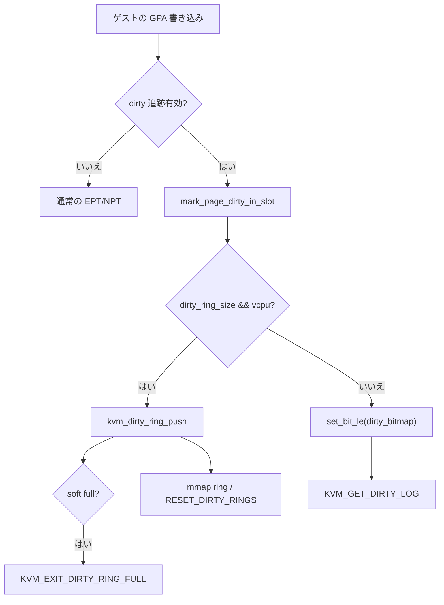

# 第8章 dirty page tracking（bitmap と dirty ring）

> **本章で読むソース**
>
> - [`virt/kvm/kvm_main.c` L2158-L2203](https://github.com/gregkh/linux/blob/v6.18.38/virt/kvm/kvm_main.c#L2158-L2203)
> - [`virt/kvm/kvm_main.c` L3520-L3543](https://github.com/gregkh/linux/blob/v6.18.38/virt/kvm/kvm_main.c#L3520-L3543)
> - [`virt/kvm/dirty_ring.c` L219-L242](https://github.com/gregkh/linux/blob/v6.18.38/virt/kvm/dirty_ring.c#L219-L242)
> - [`virt/kvm/dirty_ring.c` L244-L261](https://github.com/gregkh/linux/blob/v6.18.38/virt/kvm/dirty_ring.c#L244-L261)
> - [`virt/kvm/kvm_main.c` L4941-L4976](https://github.com/gregkh/linux/blob/v6.18.38/virt/kvm/kvm_main.c#L4941-L4976)
> - [`virt/kvm/kvm_main.c` L5059-L5086](https://github.com/gregkh/linux/blob/v6.18.38/virt/kvm/kvm_main.c#L5059-L5086)
> - [`arch/x86/kvm/vmx/vmx.c` L5957-L5980](https://github.com/gregkh/linux/blob/v6.18.38/arch/x86/kvm/vmx/vmx.c#L5957-L5980)

## この章の狙い

ライブマイグレーションや差分バックアップのために、ゲストが書き換えた GPA を userspace が収集する経路を読む。
従来の per-memslot dirty bitmap、`KVM_DIRTY_LOG_RING` による per-vCPU リング、カーネル内の `mark_page_dirty` 入口、および Intel PML によるハードウェア補助の概観を押さえる。

## 前提

- [メモリスロット、`guest_memfd`、ホストバッキング](06-memory-slots-guest-memfd.md)
- [`mmu_notifier` とリモート TLB flush](07-mmu-notifier-remote-tlb.md)

## dirty bitmap：`kvm_get_dirty_log`

memslot に `KVM_MEM_LOG_DIRTY_PAGES` が付いていると、カーネルは `dirty_bitmap` を持つ。
`KVM_GET_DIRTY_LOG` はスナップショットを userspace へ `copy_to_user` する（x86 では read-protect 版ではなくこの経路が有効）。

[`virt/kvm/kvm_main.c` L2158-L2203](https://github.com/gregkh/linux/blob/v6.18.38/virt/kvm/kvm_main.c#L2158-L2203)

```c
/**
 * kvm_get_dirty_log - get a snapshot of dirty pages
 * @kvm:	pointer to kvm instance
 * @log:	slot id and address to which we copy the log
 * @is_dirty:	set to '1' if any dirty pages were found
 * @memslot:	set to the associated memslot, always valid on success
 */
int kvm_get_dirty_log(struct kvm *kvm, struct kvm_dirty_log *log,
		      int *is_dirty, struct kvm_memory_slot **memslot)
{
	struct kvm_memslots *slots;
	int i, as_id, id;
	unsigned long n;
	unsigned long any = 0;

	/* Dirty ring tracking may be exclusive to dirty log tracking */
	if (!kvm_use_dirty_bitmap(kvm))
		return -ENXIO;

	*memslot = NULL;
	*is_dirty = 0;

	as_id = log->slot >> 16;
	id = (u16)log->slot;
	if (as_id >= kvm_arch_nr_memslot_as_ids(kvm) || id >= KVM_USER_MEM_SLOTS)
		return -EINVAL;

	slots = __kvm_memslots(kvm, as_id);
	*memslot = id_to_memslot(slots, id);
	if (!(*memslot) || !(*memslot)->dirty_bitmap)
		return -ENOENT;

	kvm_arch_sync_dirty_log(kvm, *memslot);

	n = kvm_dirty_bitmap_bytes(*memslot);

	for (i = 0; !any && i < n/sizeof(long); ++i)
		any = (*memslot)->dirty_bitmap[i];

	if (copy_to_user(log->dirty_bitmap, (*memslot)->dirty_bitmap, n))
		return -EFAULT;

	if (any)
		*is_dirty = 1;
	return 0;
}
```

dirty ring のみ有効な VM では `kvm_use_dirty_bitmap` が偽となり `kvm_get_dirty_log` は `-ENXIO` となる。
`KVM_CAP_DIRTY_LOG_RING_WITH_BITMAP` を有効にすると `dirty_ring_with_bitmap` が立ち、ring と bitmap を併用できる。
取得後の write-protect と TLB flush はアーキテクチャ側（x86 MMU）と第7章の `kvm_flush_remote_tlbs_memslot` が担う。

## `mark_page_dirty`：記録の入口

ゲスト書き込みが dirty 追跡対象なら、bitmap か ring のどちらかに記録する。
実行中 vCPU がいれば ring 経路を優先する。

[`virt/kvm/kvm_main.c` L3520-L3543](https://github.com/gregkh/linux/blob/v6.18.38/virt/kvm/kvm_main.c#L3520-L3543)

```c
void mark_page_dirty_in_slot(struct kvm *kvm,
			     const struct kvm_memory_slot *memslot,
		 	     gfn_t gfn)
{
	struct kvm_vcpu *vcpu = kvm_get_running_vcpu();

#ifdef CONFIG_HAVE_KVM_DIRTY_RING
	if (WARN_ON_ONCE(vcpu && vcpu->kvm != kvm))
		return;

	WARN_ON_ONCE(!vcpu && refcount_read(&kvm->users_count) &&
		     !kvm_arch_allow_write_without_running_vcpu(kvm));
#endif

	if (memslot && kvm_slot_dirty_track_enabled(memslot)) {
		unsigned long rel_gfn = gfn - memslot->base_gfn;
		u32 slot = (memslot->as_id << 16) | memslot->id;

		if (kvm->dirty_ring_size && vcpu)
			kvm_dirty_ring_push(vcpu, slot, rel_gfn);
		else if (memslot->dirty_bitmap)
			set_bit_le(rel_gfn, memslot->dirty_bitmap);
	}
}
```

`mark_page_dirty` / `kvm_vcpu_mark_page_dirty` は memslot 解決のあとこの関数へ集約される。
MMIO や coalesced write 経路からも呼ばれる。

## dirty ring：per-vCPU リングと soft full

dirty ring は VM 作成前に `KVM_ENABLE_CAP` で `KVM_CAP_DIRTY_LOG_RING`（または `KVM_CAP_DIRTY_LOG_RING_ACQ_REL`）を有効化し、`cap.args[0]` にリングサイズを渡す。
カーネルは `kvm_vm_ioctl_enable_dirty_log_ring` でサイズを検証し `kvm->dirty_ring_size` に保存する。
書き込み検知時は vCPU ごとのリングに `(slot, offset)` を push する。

[`virt/kvm/kvm_main.c` L4941-L4976](https://github.com/gregkh/linux/blob/v6.18.38/virt/kvm/kvm_main.c#L4941-L4976)

```c
static int kvm_vm_ioctl_enable_dirty_log_ring(struct kvm *kvm, u32 size)
{
	int r;

	if (!KVM_DIRTY_LOG_PAGE_OFFSET)
		return -EINVAL;

	/* the size should be power of 2 */
	if (!size || (size & (size - 1)))
		return -EINVAL;

	/* Should be bigger to keep the reserved entries, or a page */
	if (size < kvm_dirty_ring_get_rsvd_entries(kvm) *
	    sizeof(struct kvm_dirty_gfn) || size < PAGE_SIZE)
		return -EINVAL;

	if (size > KVM_DIRTY_RING_MAX_ENTRIES *
	    sizeof(struct kvm_dirty_gfn))
		return -E2BIG;

	/* We only allow it to set once */
	if (kvm->dirty_ring_size)
		return -EINVAL;

	mutex_lock(&kvm->lock);

	if (kvm->created_vcpus) {
		/* We don't allow to change this value after vcpu created */
		r = -EINVAL;
	} else {
		kvm->dirty_ring_size = size;
		r = 0;
	}

	mutex_unlock(&kvm->lock);
	return r;
}
```

`KVM_CAP_DIRTY_LOG_RING_WITH_BITMAP` は ring 有効化後、memslot が空のときだけ `dirty_ring_with_bitmap` を立て、以降の memslot に bitmap も割り当てる。

[`virt/kvm/kvm_main.c` L5059-L5086](https://github.com/gregkh/linux/blob/v6.18.38/virt/kvm/kvm_main.c#L5059-L5086)

```c
	case KVM_CAP_DIRTY_LOG_RING:
	case KVM_CAP_DIRTY_LOG_RING_ACQ_REL:
		if (!kvm_vm_ioctl_check_extension_generic(kvm, cap->cap))
			return -EINVAL;

		return kvm_vm_ioctl_enable_dirty_log_ring(kvm, cap->args[0]);
	case KVM_CAP_DIRTY_LOG_RING_WITH_BITMAP: {
		int r = -EINVAL;

		if (!IS_ENABLED(CONFIG_NEED_KVM_DIRTY_RING_WITH_BITMAP) ||
		    !kvm->dirty_ring_size || cap->flags)
			return r;

		mutex_lock(&kvm->slots_lock);

		/*
		 * For simplicity, allow enabling ring+bitmap if and only if
		 * there are no memslots, e.g. to ensure all memslots allocate
		 * a bitmap after the capability is enabled.
		 */
		if (kvm_are_all_memslots_empty(kvm)) {
			kvm->dirty_ring_with_bitmap = true;
			r = 0;
		}

		mutex_unlock(&kvm->slots_lock);

		return r;
	}
```

[`virt/kvm/dirty_ring.c` L219-L242](https://github.com/gregkh/linux/blob/v6.18.38/virt/kvm/dirty_ring.c#L219-L242)

```c
void kvm_dirty_ring_push(struct kvm_vcpu *vcpu, u32 slot, u64 offset)
{
	struct kvm_dirty_ring *ring = &vcpu->dirty_ring;
	struct kvm_dirty_gfn *entry;

	/* It should never get full */
	WARN_ON_ONCE(kvm_dirty_ring_full(ring));

	entry = &ring->dirty_gfns[ring->dirty_index & (ring->size - 1)];

	entry->slot = slot;
	entry->offset = offset;
	/*
	 * Make sure the data is filled in before we publish this to
	 * the userspace program.  There's no paired kernel-side reader.
	 */
	smp_wmb();
	kvm_dirty_gfn_set_dirtied(entry);
	ring->dirty_index++;
	trace_kvm_dirty_ring_push(ring, slot, offset);

	if (kvm_dirty_ring_soft_full(ring))
		kvm_make_request(KVM_REQ_DIRTY_RING_SOFT_FULL, vcpu);
}
```

リングが soft limit に達すると vCPU は `KVM_RUN` から `KVM_EXIT_DIRTY_RING_FULL` で戻る。
userspace が `KVM_RESET_DIRTY_RINGS` で回収するまでゲスト実行を止める。

[`virt/kvm/dirty_ring.c` L244-L261](https://github.com/gregkh/linux/blob/v6.18.38/virt/kvm/dirty_ring.c#L244-L261)

```c
bool kvm_dirty_ring_check_request(struct kvm_vcpu *vcpu)
{
	/*
	 * The VCPU isn't runnable when the dirty ring becomes soft full.
	 * The KVM_REQ_DIRTY_RING_SOFT_FULL event is always set to prevent
	 * the VCPU from running until the dirty pages are harvested and
	 * the dirty ring is reset by userspace.
	 */
	if (kvm_check_request(KVM_REQ_DIRTY_RING_SOFT_FULL, vcpu) &&
	    kvm_dirty_ring_soft_full(&vcpu->dirty_ring)) {
		kvm_make_request(KVM_REQ_DIRTY_RING_SOFT_FULL, vcpu);
		vcpu->run->exit_reason = KVM_EXIT_DIRTY_RING_FULL;
		trace_kvm_dirty_ring_exit(vcpu);
		return true;
	}

	return false;
}
```

vCPU fd の `mmap` には dirty ring 用ページも含まれ、userspace はリングを直接読める（第4章の vCPU 生成参照）。

## PML 概観（Intel VMX）

EPT 上の dirty tracking で Intel PML（Page Modification Log）が有効なとき、ハードウェアが書き込み GFN をバッファに記録する。
バッファが満杯になると `EXIT_REASON_PML_FULL` で VM-exit する。

[`arch/x86/kvm/vmx/vmx.c` L5957-L5980](https://github.com/gregkh/linux/blob/v6.18.38/arch/x86/kvm/vmx/vmx.c#L5957-L5980)

```c
static int handle_pml_full(struct kvm_vcpu *vcpu)
{
	unsigned long exit_qualification;

	trace_kvm_pml_full(vcpu->vcpu_id);

	exit_qualification = vmx_get_exit_qual(vcpu);

	/*
	 * PML buffer FULL happened while executing iret from NMI,
	 * "blocked by NMI" bit has to be set before next VM entry.
	 */
	if (!(to_vmx(vcpu)->idt_vectoring_info & VECTORING_INFO_VALID_MASK) &&
			enable_vnmi &&
			(exit_qualification & INTR_INFO_UNBLOCK_NMI))
		vmcs_set_bits(GUEST_INTERRUPTIBILITY_INFO,
				GUEST_INTR_STATE_NMI);

	/*
	 * PML buffer already flushed at beginning of VMEXIT. Nothing to do
	 * here.., and there's no userspace involvement needed for PML.
	 */
	return 1;
}
```

PML は VM-exit 入口でバッファをフラッシュし、記録はカーネル内で `mark_page_dirty` 系へ流れる。
write-protect ベースの dirty logging と併用する場合、PML 経路と bitmap/ring 経路の関係は SPTE の A/D ビット設計に依存する（第10章で SPTE と合わせて再訪）。
本分冊では nested VMX の PML エミュレーション詳細には踏み込まない（概観のみ）。

## 処理の流れ：ゲスト書き込みから userspace 収集まで



## 高速化と最適化の工夫

dirty ring は per-vCPU リングに書き込むだけなので、グローバル bitmap 更新のキャッシュライン競合を避けられる。
`smp_wmb` でエントリ公開順序を固定し、userspace の lockless 読み取りと整合させる。

bitmap 経路は memslot 単位のビット配列だが、取得はワード単位で「any dirty」を早期判定してから `copy_to_user` する。
memslot サイズ上限は dirty bitmap のインデックスが `unsigned int` であることと整合する（第6章の `KVM_MEM_MAX_NR_PAGES` 検証）。

PML はソフトウェアの page fault より低コストに書き込み GFN を集められるが、バッファ満杯時の VM-exit は依然コストである。
KVM は SPTE 更新と組み合わせて不要な PML ログを減らす（`mmu.c` の `set_spte` 周辺コメント参照）。

## まとめ

dirty tracking は `mark_page_dirty_in_slot` に集約され、ring モードでは vCPU リングへ、bitmap モードでは `set_bit_le` へ記録する。
`KVM_CAP_DIRTY_LOG_RING_WITH_BITMAP` は ring 有効化後に `dirty_ring_with_bitmap` を立て、memslot ごとの bitmap 割り当てと `KVM_GET_DIRTY_LOG` 等の bitmap API を併用可能にする。
mark 自体は `mark_page_dirty_in_slot` の排他分岐のままで、同一 GFN を ring と bitmap の両方へ二重記録はしない。
`kvm_get_dirty_log` は bitmap スナップショットを userspace へ返し、ring モードでは vCPU ごとのリングと `KVM_EXIT_DIRTY_RING_FULL` が主経路になる。
Intel PML は EPT 書き込みのハードウェアログであり、満杯時は `handle_pml_full` で処理が続く。

## 関連する章

- [`mmu_notifier` とリモート TLB flush](07-mmu-notifier-remote-tlb.md)
- [シャドウページテーブルと TDP（EPT/NPT）のモデル](../part03-x86-mmu/09-shadow-tdp-model.md)
- [SPTE とゲスト page fault 処理](../part03-x86-mmu/10-spte-page-fault.md)
