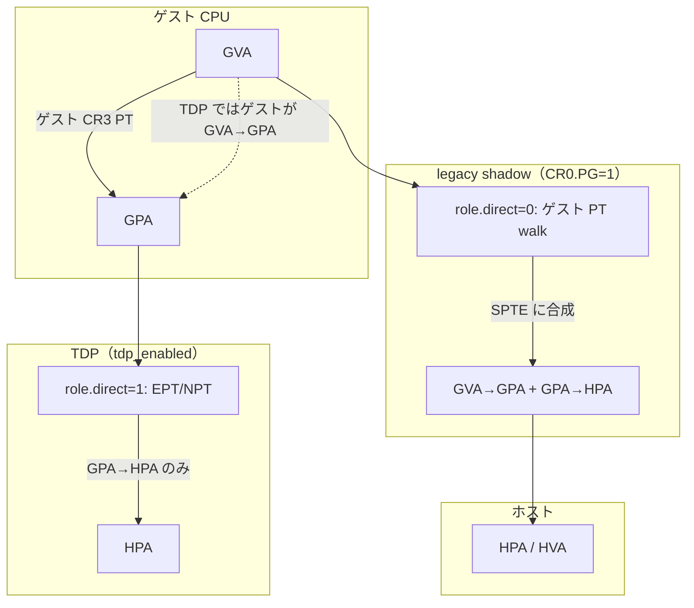

# 第9章 シャドウページテーブルと TDP（EPT/NPT）のモデル

> **本章で読むソース**
>
> - [`arch/x86/include/asm/kvm_host.h` L304-L370](https://github.com/gregkh/linux/blob/v6.18.38/arch/x86/include/asm/kvm_host.h#L304-L370)
> - [`arch/x86/kvm/mmu/mmu_internal.h` L54-L99](https://github.com/gregkh/linux/blob/v6.18.38/arch/x86/kvm/mmu/mmu_internal.h#L54-L99)
> - [`arch/x86/kvm/mmu/mmu.c` L5916-L5927](https://github.com/gregkh/linux/blob/v6.18.38/arch/x86/kvm/mmu/mmu.c#L5916-L5927)
> - [`arch/x86/kvm/mmu/mmu.c` L5691-L5736](https://github.com/gregkh/linux/blob/v6.18.38/arch/x86/kvm/mmu/mmu.c#L5691-L5736)
> - [`arch/x86/kvm/mmu/mmu.c` L5760-L5783](https://github.com/gregkh/linux/blob/v6.18.38/arch/x86/kvm/mmu/mmu.c#L5760-L5783)
> - [`arch/x86/kvm/mmu/mmu.c` L3803-L3864](https://github.com/gregkh/linux/blob/v6.18.38/arch/x86/kvm/mmu/mmu.c#L3803-L3864)
> - [`arch/x86/kvm/mmu/mmu.c` L6514-L6537](https://github.com/gregkh/linux/blob/v6.18.38/arch/x86/kvm/mmu/mmu.c#L6514-L6537)
> - [`arch/x86/kvm/mmu/mmu.c` L5610-L5623](https://github.com/gregkh/linux/blob/v6.18.38/arch/x86/kvm/mmu/mmu.c#L5610-L5623)

## この章の狙い

x86 KVM MMU の中心データ構造 `kvm_mmu_page` と `kvm_mmu_page_role` を読み、legacy シャドウページングと TDP（EPT/NPT）の使い分けをモデルとして押さえる。
`role.direct` は「ゲスト PTE を shadow しない直接 SP」を表し、TDP 有効かどうかとは別概念である。
`tdp_mmu_page` による fast path と legacy shadow の違いを第10章と第11章へつなぐ。

## 前提

- [第2章 `struct kvm` / `kvm_vcpu` とアーキテクチャ ops](../part00-foundation/02-kvm-vcpu-arch-ops.md)
- [メモリスロット、`guest_memfd`、ホストバッキング](../part02-guest-memory/06-memory-slots-guest-memfd.md)
- [メモリ管理：ページテーブルウォークと page fault](../../mm/part03-virtual/16-page-table-walk-missing-fault.md)

## `kvm_mmu_page_role`：再利用の鍵

コメントが明示するように、「shadow page」には TDP ページも含まれる。
`role` は同じ条件下で SP を再利用できるかを決め、`gfn_write_track` のサイズを抑える。

[`arch/x86/include/asm/kvm_host.h` L304-L370](https://github.com/gregkh/linux/blob/v6.18.38/arch/x86/include/asm/kvm_host.h#L304-L370)

```c
/*
 * kvm_mmu_page_role tracks the properties of a shadow page (where shadow page
 * also includes TDP pages) to determine whether or not a page can be used in
 * the given MMU context.  This is a subset of the overall kvm_cpu_role to
 * minimize the size of kvm_memory_slot.arch.gfn_write_track, i.e. allows
 * allocating 2 bytes per gfn instead of 4 bytes per gfn.
 *
 * Upper-level shadow pages having gptes are tracked for write-protection via
 * gfn_write_track.  As above, gfn_write_track is a 16 bit counter, so KVM must
 * not create more than 2^16-1 upper-level shadow pages at a single gfn,
 * otherwise gfn_write_track will overflow and explosions will ensue.
 *
 * A unique shadow page (SP) for a gfn is created if and only if an existing SP
 * cannot be reused.  The ability to reuse a SP is tracked by its role, which
 * incorporates various mode bits and properties of the SP.  Roughly speaking,
 * the number of unique SPs that can theoretically be created is 2^n, where n
 * is the number of bits that are used to compute the role.
 *
 * But, even though there are 20 bits in the mask below, not all combinations
 * of modes and flags are possible:
 *
 *   - invalid shadow pages are not accounted, mirror pages are not shadowed,
 *     so the bits are effectively 18.
 *
 *   - quadrant will only be used if has_4_byte_gpte=1 (non-PAE paging);
 *     execonly and ad_disabled are only used for nested EPT which has
 *     has_4_byte_gpte=0.  Therefore, 2 bits are always unused.
 *
 *   - the 4 bits of level are effectively limited to the values 2/3/4/5,
 *     as 4k SPs are not tracked (allowed to go unsync).  In addition non-PAE
 *     paging has exactly one upper level, making level completely redundant
 *     when has_4_byte_gpte=1.
 *
 *   - on top of this, smep_andnot_wp and smap_andnot_wp are only set if
 *     cr0_wp=0, therefore these three bits only give rise to 5 possibilities.
 *
 * Therefore, the maximum number of possible upper-level shadow pages for a
 * single gfn is a bit less than 2^13.
 */
union kvm_mmu_page_role {
	u32 word;
	struct {
		unsigned level:4;
		unsigned has_4_byte_gpte:1;
		unsigned quadrant:2;
		unsigned direct:1;
		unsigned access:3;
		unsigned invalid:1;
		unsigned efer_nx:1;
		unsigned cr0_wp:1;
		unsigned smep_andnot_wp:1;
		unsigned smap_andnot_wp:1;
		unsigned ad_disabled:1;
		unsigned guest_mode:1;
		unsigned passthrough:1;
		unsigned is_mirror:1;
		unsigned :4;

		/*
		 * This is left at the top of the word so that
		 * kvm_memslots_for_spte_role can extract it with a
		 * simple shift.  While there is room, give it a whole
		 * byte so it is also faster to load it from memory.
		 */
		unsigned smm:8;
	};
};
```

`direct` が 1 の SP はゲスト PTE を shadow しない「直接 SP」である。
GVA→GPA をゲスト自身が担う TDP でも、CR0.PG=0 の nonpaging shadow でも direct page が作られる。
`direct` は TDP MMU と同義ではなく、第11章の `tdp_mmu_page` ビットが fast path 固有の識別子である。
`direct` が 0 の SP はゲストページテーブルを walk し、SPTE に GVA→GPA と memslot の GPA→HPA を合成してハードウェアへ GVA→HPA を提示する。

## `struct kvm_mmu_page` と SPTE

legacy shadow MMU ページは `role` と `gfn` で `mmu_page_hash` に登録され、`spt` が SPTE 配列を指す。
同一 `role` と `gfn` の SP はハッシュから検索して再利用する。
`tdp_mmu_page` が真のページは root リストと RCU で別管理され、ハッシュテーブルには載らない。
`shadowed_translation` は各 SPTE が影しているゲスト側変換結果（GPA とアクセス権）を保持する。

[`arch/x86/kvm/mmu/mmu_internal.h` L54-L99](https://github.com/gregkh/linux/blob/v6.18.38/arch/x86/kvm/mmu/mmu_internal.h#L54-L99)

```c
struct kvm_mmu_page {
	/*
	 * Note, "link" through "spt" fit in a single 64 byte cache line on
	 * 64-bit kernels, keep it that way unless there's a reason not to.
	 */
	struct list_head link;
	struct hlist_node hash_link;

	bool tdp_mmu_page;
	bool unsync;
	union {
		u8 mmu_valid_gen;

		/* Only accessed under slots_lock.  */
		bool tdp_mmu_scheduled_root_to_zap;
	};

	 /*
	  * The shadow page can't be replaced by an equivalent huge page
	  * because it is being used to map an executable page in the guest
	  * and the NX huge page mitigation is enabled.
	  */
	bool nx_huge_page_disallowed;

	/*
	 * The following two entries are used to key the shadow page in the
	 * hash table.
	 */
	union kvm_mmu_page_role role;
	gfn_t gfn;

	u64 *spt;

	/*
	 * Stores the result of the guest translation being shadowed by each
	 * SPTE.  KVM shadows two types of guest translations: nGPA -> GPA
	 * (shadow EPT/NPT) and GVA -> GPA (traditional shadow paging). In both
	 * cases the result of the translation is a GPA and a set of access
	 * constraints.
	 *
	 * The GFN is stored in the upper bits (PAGE_SHIFT) and the shadowed
	 * access permissions are stored in the lower bits. Note, for
	 * convenience and uniformity across guests, the access permissions are
	 * stored in KVM format (e.g.  ACC_EXEC_MASK) not the raw guest format.
	 */
	u64 *shadowed_translation;
```

`tdp_mmu_page` が真のページは第11章の `tdp_mmu` fast path が RCU と cmpxchg で管理する SP である。
`role.direct` とは別軸であり、legacy shadow TDP（write lock 中心）との境界を示す。
`unsync` はゲストページテーブルと SPTE がずれている状態を表し、`role.direct=0` の legacy shadow でのみ意味を持つ。

## `kvm_init_mmu`：3 分岐

vCPU の MMU コンテキスト再構築は、nested、TDP、legacy softmmu の三つに分岐する。

[`arch/x86/kvm/mmu/mmu.c` L5916-L5927](https://github.com/gregkh/linux/blob/v6.18.38/arch/x86/kvm/mmu/mmu.c#L5916-L5927)

```c
void kvm_init_mmu(struct kvm_vcpu *vcpu)
{
	struct kvm_mmu_role_regs regs = vcpu_to_role_regs(vcpu);
	union kvm_cpu_role cpu_role = kvm_calc_cpu_role(vcpu, &regs);

	if (mmu_is_nested(vcpu))
		init_kvm_nested_mmu(vcpu, cpu_role);
	else if (tdp_enabled)
		init_kvm_tdp_mmu(vcpu, cpu_role);
	else
		init_kvm_softmmu(vcpu, cpu_role);
}
```

| 条件 | 初期化関数 | アドレス変換の分担 | ハードウェア |
|---|---|---|---|
| nested 実行中 | `init_kvm_nested_mmu` | L2 のページング設定に依存（L1 が EPT/NPT なら L1 の nested PT を shadow、そうでなければ legacy shadow） | L1/L2 構成による |
| `tdp_enabled` | `init_kvm_tdp_mmu` | GVA→GPA はゲスト、GPA→HPA は KVM（`role.direct=1` の EPT/NPT） | EPT/NPT |
| それ以外 | `init_kvm_softmmu` | CR0.PG=1 なら GVA→GPA を shadow（`role.direct=0`）、PG=0 なら direct shadow | シャドウページング |

## TDP ルート：GPA 直結の direct SP

TDP 有効時のルートロールは `direct` を立て、レベルは `kvm_mmu_get_tdp_level` で決まる。
ページフォールトハンドラは `kvm_tdp_page_fault` に差し替わる。

[`arch/x86/kvm/mmu/mmu.c` L5691-L5736](https://github.com/gregkh/linux/blob/v6.18.38/arch/x86/kvm/mmu/mmu.c#L5691-L5736)

```c
kvm_calc_tdp_mmu_root_page_role(struct kvm_vcpu *vcpu,
				union kvm_cpu_role cpu_role)
{
	union kvm_mmu_page_role role = {0};

	role.access = ACC_ALL;
	role.cr0_wp = true;
	role.efer_nx = true;
	role.smm = cpu_role.base.smm;
	role.guest_mode = cpu_role.base.guest_mode;
	role.ad_disabled = !kvm_ad_enabled;
	role.level = kvm_mmu_get_tdp_level(vcpu);
	role.direct = true;
	role.has_4_byte_gpte = false;

	return role;
}

static void init_kvm_tdp_mmu(struct kvm_vcpu *vcpu,
			     union kvm_cpu_role cpu_role)
{
	struct kvm_mmu *context = &vcpu->arch.root_mmu;
	union kvm_mmu_page_role root_role = kvm_calc_tdp_mmu_root_page_role(vcpu, cpu_role);

	if (cpu_role.as_u64 == context->cpu_role.as_u64 &&
	    root_role.word == context->root_role.word)
		return;

	context->cpu_role.as_u64 = cpu_role.as_u64;
	context->root_role.word = root_role.word;
	context->page_fault = kvm_tdp_page_fault;
	context->sync_spte = NULL;
	context->get_guest_pgd = get_guest_cr3;
	context->get_pdptr = kvm_pdptr_read;
	context->inject_page_fault = kvm_inject_page_fault;

	if (!is_cr0_pg(context))
		context->gva_to_gpa = nonpaging_gva_to_gpa;
	else if (is_cr4_pae(context))
		context->gva_to_gpa = paging64_gva_to_gpa;
	else
		context->gva_to_gpa = paging32_gva_to_gpa;

	reset_guest_paging_metadata(vcpu, context);
	reset_tdp_shadow_zero_bits_mask(context);
}
```

`sync_spte` が NULL なのは、TDP ではゲスト PTE を鏡写ししないためである。
GVA→GPA はゲスト CPU が行い、KVM は GPA→HPA（memslot 経由）だけを EPT/NPT に載せる。

## legacy shadow：ゲスト paging 有効時（`role.direct = 0`）

TDP 無効かつ CR0.PG=1 のときは `kvm_init_shadow_mmu` が `cpu_role.base` をルートロールに使い、`shadow_mmu_init_context` で 32/PAE/64 ビット用ハンドラを選ぶ。
`direct` は立たず、ゲストページテーブルを walk して SPTE を更新する。
CR0.PG=0 の nonpaging shadow では `kvm_calc_cpu_role` が `role.base.direct = 1` を返し、`nonpaging_page_fault` が direct SP を張る。

[`arch/x86/kvm/mmu/mmu.c` L5760-L5783](https://github.com/gregkh/linux/blob/v6.18.38/arch/x86/kvm/mmu/mmu.c#L5760-L5783)

```c
static void kvm_init_shadow_mmu(struct kvm_vcpu *vcpu,
				union kvm_cpu_role cpu_role)
{
	struct kvm_mmu *context = &vcpu->arch.root_mmu;
	union kvm_mmu_page_role root_role;

	root_role = cpu_role.base;

	/* KVM uses PAE paging whenever the guest isn't using 64-bit paging. */
	root_role.level = max_t(u32, root_role.level, PT32E_ROOT_LEVEL);

	/*
	 * KVM forces EFER.NX=1 when TDP is disabled, reflect it in the MMU role.
	 * KVM uses NX when TDP is disabled to handle a variety of scenarios,
	 * notably for huge SPTEs if iTLB multi-hit mitigation is enabled and
	 * to generate correct permissions for CR0.WP=0/CR4.SMEP=1/EFER.NX=0.
	 * The iTLB multi-hit workaround can be toggled at any time, so assume
	 * NX can be used by any non-nested shadow MMU to avoid having to reset
	 * MMU contexts.
	 */
	root_role.efer_nx = true;

	shadow_mmu_init_context(vcpu, context, cpu_role, root_role);
}
```

[`arch/x86/kvm/mmu/mmu.c` L5610-L5623](https://github.com/gregkh/linux/blob/v6.18.38/arch/x86/kvm/mmu/mmu.c#L5610-L5623)

```c
static union kvm_cpu_role kvm_calc_cpu_role(struct kvm_vcpu *vcpu,
					    const struct kvm_mmu_role_regs *regs)
{
	union kvm_cpu_role role = {0};

	role.base.access = ACC_ALL;
	role.base.smm = is_smm(vcpu);
	role.base.guest_mode = is_guest_mode(vcpu);
	role.ext.valid = 1;

	if (!____is_cr0_pg(regs)) {
		role.base.direct = 1;
		return role;
	}
```

現代のハードウェア KVM はほぼ常に `tdp_enabled` であるが、nested や特定 quirk では guest_mmu 側にシャドウ EPT が残る。

## ルート解放：TDP MMU と legacy shadow の分岐

ルートページテーブルを外すとき、`tdp_mmu_enabled && root_role.direct` なら read lock と `tdp_mmu` 専用経路を使う。
legacy shadow は write lock で zap リストをコミットする。

[`arch/x86/kvm/mmu/mmu.c` L3803-L3864](https://github.com/gregkh/linux/blob/v6.18.38/arch/x86/kvm/mmu/mmu.c#L3803-L3864)

```c
void kvm_mmu_free_roots(struct kvm *kvm, struct kvm_mmu *mmu,
			ulong roots_to_free)
{
	bool is_tdp_mmu = tdp_mmu_enabled && mmu->root_role.direct;
	int i;
	LIST_HEAD(invalid_list);
	bool free_active_root;

	WARN_ON_ONCE(roots_to_free & ~KVM_MMU_ROOTS_ALL);

	BUILD_BUG_ON(KVM_MMU_NUM_PREV_ROOTS >= BITS_PER_LONG);

	/* Before acquiring the MMU lock, see if we need to do any real work. */
	free_active_root = (roots_to_free & KVM_MMU_ROOT_CURRENT)
		&& VALID_PAGE(mmu->root.hpa);

	if (!free_active_root) {
		for (i = 0; i < KVM_MMU_NUM_PREV_ROOTS; i++)
			if ((roots_to_free & KVM_MMU_ROOT_PREVIOUS(i)) &&
			    VALID_PAGE(mmu->prev_roots[i].hpa))
				break;

		if (i == KVM_MMU_NUM_PREV_ROOTS)
			return;
	}

	if (is_tdp_mmu)
		read_lock(&kvm->mmu_lock);
	else
		write_lock(&kvm->mmu_lock);

	for (i = 0; i < KVM_MMU_NUM_PREV_ROOTS; i++)
		if (roots_to_free & KVM_MMU_ROOT_PREVIOUS(i))
			mmu_free_root_page(kvm, &mmu->prev_roots[i].hpa,
					   &invalid_list);

	if (free_active_root) {
		if (kvm_mmu_is_dummy_root(mmu->root.hpa)) {
			/* Nothing to cleanup for dummy roots. */
		} else if (root_to_sp(mmu->root.hpa)) {
			mmu_free_root_page(kvm, &mmu->root.hpa, &invalid_list);
		} else if (mmu->pae_root) {
			for (i = 0; i < 4; ++i) {
				if (!IS_VALID_PAE_ROOT(mmu->pae_root[i]))
					continue;

				mmu_free_root_page(kvm, &mmu->pae_root[i],
						   &invalid_list);
				mmu->pae_root[i] = INVALID_PAE_ROOT;
			}
		}
		mmu->root.hpa = INVALID_PAGE;
		mmu->root.pgd = 0;
	}

	if (is_tdp_mmu) {
		read_unlock(&kvm->mmu_lock);
		WARN_ON_ONCE(!list_empty(&invalid_list));
	} else {
		kvm_mmu_commit_zap_page(kvm, &invalid_list);
		write_unlock(&kvm->mmu_lock);
	}
```

同一 `kvm_mmu_page` 型でも、`tdp_mmu_page` かどうかでロックモードと解放 API が変わる点が実装の難所である。

## `kvm_configure_mmu`：`tdp_enabled` の設定

モジュール初期化時に vendor が TDP 可否を報告し、グローバル `tdp_enabled` と `tdp_mmu_enabled` が決まる。

[`arch/x86/kvm/mmu/mmu.c` L6514-L6537](https://github.com/gregkh/linux/blob/v6.18.38/arch/x86/kvm/mmu/mmu.c#L6514-L6537)

```c
void kvm_configure_mmu(bool enable_tdp, int tdp_forced_root_level,
		       int tdp_max_root_level, int tdp_huge_page_level)
{
	tdp_enabled = enable_tdp;
	tdp_root_level = tdp_forced_root_level;
	max_tdp_level = tdp_max_root_level;

#ifdef CONFIG_X86_64
	tdp_mmu_enabled = tdp_mmu_allowed && tdp_enabled;
#endif
	/*
	 * max_huge_page_level reflects KVM's MMU capabilities irrespective
	 * of kernel support, e.g. KVM may be capable of using 1GB pages when
	 * the kernel is not.  But, KVM never creates a page size greater than
	 * what is used by the kernel for any given HVA, i.e. the kernel's
	 * capabilities are ultimately consulted by kvm_mmu_hugepage_adjust().
	 */
	if (tdp_enabled)
		max_huge_page_level = tdp_huge_page_level;
	else if (boot_cpu_has(X86_FEATURE_GBPAGES))
		max_huge_page_level = PG_LEVEL_1G;
	else
		max_huge_page_level = PG_LEVEL_2M;
}
```

`tdp_mmu_enabled` は第11章の fast path 用であり、本章の legacy TDP shadow と併存する。

## 処理の流れ：アドレス変換の二層モデル



legacy shadow では一枚の SPTE がゲスト PTE の GVA→GPA と memslot の GPA→HPA を合成し、ハードウェアには実質 GVA→HPA を見せる。
TDP ではゲスト PT が GVA→GPA、EPT/NPT が GPA→HPA を別々に担当する。
nested では L1 が EPT/NPT を持つかどうかで L2 の shadow 構成が変わる（常に L1 EPT/NPT を shadow するとは限らない）。

## 高速化と最適化の工夫

`kvm_mmu_page` の `link` から `spt` までを 64 バイト cache line に収め、legacy shadow のハッシュ探索と SPTE アクセスの局所性を保つ。
`mmu_page_hash` による SP 再利用は legacy shadow MMU ページに限定され、TDP MMU page は root リストと RCU で管理する。
`role` による SP 再利用はメモリとフラグメンテーションを抑え、`gfn_write_track` を 16 ビットに収める設計上の制約とトレードオフになっている。

TDP 有効時はゲストが GVA→GPA を担当するため、KVM は GPA→HPA だけを管理でき、legacy shadow より CPU 仮想化の本領が発揮される。
`tdp_mmu` fast path はさらに read lock 中心の操作でスケールさせる（第11章）。

`kvm_init_mmu` は `cpu_role` と `root_role` が変わらなければ早期 return し、不要なルート再構築を避ける。

## まとめ

`kvm_mmu_page` と `role` はシャドウと TDP の共通データモデルである。
`role.direct` は「ゲスト PTE を shadow しない直接 SP」であり、TDP 有効か nonpaging shadow かとは別に立つ。
`tdp_mmu_page` が fast path の識別子であり、`kvm_init_mmu` は nested、TDP、softmmu の三経路に分岐する。
ルート解放は `tdp_mmu_page` かどうかでロックと API が分かれる。

## 関連する章

- [dirty page tracking（bitmap と dirty ring）](../part02-guest-memory/08-dirty-page-tracking.md)
- [SPTE とゲスト page fault 処理](10-spte-page-fault.md)
- [TDP MMU fast path と `tdp_mmu`](11-tdp-mmu-fastpath.md)
