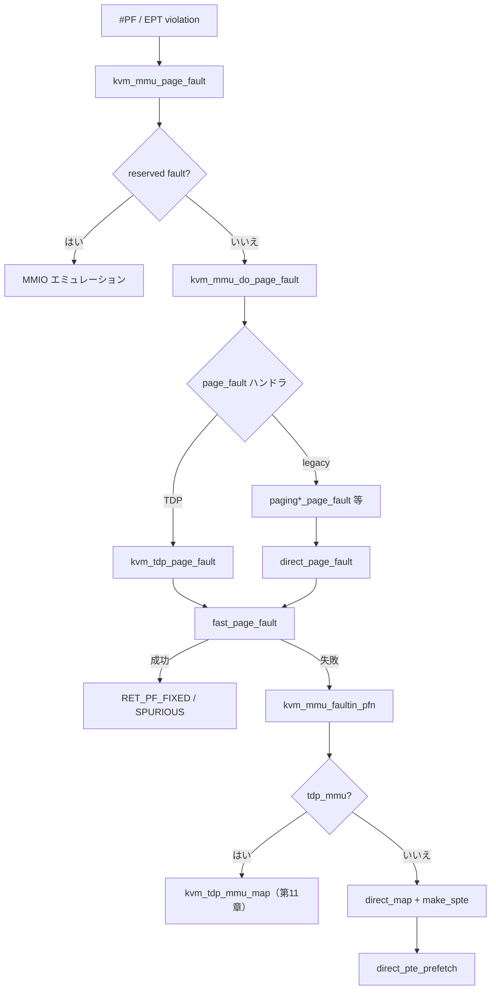

# 第10章 SPTE とゲスト page fault 処理

> **本章で読むソース**
>
> - [`arch/x86/kvm/mmu/spte.c` L186-L214](https://github.com/gregkh/linux/blob/v6.18.38/arch/x86/kvm/mmu/spte.c#L186-L214)
> - [`arch/x86/kvm/mmu/spte.c` L253-L301](https://github.com/gregkh/linux/blob/v6.18.38/arch/x86/kvm/mmu/spte.c#L253-L301)
> - [`arch/x86/kvm/mmu/mmu_internal.h` L350-L393](https://github.com/gregkh/linux/blob/v6.18.38/arch/x86/kvm/mmu/mmu_internal.h#L350-L393)
> - [`arch/x86/kvm/mmu/mmu.c` L6315-L6355](https://github.com/gregkh/linux/blob/v6.18.38/arch/x86/kvm/mmu/mmu.c#L6315-L6355)
> - [`arch/x86/kvm/mmu/mmu.c` L4786-L4825](https://github.com/gregkh/linux/blob/v6.18.38/arch/x86/kvm/mmu/mmu.c#L4786-L4825)
> - [`arch/x86/kvm/mmu/mmu.c` L4634-L4660](https://github.com/gregkh/linux/blob/v6.18.38/arch/x86/kvm/mmu/mmu.c#L4634-L4660)
> - [`arch/x86/kvm/mmu/mmu.c` L3655-L3689](https://github.com/gregkh/linux/blob/v6.18.38/arch/x86/kvm/mmu/mmu.c#L3655-L3689)
> - [`arch/x86/kvm/mmu/mmu.c` L3174-L3199](https://github.com/gregkh/linux/blob/v6.18.38/arch/x86/kvm/mmu/mmu.c#L3174-L3199)

## この章の狙い

ゲストの page fault から SPTE を立てるまでの経路を読む。
`make_spte` が PFN とアクセス権を SPTE に載せる方法、`kvm_mmu_page_fault` → `kvm_mmu_do_page_fault` → `direct_page_fault` の分岐、`kvm_mmu_faultin_pfn` による PFN 解決、fast path と prefetch の最適化を押さえる。

## 前提

- [シャドウページテーブルと TDP（EPT/NPT）のモデル](09-shadow-tdp-model.md)
- [メモリスロット、`guest_memfd`、ホストバッキング](../part02-guest-memory/06-memory-slots-guest-memfd.md)
- [`mmu_notifier` とリモート TLB flush](../part02-guest-memory/07-mmu-notifier-remote-tlb.md)

## `make_spte`：PFN と権限を SPTE に載せる

`make_spte` は leaf SPTE の値を組み立てる共通入口である。
present ビット、NX/USER、巨大ページ、メモリタイプ、dirty/accessed、write-protect をここで決める。

[`arch/x86/kvm/mmu/spte.c` L186-L214](https://github.com/gregkh/linux/blob/v6.18.38/arch/x86/kvm/mmu/spte.c#L186-L214)

```c
bool make_spte(struct kvm_vcpu *vcpu, struct kvm_mmu_page *sp,
	       const struct kvm_memory_slot *slot,
	       unsigned int pte_access, gfn_t gfn, kvm_pfn_t pfn,
	       u64 old_spte, bool prefetch, bool synchronizing,
	       bool host_writable, u64 *new_spte)
{
	int level = sp->role.level;
	u64 spte = SPTE_MMU_PRESENT_MASK;
	int is_host_mmio = -1;
	bool wrprot = false;

	/*
	 * For the EPT case, shadow_present_mask has no RWX bits set if
	 * exec-only page table entries are supported.  In that case,
	 * ACC_USER_MASK and shadow_user_mask are used to represent
	 * read access.  See FNAME(gpte_access) in paging_tmpl.h.
	 */
	WARN_ON_ONCE((pte_access | shadow_present_mask) == SHADOW_NONPRESENT_VALUE);

	if (sp->role.ad_disabled)
		spte |= SPTE_TDP_AD_DISABLED;
	else if (kvm_mmu_page_ad_need_write_protect(vcpu->kvm, sp))
		spte |= SPTE_TDP_AD_WRPROT_ONLY;

	spte |= shadow_present_mask;
	if (!prefetch || synchronizing)
		spte |= shadow_accessed_mask;
```

書き込み可能 SPTE を張るときは unsync shadow の write-protect や dirty tracking もここで扱う。

[`arch/x86/kvm/mmu/spte.c` L253-L301](https://github.com/gregkh/linux/blob/v6.18.38/arch/x86/kvm/mmu/spte.c#L253-L301)

```c
	spte |= (u64)pfn << PAGE_SHIFT;

	if (pte_access & ACC_WRITE_MASK) {
		/*
		 * Unsync shadow pages that are reachable by the new, writable
		 * SPTE.  Write-protect the SPTE if the page can't be unsync'd,
		 * e.g. it's write-tracked (upper-level SPs) or has one or more
		 * shadow pages and unsync'ing pages is not allowed.
		 *
		 * When overwriting an existing leaf SPTE, and the old SPTE was
		 * writable, skip trying to unsync shadow pages as any relevant
		 * shadow pages must already be unsync, i.e. the hash lookup is
		 * unnecessary (and expensive).  Note, this relies on KVM not
		 * changing PFNs without first zapping the old SPTE, which is
		 * guaranteed by both the shadow MMU and the TDP MMU.
		 */
		if ((!is_last_spte(old_spte, level) || !is_writable_pte(old_spte)) &&
		    mmu_try_to_unsync_pages(vcpu->kvm, slot, gfn, synchronizing, prefetch))
			wrprot = true;
		else
			spte |= PT_WRITABLE_MASK | shadow_mmu_writable_mask |
				shadow_dirty_mask;
	}

	if (prefetch && !synchronizing)
		spte = mark_spte_for_access_track(spte);

	WARN_ONCE(is_rsvd_spte(&vcpu->arch.mmu->shadow_zero_check, spte, level),
		  "spte = 0x%llx, level = %d, rsvd bits = 0x%llx", spte, level,
		  get_rsvd_bits(&vcpu->arch.mmu->shadow_zero_check, spte, level));

	/*
	 * Mark the memslot dirty *after* modifying it for access tracking.
	 * Unlike folios, memslots can be safely marked dirty out of mmu_lock,
	 * i.e. in the fast page fault handler.
	 */
	if ((spte & PT_WRITABLE_MASK) && kvm_slot_dirty_track_enabled(slot)) {
		/* Enforced by kvm_mmu_hugepage_adjust. */
		WARN_ON_ONCE(level > PG_LEVEL_4K);
		mark_page_dirty_in_slot(vcpu->kvm, slot, gfn);
	}

	if (static_branch_unlikely(&cpu_buf_vm_clear) &&
	    !kvm_vcpu_can_access_host_mmio(vcpu) &&
	    kvm_is_mmio_pfn(pfn, &is_host_mmio))
		kvm_track_host_mmio_mapping(vcpu);

	*new_spte = spte;
	return wrprot;
}
```

`role.direct=0` の legacy shadow では guest PTE の権限と合成した結果が SPTE に載る。
`role.direct=1` の direct SP では GPA→HPA の権限だけを載せる（第9章）。

## `kvm_mmu_page_fault`：VM-exit からの入口

x86 の #PF / EPT violation は `kvm_handle_page_fault` を経て `kvm_mmu_page_fault` に入る。
reserved fault は MMIO エミュレーションへ、通常 fault は `kvm_mmu_do_page_fault` へ委ねる。

[`arch/x86/kvm/mmu/mmu.c` L6315-L6355](https://github.com/gregkh/linux/blob/v6.18.38/arch/x86/kvm/mmu/mmu.c#L6315-L6355)

```c
int noinline kvm_mmu_page_fault(struct kvm_vcpu *vcpu, gpa_t cr2_or_gpa, u64 error_code,
		       void *insn, int insn_len)
{
	int r, emulation_type = EMULTYPE_PF;
	bool direct = vcpu->arch.mmu->root_role.direct;

	if (WARN_ON_ONCE(!VALID_PAGE(vcpu->arch.mmu->root.hpa)))
		return RET_PF_RETRY;

	/*
	 * Except for reserved faults (emulated MMIO is shared-only), set the
	 * PFERR_PRIVATE_ACCESS flag for software-protected VMs based on the gfn's
	 * current attributes, which are the source of truth for such VMs.  Note,
	 * this wrong for nested MMUs as the GPA is an L2 GPA, but KVM doesn't
	 * currently supported nested virtualization (among many other things)
	 * for software-protected VMs.
	 */
	if (IS_ENABLED(CONFIG_KVM_SW_PROTECTED_VM) &&
	    !(error_code & PFERR_RSVD_MASK) &&
	    vcpu->kvm->arch.vm_type == KVM_X86_SW_PROTECTED_VM &&
	    kvm_mem_is_private(vcpu->kvm, gpa_to_gfn(cr2_or_gpa)))
		error_code |= PFERR_PRIVATE_ACCESS;

	r = RET_PF_INVALID;
	if (unlikely(error_code & PFERR_RSVD_MASK)) {
		if (WARN_ON_ONCE(error_code & PFERR_PRIVATE_ACCESS))
			return -EFAULT;

		r = handle_mmio_page_fault(vcpu, cr2_or_gpa, direct);
		if (r == RET_PF_EMULATE)
			goto emulate;
	}

	if (r == RET_PF_INVALID) {
		vcpu->stat.pf_taken++;

		r = kvm_mmu_do_page_fault(vcpu, cr2_or_gpa, error_code, false,
					  &emulation_type, NULL);
		if (KVM_BUG_ON(r == RET_PF_INVALID, vcpu->kvm))
			return -EIO;
	}
```

## `kvm_mmu_do_page_fault` と `direct_page_fault`

`kvm_mmu_do_page_fault` は `kvm_page_fault` 構造体を組み立て、`root_role.direct` なら GFN を fault アドレスから直接引く。
ハンドラは `kvm_tdp_page_fault` か `mmu->page_fault`（legacy shadow では paging テンプレート由来）に分岐する。

[`arch/x86/kvm/mmu/mmu_internal.h` L350-L393](https://github.com/gregkh/linux/blob/v6.18.38/arch/x86/kvm/mmu/mmu_internal.h#L350-L393)

```c
static inline int kvm_mmu_do_page_fault(struct kvm_vcpu *vcpu, gpa_t cr2_or_gpa,
					u64 err, bool prefetch,
					int *emulation_type, u8 *level)
{
	struct kvm_page_fault fault = {
		.addr = cr2_or_gpa,
		.error_code = err,
		.exec = err & PFERR_FETCH_MASK,
		.write = err & PFERR_WRITE_MASK,
		.present = err & PFERR_PRESENT_MASK,
		.rsvd = err & PFERR_RSVD_MASK,
		.user = err & PFERR_USER_MASK,
		.prefetch = prefetch,
		.is_tdp = likely(vcpu->arch.mmu->page_fault == kvm_tdp_page_fault),
		.nx_huge_page_workaround_enabled =
			is_nx_huge_page_enabled(vcpu->kvm),

		.max_level = KVM_MAX_HUGEPAGE_LEVEL,
		.req_level = PG_LEVEL_4K,
		.goal_level = PG_LEVEL_4K,
		.is_private = err & PFERR_PRIVATE_ACCESS,

		.pfn = KVM_PFN_ERR_FAULT,
	};
	int r;

	if (vcpu->arch.mmu->root_role.direct) {
		/*
		 * Things like memslots don't understand the concept of a shared
		 * bit. Strip it so that the GFN can be used like normal, and the
		 * fault.addr can be used when the shared bit is needed.
		 */
		fault.gfn = gpa_to_gfn(fault.addr) & ~kvm_gfn_direct_bits(vcpu->kvm);
		fault.slot = kvm_vcpu_gfn_to_memslot(vcpu, fault.gfn);
	}

	/*
	 * With retpoline being active an indirect call is rather expensive,
	 * so do a direct call in the most common case.
	 */
	if (IS_ENABLED(CONFIG_MITIGATION_RETPOLINE) && fault.is_tdp)
		r = kvm_tdp_page_fault(vcpu, &fault);
	else
		r = vcpu->arch.mmu->page_fault(vcpu, &fault);
```

TDP と nonpaging/direct shadow の共通 slow path は `direct_page_fault` である。
fast path を試し、PFN を fault-in し、`mmu_lock` 下で `direct_map` が SPTE を張る。

[`arch/x86/kvm/mmu/mmu.c` L4786-L4825](https://github.com/gregkh/linux/blob/v6.18.38/arch/x86/kvm/mmu/mmu.c#L4786-L4825)

```c
static int direct_page_fault(struct kvm_vcpu *vcpu, struct kvm_page_fault *fault)
{
	int r;

	/* Dummy roots are used only for shadowing bad guest roots. */
	if (WARN_ON_ONCE(kvm_mmu_is_dummy_root(vcpu->arch.mmu->root.hpa)))
		return RET_PF_RETRY;

	if (page_fault_handle_page_track(vcpu, fault))
		return RET_PF_WRITE_PROTECTED;

	r = fast_page_fault(vcpu, fault);
	if (r != RET_PF_INVALID)
		return r;

	r = mmu_topup_memory_caches(vcpu, false);
	if (r)
		return r;

	r = kvm_mmu_faultin_pfn(vcpu, fault, ACC_ALL);
	if (r != RET_PF_CONTINUE)
		return r;

	r = RET_PF_RETRY;
	write_lock(&vcpu->kvm->mmu_lock);

	if (is_page_fault_stale(vcpu, fault))
		goto out_unlock;

	r = make_mmu_pages_available(vcpu);
	if (r)
		goto out_unlock;

	r = direct_map(vcpu, fault);

out_unlock:
	kvm_mmu_finish_page_fault(vcpu, fault, r);
	write_unlock(&vcpu->kvm->mmu_lock);
	return r;
}
```

`tdp_mmu_enabled` 時は第11章の `kvm_tdp_mmu_page_fault` が read lock 下で `kvm_tdp_mmu_map` を呼ぶ点が異なる。

## `kvm_mmu_faultin_pfn`：PFN 解決と invalidate リトライ

`kvm_mmu_faultin_pfn` は `mmu_invalidate_seq` を記録し、private/shared の整合を確認してから `__kvm_mmu_faultin_pfn` でホスト PFN を引く。
`mmu_lock` 取得前に invalidate リトライを試し、無駄なロック競合を避ける。

[`arch/x86/kvm/mmu/mmu.c` L4634-L4660](https://github.com/gregkh/linux/blob/v6.18.38/arch/x86/kvm/mmu/mmu.c#L4634-L4660)

```c
static int kvm_mmu_faultin_pfn(struct kvm_vcpu *vcpu,
			       struct kvm_page_fault *fault, unsigned int access)
{
	struct kvm_memory_slot *slot = fault->slot;
	struct kvm *kvm = vcpu->kvm;
	int ret;

	if (KVM_BUG_ON(kvm_is_gfn_alias(kvm, fault->gfn), kvm))
		return -EFAULT;

	/*
	 * Note that the mmu_invalidate_seq also serves to detect a concurrent
	 * change in attributes.  is_page_fault_stale() will detect an
	 * invalidation relate to fault->fn and resume the guest without
	 * installing a mapping in the page tables.
	 */
	fault->mmu_seq = vcpu->kvm->mmu_invalidate_seq;
	smp_rmb();

	/*
	 * Now that we have a snapshot of mmu_invalidate_seq we can check for a
	 * private vs. shared mismatch.
	 */
	if (fault->is_private != kvm_mem_is_private(kvm, fault->gfn)) {
		kvm_mmu_prepare_memory_fault_exit(vcpu, fault);
		return -EFAULT;
	}
```

共有 GPA は `__kvm_faultin_pfn`、private GPA は `kvm_mmu_faultin_pfn_gmem` へ分岐する（第6章）。

## `fast_page_fault`：lockless な A/D 復元と write 昇格

`fast_page_fault` は `mmu_lock` 外で leaf SPTE を読み、TLB の陳腐化や A/D 追跡の write-protect だけを直せるか試す。
direct MMU（`role.direct=1`）に限定され、indirect shadow では GFN が安定しないため使えない。

[`arch/x86/kvm/mmu/mmu.c` L3655-L3689](https://github.com/gregkh/linux/blob/v6.18.38/arch/x86/kvm/mmu/mmu.c#L3655-L3689)

```c
static int fast_page_fault(struct kvm_vcpu *vcpu, struct kvm_page_fault *fault)
{
	struct kvm_mmu_page *sp;
	int ret = RET_PF_INVALID;
	u64 spte;
	u64 *sptep;
	uint retry_count = 0;

	if (!page_fault_can_be_fast(vcpu->kvm, fault))
		return ret;

	walk_shadow_page_lockless_begin(vcpu);

	do {
		u64 new_spte;

		if (tdp_mmu_enabled)
			sptep = kvm_tdp_mmu_fast_pf_get_last_sptep(vcpu, fault->gfn, &spte);
		else
			sptep = fast_pf_get_last_sptep(vcpu, fault->addr, &spte);

		/*
		 * It's entirely possible for the mapping to have been zapped
		 * by a different task, but the root page should always be
		 * available as the vCPU holds a reference to its root(s).
		 */
		if (WARN_ON_ONCE(!sptep))
			spte = FROZEN_SPTE;

		if (!is_shadow_present_pte(spte))
			break;

		sp = sptep_to_sp(sptep);
		if (!is_last_spte(spte, sp->role.level))
			break;
```

## `direct_pte_prefetch`：隣接 GFN の先読み

`direct_map` 成功後、`direct_pte_prefetch` が同じ shadow page 内の未マップ PTE を先読みする。
A/D ビット無効や invalidate 進行中はスキップする。

[`arch/x86/kvm/mmu/mmu.c` L3174-L3199](https://github.com/gregkh/linux/blob/v6.18.38/arch/x86/kvm/mmu/mmu.c#L3174-L3199)

```c
static void direct_pte_prefetch(struct kvm_vcpu *vcpu, u64 *sptep)
{
	struct kvm_mmu_page *sp;

	sp = sptep_to_sp(sptep);

	/*
	 * Without accessed bits, there's no way to distinguish between
	 * actually accessed translations and prefetched, so disable pte
	 * prefetch if accessed bits aren't available.
	 */
	if (sp_ad_disabled(sp))
		return;

	if (sp->role.level > PG_LEVEL_4K)
		return;

	/*
	 * If addresses are being invalidated, skip prefetching to avoid
	 * accidentally prefetching those addresses.
	 */
	if (unlikely(vcpu->kvm->mmu_invalidate_in_progress))
		return;

	__direct_pte_prefetch(vcpu, sp, sptep);
}
```

## 処理の流れ：page fault から SPTE 設置まで



## 高速化と最適化の工夫

`fast_page_fault` は `mmu_lock` なしで多くの A/D 起因 fault を解消し、VM-exit コストを下げる。
`kvm_mmu_faultin_pfn` は invalidate 検出をロック前後で二段に行い、競合時の待ちを短縮する。
`direct_pte_prefetch` は連続アクセスの page fault をまとめて減らす。
`make_spte` 内の dirty 記録は `mmu_lock` 外でも安全なため、fast path から直接 `mark_page_dirty_in_slot` を呼べる。

## まとめ

`make_spte` が PFN・権限・dirty 追跡を SPTE に載せる。
`kvm_mmu_page_fault` は MMIO と通常 fault を分岐し、`kvm_mmu_do_page_fault` が TDP / legacy ハンドラへ委ねる。
`direct_page_fault` は fast path → PFN fault-in → `direct_map` の順で SPTE を張る。
`kvm_mmu_faultin_pfn` は mmu_notifier とのレースを `mmu_invalidate_seq` で検出する。

## 関連する章

- [TDP MMU fast path と `tdp_mmu`](11-tdp-mmu-fastpath.md)
- [dirty page tracking（bitmap と dirty ring）](../part02-guest-memory/08-dirty-page-tracking.md)
- [`KVM_RUN` と vCPU 実行ループ](../part01-kvm-core/05-kvm-run-execution-loop.md)
