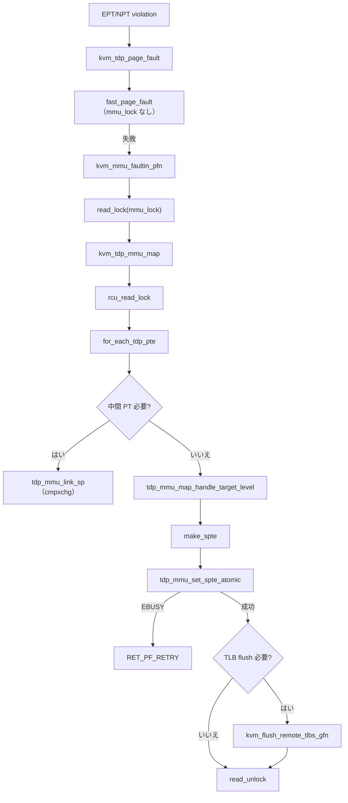

# 第11章 TDP MMU fast path と `tdp_mmu`

> **本章で読むソース**
>
> - [`arch/x86/kvm/mmu/mmu.c` L4880-L4912](https://github.com/gregkh/linux/blob/v6.18.38/arch/x86/kvm/mmu/mmu.c#L4880-L4912)
> - [`arch/x86/kvm/mmu/mmu.c` L4915-L4923](https://github.com/gregkh/linux/blob/v6.18.38/arch/x86/kvm/mmu/mmu.c#L4915-L4923)
> - [`arch/x86/kvm/mmu/tdp_mmu.c` L1268-L1320](https://github.com/gregkh/linux/blob/v6.18.38/arch/x86/kvm/mmu/tdp_mmu.c#L1268-L1320)
> - [`arch/x86/kvm/mmu/tdp_mmu.c` L655-L696](https://github.com/gregkh/linux/blob/v6.18.38/arch/x86/kvm/mmu/tdp_mmu.c#L655-L696)
> - [`arch/x86/kvm/mmu/tdp_mmu.c` L1173-L1206](https://github.com/gregkh/linux/blob/v6.18.38/arch/x86/kvm/mmu/tdp_mmu.c#L1173-L1206)
> - [`arch/x86/kvm/mmu/tdp_iter.h` L76-L117](https://github.com/gregkh/linux/blob/v6.18.38/arch/x86/kvm/mmu/tdp_iter.h#L76-L117)
> - [`arch/x86/kvm/mmu/tdp_iter.c` L39-L57](https://github.com/gregkh/linux/blob/v6.18.38/arch/x86/kvm/mmu/tdp_iter.c#L39-L57)

## この章の狙い

`tdp_mmu_enabled` 時の TDP MMU fast path を読む。
`kvm_tdp_mmu_page_fault` が read lock 下で `kvm_tdp_mmu_map` を呼ぶ流れ、`tdp_iter` によるページテーブル walk、read lock 保持下の `try_cmpxchg64` による SPTE 更新を押さえる。
第10章の `fast_page_fault` が lock を取らない軽量経路であることと区別する。

## 前提

- [シャドウページテーブルと TDP（EPT/NPT）のモデル](09-shadow-tdp-model.md)
- [SPTE とゲスト page fault 処理](10-spte-page-fault.md)
- [`mmu_notifier` とリモート TLB flush](../part02-guest-memory/07-mmu-notifier-remote-tlb.md)

## `kvm_tdp_page_fault`：read lock 経路

`tdp_mmu_enabled` かつ `tdp_mmu_page` ルートでは、page fault のマッピング段階が read lock 中心になる。
PFN fault-in までは第10章の `direct_page_fault` と同型で、その後 `kvm_tdp_mmu_map` へ入る。

[`arch/x86/kvm/mmu/mmu.c` L4880-L4912](https://github.com/gregkh/linux/blob/v6.18.38/arch/x86/kvm/mmu/mmu.c#L4880-L4912)

```c
static int kvm_tdp_mmu_page_fault(struct kvm_vcpu *vcpu,
				  struct kvm_page_fault *fault)
{
	int r;

	if (page_fault_handle_page_track(vcpu, fault))
		return RET_PF_WRITE_PROTECTED;

	r = fast_page_fault(vcpu, fault);
	if (r != RET_PF_INVALID)
		return r;

	r = mmu_topup_memory_caches(vcpu, false);
	if (r)
		return r;

	r = kvm_mmu_faultin_pfn(vcpu, fault, ACC_ALL);
	if (r != RET_PF_CONTINUE)
		return r;

	r = RET_PF_RETRY;
	read_lock(&vcpu->kvm->mmu_lock);

	if (is_page_fault_stale(vcpu, fault))
		goto out_unlock;

	r = kvm_tdp_mmu_map(vcpu, fault);

out_unlock:
	kvm_mmu_finish_page_fault(vcpu, fault, r);
	read_unlock(&vcpu->kvm->mmu_lock);
	return r;
}
```

`kvm_tdp_page_fault` は `tdp_mmu_enabled` なら上記 read lock 経路、そうでなければ legacy の `direct_page_fault`（write lock）へ落ちる。

[`arch/x86/kvm/mmu/mmu.c` L4915-L4923](https://github.com/gregkh/linux/blob/v6.18.38/arch/x86/kvm/mmu/mmu.c#L4915-L4923)

```c
int kvm_tdp_page_fault(struct kvm_vcpu *vcpu, struct kvm_page_fault *fault)
{
#ifdef CONFIG_X86_64
	if (tdp_mmu_enabled)
		return kvm_tdp_mmu_page_fault(vcpu, fault);
#endif

	return direct_page_fault(vcpu, fault);
}
```

## `kvm_tdp_mmu_map`：GFN から EPT/NPT へ

`kvm_tdp_mmu_map` は faulting GFN へ向かって `tdp_iter` で walk し、不足する中間テーブルを `tdp_mmu_link_sp` で挿入する。
目標レベルに達したら `tdp_mmu_map_handle_target_level` が `make_spte` と atomic set を行う。

[`arch/x86/kvm/mmu/tdp_mmu.c` L1268-L1320](https://github.com/gregkh/linux/blob/v6.18.38/arch/x86/kvm/mmu/tdp_mmu.c#L1268-L1320)

```c
int kvm_tdp_mmu_map(struct kvm_vcpu *vcpu, struct kvm_page_fault *fault)
{
	struct kvm_mmu_page *root = tdp_mmu_get_root_for_fault(vcpu, fault);
	struct kvm *kvm = vcpu->kvm;
	struct tdp_iter iter;
	struct kvm_mmu_page *sp;
	int ret = RET_PF_RETRY;

	kvm_mmu_hugepage_adjust(vcpu, fault);

	trace_kvm_mmu_spte_requested(fault);

	rcu_read_lock();

	for_each_tdp_pte(iter, kvm, root, fault->gfn, fault->gfn + 1) {
		int r;

		if (fault->nx_huge_page_workaround_enabled)
			disallowed_hugepage_adjust(fault, iter.old_spte, iter.level);

		/*
		 * If SPTE has been frozen by another thread, just give up and
		 * retry, avoiding unnecessary page table allocation and free.
		 */
		if (is_frozen_spte(iter.old_spte))
			goto retry;

		if (iter.level == fault->goal_level)
			goto map_target_level;

		/* Step down into the lower level page table if it exists. */
		if (is_shadow_present_pte(iter.old_spte) &&
		    !is_large_pte(iter.old_spte))
			continue;

		/*
		 * The SPTE is either non-present or points to a huge page that
		 * needs to be split.
		 */
		sp = tdp_mmu_alloc_sp(vcpu);
		tdp_mmu_init_child_sp(sp, &iter);
		if (is_mirror_sp(sp))
			kvm_mmu_alloc_external_spt(vcpu, sp);

		sp->nx_huge_page_disallowed = fault->huge_page_disallowed;

		if (is_shadow_present_pte(iter.old_spte)) {
			/* Don't support large page for mirrored roots (TDX) */
			KVM_BUG_ON(is_mirror_sptep(iter.sptep), vcpu->kvm);
			r = tdp_mmu_split_huge_page(kvm, &iter, sp, true);
		} else {
			r = tdp_mmu_link_sp(kvm, &iter, sp, true);
		}
```

FROZEN SPTE や cmpxchg 失敗時は `RET_PF_RETRY` で vCPU に再 fault させ、競合を解消する。

## `tdp_iter`：ページテーブルの前順 walk

`tdp_iter` は root から leaf へ GFN 範囲を前順走査するイテレータである。
`pt_path` に各レベルの PTE ポインタを保持し、`yielded` フラグで lock 解放後の walk 再開を扱う。

[`arch/x86/kvm/mmu/tdp_iter.h` L76-L117](https://github.com/gregkh/linux/blob/v6.18.38/arch/x86/kvm/mmu/tdp_iter.h#L76-L117)

```c
struct tdp_iter {
	/*
	 * The iterator will traverse the paging structure towards the mapping
	 * for this GFN.
	 */
	gfn_t next_last_level_gfn;
	/*
	 * The next_last_level_gfn at the time when the thread last
	 * yielded. Only yielding when the next_last_level_gfn !=
	 * yielded_gfn helps ensure forward progress.
	 */
	gfn_t yielded_gfn;
	/* Pointers to the page tables traversed to reach the current SPTE */
	tdp_ptep_t pt_path[PT64_ROOT_MAX_LEVEL];
	/* A pointer to the current SPTE */
	tdp_ptep_t sptep;
	/* The lowest GFN (mask bits excluded) mapped by the current SPTE */
	gfn_t gfn;
	/* Mask applied to convert the GFN to the mapping GPA */
	gfn_t gfn_bits;
	/* The level of the root page given to the iterator */
	int root_level;
	/* The lowest level the iterator should traverse to */
	int min_level;
	/* The iterator's current level within the paging structure */
	int level;
	/* The address space ID, i.e. SMM vs. regular. */
	int as_id;
	/* A snapshot of the value at sptep */
	u64 old_spte;
	/*
	 * Whether the iterator has a valid state. This will be false if the
	 * iterator walks off the end of the paging structure.
	 */
	bool valid;
	/*
	 * True if KVM dropped mmu_lock and yielded in the middle of a walk, in
	 * which case tdp_iter_next() needs to restart the walk at the root
	 * level instead of advancing to the next entry.
	 */
	bool yielded;
};
```

`tdp_iter_start` は root と目標 GFN を設定し、walk を root から再開する。

[`arch/x86/kvm/mmu/tdp_iter.c` L39-L57](https://github.com/gregkh/linux/blob/v6.18.38/arch/x86/kvm/mmu/tdp_iter.c#L39-L57)

```c
void tdp_iter_start(struct tdp_iter *iter, struct kvm_mmu_page *root,
		    int min_level, gfn_t next_last_level_gfn, gfn_t gfn_bits)
{
	if (WARN_ON_ONCE(!root || (root->role.level < 1) ||
			 (root->role.level > PT64_ROOT_MAX_LEVEL) ||
			 (gfn_bits && next_last_level_gfn >= gfn_bits))) {
		iter->valid = false;
		return;
	}

	iter->next_last_level_gfn = next_last_level_gfn;
	iter->gfn_bits = gfn_bits;
	iter->root_level = root->role.level;
	iter->min_level = min_level;
	iter->pt_path[iter->root_level - 1] = (tdp_ptep_t)root->spt;
	iter->as_id = kvm_mmu_page_as_id(root);

	tdp_iter_restart(iter);
}
```

## RCU と cmpxchg による read lock 下の SPTE 更新

`kvm_tdp_mmu_page_fault` は `read_lock(&kvm->mmu_lock)` を保持したまま `kvm_tdp_mmu_map` を実行する。
leaf 設置は `tdp_mmu_set_spte_atomic` が `try_cmpxchg64` で行い、複数 reader 間の更新を調停する。
write lock を不要にするのはこの read lock 下の並行更新であり、第10章の `fast_page_fault` が lock を取らない経路とは別である。
失敗時は `iter->old_spte` を最新値に更新し、呼び出し側がリトライする。

[`arch/x86/kvm/mmu/tdp_mmu.c` L655-L696](https://github.com/gregkh/linux/blob/v6.18.38/arch/x86/kvm/mmu/tdp_mmu.c#L655-L696)

```c
static inline int __must_check __tdp_mmu_set_spte_atomic(struct kvm *kvm,
							 struct tdp_iter *iter,
							 u64 new_spte)
{
	/*
	 * The caller is responsible for ensuring the old SPTE is not a FROZEN
	 * SPTE.  KVM should never attempt to zap or manipulate a FROZEN SPTE,
	 * and pre-checking before inserting a new SPTE is advantageous as it
	 * avoids unnecessary work.
	 */
	WARN_ON_ONCE(iter->yielded || is_frozen_spte(iter->old_spte));

	if (is_mirror_sptep(iter->sptep) && !is_frozen_spte(new_spte)) {
		int ret;

		/*
		 * Users of atomic zapping don't operate on mirror roots,
		 * so don't handle it and bug the VM if it's seen.
		 */
		if (KVM_BUG_ON(!is_shadow_present_pte(new_spte), kvm))
			return -EBUSY;

		ret = set_external_spte_present(kvm, iter->sptep, iter->gfn,
						iter->old_spte, new_spte, iter->level);
		if (ret)
			return ret;
	} else {
		u64 *sptep = rcu_dereference(iter->sptep);

		/*
		 * Note, fast_pf_fix_direct_spte() can also modify TDP MMU SPTEs
		 * and does not hold the mmu_lock.  On failure, i.e. if a
		 * different logical CPU modified the SPTE, try_cmpxchg64()
		 * updates iter->old_spte with the current value, so the caller
		 * operates on fresh data, e.g. if it retries
		 * tdp_mmu_set_spte_atomic()
		 */
		if (!try_cmpxchg64(sptep, &iter->old_spte, new_spte))
			return -EBUSY;
	}

	return 0;
}
```

`kvm_tdp_mmu_map` 内の `rcu_read_lock` は walk 中のページテーブル解放から読み取りを守る。
`tdp_mmu_iter_cond_resched` は長い zap 中に read lock を一時解放し、進捗を保ちながらスケジューラへ譲る。

## leaf 設置：`tdp_mmu_map_handle_target_level`

目標レベルでは `make_spte` で新 SPTE を組み立て、`tdp_mmu_set_spte_atomic` で設置する。
cmpxchg 競合で `tdp_mmu_set_spte_atomic` が失敗したときだけ `RET_PF_RETRY` を返す。
SPTE 置換後に TLB flush が要る場合は `kvm_flush_remote_tlbs_gfn` を実行し、通常は `RET_PF_FIXED` 等の結果を返す。

[`arch/x86/kvm/mmu/tdp_mmu.c` L1173-L1206](https://github.com/gregkh/linux/blob/v6.18.38/arch/x86/kvm/mmu/tdp_mmu.c#L1173-L1206)

```c
static int tdp_mmu_map_handle_target_level(struct kvm_vcpu *vcpu,
					  struct kvm_page_fault *fault,
					  struct tdp_iter *iter)
{
	struct kvm_mmu_page *sp = sptep_to_sp(rcu_dereference(iter->sptep));
	u64 new_spte;
	int ret = RET_PF_FIXED;
	bool wrprot = false;

	if (WARN_ON_ONCE(sp->role.level != fault->goal_level))
		return RET_PF_RETRY;

	if (is_shadow_present_pte(iter->old_spte) &&
	    (fault->prefetch || is_access_allowed(fault, iter->old_spte)) &&
	    is_last_spte(iter->old_spte, iter->level)) {
		WARN_ON_ONCE(fault->pfn != spte_to_pfn(iter->old_spte));
		return RET_PF_SPURIOUS;
	}

	if (unlikely(!fault->slot))
		new_spte = make_mmio_spte(vcpu, iter->gfn, ACC_ALL);
	else
		wrprot = make_spte(vcpu, sp, fault->slot, ACC_ALL, iter->gfn,
				   fault->pfn, iter->old_spte, fault->prefetch,
				   false, fault->map_writable, &new_spte);

	if (new_spte == iter->old_spte)
		ret = RET_PF_SPURIOUS;
	else if (tdp_mmu_set_spte_atomic(vcpu->kvm, iter, new_spte))
		return RET_PF_RETRY;
	else if (is_shadow_present_pte(iter->old_spte) &&
		 (!is_last_spte(iter->old_spte, iter->level) ||
		  WARN_ON_ONCE(leaf_spte_change_needs_tlb_flush(iter->old_spte, new_spte))))
		kvm_flush_remote_tlbs_gfn(vcpu->kvm, iter->gfn, iter->level);
```

## 処理の流れ：TDP page fault から SPTE 設置まで



## 高速化と最適化の工夫

TDP MMU fast path の要点は read lock と read lock 下の atomic SPTE 更新の組み合わせである。
複数 vCPU が同じ GFN を同時に fault しても cmpxchg で一方だけが成功し、他方は軽量リトライする。
`tdp_iter` の yield 機構は大規模 zap と page fault の併走時にデッドロックや飢餓を避ける。
`fast_page_fault`（第10章）は mmu_lock を取らず A/D 起因の軽微 fault を処理する。

legacy shadow TDP（`tdp_mmu_page=false`）は write lock 中心の `direct_map` を使い、第9章の `kvm_mmu_free_roots` 分岐と対になる。

## まとめ

`tdp_mmu_enabled` 時は `kvm_tdp_mmu_page_fault` が read lock 下で `kvm_tdp_mmu_map` を実行する。
`tdp_iter` が EPT/NPT を前順 walk し、中間テーブル挿入と leaf 設置を行う。
SPTE 更新は read lock 下で `try_cmpxchg64` により調停し、cmpxchg 競合失敗時のみ `RET_PF_RETRY` で再試行する。
TLB flush が要る場合は `kvm_flush_remote_tlbs_gfn` を実行したうえで通常結果を返す。
`role.direct=1` かつ `tdp_mmu_page=true` の組み合わせが fast path の識別子である。

## 関連する章

- [SPTE とゲスト page fault 処理](10-spte-page-fault.md)
- [シャドウページテーブルと TDP（EPT/NPT）のモデル](09-shadow-tdp-model.md)
- [dirty page tracking（bitmap と dirty ring）](../part02-guest-memory/08-dirty-page-tracking.md)
