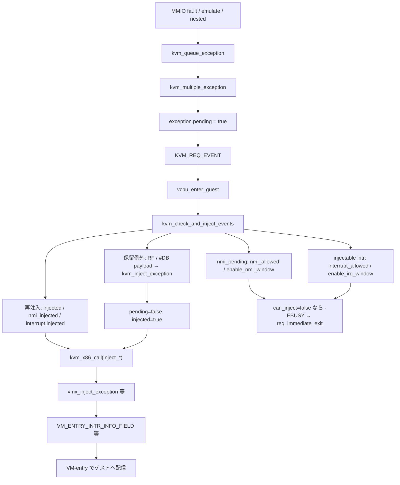

# 第12章 レジスタ、MSR、cpuid、例外注入

> **本章で読むソース**
>
> - [`arch/x86/kvm/x86.c` L12052-L12086](https://github.com/gregkh/linux/blob/v6.18.38/arch/x86/kvm/x86.c#L12052-L12086)
> - [`arch/x86/kvm/x86.c` L12100-L12131](https://github.com/gregkh/linux/blob/v6.18.38/arch/x86/kvm/x86.c#L12100-L12131)
> - [`arch/x86/kvm/x86.c` L1851-L1948](https://github.com/gregkh/linux/blob/v6.18.38/arch/x86/kvm/x86.c#L1851-L1948)
> - [`arch/x86/kvm/x86.c` L1970-L2008](https://github.com/gregkh/linux/blob/v6.18.38/arch/x86/kvm/x86.c#L1970-L2008)
> - [`arch/x86/kvm/cpuid.c` L2025-L2093](https://github.com/gregkh/linux/blob/v6.18.38/arch/x86/kvm/cpuid.c#L2025-L2093)
> - [`arch/x86/kvm/cpuid.c` L2097-L2112](https://github.com/gregkh/linux/blob/v6.18.38/arch/x86/kvm/cpuid.c#L2097-L2112)
> - [`arch/x86/kvm/x86.c` L10739-L10840](https://github.com/gregkh/linux/blob/v6.18.38/arch/x86/kvm/x86.c#L10739-L10840)
> - [`arch/x86/kvm/x86.c` L10863-L10868](https://github.com/gregkh/linux/blob/v6.18.38/arch/x86/kvm/x86.c#L10863-L10868)
> - [`arch/x86/kvm/x86.c` L837-L900](https://github.com/gregkh/linux/blob/v6.18.38/arch/x86/kvm/x86.c#L837-L900)
> - [`arch/x86/kvm/x86.c` L10605-L10622](https://github.com/gregkh/linux/blob/v6.18.38/arch/x86/kvm/x86.c#L10605-L10622)
> - [`arch/x86/kvm/x86.c` L10663-L10709](https://github.com/gregkh/linux/blob/v6.18.38/arch/x86/kvm/x86.c#L10663-L10709)
> - [`arch/x86/kvm/vmx/vmx.c` L1787-L1830](https://github.com/gregkh/linux/blob/v6.18.38/arch/x86/kvm/vmx/vmx.c#L1787-L1830)
> - [`arch/x86/include/asm/kvm_host.h` L1756-L1757](https://github.com/gregkh/linux/blob/v6.18.38/arch/x86/include/asm/kvm_host.h#L1756-L1757)

## この章の狙い

x86 共通層がゲストの汎用レジスタ、MSR、cpuid、例外をどう扱うかを読む。
`kvm_arch_vcpu_ioctl_get_regs` と `set_regs` の経路、`__kvm_get_msr` と `__kvm_set_msr` が `kvm_x86_ops` へ委譲する仕組み、`kvm_emulate_cpuid` のエミュレーション、`kvm_queue_exception` から `kvm_x86_call(inject_exception)` までのイベント注入を押さえる。

## 前提

- [`struct kvm` / `kvm_vcpu` とアーキテクチャ ops](../part00-foundation/02-kvm-vcpu-arch-ops.md)
- [`KVM_RUN` と vCPU 実行ループ](../part01-kvm-core/05-kvm-run-execution-loop.md)

## 汎用レジスタ：`get_regs` と `set_regs`

userspace は `KVM_GET_REGS` と `KVM_SET_REGS` で汎用レジスタを読み書きする。
`__get_regs` は `kvm_rax_read` 等のヘルパで `vcpu->arch.regs` とアーキテクチャキャッシュを集約する。

[`arch/x86/kvm/x86.c` L12052-L12086](https://github.com/gregkh/linux/blob/v6.18.38/arch/x86/kvm/x86.c#L12052-L12086)

```c
static void __get_regs(struct kvm_vcpu *vcpu, struct kvm_regs *regs)
{
	if (vcpu->arch.emulate_regs_need_sync_to_vcpu) {
		/*
		 * We are here if userspace calls get_regs() in the middle of
		 * instruction emulation. Registers state needs to be copied
		 * back from emulation context to vcpu. Userspace shouldn't do
		 * that usually, but some bad designed PV devices (vmware
		 * backdoor interface) need this to work
		 */
		emulator_writeback_register_cache(vcpu->arch.emulate_ctxt);
		vcpu->arch.emulate_regs_need_sync_to_vcpu = false;
	}
	regs->rax = kvm_rax_read(vcpu);
	regs->rbx = kvm_rbx_read(vcpu);
	regs->rcx = kvm_rcx_read(vcpu);
	regs->rdx = kvm_rdx_read(vcpu);
	regs->rsi = kvm_rsi_read(vcpu);
	regs->rdi = kvm_rdi_read(vcpu);
	regs->rsp = kvm_rsp_read(vcpu);
	regs->rbp = kvm_rbp_read(vcpu);
#ifdef CONFIG_X86_64
	regs->r8 = kvm_r8_read(vcpu);
	regs->r9 = kvm_r9_read(vcpu);
	regs->r10 = kvm_r10_read(vcpu);
	regs->r11 = kvm_r11_read(vcpu);
	regs->r12 = kvm_r12_read(vcpu);
	regs->r13 = kvm_r13_read(vcpu);
	regs->r14 = kvm_r14_read(vcpu);
	regs->r15 = kvm_r15_read(vcpu);
#endif

	regs->rip = kvm_rip_read(vcpu);
	regs->rflags = kvm_get_rflags(vcpu);
}
```

`__set_regs` は逆方向に書き込み、保留中の例外をクリアして `KVM_REQ_EVENT` を立てる。
命令エミュレーション中に userspace がレジスタを触った場合の同期フラグが、get と set の両方に存在する。

[`arch/x86/kvm/x86.c` L12100-L12131](https://github.com/gregkh/linux/blob/v6.18.38/arch/x86/kvm/x86.c#L12100-L12131)

```c
static void __set_regs(struct kvm_vcpu *vcpu, struct kvm_regs *regs)
{
	vcpu->arch.emulate_regs_need_sync_from_vcpu = true;
	vcpu->arch.emulate_regs_need_sync_to_vcpu = false;

	kvm_rax_write(vcpu, regs->rax);
	kvm_rbx_write(vcpu, regs->rbx);
	kvm_rcx_write(vcpu, regs->rcx);
	kvm_rdx_write(vcpu, regs->rdx);
	kvm_rsi_write(vcpu, regs->rsi);
	kvm_rdi_write(vcpu, regs->rdi);
	kvm_rsp_write(vcpu, regs->rsp);
	kvm_rbp_write(vcpu, regs->rbp);
#ifdef CONFIG_X86_64
	kvm_r8_write(vcpu, regs->r8);
	kvm_r9_write(vcpu, regs->r9);
	kvm_r10_write(vcpu, regs->r10);
	kvm_r11_write(vcpu, regs->r11);
	kvm_r12_write(vcpu, regs->r12);
	kvm_r13_write(vcpu, regs->r13);
	kvm_r14_write(vcpu, regs->r14);
	kvm_r15_write(vcpu, regs->r15);
#endif

	kvm_rip_write(vcpu, regs->rip);
	kvm_set_rflags(vcpu, regs->rflags | X86_EFLAGS_FIXED);

	vcpu->arch.exception.pending = false;
	vcpu->arch.exception_vmexit.pending = false;

	kvm_make_request(KVM_REQ_EVENT, vcpu);
}
```

## MSR 読み書き：`__kvm_set_msr` と `__kvm_get_msr`

ゲストの RDMSR と WRMSR は `__kvm_emulate_msr_read` と `__kvm_emulate_msr_write` から入る。
共通層は index ごとの事前検証を行い、実処理は `kvm_x86_call(set_msr)` と `kvm_x86_call(get_msr)` へ委譲する。

[`arch/x86/kvm/x86.c` L1851-L1948](https://github.com/gregkh/linux/blob/v6.18.38/arch/x86/kvm/x86.c#L1851-L1948)

```c
static int __kvm_set_msr(struct kvm_vcpu *vcpu, u32 index, u64 data,
			 bool host_initiated)
{
	struct msr_data msr;

	switch (index) {
	case MSR_FS_BASE:
	case MSR_GS_BASE:
	case MSR_KERNEL_GS_BASE:
	case MSR_CSTAR:
	case MSR_LSTAR:
		if (is_noncanonical_msr_address(data, vcpu))
			return 1;
		break;
	case MSR_IA32_SYSENTER_EIP:
	case MSR_IA32_SYSENTER_ESP:
		/*
		 * IA32_SYSENTER_ESP and IA32_SYSENTER_EIP cause #GP if
		 * non-canonical address is written on Intel but not on
		 * AMD (which ignores the top 32-bits, because it does
		 * not implement 64-bit SYSENTER).
		 *
		 * 64-bit code should hence be able to write a non-canonical
		 * value on AMD.  Making the address canonical ensures that
		 * vmentry does not fail on Intel after writing a non-canonical
		 * value, and that something deterministic happens if the guest
		 * invokes 64-bit SYSENTER.
		 */
		data = __canonical_address(data, max_host_virt_addr_bits());
		break;
	case MSR_TSC_AUX:
		if (!kvm_is_supported_user_return_msr(MSR_TSC_AUX))
			return 1;

		if (!host_initiated &&
		    !guest_cpu_cap_has(vcpu, X86_FEATURE_RDTSCP) &&
		    !guest_cpu_cap_has(vcpu, X86_FEATURE_RDPID))
			return 1;

		/*
		 * Per Intel's SDM, bits 63:32 are reserved, but AMD's APM has
		 * incomplete and conflicting architectural behavior.  Current
		 * AMD CPUs completely ignore bits 63:32, i.e. they aren't
		 * reserved and always read as zeros.  Enforce Intel's reserved
		 * bits check if the guest CPU is Intel compatible, otherwise
		 * clear the bits.  This ensures cross-vendor migration will
		 * provide consistent behavior for the guest.
		 */
		if (guest_cpuid_is_intel_compatible(vcpu) && (data >> 32) != 0)
			return 1;

		data = (u32)data;
		break;
	case MSR_IA32_U_CET:
	case MSR_IA32_S_CET:
		if (!guest_cpu_cap_has(vcpu, X86_FEATURE_SHSTK) &&
		    !guest_cpu_cap_has(vcpu, X86_FEATURE_IBT))
			return KVM_MSR_RET_UNSUPPORTED;
		if (!kvm_is_valid_u_s_cet(vcpu, data))
			return 1;
		break;
	case MSR_KVM_INTERNAL_GUEST_SSP:
		if (!host_initiated)
			return 1;
		fallthrough;
		/*
		 * Note that the MSR emulation here is flawed when a vCPU
		 * doesn't support the Intel 64 architecture. The expected
		 * architectural behavior in this case is that the upper 32
		 * bits do not exist and should always read '0'. However,
		 * because the actual hardware on which the virtual CPU is
		 * running does support Intel 64, XRSTORS/XSAVES in the
		 * guest could observe behavior that violates the
		 * architecture. Intercepting XRSTORS/XSAVES for this
		 * special case isn't deemed worthwhile.
		 */
	case MSR_IA32_PL0_SSP ... MSR_IA32_INT_SSP_TAB:
		if (!guest_cpu_cap_has(vcpu, X86_FEATURE_SHSTK))
			return KVM_MSR_RET_UNSUPPORTED;
		/*
		 * MSR_IA32_INT_SSP_TAB is not present on processors that do
		 * not support Intel 64 architecture.
		 */
		if (index == MSR_IA32_INT_SSP_TAB && !guest_cpu_cap_has(vcpu, X86_FEATURE_LM))
			return KVM_MSR_RET_UNSUPPORTED;
		if (is_noncanonical_msr_address(data, vcpu))
			return 1;
		/* All SSP MSRs except MSR_IA32_INT_SSP_TAB must be 4-byte aligned */
		if (index != MSR_IA32_INT_SSP_TAB && !IS_ALIGNED(data, 4))
			return 1;
		break;
	}

	msr.data = data;
	msr.index = index;
	msr.host_initiated = host_initiated;

	return kvm_x86_call(set_msr)(vcpu, &msr);
}
```

読み取り側も同様に共通検証のあと `kvm_x86_call(get_msr)` を呼ぶ。
VMX 側の `vmx_get_msr` は `kvm_get_msr_common` をフォールバックとして使い、ハードウェア自動ロード MSR とエミュレート MSR を分ける。

[`arch/x86/kvm/x86.c` L1970-L2008](https://github.com/gregkh/linux/blob/v6.18.38/arch/x86/kvm/x86.c#L1970-L2008)

```c
static int __kvm_get_msr(struct kvm_vcpu *vcpu, u32 index, u64 *data,
			 bool host_initiated)
{
	struct msr_data msr;
	int ret;

	switch (index) {
	case MSR_TSC_AUX:
		if (!kvm_is_supported_user_return_msr(MSR_TSC_AUX))
			return 1;

		if (!host_initiated &&
		    !guest_cpu_cap_has(vcpu, X86_FEATURE_RDTSCP) &&
		    !guest_cpu_cap_has(vcpu, X86_FEATURE_RDPID))
			return 1;
		break;
	case MSR_IA32_U_CET:
	case MSR_IA32_S_CET:
		if (!guest_cpu_cap_has(vcpu, X86_FEATURE_SHSTK) &&
		    !guest_cpu_cap_has(vcpu, X86_FEATURE_IBT))
			return KVM_MSR_RET_UNSUPPORTED;
		break;
	case MSR_KVM_INTERNAL_GUEST_SSP:
		if (!host_initiated)
			return 1;
		fallthrough;
	case MSR_IA32_PL0_SSP ... MSR_IA32_INT_SSP_TAB:
		if (!guest_cpu_cap_has(vcpu, X86_FEATURE_SHSTK))
			return KVM_MSR_RET_UNSUPPORTED;
		break;
	}

	msr.index = index;
	msr.host_initiated = host_initiated;

	ret = kvm_x86_call(get_msr)(vcpu, &msr);
	if (!ret)
		*data = msr.data;
	return ret;
}
```

`kvm_x86_ops` の `get_msr` と `set_msr` は第2章で述べた `static_call` 経由のフックである。
`kvm_get_msr_common` と `kvm_set_msr_common` は TSC や CET などアーキテクチャ横断の MSR を集約し、各ハイパーバイザ実装の共通フォールバックになる。

## cpuid エミュレーション：`kvm_emulate_cpuid`

VM-exit や命令エミュレーションで CPUID が実行されると `kvm_emulate_cpuid` が呼ばれる。
レジスタから leaf と subleaf を読み、`kvm_cpuid` で userspace が設定したテーブルを参照し、結果をレジスタへ書き戻して RIP を進める。

[`arch/x86/kvm/cpuid.c` L2097-L2112](https://github.com/gregkh/linux/blob/v6.18.38/arch/x86/kvm/cpuid.c#L2097-L2112)

```c
int kvm_emulate_cpuid(struct kvm_vcpu *vcpu)
{
	u32 eax, ebx, ecx, edx;

	if (cpuid_fault_enabled(vcpu) && !kvm_require_cpl(vcpu, 0))
		return 1;

	eax = kvm_rax_read(vcpu);
	ecx = kvm_rcx_read(vcpu);
	kvm_cpuid(vcpu, &eax, &ebx, &ecx, &edx, false);
	kvm_rax_write(vcpu, eax);
	kvm_rbx_write(vcpu, ebx);
	kvm_rcx_write(vcpu, ecx);
	kvm_rdx_write(vcpu, edx);
	return kvm_skip_emulated_instruction(vcpu);
}
```

`cpuid_fault_enabled` 時は CPL0 以外の CPUID 実行を拒否する。

## cpuid 本体：`kvm_cpuid`

`kvm_cpuid` は userspace が `KVM_SET_CPUID2` で設定した `kvm_cpuid_entry2` テーブルを検索し、レジスタへ返す値を決める。
動的ビットが汚れていれば `kvm_update_cpuid_runtime` で再計算し、`kvm_find_cpuid_entry_index` で leaf と subleaf に一致するエントリを探す。
一致がなければ `get_out_of_range_cpuid_entry` で最大 leaf 以降の挙動をエミュレートする。

[`arch/x86/kvm/cpuid.c` L2025-L2093](https://github.com/gregkh/linux/blob/v6.18.38/arch/x86/kvm/cpuid.c#L2025-L2093)

```c
bool kvm_cpuid(struct kvm_vcpu *vcpu, u32 *eax, u32 *ebx,
	       u32 *ecx, u32 *edx, bool exact_only)
{
	u32 orig_function = *eax, function = *eax, index = *ecx;
	struct kvm_cpuid_entry2 *entry;
	bool exact, used_max_basic = false;

	if (vcpu->arch.cpuid_dynamic_bits_dirty)
		kvm_update_cpuid_runtime(vcpu);

	entry = kvm_find_cpuid_entry_index(vcpu, function, index);
	exact = !!entry;

	if (!entry && !exact_only) {
		entry = get_out_of_range_cpuid_entry(vcpu, &function, index);
		used_max_basic = !!entry;
	}

	if (entry) {
		*eax = entry->eax;
		*ebx = entry->ebx;
		*ecx = entry->ecx;
		*edx = entry->edx;
		if (function == 7 && index == 0) {
			u64 data;
			if ((*ebx & (feature_bit(RTM) | feature_bit(HLE))) &&
			    !kvm_msr_read(vcpu, MSR_IA32_TSX_CTRL, &data) &&
			    (data & TSX_CTRL_CPUID_CLEAR))
				*ebx &= ~(feature_bit(RTM) | feature_bit(HLE));
		} else if (function == 0x80000007) {
			if (kvm_hv_invtsc_suppressed(vcpu))
				*edx &= ~feature_bit(CONSTANT_TSC);
		} else if (IS_ENABLED(CONFIG_KVM_XEN) &&
			   kvm_xen_is_tsc_leaf(vcpu, function)) {
			/*
			 * Update guest TSC frequency information if necessary.
			 * Ignore failures, there is no sane value that can be
			 * provided if KVM can't get the TSC frequency.
			 */
			if (kvm_check_request(KVM_REQ_CLOCK_UPDATE, vcpu))
				kvm_guest_time_update(vcpu);

			if (index == 1) {
				*ecx = vcpu->arch.pvclock_tsc_mul;
				*edx = vcpu->arch.pvclock_tsc_shift;
			} else if (index == 2) {
				*eax = vcpu->arch.hw_tsc_khz;
			}
		}
	} else {
		*eax = *ebx = *ecx = *edx = 0;
		/*
		 * When leaf 0BH or 1FH is defined, CL is pass-through
		 * and EDX is always the x2APIC ID, even for undefined
		 * subleaves. Index 1 will exist iff the leaf is
		 * implemented, so we pass through CL iff leaf 1
		 * exists. EDX can be copied from any existing index.
		 */
		if (function == 0xb || function == 0x1f) {
			entry = kvm_find_cpuid_entry_index(vcpu, function, 1);
			if (entry) {
				*ecx = index & 0xff;
				*edx = entry->edx;
			}
		}
	}
	trace_kvm_cpuid(orig_function, index, *eax, *ebx, *ecx, *edx, exact,
			used_max_basic);
	return exact;
}
```

`exact_only` が真のときはテーブルに無い leaf を out-of-range 扱いせずゼロを返す。
leaf 7 は TSX_CTRL MSR で RTM と HLE ビットを動的に落とし、0x80000007 は Hyper-V の invtsc 抑制で CONSTANT_TSC を隠す。

## 例外のキューイング：`kvm_queue_exception`

KVM はハードウェア注入の前段で `vcpu->arch.exception` に例外を積む。
`kvm_queue_exception` は `kvm_multiple_exception` を経由し、ネスト時の VM-exit 変換や二重例外からの `#DF` 合成を扱う。

[`arch/x86/kvm/x86.c` L837-L900](https://github.com/gregkh/linux/blob/v6.18.38/arch/x86/kvm/x86.c#L837-L900)

```c
static void kvm_multiple_exception(struct kvm_vcpu *vcpu, unsigned int nr,
				   bool has_error, u32 error_code,
				   bool has_payload, unsigned long payload)
{
	u32 prev_nr;
	int class1, class2;

	kvm_make_request(KVM_REQ_EVENT, vcpu);

	/*
	 * If the exception is destined for L2, morph it to a VM-Exit if L1
	 * wants to intercept the exception.
	 */
	if (is_guest_mode(vcpu) &&
	    kvm_x86_ops.nested_ops->is_exception_vmexit(vcpu, nr, error_code)) {
		kvm_queue_exception_vmexit(vcpu, nr, has_error, error_code,
					   has_payload, payload);
		return;
	}

	if (!vcpu->arch.exception.pending && !vcpu->arch.exception.injected) {
	queue:
		vcpu->arch.exception.pending = true;
		vcpu->arch.exception.injected = false;

		vcpu->arch.exception.has_error_code = has_error;
		vcpu->arch.exception.vector = nr;
		vcpu->arch.exception.error_code = error_code;
		vcpu->arch.exception.has_payload = has_payload;
		vcpu->arch.exception.payload = payload;
		return;
	}

	/* to check exception */
	prev_nr = vcpu->arch.exception.vector;
	if (prev_nr == DF_VECTOR) {
		/* triple fault -> shutdown */
		kvm_make_request(KVM_REQ_TRIPLE_FAULT, vcpu);
		return;
	}
	class1 = exception_class(prev_nr);
	class2 = exception_class(nr);
	if ((class1 == EXCPT_CONTRIBUTORY && class2 == EXCPT_CONTRIBUTORY) ||
	    (class1 == EXCPT_PF && class2 != EXCPT_BENIGN)) {
		/*
		 * Synthesize #DF.  Clear the previously injected or pending
		 * exception so as not to incorrectly trigger shutdown.
		 */
		vcpu->arch.exception.injected = false;
		vcpu->arch.exception.pending = false;

		kvm_queue_exception_e(vcpu, DF_VECTOR, 0);
	} else {
		/* replace previous exception with a new one in a hope
		   that instruction re-execution will regenerate lost
		   exception */
		goto queue;
	}
}

void kvm_queue_exception(struct kvm_vcpu *vcpu, unsigned nr)
{
	kvm_multiple_exception(vcpu, nr, false, 0, false, 0);
}
```

`kvm_queue_exception_e` と `kvm_queue_exception_p` はエラーコード付きと payload 付きの変種である。
命令エミュレーション失敗時や MMU フォールト処理から広く呼ばれ、共通 API として x86 全体で共有される。

## イベント注入：`kvm_check_and_inject_events` と `kvm_x86_ops`

VM-entry 直前に `kvm_check_and_inject_events` が優先度順にイベントを処理する。
前半は再注入済み例外、保留例外、NMI、割り込みの再注入を扱う。
`kvm_is_exception_pending` が真のときは前半では何もせず、後半の新規イベント処理へ委ねる。

[`arch/x86/kvm/x86.c` L10605-L10622](https://github.com/gregkh/linux/blob/v6.18.38/arch/x86/kvm/x86.c#L10605-L10622)

```c
static void kvm_inject_exception(struct kvm_vcpu *vcpu)
{
	/*
	 * Suppress the error code if the vCPU is in Real Mode, as Real Mode
	 * exceptions don't report error codes.  The presence of an error code
	 * is carried with the exception and only stripped when the exception
	 * is injected as intercepted #PF VM-Exits for AMD's Paged Real Mode do
	 * report an error code despite the CPU being in Real Mode.
	 */
	vcpu->arch.exception.has_error_code &= is_protmode(vcpu);

	trace_kvm_inj_exception(vcpu->arch.exception.vector,
				vcpu->arch.exception.has_error_code,
				vcpu->arch.exception.error_code,
				vcpu->arch.exception.injected);

	kvm_x86_call(inject_exception)(vcpu);
}
```

[`arch/x86/kvm/x86.c` L10663-L10709](https://github.com/gregkh/linux/blob/v6.18.38/arch/x86/kvm/x86.c#L10663-L10709)

```c
static int kvm_check_and_inject_events(struct kvm_vcpu *vcpu,
				       bool *req_immediate_exit)
{
	bool can_inject;
	int r;

	/*
	 * Process nested events first, as nested VM-Exit supersedes event
	 * re-injection.  If there's an event queued for re-injection, it will
	 * be saved into the appropriate vmc{b,s}12 fields on nested VM-Exit.
	 */
	if (is_guest_mode(vcpu))
		r = kvm_check_nested_events(vcpu);
	else
		r = 0;

	/*
	 * Re-inject exceptions and events *especially* if immediate entry+exit
	 * to/from L2 is needed, as any event that has already been injected
	 * into L2 needs to complete its lifecycle before injecting a new event.
	 *
	 * Don't re-inject an NMI or interrupt if there is a pending exception.
	 * This collision arises if an exception occurred while vectoring the
	 * injected event, KVM intercepted said exception, and KVM ultimately
	 * determined the fault belongs to the guest and queues the exception
	 * for injection back into the guest.
	 *
	 * "Injected" interrupts can also collide with pending exceptions if
	 * userspace ignores the "ready for injection" flag and blindly queues
	 * an interrupt.  In that case, prioritizing the exception is correct,
	 * as the exception "occurred" before the exit to userspace.  Trap-like
	 * exceptions, e.g. most #DBs, have higher priority than interrupts.
	 * And while fault-like exceptions, e.g. #GP and #PF, are the lowest
	 * priority, they're only generated (pended) during instruction
	 * execution, and interrupts are recognized at instruction boundaries.
	 * Thus a pending fault-like exception means the fault occurred on the
	 * *previous* instruction and must be serviced prior to recognizing any
	 * new events in order to fully complete the previous instruction.
	 */
	if (vcpu->arch.exception.injected)
		kvm_inject_exception(vcpu);
	else if (kvm_is_exception_pending(vcpu))
		; /* see above */
	else if (vcpu->arch.nmi_injected)
		kvm_x86_call(inject_nmi)(vcpu);
	else if (vcpu->arch.interrupt.injected)
		kvm_x86_call(inject_irq)(vcpu, true);
```

後半では `can_inject = !kvm_event_needs_reinjection(vcpu)` で新規イベント可否を決める。
保留例外は fault 系なら RFLAGS.RF を立て、#DB なら payload 配信と DR7.GD クリアのあと `kvm_inject_exception` し、`pending=false` と `injected=true` に更新する。
NMI と IRQ は `can_inject` が真のときだけ `nmi_allowed` と `interrupt_allowed` を呼び、偽ならフックを呼ばず KVM 側で `r = -EBUSY` とする。
不可なら `enable_nmi_window` と `enable_irq_window` で window-open exit を仕掛ける。
`out` ラベルで `r == -EBUSY` を検出すると `req_immediate_exit = true` に変換し、即時再退出を要求する。

[`arch/x86/kvm/x86.c` L10739-L10840](https://github.com/gregkh/linux/blob/v6.18.38/arch/x86/kvm/x86.c#L10739-L10840)

```c
	can_inject = !kvm_event_needs_reinjection(vcpu);

	if (vcpu->arch.exception.pending) {
		/*
		 * Fault-class exceptions, except #DBs, set RF=1 in the RFLAGS
		 * value pushed on the stack.  Trap-like exception and all #DBs
		 * leave RF as-is (KVM follows Intel's behavior in this regard;
		 * AMD states that code breakpoint #DBs excplitly clear RF=0).
		 *
		 * Note, most versions of Intel's SDM and AMD's APM incorrectly
		 * describe the behavior of General Detect #DBs, which are
		 * fault-like.  They do _not_ set RF, a la code breakpoints.
		 */
		if (exception_type(vcpu->arch.exception.vector) == EXCPT_FAULT)
			__kvm_set_rflags(vcpu, kvm_get_rflags(vcpu) |
					     X86_EFLAGS_RF);

		if (vcpu->arch.exception.vector == DB_VECTOR) {
			kvm_deliver_exception_payload(vcpu, &vcpu->arch.exception);
			if (vcpu->arch.dr7 & DR7_GD) {
				vcpu->arch.dr7 &= ~DR7_GD;
				kvm_update_dr7(vcpu);
			}
		}

		kvm_inject_exception(vcpu);

		vcpu->arch.exception.pending = false;
		vcpu->arch.exception.injected = true;

		can_inject = false;
	}

	/* Don't inject interrupts if the user asked to avoid doing so */
	if (vcpu->guest_debug & KVM_GUESTDBG_BLOCKIRQ)
		return 0;

	/*
	 * Finally, inject interrupt events.  If an event cannot be injected
	 * due to architectural conditions (e.g. IF=0) a window-open exit
	 * will re-request KVM_REQ_EVENT.  Sometimes however an event is pending
	 * and can architecturally be injected, but we cannot do it right now:
	 * an interrupt could have arrived just now and we have to inject it
	 * as a vmexit, or there could already an event in the queue, which is
	 * indicated by can_inject.  In that case we request an immediate exit
	 * in order to make progress and get back here for another iteration.
	 * The kvm_x86_ops hooks communicate this by returning -EBUSY.
	 */
#ifdef CONFIG_KVM_SMM
	if (vcpu->arch.smi_pending) {
		r = can_inject ? kvm_x86_call(smi_allowed)(vcpu, true) :
				 -EBUSY;
		if (r < 0)
			goto out;
		if (r) {
			vcpu->arch.smi_pending = false;
			++vcpu->arch.smi_count;
			enter_smm(vcpu);
			can_inject = false;
		} else
			kvm_x86_call(enable_smi_window)(vcpu);
	}
#endif

	if (vcpu->arch.nmi_pending) {
		r = can_inject ? kvm_x86_call(nmi_allowed)(vcpu, true) :
				 -EBUSY;
		if (r < 0)
			goto out;
		if (r) {
			--vcpu->arch.nmi_pending;
			vcpu->arch.nmi_injected = true;
			kvm_x86_call(inject_nmi)(vcpu);
			can_inject = false;
			WARN_ON(kvm_x86_call(nmi_allowed)(vcpu, true) < 0);
		}
		if (vcpu->arch.nmi_pending)
			kvm_x86_call(enable_nmi_window)(vcpu);
	}

	if (kvm_cpu_has_injectable_intr(vcpu)) {
		r = can_inject ? kvm_x86_call(interrupt_allowed)(vcpu, true) :
				 -EBUSY;
		if (r < 0)
			goto out;
		if (r) {
			int irq = kvm_cpu_get_interrupt(vcpu);

			if (!WARN_ON_ONCE(irq == -1)) {
				kvm_queue_interrupt(vcpu, irq, false);
				kvm_x86_call(inject_irq)(vcpu, false);
				WARN_ON(kvm_x86_call(interrupt_allowed)(vcpu, true) < 0);
			}
		}
		if (kvm_cpu_has_injectable_intr(vcpu))
			kvm_x86_call(enable_irq_window)(vcpu);
	}
```

`-EBUSY` は `out` ラベルで `req_immediate_exit = true` に変換され、呼び出し元は 0 を受け取る。

[`arch/x86/kvm/x86.c` L10863-L10868](https://github.com/gregkh/linux/blob/v6.18.38/arch/x86/kvm/x86.c#L10863-L10868)

```c
out:
	if (r == -EBUSY) {
		*req_immediate_exit = true;
		r = 0;
	}
	return r;
```

Intel VMX では `vmx_inject_exception` が VMCS の `VM_ENTRY_INTR_INFO_FIELD` 等を設定する。
実モードゲストは `kvm_inject_realmode_interrupt` 経路に分岐する。

[`arch/x86/kvm/vmx/vmx.c` L1787-L1830](https://github.com/gregkh/linux/blob/v6.18.38/arch/x86/kvm/vmx/vmx.c#L1787-L1830)

```c
void vmx_inject_exception(struct kvm_vcpu *vcpu)
{
	struct kvm_queued_exception *ex = &vcpu->arch.exception;
	u32 intr_info = ex->vector | INTR_INFO_VALID_MASK;
	struct vcpu_vmx *vmx = to_vmx(vcpu);

	kvm_deliver_exception_payload(vcpu, ex);

	if (ex->has_error_code) {
		/*
		 * Despite the error code being architecturally defined as 32
		 * bits, and the VMCS field being 32 bits, Intel CPUs and thus
		 * VMX don't actually supporting setting bits 31:16.  Hardware
		 * will (should) never provide a bogus error code, but AMD CPUs
		 * do generate error codes with bits 31:16 set, and so KVM's
		 * ABI lets userspace shove in arbitrary 32-bit values.  Drop
		 * the upper bits to avoid VM-Fail, losing information that
		 * doesn't really exist is preferable to killing the VM.
		 */
		vmcs_write32(VM_ENTRY_EXCEPTION_ERROR_CODE, (u16)ex->error_code);
		intr_info |= INTR_INFO_DELIVER_CODE_MASK;
	}

	if (vmx->rmode.vm86_active) {
		int inc_eip = 0;
		if (kvm_exception_is_soft(ex->vector))
			inc_eip = vcpu->arch.event_exit_inst_len;
		kvm_inject_realmode_interrupt(vcpu, ex->vector, inc_eip);
		return;
	}

	WARN_ON_ONCE(vmx->vt.emulation_required);

	if (kvm_exception_is_soft(ex->vector)) {
		vmcs_write32(VM_ENTRY_INSTRUCTION_LEN,
			     vmx->vcpu.arch.event_exit_inst_len);
		intr_info |= INTR_TYPE_SOFT_EXCEPTION;
	} else
		intr_info |= INTR_TYPE_HARD_EXCEPTION;

	vmcs_write32(VM_ENTRY_INTR_INFO_FIELD, intr_info);

	vmx_clear_hlt(vcpu);
}
```

## 処理の流れ：例外キューから VM-entry 注入まで



## 高速化と最適化の工夫

MSR のうち頻出するものは VMX の MSR bitmap と auto-load 機構でハードウェア透過させ、ソフトウェアエミュレーションを避ける。
`kvm_x86_call` による `static_call` 間接呼び出しは、実行時に VMX と SVM の分岐コストを削る。
例外はいったん `vcpu->arch.exception` に積み、VM-entry 直前にまとめて注入することで、エミュレーション中の再入と優先度判定を一箇所に集約する。
cpuid は leaf ごとのテーブル参照に留め、毎回ホスト CPUID を実行しない。

## まとめ

汎用レジスタは `__get_regs` と `__set_regs` が `kvm_register_*` ヘルパで集約し、エミュレーション中は同期フラグで整合を保つ。
MSR は `__kvm_get_msr` と `__kvm_set_msr` が共通検証のあと `kvm_x86_ops` の get_msr と set_msr へ委譲する。
cpuid は `kvm_emulate_cpuid` が `kvm_cpuid` でテーブル参照し、動的ビットと out-of-range 処理を含めてゲスト可視 CPU 機能を制御する。
例外は `kvm_queue_exception` でキューし、`kvm_check_and_inject_events` が再注入と新規注入を分け、`kvm_x86_call(inject_exception)` 経由で VMCS へ書き込まれる。
NMI と IRQ は allowed 判定と window exit、`-EBUSY` による即時再退出で注入タイミングを調整する。

## 関連する章

- [`struct kvm` / `kvm_vcpu` とアーキテクチャ ops](../part00-foundation/02-kvm-vcpu-arch-ops.md)
- [命令エミュレーション（`emulate.c`）](13-instruction-emulation.md)
- [VMX 有効化と VMCS の構築](../part05-vmx/14-vmx-enable-vmcs.md)
