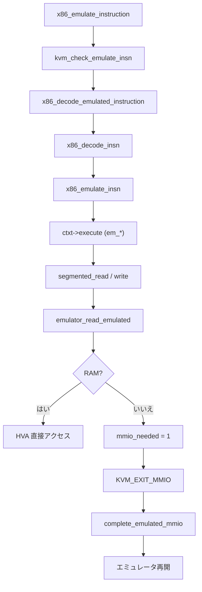

# 第13章 命令エミュレーション（`emulate.c`）

> **本章で読むソース**
>
> - [`arch/x86/kvm/x86.c` L9432-L9500](https://github.com/gregkh/linux/blob/v6.18.38/arch/x86/kvm/x86.c#L9432-L9500)
> - [`arch/x86/kvm/x86.c` L9553-L9615](https://github.com/gregkh/linux/blob/v6.18.38/arch/x86/kvm/x86.c#L9553-L9615)
> - [`arch/x86/kvm/emulate.c` L4758-L4810](https://github.com/gregkh/linux/blob/v6.18.38/arch/x86/kvm/emulate.c#L4758-L4810)
> - [`arch/x86/kvm/emulate.c` L5151-L5230](https://github.com/gregkh/linux/blob/v6.18.38/arch/x86/kvm/emulate.c#L5151-L5230)
> - [`arch/x86/kvm/emulate.c` L5269-L5302](https://github.com/gregkh/linux/blob/v6.18.38/arch/x86/kvm/emulate.c#L5269-L5302)
> - [`arch/x86/kvm/emulate.c` L1297-L1348](https://github.com/gregkh/linux/blob/v6.18.38/arch/x86/kvm/emulate.c#L1297-L1348)
> - [`arch/x86/kvm/x86.c` L8324-L8342](https://github.com/gregkh/linux/blob/v6.18.38/arch/x86/kvm/x86.c#L8324-L8342)
> - [`arch/x86/kvm/x86.c` L11840-L11885](https://github.com/gregkh/linux/blob/v6.18.38/arch/x86/kvm/x86.c#L11840-L11885)

## この章の狙い

ゲスト命令をソフトウェアで実行する `x86_emulate_instruction` の全体像を読む。
`x86_decode_insn` によるデコード、`x86_emulate_insn` の executor ディスパッチ、MMIO と PIO へのフォールバック、userspace 完了コールバックまでの流れを押さえる。

## 前提

- [レジスタ、MSR、cpuid、例外注入](12-regs-msr-cpuid-exceptions.md)
- [SPTE とゲスト page fault 処理](../part03-x86-mmu/10-spte-page-fault.md)
- [`KVM_RUN` と vCPU 実行ループ](../part01-kvm-core/05-kvm-run-execution-loop.md)

## 入口：`x86_emulate_instruction`

MMIO 未マップ、保護違反、一部の VM-exit は `x86_emulate_instruction` に集約される。
デコードフェーズと実行フェーズに分かれ、`EMULTYPE_*` フラグでリトライやスキップ挙動を制御する。

[`arch/x86/kvm/x86.c` L9432-L9500](https://github.com/gregkh/linux/blob/v6.18.38/arch/x86/kvm/x86.c#L9432-L9500)

```c
int x86_emulate_instruction(struct kvm_vcpu *vcpu, gpa_t cr2_or_gpa,
			    int emulation_type, void *insn, int insn_len)
{
	int r;
	struct x86_emulate_ctxt *ctxt = vcpu->arch.emulate_ctxt;
	bool writeback = true;

	if ((emulation_type & EMULTYPE_ALLOW_RETRY_PF) &&
	    (WARN_ON_ONCE(is_guest_mode(vcpu)) ||
	     WARN_ON_ONCE(!(emulation_type & EMULTYPE_PF))))
		emulation_type &= ~EMULTYPE_ALLOW_RETRY_PF;

	r = kvm_check_emulate_insn(vcpu, emulation_type, insn, insn_len);
	if (r != X86EMUL_CONTINUE) {
		if (r == X86EMUL_RETRY_INSTR || r == X86EMUL_PROPAGATE_FAULT)
			return 1;

		if (kvm_unprotect_and_retry_on_failure(vcpu, cr2_or_gpa,
						       emulation_type))
			return 1;

		if (r == X86EMUL_UNHANDLEABLE_VECTORING) {
			kvm_prepare_event_vectoring_exit(vcpu, cr2_or_gpa);
			return 0;
		}

		WARN_ON_ONCE(r != X86EMUL_UNHANDLEABLE);
		return handle_emulation_failure(vcpu, emulation_type);
	}

	vcpu->arch.l1tf_flush_l1d = true;

	if (!(emulation_type & EMULTYPE_NO_DECODE)) {
		kvm_clear_exception_queue(vcpu);

		/*
		 * Return immediately if RIP hits a code breakpoint, such #DBs
		 * are fault-like and are higher priority than any faults on
		 * the code fetch itself.
		 */
		if (kvm_vcpu_check_code_breakpoint(vcpu, emulation_type, &r))
			return r;

		r = x86_decode_emulated_instruction(vcpu, emulation_type,
						    insn, insn_len);
		if (r != EMULATION_OK)  {
			if ((emulation_type & EMULTYPE_TRAP_UD) ||
			    (emulation_type & EMULTYPE_TRAP_UD_FORCED)) {
				kvm_queue_exception(vcpu, UD_VECTOR);
				return 1;
			}
			if (kvm_unprotect_and_retry_on_failure(vcpu, cr2_or_gpa,
							       emulation_type))
				return 1;

			if (ctxt->have_exception &&
			    !(emulation_type & EMULTYPE_SKIP)) {
				/*
				 * #UD should result in just EMULATION_FAILED, and trap-like
				 * exception should not be encountered during decode.
				 */
				WARN_ON_ONCE(ctxt->exception.vector == UD_VECTOR ||
					     exception_type(ctxt->exception.vector) == EXCPT_TRAP);
				inject_emulated_exception(vcpu);
				return 1;
			}
			return handle_emulation_failure(vcpu, emulation_type);
		}
	}
```

デコード成功後は `x86_emulate_insn` を呼び、結果に応じて MMIO exit や例外注入を行う。
`EMULTYPE_PF` 時は faulting GPA を `ctxt->exception.address` に保存し、TDP では `ctxt->gpa_val` も設定する。

## 実行フェーズと MMIO フォールバック

`x86_emulate_insn` の戻り値で分岐し、MMIO が必要なら `vcpu->mmio_needed` を立てて userspace へ exit する。
PIO も同様に `vcpu->arch.pio` と `complete_emulated_pio` で非同期完了する。

[`arch/x86/kvm/x86.c` L9553-L9615](https://github.com/gregkh/linux/blob/v6.18.38/arch/x86/kvm/x86.c#L9553-L9615)

```c
restart:
	if (emulation_type & EMULTYPE_PF) {
		/* Save the faulting GPA (cr2) in the address field */
		ctxt->exception.address = cr2_or_gpa;

		/* With shadow page tables, cr2 contains a GVA or nGPA. */
		if (vcpu->arch.mmu->root_role.direct) {
			ctxt->gpa_available = true;
			ctxt->gpa_val = cr2_or_gpa;
		}
	} else {
		/* Sanitize the address out of an abundance of paranoia. */
		ctxt->exception.address = 0;
	}

	/*
	 * Check L1's instruction intercepts when emulating instructions for
	 * L2, unless KVM is re-emulating a previously decoded instruction,
	 * e.g. to complete userspace I/O, in which case KVM has already
	 * checked the intercepts.
	 */
	r = x86_emulate_insn(ctxt, is_guest_mode(vcpu) &&
				   !(emulation_type & EMULTYPE_NO_DECODE));

	if (r == EMULATION_INTERCEPTED)
		return 1;

	if (r == EMULATION_FAILED) {
		if (kvm_unprotect_and_retry_on_failure(vcpu, cr2_or_gpa,
						       emulation_type))
			return 1;

		return handle_emulation_failure(vcpu, emulation_type);
	}

	if (ctxt->have_exception) {
		WARN_ON_ONCE(vcpu->mmio_needed && !vcpu->mmio_is_write);
		vcpu->mmio_needed = false;
		r = 1;
		inject_emulated_exception(vcpu);
	} else if (vcpu->arch.pio.count) {
		if (!vcpu->arch.pio.in) {
			/* FIXME: return into emulator if single-stepping.  */
			vcpu->arch.pio.count = 0;
		} else {
			writeback = false;
			vcpu->arch.complete_userspace_io = complete_emulated_pio;
		}
		r = 0;
	} else if (vcpu->mmio_needed) {
		++vcpu->stat.mmio_exits;

		if (!vcpu->mmio_is_write)
			writeback = false;
		r = 0;
		vcpu->arch.complete_userspace_io = complete_emulated_mmio;
	} else if (vcpu->arch.complete_userspace_io) {
		writeback = false;
		r = 0;
	} else if (r == EMULATION_RESTART)
		goto restart;
	else
		r = 1;
```

MMIO read は userspace がデータを埋めたあと `complete_emulated_mmio` でエミュレータへ復帰する。
write はフラグメント単位で `KVM_EXIT_MMIO` を返し、デバイスモデルがバッキングメモリを更新する。

## デコード：`x86_decode_insn`

`emulate.c` のデコーダはプレフィックス解析、モード判定、オペコードテーブル参照で `ctxt->d` とオペランドを埋める。
`x86_decode_emulated_instruction` はゲストメモリから命令バイトを取得して本関数を呼ぶ。

[`arch/x86/kvm/emulate.c` L4758-L4810](https://github.com/gregkh/linux/blob/v6.18.38/arch/x86/kvm/emulate.c#L4758-L4810)

```c
int x86_decode_insn(struct x86_emulate_ctxt *ctxt, void *insn, int insn_len, int emulation_type)
{
	int rc = X86EMUL_CONTINUE;
	int mode = ctxt->mode;
	int def_op_bytes, def_ad_bytes, goffset, simd_prefix;
	bool op_prefix = false;
	bool has_seg_override = false;
	struct opcode opcode;
	u16 dummy;
	struct desc_struct desc;

	ctxt->memop.type = OP_NONE;
	ctxt->memopp = NULL;
	ctxt->_eip = ctxt->eip;
	ctxt->fetch.ptr = ctxt->fetch.data;
	ctxt->fetch.end = ctxt->fetch.data + insn_len;
	ctxt->opcode_len = 1;
	ctxt->intercept = x86_intercept_none;
	if (insn_len > 0)
		memcpy(ctxt->fetch.data, insn, insn_len);
	else {
		rc = __do_insn_fetch_bytes(ctxt, 1);
		if (rc != X86EMUL_CONTINUE)
			goto done;
	}

	switch (mode) {
	case X86EMUL_MODE_REAL:
	case X86EMUL_MODE_VM86:
		def_op_bytes = def_ad_bytes = 2;
		ctxt->ops->get_segment(ctxt, &dummy, &desc, NULL, VCPU_SREG_CS);
		if (desc.d)
			def_op_bytes = def_ad_bytes = 4;
		break;
	case X86EMUL_MODE_PROT16:
		def_op_bytes = def_ad_bytes = 2;
		break;
	case X86EMUL_MODE_PROT32:
		def_op_bytes = def_ad_bytes = 4;
		break;
#ifdef CONFIG_X86_64
	case X86EMUL_MODE_PROT64:
		def_op_bytes = 4;
		def_ad_bytes = 8;
		break;
#endif
	default:
		return EMULATION_FAILED;
	}

	ctxt->op_bytes = def_op_bytes;
	ctxt->ad_bytes = def_ad_bytes;
```

デコード結果は `ctxt->execute` に命令ハンドラ関数ポインタが設定される。
テーブル駆動により、新命令追加はハンドラとフラグ定義の追加で済む。

## 実行：`x86_emulate_insn` と executor

`x86_emulate_insn` は権限チェック、オペランド読み取り、`ctxt->execute` 呼び出し、writeback の順で進む。
LOCK プレフィックス、セグメントアクセス、特権命令はここで早期に `#UD` や `#GP` へ落とす。

[`arch/x86/kvm/emulate.c` L5151-L5230](https://github.com/gregkh/linux/blob/v6.18.38/arch/x86/kvm/emulate.c#L5151-L5230)

```c
int x86_emulate_insn(struct x86_emulate_ctxt *ctxt, bool check_intercepts)
{
	const struct x86_emulate_ops *ops = ctxt->ops;
	int rc = X86EMUL_CONTINUE;
	int saved_dst_type = ctxt->dst.type;

	ctxt->mem_read.pos = 0;

	/* LOCK prefix is allowed only with some instructions */
	if (ctxt->lock_prefix && (!(ctxt->d & Lock) || ctxt->dst.type != OP_MEM)) {
		rc = emulate_ud(ctxt);
		goto done;
	}

	if ((ctxt->d & SrcMask) == SrcMemFAddr && ctxt->src.type != OP_MEM) {
		rc = emulate_ud(ctxt);
		goto done;
	}

	if (unlikely(ctxt->d &
		     (No64|Undefined|Sse|Mmx|Intercept|CheckPerm|Priv|Prot|String))) {
		if ((ctxt->mode == X86EMUL_MODE_PROT64 && (ctxt->d & No64)) ||
				(ctxt->d & Undefined)) {
			rc = emulate_ud(ctxt);
			goto done;
		}

		if (((ctxt->d & (Sse|Mmx)) && ((ops->get_cr(ctxt, 0) & X86_CR0_EM)))
		    || ((ctxt->d & Sse) && !(ops->get_cr(ctxt, 4) & X86_CR4_OSFXSR))) {
			rc = emulate_ud(ctxt);
			goto done;
		}

		if ((ctxt->d & (Sse|Mmx)) && (ops->get_cr(ctxt, 0) & X86_CR0_TS)) {
			rc = emulate_nm(ctxt);
			goto done;
		}

		if (ctxt->d & Mmx) {
			rc = flush_pending_x87_faults(ctxt);
			if (rc != X86EMUL_CONTINUE)
				goto done;
			/*
			 * Now that we know the fpu is exception safe, we can fetch
			 * operands from it.
			 */
			fetch_possible_mmx_operand(&ctxt->src);
			fetch_possible_mmx_operand(&ctxt->src2);
			if (!(ctxt->d & Mov))
				fetch_possible_mmx_operand(&ctxt->dst);
		}

		if (unlikely(check_intercepts) && ctxt->intercept) {
			rc = emulator_check_intercept(ctxt, ctxt->intercept,
						      X86_ICPT_PRE_EXCEPT);
			if (rc != X86EMUL_CONTINUE)
				goto done;
		}

		/* Instruction can only be executed in protected mode */
		if ((ctxt->d & Prot) && ctxt->mode < X86EMUL_MODE_PROT16) {
			rc = emulate_ud(ctxt);
			goto done;
		}

		/* Privileged instruction can be executed only in CPL=0 */
		if ((ctxt->d & Priv) && ops->cpl(ctxt)) {
			if (ctxt->d & PrivUD)
				rc = emulate_ud(ctxt);
			else
				rc = emulate_gp(ctxt, 0);
			goto done;
		}

		/* Do instruction specific permission checks */
		if (ctxt->d & CheckPerm) {
			rc = ctxt->check_perm(ctxt);
			if (rc != X86EMUL_CONTINUE)
				goto done;
		}
```

オペランド取得後に `ctxt->execute(ctxt)` が呼ばれ、各 `em_*` ハンドラが実際の演算を行う。

[`arch/x86/kvm/emulate.c` L5269-L5302](https://github.com/gregkh/linux/blob/v6.18.38/arch/x86/kvm/emulate.c#L5269-L5302)

```c
	if ((ctxt->dst.type == OP_MEM) && !(ctxt->d & Mov)) {
		/* optimisation - avoid slow emulated read if Mov */
		rc = segmented_read(ctxt, ctxt->dst.addr.mem,
				   &ctxt->dst.val, ctxt->dst.bytes);
		if (rc != X86EMUL_CONTINUE) {
			if (!(ctxt->d & NoWrite) &&
			    rc == X86EMUL_PROPAGATE_FAULT &&
			    ctxt->exception.vector == PF_VECTOR)
				ctxt->exception.error_code |= PFERR_WRITE_MASK;
			goto done;
		}
	}
	/* Copy full 64-bit value for CMPXCHG8B.  */
	ctxt->dst.orig_val64 = ctxt->dst.val64;

special_insn:

	if (unlikely(check_intercepts) && (ctxt->d & Intercept)) {
		rc = emulator_check_intercept(ctxt, ctxt->intercept,
					      X86_ICPT_POST_MEMACCESS);
		if (rc != X86EMUL_CONTINUE)
			goto done;
	}

	if (ctxt->rep_prefix && (ctxt->d & String))
		ctxt->eflags |= X86_EFLAGS_RF;
	else
		ctxt->eflags &= ~X86_EFLAGS_RF;

	if (ctxt->execute) {
		rc = ctxt->execute(ctxt);
		if (rc != X86EMUL_CONTINUE)
			goto done;
		goto writeback;
	}
```

## メモリアクセスと MMIO：`read_emulated`

セグメント付きアドレスは `linearize` で線形アドレスに変換され、`ctxt->ops->read_emulated` へ渡る。
KVM 側の `emulator_read_emulated` は GPA 解決のあと、RAM なら直接アクセス、MMIO なら `vcpu->mmio_needed` を立てる。

[`arch/x86/kvm/emulate.c` L1297-L1348](https://github.com/gregkh/linux/blob/v6.18.38/arch/x86/kvm/emulate.c#L1297-L1348)

```c
static int read_emulated(struct x86_emulate_ctxt *ctxt,
			 unsigned long addr, void *dest, unsigned size)
{
	int rc;
	struct read_cache *mc = &ctxt->mem_read;

	if (mc->pos < mc->end)
		goto read_cached;

	if (KVM_EMULATOR_BUG_ON((mc->end + size) >= sizeof(mc->data), ctxt))
		return X86EMUL_UNHANDLEABLE;

	rc = ctxt->ops->read_emulated(ctxt, addr, mc->data + mc->end, size,
				      &ctxt->exception);
	if (rc != X86EMUL_CONTINUE)
		return rc;

	mc->end += size;

read_cached:
	memcpy(dest, mc->data + mc->pos, size);
	mc->pos += size;
	return X86EMUL_CONTINUE;
}

static int segmented_write(struct x86_emulate_ctxt *ctxt,
			   struct segmented_address addr,
			   const void *data,
			   unsigned size)
{
	int rc;
	ulong linear;

	rc = linearize(ctxt, addr, size, true, &linear);
	if (rc != X86EMUL_CONTINUE)
		return rc;
	return ctxt->ops->write_emulated(ctxt, linear, data, size,
					 &ctxt->exception);
}
```

[`arch/x86/kvm/x86.c` L8324-L8342](https://github.com/gregkh/linux/blob/v6.18.38/arch/x86/kvm/x86.c#L8324-L8342)

```c
static int emulator_read_emulated(struct x86_emulate_ctxt *ctxt,
				  unsigned long addr,
				  void *val,
				  unsigned int bytes,
				  struct x86_exception *exception)
{
	return emulator_read_write(ctxt, addr, val, bytes,
				   exception, &read_emultor);
}

static int emulator_write_emulated(struct x86_emulate_ctxt *ctxt,
			    unsigned long addr,
			    const void *val,
			    unsigned int bytes,
			    struct x86_exception *exception)
{
	return emulator_read_write(ctxt, addr, (void *)val, bytes,
				   exception, &write_emultor);
}
```

`emulator_read_write` は memslot 上の RAM をホスト HVA へ解決し、未マップ領域は MMIO バスへ委譲する。
同一命令内の連続読み取りは `ctxt->mem_read` キャッシュでまとめ、ops 呼び出し回数を減らす。

## userspace 完了：`complete_emulated_mmio`

MMIO は最大 8 バイト単位のフラグメントに分割され、userspace がデバイスをエミュレートする。
全フラグメント完了後にエミュレータへ戻り、命令実行を再開する。

[`arch/x86/kvm/x86.c` L11840-L11885](https://github.com/gregkh/linux/blob/v6.18.38/arch/x86/kvm/x86.c#L11840-L11885)

```c
static int complete_emulated_mmio(struct kvm_vcpu *vcpu)
{
	struct kvm_run *run = vcpu->run;
	struct kvm_mmio_fragment *frag;
	unsigned len;

	BUG_ON(!vcpu->mmio_needed);

	/* Complete previous fragment */
	frag = &vcpu->mmio_fragments[vcpu->mmio_cur_fragment];
	len = min(8u, frag->len);
	if (!vcpu->mmio_is_write)
		memcpy(frag->data, run->mmio.data, len);

	if (frag->len <= 8) {
		/* Switch to the next fragment. */
		frag++;
		vcpu->mmio_cur_fragment++;
	} else {
		if (WARN_ON_ONCE(frag->data == &frag->val))
			return -EIO;

		/* Go forward to the next mmio piece. */
		frag->data += len;
		frag->gpa += len;
		frag->len -= len;
	}

	if (vcpu->mmio_cur_fragment >= vcpu->mmio_nr_fragments) {
		vcpu->mmio_needed = 0;

		/* FIXME: return into emulator if single-stepping.  */
		if (vcpu->mmio_is_write)
			return 1;
		vcpu->mmio_read_completed = 1;
		return complete_emulated_io(vcpu);
	}

	run->exit_reason = KVM_EXIT_MMIO;
	run->mmio.phys_addr = frag->gpa;
	if (vcpu->mmio_is_write)
		memcpy(run->mmio.data, frag->data, min(8u, frag->len));
	run->mmio.len = min(8u, frag->len);
	run->mmio.is_write = vcpu->mmio_is_write;
	vcpu->arch.complete_userspace_io = complete_emulated_mmio;
	return 0;
}
```

## 処理の流れ：デコードから MMIO exit まで



## 高速化と最適化の工夫

デコードと実行を分離し、`EMULTYPE_NO_DECODE` で userspace I/O 完了後の再実行コストを抑える。
`read_emulated` の read-ahead キャッシュは同一命令内の複数バイト読み取りをまとめる。
`Mov` 命令は宛先メモリの事前 read を省略し、不要なメモリアクセスを避ける。
cmpxchg は同一キャッシュライン内ならホスト `try_cmpxchg_user` でアトミック実行し、ソフトウェアループを回避する。

## まとめ

`x86_emulate_instruction` がデコードと実行の入口であり、`x86_decode_insn` と `x86_emulate_insn` が中核を担う。
メモリアクセスは `x86_emulate_ops` 経由で KVM の GPA 解決に接続し、MMIO は `KVM_EXIT_MMIO` で userspace に委譲する。
`complete_emulated_mmio` が非同期 I/O 完了後にエミュレーションを再開する。

## 関連する章

- [レジスタ、MSR、cpuid、例外注入](12-regs-msr-cpuid-exceptions.md)
- [SPTE とゲスト page fault 処理](../part03-x86-mmu/10-spte-page-fault.md)
- [MMIO bus、`ioeventfd`、`irqfd`](../part07-irq-io/20-mmio-ioeventfd-irqfd.md)
