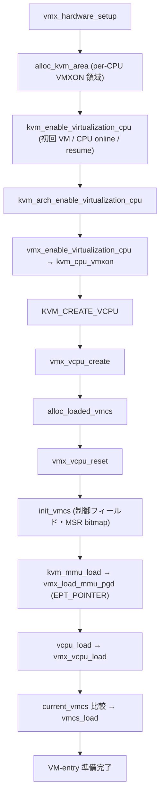

# 第14章 VMX 有効化と VMCS の構築

> **本章で読むソース**
>
> - [`arch/x86/kvm/vmx/vmx.c` L8455-L8501](https://github.com/gregkh/linux/blob/v6.18.38/arch/x86/kvm/vmx/vmx.c#L8455-L8501)
> - [`arch/x86/kvm/vmx/vmx.c` L3413-L3440](https://github.com/gregkh/linux/blob/v6.18.38/arch/x86/kvm/vmx/vmx.c#L3413-L3440)
> - [`arch/x86/kvm/vmx/vmx.c` L2841-L2866](https://github.com/gregkh/linux/blob/v6.18.38/arch/x86/kvm/vmx/vmx.c#L2841-L2866)
> - [`arch/x86/kvm/x86.c` L13078-L13096](https://github.com/gregkh/linux/blob/v6.18.38/arch/x86/kvm/x86.c#L13078-L13096)
> - [`arch/x86/kvm/vmx/vmx.c` L7538-L7627](https://github.com/gregkh/linux/blob/v6.18.38/arch/x86/kvm/vmx/vmx.c#L7538-L7627)
> - [`arch/x86/kvm/vmx/vmx.c` L2933-L2962](https://github.com/gregkh/linux/blob/v6.18.38/arch/x86/kvm/vmx/vmx.c#L2933-L2962)
> - [`arch/x86/kvm/vmx/vmx.c` L4677-L4759](https://github.com/gregkh/linux/blob/v6.18.38/arch/x86/kvm/vmx/vmx.c#L4677-L4759)
> - [`arch/x86/kvm/vmx/vmx.c` L4257-L4343](https://github.com/gregkh/linux/blob/v6.18.38/arch/x86/kvm/vmx/vmx.c#L4257-L4343)
> - [`arch/x86/kvm/vmx/vmx.c` L1410-L1478](https://github.com/gregkh/linux/blob/v6.18.38/arch/x86/kvm/vmx/vmx.c#L1410-L1478)

## この章の狙い

Intel VMX のモジュール初期化、`vmx_enable_virtualization_cpu` による per-CPU VMXON、`vmx_vcpu_create` での VMCS 確保、`init_vmcs` と `vmcs_write*` によるフィールド設定、`vmx_vcpu_load` での VMCS 載せ替えを読む。

## 前提

- [`struct kvm` / `kvm_vcpu` とアーキテクチャ ops](../part00-foundation/02-kvm-vcpu-arch-ops.md)
- [レジスタ、MSR、cpuid、例外注入](../part04-x86-common/12-regs-msr-cpuid-exceptions.md)
- [シャドウページテーブルと TDP（EPT/NPT）のモデル](../part03-x86-mmu/09-shadow-tdp-model.md)

## モジュール初期化：`vmx_hardware_setup`

`vmx_hardware_setup` は VMX モジュールロード時に CPU 能力を調べ、EPT、VPID、APICv、PML 等のグローバルフラグを決める。
`kvm_configure_mmu` へ EPT レベルと huge page 能力を渡し、以降の vCPU 作成が使う `vmcs_config` を確定する。

[`arch/x86/kvm/vmx/vmx.c` L8455-L8501](https://github.com/gregkh/linux/blob/v6.18.38/arch/x86/kvm/vmx/vmx.c#L8455-L8501)

```c
__init int vmx_hardware_setup(void)
{
	unsigned long host_bndcfgs;
	struct desc_ptr dt;
	int r;

	store_idt(&dt);
	host_idt_base = dt.address;

	vmx_setup_user_return_msrs();


	if (boot_cpu_has(X86_FEATURE_NX))
		kvm_enable_efer_bits(EFER_NX);

	if (boot_cpu_has(X86_FEATURE_MPX)) {
		rdmsrq(MSR_IA32_BNDCFGS, host_bndcfgs);
		WARN_ONCE(host_bndcfgs, "BNDCFGS in host will be lost");
	}

	if (!cpu_has_vmx_mpx())
		kvm_caps.supported_xcr0 &= ~(XFEATURE_MASK_BNDREGS |
					     XFEATURE_MASK_BNDCSR);

	if (!cpu_has_vmx_vpid() || !cpu_has_vmx_invvpid() ||
	    !(cpu_has_vmx_invvpid_single() || cpu_has_vmx_invvpid_global()))
		enable_vpid = 0;

	if (!cpu_has_vmx_ept() ||
	    !cpu_has_vmx_ept_4levels() ||
	    !cpu_has_vmx_ept_mt_wb() ||
	    !cpu_has_vmx_invept_global())
		enable_ept = 0;

	/* NX support is required for shadow paging. */
	if (!enable_ept && !boot_cpu_has(X86_FEATURE_NX)) {
		pr_err_ratelimited("NX (Execute Disable) not supported\n");
		return -EOPNOTSUPP;
	}

	/*
	 * Shadow paging doesn't have a (further) performance penalty
	 * from GUEST_MAXPHYADDR < HOST_MAXPHYADDR so enable it
	 * by default
	 */
	if (!enable_ept)
		allow_smaller_maxphyaddr = true;
```

`alloc_kvm_area` は各 CPU に VMXON 用の VMX area を割り当てる。
ネスト VMX 有効時は `nested_vmx_hardware_setup` が exit handler テーブルを差し替える。

## per-CPU VMX 有効化：`vmx_enable_virtualization_cpu`

最初の VM 作成、CPU online、または resume 時に、各 CPU で `kvm_enable_virtualization_cpu` が `kvm_arch_enable_virtualization_cpu` を呼び、`vmx_enable_virtualization_cpu` が `kvm_cpu_vmxon` を実行する。
vcpu load はこの入口ではない。

[`arch/x86/kvm/x86.c` L13078-L13096](https://github.com/gregkh/linux/blob/v6.18.38/arch/x86/kvm/x86.c#L13078-L13096)

```c
int kvm_arch_enable_virtualization_cpu(void)
{
	struct kvm *kvm;
	struct kvm_vcpu *vcpu;
	unsigned long i;
	int ret;
	u64 local_tsc;
	u64 max_tsc = 0;
	bool stable, backwards_tsc = false;

	kvm_user_return_msr_cpu_online();

	ret = kvm_x86_check_processor_compatibility();
	if (ret)
		return ret;

	ret = kvm_x86_call(enable_virtualization_cpu)();
	if (ret != 0)
		return ret;
```

[`arch/x86/kvm/vmx/vmx.c` L2841-L2866](https://github.com/gregkh/linux/blob/v6.18.38/arch/x86/kvm/vmx/vmx.c#L2841-L2866)

```c
int vmx_enable_virtualization_cpu(void)
{
	int cpu = raw_smp_processor_id();
	u64 phys_addr = __pa(per_cpu(vmxarea, cpu));
	int r;

	if (cr4_read_shadow() & X86_CR4_VMXE)
		return -EBUSY;

	/*
	 * This can happen if we hot-added a CPU but failed to allocate
	 * VP assist page for it.
	 */
	if (kvm_is_using_evmcs() && !hv_get_vp_assist_page(cpu))
		return -EFAULT;

	intel_pt_handle_vmx(1);

	r = kvm_cpu_vmxon(phys_addr);
	if (r) {
		intel_pt_handle_vmx(0);
		return r;
	}

	return 0;
}
```

> **v7.1.3 での変更**
> [`vmx_enable_virtualization_cpu`](https://github.com/gregkh/linux/blob/v7.1.3/arch/x86/kvm/vmx/vmx.c#L2958-L2969) は `kvm_cpu_vmxon` を直接呼ばず、`x86_virt_get_ref(X86_FEATURE_VMX)` で仮想化参照カウントを取る形に変わった。
> VMXON と VMXOFF のペアリングは x86 仮想化サブシステム側へ移った。

## vCPU 作成：`vmx_vcpu_create`

`KVM_CREATE_VCPU` から `kvm_x86_call(vcpu_create)` が `vmx_vcpu_create` を呼ぶ。
VPID、PML バッファ、VMCS01 の `loaded_vmcs` 確保、posted interrupt 用 PID table 登録を行う。

[`arch/x86/kvm/vmx/vmx.c` L7538-L7627](https://github.com/gregkh/linux/blob/v6.18.38/arch/x86/kvm/vmx/vmx.c#L7538-L7627)

```c
int vmx_vcpu_create(struct kvm_vcpu *vcpu)
{
	struct vmx_uret_msr *tsx_ctrl;
	struct vcpu_vmx *vmx;
	int i, err;

	BUILD_BUG_ON(offsetof(struct vcpu_vmx, vcpu) != 0);
	vmx = to_vmx(vcpu);

	INIT_LIST_HEAD(&vmx->vt.pi_wakeup_list);

	err = -ENOMEM;

	vmx->vpid = allocate_vpid();

	/*
	 * If PML is turned on, failure on enabling PML just results in failure
	 * of creating the vcpu, therefore we can simplify PML logic (by
	 * avoiding dealing with cases, such as enabling PML partially on vcpus
	 * for the guest), etc.
	 */
	if (enable_pml) {
		vmx->pml_pg = alloc_page(GFP_KERNEL_ACCOUNT | __GFP_ZERO);
		if (!vmx->pml_pg)
			goto free_vpid;
	}

	for (i = 0; i < kvm_nr_uret_msrs; ++i)
		vmx->guest_uret_msrs[i].mask = -1ull;
	if (boot_cpu_has(X86_FEATURE_RTM)) {
		/*
		 * TSX_CTRL_CPUID_CLEAR is handled in the CPUID interception.
		 * Keep the host value unchanged to avoid changing CPUID bits
		 * under the host kernel's feet.
		 */
		tsx_ctrl = vmx_find_uret_msr(vmx, MSR_IA32_TSX_CTRL);
		if (tsx_ctrl)
			tsx_ctrl->mask = ~(u64)TSX_CTRL_CPUID_CLEAR;
	}

	err = alloc_loaded_vmcs(&vmx->vmcs01);
	if (err < 0)
		goto free_pml;

	/*
	 * Use Hyper-V 'Enlightened MSR Bitmap' feature when KVM runs as a
	 * nested (L1) hypervisor and Hyper-V in L0 supports it. Enable the
	 * feature only for vmcs01, KVM currently isn't equipped to realize any
	 * performance benefits from enabling it for vmcs02.
	 */
	if (kvm_is_using_evmcs() &&
	    (ms_hyperv.nested_features & HV_X64_NESTED_MSR_BITMAP)) {
		struct hv_enlightened_vmcs *evmcs = (void *)vmx->vmcs01.vmcs;

		evmcs->hv_enlightenments_control.msr_bitmap = 1;
	}

	vmx->loaded_vmcs = &vmx->vmcs01;

	if (cpu_need_virtualize_apic_accesses(vcpu)) {
		err = kvm_alloc_apic_access_page(vcpu->kvm);
		if (err)
			goto free_vmcs;
	}

	if (enable_ept && !enable_unrestricted_guest) {
		err = init_rmode_identity_map(vcpu->kvm);
		if (err)
			goto free_vmcs;
	}

	err = -ENOMEM;
	if (vmcs_config.cpu_based_2nd_exec_ctrl & SECONDARY_EXEC_EPT_VIOLATION_VE) {
		struct page *page;

		BUILD_BUG_ON(sizeof(*vmx->ve_info) > PAGE_SIZE);

		/* ve_info must be page aligned. */
		page = alloc_page(GFP_KERNEL_ACCOUNT | __GFP_ZERO);
		if (!page)
			goto free_vmcs;

		vmx->ve_info = page_to_virt(page);
	}

	if (vmx_can_use_ipiv(vcpu))
		WRITE_ONCE(to_kvm_vmx(vcpu->kvm)->pid_table[vcpu->vcpu_id],
			   __pa(&vmx->vt.pi_desc) | PID_TABLE_ENTRY_VALID);

	return 0;
```

`alloc_loaded_vmcs` は VMCS ページ本体と MSR bitmap を確保し、`vmcs_clear` で初期化する。
`init_vmcs` は vCPU reset 時に呼ばれ、ここで作成した VMCS に制御フィールドを書き込む。

[`arch/x86/kvm/vmx/vmx.c` L2933-L2962](https://github.com/gregkh/linux/blob/v6.18.38/arch/x86/kvm/vmx/vmx.c#L2933-L2962)

```c
int alloc_loaded_vmcs(struct loaded_vmcs *loaded_vmcs)
{
	loaded_vmcs->vmcs = alloc_vmcs(false);
	if (!loaded_vmcs->vmcs)
		return -ENOMEM;

	vmcs_clear(loaded_vmcs->vmcs);

	loaded_vmcs->shadow_vmcs = NULL;
	loaded_vmcs->hv_timer_soft_disabled = false;
	loaded_vmcs->cpu = -1;
	loaded_vmcs->launched = 0;

	if (cpu_has_vmx_msr_bitmap()) {
		loaded_vmcs->msr_bitmap = (unsigned long *)
				__get_free_page(GFP_KERNEL_ACCOUNT);
		if (!loaded_vmcs->msr_bitmap)
			goto out_vmcs;
		memset(loaded_vmcs->msr_bitmap, 0xff, PAGE_SIZE);
	}

	memset(&loaded_vmcs->host_state, 0, sizeof(struct vmcs_host_state));
	memset(&loaded_vmcs->controls_shadow, 0,
		sizeof(struct vmcs_controls_shadow));

	return 0;

out_vmcs:
	free_loaded_vmcs(loaded_vmcs);
	return -ENOMEM;
}
```

## VMCS フィールド設定：`init_vmcs` と `vmcs_write`

`init_vmcs` は pin-based、primary、secondary、tertiary 実行コントロールと VM-entry、VM-exit コントロールを設定する。
`vmcs_write64` と `vmcs_write32` は VMCS フィールドへの書き込みマクロであり、MSR bitmap や posted interrupt 記述子などを初期化する。
EPT pointer は `init_vmcs` では設定せず、MMU root ロード時の `vmx_load_mmu_pgd` が `EPT_POINTER` を書く。

[`arch/x86/kvm/vmx/vmx.c` L4677-L4759](https://github.com/gregkh/linux/blob/v6.18.38/arch/x86/kvm/vmx/vmx.c#L4677-L4759)

```c
static void init_vmcs(struct vcpu_vmx *vmx)
{
	struct kvm *kvm = vmx->vcpu.kvm;
	struct kvm_vmx *kvm_vmx = to_kvm_vmx(kvm);

	if (nested)
		nested_vmx_set_vmcs_shadowing_bitmap();

	if (cpu_has_vmx_msr_bitmap())
		vmcs_write64(MSR_BITMAP, __pa(vmx->vmcs01.msr_bitmap));

	vmcs_write64(VMCS_LINK_POINTER, INVALID_GPA); /* 22.3.1.5 */

	/* Control */
	pin_controls_set(vmx, vmx_pin_based_exec_ctrl(vmx));

	exec_controls_set(vmx, vmx_exec_control(vmx));

	if (cpu_has_secondary_exec_ctrls()) {
		secondary_exec_controls_set(vmx, vmx_secondary_exec_control(vmx));
		if (vmx->ve_info)
			vmcs_write64(VE_INFORMATION_ADDRESS,
				     __pa(vmx->ve_info));
	}

	if (cpu_has_tertiary_exec_ctrls())
		tertiary_exec_controls_set(vmx, vmx_tertiary_exec_control(vmx));

	if (enable_apicv && lapic_in_kernel(&vmx->vcpu)) {
		vmcs_write64(EOI_EXIT_BITMAP0, 0);
		vmcs_write64(EOI_EXIT_BITMAP1, 0);
		vmcs_write64(EOI_EXIT_BITMAP2, 0);
		vmcs_write64(EOI_EXIT_BITMAP3, 0);

		vmcs_write16(GUEST_INTR_STATUS, 0);

		vmcs_write16(POSTED_INTR_NV, POSTED_INTR_VECTOR);
		vmcs_write64(POSTED_INTR_DESC_ADDR, __pa((&vmx->vt.pi_desc)));
	}

	if (vmx_can_use_ipiv(&vmx->vcpu)) {
		vmcs_write64(PID_POINTER_TABLE, __pa(kvm_vmx->pid_table));
		vmcs_write16(LAST_PID_POINTER_INDEX, kvm->arch.max_vcpu_ids - 1);
	}

	if (!kvm_pause_in_guest(kvm)) {
		vmcs_write32(PLE_GAP, ple_gap);
		vmx->ple_window = ple_window;
		vmx->ple_window_dirty = true;
	}

	if (kvm_notify_vmexit_enabled(kvm))
		vmcs_write32(NOTIFY_WINDOW, kvm->arch.notify_window);

	vmcs_write32(PAGE_FAULT_ERROR_CODE_MASK, 0);
	vmcs_write32(PAGE_FAULT_ERROR_CODE_MATCH, 0);
	vmcs_write32(CR3_TARGET_COUNT, 0);           /* 22.2.1 */

	vmcs_write16(HOST_FS_SELECTOR, 0);            /* 22.2.4 */
	vmcs_write16(HOST_GS_SELECTOR, 0);            /* 22.2.4 */
	vmx_set_constant_host_state(vmx);
	vmcs_writel(HOST_FS_BASE, 0); /* 22.2.4 */
	vmcs_writel(HOST_GS_BASE, 0); /* 22.2.4 */

	if (cpu_has_vmx_vmfunc())
		vmcs_write64(VM_FUNCTION_CONTROL, 0);

	vmcs_write32(VM_EXIT_MSR_STORE_COUNT, 0);
	vmcs_write32(VM_EXIT_MSR_LOAD_COUNT, 0);
	vmcs_write64(VM_EXIT_MSR_LOAD_ADDR, __pa(vmx->msr_autoload.host.val));
	vmcs_write32(VM_ENTRY_MSR_LOAD_COUNT, 0);
	vmcs_write64(VM_ENTRY_MSR_LOAD_ADDR, __pa(vmx->msr_autoload.guest.val));

	if (vmcs_config.vmentry_ctrl & VM_ENTRY_LOAD_IA32_PAT)
		vmcs_write64(GUEST_IA32_PAT, vmx->vcpu.arch.pat);

	vm_exit_controls_set(vmx, vmx_get_initial_vmexit_ctrl());

	/* 22.2.1, 20.8.1 */
	vm_entry_controls_set(vmx, vmx_get_initial_vmentry_ctrl());

	vmx->vcpu.arch.cr0_guest_owned_bits = vmx_l1_guest_owned_cr0_bits();
	vmcs_writel(CR0_GUEST_HOST_MASK, ~vmx->vcpu.arch.cr0_guest_owned_bits);
```

## EPT pointer のロード：`vmx_load_mmu_pgd`

`kvm_mmu_load` から `vmx_load_mmu_pgd` が呼ばれ、ゲストの MMU root を VMCS へ載せる。
EPT 有効時は `construct_eptp` で EPT pointer を組み立て `vmcs_write64(EPT_POINTER, eptp)` する。
シャドウページング時は `GUEST_CR3` に shadow root の HPA を書く。

[`arch/x86/kvm/vmx/vmx.c` L3413-L3440](https://github.com/gregkh/linux/blob/v6.18.38/arch/x86/kvm/vmx/vmx.c#L3413-L3440)

```c
void vmx_load_mmu_pgd(struct kvm_vcpu *vcpu, hpa_t root_hpa, int root_level)
{
	struct kvm *kvm = vcpu->kvm;
	bool update_guest_cr3 = true;
	unsigned long guest_cr3;
	u64 eptp;

	if (enable_ept) {
		eptp = construct_eptp(vcpu, root_hpa, root_level);
		vmcs_write64(EPT_POINTER, eptp);

		hv_track_root_tdp(vcpu, root_hpa);

		if (!enable_unrestricted_guest && !is_paging(vcpu))
			guest_cr3 = to_kvm_vmx(kvm)->ept_identity_map_addr;
		else if (kvm_register_is_dirty(vcpu, VCPU_EXREG_CR3))
			guest_cr3 = vcpu->arch.cr3;
		else /* vmcs.GUEST_CR3 is already up-to-date. */
			update_guest_cr3 = false;
		vmx_ept_load_pdptrs(vcpu);
	} else {
		guest_cr3 = root_hpa | kvm_get_active_pcid(vcpu) |
			    kvm_get_active_cr3_lam_bits(vcpu);
	}

	if (update_guest_cr3)
		vmcs_writel(GUEST_CR3, guest_cr3);
}
```

`init_vmcs` の MSR bitmap と実行制御の初期化と、MMU root のロードは別経路である。

## ホスト状態のキャッシュ：`vmx_set_constant_host_state`

`vmx_set_constant_host_state` は VM-entry ごとに変わりにくいホスト状態を VMCS へ書く。
コメントにあるとおり CR3 と CR4 は「most likely value」であり、`loaded_vmcs->host_state` は変化頻度の低いホスト状態の write-through cache である。
CR0、セグメントセレクタ、HOST_RIP などはゲスト寿命中ほぼ一定だが、CR3 と CR4 はタスク切り替えや `vmx_vcpu_run` 直前の更新で変わる。

[`arch/x86/kvm/vmx/vmx.c` L4257-L4343](https://github.com/gregkh/linux/blob/v6.18.38/arch/x86/kvm/vmx/vmx.c#L4257-L4343)

```c
void vmx_set_constant_host_state(struct vcpu_vmx *vmx)
{
	u32 low32, high32;
	unsigned long tmpl;
	unsigned long cr0, cr3, cr4;

	cr0 = read_cr0();
	WARN_ON(cr0 & X86_CR0_TS);
	vmcs_writel(HOST_CR0, cr0);  /* 22.2.3 */

	/*
	 * Save the most likely value for this task's CR3 in the VMCS.
	 * We can't use __get_current_cr3_fast() because we're not atomic.
	 */
	cr3 = __read_cr3();
	vmcs_writel(HOST_CR3, cr3);		/* 22.2.3  FIXME: shadow tables */
	vmx->loaded_vmcs->host_state.cr3 = cr3;

	/* Save the most likely value for this task's CR4 in the VMCS. */
	cr4 = cr4_read_shadow();
	vmcs_writel(HOST_CR4, cr4);			/* 22.2.3, 22.2.5 */
	vmx->loaded_vmcs->host_state.cr4 = cr4;

	vmcs_write16(HOST_CS_SELECTOR, __KERNEL_CS);  /* 22.2.4 */
#ifdef CONFIG_X86_64
	/*
	 * Load null selectors, so we can avoid reloading them in
	 * vmx_prepare_switch_to_host(), in case userspace uses
	 * the null selectors too (the expected case).
	 */
	vmcs_write16(HOST_DS_SELECTOR, 0);
	vmcs_write16(HOST_ES_SELECTOR, 0);
#else
	vmcs_write16(HOST_DS_SELECTOR, __KERNEL_DS);  /* 22.2.4 */
	vmcs_write16(HOST_ES_SELECTOR, __KERNEL_DS);  /* 22.2.4 */
#endif
	vmcs_write16(HOST_SS_SELECTOR, __KERNEL_DS);  /* 22.2.4 */
	vmcs_write16(HOST_TR_SELECTOR, GDT_ENTRY_TSS*8);  /* 22.2.4 */

	vmcs_writel(HOST_IDTR_BASE, host_idt_base);   /* 22.2.4 */

	vmcs_writel(HOST_RIP, (unsigned long)vmx_vmexit); /* 22.2.5 */

	rdmsr(MSR_IA32_SYSENTER_CS, low32, high32);
	vmcs_write32(HOST_IA32_SYSENTER_CS, low32);

	/*
	 * SYSENTER is used for 32-bit system calls on either 32-bit or
	 * 64-bit kernels.  It is always zero If neither is allowed, otherwise
	 * vmx_vcpu_load_vmcs loads it with the per-CPU entry stack (and may
	 * have already done so!).
	 */
	if (!IS_ENABLED(CONFIG_IA32_EMULATION) && !IS_ENABLED(CONFIG_X86_32))
		vmcs_writel(HOST_IA32_SYSENTER_ESP, 0);

	rdmsrq(MSR_IA32_SYSENTER_EIP, tmpl);
	vmcs_writel(HOST_IA32_SYSENTER_EIP, tmpl);   /* 22.2.3 */

	if (vmcs_config.vmexit_ctrl & VM_EXIT_LOAD_IA32_PAT) {
		rdmsr(MSR_IA32_CR_PAT, low32, high32);
		vmcs_write64(HOST_IA32_PAT, low32 | ((u64) high32 << 32));
	}

	if (cpu_has_load_ia32_efer())
		vmcs_write64(HOST_IA32_EFER, kvm_host.efer);

	/*
	 * Supervisor shadow stack is not enabled on host side, i.e.,
	 * host IA32_S_CET.SHSTK_EN bit is guaranteed to 0 now, per SDM
	 * description(RDSSP instruction), SSP is not readable in CPL0,
	 * so resetting the two registers to 0s at VM-Exit does no harm
	 * to kernel execution. When execution flow exits to userspace,
	 * SSP is reloaded from IA32_PL3_SSP. Check SDM Vol.2A/B Chapter
	 * 3 and 4 for details.
	 */
	if (cpu_has_load_cet_ctrl()) {
		vmcs_writel(HOST_S_CET, kvm_host.s_cet);
		vmcs_writel(HOST_SSP, 0);
		vmcs_writel(HOST_INTR_SSP_TABLE, 0);
	}
}
```

CPU ごとに変わる TSS と GDT は `vmx_vcpu_load_vmcs` で上書きする。
`vmx_vcpu_run` は VM-entry 直前に `loaded_vmcs->host_state.cr3` と `cr4` を再照合し、変化があれば VMCS を更新する。

## vCPU 載せ替え：`vmx_vcpu_load`

`vcpu_load` から `vmx_vcpu_load` が呼ばれ、per-CPU の `loaded_vmcss_on_cpu` リストへ VMCS を載せ替える。
別 CPU へマイグレーションした場合は TLB flush 要求とホスト TSS、GDT の再設定を行う。

[`arch/x86/kvm/vmx/vmx.c` L1410-L1478](https://github.com/gregkh/linux/blob/v6.18.38/arch/x86/kvm/vmx/vmx.c#L1410-L1478)

```c
void vmx_vcpu_load_vmcs(struct kvm_vcpu *vcpu, int cpu)
{
	struct vcpu_vmx *vmx = to_vmx(vcpu);
	bool already_loaded = vmx->loaded_vmcs->cpu == cpu;
	struct vmcs *prev;

	if (!already_loaded) {
		loaded_vmcs_clear(vmx->loaded_vmcs);
		local_irq_disable();

		/*
		 * Ensure loaded_vmcs->cpu is read before adding loaded_vmcs to
		 * this cpu's percpu list, otherwise it may not yet be deleted
		 * from its previous cpu's percpu list.  Pairs with the
		 * smb_wmb() in __loaded_vmcs_clear().
		 */
		smp_rmb();

		list_add(&vmx->loaded_vmcs->loaded_vmcss_on_cpu_link,
			 &per_cpu(loaded_vmcss_on_cpu, cpu));
		local_irq_enable();
	}

	prev = per_cpu(current_vmcs, cpu);
	if (prev != vmx->loaded_vmcs->vmcs) {
		per_cpu(current_vmcs, cpu) = vmx->loaded_vmcs->vmcs;
		vmcs_load(vmx->loaded_vmcs->vmcs);
	}

	if (!already_loaded) {
		void *gdt = get_current_gdt_ro();

		/*
		 * Flush all EPTP/VPID contexts, the new pCPU may have stale
		 * TLB entries from its previous association with the vCPU.
		 */
		kvm_make_request(KVM_REQ_TLB_FLUSH, vcpu);

		/*
		 * Linux uses per-cpu TSS and GDT, so set these when switching
		 * processors.  See 22.2.4.
		 */
		vmcs_writel(HOST_TR_BASE,
			    (unsigned long)&get_cpu_entry_area(cpu)->tss.x86_tss);
		vmcs_writel(HOST_GDTR_BASE, (unsigned long)gdt);   /* 22.2.4 */

		if (IS_ENABLED(CONFIG_IA32_EMULATION) || IS_ENABLED(CONFIG_X86_32)) {
			/* 22.2.3 */
			vmcs_writel(HOST_IA32_SYSENTER_ESP,
				    (unsigned long)(cpu_entry_stack(cpu) + 1));
		}

		vmx->loaded_vmcs->cpu = cpu;
	}
}

/*
 * Switches to specified vcpu, until a matching vcpu_put(), but assumes
 * vcpu mutex is already taken.
 */
void vmx_vcpu_load(struct kvm_vcpu *vcpu, int cpu)
{
	if (vcpu->scheduled_out && !kvm_pause_in_guest(vcpu->kvm))
		shrink_ple_window(vcpu);

	vmx_vcpu_load_vmcs(vcpu, cpu);

	vmx_vcpu_pi_load(vcpu, cpu);
}
```

`smp_rmb` と `smp_wmb` はマルチ CPU 間の `loaded_vmcs` リスト操作と競合しないためのメモリバリアである。
`prev != vmx->loaded_vmcs->vmcs` の比較は、対象 VMCS が既に当該 CPU の current VMCS である場合に重複 `VMPTRLD` を省略する。
別 vCPU へ切り替えると通常は別 VMCS となり `vmcs_load` が必要になる。

## 処理の流れ：VMX 有効化から VMCS 構築まで



## 高速化と最適化の工夫

`vmx_hardware_setup` で EPT と VPID を一括判定し、不要な VM-exit 経路をコンパイル時相当のフラグで除外する。
MSR bitmap は初期値 0xff で全インターセプトとし、透過 MSR だけビットを落として RDMSR と WRMSR の VM-exit を避ける。
`controls_shadow` は VMCS への書き込みを差分更新し、同一値の再設定コストを抑える。
per-CPU `current_vmcs` は、同一 CPU 上で同じ VMCS が既にアクティブなときの重複 `VMPTRLD` を省略する。

## まとめ

`vmx_hardware_setup` がモジュール全体の VMX 能力を確定し、per-CPU の VMXON 領域を用意する。
`vmx_enable_virtualization_cpu` が `kvm_cpu_vmxon` でホスト CPU 上の VMX を有効化する。
`init_vmcs` が `vmcs_write` 系で制御フィールドと MSR bitmap を設定し、`vmx_load_mmu_pgd` が EPT pointer と GUEST_CR3 をロードする。
`vmx_set_constant_host_state` がホスト状態の write-through cache を初期化し、`vmx_vcpu_load` が VMCS の載せ替えと per-CPU ホスト状態の更新を担う。

## 関連する章

- [レジスタ、MSR、cpuid、例外注入](../part04-x86-common/12-regs-msr-cpuid-exceptions.md)
- [`vmx_vcpu_run` と VM-exit 処理](15-vmx-run-exit.md)
- [シャドウページテーブルと TDP（EPT/NPT）のモデル](../part03-x86-mmu/09-shadow-tdp-model.md)
