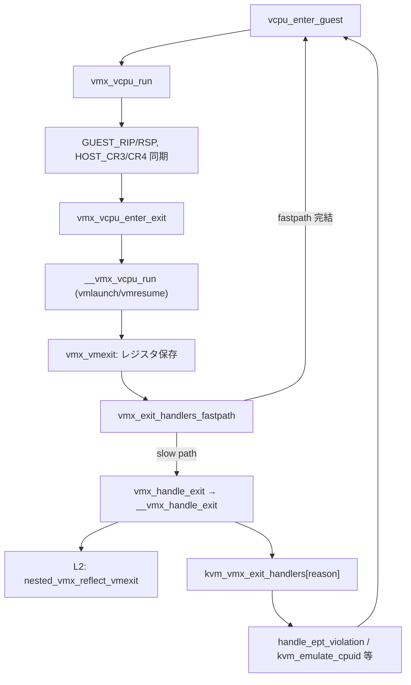

# 第15章 `vmx_vcpu_run` と VM-exit 処理

> **本章で読むソース**
>
> - [`arch/x86/kvm/vmx/vmx.c` L7368-L7464](https://github.com/gregkh/linux/blob/v6.18.38/arch/x86/kvm/vmx/vmx.c#L7368-L7464)
> - [`arch/x86/kvm/vmx/vmx.c` L7315-L7366](https://github.com/gregkh/linux/blob/v6.18.38/arch/x86/kvm/vmx/vmx.c#L7315-L7366)
> - [`arch/x86/kvm/vmx/vmenter.S` L78-L196](https://github.com/gregkh/linux/blob/v6.18.38/arch/x86/kvm/vmx/vmenter.S#L78-L196)
> - [`arch/x86/kvm/vmx/vmx.c` L7273-L7298](https://github.com/gregkh/linux/blob/v6.18.38/arch/x86/kvm/vmx/vmx.c#L7273-L7298)
> - [`arch/x86/kvm/vmx/vmx.c` L6483-L6553](https://github.com/gregkh/linux/blob/v6.18.38/arch/x86/kvm/vmx/vmx.c#L6483-L6553)
> - [`arch/x86/kvm/vmx/vmx.c` L6626-L6631](https://github.com/gregkh/linux/blob/v6.18.38/arch/x86/kvm/vmx/vmx.c#L6626-L6631)
> - [`arch/x86/kvm/vmx/vmx.c` L6113-L6148](https://github.com/gregkh/linux/blob/v6.18.38/arch/x86/kvm/vmx/vmx.c#L6113-L6148)

## この章の狙い

`vcpu_enter_guest` から `vmx_vcpu_run` が VM-entry へ入り、VM-exit 後に `vmx_handle_exit` が reason ごとに処理する流れを読む。
`__vmx_vcpu_run` のアセンブリ境界、`kvm_vmx_exit_handlers` によるディスパッチ、代表 exit reason の扱いを押さえる。

## 前提

- [`KVM_RUN` と vCPU 実行ループ](../part01-kvm-core/05-kvm-run-execution-loop.md)
- [VMX 有効化と VMCS の構築](14-vmx-enable-vmcs.md)

## VM-entry 準備：`vmx_vcpu_run`

`kvm_x86_call(vcpu_run)` から `vmx_vcpu_run` が呼ばれる。
ゲスト状態が無効なら `EXIT_REASON_INVALID_STATE` を合成し、有効なら汎用レジスタとホスト CR3/CR4 を VMCS へ同期してから `vmx_vcpu_enter_exit` へ入る。

[`arch/x86/kvm/vmx/vmx.c` L7368-L7464](https://github.com/gregkh/linux/blob/v6.18.38/arch/x86/kvm/vmx/vmx.c#L7368-L7464)

```c
fastpath_t vmx_vcpu_run(struct kvm_vcpu *vcpu, u64 run_flags)
{
	bool force_immediate_exit = run_flags & KVM_RUN_FORCE_IMMEDIATE_EXIT;
	struct vcpu_vmx *vmx = to_vmx(vcpu);
	unsigned long cr3, cr4;

	/* Record the guest's net vcpu time for enforced NMI injections. */
	if (unlikely(!enable_vnmi &&
		     vmx->loaded_vmcs->soft_vnmi_blocked))
		vmx->loaded_vmcs->entry_time = ktime_get();

	/*
	 * Don't enter VMX if guest state is invalid, let the exit handler
	 * start emulation until we arrive back to a valid state.  Synthesize a
	 * consistency check VM-Exit due to invalid guest state and bail.
	 */
	if (unlikely(vmx->vt.emulation_required)) {
		vmx->fail = 0;

		vmx->vt.exit_reason.full = EXIT_REASON_INVALID_STATE;
		vmx->vt.exit_reason.failed_vmentry = 1;
		kvm_register_mark_available(vcpu, VCPU_EXREG_EXIT_INFO_1);
		vmx->vt.exit_qualification = ENTRY_FAIL_DEFAULT;
		kvm_register_mark_available(vcpu, VCPU_EXREG_EXIT_INFO_2);
		vmx->vt.exit_intr_info = 0;
		return EXIT_FASTPATH_NONE;
	}

	trace_kvm_entry(vcpu, force_immediate_exit);

	if (vmx->ple_window_dirty) {
		vmx->ple_window_dirty = false;
		vmcs_write32(PLE_WINDOW, vmx->ple_window);
	}

	/*
	 * We did this in prepare_switch_to_guest, because it needs to
	 * be within srcu_read_lock.
	 */
	WARN_ON_ONCE(vmx->nested.need_vmcs12_to_shadow_sync);

	if (kvm_register_is_dirty(vcpu, VCPU_REGS_RSP))
		vmcs_writel(GUEST_RSP, vcpu->arch.regs[VCPU_REGS_RSP]);
	if (kvm_register_is_dirty(vcpu, VCPU_REGS_RIP))
		vmcs_writel(GUEST_RIP, vcpu->arch.regs[VCPU_REGS_RIP]);
	vcpu->arch.regs_dirty = 0;

	if (run_flags & KVM_RUN_LOAD_GUEST_DR6)
		set_debugreg(vcpu->arch.dr6, 6);

	if (run_flags & KVM_RUN_LOAD_DEBUGCTL)
		vmx_reload_guest_debugctl(vcpu);

	/*
	 * Refresh vmcs.HOST_CR3 if necessary.  This must be done immediately
	 * prior to VM-Enter, as the kernel may load a new ASID (PCID) any time
	 * it switches back to the current->mm, which can occur in KVM context
	 * when switching to a temporary mm to patch kernel code, e.g. if KVM
	 * toggles a static key while handling a VM-Exit.
	 */
	cr3 = __get_current_cr3_fast();
	if (unlikely(cr3 != vmx->loaded_vmcs->host_state.cr3)) {
		vmcs_writel(HOST_CR3, cr3);
		vmx->loaded_vmcs->host_state.cr3 = cr3;
	}

	cr4 = cr4_read_shadow();
	if (unlikely(cr4 != vmx->loaded_vmcs->host_state.cr4)) {
		vmcs_writel(HOST_CR4, cr4);
		vmx->loaded_vmcs->host_state.cr4 = cr4;
	}

	/* When single-stepping over STI and MOV SS, we must clear the
	 * corresponding interruptibility bits in the guest state. Otherwise
	 * vmentry fails as it then expects bit 14 (BS) in pending debug
	 * exceptions being set, but that's not correct for the guest debugging
	 * case. */
	if (vcpu->guest_debug & KVM_GUESTDBG_SINGLESTEP)
		vmx_set_interrupt_shadow(vcpu, 0);

	kvm_load_guest_xsave_state(vcpu);

	pt_guest_enter(vmx);

	atomic_switch_perf_msrs(vmx);
	if (intel_pmu_lbr_is_enabled(vcpu))
		vmx_passthrough_lbr_msrs(vcpu);

	if (enable_preemption_timer)
		vmx_update_hv_timer(vcpu, force_immediate_exit);
	else if (force_immediate_exit)
		smp_send_reschedule(vcpu->cpu);

	kvm_wait_lapic_expire(vcpu);

	/* The actual VMENTER/EXIT is in the .noinstr.text section. */
	vmx_vcpu_enter_exit(vcpu, __vmx_vcpu_run_flags(vmx));
```

VM-exit 後は `vmx_exit_handlers_fastpath` が一部 reason をカーネル内で完結させ、残りは `vcpu_enter_guest` から `vmx_handle_exit` へ渡る。

## `.noinstr` 境界：`vmx_vcpu_enter_exit` と `__vmx_vcpu_run`

`vmx_vcpu_enter_exit` は `guest_state_enter_irqoff` のあと `__vmx_vcpu_run` を呼び、戻り後に exit reason を VMCS から読む。
L1D flush や guest CR2 の同期もこの境界の直前に行う。

[`arch/x86/kvm/vmx/vmx.c` L7315-L7366](https://github.com/gregkh/linux/blob/v6.18.38/arch/x86/kvm/vmx/vmx.c#L7315-L7366)

```c
static noinstr void vmx_vcpu_enter_exit(struct kvm_vcpu *vcpu,
					unsigned int flags)
{
	struct vcpu_vmx *vmx = to_vmx(vcpu);

	guest_state_enter_irqoff();

	/*
	 * L1D Flush includes CPU buffer clear to mitigate MDS, but VERW
	 * mitigation for MDS is done late in VMentry and is still
	 * executed in spite of L1D Flush. This is because an extra VERW
	 * should not matter much after the big hammer L1D Flush.
	 *
	 * cpu_buf_vm_clear is used when system is not vulnerable to MDS/TAA,
	 * and is affected by MMIO Stale Data. In such cases mitigation in only
	 * needed against an MMIO capable guest.
	 */
	if (static_branch_unlikely(&vmx_l1d_should_flush))
		vmx_l1d_flush(vcpu);
	else if (static_branch_unlikely(&cpu_buf_vm_clear) &&
		 (flags & VMX_RUN_CLEAR_CPU_BUFFERS_FOR_MMIO))
		x86_clear_cpu_buffers();

	vmx_disable_fb_clear(vmx);

	if (vcpu->arch.cr2 != native_read_cr2())
		native_write_cr2(vcpu->arch.cr2);

	vmx->fail = __vmx_vcpu_run(vmx, (unsigned long *)&vcpu->arch.regs,
				   flags);

	vcpu->arch.cr2 = native_read_cr2();
	vcpu->arch.regs_avail &= ~VMX_REGS_LAZY_LOAD_SET;

	vmx->idt_vectoring_info = 0;

	vmx_enable_fb_clear(vmx);

	if (unlikely(vmx->fail)) {
		vmx->vt.exit_reason.full = 0xdead;
		goto out;
	}

	vmx->vt.exit_reason.full = vmcs_read32(VM_EXIT_REASON);
	if (likely(!vmx_get_exit_reason(vcpu).failed_vmentry))
		vmx->idt_vectoring_info = vmcs_read32(IDT_VECTORING_INFO_FIELD);

	vmx_handle_nmi(vcpu);

out:
	guest_state_exit_irqoff();
}
```

`__vmx_vcpu_run` は `vmenter.S` にあり、ゲスト汎用レジスタをロードして `vmlaunch` または `vmresume` を実行する。
成功すると VMCS の HOST_RIP が指す `vmx_vmexit` ラベルへ制御が戻り、ゲストレジスタを `vcpu->arch.regs` へ保存する。

[`arch/x86/kvm/vmx/vmenter.S` L78-L196](https://github.com/gregkh/linux/blob/v6.18.38/arch/x86/kvm/vmx/vmenter.S#L78-L196)

```asm
SYM_FUNC_START(__vmx_vcpu_run)
	push %_ASM_BP
	mov  %_ASM_SP, %_ASM_BP
#ifdef CONFIG_X86_64
	push %r15
	push %r14
	push %r13
	push %r12
#else
	push %edi
	push %esi
#endif
	push %_ASM_BX

	/* Save @vmx for SPEC_CTRL handling */
	push %_ASM_ARG1

	/* Save @flags for SPEC_CTRL handling */
	push %_ASM_ARG3

	/*
	 * Save @regs, _ASM_ARG2 may be modified by vmx_update_host_rsp() and
	 * @regs is needed after VM-Exit to save the guest's register values.
	 */
	push %_ASM_ARG2

	/* Copy @flags to EBX, _ASM_ARG3 is volatile. */
	mov %_ASM_ARG3L, %ebx

	lea (%_ASM_SP), %_ASM_ARG2
	call vmx_update_host_rsp

	ALTERNATIVE "jmp .Lspec_ctrl_done", "", X86_FEATURE_MSR_SPEC_CTRL

	/*
	 * SPEC_CTRL handling: if the guest's SPEC_CTRL value differs from the
	 * host's, write the MSR.
	 *
	 * IMPORTANT: To avoid RSB underflow attacks and any other nastiness,
	 * there must not be any returns or indirect branches between this code
	 * and vmentry.
	 */
	mov 2*WORD_SIZE(%_ASM_SP), %_ASM_DI
	movl VMX_spec_ctrl(%_ASM_DI), %edi
	movl PER_CPU_VAR(x86_spec_ctrl_current), %esi
	cmp %edi, %esi
	je .Lspec_ctrl_done
	mov $MSR_IA32_SPEC_CTRL, %ecx
	xor %edx, %edx
	mov %edi, %eax
	wrmsr

.Lspec_ctrl_done:

	/*
	 * Since vmentry is serializing on affected CPUs, there's no need for
	 * an LFENCE to stop speculation from skipping the wrmsr.
	 */

	/* Load @regs to RAX. */
	mov (%_ASM_SP), %_ASM_AX

	/* Check if vmlaunch or vmresume is needed */
	bt   $VMX_RUN_VMRESUME_SHIFT, %ebx

	/* Load guest registers.  Don't clobber flags. */
	mov VCPU_RCX(%_ASM_AX), %_ASM_CX
	mov VCPU_RDX(%_ASM_AX), %_ASM_DX
	mov VCPU_RBX(%_ASM_AX), %_ASM_BX
	mov VCPU_RBP(%_ASM_AX), %_ASM_BP
	mov VCPU_RSI(%_ASM_AX), %_ASM_SI
	mov VCPU_RDI(%_ASM_AX), %_ASM_DI
#ifdef CONFIG_X86_64
	mov VCPU_R8 (%_ASM_AX),  %r8
	mov VCPU_R9 (%_ASM_AX),  %r9
	mov VCPU_R10(%_ASM_AX), %r10
	mov VCPU_R11(%_ASM_AX), %r11
	mov VCPU_R12(%_ASM_AX), %r12
	mov VCPU_R13(%_ASM_AX), %r13
	mov VCPU_R14(%_ASM_AX), %r14
	mov VCPU_R15(%_ASM_AX), %r15
#endif
	/* Load guest RAX.  This kills the @regs pointer! */
	mov VCPU_RAX(%_ASM_AX), %_ASM_AX

	/* Clobbers EFLAGS.ZF */
	CLEAR_CPU_BUFFERS

	/* Check EFLAGS.CF from the VMX_RUN_VMRESUME bit test above. */
	jnc .Lvmlaunch

	/*
	 * After a successful VMRESUME/VMLAUNCH, control flow "magically"
	 * resumes below at 'vmx_vmexit' due to the VMCS HOST_RIP setting.
	 * So this isn't a typical function and objtool needs to be told to
	 * save the unwind state here and restore it below.
	 */
	UNWIND_HINT_SAVE

/*
 * If VMRESUME/VMLAUNCH and corresponding vmexit succeed, execution resumes at
 * the 'vmx_vmexit' label below.
 */
.Lvmresume:
	vmresume
	jmp .Lvmfail

.Lvmlaunch:
	vmlaunch
	jmp .Lvmfail

	_ASM_EXTABLE(.Lvmresume, .Lfixup)
	_ASM_EXTABLE(.Lvmlaunch, .Lfixup)

SYM_INNER_LABEL_ALIGN(vmx_vmexit, SYM_L_GLOBAL)

	/* Restore unwind state from before the VMRESUME/VMLAUNCH. */
	UNWIND_HINT_RESTORE
	ENDBR
```

## fast path：`vmx_exit_handlers_fastpath`

頻出の VM-exit は `vmx_exit_handlers_fastpath` でカーネル内完結を試みる。
WRMSR、preemption timer、HLT、INVD などが対象で、L2 実行中は preemption timer 以外は slow path へ落ちる。

[`arch/x86/kvm/vmx/vmx.c` L7273-L7298](https://github.com/gregkh/linux/blob/v6.18.38/arch/x86/kvm/vmx/vmx.c#L7273-L7298)

```c
static fastpath_t vmx_exit_handlers_fastpath(struct kvm_vcpu *vcpu,
					     bool force_immediate_exit)
{
	/*
	 * If L2 is active, some VMX preemption timer exits can be handled in
	 * the fastpath even, all other exits must use the slow path.
	 */
	if (is_guest_mode(vcpu) &&
	    vmx_get_exit_reason(vcpu).basic != EXIT_REASON_PREEMPTION_TIMER)
		return EXIT_FASTPATH_NONE;

	switch (vmx_get_exit_reason(vcpu).basic) {
	case EXIT_REASON_MSR_WRITE:
		return handle_fastpath_wrmsr(vcpu);
	case EXIT_REASON_MSR_WRITE_IMM:
		return handle_fastpath_wrmsr_imm(vcpu, vmx_get_exit_qual(vcpu),
						 vmx_get_msr_imm_reg(vcpu));
	case EXIT_REASON_PREEMPTION_TIMER:
		return handle_fastpath_preemption_timer(vcpu, force_immediate_exit);
	case EXIT_REASON_HLT:
		return handle_fastpath_hlt(vcpu);
	case EXIT_REASON_INVD:
		return handle_fastpath_invd(vcpu);
	default:
		return EXIT_FASTPATH_NONE;
	}
}
```

## VM-exit 処理：`__vmx_handle_exit` と `kvm_vmx_exit_handlers`

slow path では `__vmx_handle_exit` が nested 反映、VM-entry 失敗、vectoring 衝突を処理したうえで exit reason をテーブル検索する。
`kvm_vmx_exit_handlers` は reason 番号をインデックスにハンドラ関数ポインタを持つ。

[`arch/x86/kvm/vmx/vmx.c` L6483-L6553](https://github.com/gregkh/linux/blob/v6.18.38/arch/x86/kvm/vmx/vmx.c#L6483-L6553)

```c
static int __vmx_handle_exit(struct kvm_vcpu *vcpu, fastpath_t exit_fastpath)
{
	struct vcpu_vmx *vmx = to_vmx(vcpu);
	union vmx_exit_reason exit_reason = vmx_get_exit_reason(vcpu);
	u32 vectoring_info = vmx->idt_vectoring_info;
	u16 exit_handler_index;

	/*
	 * Flush logged GPAs PML buffer, this will make dirty_bitmap more
	 * updated. Another good is, in kvm_vm_ioctl_get_dirty_log, before
	 * querying dirty_bitmap, we only need to kick all vcpus out of guest
	 * mode as if vcpus is in root mode, the PML buffer must has been
	 * flushed already.  Note, PML is never enabled in hardware while
	 * running L2.
	 */
	if (enable_pml && !is_guest_mode(vcpu))
		vmx_flush_pml_buffer(vcpu);

	/*
	 * KVM should never reach this point with a pending nested VM-Enter.
	 * More specifically, short-circuiting VM-Entry to emulate L2 due to
	 * invalid guest state should never happen as that means KVM knowingly
	 * allowed a nested VM-Enter with an invalid vmcs12.  More below.
	 */
	if (KVM_BUG_ON(vmx->nested.nested_run_pending, vcpu->kvm))
		return -EIO;

	if (is_guest_mode(vcpu)) {
		/*
		 * PML is never enabled when running L2, bail immediately if a
		 * PML full exit occurs as something is horribly wrong.
		 */
		if (exit_reason.basic == EXIT_REASON_PML_FULL)
			goto unexpected_vmexit;

		/*
		 * The host physical addresses of some pages of guest memory
		 * are loaded into the vmcs02 (e.g. vmcs12's Virtual APIC
		 * Page). The CPU may write to these pages via their host
		 * physical address while L2 is running, bypassing any
		 * address-translation-based dirty tracking (e.g. EPT write
		 * protection).
		 *
		 * Mark them dirty on every exit from L2 to prevent them from
		 * getting out of sync with dirty tracking.
		 */
		nested_mark_vmcs12_pages_dirty(vcpu);

		/*
		 * Synthesize a triple fault if L2 state is invalid.  In normal
		 * operation, nested VM-Enter rejects any attempt to enter L2
		 * with invalid state.  However, those checks are skipped if
		 * state is being stuffed via RSM or KVM_SET_NESTED_STATE.  If
		 * L2 state is invalid, it means either L1 modified SMRAM state
		 * or userspace provided bad state.  Synthesize TRIPLE_FAULT as
		 * doing so is architecturally allowed in the RSM case, and is
		 * the least awful solution for the userspace case without
		 * risking false positives.
		 */
		if (vmx->vt.emulation_required) {
			nested_vmx_vmexit(vcpu, EXIT_REASON_TRIPLE_FAULT, 0, 0);
			return 1;
		}

		if (nested_vmx_reflect_vmexit(vcpu))
			return 1;
	}

	/* If guest state is invalid, start emulating.  L2 is handled above. */
	if (vmx->vt.emulation_required)
		return handle_invalid_guest_state(vcpu);
```

代表 exit reason とハンドラの対応は次のとおりである。

[`arch/x86/kvm/vmx/vmx.c` L6113-L6148](https://github.com/gregkh/linux/blob/v6.18.38/arch/x86/kvm/vmx/vmx.c#L6113-L6148)

```c
static int (*kvm_vmx_exit_handlers[])(struct kvm_vcpu *vcpu) = {
	[EXIT_REASON_EXCEPTION_NMI]           = handle_exception_nmi,
	[EXIT_REASON_EXTERNAL_INTERRUPT]      = handle_external_interrupt,
	[EXIT_REASON_TRIPLE_FAULT]            = handle_triple_fault,
	[EXIT_REASON_NMI_WINDOW]	      = handle_nmi_window,
	[EXIT_REASON_IO_INSTRUCTION]          = handle_io,
	[EXIT_REASON_CR_ACCESS]               = handle_cr,
	[EXIT_REASON_DR_ACCESS]               = handle_dr,
	[EXIT_REASON_CPUID]                   = kvm_emulate_cpuid,
	[EXIT_REASON_MSR_READ]                = kvm_emulate_rdmsr,
	[EXIT_REASON_MSR_WRITE]               = kvm_emulate_wrmsr,
	[EXIT_REASON_INTERRUPT_WINDOW]        = handle_interrupt_window,
	[EXIT_REASON_HLT]                     = kvm_emulate_halt,
	[EXIT_REASON_INVD]		      = kvm_emulate_invd,
	[EXIT_REASON_INVLPG]		      = handle_invlpg,
	[EXIT_REASON_RDPMC]                   = kvm_emulate_rdpmc,
	[EXIT_REASON_VMCALL]                  = kvm_emulate_hypercall,
	[EXIT_REASON_VMCLEAR]		      = handle_vmx_instruction,
	[EXIT_REASON_VMLAUNCH]		      = handle_vmx_instruction,
	[EXIT_REASON_VMPTRLD]		      = handle_vmx_instruction,
	[EXIT_REASON_VMPTRST]		      = handle_vmx_instruction,
	[EXIT_REASON_VMREAD]		      = handle_vmx_instruction,
	[EXIT_REASON_VMRESUME]		      = handle_vmx_instruction,
	[EXIT_REASON_VMWRITE]		      = handle_vmx_instruction,
	[EXIT_REASON_VMOFF]		      = handle_vmx_instruction,
	[EXIT_REASON_VMON]		      = handle_vmx_instruction,
	[EXIT_REASON_TPR_BELOW_THRESHOLD]     = handle_tpr_below_threshold,
	[EXIT_REASON_APIC_ACCESS]             = handle_apic_access,
	[EXIT_REASON_APIC_WRITE]              = handle_apic_write,
	[EXIT_REASON_EOI_INDUCED]             = handle_apic_eoi_induced,
	[EXIT_REASON_WBINVD]                  = kvm_emulate_wbinvd,
	[EXIT_REASON_XSETBV]                  = kvm_emulate_xsetbv,
	[EXIT_REASON_TASK_SWITCH]             = handle_task_switch,
	[EXIT_REASON_MCE_DURING_VMENTRY]      = handle_machine_check,
	[EXIT_REASON_GDTR_IDTR]		      = handle_desc,
	[EXIT_REASON_LDTR_TR]		      = handle_desc,
```

ディスパッチ本体は `array_index_nospec` でインデックスを絞り、投機実行時の配列境界外参照を防いだうえで handler を呼ぶ。
未登録 reason は unexpected 扱いとする。

[`arch/x86/kvm/vmx/vmx.c` L6626-L6631](https://github.com/gregkh/linux/blob/v6.18.38/arch/x86/kvm/vmx/vmx.c#L6626-L6631)

```c
	exit_handler_index = array_index_nospec((u16)exit_reason.basic,
						kvm_vmx_max_exit_handlers);
	if (!kvm_vmx_exit_handlers[exit_handler_index])
		goto unexpected_vmexit;

	return kvm_vmx_exit_handlers[exit_handler_index](vcpu);
```

`EXIT_REASON_EPT_VIOLATION` は `handle_ept_violation` へ落ち、MMU フォールト処理と接続する。
`EXIT_REASON_CPUID` と `EXIT_REASON_MSR_*` は第12章・第13章のエミュレーション経路へつながる。

## 処理の流れ：VM-entry から exit ハンドラまで



## 高速化と最適化の工夫

`vmx_exit_handlers_fastpath` は WRMSR や HLT などホットな exit を `vcpu_enter_guest` ループ内で完結させ、slow path の `__vmx_handle_exit` や通常の request 処理を省略する。
slow path の `kvm_vmx_exit_handlers` も多くの exit をカーネル内で処理し 1 を返して再 VM-entry するため、fast path が省く主因は userspace 往復ではない。
`__vmx_vcpu_run` は `.noinstr.text` に置き、VM-entry 前後のトレースと割り込み処理を最小化する。
`array_index_nospec` は reason の範囲検査後も、投機実行が handler 配列の境界外を参照しないようインデックスを制約する。
sparse な handler テーブルと組み合わせ、未登録スロットへの投機的参照を防ぐ。
HOST_CR3/CR4 は `loaded_vmcs->host_state` と照合し、変化時だけ VMCS へ書き込む。

## まとめ

`vmx_vcpu_run` が VM-entry 直前の VMCS 同期と `vmx_vcpu_enter_exit` 呼び出しを担う。
`__vmx_vcpu_run` がアセンブリで vmlaunch/vmresume を実行し、VM-exit は `vmx_vmexit` から C コードへ戻る。
fast path で処理できない exit は `__vmx_handle_exit` が nested 反映のあと `kvm_vmx_exit_handlers` でディスパッチする。

## 関連する章

- [`KVM_RUN` と vCPU 実行ループ](../part01-kvm-core/05-kvm-run-execution-loop.md)
- [VMX 有効化と VMCS の構築](14-vmx-enable-vmcs.md)
- [nested VMX と posted interrupt 概観](16-nested-vmx-posted-intr.md)
- [SPTE とゲスト page fault 処理](../part03-x86-mmu/10-spte-page-fault.md)
