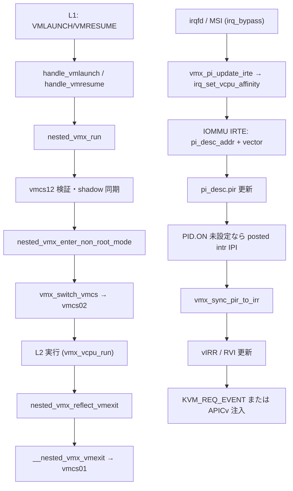

# 第16章 nested VMX と posted interrupt 概観

> **本章で読むソース**
>
> - [`arch/x86/kvm/vmx/nested.c` L5706-L5717](https://github.com/gregkh/linux/blob/v6.18.38/arch/x86/kvm/vmx/nested.c#L5706-L5717)
> - [`arch/x86/kvm/vmx/nested.c` L3813-L3895](https://github.com/gregkh/linux/blob/v6.18.38/arch/x86/kvm/vmx/nested.c#L3813-L3895)
> - [`arch/x86/kvm/vmx/nested.c` L3646-L3705](https://github.com/gregkh/linux/blob/v6.18.38/arch/x86/kvm/vmx/nested.c#L3646-L3705)
> - [`arch/x86/kvm/vmx/nested.c` L5113-L5166](https://github.com/gregkh/linux/blob/v6.18.38/arch/x86/kvm/vmx/nested.c#L5113-L5166)
> - [`arch/x86/include/asm/posted_intr.h` L19-L32](https://github.com/gregkh/linux/blob/v6.18.38/arch/x86/include/asm/posted_intr.h#L19-L32)
> - [`arch/x86/kvm/vmx/posted_intr.c` L305-L318](https://github.com/gregkh/linux/blob/v6.18.38/arch/x86/kvm/vmx/posted_intr.c#L305-L318)
> - [`arch/x86/kvm/vmx/posted_intr.c` L57-L131](https://github.com/gregkh/linux/blob/v6.18.38/arch/x86/kvm/vmx/posted_intr.c#L57-L131)
> - [`arch/x86/kvm/vmx/vmx.c` L6922-L6965](https://github.com/gregkh/linux/blob/v6.18.38/arch/x86/kvm/vmx/vmx.c#L6922-L6965)

## この章の狙い

L1 ハイパーバイザが VMX を使う nested 構成と、デバイス割り当て向け posted interrupt の概観を読む。
`nested_vmx_run` による L2 VM-entry、`vmcs12` と shadow VMCS、`pi_desc` による割り込み配送の接続点を押さえる。
本章は機構の全体像に留め、各 VMX 命令の網羅的解説は対象外とする。

## 前提

- [`vmx_vcpu_run` と VM-exit 処理](15-vmx-run-exit.md)
- [VMX 有効化と VMCS の構築](14-vmx-enable-vmcs.md)

## nested VM-entry：`nested_vmx_run`

nested が有効なとき、L1 が VMLAUNCH または VMRESUME を実行すると VM-exit ハンドラ `handle_vmlaunch` / `handle_vmresume` から `nested_vmx_run` が呼ばれる。
`nested_vmx_hardware_setup` は `kvm_vmx_exit_handlers` の VMX 命令スロットを上書きする。
nested 無効時の既定ハンドラ `handle_vmx_instruction` は #UD をキューするだけである。
`nested_vmx_run` は権限と vmcs12 の妥当性を検査したうえで `nested_vmx_enter_non_root_mode` へ進み、vmcs02 へ切り替えて L2 を実行する。

[`arch/x86/kvm/vmx/nested.c` L5706-L5717](https://github.com/gregkh/linux/blob/v6.18.38/arch/x86/kvm/vmx/nested.c#L5706-L5717)

```c
/* Emulate the VMLAUNCH instruction */
static int handle_vmlaunch(struct kvm_vcpu *vcpu)
{
	return nested_vmx_run(vcpu, true);
}

/* Emulate the VMRESUME instruction */
static int handle_vmresume(struct kvm_vcpu *vcpu)
{

	return nested_vmx_run(vcpu, false);
}
```

[`arch/x86/kvm/vmx/nested.c` L3813-L3895](https://github.com/gregkh/linux/blob/v6.18.38/arch/x86/kvm/vmx/nested.c#L3813-L3895)

```c
static int nested_vmx_run(struct kvm_vcpu *vcpu, bool launch)
{
	struct vmcs12 *vmcs12;
	enum nvmx_vmentry_status status;
	struct vcpu_vmx *vmx = to_vmx(vcpu);
	u32 interrupt_shadow = vmx_get_interrupt_shadow(vcpu);
	enum nested_evmptrld_status evmptrld_status;

	if (!nested_vmx_check_permission(vcpu))
		return 1;

	evmptrld_status = nested_vmx_handle_enlightened_vmptrld(vcpu, launch);
	if (evmptrld_status == EVMPTRLD_ERROR) {
		kvm_queue_exception(vcpu, UD_VECTOR);
		return 1;
	}

	kvm_pmu_branch_retired(vcpu);

	if (CC(evmptrld_status == EVMPTRLD_VMFAIL))
		return nested_vmx_failInvalid(vcpu);

	if (CC(!nested_vmx_is_evmptr12_valid(vmx) &&
	       vmx->nested.current_vmptr == INVALID_GPA))
		return nested_vmx_failInvalid(vcpu);

	vmcs12 = get_vmcs12(vcpu);

	/*
	 * Can't VMLAUNCH or VMRESUME a shadow VMCS. Despite the fact
	 * that there *is* a valid VMCS pointer, RFLAGS.CF is set
	 * rather than RFLAGS.ZF, and no error number is stored to the
	 * VM-instruction error field.
	 */
	if (CC(vmcs12->hdr.shadow_vmcs))
		return nested_vmx_failInvalid(vcpu);

	if (nested_vmx_is_evmptr12_valid(vmx)) {
		struct hv_enlightened_vmcs *evmcs = nested_vmx_evmcs(vmx);

		copy_enlightened_to_vmcs12(vmx, evmcs->hv_clean_fields);
		/* Enlightened VMCS doesn't have launch state */
		vmcs12->launch_state = !launch;
	} else if (enable_shadow_vmcs) {
		copy_shadow_to_vmcs12(vmx);
	}

	/*
	 * The nested entry process starts with enforcing various prerequisites
	 * on vmcs12 as required by the Intel SDM, and act appropriately when
	 * they fail: As the SDM explains, some conditions should cause the
	 * instruction to fail, while others will cause the instruction to seem
	 * to succeed, but return an EXIT_REASON_INVALID_STATE.
	 * To speed up the normal (success) code path, we should avoid checking
	 * for misconfigurations which will anyway be caught by the processor
	 * when using the merged vmcs02.
	 */
	if (CC(interrupt_shadow & KVM_X86_SHADOW_INT_MOV_SS))
		return nested_vmx_fail(vcpu, VMXERR_ENTRY_EVENTS_BLOCKED_BY_MOV_SS);

	if (CC(vmcs12->launch_state == launch))
		return nested_vmx_fail(vcpu,
			launch ? VMXERR_VMLAUNCH_NONCLEAR_VMCS
			       : VMXERR_VMRESUME_NONLAUNCHED_VMCS);

	if (nested_vmx_check_controls(vcpu, vmcs12))
		return nested_vmx_fail(vcpu, VMXERR_ENTRY_INVALID_CONTROL_FIELD);

	if (nested_vmx_check_address_space_size(vcpu, vmcs12))
		return nested_vmx_fail(vcpu, VMXERR_ENTRY_INVALID_HOST_STATE_FIELD);

	if (nested_vmx_check_host_state(vcpu, vmcs12))
		return nested_vmx_fail(vcpu, VMXERR_ENTRY_INVALID_HOST_STATE_FIELD);

	/*
	 * We're finally done with prerequisite checking, and can start with
	 * the nested entry.
	 */
	vmx->nested.nested_run_pending = 1;
	vmx->nested.has_preemption_timer_deadline = false;
	status = nested_vmx_enter_non_root_mode(vcpu, true);
	if (unlikely(status != NVMX_VMENTRY_SUCCESS))
		goto vmentry_failed;
```

## vmcs12 と vmcs02：`nested_vmx_enter_non_root_mode`

`vmcs12` は L1 がメモリ上に置くゲスト VMCS 構造体のキャッシュである。
`nested_vmx_enter_non_root_mode` は vmcs12 から vmcs02 を組み立て、`vmx_switch_vmcs` で L2 用 VMCS へ切り替える。
shadow VMCS 有効時は `copy_shadow_to_vmcs12` で shadow から vmcs12 へ同期する。

[`arch/x86/kvm/vmx/nested.c` L3646-L3705](https://github.com/gregkh/linux/blob/v6.18.38/arch/x86/kvm/vmx/nested.c#L3646-L3705)

```c
enum nvmx_vmentry_status nested_vmx_enter_non_root_mode(struct kvm_vcpu *vcpu,
							bool from_vmentry)
{
	struct vcpu_vmx *vmx = to_vmx(vcpu);
	struct vmcs12 *vmcs12 = get_vmcs12(vcpu);
	enum vm_entry_failure_code entry_failure_code;
	union vmx_exit_reason exit_reason = {
		.basic = EXIT_REASON_INVALID_STATE,
		.failed_vmentry = 1,
	};
	u32 failed_index;

	trace_kvm_nested_vmenter(kvm_rip_read(vcpu),
				 vmx->nested.current_vmptr,
				 vmcs12->guest_rip,
				 vmcs12->guest_intr_status,
				 vmcs12->vm_entry_intr_info_field,
				 vmcs12->secondary_vm_exec_control & SECONDARY_EXEC_ENABLE_EPT,
				 vmcs12->ept_pointer,
				 vmcs12->guest_cr3,
				 KVM_ISA_VMX);

	kvm_service_local_tlb_flush_requests(vcpu);

	if (!vmx->nested.nested_run_pending ||
	    !(vmcs12->vm_entry_controls & VM_ENTRY_LOAD_DEBUG_CONTROLS))
		vmx->nested.pre_vmenter_debugctl = vmx_guest_debugctl_read();
	if (kvm_mpx_supported() &&
	    (!vmx->nested.nested_run_pending ||
	     !(vmcs12->vm_entry_controls & VM_ENTRY_LOAD_BNDCFGS)))
		vmx->nested.pre_vmenter_bndcfgs = vmcs_read64(GUEST_BNDCFGS);

	if (!vmx->nested.nested_run_pending ||
	    !(vmcs12->vm_entry_controls & VM_ENTRY_LOAD_CET_STATE))
		vmcs_read_cet_state(vcpu, &vmx->nested.pre_vmenter_s_cet,
				    &vmx->nested.pre_vmenter_ssp,
				    &vmx->nested.pre_vmenter_ssp_tbl);

	/*
	 * Overwrite vmcs01.GUEST_CR3 with L1's CR3 if EPT is disabled *and*
	 * nested early checks are disabled.  In the event of a "late" VM-Fail,
	 * i.e. a VM-Fail detected by hardware but not KVM, KVM must unwind its
	 * software model to the pre-VMEntry host state.  When EPT is disabled,
	 * GUEST_CR3 holds KVM's shadow CR3, not L1's "real" CR3, which causes
	 * nested_vmx_restore_host_state() to corrupt vcpu->arch.cr3.  Stuffing
	 * vmcs01.GUEST_CR3 results in the unwind naturally setting arch.cr3 to
	 * the correct value.  Smashing vmcs01.GUEST_CR3 is safe because nested
	 * VM-Exits, and the unwind, reset KVM's MMU, i.e. vmcs01.GUEST_CR3 is
	 * guaranteed to be overwritten with a shadow CR3 prior to re-entering
	 * L1.  Don't stuff vmcs01.GUEST_CR3 when using nested early checks as
	 * KVM modifies vcpu->arch.cr3 if and only if the early hardware checks
	 * pass, and early VM-Fails do not reset KVM's MMU, i.e. the VM-Fail
	 * path would need to manually save/restore vmcs01.GUEST_CR3.
	 */
	if (!enable_ept && !nested_early_check)
		vmcs_writel(GUEST_CR3, vcpu->arch.cr3);

	vmx_switch_vmcs(vcpu, &vmx->nested.vmcs02);

	prepare_vmcs02_early(vmx, &vmx->vmcs01, vmcs12);
```

L2 からの VM-exit は第15章の `nested_vmx_reflect_vmexit` 経由で L1 へ戻る。
`__nested_vmx_vmexit` は vmcs02 の状態を vmcs12 へ書き戻し、vmcs01 へ再切り替えする。

[`arch/x86/kvm/vmx/nested.c` L5113-L5166](https://github.com/gregkh/linux/blob/v6.18.38/arch/x86/kvm/vmx/nested.c#L5113-L5166)

```c
void __nested_vmx_vmexit(struct kvm_vcpu *vcpu, u32 vm_exit_reason,
			 u32 exit_intr_info, unsigned long exit_qualification,
			 u32 exit_insn_len)
{
	struct vcpu_vmx *vmx = to_vmx(vcpu);
	struct vmcs12 *vmcs12 = get_vmcs12(vcpu);

	/* Pending MTF traps are discarded on VM-Exit. */
	vmx->nested.mtf_pending = false;

	/* trying to cancel vmlaunch/vmresume is a bug */
	WARN_ON_ONCE(vmx->nested.nested_run_pending);

#ifdef CONFIG_KVM_HYPERV
	if (kvm_check_request(KVM_REQ_GET_NESTED_STATE_PAGES, vcpu)) {
		/*
		 * KVM_REQ_GET_NESTED_STATE_PAGES is also used to map
		 * Enlightened VMCS after migration and we still need to
		 * do that when something is forcing L2->L1 exit prior to
		 * the first L2 run.
		 */
		(void)nested_get_evmcs_page(vcpu);
	}
#endif

	/* Service pending TLB flush requests for L2 before switching to L1. */
	kvm_service_local_tlb_flush_requests(vcpu);

	/*
	 * VCPU_EXREG_PDPTR will be clobbered in arch/x86/kvm/vmx/vmx.h between
	 * now and the new vmentry.  Ensure that the VMCS02 PDPTR fields are
	 * up-to-date before switching to L1.
	 */
	if (enable_ept && is_pae_paging(vcpu))
		vmx_ept_load_pdptrs(vcpu);

	leave_guest_mode(vcpu);

	if (nested_cpu_has_preemption_timer(vmcs12))
		hrtimer_cancel(&to_vmx(vcpu)->nested.preemption_timer);

	if (nested_cpu_has(vmcs12, CPU_BASED_USE_TSC_OFFSETTING)) {
		vcpu->arch.tsc_offset = vcpu->arch.l1_tsc_offset;
		if (nested_cpu_has2(vmcs12, SECONDARY_EXEC_TSC_SCALING))
			vcpu->arch.tsc_scaling_ratio = vcpu->arch.l1_tsc_scaling_ratio;
	}

	if (likely(!vmx->fail)) {
		sync_vmcs02_to_vmcs12(vcpu, vmcs12);

		if (vm_exit_reason != -1)
			prepare_vmcs12(vcpu, vmcs12, vm_exit_reason,
				       exit_intr_info, exit_qualification,
				       exit_insn_len);
```

## posted interrupt 記述子：`pi_desc`

APICv と posted interrupt では、IOMMU や他 CPU が vCPU の `pi_desc` にベクトルを書き込む。
`pir` ビットマップが割り込み要求を保持し、`control` フィールドが通知先 APIC ID と通知ベクトルを持つ。

[`arch/x86/include/asm/posted_intr.h` L19-L32](https://github.com/gregkh/linux/blob/v6.18.38/arch/x86/include/asm/posted_intr.h#L19-L32)

```c
/* Posted-Interrupt Descriptor */
struct pi_desc {
	unsigned long pir[NR_PIR_WORDS];     /* Posted interrupt requested */
	union {
		struct {
			u16	notifications; /* Suppress and outstanding bits */
			u8	nv;
			u8	rsvd_2;
			u32	ndst;
		};
		u64 control;
	};
	u32 rsvd[6];
} __aligned(64);
```

`init_vmcs` は `POSTED_INTR_DESC_ADDR` に `vmx->vt.pi_desc` の物理アドレスを設定する。
VT-d posted interrupt では `vmx_pi_update_irte` が `pi_desc_addr` と vector を `irq_set_vcpu_affinity` へ渡し、IOMMU の interrupt-remapping entry を更新する。
VMCS の `PID_POINTER_TABLE` は IPI virtualization 用の別機構である。

[`arch/x86/kvm/vmx/posted_intr.c` L305-L318](https://github.com/gregkh/linux/blob/v6.18.38/arch/x86/kvm/vmx/posted_intr.c#L305-L318)

```c
int vmx_pi_update_irte(struct kvm_kernel_irqfd *irqfd, struct kvm *kvm,
		       unsigned int host_irq, uint32_t guest_irq,
		       struct kvm_vcpu *vcpu, u32 vector)
{
	if (vcpu) {
		struct intel_iommu_pi_data pi_data = {
			.pi_desc_addr = __pa(vcpu_to_pi_desc(vcpu)),
			.vector = vector,
		};

		return irq_set_vcpu_affinity(host_irq, &pi_data);
	} else {
		return irq_set_vcpu_affinity(host_irq, NULL);
	}
}
```

## posted interrupt の配送：`vmx_vcpu_pi_load` と `vmx_sync_pir_to_irr`

vCPU が CPU へ載ると `vmx_vcpu_pi_load` が `pi_desc` の通知先 APIC ID を更新する。
ゲスト実行前の `vmx_sync_pir_to_irr` は `PID.ON` を見て `pir` を vIRR へ反映し、APICv が有効なら RVI を更新する。

[`arch/x86/kvm/vmx/posted_intr.c` L57-L131](https://github.com/gregkh/linux/blob/v6.18.38/arch/x86/kvm/vmx/posted_intr.c#L57-L131)

```c
void vmx_vcpu_pi_load(struct kvm_vcpu *vcpu, int cpu)
{
	struct pi_desc *pi_desc = vcpu_to_pi_desc(vcpu);
	struct vcpu_vt *vt = to_vt(vcpu);
	struct pi_desc old, new;
	unsigned long flags;
	unsigned int dest;

	/*
	 * To simplify hot-plug and dynamic toggling of APICv, keep PI.NDST and
	 * PI.SN up-to-date even if there is no assigned device or if APICv is
	 * deactivated due to a dynamic inhibit bit, e.g. for Hyper-V's SyncIC.
	 */
	if (!enable_apicv || !lapic_in_kernel(vcpu))
		return;

	/*
	 * If the vCPU wasn't on the wakeup list and wasn't migrated, then the
	 * full update can be skipped as neither the vector nor the destination
	 * needs to be changed.  Clear SN even if there is no assigned device,
	 * again for simplicity.
	 */
	if (pi_desc->nv != POSTED_INTR_WAKEUP_VECTOR && vcpu->cpu == cpu) {
		if (pi_test_and_clear_sn(pi_desc))
			goto after_clear_sn;
		return;
	}

	local_irq_save(flags);

	/*
	 * If the vCPU was waiting for wakeup, remove the vCPU from the wakeup
	 * list of the _previous_ pCPU, which will not be the same as the
	 * current pCPU if the task was migrated.
	 */
	if (pi_desc->nv == POSTED_INTR_WAKEUP_VECTOR) {
		raw_spinlock_t *spinlock = &per_cpu(wakeup_vcpus_on_cpu_lock, vcpu->cpu);

		/*
		 * In addition to taking the wakeup lock for the regular/IRQ
		 * context, tell lockdep it is being taken for the "sched out"
		 * context as well.  vCPU loads happens in task context, and
		 * this is taking the lock of the *previous* CPU, i.e. can race
		 * with both the scheduler and the wakeup handler.
		 */
		raw_spin_lock(spinlock);
		spin_acquire(&spinlock->dep_map, PI_LOCK_SCHED_OUT, 0, _RET_IP_);
		list_del(&vt->pi_wakeup_list);
		spin_release(&spinlock->dep_map, _RET_IP_);
		raw_spin_unlock(spinlock);
	}

	dest = cpu_physical_id(cpu);
	if (!x2apic_mode)
		dest = (dest << 8) & 0xFF00;

	old.control = READ_ONCE(pi_desc->control);
	do {
		new.control = old.control;

		/*
		 * Clear SN (as above) and refresh the destination APIC ID to
		 * handle task migration (@cpu != vcpu->cpu).
		 */
		new.ndst = dest;
		__pi_clear_sn(&new);

		/*
		 * Restore the notification vector; in the blocking case, the
		 * descriptor was modified on "put" to use the wakeup vector.
		 */
		new.nv = POSTED_INTR_VECTOR;
	} while (pi_try_set_control(pi_desc, &old.control, new.control));

	local_irq_restore(flags);
```

[`arch/x86/kvm/vmx/vmx.c` L6922-L6965](https://github.com/gregkh/linux/blob/v6.18.38/arch/x86/kvm/vmx/vmx.c#L6922-L6965)

```c
int vmx_sync_pir_to_irr(struct kvm_vcpu *vcpu)
{
	struct vcpu_vt *vt = to_vt(vcpu);
	int max_irr;
	bool got_posted_interrupt;

	if (KVM_BUG_ON(!enable_apicv, vcpu->kvm))
		return -EIO;

	if (pi_test_on(&vt->pi_desc)) {
		pi_clear_on(&vt->pi_desc);
		/*
		 * IOMMU can write to PID.ON, so the barrier matters even on UP.
		 * But on x86 this is just a compiler barrier anyway.
		 */
		smp_mb__after_atomic();
		got_posted_interrupt =
			kvm_apic_update_irr(vcpu, vt->pi_desc.pir, &max_irr);
	} else {
		max_irr = kvm_lapic_find_highest_irr(vcpu);
		got_posted_interrupt = false;
	}

	/*
	 * Newly recognized interrupts are injected via either virtual interrupt
	 * delivery (RVI) or KVM_REQ_EVENT.  Virtual interrupt delivery is
	 * disabled in two cases:
	 *
	 * 1) If L2 is running and the vCPU has a new pending interrupt.  If L1
	 * wants to exit on interrupts, KVM_REQ_EVENT is needed to synthesize a
	 * VM-Exit to L1.  If L1 doesn't want to exit, the interrupt is injected
	 * into L2, but KVM doesn't use virtual interrupt delivery to inject
	 * interrupts into L2, and so KVM_REQ_EVENT is again needed.
	 *
	 * 2) If APICv is disabled for this vCPU, assigned devices may still
	 * attempt to post interrupts.  The posted interrupt vector will cause
	 * a VM-Exit and the subsequent entry will call sync_pir_to_irr.
	 */
	if (!is_guest_mode(vcpu) && kvm_vcpu_apicv_active(vcpu))
		vmx_set_rvi(max_irr);
	else if (got_posted_interrupt)
		kvm_make_request(KVM_REQ_EVENT, vcpu);

	return max_irr;
}
```

## 処理の流れ：nested と posted interrupt の接続



## 高速化と最適化の工夫

nested では vmcs12 の事前検査を最小化し、ハードウェアが vmcs02 で検出する誤設定は fast path に任せる。
shadow VMCS は頻繁に読む vmcs12 フィールドの VMREAD/VMWRITE を減らす。
posted interrupt はデバイス割り込みを IOMMU 経由で `pir` へ直接書き、VM-exit とソフト LAPIC 注入を省略する。
`__vmx_deliver_posted_interrupt` は `PID.ON` が未設定なら `kvm_vcpu_trigger_posted_interrupt(POSTED_INTR_VECTOR)` で通知 IPI を送り、vCPU に `pir` 同期を促す。
`vmx_vcpu_pi_load` は vCPU が別 CPU から移行したとき、または `pi_desc->nv == POSTED_INTR_WAKEUP_VECTOR` のとき full update を行う。
移行がなく wakeup vector でない場合だけ SN クリアのみで済ませる。

## まとめ

nested VMX は `nested_vmx_run` が vmcs12 を検証し vmcs02 へマージして L2 を実行する。
VM-exit は `__nested_vmx_vmexit` が vmcs12 へ状態を戻し vmcs01 へ復帰する。
posted interrupt は `pi_desc` が IOMMU からの割り込み要求を受け、`vmx_sync_pir_to_irr` が LAPIC の IRR へ橋渡しする。

## 関連する章

- [`vmx_vcpu_run` と VM-exit 処理](15-vmx-run-exit.md)
- [VMX 有効化と VMCS の構築](14-vmx-enable-vmcs.md)
- [irqchip、LAPIC、割り込み注入](../part07-irq-io/19-irqchip-lapic-injection.md)
